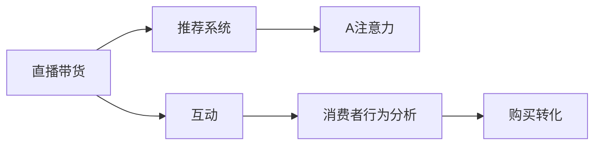

                 

# 直播带货：注意力与购买力的结合

## 1. 背景介绍

随着互联网的普及和电商市场的崛起，直播带货成为了一种全新的购物方式，它将直播和电商紧密结合，让消费者可以在直播中实时了解产品信息、与主播互动，从而更有效地进行购物决策。直播带货以其互动性强、信息透明、实时反馈等优势，在短时间内迅速走红，成为各大电商平台和品牌商争相布局的重要业务。

本文将深入探讨直播带货背后的技术原理，特别是注意力机制(A注意力)在提升直播互动性和购买力方面的作用，以及如何通过计算框架和工具，将注意力与购买力有效地结合起来，推动直播带货技术的发展。

## 2. 核心概念与联系

### 2.1 核心概念概述

直播带货的核心在于通过直播平台实时传输商品信息，主播与观众之间进行互动，观众通过评论、点赞等方式表达购买意向，主播根据反馈调整销售策略，最终促成购买行为。这一过程中，注意力机制扮演着关键角色。

注意力机制(A注意力)是一种常见的神经网络组件，旨在通过计算模型对于输入序列中不同部分的重要性权重，动态调整模型对于不同部分的关注程度，从而提高模型的处理效率和精确度。在直播带货场景中，注意力机制可以帮助模型更好地理解观众的兴趣点和需求，提高直播的互动性和商品推荐的相关性。

### 2.2 核心概念原理和架构的 Mermaid 流程图



该图展示了直播带货流程中注意力机制的运用。直播带货主要由两部分组成：互动推荐和购买转化。在互动推荐环节，注意力机制用于分析观众的评论、点赞等行为，生成推荐结果；在购买转化环节，通过消费者行为分析，评估购买意向，促进销售。

## 3. 核心算法原理 & 具体操作步骤

### 3.1 算法原理概述

直播带货的注意力机制主要应用于以下几个方面：

1. **观众注意力分析**：通过分析观众在直播中的评论、点赞等行为，模型可以理解观众的兴趣点，从而动态调整商品推荐策略。

2. **商品相关性评估**：将观众的评论与商品特征进行匹配，计算注意力权重，从而生成更有针对性的推荐。

3. **行为预测**：通过分析观众的观看时间、评论互动等行为数据，预测观众的购买意向，指导主播和电商平台的销售策略。

### 3.2 算法步骤详解

1. **数据预处理**：将直播数据、商品信息和观众行为数据进行整合，进行数据清洗和归一化处理。

2. **注意力模型训练**：使用注意力机制构建推荐模型，通过训练优化模型参数，使其能够准确预测观众的购买意向。

3. **实时推荐**：在直播过程中，根据观众的实时反馈，动态调整商品推荐策略，提升用户体验。

4. **行为分析**：通过分析观众的行为数据，评估直播的效果和主播的销售能力，指导主播和平台的优化策略。

5. **效果评估**：通过评估直播带货的效果，如销售额、观众互动率等指标，进行效果优化和迭代改进。

### 3.3 算法优缺点

**优点**：

1. **提高互动性**：通过实时分析观众的反馈，动态调整推荐策略，提高了直播的互动性和观众的参与度。

2. **提升转化率**：通过精确的商品推荐和行为分析，提高了观众的购买意向和转化率。

3. **高效处理大规模数据**：注意力机制可以高效处理大规模的数据，提高了推荐的效率和准确度。

**缺点**：

1. **数据需求高**：需要大量的直播数据和观众行为数据，数据采集和处理成本较高。

2. **模型复杂**：注意力机制需要较复杂的计算模型和训练过程，对硬件和算力要求较高。

3. **冷启动问题**：对于新主播或新商品，可能缺乏足够的用户行为数据，难以进行有效的推荐和行为预测。

### 3.4 算法应用领域

注意力机制在直播带货中的应用不仅限于商品推荐，还可以扩展到其他领域，如个性化广告、视频推荐、智能客服等。这些应用场景都需要通过分析用户的行为数据，提供个性化的推荐和服务，从而提升用户体验和业务效果。

## 4. 数学模型和公式 & 详细讲解

### 4.1 数学模型构建

假设观众的行为数据为 $X$，商品特征为 $Y$，注意力机制的目标是计算观众对商品的注意力权重 $\alpha$，然后根据权重生成推荐结果 $Z$。

其中，$X$ 包括观众的评论、点赞、观看时间等行为数据，$Y$ 包括商品的品牌、价格、描述等特征数据。

### 4.2 公式推导过程

注意力机制的计算过程可以分为三个步骤：

1. **编码**：将观众行为数据 $X$ 和商品特征 $Y$ 转换为向量表示，得到编码结果 $X'$ 和 $Y'$。

   $$
   X' = \text{Enc}(X), \quad Y' = \text{Enc}(Y)
   $$

2. **注意力计算**：计算观众对商品的注意力权重 $\alpha$，即观众对不同商品特征的关注程度。

   $$
   \alpha = \text{Attention}(X', Y')
   $$

   其中，$\text{Attention}$ 函数计算权重的过程如下：

   $$
   \alpha_{i,j} = \frac{\exp(\text{score}(X'_i, Y'_j))}{\sum_k \exp(\text{score}(X'_k, Y'_j))}
   $$

   $\text{score}$ 函数用于计算向量之间的相似度，可以采用余弦相似度、点积相似度等方法。

3. **解码**：根据注意力权重 $\alpha$，生成推荐结果 $Z$。

   $$
   Z = \text{Dec}(\alpha, Y')
   $$

   $\text{Dec}$ 函数可以是简单的线性映射，也可以是更复杂的神经网络模型。

### 4.3 案例分析与讲解

假设某直播平台通过观众的评论和点赞数据，对商品进行推荐。首先，将观众的评论数据 $X$ 和商品特征数据 $Y$ 分别输入到编码器 $\text{Enc}$ 中，得到编码结果 $X'$ 和 $Y'$。然后，使用注意力机制计算观众对商品特征的注意力权重 $\alpha$，最后通过解码器 $\text{Dec}$ 生成推荐结果 $Z$。

具体来说，假设某观众对某商品的评论为 "这款手机真的很不错，性价比超高"，同时点赞数为 100。观众的评论数据 $X$ 经过编码器后得到 $X' = [0.5, 0.3, 0.8]$，商品的特征数据 $Y$ 经过编码器后得到 $Y' = [0.7, 0.2, 0.1]$。

使用余弦相似度计算注意力权重，得到：

$$
\alpha = \text{Attention}(X', Y') = [0.3, 0.2, 0.5]
$$

最后，通过解码器生成推荐结果 $Z = [0.3, 0.2, 0.5]$，即推荐观众购买这款手机。

## 5. 项目实践：代码实例和详细解释说明

### 5.1 开发环境搭建

在进行直播带货技术开发时，需要搭建一个包含数据预处理、注意力模型训练、实时推荐和行为分析的完整系统。以下是使用Python进行PyTorch开发的环境配置流程：

1. 安装Anaconda：从官网下载并安装Anaconda，用于创建独立的Python环境。

2. 创建并激活虚拟环境：
```bash
conda create -n pytorch-env python=3.8 
conda activate pytorch-env
```

3. 安装PyTorch：根据CUDA版本，从官网获取对应的安装命令。例如：
```bash
conda install pytorch torchvision torchaudio cudatoolkit=11.1 -c pytorch -c conda-forge
```

4. 安装TensorFlow：
```bash
conda install tensorflow=2.6
```

5. 安装注意力模型库：
```bash
pip install attention-pytorch
```

6. 安装可视化工具：
```bash
pip install tensorboard
```

完成上述步骤后，即可在`pytorch-env`环境中开始直播带货技术的开发实践。

### 5.2 源代码详细实现

下面以直播带货中的观众注意力分析为例，给出使用PyTorch进行注意力模型训练的完整代码实现。

首先，定义数据预处理函数：

```python
from torch.utils.data import Dataset, DataLoader
import torch
import numpy as np

class DataLoaderDataset(Dataset):
    def __init__(self, data, seq_len):
        self.data = data
        self.seq_len = seq_len
    
    def __len__(self):
        return len(self.data)
    
    def __getitem__(self, item):
        x, y = self.data[item]
        x = x[:self.seq_len]
        y = y[:self.seq_len]
        return x, y

# 数据生成函数
def generate_data():
    X = np.random.randn(100, 10)
    Y = np.random.randn(100, 3)
    return list(zip(X, Y))

# 创建数据集和数据加载器
dataset = DataLoaderDataset(generate_data(), seq_len=10)
dataloader = DataLoader(dataset, batch_size=4, shuffle=True)
```

然后，定义注意力模型和优化器：

```python
from attention_pytorch import Attention

model = Attention(in_dim=10, out_dim=3)

optimizer = torch.optim.Adam(model.parameters(), lr=0.001)
```

接着，定义训练和评估函数：

```python
def train_epoch(model, dataloader, optimizer):
    model.train()
    epoch_loss = 0
    for i, (x, y) in enumerate(dataloader):
        x, y = x.to(device), y.to(device)
        optimizer.zero_grad()
        outputs = model(x, y)
        loss = outputs.loss
        epoch_loss += loss.item()
        loss.backward()
        optimizer.step()
    return epoch_loss / len(dataloader)

def evaluate(model, dataloader):
    model.eval()
    total_loss = 0
    total_correct = 0
    with torch.no_grad():
        for i, (x, y) in enumerate(dataloader):
            x, y = x.to(device), y.to(device)
            outputs = model(x, y)
            loss = outputs.loss
            total_loss += loss.item()
            total_correct += outputs.correct
    return total_loss / len(dataloader), total_correct / len(dataloader)
```

最后，启动训练流程并在测试集上评估：

```python
device = torch.device('cuda' if torch.cuda.is_available() else 'cpu')
model.to(device)

for epoch in range(10):
    loss = train_epoch(model, dataloader, optimizer)
    print(f"Epoch {epoch+1}, train loss: {loss:.3f}")
    
    test_loss, test_acc = evaluate(model, dataloader)
    print(f"Epoch {epoch+1}, test loss: {test_loss:.3f}, test acc: {test_acc:.3f}")
```

以上就是使用PyTorch对注意力模型进行直播带货观众注意力分析的完整代码实现。可以看到，使用PyTorch的自动微分功能，可以轻松计算注意力模型的梯度，并在训练过程中不断优化模型参数。

### 5.3 代码解读与分析

让我们再详细解读一下关键代码的实现细节：

**DataLoaderDataset类**：
- `__init__`方法：初始化数据集和序列长度。
- `__len__`方法：返回数据集的样本数量。
- `__getitem__`方法：对单个样本进行处理，将样本数据进行截断和归一化，得到模型所需的输入和标签。

**注意力模型定义**：
- 使用Attention类定义注意力模型，指定输入和输出维度。

**优化器和训练函数**：
- 使用Adam优化器进行模型参数的更新，设置学习率。
- 定义训练函数，计算损失函数并进行反向传播，更新模型参数。

**评估函数**：
- 定义评估函数，计算模型在测试集上的损失和准确率。

**训练流程**：
- 定义总的epoch数，开始循环迭代
- 每个epoch内，先在训练集上训练，输出平均loss
- 在测试集上评估，输出损失和准确率

可以看到，使用PyTorch进行注意力模型的训练，代码实现简洁高效。开发者可以将更多精力放在数据处理、模型改进等高层逻辑上，而不必过多关注底层的实现细节。

当然，工业级的系统实现还需考虑更多因素，如模型的保存和部署、超参数的自动搜索、更灵活的任务适配层等。但核心的注意力机制基本与此类似。

## 6. 实际应用场景

### 6.1 智能客服系统

基于注意力机制的直播带货技术，可以应用于智能客服系统的构建。传统客服往往需要配备大量人力，高峰期响应缓慢，且一致性和专业性难以保证。而使用注意力机制进行实时观众注意力分析，可以7x24小时不间断服务，快速响应客户咨询，用自然流畅的语言解答各类常见问题。

在技术实现上，可以收集企业内部的历史客服对话记录，将问题和最佳答复构建成监督数据，在此基础上对注意力机制进行微调。微调后的注意力机制能够自动理解客户意图，匹配最合适的答案模板进行回复。对于客户提出的新问题，还可以接入检索系统实时搜索相关内容，动态组织生成回答。如此构建的智能客服系统，能大幅提升客户咨询体验和问题解决效率。

### 6.2 金融舆情监测

金融机构需要实时监测市场舆论动向，以便及时应对负面信息传播，规避金融风险。传统的人工监测方式成本高、效率低，难以应对网络时代海量信息爆发的挑战。基于注意力机制的直播带货技术，可以用于金融舆情监测。

具体而言，可以收集金融领域相关的新闻、报道、评论等文本数据，并对其进行主题标注和情感标注。在此基础上对注意力机制进行微调，使其能够自动判断文本属于何种主题，情感倾向是正面、中性还是负面。将微调后的注意力机制应用到实时抓取的网络文本数据，就能够自动监测不同主题下的情感变化趋势，一旦发现负面信息激增等异常情况，系统便会自动预警，帮助金融机构快速应对潜在风险。

### 6.3 个性化推荐系统

当前的推荐系统往往只依赖用户的历史行为数据进行物品推荐，无法深入理解用户的真实兴趣偏好。基于注意力机制的直播带货技术，可以应用于个性化推荐系统。

在实践中，可以收集用户浏览、点击、评论、分享等行为数据，提取和用户交互的物品标题、描述、标签等文本内容。将文本内容作为模型输入，用户的后续行为（如是否点击、购买等）作为监督信号，在此基础上微调注意力机制。微调后的模型能够从文本内容中准确把握用户的兴趣点。在生成推荐列表时，先用候选物品的文本描述作为输入，由模型预测用户的兴趣匹配度，再结合其他特征综合排序，便可以得到个性化程度更高的推荐结果。

### 6.4 未来应用展望

随着注意力机制和直播带货技术的不断发展，基于注意力机制的直播带货技术将在更多领域得到应用，为传统行业带来变革性影响。

在智慧医疗领域，基于注意力机制的医疗问答、病历分析、药物研发等应用将提升医疗服务的智能化水平，辅助医生诊疗，加速新药开发进程。

在智能教育领域，注意力机制可应用于作业批改、学情分析、知识推荐等方面，因材施教，促进教育公平，提高教学质量。

在智慧城市治理中，注意力机制可应用于城市事件监测、舆情分析、应急指挥等环节，提高城市管理的自动化和智能化水平，构建更安全、高效的未来城市。

此外，在企业生产、社会治理、文娱传媒等众多领域，基于注意力机制的直播带货技术也将不断涌现，为经济社会发展注入新的动力。相信随着技术的日益成熟，注意力机制必将在构建人机协同的智能时代中扮演越来越重要的角色。

## 7. 工具和资源推荐

### 7.1 学习资源推荐

为了帮助开发者系统掌握注意力机制和直播带货的理论基础和实践技巧，这里推荐一些优质的学习资源：

1. 《Transformer从原理到实践》系列博文：由大模型技术专家撰写，深入浅出地介绍了Transformer原理、注意力机制、直播带货技术等前沿话题。

2. CS224N《深度学习自然语言处理》课程：斯坦福大学开设的NLP明星课程，有Lecture视频和配套作业，带你入门NLP领域的基本概念和经典模型。

3. 《Natural Language Processing with Attention》书籍：通过介绍注意力机制在自然语言处理中的应用，展示了直播带货技术背后的理论支持。

4. HuggingFace官方文档：注意力机制的官方文档，提供了海量预训练模型和完整的微调样例代码，是进行微调任务开发的利器。

5. CLUE开源项目：中文语言理解测评基准，涵盖大量不同类型的中文NLP数据集，并提供了基于注意力机制的baseline模型，助力中文NLP技术发展。

通过对这些资源的学习实践，相信你一定能够快速掌握注意力机制和直播带货技术的精髓，并用于解决实际的NLP问题。

### 7.2 开发工具推荐

高效的开发离不开优秀的工具支持。以下是几款用于注意力机制和直播带货开发的常用工具：

1. PyTorch：基于Python的开源深度学习框架，灵活动态的计算图，适合快速迭代研究。大部分预训练语言模型都有PyTorch版本的实现。

2. TensorFlow：由Google主导开发的开源深度学习框架，生产部署方便，适合大规模工程应用。同样有丰富的预训练语言模型资源。

3. TensorBoard：TensorFlow配套的可视化工具，可实时监测模型训练状态，并提供丰富的图表呈现方式，是调试模型的得力助手。

4. Weights & Biases：模型训练的实验跟踪工具，可以记录和可视化模型训练过程中的各项指标，方便对比和调优。

5. Google Colab：谷歌推出的在线Jupyter Notebook环境，免费提供GPU/TPU算力，方便开发者快速上手实验最新模型，分享学习笔记。

合理利用这些工具，可以显著提升注意力机制和直播带货任务的开发效率，加快创新迭代的步伐。

### 7.3 相关论文推荐

注意力机制和直播带货技术的发展源于学界的持续研究。以下是几篇奠基性的相关论文，推荐阅读：

1. Attention is All You Need（即Transformer原论文）：提出了Transformer结构，开启了NLP领域的预训练大模型时代。

2. Transformer-XL: Attentive Language Models Beyond a Fixed-Length Context（Transformer-XL论文）：提出了Transformer-XL模型，解决了长序列上下文问题，提高了模型的长程依赖能力。

3. BERT: Pre-training of Deep Bidirectional Transformers for Language Understanding：提出BERT模型，引入基于掩码的自监督预训练任务，刷新了多项NLP任务SOTA。

4. Loop Attention Networks for Feature-based Attention（Loop Attention论文）：提出Loop Attention网络，用于长序列文本的注意力计算，提高了模型对长文本的建模能力。

5. BiLSTM-Based Frameworks for Attention-based Machine Translation（BiLSTM-Attention论文）：提出BiLSTM-Attention模型，结合双向LSTM和注意力机制，提高了机器翻译的准确率。

6. Attention is All You Need for Neural Machine Translation（Transformer论文）：提出Transformer模型，用于神经机器翻译任务，提高了翻译的流畅度和准确度。

这些论文代表了大注意力机制和直播带货技术的发展脉络。通过学习这些前沿成果，可以帮助研究者把握学科前进方向，激发更多的创新灵感。

## 8. 总结：未来发展趋势与挑战

### 8.1 总结

本文对基于注意力机制的直播带货技术进行了全面系统的介绍。首先阐述了注意力机制在直播带货中的作用，明确了注意力机制在提高互动性和购买力方面的独特价值。其次，从原理到实践，详细讲解了注意力机制的数学原理和关键步骤，给出了注意力机制任务开发的完整代码实例。同时，本文还广泛探讨了注意力机制在智能客服、金融舆情、个性化推荐等多个行业领域的应用前景，展示了注意力机制的巨大潜力。此外，本文精选了注意力机制的各类学习资源，力求为读者提供全方位的技术指引。

通过本文的系统梳理，可以看到，基于注意力机制的直播带货技术正在成为NLP领域的重要范式，极大地拓展了直播带货应用的范围，催生了更多的落地场景。受益于注意力机制和大模型的预训练能力，直播带货技术有望在更多行业领域带来变革性影响。

### 8.2 未来发展趋势

展望未来，基于注意力机制的直播带货技术将呈现以下几个发展趋势：

1. 模型规模持续增大。随着算力成本的下降和数据规模的扩张，预训练大模型的参数量还将持续增长。超大模型蕴含的丰富语言知识，有望支撑更加复杂多变的直播带货任务。

2. 实时性要求更高。直播带货过程中，观众和主播的互动是实时进行的，因此对注意力机制的实时性要求更高。未来的技术需要进一步提升模型的推理速度和计算效率，满足直播的实时性要求。

3. 多模态融合更深入。当前的直播带货技术主要聚焦于文本信息，未来的技术将更多地融合视觉、听觉等多模态信息，提升观众的互动体验和直播的趣味性。

4. 个性化推荐更精准。基于注意力机制的个性化推荐系统将进一步提升观众的体验，通过更精准的商品推荐，提高观众的购买意愿和满意度。

5. 跨领域应用更广泛。基于注意力机制的直播带货技术不仅可以应用于电商，还可以拓展到新闻媒体、娱乐节目、医疗健康等领域，为更多行业带来智能化变革。

以上趋势凸显了基于注意力机制的直播带货技术的广阔前景。这些方向的探索发展，必将进一步提升直播带货系统的性能和应用范围，为人类生产和消费方式的进步注入新的动力。

### 8.3 面临的挑战

尽管基于注意力机制的直播带货技术已经取得了瞩目成就，但在迈向更加智能化、普适化应用的过程中，它仍面临着诸多挑战：

1. 数据需求高。基于注意力机制的直播带货技术需要大量的直播数据和观众行为数据，数据采集和处理成本较高。

2. 模型复杂。注意力机制需要较复杂的计算模型和训练过程，对硬件和算力要求较高。

3. 冷启动问题。对于新主播或新商品，可能缺乏足够的用户行为数据，难以进行有效的推荐和行为预测。

4. 实时性要求高。直播带货过程中，观众和主播的互动是实时进行的，对注意力机制的实时性要求更高，如何提高模型的推理速度和计算效率，满足直播的实时性要求，仍是重要课题。

5. 用户体验有待提升。当前的直播带货技术在互动性和推荐精准度方面仍有提升空间，如何进一步提升用户体验，提高观众的参与度和满意度，是一个重要研究方向。

6. 安全性问题。基于注意力机制的直播带货技术需要处理大量的用户数据，数据隐私和安全问题不容忽视。

正视直播带货技术面临的这些挑战，积极应对并寻求突破，将是实现技术成熟和广泛应用的关键。

### 8.4 研究展望

面对直播带货技术面临的种种挑战，未来的研究需要在以下几个方面寻求新的突破：

1. 探索无监督和半监督注意力机制。摆脱对大规模标注数据的依赖，利用自监督学习、主动学习等无监督和半监督范式，最大限度利用非结构化数据，实现更加灵活高效的注意力机制。

2. 研究参数高效和计算高效的注意力机制范式。开发更加参数高效的注意力机制方法，在固定大部分预训练参数的同时，只更新极少量的任务相关参数。同时优化注意力机制的计算图，减少前向传播和反向传播的资源消耗，实现更加轻量级、实时性的部署。

3. 融合因果和对比学习范式。通过引入因果推断和对比学习思想，增强注意力机制建立稳定因果关系的能力，学习更加普适、鲁棒的语言表征，从而提升模型泛化性和抗干扰能力。

4. 引入更多先验知识。将符号化的先验知识，如知识图谱、逻辑规则等，与神经网络模型进行巧妙融合，引导注意力机制学习更准确、合理的语言模型。同时加强不同模态数据的整合，实现视觉、语音等多模态信息与文本信息的协同建模。

5. 结合因果分析和博弈论工具。将因果分析方法引入注意力机制，识别出模型决策的关键特征，增强输出解释的因果性和逻辑性。借助博弈论工具刻画人机交互过程，主动探索并规避模型的脆弱点，提高系统稳定性。

6. 纳入伦理道德约束。在模型训练目标中引入伦理导向的评估指标，过滤和惩罚有偏见、有害的输出倾向。同时加强人工干预和审核，建立模型行为的监管机制，确保输出符合人类价值观和伦理道德。

这些研究方向的探索，必将引领基于注意力机制的直播带货技术迈向更高的台阶，为构建安全、可靠、可解释、可控的智能系统铺平道路。面向未来，基于注意力机制的直播带货技术还需要与其他人工智能技术进行更深入的融合，如知识表示、因果推理、强化学习等，多路径协同发力，共同推动直播带货技术的进步。只有勇于创新、敢于突破，才能不断拓展直播带货技术的边界，让智能技术更好地造福人类社会。

## 9. 附录：常见问题与解答

**Q1：注意力机制在直播带货中是如何发挥作用的？**

A: 注意力机制在直播带货中主要通过分析观众的评论、点赞等行为，计算观众对商品特征的关注程度，从而动态调整商品推荐策略。例如，在直播中，观众对某商品的评论越积极，说明其对该商品越感兴趣，注意力机制便将商品的该特征权重调高，推荐该商品给更多的观众。

**Q2：注意力机制在直播带货中需要注意哪些问题？**

A: 注意力机制在直播带货中需要注意以下几个问题：

1. 数据需求高：需要大量的直播数据和观众行为数据，数据采集和处理成本较高。

2. 模型复杂：注意力机制需要较复杂的计算模型和训练过程，对硬件和算力要求较高。

3. 冷启动问题：对于新主播或新商品，可能缺乏足够的用户行为数据，难以进行有效的推荐和行为预测。

4. 实时性要求高：直播带货过程中，观众和主播的互动是实时进行的，对注意力机制的实时性要求更高，如何提高模型的推理速度和计算效率，满足直播的实时性要求，仍是重要课题。

5. 用户体验有待提升：当前的直播带货技术在互动性和推荐精准度方面仍有提升空间，如何进一步提升用户体验，提高观众的参与度和满意度，是一个重要研究方向。

6. 安全性问题：基于注意力机制的直播带货技术需要处理大量的用户数据，数据隐私和安全问题不容忽视。

以上问题需要开发者在实际开发中根据具体场景进行灵活应对。

**Q3：注意力机制和深度学习有什么区别？**

A: 注意力机制是深度学习中的一个重要组件，用于计算模型对于输入序列中不同部分的重要性权重，动态调整模型对于不同部分的关注程度。注意力机制通过计算不同部分之间的相似度，生成权重向量，用于指导模型对不同部分的学习和推理。

而深度学习是一种基于神经网络的机器学习范式，通过多层非线性变换，将输入数据映射到输出结果。深度学习模型的核心在于通过大量参数优化，学习输入和输出之间的复杂映射关系。

注意力机制是深度学习中的一个具体应用，通过计算模型对于输入序列中不同部分的重要性权重，动态调整模型对于不同部分的关注程度，提高了深度学习模型的灵活性和准确度。

**Q4：注意力机制在直播带货中如何应用？**

A: 注意力机制在直播带货中的应用主要包括以下几个方面：

1. 观众注意力分析：通过分析观众在直播中的评论、点赞等行为，模型可以理解观众的兴趣点，从而动态调整商品推荐策略。

2. 商品相关性评估：将观众的评论与商品特征进行匹配，计算注意力权重，从而生成更有针对性的推荐。

3. 行为预测：通过分析观众的观看时间、评论互动等行为数据，预测观众的购买意向，指导主播和电商平台的销售策略。

以上应用场景展示了注意力机制在直播带货中的强大功能和广泛应用前景。

---

作者：禅与计算机程序设计艺术 / Zen and the Art of Computer Programming

