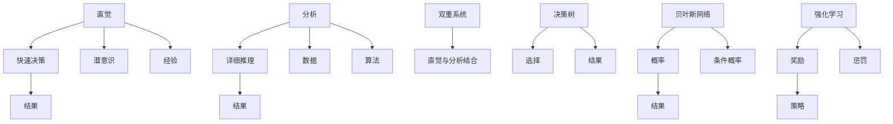

                 

## 1. 背景介绍

### 1.1 问题由来
在人工智能（AI）的发展过程中，人类直觉与计算机分析的结合一直是探讨的核心。随着深度学习、强化学习、迁移学习等技术的不断进步，机器在处理数据和做出决策时已经展现出卓越的能力。然而，如何使机器真正具备人类直觉和决策的深度，始终是AI研究领域的热点。

### 1.2 问题核心关键点
决策过程中，人类的直觉和计算机分析在处理信息、做出选择上发挥着不可或缺的作用。直觉往往基于经验、直觉和潜意识，快速但可能存在偏差。计算机分析则依赖于算法、数据和模型，精确但可能缺乏灵活性和创新性。将这两者有机结合，以提升决策效率和准确性，是决策科学和人工智能领域的前沿课题。

### 1.3 问题研究意义
研究人类直觉与计算机分析的结合，有助于：
- 提升决策效率。通过利用直觉和分析的优势，快速处理大量复杂信息，做出更加精确和高效的决策。
- 增强决策质量。融合直觉和分析，使得决策更加灵活多变，能更好地适应未知和动态环境。
- 拓展AI应用范围。将直觉与分析相结合的决策方法，广泛应用于医疗、金融、管理等多个领域，推动AI技术的普及和应用。
- 促进跨学科交流。决策科学与AI技术的结合，为不同领域的专家提供了交流平台，促进技术革新和学科发展。

## 2. 核心概念与联系

### 2.1 核心概念概述

为更好地理解直觉与分析在决策过程中的结合，本节将介绍几个关键概念：

- **直觉（Intuition）**：指基于经验和知识，未经正式计算或推理即能快速做出判断的能力。在决策中，直觉往往源于丰富的经验积累和潜意识反应。
- **分析（Analysis）**：指通过正式的计算、推理和模型预测来做出决策的过程。在AI中，分析依赖于数据、算法和计算资源。
- **双重系统（Dual-System Thinking）**：心理学家丹尼尔·卡尼曼（Daniel Kahneman）提出的概念，认为人类思维可分为快速直觉（System 1）和慢速分析（System 2）两个系统。System 1负责直觉和快速的决策，而System 2负责详细分析和深思熟虑的决策。
- **决策树（Decision Tree）**：一种常用的分析工具，通过树形结构展示决策过程，每个节点代表一个选择，叶节点代表结果。
- **贝叶斯网络（Bayesian Network）**：一种概率图模型，通过条件概率表达变量之间的关系，用于不确定性下的决策分析。
- **强化学习（Reinforcement Learning）**：一种通过奖励和惩罚来训练AI模型做出决策的学习方式。在长期互动中，模型学习最优策略。

这些概念之间通过以下Mermaid流程图建立联系：



该图展示了直觉和分析在决策过程中如何相互配合：

1. 直觉基于经验和潜意识，快速做出初步判断。
2. 分析通过数据和算法，提供详尽的推理和预测。
3. 双重系统整合直觉和分析，优化决策过程。
4. 决策树和贝叶斯网络作为分析工具，辅助做出决策。
5. 强化学习通过奖励和惩罚，不断优化决策策略。

这些概念共同构成了决策科学与AI结合的理论框架，帮助理解人类和机器如何协同处理复杂问题。

## 3. 核心算法原理 & 具体操作步骤

### 3.1 算法原理概述

基于直觉与分析的双重系统决策方法，融合了人类直觉和计算机分析的优势，适用于复杂决策场景。其核心思想是：
1. 利用直觉快速过滤信息，筛选出关键变量。
2. 通过分析深度挖掘信息，精确计算结果。
3. 结合直觉和分析，生成综合判断。

### 3.2 算法步骤详解

双重系统决策方法通常包括以下关键步骤：

**Step 1: 数据收集与预处理**
- 收集与决策问题相关的各类数据，包括历史数据、专家意见、实时数据等。
- 对数据进行清洗、归一化和特征工程，确保数据质量。

**Step 2: 初始直觉判断**
- 根据直觉快速判断数据中的关键变量和重要信息。
- 将初步判断结果作为分析的起点，引导分析方向。

**Step 3: 详细分析**
- 构建分析模型，使用决策树、贝叶斯网络、强化学习等工具。
- 输入处理后的数据，运行分析模型，计算各变量的影响权重和预测结果。
- 详细分析过程中，不断回溯和调整模型参数，确保结果的精确性。

**Step 4: 综合判断**
- 将直觉判断结果与分析结果进行综合，生成最终决策。
- 在决策过程中，可以设定规则或权重，根据具体情况调整直觉与分析的相对重要性。

**Step 5: 评估与反馈**
- 对决策结果进行评估，判断是否达到预期效果。
- 根据评估结果，不断调整直觉与分析的权重，优化决策过程。
- 引入学习机制，使决策系统能够根据经验不断优化，逐步提升决策质量。

### 3.3 算法优缺点

基于直觉与分析的双重系统决策方法，具有以下优点：
1. 综合利用直觉和分析的优势，快速精确地做出决策。
2. 结合人类经验和AI分析，提高决策的全面性和灵活性。
3. 在复杂多变的场景下，能更好地适应环境变化。

同时，该方法也存在一些局限：
1. 直觉判断的主观性强，可能导致决策偏差。
2. 分析模型依赖于数据和算法质量，可能出现误判。
3. 综合判断过程中，难以量化直觉和分析的权重。
4. 反馈和调整机制需要精细设计，否则可能陷入局部最优。

尽管存在这些局限性，但双重系统决策方法在实际应用中已经显示出其强大的潜力，尤其在复杂决策和高风险场景中，表现尤为突出。

### 3.4 算法应用领域

双重系统决策方法已经在多个领域中得到应用，包括：

- 金融风险评估：结合直觉和分析，快速评估贷款申请、投资风险等。
- 医疗诊断：结合临床经验和算法模型，提高诊断准确性和治疗效果。
- 商业决策：利用市场直觉和分析模型，制定精准的市场策略和产品规划。
- 城市管理：通过专家意见和数据分析，优化城市规划和资源配置。
- 航空安全：结合飞行员经验和系统分析，提高飞行安全性和效率。

## 4. 数学模型和公式 & 详细讲解

### 4.1 数学模型构建

在本节中，我们将使用数学语言对双重系统决策方法进行严格表述。

记决策问题为 $D$，包含变量 $X=\{x_1, x_2, ..., x_n\}$，其中 $x_i$ 为第 $i$ 个决策变量。设 $Y$ 为决策结果，$u$ 为决策者对决策变量 $x$ 的直觉判断权重，$a$ 为分析模型计算的结果权重。则双重系统决策模型的数学形式为：

$$
f(D;u,a) = \sum_{i=1}^{n}u_ix_i + \sum_{i=1}^{n}a_iy_i
$$

其中 $u_i$ 为变量 $x_i$ 的直觉判断权重，$a_i$ 为变量 $x_i$ 的分析结果权重。

### 4.2 公式推导过程

在双重系统决策中，直觉判断和分析结果的综合权重 $u_i$ 和 $a_i$ 通常需要根据实际情况进行设定。一种常见的方法是通过专家访谈和经验评估，确定直觉和分析的相对重要性。对于较为复杂的问题，可以通过多轮迭代和反馈，优化权重设定。

具体而言，假设决策问题 $D$ 包含 $n$ 个决策变量 $x_1, x_2, ..., x_n$，根据直觉判断得到变量权重 $u_i$，根据分析模型得到变量权重 $a_i$。则综合决策结果 $f(D;u,a)$ 可以表示为：

$$
f(D;u,a) = \sum_{i=1}^{n}u_ix_i + \sum_{i=1}^{n}a_iy_i
$$

其中 $y_i$ 为变量 $x_i$ 的分析结果，$u_i$ 和 $a_i$ 的设定需要考虑多个因素，如变量的影响程度、数据的质量和可靠性等。

### 4.3 案例分析与讲解

以金融风险评估为例，分析模型可能使用信用评分模型、违约预测模型等，通过大量历史数据训练得到。直觉判断则由经验丰富的信贷专家给出，根据历史经验和市场趋势，快速筛选关键变量和判断风险等级。

假设某银行的贷款申请 $D$ 包含变量 $x_1$（年收入）、$x_2$（还款记录）、$x_3$（职业）等，根据信用评分模型计算得到变量权重 $a_1, a_2, a_3$。信贷专家根据直觉判断，得到变量权重 $u_1, u_2, u_3$。则综合决策结果可以表示为：

$$
f(D;u,a) = u_1x_1 + u_2x_2 + u_3x_3 + a_1y_1 + a_2y_2 + a_3y_3
$$

其中 $y_1$ 为变量 $x_1$ 的信用评分结果，$u_1, u_2, u_3$ 和 $a_1, a_2, a_3$ 的具体设定需要根据实际情况进行优化。

## 5. 项目实践：代码实例和详细解释说明

### 5.1 开发环境搭建

在进行双重系统决策方法实现前，需要搭建相应的开发环境。以下是使用Python进行实现的环境配置流程：

1. 安装Anaconda：从官网下载并安装Anaconda，用于创建独立的Python环境。

2. 创建并激活虚拟环境：
```bash
conda create -n dualedge python=3.8 
conda activate dualedge
```

3. 安装相关库：
```bash
pip install numpy pandas scikit-learn matplotlib torch torchvision torchaudio
```

4. 安装相关工具：
```bash
pip install tqdm jupyter notebook ipython
```

完成上述步骤后，即可在`dualedge`环境中开始实现。

### 5.2 源代码详细实现

下面我们以金融风险评估为例，给出使用Python实现双重系统决策方法的代码。

首先，定义决策变量和结果：

```python
import numpy as np
import pandas as pd

# 定义决策变量
x1 = np.array([50000, 60000, 70000, 80000, 90000, 100000])  # 年收入
x2 = np.array([0, 1, 1, 0, 1, 0])  # 还款记录（1为按时还款，0为逾期）
x3 = np.array(['教师', '医生', '律师', '公务员', '商人', '自由职业者'])

# 定义决策结果
y = np.array([0, 1, 1, 0, 1, 0])  # 0为违约，1为按时还款
```

然后，定义直觉判断权重和分析结果权重：

```python
# 直觉判断权重
u = np.array([0.5, 0.3, 0.2])  # 年收入、还款记录、职业

# 分析结果权重
a = np.array([0.3, 0.5, 0.2])  # 年收入、还款记录、职业
```

接着，计算综合决策结果：

```python
# 计算综合决策结果
f = np.dot(u, x) + np.dot(a, y)
```

最后，打印输出决策结果：

```python
print("综合决策结果：", f)
```

以上就是使用Python实现双重系统决策方法的完整代码。

### 5.3 代码解读与分析

让我们再详细解读一下关键代码的实现细节：

**决策变量和结果的定义**：
- `x1`、`x2`、`x3` 分别代表年收入、还款记录和职业，为数值型数据。
- `y` 代表决策结果，0为违约，1为按时还款。

**直觉判断权重和分析结果权重的设定**：
- `u` 为直觉判断权重，表示变量 $x_i$ 的直觉重要性。
- `a` 为分析结果权重，表示变量 $x_i$ 的分析重要性。

**综合决策结果的计算**：
- 通过 `np.dot(u, x)` 计算直觉判断的结果，将直觉权重与决策变量相乘。
- 通过 `np.dot(a, y)` 计算分析结果，将分析权重与决策结果相乘。
- 将两者的结果相加，得到综合决策结果 $f$。

**决策结果的输出**：
- 使用 `print` 函数输出综合决策结果。

可以看到，Python通过简单的矩阵运算，轻松实现了双重系统决策模型的计算。开发者可以根据自己的实际问题，灵活调整直觉和分析的权重，得到理想的决策结果。

## 6. 实际应用场景

### 6.1 金融风险评估

金融风险评估是双重系统决策方法的重要应用场景。传统的人工风险评估依赖于人工经验和专家判断，耗时耗力且容易产生主观偏差。而双重系统决策方法通过结合直觉和分析，可以大大提高评估效率和准确性。

在实践中，可以收集大量历史贷款数据，构建信用评分模型，进行风险预测。同时，邀请经验丰富的信贷专家，根据直觉判断关键变量和风险等级。将这两者的结果进行综合，生成最终的贷款审批决策。如此构建的决策系统，能快速评估贷款申请的风险，提升银行的审批效率和贷款质量。

### 6.2 医疗诊断

医疗诊断是另一个双重系统决策方法的重要应用领域。传统的人工诊断依赖于医生的经验和直觉，但医生的经验和直觉往往难以量化和标准化。而双重系统决策方法通过结合直觉和分析，可以提升诊断的全面性和准确性。

在实践中，可以收集大量病人的病历数据，构建诊断模型，进行疾病预测。同时，邀请经验丰富的医生，根据直觉判断关键变量和疾病类型。将这两者的结果进行综合，生成最终的诊断结果。如此构建的诊断系统，能快速评估病人的健康状况，提升诊断的准确性和治疗效果。

### 6.3 商业决策

商业决策涉及市场策略、产品规划、供应链管理等多个方面，决策过程复杂且影响因素多样。传统的人工决策依赖于经验和直觉，但决策过程缺乏系统性和科学性。而双重系统决策方法通过结合直觉和分析，可以提升决策的全面性和灵活性。

在实践中，可以收集市场数据和历史决策数据，构建预测模型，进行市场策略和产品规划。同时，邀请经验丰富的市场专家，根据直觉判断关键变量和决策方向。将这两者的结果进行综合，生成最终的决策结果。如此构建的决策系统，能快速制定市场策略和产品规划，提升商业决策的效率和效果。

## 7. 工具和资源推荐

### 7.1 学习资源推荐

为了帮助开发者系统掌握双重系统决策理论基础和实践技巧，这里推荐一些优质的学习资源：

1. 《直觉与分析：决策科学与人工智能》系列博文：由决策科学与AI专家撰写，深入浅出地介绍了双重系统决策原理和应用方法。

2. Coursera《决策科学与人工智能》课程：斯坦福大学开设的决策科学与AI明星课程，有Lecture视频和配套作业，带你深入理解决策科学和AI技术。

3. 《决策理论与实践》书籍：经典决策理论著作，全面介绍了决策科学的基本概念和经典模型，适合系统学习。

4. ARIMA等统计工具包：适用于处理和分析数据，进行决策模型的构建和验证。

5. Jupyter Notebook：Python的交互式编程环境，方便进行数据分析和模型验证。

通过对这些资源的学习实践，相信你一定能够快速掌握双重系统决策的精髓，并用于解决实际的决策问题。

### 7.2 开发工具推荐

高效的开发离不开优秀的工具支持。以下是几款用于决策方法开发的常用工具：

1. Python：灵活高效的编程语言，适合处理数据和构建模型。
2. Jupyter Notebook：Python的交互式编程环境，方便进行数据分析和模型验证。
3. pandas：数据处理和分析库，支持大规模数据处理和分析。
4. scikit-learn：机器学习库，包含多种算法和模型，适合进行预测和分类。
5. matplotlib：数据可视化库，支持图表和绘图，方便展示分析结果。

合理利用这些工具，可以显著提升决策方法开发的效率，加快创新迭代的步伐。

### 7.3 相关论文推荐

决策科学与AI的发展源于学界的持续研究。以下是几篇奠基性的相关论文，推荐阅读：

1. 《The Thinking, Fast and Slow》：丹尼尔·卡尼曼的经典著作，详细探讨了人类思维的双重系统。
2. 《Decision Making in Complex Environments》：基于决策树和贝叶斯网络的决策分析方法。
3. 《Reinforcement Learning: An Introduction》：经典强化学习教材，介绍了基于奖励和惩罚的决策方法。

这些论文代表了大系统决策理论的发展脉络。通过学习这些前沿成果，可以帮助研究者把握学科前进方向，激发更多的创新灵感。

## 8. 总结：未来发展趋势与挑战

### 8.1 总结

本文对基于直觉与分析的双重系统决策方法进行了全面系统的介绍。首先阐述了决策问题中的直觉和分析在处理信息、做出选择上发挥的作用，明确了直觉与分析结合在提升决策效率和准确性方面的独特价值。其次，从原理到实践，详细讲解了双重系统决策的数学原理和关键步骤，给出了决策方法开发的完整代码实例。同时，本文还广泛探讨了决策方法在金融、医疗、商业等多个领域的应用前景，展示了双重系统决策方法的强大潜力。此外，本文精选了决策方法的各类学习资源，力求为读者提供全方位的技术指引。

通过本文的系统梳理，可以看到，基于直觉与分析的双重系统决策方法在复杂决策和高风险场景中发挥了重要作用，帮助决策者快速、精确地处理大量信息，做出合理决策。未来，随着决策科学与AI技术的进一步融合，双重系统决策方法将有望在更多领域得到应用，为人类决策提供更强有力的支持。

### 8.2 未来发展趋势

展望未来，双重系统决策方法将呈现以下几个发展趋势：

1. 决策方法与AI技术的深度融合。双重系统决策方法将与机器学习、深度学习等AI技术进一步结合，提升决策的智能化和自动化水平。
2. 跨学科领域的广泛应用。在金融、医疗、商业等多个领域，双重系统决策方法将发挥更大的作用，推动这些领域的技术进步。
3. 数据驱动决策的普及。随着数据处理技术的进步，双重系统决策方法将更多地依赖数据驱动，减少主观因素的影响。
4. 决策系统的可解释性增强。如何使决策系统具备更高的可解释性，增强决策的透明性和可信度，将是重要的研究方向。
5. 实时决策系统的建设。实时决策系统能够快速响应环境变化，及时做出决策，成为未来决策方法的重要发展方向。

以上趋势凸显了双重系统决策方法的广阔前景。这些方向的探索发展，必将进一步提升决策系统的性能和应用范围，为人类决策提供更强有力的支持。

### 8.3 面临的挑战

尽管双重系统决策方法已经取得了瞩目成就，但在迈向更加智能化、普适化应用的过程中，它仍面临诸多挑战：

1. 数据获取和处理困难。如何获取高质量的数据，并对数据进行有效处理，是决策方法面临的重大挑战。
2. 决策系统的可解释性不足。当前决策系统往往缺乏足够的可解释性，难以满足高风险领域的需求。
3. 决策系统的稳定性和鲁棒性。在动态环境下，决策系统需要具备足够的稳定性和鲁棒性，避免因环境变化导致决策失误。
4. 跨领域应用的通用性。如何将双重系统决策方法应用于不同领域，实现跨领域的通用性和灵活性，还需进一步研究。

尽管存在这些挑战，但双重系统决策方法的应用前景仍然十分广阔。相信随着学界和产业界的共同努力，这些挑战终将一一被克服，双重系统决策方法必将在构建智能决策系统中扮演越来越重要的角色。

### 8.4 研究展望

面向未来，双重系统决策方法需要在以下几个方面进行深入研究：

1. 数据融合与知识整合。如何更好地融合多源数据，进行知识整合和信息挖掘，提升决策的全面性和准确性。
2. 决策系统的可解释性。如何提升决策系统的可解释性，增强决策的透明性和可信度。
3. 动态环境下的决策优化。如何在动态环境中，实时调整决策策略，保持决策系统的稳定性和鲁棒性。
4. 跨领域决策方法的应用。如何将双重系统决策方法应用于不同领域，实现跨领域的通用性和灵活性。

这些研究方向的探索，必将引领双重系统决策方法迈向更高的台阶，为决策科学和人工智能技术的发展做出更大的贡献。总之，直觉与分析在决策过程中的结合，是大系统决策方法的重要研究内容，具有广阔的应用前景和深远的学术价值。只有勇于创新、敢于突破，才能不断拓展决策方法的应用范围，提升决策系统的性能和效果。

## 9. 附录：常见问题与解答

**Q1：双重系统决策方法是否适用于所有决策问题？**

A: 双重系统决策方法适用于大多数复杂决策问题，尤其是那些需要结合直觉和分析的决策场景。但对于一些简单、明确的决策问题，直接使用单一的决策方法可能更为高效。

**Q2：直觉判断的主观性强，如何控制偏见？**

A: 通过专家访谈和经验评估，确定直觉判断的权重，可以控制偏见的影响。同时，引入数据驱动的方法，结合分析结果，进一步优化决策过程。

**Q3：分析模型的复杂度如何控制？**

A: 选择合适的分析模型，并进行简化和优化，可以控制模型的复杂度。在实际应用中，可以先使用简单的模型进行初步分析，逐步引入复杂模型进行优化。

**Q4：决策系统的可解释性不足，如何提升？**

A: 引入可解释性算法，如LIME、SHAP等，分析决策系统的重要特征。同时，建立决策系统的监控和反馈机制，不断优化决策过程，提升决策的可解释性。

**Q5：决策系统的稳定性和鲁棒性如何提升？**

A: 通过引入反馈机制和在线学习算法，实时调整决策策略，提升决策系统的稳定性和鲁棒性。同时，引入多个分析模型和决策规则，避免因单一模型失误导致的决策错误。

这些问题的解答，为我们提供了更深入的思考和优化方向，有助于进一步完善双重系统决策方法，推动其在更多领域的应用。总之，直觉与分析在决策过程中的结合，是大系统决策方法的重要研究内容，具有广阔的应用前景和深远的学术价值。只有勇于创新、敢于突破，才能不断拓展决策方法的应用范围，提升决策系统的性能和效果。

---

作者：禅与计算机程序设计艺术 / Zen and the Art of Computer Programming

