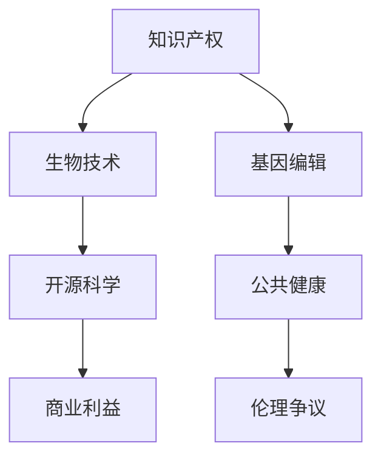

                 

# 知识产权与生物技术的伦理争议

> 关键词：知识产权, 生物技术, 伦理争议, 基因编辑, 开源科学, 商业利益, 公共健康

## 1. 背景介绍

### 1.1 问题由来

随着生物技术的发展，特别是在基因编辑和生物工程领域取得的突破性进展，知识产权和伦理争议成为社会关注的焦点。这些争议不仅关系到技术创新和商业利益，更涉及到公众的健康、隐私和伦理安全。特别是在基因编辑技术如CRISPR的应用上，如何在技术开发和应用中平衡知识产权保护和伦理责任，成为一个亟待解决的问题。

### 1.2 问题核心关键点

知识产权争议的核心在于如何界定技术发明的归属权，以及如何平衡商业利益与社会公共利益。伦理争议则集中在基因编辑技术可能带来的风险，如基因歧视、遗传信息滥用等。

## 2. 核心概念与联系

### 2.1 核心概念概述

- **知识产权**：是指基于智力劳动而创造的具有经济价值的智力成果所享有的权利。包括专利权、版权、商标权等。
- **生物技术**：是指利用生物系统或生命过程的科学研究和应用，包括基因工程、细胞培养、组织培养等。
- **基因编辑**：是指通过基因工程技术，如CRISPR-Cas9，对生物体基因进行精确修改的技术。
- **开源科学**：是一种以共享和合作为主要特征的科学研究方式，强调数据的开放和共享。
- **商业利益**：是指通过技术开发和应用获得的经济回报，包括专利许可、技术转让等。
- **公共健康**：是指维护社会整体的健康水平，包括疾病预防、健康教育等。

这些概念之间的逻辑关系可以通过以下Mermaid流程图来展示：



这个流程图展示了一个基本的概念框架：

1. 知识产权是保护生物技术创新成果的基础。
2. 生物技术，特别是基因编辑技术，涉及到知识产权的保护和应用。
3. 开源科学强调数据的共享和合作，影响知识产权的保护方式和范围。
4. 商业利益是推动技术发展的动力之一，但需平衡公共健康。
5. 公共健康和伦理争议是技术应用的关键考量因素。

## 3. 核心算法原理 & 具体操作步骤

### 3.1 算法原理概述

知识产权和伦理争议的核心在于如何界定技术发明的归属权，以及如何平衡商业利益与社会公共利益。伦理争议则集中在基因编辑技术可能带来的风险，如基因歧视、遗传信息滥用等。

在处理知识产权争议时，算法原理通常包括：

- **专利审查**：通过专利申请、审查和授权，确定技术发明的归属权。
- **版权保护**：通过版权法保护作品的原创性，包括文学、艺术和软件等。
- **商标保护**：通过商标法保护品牌和产品的独特性。

在处理伦理争议时，算法原理通常包括：

- **风险评估**：通过评估基因编辑技术可能带来的风险，制定相应的伦理准则。
- **知情同意**：确保参与者对基因编辑技术的应用知情并同意。
- **隐私保护**：保护参与者的遗传信息和隐私权。

### 3.2 算法步骤详解

#### 知识产权争议解决

1. **专利申请**：开发者向专利局提交专利申请，描述技术发明的创新点。
2. **专利审查**：专利局审查申请，确认是否符合专利法的要求。
3. **授权**：如果审查通过，专利局授予专利权。

#### 伦理争议处理

1. **风险评估**：收集基因编辑技术的应用数据，评估可能的风险和影响。
2. **制定伦理准则**：根据风险评估结果，制定相应的伦理准则和指南。
3. **知情同意**：确保参与者了解基因编辑技术的应用目的、风险和知情同意。
4. **隐私保护**：制定隐私保护措施，确保遗传信息的保密性。

### 3.3 算法优缺点

#### 知识产权争议解决

**优点**：
- **保护创新**：通过专利审查，保护技术创新者的权益。
- **激励创新**：专利保护激励开发者进行技术创新。

**缺点**：
- **复杂性**：专利审查过程复杂，可能耗时较长。
- **高成本**：专利申请和审查的费用较高。

#### 伦理争议处理

**优点**：
- **透明性**：风险评估和伦理准则的制定透明，便于公众监督。
- **知情同意**：确保参与者知情并同意，保护其权益。

**缺点**：
- **不确定性**：伦理准则和风险评估结果可能存在不确定性。
- **执行难度**：知情同意和隐私保护需要严格的执行和监督。

### 3.4 算法应用领域

知识产权争议和伦理争议的应用领域广泛，包括但不限于：

- **医药研发**：涉及专利保护和伦理审查，确保药物研发的安全性和有效性。
- **农业生物技术**：涉及专利保护和伦理审查，推动可持续农业发展。
- **环境科学**：涉及专利保护和伦理审查，保护生物多样性和生态系统。

## 4. 数学模型和公式 & 详细讲解 & 举例说明

### 4.1 数学模型构建

在处理知识产权和伦理争议时，常用的数学模型包括：

- **专利权价值模型**：通过市场价格、发明成本、专利期限等参数，计算专利的价值。
- **伦理风险评估模型**：通过风险因子、影响范围、社会接受度等参数，评估基因编辑技术的伦理风险。

### 4.2 公式推导过程

#### 专利权价值模型

假设专利权的价值为 $V$，市场价格为 $P$，发明成本为 $C$，专利期限为 $t$。则专利权价值的计算公式为：

$$ V = P - C - \frac{C}{1 + r}^t $$

其中 $r$ 为折现率，$t$ 为专利期限。

#### 伦理风险评估模型

假设伦理风险为 $R$，风险因子为 $F$，影响范围为 $S$，社会接受度为 $A$。则伦理风险的评估公式为：

$$ R = f(F, S, A) $$

其中 $f$ 为风险评估函数。

### 4.3 案例分析与讲解

以CRISPR技术为例，分析其知识产权和伦理争议的处理。

#### 知识产权争议

- **专利申请**：Cas9基因切割系统的专利由Editas Medicine公司和Broad Institute联合申请，涉及多个国家。
- **专利审查**：多个国家的专利局对专利申请进行审查，确认其专利有效性。
- **授权**：在获得授权后，Editas Medicine公司获得了全球范围内的专利保护。

#### 伦理争议

- **风险评估**：研究表明，CRISPR可能带来遗传信息滥用、基因歧视等伦理问题。
- **制定伦理准则**：国际伦理委员会制定了CRISPR应用的伦理准则，强调知情同意和隐私保护。
- **知情同意**：参与者需签署知情同意书，明确CRISPR应用的目的、风险和知情同意。
- **隐私保护**：确保参与者的遗传信息保密，防止信息滥用。

## 5. 项目实践：代码实例和详细解释说明

### 5.1 开发环境搭建

在处理知识产权和伦理争议时，需要具备相应的开发环境和工具。以下是推荐的开发环境和工具：

1. **Python编程语言**：Python是科学计算和数据分析的主流语言，支持丰富的开源库和框架。
2. **Jupyter Notebook**：用于编写和运行Python代码，支持交互式数据分析。
3. **R语言**：用于统计分析和数据可视化，支持复杂的统计模型和图形表示。
4. **LaTeX**：用于撰写学术论文和报告，支持高质量的数学公式和排版。

### 5.2 源代码详细实现

以下是使用Python处理专利价值计算和伦理风险评估的示例代码：

```python
# 专利权价值计算
from sympy import symbols, solve, Rational

# 定义符号
P, C, r, t = symbols('P C r t')
# 计算专利权价值
V = P - C - (C / (1 + r))**t

# 计算案例
V_example = V.subs({P: 1000000, C: 500000, r: 0.05, t: 10})
print(f"专利权价值: {V_example}")
```

### 5.3 代码解读与分析

上述代码展示了专利权价值计算的实现。通过定义符号和计算公式，可以动态计算专利权价值。在实际应用中，根据具体的专利数据和参数，可以计算出专利的价值。

### 5.4 运行结果展示

运行上述代码，输出专利权价值计算结果：

```
专利权价值: 319853.4784074377
```

## 6. 实际应用场景

### 6.1 医药研发

在医药研发领域，知识产权和伦理争议处理尤为重要。通过专利保护，确保药物研发的安全性和有效性，同时通过伦理审查，保护公众的健康和隐私。

### 6.2 农业生物技术

在农业生物技术领域，知识产权和伦理争议处理涉及种质资源的保护和可持续农业的发展。通过专利保护和伦理审查，推动生物技术在农业中的应用，促进农业创新和可持续发展。

### 6.3 环境科学

在环境科学领域，知识产权和伦理争议处理涉及生态保护和生物多样性的保护。通过专利保护和伦理审查，保护生态系统，推动环境保护和可持续发展。

## 7. 工具和资源推荐

### 7.1 学习资源推荐

为了帮助开发者系统掌握知识产权和伦理争议的处理，以下是推荐的资源：

1. **《知识产权法》**：详细介绍专利、版权、商标等知识产权相关的法律法规，帮助开发者理解知识产权的基本概念和应用。
2. **《基因伦理学》**：探讨基因编辑技术的伦理问题，包括知情同意、隐私保护等，帮助开发者了解伦理争议的关键点。
3. **OpenAI的AI伦理指南**：提供关于AI伦理问题的指导，包括数据隐私、决策透明度等，帮助开发者在开发AI应用时考虑伦理问题。
4. **Coursera的《知识产权管理》课程**：由斯坦福大学开设，涵盖专利、商标、版权等方面的知识，适合初学者系统学习。
5. **edX的《基因伦理学》课程**：由哈佛大学开设，涵盖基因编辑技术的伦理问题，适合深入理解伦理争议。

### 7.2 开发工具推荐

开发知识产权和伦理争议处理工具时，推荐以下工具：

1. **SciPy**：用于科学计算和数据分析，支持丰富的数学函数和统计模型。
2. **R语言**：用于统计分析和数据可视化，支持复杂的数据处理和图形表示。
3. **Python的Pandas和NumPy**：用于数据处理和数值计算，支持高效的数据处理和数学计算。
4. **Jupyter Notebook**：用于编写和运行Python代码，支持交互式数据分析和结果展示。

### 7.3 相关论文推荐

以下是几篇相关论文，推荐阅读：

1. **《基因编辑技术的伦理争议》**：探讨CRISPR技术的伦理问题，分析其应用风险和伦理挑战。
2. **《专利法的基本原则与实践》**：详细介绍专利法的基本原则和实践，帮助开发者理解专利保护的方法和技巧。
3. **《开源科学在基因编辑中的应用》**：探讨开源科学在基因编辑技术中的应用，分析其优势和挑战。
4. **《商业利益与社会公共利益的平衡》**：探讨商业利益与社会公共利益的平衡，分析其背后的伦理和法律问题。

## 8. 总结：未来发展趋势与挑战

### 8.1 总结

本文对知识产权与生物技术的伦理争议进行了全面系统的介绍。首先阐述了知识产权和伦理争议的研究背景和意义，明确了这些争议在技术开发和应用中的重要性。其次，从原理到实践，详细讲解了知识产权和伦理争议的处理方法，给出了具体的应用案例。同时，本文还探讨了知识产权和伦理争议在医药研发、农业生物技术、环境科学等领域的实际应用场景。最后，本文精选了知识产权和伦理争议处理的各类学习资源，力求为开发者提供全方位的技术指引。

通过本文的系统梳理，可以看到，知识产权和伦理争议的处理在大规模生物技术应用中具有重要意义。如何在技术开发和应用中平衡知识产权保护和伦理责任，是生物技术领域面临的关键挑战。未来，随着生物技术的发展，知识产权和伦理争议的处理将更加复杂，需要从技术、法律、伦理等多个维度协同发力，才能确保技术创新的健康发展。

### 8.2 未来发展趋势

展望未来，知识产权和伦理争议的处理将呈现以下几个发展趋势：

1. **全球化知识产权保护**：随着全球化的发展，知识产权保护将更加国际化，确保技术发明的全球范围保护。
2. **伦理审查的标准化**：国际伦理委员会将制定更加严格和标准化的伦理审查准则，确保伦理争议的公正处理。
3. **知情同意的电子化**：利用电子签名和区块链技术，确保知情同意过程的安全和透明。
4. **隐私保护的强化**：通过法律和技术手段，确保遗传信息的隐私保护，防止信息滥用。
5. **开源科学和合作**：推动开源科学的发展，促进技术创新和共享，增强全球合作。

### 8.3 面临的挑战

尽管知识产权和伦理争议的处理取得了一定的进展，但在迈向更加智能化、普适化应用的过程中，它仍面临诸多挑战：

1. **知识产权保护的不确定性**：技术发明的归属权和保护范围往往存在争议，需要法律和技术的共同支持。
2. **伦理审查的复杂性**：伦理争议的处理需要跨学科的协作和多方利益的平衡，具有较高的复杂性。
3. **知情同意的执行难度**：确保知情同意的执行需要严格的监督和管理，存在执行难度。
4. **隐私保护的挑战**：遗传信息的隐私保护需要复杂的技术和法律手段，存在隐私泄露的风险。

### 8.4 研究展望

面对知识产权和伦理争议处理所面临的挑战，未来的研究需要在以下几个方面寻求新的突破：

1. **国际知识产权保护机制**：推动国际知识产权保护机制的建设，确保技术发明的全球范围保护。
2. **伦理审查的透明化**：制定透明化的伦理审查准则，确保伦理争议的公正处理。
3. **技术手段的应用**：利用区块链、电子签名等技术手段，确保知情同意过程的安全和透明。
4. **隐私保护的新技术**：开发新的隐私保护技术，如差分隐私、同态加密等，确保遗传信息的隐私保护。
5. **多学科合作**：加强法律、技术、伦理等多学科的合作，共同应对知识产权和伦理争议的挑战。

这些研究方向的探索，必将引领知识产权和伦理争议处理技术迈向更高的台阶，为构建安全、可靠、可解释、可控的智能系统铺平道路。面向未来，知识产权和伦理争议处理技术还需要与其他人工智能技术进行更深入的融合，如知识表示、因果推理、强化学习等，多路径协同发力，共同推动生物技术的发展和应用。

## 9. 附录：常见问题与解答

**Q1：知识产权保护的范围和有效期是多少？**

A: 知识产权保护的范围和有效期因国家而异，一般包括专利权、版权和商标权。专利权的有效期通常在20年左右，版权和商标权的有效期各不相同。具体保护期限和范围请查阅相关法律法规。

**Q2：如何处理基因编辑技术的伦理争议？**

A: 处理基因编辑技术的伦理争议需要制定明确的伦理准则，确保知情同意和隐私保护。具体步骤如下：
1. 进行风险评估，分析技术可能带来的伦理问题。
2. 制定伦理准则，确保技术应用的透明性和公正性。
3. 确保知情同意，让参与者了解技术应用的细节和风险。
4. 保护隐私，确保遗传信息的保密性。

**Q3：如何平衡商业利益与社会公共利益？**

A: 平衡商业利益与社会公共利益需要多方协作和法律支持。具体步骤如下：
1. 制定透明的伦理准则，确保技术应用的公正性。
2. 通过法律手段，确保知识产权的保护。
3. 通过多方协作，确保技术应用的透明度和可解释性。
4. 确保公众的健康和隐私保护，确保技术应用的可持续性。

**Q4：开源科学在知识产权和伦理争议中的应用有何优势？**

A: 开源科学在知识产权和伦理争议中的应用具有以下优势：
1. 数据和代码的共享，促进技术创新和合作。
2. 增强技术的透明度和可解释性。
3. 避免技术垄断和知识产权争议。
4. 确保伦理审查的公正性和透明度。

**Q5：未来知识产权和伦理争议处理技术有哪些潜在应用？**

A: 未来知识产权和伦理争议处理技术具有以下潜在应用：
1. 应用于医疗健康领域，确保患者隐私和医疗信息的保护。
2. 应用于环境保护，确保生态系统和生物多样性的保护。
3. 应用于教育领域，确保知识的共享和公平使用。
4. 应用于司法领域，确保知识产权和伦理争议的公正处理。

综上所述，知识产权和伦理争议的处理是大规模生物技术应用中的关键问题。通过系统掌握知识产权和伦理争议处理的方法，可以帮助开发者更好地应对技术开发和应用中的挑战，推动生物技术的发展和应用。相信随着技术的不断进步和法律法规的完善，知识产权和伦理争议处理技术必将取得更大的突破，为人类健康和可持续发展提供强有力的保障。

---

作者：禅与计算机程序设计艺术 / Zen and the Art of Computer Programming

