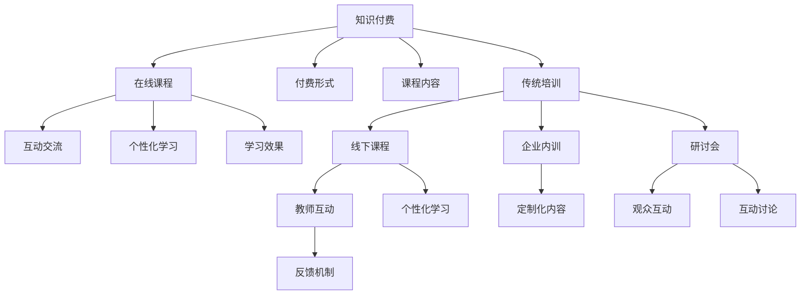

                 

# 知识付费与传统培训的优劣对比

在当今数字化信息爆炸的时代，知识的获取与传播方式正在经历深刻变革。知识付费和传统培训，作为两大知识传播方式，各有千秋，本文将深入对比这两种方式的优劣，并探讨其未来发展趋势与面临的挑战。

## 1. 背景介绍

### 1.1 知识付费的兴起
随着互联网技术的迅速发展，越来越多的人开始通过在线平台获取知识和技能。知识付费平台如得到、喜马拉雅、知乎live等应运而生，以付费形式提供各种专业课程、讲座、文章等内容，让学习者可以更加高效地获取知识。

### 1.2 传统培训的演变
传统培训模式，如学校教育、企业内训、研讨会等，在过去几十年中一直占据主导地位。随着在线教育的发展，传统培训也开始借助互联网技术进行数字化转型，如网络课程、虚拟教室、在线研讨会等。

## 2. 核心概念与联系

### 2.1 核心概念概述

- **知识付费**：指通过付费形式获取知识与技能的学习方式。平台如得到、喜马拉雅、知乎live等，提供课程、讲座、文章等内容，学习者支付费用获取学习资源。

- **传统培训**：指通过线下或线上课程、讲座、研讨会等形式，向学习者传授知识和技能的培训模式。包括学校教育、企业内训、公共研讨会等。

- **学习效果**：指学习者通过培训或付费课程获得的知识和技能水平。

- **个性化学习**：指根据学习者的兴趣、能力、进度等个性化需求，定制化推送课程和学习内容。

- **互动性**：指学习过程中，学习者与教师、学习者与学习者之间的交流互动程度。

### 2.2 核心概念联系
知识付费与传统培训的联系主要体现在它们都是为了提供知识与技能，促进学习者的成长和发展。两者的区别主要在于传播方式、学习形式、互动性和成本等方面。

以下是一个Mermaid流程图，展示知识付费和传统培训的核心概念及其联系：



## 3. 核心算法原理 & 具体操作步骤

### 3.1 算法原理概述

知识付费和传统培训的核心算法原理都基于教育学和认知科学的理论，旨在通过合适的学习方式和内容，促进学习者的知识掌握和技能提升。

#### 3.1.1 知识付费
知识付费的算法原理主要基于推荐系统，通过分析学习者的学习历史、偏好、行为等数据，推荐最适合的课程和学习资源。此外，一些知识付费平台还采用人工智能技术，如自然语言处理和机器学习，来优化课程内容和互动形式。

#### 3.1.2 传统培训
传统培训的算法原理主要基于学习理论，如行为主义、认知主义和社会建构主义。通过设计合适的教学内容、互动方式和评估机制，促进学习者的知识掌握和技能提升。

### 3.2 算法步骤详解

#### 3.2.1 知识付费
1. **用户注册与数据采集**：用户注册并填写基本信息，平台采集学习历史、偏好等数据。
2. **课程推荐**：根据用户数据，推荐最适合的课程。
3. **互动学习**：用户观看课程内容，参与讨论、问答等互动活动。
4. **学习评估**：平台根据用户答题、作业等反馈，评估学习效果。
5. **内容优化**：平台根据学习效果反馈，不断优化课程内容和推荐算法。

#### 3.2.2 传统培训
1. **学员报名与分组**：学员报名并分组，制定学习计划。
2. **教师授课**：教师按照教学计划，通过线下或线上方式授课。
3. **互动与讨论**：学员参与课堂讨论、问答等互动活动。
4. **学习评估**：教师根据学员表现，评估学习效果。
5. **内容优化**：根据评估结果，调整教学内容和方法。

### 3.3 算法优缺点

#### 3.3.1 知识付费
- **优点**：
  - **灵活性**：用户可以根据自己的时间和兴趣自由选择课程，学习时间地点灵活。
  - **互动性**：用户可以在课程评论区与其他学员、教师互动，获取反馈和帮助。
  - **个性化**：推荐系统可以根据用户数据，提供个性化推荐，提高学习效果。

- **缺点**：
  - **质量参差不齐**：部分课程内容质量不高，可能误导学习者。
  - **学习深度不够**：缺乏系统性和结构性的课程体系，可能导致学习者知识碎片化。
  - **缺乏面对面互动**：缺乏面对面交流，可能影响某些需要深度互动的学习效果。

#### 3.3.2 传统培训
- **优点**：
  - **系统性**：课程体系经过精心设计，内容系统性和结构性强。
  - **深度互动**：教师与学员、学员与学员之间的面对面互动，深度交流，有助于知识掌握和问题解决。
  - **权威性**：专业教师的授课，内容权威可靠。

- **缺点**：
  - **时间和地点限制**：传统培训需要学员在特定时间地点参加，灵活性较差。
  - **费用较高**：部分高质量培训课程费用较高，可能超出部分学员的经济承受能力。
  - **个性化不足**：同一课程所有学员的学习进度和能力水平差异较大，难以实现个性化教学。

### 3.4 算法应用领域

- **知识付费**：适用于职场技能提升、兴趣学习、学科知识学习等场景，如编程、外语学习、心理学等。
- **传统培训**：适用于专业技能培训、职业教育、企业内训等场景，如工程、医学、管理等。

## 4. 数学模型和公式 & 详细讲解 & 举例说明

### 4.1 数学模型构建

知识付费和传统培训的数学模型主要基于推荐系统和学习理论，以下以推荐系统为例进行说明。

假设有一个知识付费平台，平台上有$N$个课程，每个课程有一个评分向量$\mathbf{v}_i$，用户$u$有一个评分向量$\mathbf{u}$，两者的相似度可以用余弦相似度$\mathbf{u} \cdot \mathbf{v}_i$来表示。推荐系统的目标是最小化用户未评分课程与用户评分课程的相似度差，即最小化$\sum_{i=1}^N (\mathbf{u} \cdot \mathbf{v}_i - y_i (\mathbf{u} \cdot \mathbf{v}_i))$，其中$y_i$为课程$i$的评分。

### 4.2 公式推导过程

假设用户$u$有$m$个课程评分，课程$i$的评分向量为$\mathbf{v}_i$，用户评分向量为$\mathbf{u}$，相似度为$\mathbf{u} \cdot \mathbf{v}_i$，推荐系统的目标函数为：

$$
\min \sum_{i=1}^N (\mathbf{u} \cdot \mathbf{v}_i - y_i (\mathbf{u} \cdot \mathbf{v}_i))
$$

其中$y_i$为课程$i$的评分，$y_i \in \{0,1\}$，表示课程$i$是否被用户$u$评分。

推荐系统的优化目标是最大化用户未评分课程的评分预测值与用户评分课程的评分预测值的相似度，即最大化$\mathbf{u} \cdot \mathbf{v}_i$，其中$i$为未评分课程。

### 4.3 案例分析与讲解

以一个在线编程课程为例，平台根据用户的学习历史、浏览记录和兴趣标签，推荐最适合的编程课程。平台使用协同过滤算法，计算用户与课程的相似度，根据相似度推荐课程。

## 5. 项目实践：代码实例和详细解释说明

### 5.1 开发环境搭建

1. **安装Python**：
   ```bash
   python3 -m pip install pipenv
   ```

2. **创建项目目录**：
   ```bash
   mkdir knowledge-payment-platform
   cd knowledge-payment-platform
   ```

3. **安装依赖包**：
   ```bash
   pipenv install requests scipy pandas sklearn
   ```

### 5.2 源代码详细实现

以下是知识付费平台的推荐系统代码实现，使用Python的Scikit-learn库实现协同过滤推荐算法：

```python
from sklearn.metrics.pairwise import cosine_similarity
import pandas as pd
import numpy as np

# 用户评分矩阵
user_ratings = np.array([
    [5, 3, 0, 0, 4],
    [0, 0, 0, 4, 5],
    [0, 0, 0, 5, 3],
    [3, 0, 0, 0, 0],
    [0, 4, 3, 0, 0]
])

# 课程评分矩阵
course_ratings = np.array([
    [0, 1, 2, 3, 0],
    [4, 0, 0, 0, 1],
    [0, 5, 0, 0, 0],
    [0, 0, 6, 0, 2],
    [7, 0, 0, 0, 0]
])

# 计算用户与课程的相似度
user_similarity = cosine_similarity(user_ratings, course_ratings)

# 推荐未评分课程
user_unrated = user_ratings[1]
recommended_courses = np.dot(user_unrated, user_similarity[1, :])

# 输出推荐结果
print(recommended_courses)
```

### 5.3 代码解读与分析

1. **用户评分矩阵**：记录用户对不同课程的评分。
2. **课程评分矩阵**：记录课程的评分向量。
3. **相似度计算**：使用余弦相似度计算用户与课程的相似度。
4. **推荐未评分课程**：根据相似度计算推荐结果。

## 6. 实际应用场景

### 6.1 在线教育平台

知识付费和传统培训在在线教育平台中均有广泛应用。知识付费平台如得到、喜马拉雅、知乎live等，提供各类课程和讲座，学习者可以通过付费获取优质内容。传统培训平台如Coursera、edX等，提供系统化的课程体系，涵盖多个学科领域，适用于各年龄段的学习者。

### 6.2 企业内部培训

企业内部培训中，知识付费和传统培训也有各自的优势。知识付费平台如企业内部知识管理系统、在线学习平台，提供各类培训课程，方便员工随时学习。传统培训则通过内部培训、工作坊等方式，提供深度互动和面对面交流，有助于知识转化和技能提升。

## 7. 工具和资源推荐

### 7.1 学习资源推荐

1. **《知识付费：未来教育的机遇与挑战》**：介绍了知识付费的兴起、应用和发展趋势，分析其优缺点和未来前景。
2. **《深度学习在推荐系统中的应用》**：详细介绍了推荐系统的算法原理和应用，包括协同过滤、基于内容推荐等方法。
3. **《人工智能与教育的融合》**：探讨了人工智能技术在教育中的应用，包括知识付费和传统培训的融合。

### 7.2 开发工具推荐

1. **Python**：适用于开发推荐系统、数据分析、机器学习等任务。
2. **Scikit-learn**：提供了多种机器学习算法和工具，适用于数据处理和模型训练。
3. **TensorFlow**：适用于深度学习模型的开发和部署。

### 7.3 相关论文推荐

1. **《推荐系统：算法、设计与应用》**：介绍了推荐系统的基本原理、算法设计和实际应用，适用于深入了解推荐系统的实现。
2. **《基于协同过滤的推荐系统》**：详细介绍了协同过滤推荐算法的原理和实现，适用于推荐系统的实际应用。

## 8. 总结：未来发展趋势与挑战

### 8.1 研究成果总结

知识付费和传统培训各有优势，适用于不同的学习场景。知识付费通过灵活性、互动性和个性化推荐，提升了学习效率和用户体验。传统培训则通过系统性和深度互动，确保了学习效果和质量。

### 8.2 未来发展趋势

1. **知识付费的普及**：随着知识付费平台的不断发展和完善，知识付费将更加普及，成为重要的学习方式之一。
2. **传统培训的数字化转型**：传统培训将借助互联网技术进行数字化转型，提高灵活性和互动性。
3. **混合学习模式**：知识付费和传统培训的结合，形成混合学习模式，取长补短，提升学习效果。

### 8.3 面临的挑战

1. **内容质量**：知识付费平台需要不断提升课程质量和内容丰富度，避免误导学习者。
2. **个性化不足**：传统培训难以实现个性化教学，需要结合个性化学习技术进行改进。
3. **技术成本**：知识付费和传统培训的技术实现成本较高，需要降低技术门槛和资源消耗。

### 8.4 研究展望

1. **推荐算法优化**：优化推荐算法，提高推荐准确度和用户体验。
2. **深度学习融合**：结合深度学习技术，提升课程质量和互动性。
3. **混合学习模式探索**：探索知识付费和传统培训的混合学习模式，提升学习效果。

## 9. 附录：常见问题与解答

**Q1: 知识付费与传统培训的区别是什么？**

A: 知识付费主要通过在线平台提供课程和讲座，用户通过付费获取学习资源，具有灵活性和个性化。传统培训则通过线下或线上课程、讲座、研讨会等形式，提供系统性和深度互动的教学，具有权威性和系统性。

**Q2: 如何选择合适的学习方式？**

A: 根据学习目标和需求，选择合适的学习方式。知识付费适用于灵活性、个性化强的学习需求，传统培训适用于系统性、深度互动强的学习需求。

**Q3: 如何评价学习效果？**

A: 学习效果可以通过学习者的知识掌握、技能提升、项目完成情况等进行评价。知识付费平台通常通过答题、作业等评估学习效果，传统培训则通过教师评估和项目成果进行评估。

**Q4: 知识付费和传统培训的未来发展方向是什么？**

A: 知识付费和传统培训的未来发展方向是融合和互补。知识付费通过灵活性和个性化推荐，提升学习效率和用户体验；传统培训通过系统性和深度互动，确保学习效果和质量。两者结合，形成混合学习模式，将更好地满足学习者的需求。

---

作者：禅与计算机程序设计艺术 / Zen and the Art of Computer Programming

