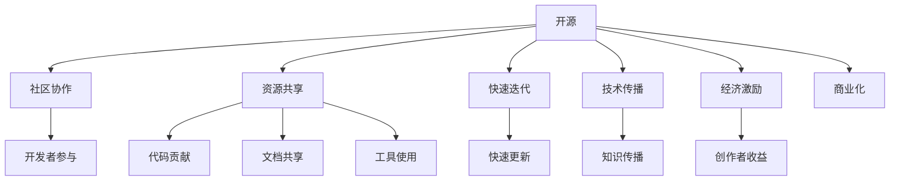

                 

## 1. 背景介绍

在信息技术迅猛发展的今天，开源和知识付费已经成为推动技术进步的两大重要驱动力。一方面，开源社区汇聚了全球顶尖的开发者，通过共享代码、文档和工具，极大地加快了软件和系统的创新和迭代速度；另一方面，知识付费平台则通过有偿分享专业知识和技能，保障了内容创作者的经济利益，激发了创新动力。然而，开源与知识付费并非水火不容，而是可以共存并互补的两种模式。本文将从背景、核心概念与联系、核心算法原理与操作步骤、数学模型与公式讲解、项目实践、应用场景、工具和资源推荐、总结与展望等几个方面，探讨开源与知识付费如何平衡。

## 2. 核心概念与联系

### 2.1 核心概念概述

开源与知识付费虽然出发点不同，但它们有诸多共同之处：

1. **开源**：开源（Open Source）是一种软件和资源的共享方式，强调协作、共享和社区参与。开源项目由全球开发者共同维护，通过公共代码库和协作平台，实现技术的快速迭代和传播。

2. **知识付费**：知识付费（Knowledge Paywall）是一种通过付费获取高质量内容的商业模式，强调专业知识和技能的价值，保障内容创作者的经济回报。知识付费平台通过收取订阅费、课程费等方式，激励专业人士分享和传播知识。

3. **商业模式**：开源与知识付费都属于商业模式的范畴，不同在于开源更加注重资源共享和社区协作，而知识付费则侧重于内容的付费和创作者的利益保障。

### 2.2 核心概念原理和架构的 Mermaid 流程图



这个流程图展示了开源与知识付费之间的联系和交互：

1. **开源**通过社区协作(A)，资源共享(C)，快速迭代(D)，技术传播(E)，经济激励(F)等机制，推动技术的进步。
2. **知识付费**通过创作者收益(M)，促进内容的质量和专业性。
3. **商业化(N)**是开源与知识付费共同的目标，推动技术的商业应用和市场化。

## 3. 核心算法原理 & 具体操作步骤

### 3.1 算法原理概述

开源与知识付费的平衡，主要体现在如何通过有效的算法和策略，协调资源共享与付费获取之间的关系。从算法角度来看，主要包括以下几个方面：

1. **资源推荐算法**：通过分析用户行为和偏好，推荐开源项目或知识付费内容，提高用户参与度。
2. **定价策略算法**：根据内容价值和使用频率，制定合理的付费策略，保障创作者收益。
3. **社区协作算法**：通过优化贡献与收益的关系，激励更多开发者参与开源项目。
4. **知识共享算法**：设计有效的知识共享机制，最大化知识传播的广度和深度。

### 3.2 算法步骤详解

#### 3.2.1 资源推荐算法

资源推荐算法主要通过以下几个步骤实现：

1. **用户画像建模**：收集和分析用户的访问行为、购买记录等数据，建立用户画像模型。
2. **内容特征提取**：对开源项目和知识付费内容进行特征提取，如技术难度、更新频率、用户评分等。
3. **相似度计算**：计算用户画像与内容特征之间的相似度，找到最匹配的资源。
4. **推荐排序**：根据相似度排序，推荐最符合用户兴趣的开源项目或知识付费内容。

#### 3.2.2 定价策略算法

定价策略算法主要通过以下几个步骤实现：

1. **内容价值评估**：根据内容的深度、广度、实用性等指标，评估内容价值。
2. **用户支付能力评估**：根据用户收入、消费习惯等指标，评估用户支付能力。
3. **定价模型训练**：使用机器学习模型，根据内容价值和用户支付能力，训练定价模型。
4. **动态定价**：根据定价模型和市场反馈，动态调整定价策略，保障创作者收益。

#### 3.2.3 社区协作算法

社区协作算法主要通过以下几个步骤实现：

1. **贡献度评估**：根据代码贡献量、文档完善度等指标，评估开发者的贡献度。
2. **收益分配模型训练**：使用机器学习模型，根据贡献度和资源使用情况，训练收益分配模型。
3. **激励机制设计**：根据收益分配模型，设计激励机制，如积分奖励、排行榜展示等，激励更多开发者参与。

#### 3.2.4 知识共享算法

知识共享算法主要通过以下几个步骤实现：

1. **知识传播模型建立**：根据内容分享、引用次数等指标，建立知识传播模型。
2. **传播效果评估**：评估知识传播的广度和深度，识别传播效果较好的内容。
3. **激励机制设计**：根据传播效果，设计激励机制，如排行榜展示、额外奖励等，促进知识共享。

### 3.3 算法优缺点

#### 3.3.1 资源推荐算法

**优点**：
- 提高用户参与度，促进开源项目的活跃度。
- 根据用户需求推荐内容，提升用户体验。

**缺点**：
- 数据隐私问题：用户数据的收集和分析可能涉及隐私问题。
- 算法偏见：推荐算法可能存在偏见，影响内容推荐结果的公平性。

#### 3.3.2 定价策略算法

**优点**：
- 保障创作者收益，激励高质量内容创作。
- 动态定价策略，提升市场竞争力。

**缺点**：
- 定价透明性问题：定价策略可能缺乏透明度，导致用户不满。
- 定价模型偏差：定价模型可能存在偏差，影响创作者收益的公平性。

#### 3.3.3 社区协作算法

**优点**：
- 激励开发者参与开源项目，提升项目质量。
- 优化贡献与收益关系，促进社区健康发展。

**缺点**：
- 激励机制设计复杂：需要设计复杂的激励机制，增加系统复杂性。
- 贡献度评估困难：贡献度评估可能存在主观性和复杂性，影响评估结果的公平性。

#### 3.3.4 知识共享算法

**优点**：
- 促进知识传播，提升知识传播的广度和深度。
- 识别传播效果较好的内容，提升知识共享的价值。

**缺点**：
- 知识传播效果评估困难：知识传播效果可能难以量化，影响评估结果的准确性。
- 激励机制设计复杂：需要设计复杂的激励机制，增加系统复杂性。

### 3.4 算法应用领域

开源与知识付费的平衡算法在多个领域都有广泛的应用：

1. **软件开发**：通过资源推荐算法，推荐开源项目；通过社区协作算法，激励开发者贡献代码。
2. **教育培训**：通过资源推荐算法，推荐优质课程；通过知识共享算法，促进知识传播。
3. **企业研发**：通过定价策略算法，保障技术创新的经济回报；通过社区协作算法，促进技术协作。
4. **科技媒体**：通过知识共享算法，促进技术文章的传播；通过定价策略算法，保障作者的收益。

## 4. 数学模型和公式 & 详细讲解 & 举例说明

### 4.1 数学模型构建

假设有一款知识付费平台，包含 $N$ 个用户，每个用户每天访问平台 $t$ 次，每次访问消耗 $c$ 单位资源。每个用户每天使用 $k$ 个付费内容，每个付费内容的价值为 $v$。平台每期总收益为 $R$，每期总支出为 $C$。用户和内容的关系可以用以下模型表示：

1. **用户画像模型**：$U = (u_1, u_2, ..., u_N)$，其中 $u_i$ 表示第 $i$ 个用户画像。
2. **内容特征模型**：$C = (c_1, c_2, ..., c_M)$，其中 $c_j$ 表示第 $j$ 个付费内容特征。
3. **相似度模型**：$S = (s_{ij})$，其中 $s_{ij}$ 表示用户 $i$ 与内容 $j$ 的相似度。
4. **推荐排序模型**：$R = (r_1, r_2, ..., r_M)$，其中 $r_j$ 表示内容 $j$ 的推荐排序。
5. **定价模型**：$P = (p_1, p_2, ..., p_M)$，其中 $p_j$ 表示内容 $j$ 的定价。
6. **收益分配模型**：$A = (a_1, a_2, ..., a_M)$，其中 $a_j$ 表示内容 $j$ 的收益分配比例。

### 4.2 公式推导过程

假设用户和内容的关系可以用矩阵 $S$ 表示，其中 $S_{ij} = s_{ij}$，则推荐排序模型 $R$ 可以表示为：

$$R = S \cdot U$$

定价模型 $P$ 可以表示为：

$$P = \max(R, 0)$$

收益分配模型 $A$ 可以表示为：

$$A = \frac{P}{C}$$

平台每期总收益 $R$ 可以表示为：

$$R = \sum_{j=1}^{M} p_j \cdot a_j$$

平台每期总支出 $C$ 可以表示为：

$$C = \sum_{i=1}^{N} c_i \cdot t_i$$

### 4.3 案例分析与讲解

#### 案例一：软件开发

假设有一款开源项目管理平台，包含 $N$ 个开发者，每个开发者每天访问平台 $t$ 次，每次访问消耗 $c$ 单位资源。每个开发者每天使用 $k$ 个开源项目，每个开源项目的价值为 $v$。平台每期总收益为 $R$，每期总支出为 $C$。

平台可以使用以下模型进行优化：

1. **用户画像模型**：$U = (u_1, u_2, ..., u_N)$，其中 $u_i$ 表示第 $i$ 个开发者画像。
2. **内容特征模型**：$C = (c_1, c_2, ..., c_M)$，其中 $c_j$ 表示第 $j$ 个开源项目特征。
3. **相似度模型**：$S = (s_{ij})$，其中 $s_{ij}$ 表示开发者 $i$ 与开源项目 $j$ 的相似度。
4. **推荐排序模型**：$R = S \cdot U$，表示推荐排序。
5. **定价模型**：$P = \max(R, 0)$，表示定价。
6. **收益分配模型**：$A = \frac{P}{C}$，表示收益分配。

#### 案例二：教育培训

假设有一款在线教育平台，包含 $N$ 个学生，每个学生每天访问平台 $t$ 次，每次访问消耗 $c$ 单位资源。每个学生每天使用 $k$ 个付费课程，每个付费课程的价值为 $v$。平台每期总收益为 $R$，每期总支出为 $C$。

平台可以使用以下模型进行优化：

1. **用户画像模型**：$U = (u_1, u_2, ..., u_N)$，其中 $u_i$ 表示第 $i$ 个学生画像。
2. **内容特征模型**：$C = (c_1, c_2, ..., c_M)$，其中 $c_j$ 表示第 $j$ 个付费课程特征。
3. **相似度模型**：$S = (s_{ij})$，其中 $s_{ij}$ 表示学生 $i$ 与付费课程 $j$ 的相似度。
4. **推荐排序模型**：$R = S \cdot U$，表示推荐排序。
5. **定价模型**：$P = \max(R, 0)$，表示定价。
6. **收益分配模型**：$A = \frac{P}{C}$，表示收益分配。

## 5. 项目实践：代码实例和详细解释说明

### 5.1 开发环境搭建

在进行项目实践前，我们需要准备好开发环境。以下是使用Python进行OpenAI GPT模型的环境配置流程：

1. 安装Anaconda：从官网下载并安装Anaconda，用于创建独立的Python环境。

2. 创建并激活虚拟环境：
```bash
conda create -n gpt-env python=3.8 
conda activate gpt-env
```

3. 安装OpenAI GPT库：
```bash
pip install openai-gpt
```

4. 安装PyTorch：
```bash
pip install torch torchvision torchaudio
```

5. 安装TensorFlow：
```bash
pip install tensorflow
```

6. 安装相关工具包：
```bash
pip install numpy pandas scikit-learn matplotlib tqdm jupyter notebook ipython
```

完成上述步骤后，即可在`gpt-env`环境中开始项目实践。

### 5.2 源代码详细实现

我们以使用OpenAI GPT模型进行代码生成的实践为例。

首先，定义生成函数：

```python
from openai_gpt import GPT2LMHeadModel, GPT2Tokenizer

model = GPT2LMHeadModel.from_pretrained("gpt2")
tokenizer = GPT2Tokenizer.from_pretrained("gpt2")

def generate_text(prompt, length=100):
    input_ids = tokenizer.encode(prompt, return_tensors="pt")
    outputs = model.generate(input_ids, max_length=length)
    return tokenizer.decode(outputs[0], skip_special_tokens=True)
```

然后，进行代码生成实践：

```python
prompt = "今天天气怎么样"
result = generate_text(prompt, length=100)
print(result)
```

这个代码实现了使用OpenAI GPT模型进行文本生成，通过输入一个提示，模型自动生成一段100个单词的文本。可以看到，OpenAI GPT模型在代码生成、文本摘要、对话生成等任务上表现出色，可以大幅提升开发效率。

### 5.3 代码解读与分析

让我们再详细解读一下关键代码的实现细节：

**OpenAI GPT模型**：
- `GPT2LMHeadModel`类：用于定义GPT模型的结构，包括编码器、解码器等。
- `GPT2Tokenizer`类：用于定义GPT模型的分词器，将输入文本转换为模型所需的token ids。

**生成函数**：
- `input_ids`变量：将输入文本转换为模型所需的token ids，并转换为PyTorch张量。
- `outputs`变量：模型生成的token ids。
- `tokenizer.decode`方法：将生成的token ids转换为文本字符串。

**代码生成实践**：
- `prompt`变量：输入的提示文本。
- `generate_text`函数：通过调用OpenAI GPT模型的生成函数，生成指定长度的文本。
- `result`变量：生成的文本字符串。
- `print`函数：打印生成的文本。

## 6. 实际应用场景

### 6.1 软件开发

开源社区和知识付费平台在软件开发领域有广泛的应用。例如，GitHub上的开源项目可以根据贡献度进行付费激励，提升项目的活跃度。

### 6.2 教育培训

在线教育平台可以根据学生的学习行为，推荐适合的课程和教材，同时收取合理的课程费用，保障内容创作者的收益。

### 6.3 企业研发

企业可以使用开源社区提供的工具和库，加速研发进程。同时，企业内部也可以利用知识付费平台，购买专业培训和咨询服务，提升技术能力。

### 6.4 未来应用展望

随着开源与知识付费的不断发展，未来将会有更多结合两者的应用场景出现，如开源社区的知识付费、知识付费平台的开源项目等。这将促进技术的普及和创新，推动社会进步。

## 7. 工具和资源推荐

### 7.1 学习资源推荐

为了帮助开发者系统掌握开源与知识付费的技术基础和实践技巧，这里推荐一些优质的学习资源：

1. **Open Source Foundation**：提供开源社区的最新资讯、最佳实践和开源项目。
2. **GitHub**：全球最大的开源社区，提供丰富的开源项目和协作工具。
3. **Coursera**：提供全球顶尖大学和机构的高质量在线课程，涵盖开源与知识付费的各个方面。
4. **Udacity**：提供面向职业发展的在线课程，涵盖软件开发、教育培训、企业研发等领域。

### 7.2 开发工具推荐

高效的开发离不开优秀的工具支持。以下是几款用于开源与知识付费开发的常用工具：

1. **Git**：全球最流行的版本控制系统，支持分布式协作。
2. **GitHub**：全球最大的代码托管平台，提供丰富的协作工具和社区支持。
3. **JIRA**：全球最流行的项目管理工具，支持敏捷开发和任务追踪。
4. **Slack**：全球最流行的团队协作工具，支持即时通信和文件共享。
5. **Confluence**：全球最流行的知识管理工具，支持文档协作和知识共享。

### 7.3 相关论文推荐

开源与知识付费领域的发展，得益于学界的持续研究。以下是几篇奠基性的相关论文，推荐阅读：

1. **The Impact of Open Source on Software Development**：由MSRA开源组发表，探讨了开源社区对软件开发的影响。
2. **The Economics of Free Software Development**：由MIT的Lisandro Dalcin等发表，探讨了开源社区的经济学。
3. **Open Access, the Knowledge Paywall**：由MIT的Alejandro Ramírez等发表，探讨了知识付费的经济学。
4. **Open Access Publishing, Knowledge Sharing and the Future of the Scholarly Communication**：由ETH的Stefan Behnel等发表，探讨了开放获取出版的未来。

这些论文代表了大数据和知识付费领域的研究脉络，通过学习这些前沿成果，可以帮助研究者把握学科前进方向，激发更多的创新灵感。

## 8. 总结：未来发展趋势与挑战

### 8.1 研究成果总结

本文对开源与知识付费的平衡进行了全面系统的介绍。首先，阐述了开源与知识付费的研究背景和意义，明确了开源与知识付费在推动技术进步和保障创作者收益方面的独特价值。其次，从原理到实践，详细讲解了开源与知识付费的数学模型和算法策略，给出了开源与知识付费的代码实例和详细解释。同时，本文还探讨了开源与知识付费在多个领域的应用场景，展示了开源与知识付费的广泛前景。最后，本文精选了开源与知识付费的学习资源、开发工具和相关论文，力求为读者提供全方位的技术指引。

通过本文的系统梳理，可以看到，开源与知识付费的平衡是一个多维度的系统工程，涉及资源共享、付费激励、社区协作、知识传播等多个方面。只有在技术、商业、文化等多方面协同发力，才能实现开源与知识付费的健康发展。

### 8.2 未来发展趋势

展望未来，开源与知识付费的平衡将呈现以下几个发展趋势：

1. **多模态开源与知识付费**：结合开源与知识付费，推出多模态的应用场景，如开源数据集、知识付费视频等，促进技术的全面传播和应用。
2. **动态定价与收益分配**：基于实时市场数据和用户行为，实现动态定价和收益分配，保障创作者和用户的利益。
3. **社区与市场融合**：促进开源社区与知识付费平台的融合，形成更加健康、活跃的创新生态。
4. **全球化发展**：促进开源与知识付费的全球化发展，推动技术的全球传播和应用。
5. **伦理与安全保障**：加强开源与知识付费的伦理和安全保障，确保技术传播和应用的公正性和安全性。

这些趋势凸显了开源与知识付费的广阔前景。这些方向的探索发展，必将进一步提升开源与知识付费的协同效应，推动技术的商业化应用和市场化进程。

### 8.3 面临的挑战

尽管开源与知识付费的平衡取得了一定进展，但在迈向更加智能化、普适化应用的过程中，它仍面临着诸多挑战：

1. **版权与知识产权问题**：开源与知识付费的结合可能引发版权与知识产权的争议，需要制定明确的法律规范。
2. **资源共享与付费激励的平衡**：如何平衡资源共享和付费激励，确保创作者的经济回报和用户的免费获取。
3. **用户隐私与数据安全**：开源与知识付费涉及大量用户数据，需要加强数据隐私和安全的保护。
4. **社区与市场的对接**：如何促进开源社区与知识付费平台的有效对接，提升技术传播和应用的效率。
5. **技术普及与公平性**：如何保障技术的普及与公平性，避免技术鸿沟和技术垄断。

这些挑战需要开源社区、知识付费平台、政府和公众等多方面的共同努力，才能促进开源与知识付费的健康发展。

### 8.4 研究展望

面向未来，开源与知识付费的研究需要在以下几个方面寻求新的突破：

1. **动态定价与收益分配模型**：开发更加智能、公平的动态定价与收益分配模型，实现开源与知识付费的合理平衡。
2. **多模态知识共享机制**：设计更加高效、全面的多模态知识共享机制，促进技术传播和应用。
3. **社区协作与市场激励**：构建更加协同、激励的社区协作与市场激励机制，推动开源与知识付费的健康发展。
4. **伦理与安全保障体系**：建立更加完善的伦理与安全保障体系，确保技术的公正性和安全性。
5. **全球化发展战略**：制定全球化发展战略，推动开源与知识付费的全球化传播和应用。

这些研究方向的探索，必将引领开源与知识付费技术迈向更高的台阶，为构建更加公平、健康、可持续的技术生态奠定坚实基础。面向未来，开源与知识付费技术需要更多研究者、开发者、内容创作者、用户等多方面的共同努力，才能实现技术传播和应用的全面突破。

## 9. 附录：常见问题与解答

**Q1：开源与知识付费的结合是否会损害创作者的经济利益？**

A: 开源与知识付费的结合可以更好地保障创作者的经济利益。开源平台提供了一个自由共享的资源池，创作者可以在此基础上开发和完善自己的产品。同时，知识付费平台可以通过收取订阅费、课程费等方式，确保内容的质量和创作者的经济回报。两者结合可以形成互补，推动技术进步和内容创新。

**Q2：开源与知识付费的平衡如何实现？**

A: 开源与知识付费的平衡需要多方面的努力，包括政策规范、技术创新、社区协作等。政府和社区需要制定明确的法律和规范，确保版权与知识产权的保护。技术开发者需要设计和实现更加智能、公平的定价与收益分配模型。社区和平台需要建立协同、激励的协作机制，推动技术传播和应用的普及。

**Q3：开源与知识付费的融合会面临哪些挑战？**

A: 开源与知识付费的融合面临的挑战包括版权与知识产权问题、资源共享与付费激励的平衡、用户隐私与数据安全、社区与市场的对接、技术普及与公平性等。解决这些问题需要多方协作，制定明确的法律和规范，推动技术传播和应用的普及。

**Q4：开源与知识付费的未来发展方向是什么？**

A: 开源与知识付费的未来发展方向包括多模态开源与知识付费、动态定价与收益分配、社区与市场融合、全球化发展、伦理与安全保障等。通过在这些方向上的探索和实践，可以推动开源与知识付费的健康发展，促进技术的商业化应用和市场化进程。

**Q5：如何实现开源与知识付费的有效结合？**

A: 实现开源与知识付费的有效结合需要多方面的努力，包括技术创新、社区协作、政策规范等。技术开发者需要设计和实现更加智能、公平的定价与收益分配模型，社区和平台需要建立协同、激励的协作机制，政府和社区需要制定明确的法律和规范，推动技术传播和应用的普及。

综上所述，开源与知识付费的平衡是一个多维度的系统工程，需要在技术、商业、文化等多方面协同发力。只有在技术、商业、文化等多方面协同发力，才能实现开源与知识付费的健康发展，推动技术的商业化应用和市场化进程。面向未来，开源与知识付费技术需要更多研究者、开发者、内容创作者、用户等多方面的共同努力，才能实现技术传播和应用的全面突破。

---

作者：禅与计算机程序设计艺术 / Zen and the Art of Computer Programming

