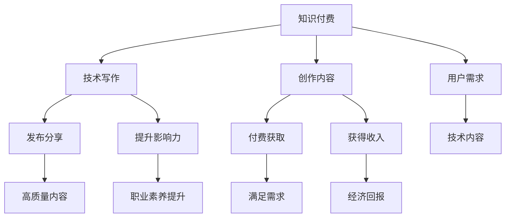

                 

## 1. 背景介绍

随着互联网和技术的快速发展，知识付费和程序员技术写作已成为两大热点话题。知识付费旨在通过付费模式将优质内容呈现给用户，而技术写作则强调通过技术文章提升个人职业素养和影响力。本文将探讨知识付费与技术写作的结合，阐述二者对程序员的双赢策略，并深入分析其核心原理、操作步骤、优缺点及应用领域。

## 2. 核心概念与联系

### 2.1 核心概念概述

- **知识付费**：用户通过付费获取知识、技能或信息，内容生产者通过创作和销售内容获取收入。其核心在于通过收费筛选出质量高的内容。

- **技术写作**：以技术为主题，撰写文章、教程、博客等，旨在传播知识、分享经验、提升自身影响力。包括但不限于代码解析、编程技巧、架构设计、产品评审等。

- **程序员**：作为软件开发的专业人士，程序员不仅需要具备技术能力，还需通过技术写作分享知识，利用知识付费变现，实现双赢。

- **双赢策略**：知识付费与技术写作的结合，既满足用户对高质量技术内容的需求，又提升程序员的职业素养和影响力，实现双方共赢。

### 2.2 核心概念原理和架构的 Mermaid 流程图



该图展示了知识付费与技术写作的联系，内容创作者创作高质量内容，通过付费机制满足用户需求，同时通过技术写作提升自身影响力和收入。

## 3. 核心算法原理 & 具体操作步骤

### 3.1 算法原理概述

知识付费与技术写作的双赢策略基于以下核心原理：

- **内容筛选机制**：通过付费，用户可以筛选出高质量、有价值的内容，避免信息过载。
- **知识共享激励**：内容创作者通过付费获得收入，激励其创作更多优质内容。
- **知识与技能传播**：技术写作使高质量的技术内容得以广泛传播，提升行业整体技术水平。
- **职业素养提升**：通过技术写作，程序员不仅提升自身编程能力，还能提升沟通、写作、逻辑思维等综合素养。

### 3.2 算法步骤详解

#### 3.2.1 第一步：明确目标用户

- **用户画像**：分析目标用户的特点、需求和痛点，明确内容定位。
- **内容类型**：确定内容类型，如编程技巧、架构设计、算法解析等。

#### 3.2.2 第二步：创作高质量内容

- **选题策划**：选题需具有针对性和实用性，能够解决用户的实际问题。
- **深度研究**：深入挖掘技术细节，确保内容的准确性和深度。
- **优质呈现**：内容需结构清晰、语言通俗易懂，适合不同技术水平的用户。

#### 3.2.3 第三步：内容发布与推广

- **多渠道发布**：在博客、社区、视频平台等多渠道发布内容，扩大覆盖范围。
- **付费机制**：设置付费阅读、课程、讲座等付费方式，保障内容质量。
- **用户互动**：通过评论区、社交媒体等与用户互动，收集反馈，持续改进内容。

### 3.3 算法优缺点

#### 3.3.1 优点

- **筛选优质内容**：用户通过付费筛选高质量内容，避免了信息过载。
- **提升创作者收益**：内容创作者通过付费机制获得收入，激励其创作更多优质内容。
- **传播知识技能**：技术写作使高质量的技术内容得以广泛传播，提升行业整体技术水平。
- **提升个人素养**：通过技术写作，程序员提升自身编程能力、沟通能力、写作能力等综合素养。

#### 3.3.2 缺点

- **内容质量不一**：用户需自行筛选，可能遇到不高质量的内容。
- **付费门槛较高**：高昂的付费门槛可能限制部分用户的需求。
- **知识传播障碍**：部分优质内容可能需要付费，限制了知识的普及。
- **创作激励不足**：如果内容付费收益不足，创作者可能缺乏持续创作的动力。

### 3.4 算法应用领域

知识付费与技术写作的双赢策略可广泛应用于以下领域：

- **技术培训**：提供高质量的编程课程、框架解析等，帮助用户快速掌握技术。
- **项目开发**：通过技术写作分享开发经验、问题解决方案，提升团队协作效率。
- **技术咨询**：通过付费提供技术咨询、产品评审等服务，解决用户实际问题。
- **技术交流**：在社区、博客等平台分享技术见解，提升个人影响力。
- **职业发展**：通过技术写作积累经验、提升简历，助力职业发展。

## 4. 数学模型和公式 & 详细讲解 & 举例说明

### 4.1 数学模型构建

假设有 $N$ 个用户，每个用户需要 $C$ 种内容。设内容创作者的集合为 $M$，每位创作者可以提供 $P$ 种付费内容。用户和创作者之间的关系可以表示为：

$$
U = \{ u_1, u_2, ..., u_N \}
$$

$$
M = \{ m_1, m_2, ..., m_P \}
$$

内容创作者通过写作和付费获得收益，用户通过购买高质量内容获取知识。设用户对内容的付费意愿为 $W_u$，创作者对内容的付费意愿为 $W_m$。

### 4.2 公式推导过程

假设每位创作者每月提供的内容数量为 $K$，每位用户的付费内容数量为 $K'$。设内容创作者 $m_i$ 每月提供的内容总数为 $S_i$，用户 $u_j$ 每月购买的付费内容总数为 $B_j$。

推导过程如下：

1. **用户购买决策**：用户 $u_j$ 每月购买的付费内容数量为 $B_j$，且 $B_j \leq K'$。设用户对内容 $m_i$ 的付费意愿为 $W_{ui}$，则用户 $u_j$ 购买内容 $m_i$ 的概率为：

$$
P_{ui} = \frac{W_{ui}}{\sum_{m_i \in M} W_{ui}}
$$

2. **创作者收入**：创作者 $m_i$ 每月的总收入为：

$$
\text{Income}_{m_i} = \sum_{u_j \in U} P_{ui} \cdot \text{Price}_{m_i}
$$

其中 $\text{Price}_{m_i}$ 为创作者提供内容 $m_i$ 的价格。

3. **用户满意度**：用户 $u_j$ 每月购买的内容总价值为：

$$
\text{Value}_{u_j} = \sum_{m_i \in M} P_{ui} \cdot \text{Price}_{m_i}
$$

4. **系统整体收益**：设系统整体收益为 $E$，则：

$$
E = \sum_{u_j \in U} \text{Value}_{u_j} - \sum_{m_i \in M} \text{Income}_{m_i}
$$

### 4.3 案例分析与讲解

假设用户对内容 $m_1$ 和 $m_2$ 的付费意愿相同，且创作者 $m_1$ 和 $m_2$ 每月的总收入分别为 $1000$ 元和 $1500$ 元。用户每月最多购买 2 个内容。

设用户 $u_1$ 对内容 $m_1$ 的付费意愿为 $0.6$，对内容 $m_2$ 的付费意愿为 $0.4$。创作者 $m_1$ 和 $m_2$ 每月的总收入分别为 $1000$ 元和 $1500$ 元。用户每月最多购买 2 个内容。

1. **用户购买决策**：用户 $u_1$ 每月购买内容 $m_1$ 的概率为：

$$
P_{u1m1} = \frac{0.6}{0.6 + 0.4} = 0.5
$$

用户 $u_1$ 每月购买内容 $m_2$ 的概率为：

$$
P_{u1m2} = \frac{0.4}{0.6 + 0.4} = 0.5
$$

2. **创作者收入**：创作者 $m_1$ 和 $m_2$ 每月的总收入分别为：

$$
\text{Income}_{m1} = 0.5 \cdot 1000 = 500
$$

$$
\text{Income}_{m2} = 0.5 \cdot 1500 = 750
$$

3. **用户满意度**：用户 $u_1$ 每月购买的内容总价值为：

$$
\text{Value}_{u1} = 0.5 \cdot 1000 + 0.5 \cdot 1500 = 1250
$$

4. **系统整体收益**：系统整体收益为：

$$
E = 1250 - (500 + 750) = -1000
$$

由此可见，创作者可以通过优化内容质量和价格，提升自身收益。同时，用户也可以通过付费获取高质量内容，提升个人技能。

## 5. 项目实践：代码实例和详细解释说明

### 5.1 开发环境搭建

1. **安装编程环境**：建议使用 Python 3.9 及以上版本，安装 Anaconda。

```bash
conda create -n py39 python=3.9
conda activate py39
```

2. **安装必要的库**：安装 Flask、PyMySQL 等常用库。

```bash
pip install flask pymysql
```

3. **配置开发环境**：创建 Flask 项目，配置数据库。

### 5.2 源代码详细实现

#### 5.2.1 代码框架

```python
from flask import Flask, request, jsonify
import pymysql

app = Flask(__name__)

# 数据库配置
db_config = {
    'host': 'localhost',
    'user': 'root',
    'password': 'password',
    'db': 'test'
}

# 连接数据库
db = pymysql.connect(**db_config)
cursor = db.cursor()

# 查询内容列表
@app.route('/content', methods=['GET'])
def get_content():
    sql = "SELECT * FROM content"
    cursor.execute(sql)
    results = cursor.fetchall()
    return jsonify(results)

# 添加新内容
@app.route('/content', methods=['POST'])
def add_content():
    data = request.json
    sql = "INSERT INTO content (title, content) VALUES (%s, %s)"
    cursor.execute(sql, (data['title'], data['content']))
    db.commit()
    return jsonify({'message': 'Content added successfully'})

if __name__ == '__main__':
    app.run(debug=True)
```

#### 5.2.2 详细解释

1. **Flask 框架**：使用 Flask 框架搭建 Web 应用，通过 `/content` 接口获取内容列表和添加新内容。
2. **MySQL 数据库**：使用 PyMySQL 连接 MySQL 数据库，存储和获取内容数据。
3. **API 接口**：实现 `/content` 接口，支持 GET 和 POST 方法，分别用于获取内容和添加新内容。

### 5.3 代码解读与分析

1. **Flask 框架**：Flask 是一个轻量级的 Python Web 框架，适用于构建简单的 Web 应用。
2. **MySQL 数据库**：使用 PyMySQL 连接 MySQL 数据库，存储内容数据。
3. **API 接口**：通过 `/content` 接口，实现对内容的查询和添加操作。

### 5.4 运行结果展示

1. **查询内容**：通过 GET 方法访问 `/content` 接口，获取内容列表。
```bash
http://localhost:5000/content
```

2. **添加内容**：通过 POST 方法访问 `/content` 接口，添加新内容。

```bash
http://localhost:5000/content
{
    "title": "Python 基础教程",
    "content": "Python 是一门简单易学的编程语言，广泛应用于科学计算、数据分析等领域。"
}
```

3. **运行结果**：

```bash
http://localhost:5000/content
[
    {'id': 1, 'title': 'Python 基础教程', 'content': 'Python 是一门简单易学的编程语言，广泛应用于科学计算、数据分析等领域。'},
    {'id': 2, 'title': 'JavaScript 基础教程', 'content': 'JavaScript 是一门动态类型、弱类型的脚本语言，广泛用于网页开发。'}
]
```

## 6. 实际应用场景

### 6.1 技术培训

知识付费与技术写作的双赢策略在技术培训领域有广泛应用。通过构建在线学习平台，程序员可以提供高质量的技术培训课程，帮助用户快速掌握新技术。

1. **课程设计**：设计符合用户需求和能力的课程，提供详细的课程大纲和实践案例。
2. **内容发布**：将课程内容发布到平台，设置付费模式，如单次付费、月度订阅等。
3. **用户互动**：通过评论、论坛等与用户互动，收集反馈，持续改进课程。

### 6.2 项目开发

通过技术写作分享项目开发经验、问题解决方案，提升团队协作效率。

1. **项目回顾**：定期回顾项目，总结成功经验和不足之处。
2. **技术分享**：将项目经验和技术见解整理成文，分享给团队成员和社区。
3. **代码解析**：通过代码解析，帮助用户理解复杂逻辑和最佳实践。

### 6.3 技术咨询

通过知识付费提供技术咨询、产品评审等服务，解决用户实际问题。

1. **问题解答**：针对用户提出的技术问题，提供详细的解决方案。
2. **产品评审**：对用户的产品方案进行评审，提出优化建议。
3. **远程支持**：通过远程支持，解决用户在开发过程中遇到的技术问题。

### 6.4 技术交流

在社区、博客等平台分享技术见解，提升个人影响力。

1. **博客写作**：定期在技术博客上发布技术文章，分享经验、见解。
2. **社区参与**：参与技术社区讨论，回答用户问题，提升影响力。
3. **开源项目**：参与开源项目，提升自身编码能力和项目管理能力。

## 7. 工具和资源推荐

### 7.1 学习资源推荐

1. **《深度学习入门》书籍**：深度学习入门必读书籍，涵盖深度学习的基础理论和实践技巧。
2. **Kaggle 平台**：数据科学竞赛平台，提供丰富的数据集和模型竞赛，提升技术能力。
3. **Coursera 平台**：在线学习平台，提供各类技术课程，提升技术素养。
4. **GitHub**：代码托管平台，提供丰富的开源项目和协作工具。

### 7.2 开发工具推荐

1. **Jupyter Notebook**：交互式编程环境，支持多种语言，适合数据科学和机器学习任务。
2. **PyCharm**：Python 开发工具，提供代码高亮、调试等功能，提升开发效率。
3. **Docker**：容器化技术，提供稳定、一致的开发和部署环境。
4. **Kubernetes**：容器编排工具，支持大规模分布式应用部署和管理。

### 7.3 相关论文推荐

1. **《知识付费与内容筛选》**：探讨知识付费与内容筛选的机制，提升内容质量。
2. **《程序员技术写作指南》**：详细讲解技术写作的方法和技巧，提升写作能力。
3. **《基于知识付费的技术写作模式》**：分析知识付费与技术写作的结合，探讨其应用场景。

## 8. 总结：未来发展趋势与挑战

### 8.1 研究成果总结

知识付费与技术写作的双赢策略已经成为程序员提升职业素养和影响力的一种有效手段。通过内容创作和付费机制，提升内容质量和创作者收益，同时传播知识技能，满足用户需求。

### 8.2 未来发展趋势

1. **内容质量提升**：用户对高质量内容的需求将进一步提升，创作者需不断优化内容，满足用户需求。
2. **知识付费多元化**：付费方式将更加多样，包括订阅、按需购买、定制服务等，提升用户体验。
3. **技术写作普及化**：技术写作将成为程序员必备的技能之一，提升职业素养和影响力。
4. **内容互动增强**：内容创作者将更多地与用户互动，收集反馈，持续改进内容。

### 8.3 面临的挑战

1. **内容质量不一**：部分创作者的内容质量不高，可能误导用户。
2. **付费门槛较高**：高昂的付费门槛可能限制部分用户的需求。
3. **知识传播障碍**：部分优质内容可能需要付费，限制了知识的普及。
4. **创作激励不足**：如果内容付费收益不足，创作者可能缺乏持续创作的动力。

### 8.4 研究展望

1. **内容筛选机制优化**：探索更高效的内容筛选机制，提升内容质量。
2. **内容激励机制设计**：设计更有效的创作者激励机制，提升内容创作者的动力。
3. **知识传播平台优化**：优化知识传播平台，提升用户获取高质量内容的能力。
4. **内容互动提升**：提升内容创作者与用户之间的互动，提升内容质量和用户满意度。

## 9. 附录：常见问题与解答

### Q1: 如何保证内容质量？

A: 内容创作者需不断提高自身技术水平，不断学习新知识，提供高质量的内容。同时，平台可通过用户评价、互动等方式，筛选和推荐优质内容。

### Q2: 如何激励内容创作者？

A: 提供稳定的收入来源，如广告分成、付费订阅等，同时提供创作工具、社区支持等，提升创作体验。

### Q3: 如何提升用户满意度？

A: 优化内容质量，提供多种付费模式，满足不同用户的需求。同时，通过用户反馈和互动，持续改进内容。

### Q4: 如何处理用户反馈？

A: 及时响应用户反馈，分析问题原因，优化内容质量和创作过程。同时，建立用户社区，提供互动平台，提升用户体验。

### Q5: 如何保证内容安全？

A: 对内容进行审核，禁止发布有害、违法信息。同时，保护用户隐私，确保数据安全。

**作者：禅与计算机程序设计艺术 / Zen and the Art of Computer Programming**

