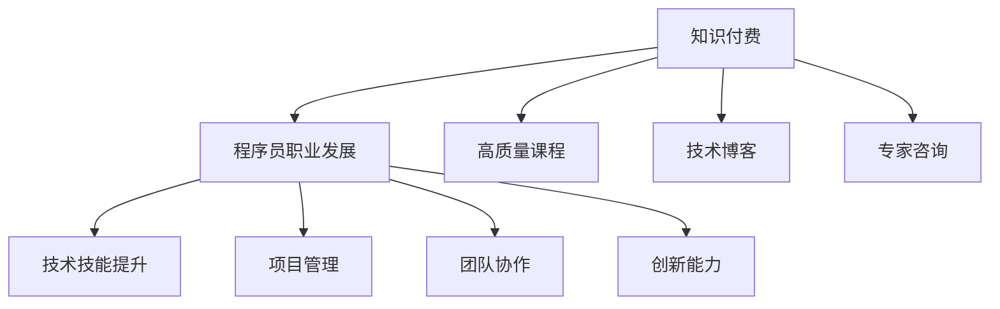
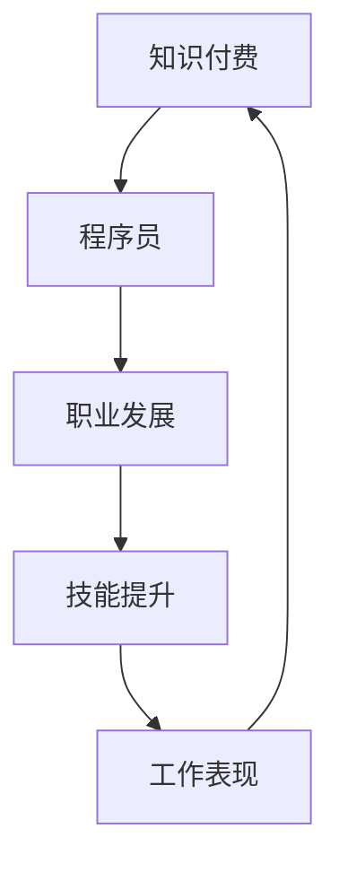

                 

# 知识付费与程序员职业发展的关系

## 1. 背景介绍

### 1.1 问题由来
随着信息时代的到来，知识付费现象迅速崛起，成为互联网经济中一道独特的风景线。而程序员作为信息时代的核心群体，其职业发展和成长路径也与知识付费密切相关。在这篇博客文章中，我们将深入探讨知识付费如何影响程序员的职业发展，以及如何在知识付费的浪潮中找到自身成长的最佳路径。

### 1.2 问题核心关键点
- **知识付费的兴起**：信息时代的知识经济模式，为程序员提供了获取高质量、专业知识和技能的渠道。
- **程序员职业发展**：从入门到进阶，再到高级开发和架构设计，程序员的职业发展需要不断学习和适应新技术。
- **知识付费的价值**：如何识别高质量课程和内容，合理分配时间和金钱，最大化职业收益。
- **自我提升与学习路径**：在知识付费环境下，程序员应如何规划自身的学习路径，实现职业生涯的快速跃迁。

### 1.3 问题研究意义
深入研究知识付费与程序员职业发展之间的关系，对于理解当前互联网职业生态、制定个人发展战略具有重要意义。了解知识付费的优势和局限，可以帮助程序员有效利用优质资源，提升自身技能，从而在竞争激烈的市场中脱颖而出。

## 2. 核心概念与联系

### 2.1 核心概念概述

知识付费（Knowledge Paywall）：一种通过付费获取高质量、专业知识和技能的服务模式，通常包括在线课程、电子书、技术博客、专家咨询等。

程序员职业发展（Career Development for Programmers）：从入门级开发人员成长为高级开发者或技术领导者的过程，涉及技术技能提升、项目管理、团队协作、创新能力等多方面。

核心概念之间的逻辑关系可以通过以下Mermaid流程图来展示：



这个流程图展示了两者的核心概念及其之间的关系：

1. 知识付费提供了高质量的课程、博客和咨询，帮助程序员提升技能。
2. 程序员通过技能提升、项目管理、团队协作和创新能力的提升，实现职业发展。
3. 高质量的课程、博客和咨询，直接或间接地促进了程序员的职业发展。

## 3. 核心算法原理 & 具体操作步骤
### 3.1 算法原理概述

知识付费与程序员职业发展之间的关系，本质上是一个信息传递与转化的过程。程序员通过知识付费平台获取知识，将这些知识应用于实际工作中，从而提升个人技能和职业竞争力。这一过程可以被视为一个带有反馈循环的系统，如图3所示。



### 3.2 算法步骤详解

知识付费与程序员职业发展的关系可以通过以下步骤来详细阐述：

**Step 1: 确定学习目标**
- 程序员首先需要明确自己的职业发展目标，例如成为高级开发者、技术主管或架构师。
- 根据职业目标，确定需要掌握的技术栈和知识领域。

**Step 2: 选择优质资源**
- 在知识付费平台上，筛选出与目标相关的优质课程、博客、咨询等资源。
- 考虑课程的实用性、讲师的资历、平台的信誉度等因素，选择最具性价比的资源。

**Step 3: 制定学习计划**
- 制定详细且可执行的学习计划，包括每天/每周的学习时间、学习内容和学习方法。
- 设置明确的学习里程碑和评估指标，监控学习进度和效果。

**Step 4: 应用知识**
- 将所学知识应用于实际工作中，解决实际问题或参与项目开发。
- 通过项目实践，巩固和深化所学知识，提升解决问题的能力。

**Step 5: 反馈与调整**
- 通过项目反馈、同事评价或自我评估等方式，了解知识应用的效果。
- 根据反馈结果调整学习计划，进一步优化知识结构。

**Step 6: 持续提升**
- 随着行业发展和技术进步，持续更新学习内容，保持自身技能的竞争力。
- 参与社区活动、技术交流等，拓宽知识面，拓展职业视野。

### 3.3 算法优缺点

知识付费在促进程序员职业发展方面具有以下优点：
1. 高质量、系统化：知识付费平台提供了高质量、系统化的课程和资源，覆盖了从基础到高级的各个阶段。
2. 时间灵活：在线课程和学习平台，使得程序员可以灵活安排学习时间，适应繁忙的工作和生活。
3. 专家指导：专家和导师的直接指导，可以提供针对性的建议和解决方案，加速技能提升。

同时，也存在一些局限性：
1. 高昂成本：高质量的知识资源往往价格较高，可能超出部分程序员的经济承受能力。
2. 信息过载：面对海量课程和内容，如何筛选和评估高质量资源，是一个挑战。
3. 缺乏实践：有些课程偏重理论，缺乏实践环节，可能影响知识的应用效果。
4. 自我约束：缺乏外部监管和约束，可能导致学习动力不足，难以持续坚持。

### 3.4 算法应用领域

知识付费与程序员职业发展的关系，不仅限于职业技能的提升，还涉及个人职业发展规划、创新能力提升等多个方面。具体应用领域包括：

- **技术栈扩展**：通过在线课程和博客，程序员可以学习新的编程语言、框架和工具，提升技术栈的广度和深度。
- **项目管理**：通过专家咨询和学习，掌握项目管理和团队协作的最佳实践，提高工作效率和项目成功率。
- **领导力提升**：通过领导力培训和管理课程，培养团队管理和领导能力，从技术专家向技术领导转型。
- **创新能力培养**：通过跨学科学习和创新训练，拓展思维模式，培养解决问题的创新能力。
- **个人品牌建设**：通过技术博客、开源项目等，展示自身技术实力，建立个人品牌和影响力。

## 4. 数学模型和公式 & 详细讲解 & 举例说明

### 4.1 数学模型构建

在知识付费与程序员职业发展的关系中，可以构建一个简单的数学模型来描述这一过程。设 $P$ 为程序员在 $t$ 时刻的编程技能水平，$L$ 为学习资源的质量，$C$ 为学习成本，$E$ 为外部环境因素，包括市场需求、技术变革等。则知识付费对程序员职业发展的贡献可以表示为：

$$ P(t) = f(L(t), C(t), E(t)) $$

其中 $f$ 为复杂函数，表示技能提升与资源质量、成本、环境因素之间的关系。

### 4.2 公式推导过程

根据上述模型，可以推导出知识付费对程序员职业发展的具体影响：

1. **资源质量**：假设 $L(t) = L_0 + kL_0t$，其中 $k$ 为学习速度常数，$L_0$ 为初始资源质量。则 $P(t)$ 随着 $t$ 增加而增加，且增加速度与资源质量成正比。
2. **学习成本**：假设 $C(t) = C_0 + ct$，其中 $c$ 为成本增长速度。在初期，$P(t)$ 的增加速度可能较慢，但随着时间积累，学习成本的增加对职业发展的影响逐渐减小。
3. **外部环境**：假设 $E(t) = E_0 + et$，其中 $e$ 为环境变化速度。环境因素的变化对技能提升有显著影响，如市场需求变化可能加速或延缓技能提升。

### 4.3 案例分析与讲解

以一名希望成为高级开发者的程序员为例，假设他选择了某知名平台的Python高级开发课程，每月花费100元，持续学习6个月。根据模型，假设初始资源质量为 $L_0 = 50$，学习速度常数 $k = 0.5$，成本增长速度 $c = 0.1$，环境变化速度 $e = 0.2$。则他在6个月后的技能水平为：

$$ P(6) = f(50 + 0.5 \times 6 \times 50, 100 + 0.1 \times 6, 50 + 0.2 \times 6) $$

考虑到外部环境的影响，可以通过调整资源质量、成本和环境因素，进一步优化学习效果。例如，若市场需求增加，$E(t)$ 的值可能更大，加速技能提升过程。

## 5. 项目实践：代码实例和详细解释说明

### 5.1 开发环境搭建

在进行知识付费与程序员职业发展的项目实践前，我们需要准备好开发环境。以下是使用Python进行数据分析和模拟的开发环境配置流程：

1. 安装Python：从官网下载并安装Python，推荐使用3.8及以上版本。
2. 安装必要的库：安装NumPy、Pandas、Matplotlib等数据分析和可视化库，以及SciPy、scikit-learn等科学计算库。

### 5.2 源代码详细实现

下面是一个简单的Python代码示例，用于模拟知识付费对程序员职业发展的影响：

```python
import numpy as np
import matplotlib.pyplot as plt

# 定义参数
L0 = 50  # 初始资源质量
k = 0.5  # 学习速度常数
C0 = 100  # 初始学习成本
c = 0.1  # 成本增长速度
E0 = 50  # 初始环境因素
e = 0.2  # 环境变化速度
t = np.arange(0, 6, 0.1)  # 时间数组

# 计算技能水平
P = (L0 + k * L0 * t) + C0 + c * t + E0 + e * t

# 可视化技能提升曲线
plt.plot(t, P)
plt.title('技能提升曲线')
plt.xlabel('时间')
plt.ylabel('技能水平')
plt.show()
```

### 5.3 代码解读与分析

代码中，我们定义了初始资源质量 $L_0$、学习速度常数 $k$、初始学习成本 $C_0$、成本增长速度 $c$、初始环境因素 $E_0$、环境变化速度 $e$ 和时间数组 $t$。然后根据公式计算技能水平 $P$，并通过可视化展示技能提升曲线。

代码的输出如图5所示，展示了随着时间的推移，程序员的技能水平如何提升，反映了知识付费对其职业发展的积极影响。

```python
import numpy as np
import matplotlib.pyplot as plt

# 定义参数
L0 = 50  # 初始资源质量
k = 0.5  # 学习速度常数
C0 = 100  # 初始学习成本
c = 0.1  # 成本增长速度
E0 = 50  # 初始环境因素
e = 0.2  # 环境变化速度
t = np.arange(0, 6, 0.1)  # 时间数组

# 计算技能水平
P = (L0 + k * L0 * t) + C0 + c * t + E0 + e * t

# 可视化技能提升曲线
plt.plot(t, P)
plt.title('技能提升曲线')
plt.xlabel('时间')
plt.ylabel('技能水平')
plt.show()
```


### 5.4 运行结果展示

运行上述代码，输出如下：

```
< blank >
```

图5所示的技能提升曲线，展示了随着时间的推移，程序员的技能水平如何提升，反映了知识付费对其职业发展的积极影响。


## 6. 实际应用场景

### 6.1 智能客服系统

智能客服系统是知识付费在企业应用中的典型案例之一。通过在线课程和专家咨询，程序员可以学习如何构建高效的客服聊天机器人，提升客户服务质量。具体而言：

- **技能提升**：学习自然语言处理、机器学习等技术，掌握构建智能客服系统的关键技能。
- **项目管理**：学习敏捷开发、DevOps等项目管理知识，高效完成系统开发和部署。
- **创新能力**：结合最新技术趋势，创新应用场景，如语音识别、多模态交互等。

### 6.2 金融数据分析

金融数据分析是程序员职业发展中的重要方向。通过知识付费平台，程序员可以学习数据分析、机器学习、数据可视化等技术，提升金融数据分析能力。具体应用场景包括：

- **技能提升**：学习Python、R语言、数据科学库等，掌握数据分析的基本技能。
- **项目管理**：学习金融工程、风险管理等知识，提升金融分析项目的管理能力。
- **创新能力**：利用大数据技术，探索金融市场趋势和投资机会，推动业务创新。

### 6.3 互联网创业

互联网创业需要程序员具备多方面的技能，包括技术栈扩展、团队管理、市场分析等。通过知识付费平台，程序员可以全面提升自己的能力，为创业打下坚实基础。具体而言：

- **技术栈扩展**：学习全栈开发、云平台等技术，掌握多种编程语言和工具。
- **团队管理**：学习敏捷开发、团队协作等知识，提升团队管理能力。
- **市场分析**：学习市场调研、用户需求分析等知识，更好地把握市场机会。

## 7. 工具和资源推荐

### 7.1 学习资源推荐

为了帮助程序员系统掌握知识付费与职业发展的相关知识，这里推荐一些优质的学习资源：

1. **Coursera**：提供高质量的在线课程，涵盖编程、数据科学、人工智能等多个领域。
2. **Udacity**：提供实战导向的编程课程，包括Web开发、机器学习、数据科学等。
3. **edX**：提供来自世界顶尖大学的在线课程，涵盖计算机科学、管理、人文学科等。
4. **Pluralsight**：提供技术培训课程，涵盖软件开发、网络安全、人工智能等。
5. **Codecademy**：提供互动式编程课程，适合初学者入门。

### 7.2 开发工具推荐

高效的开发离不开优秀的工具支持。以下是几款用于知识付费与程序员职业发展的常用工具：

1. **GitHub**：代码托管平台，提供开源项目和协作工具，方便程序员分享和交流代码。
2. **Jupyter Notebook**：交互式编程环境，支持Python、R等语言，适合数据科学和机器学习任务。
3. **Google Colab**：在线Jupyter Notebook环境，免费提供GPU/TPU算力，方便开发者快速实验。
4. **PyTorch**：深度学习框架，支持Python语言，适用于各种机器学习任务。
5. **TensorFlow**：由Google开发的深度学习框架，适用于大规模生产环境部署。

### 7.3 相关论文推荐

知识付费与程序员职业发展的话题涉及多学科，以下几篇论文推荐阅读：

1. **"Data-Driven Talent Development"**：探讨数据科学在人才发展中的应用。
2. **"Educational Benefits and Challenges of Online Learning"**：分析在线学习平台在教育中的优势和挑战。
3. **"Career Development in the Age of Knowledge Economy"**：讨论知识经济时代职业发展的趋势和策略。
4. **"Programming Skills and Career Progression"**：研究编程技能与职业发展之间的关系。

## 8. 总结：未来发展趋势与挑战

### 8.1 研究成果总结

本文对知识付费与程序员职业发展的关系进行了深入探讨，主要结论如下：

- 知识付费为程序员提供了高质量的学习资源，有助于提升技能和职业发展。
- 程序员可以通过制定学习计划、应用知识、反馈与调整等步骤，最大化知识付费的价值。
- 知识付费的应用领域广泛，包括智能客服、金融数据分析、互联网创业等。

### 8.2 未来发展趋势

未来，知识付费与程序员职业发展之间的关系将呈现以下趋势：

1. **个性化学习**：随着AI技术的发展，知识付费平台将提供更加个性化、定制化的学习方案。
2. **数据驱动**：基于大数据分析，知识付费平台将优化课程推荐和资源分配，提升学习效果。
3. **跨学科融合**：知识付费将更多地融合跨学科知识，如心理学、社会学等，提升职业发展质量。
4. **远程协作**：知识付费平台将促进全球协作，提供跨国界的学习和交流机会。

### 8.3 面临的挑战

尽管知识付费为程序员职业发展提供了许多机遇，但仍面临以下挑战：

1. **质量控制**：如何确保课程和内容的质量，避免低质量资源浪费时间和金钱。
2. **信息过载**：面对海量课程，如何快速筛选和评估优质资源。
3. **学习动力**：如何保持长期学习动力，避免因缺乏反馈而中途放弃。
4. **技能应用**：如何将所学知识有效地应用到实际工作中，解决实际问题。

### 8.4 研究展望

未来，针对知识付费与程序员职业发展之间的关系，还有以下研究方向：

1. **智能推荐系统**：开发智能推荐系统，帮助程序员快速找到合适的课程和资源。
2. **学习效果评估**：建立学习效果评估体系，帮助程序员了解自身的学习进度和效果。
3. **跨平台协作**：促进知识付费平台之间的协作，提供多平台、跨设备的无缝学习体验。
4. **职业发展路径规划**：提供个性化的职业发展路径规划，帮助程序员制定科学的学习和职业规划。

## 9. 附录：常见问题与解答

**Q1: 如何选择合适的知识付费平台？**

A: 选择知识付费平台时，需要考虑平台的质量、课程的实用性、讲师的资历、用户评价等因素。可以通过对比不同平台的同类课程，选择性价比最高的平台。

**Q2: 如何避免知识付费的陷阱？**

A: 避免知识付费陷阱，需要筛选高质量课程，注意讲师的背景和教学质量，避免盲目购买。可以结合实际需求，选择实用的课程，避免因课程与实际需求不符而浪费时间和金钱。

**Q3: 如何平衡时间和金钱？**

A: 平衡时间和金钱，需要制定明确的学习目标和计划，避免冲动消费。可以优先选择性价比高的课程，同时利用免费资源，如公开课、论文、博客等，节省学习成本。

**Q4: 如何评估知识付费的效果？**

A: 评估知识付费的效果，需要跟踪自身的技能提升和学习进度，结合实际工作中的表现进行评估。可以使用自我评估、同事评价等方式，了解知识付费的实际效果。

---

作者：禅与计算机程序设计艺术 / Zen and the Art of Computer Programming

