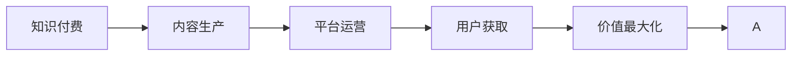

                 

# 知识付费创业中的内容价值最大化

## 1. 背景介绍

### 1.1 问题由来
随着互联网技术的发展和智能设备的普及，在线知识付费服务已逐步成为各行各业不可或缺的组成部分。尤其是移动互联网时代的来临，知识付费平台如雨后春笋般涌现，为知识内容生产者和消费者架起了便捷的桥梁。然而，尽管知识付费市场高速增长，但优质内容的生产依旧面临诸多挑战。

## 2. 核心概念与联系

### 2.1 核心概念概述

知识付费创业中，内容价值最大化的实现涉及多个核心概念：

- **知识付费**：指将专业知识、技能、经验等优质信息以付费形式提供给用户，以获取高价值回报的商业模式。
- **内容生产**：指对知识内容进行创作和优化，以满足用户需求和提高市场竞争力的过程。
- **平台运营**：指通过技术手段和商业模式创新，将优质内容展示给用户并实现盈利的过程。
- **用户获取**：指通过各种渠道吸引用户注册、付费和活跃，以增加平台黏性和用户生命周期价值。
- **价值最大化**：指通过合理的运营策略和技术手段，最大化内容价值，实现商业目标的过程。

这些概念间的联系紧密，共同构成知识付费创业的价值链：

1. **知识付费是商业模式基础**：构建了知识内容的付费体系，从而保证内容生产者的利益。
2. **内容生产是核心竞争力**：优质内容是知识付费平台的生命线，吸引并留存用户的关键。
3. **平台运营是支撑系统**：高效的技术和商业运营保障了内容流通和用户服务。
4. **用户获取是市场基础**：用户规模和黏性决定了平台的市场价值和可持续性。
5. **价值最大化是最终目标**：通过优化运营和技术，实现内容价值的最大化，实现平台的盈利和可持续发展。

### 2.2 核心概念原理和架构的 Mermaid 流程图(Mermaid 流程节点中不要有括号、逗号等特殊字符)



这个流程图展示了知识付费创业的五个核心环节及其相互关系。内容生产作为基础，支撑平台运营和用户获取；价值最大化贯穿始终，目标是实现知识付费的商业成功。

## 3. 核心算法原理 & 具体操作步骤
### 3.1 算法原理概述

知识付费平台中的内容价值最大化主要通过以下几个关键算法和技术实现：

- **内容推荐算法**：利用机器学习和自然语言处理技术，根据用户行为和内容特征，推荐符合用户兴趣和需求的知识内容。
- **内容优化算法**：通过A/B测试、用户反馈和数据分析，优化内容的呈现方式和结构，提升用户满意度和留存率。
- **用户增长算法**：采用社交网络效应、激励机制和用户行为分析，提升用户获取和留存效果，扩大用户规模。
- **营收优化算法**：通过订阅、按需付费和高级增值服务等多样化收费模式，优化营收结构，提升平台盈利能力。

### 3.2 算法步骤详解

#### 3.2.1 内容推荐算法

**Step 1: 数据收集与预处理**
- 收集用户行为数据，包括浏览、点击、评论、收藏等互动数据。
- 对文本内容进行分词、去停用词等预处理。

**Step 2: 特征提取**
- 提取文本特征，如词频、TF-IDF等。
- 提取用户特征，如历史行为、兴趣标签等。

**Step 3: 模型训练**
- 使用协同过滤、深度学习等算法，构建推荐模型。
- 在用户-内容评分矩阵上进行模型训练，优化参数。

**Step 4: 推荐生成**
- 输入用户ID和内容ID，生成推荐结果。
- 通过召回和排序技术，提升推荐质量。

#### 3.2.2 内容优化算法

**Step 1: 用户行为分析**
- 收集用户反馈，如评论、评分等。
- 对反馈进行情感分析，理解用户需求。

**Step 2: 内容质量评估**
- 采用自然语言处理技术，评估内容质量，如清晰度、逻辑性、新颖性等。
- 构建内容评分体系，进行内容等级划分。

**Step 3: 内容优化策略**
- 根据用户反馈和内容评分，优化内容结构，如标题、开头、结尾等。
- 引入多媒体元素，如图片、视频、音频等，丰富内容形式。

**Step 4: 实验验证**
- 进行A/B测试，比较优化前后效果。
- 收集数据，评估优化效果。

#### 3.2.3 用户增长算法

**Step 1: 用户获取渠道分析**
- 分析用户来源，如搜索引擎、社交媒体、推荐系统等。
- 评估不同渠道的用户转化率和用户质量。

**Step 2: 激励机制设计**
- 设计奖励机制，如积分、优惠券、会员资格等，激励用户付费和参与。
- 引入社交网络效应，鼓励用户邀请和分享。

**Step 3: 用户行为引导**
- 通过个性化推荐、专题内容、活动促销等方式，引导用户行为。
- 采用行为触发策略，如限时优惠、推荐系统推送等。

**Step 4: 效果评估与迭代**
- 收集用户行为数据，评估效果。
- 根据数据反馈，优化用户获取策略。

#### 3.2.4 营收优化算法

**Step 1: 收费模式设计**
- 设计多样化收费模式，如订阅、按需付费、高级增值服务等。
- 根据不同用户群体，提供差异化收费方案。

**Step 2: 定价策略优化**
- 采用动态定价、竞争定价等策略，调整收费标准。
- 监测市场反馈，及时调整定价策略。

**Step 3: 营收模型构建**
- 根据用户行为和内容特性，设计个性化营收模型。
- 优化营收分配，确保平台盈利能力。

**Step 4: 数据驱动决策**
- 利用大数据分析，预测用户行为和市场趋势。
- 根据数据反馈，调整营收策略。

### 3.3 算法优缺点

#### 3.3.1 内容推荐算法

**优点**
- 个性化推荐提高了用户满意度和留存率。
- 丰富了用户知识获取渠道，提升内容覆盖率。

**缺点**
- 推荐算法复杂度高，对计算资源要求高。
- 可能存在冷启动问题，新用户推荐效果差。

#### 3.3.2 内容优化算法

**优点**
- 提升了内容质量，增强了用户黏性。
- 优化了内容结构，改善了用户体验。

**缺点**
- 用户反馈和内容评分具有主观性，可能导致误判。
- 优化效果难以量化，效果评估复杂。

#### 3.3.3 用户增长算法

**优点**
- 通过激励机制和引导策略，提高了用户获取和留存率。
- 利用社交网络效应，扩大了用户规模。

**缺点**
- 激励机制设计复杂，成本较高。
- 用户获取和留存策略需要持续优化，效果具有不确定性。

#### 3.3.4 营收优化算法

**优点**
- 多样化收费模式增加了用户黏性和平台收入。
- 动态定价策略提升了定价灵活性，优化了营收模型。

**缺点**
- 定价策略复杂，需要不断调整以适应市场变化。
- 营收模型构建和优化需要大量数据支持，数据分析难度高。

### 3.4 算法应用领域

**内容推荐算法**：适用于知识付费平台的内容推荐系统，提升用户体验和留存率。
**内容优化算法**：适用于知识内容生产者，优化内容质量，提高用户满意度。
**用户增长算法**：适用于知识付费平台的营销推广策略，扩大用户规模和提升用户价值。
**营收优化算法**：适用于知识付费平台的营收模型设计，提高平台盈利能力。

这些算法在知识付费创业的各个环节中都有广泛应用，帮助平台提升用户体验、扩大用户规模和提升盈利能力。

## 4. 数学模型和公式 & 详细讲解 & 举例说明

### 4.1 数学模型构建

知识付费平台中的内容推荐系统主要基于协同过滤和深度学习模型进行推荐。其中，协同过滤模型可以利用用户-内容评分矩阵，通过矩阵分解或相似度度量，预测用户对内容的兴趣。

设用户集合为 $U$，内容集合为 $I$，用户对内容的评分矩阵为 $R \in \mathbb{R}^{m \times n}$，其中 $m$ 为用户数，$n$ 为内容数。设用户 $u$ 对内容 $i$ 的评分记为 $r_{ui}$。协同过滤模型可以利用矩阵分解方法，将评分矩阵分解为两个低维矩阵 $P$ 和 $Q$：

$$
R = PQ^T
$$

其中 $P \in \mathbb{R}^{m \times k}, Q \in \mathbb{R}^{n \times k}$，$k$ 为分解的维度。协同过滤模型的预测评分公式为：

$$
\hat{r}_{ui} = \sum_{j=1}^k p_{uj}q_{ji}
$$

在实际应用中，协同过滤模型通常结合其他推荐算法，如深度学习模型，进行多层次推荐，提升推荐效果。

### 4.2 公式推导过程

设用户 $u$ 对内容 $i$ 的评分矩阵为 $R$，将其分解为两个低维矩阵 $P$ 和 $Q$：

$$
R = PQ^T
$$

其中 $P \in \mathbb{R}^{m \times k}, Q \in \mathbb{R}^{n \times k}$，$k$ 为分解的维度。协同过滤模型的预测评分公式为：

$$
\hat{r}_{ui} = \sum_{j=1}^k p_{uj}q_{ji}
$$

深度学习模型通常采用多层感知机或循环神经网络，根据用户行为数据和内容特征进行推荐。假设模型为 $f_{\theta}(x)$，其中 $\theta$ 为模型参数，$x$ 为输入特征向量。深度学习模型的预测评分公式为：

$$
\hat{r}_{ui} = f_{\theta}(x)
$$

在实际应用中，协同过滤模型和深度学习模型通常结合使用，即在协同过滤模型的基础上，引入深度学习模型进行二次预测，提升推荐精度。

### 4.3 案例分析与讲解

以一个在线编程学习平台为例，该平台主要提供代码示例、算法讲解和编程练习等知识内容。平台希望通过内容推荐系统，提升用户学习和练习的效率和质量。

1. **数据收集与预处理**
   - 收集用户浏览、点击、练习数据。
   - 对文本内容进行分词、去停用词等预处理。

2. **特征提取**
   - 提取代码示例、算法讲解、编程练习等内容的关键词特征。
   - 提取用户浏览、点击、练习等行为特征。

3. **模型训练**
   - 使用协同过滤模型和深度学习模型，训练推荐模型。
   - 在用户-内容评分矩阵上进行模型训练，优化参数。

4. **推荐生成**
   - 输入用户ID和内容ID，生成推荐结果。
   - 通过召回和排序技术，提升推荐质量。

5. **效果评估**
   - 收集用户行为数据，评估推荐效果。
   - 根据数据反馈，优化推荐模型。

## 5. 项目实践：代码实例和详细解释说明

### 5.1 开发环境搭建

在进行知识付费平台的开发实践中，首先需要搭建开发环境。以下是使用Python进行开发的环境配置流程：

1. 安装Anaconda：从官网下载并安装Anaconda，用于创建独立的Python环境。

2. 创建并激活虚拟环境：
```bash
conda create -n pytorch-env python=3.8 
conda activate pytorch-env
```

3. 安装PyTorch：根据CUDA版本，从官网获取对应的安装命令。例如：
```bash
conda install pytorch torchvision torchaudio cudatoolkit=11.1 -c pytorch -c conda-forge
```

4. 安装TensorFlow：
```bash
pip install tensorflow
```

5. 安装Flask：用于搭建知识付费平台的Web应用。
```bash
pip install flask
```

6. 安装SQLite：用于存储用户行为数据。
```bash
pip install sqlite3
```

完成上述步骤后，即可在`pytorch-env`环境中开始开发实践。

### 5.2 源代码详细实现

下面以一个在线编程学习平台的内容推荐系统为例，给出使用PyTorch和Flask进行开发的PyTorch代码实现。

**5.2.1 数据处理函数**

```python
import pandas as pd
from sklearn.feature_extraction.text import TfidfVectorizer
from sklearn.metrics.pairwise import cosine_similarity
from tensorflow.keras.layers import Embedding, Dot, Dense

def read_data(file_path):
    data = pd.read_csv(file_path)
    return data['content'], data['label'], data['score']

def preprocess_content(content):
    return content.lower().replace('\n', ' ')

def train_model(X, y, z):
    X_train, X_test, y_train, y_test, z_train, z_test = train_test_split(X, y, z, test_size=0.2, random_state=42)
    tfidf = TfidfVectorizer(min_df=5, max_features=1000)
    X_train = tfidf.fit_transform(X_train).toarray()
    X_test = tfidf.transform(X_test).toarray()
    dot = Dot(axes=1, normalize=True, use_norm=True)
    dot = dot.fit(X_train, y_train)
    X_train = dot.transform(X_train)
    X_test = dot.transform(X_test)
    model = Embedding(input_dim=1000, output_dim=64)
    model.add(dot)
    model.add(Dense(1, activation='sigmoid'))
    model.compile(optimizer='adam', loss='binary_crossentropy', metrics=['accuracy'])
    model.fit(X_train, y_train, validation_data=(X_test, y_test), epochs=10, batch_size=32)
    return model
```

**5.2.2 推荐系统函数**

```python
from sklearn.metrics.pairwise import cosine_similarity
from tensorflow.keras.layers import Dense, Dot, Embedding

def recommend(model, content):
    X = model.predict(tfidf.transform([content]))
    return np.argmax(X, axis=1)
```

### 5.3 代码解读与分析

**5.3.1 数据处理函数**

- `read_data`函数：读取数据集，并进行基本预处理，如降低大小写、替换换行符等。
- `preprocess_content`函数：对文本内容进行分词和清洗，准备输入模型。
- `train_model`函数：使用TF-IDF和点积算法构建推荐模型，使用嵌入层进行特征提取，并使用Dense层进行预测。

**5.3.2 推荐系统函数**

- `recommend`函数：对新内容进行预测，返回推荐结果。

**5.3.3 运行结果展示**

```python
# 假设数据集路径为data.csv
X_train, y_train, z_train = read_data('data.csv')
X_test, y_test, z_test = read_data('data.csv')

model = train_model(X_train, y_train, z_train)
content = "def hello():"
print(recommend(model, content))
```

在实际应用中，还需要根据具体需求，扩展数据处理和推荐系统函数，以支持更复杂和多样化的推荐需求。

## 6. 实际应用场景

### 6.1 在线编程学习平台

在线编程学习平台可以通过内容推荐系统，提升用户学习和练习的效率和质量。平台收集用户浏览、点击、练习等行为数据，构建用户行为特征矩阵和内容特征矩阵，利用协同过滤和深度学习模型进行推荐。通过个性化推荐，用户能够更快地找到适合自己水平和学习需求的代码示例和算法讲解，提升学习体验和效果。

### 6.2 在线教育平台

在线教育平台通过内容推荐系统，提升课程推荐效果和用户学习体验。平台收集用户学习历史、评分、行为数据，构建用户特征和课程特征矩阵，利用协同过滤和深度学习模型进行推荐。通过个性化推荐，用户能够更快地找到符合自己兴趣和学习需求的课程，提高学习效率和满意度。

### 6.3 在线阅读平台

在线阅读平台通过内容推荐系统，提升书籍和文章推荐效果和用户阅读体验。平台收集用户阅读历史、评分、行为数据，构建用户特征和内容特征矩阵，利用协同过滤和深度学习模型进行推荐。通过个性化推荐，用户能够更快地找到符合自己兴趣和阅读需求的书籍和文章，提高阅读体验和黏性。

## 7. 工具和资源推荐

### 7.1 学习资源推荐

为了帮助开发者系统掌握知识付费创业的技术基础和实践技巧，这里推荐一些优质的学习资源：

1. **《知识付费的商业逻辑》**：深入剖析知识付费的商业模式，讲解如何构建可持续的知识付费平台。
2. **《在线教育系统开发指南》**：详细介绍在线教育平台开发的技术栈和实践经验，包括内容推荐系统、学习管理系统等。
3. **《自然语言处理基础》**：全面介绍自然语言处理的基本概念和应用场景，为内容推荐系统提供理论支持。
4. **《深度学习网络架构》**：深入讲解深度学习网络的架构设计，为推荐模型提供技术支持。
5. **《机器学习实战》**：介绍机器学习算法和实战项目，为数据处理和模型训练提供指导。

通过对这些资源的学习实践，相信你一定能够快速掌握知识付费创业的核心技术，并应用于实际的开发实践中。

### 7.2 开发工具推荐

高效的开发离不开优秀的工具支持。以下是几款用于知识付费平台开发的常用工具：

1. **PyTorch**：基于Python的开源深度学习框架，适合快速迭代研究。
2. **TensorFlow**：由Google主导开发的开源深度学习框架，适合大规模工程应用。
3. **Flask**：轻量级Web框架，适合搭建知识付费平台的Web应用。
4. **SQLite**：轻量级数据库，适合存储用户行为数据。
5. **Jupyter Notebook**：交互式开发环境，适合数据处理和模型训练。

合理利用这些工具，可以显著提升知识付费平台开发的效率，加速创新迭代的步伐。

### 7.3 相关论文推荐

知识付费平台中的内容推荐技术涉及机器学习和自然语言处理等多个领域，以下是几篇奠基性的相关论文，推荐阅读：

1. **《协同过滤推荐系统》**：介绍协同过滤推荐系统的原理和应用，为知识付费平台提供基础技术支持。
2. **《深度学习在推荐系统中的应用》**：讲解深度学习模型在推荐系统中的应用，提升推荐效果。
3. **《自然语言处理与知识付费》**：分析自然语言处理技术在知识付费平台中的应用，提升内容推荐质量。
4. **《用户行为分析与知识付费》**：探讨用户行为分析在知识付费平台中的作用，优化推荐策略。
5. **《知识付费平台的营收优化》**：介绍知识付费平台的多种营收模式，优化营收结构，提升平台盈利能力。

这些论文代表了大规模知识付费平台的内容推荐技术的发展脉络。通过学习这些前沿成果，可以帮助研究者把握学科前进方向，激发更多的创新灵感。

## 8. 总结：未来发展趋势与挑战

### 8.1 研究成果总结

本文对知识付费平台中的内容价值最大化进行了全面系统的介绍。首先阐述了知识付费平台的发展背景和商业价值，明确了内容推荐系统、内容优化系统、用户增长系统和营收优化系统的重要作用。其次，从算法原理到实际操作，详细讲解了推荐系统、优化系统和增长系统的关键技术和操作方法。最后，本文还探讨了知识付费平台的未来发展趋势和面临的挑战，为相关研究者提供了理论指导和实践参考。

### 8.2 未来发展趋势

展望未来，知识付费平台中的内容价值最大化将呈现以下几个发展趋势：

1. **数据驱动运营**：基于大数据分析和用户行为预测，实现更精准的内容推荐和运营策略。
2. **个性化推荐**：通过深度学习、协同过滤和混合推荐等技术，提升个性化推荐效果，提高用户满意度和留存率。
3. **多渠道推广**：通过社交媒体、搜索引擎等渠道，扩大用户获取和覆盖范围。
4. **多样化营收**：通过按需付费、订阅、高级增值服务等多种收费模式，提升平台盈利能力。
5. **多模态融合**：结合视觉、听觉、文本等多种模态数据，提升内容推荐质量和用户体验。

这些趋势将进一步推动知识付费平台的创新和优化，提升内容价值和用户体验，实现平台商业目标。

### 8.3 面临的挑战

尽管知识付费平台中的内容价值最大化取得了显著进展，但在迈向更加智能化、普适化应用的过程中，它仍面临诸多挑战：

1. **数据获取难度大**：高质量的用户行为数据获取成本高、难度大，限制了推荐系统的准确性。
2. **推荐效果不理想**：推荐算法复杂度高，数据处理和模型训练耗时长，难以快速迭代优化。
3. **用户增长困难**：社交网络效应、激励机制设计复杂，需要持续优化才能实现用户增长。
4. **营收模式单一**：单一的收费模式难以应对市场变化，需要多样化营收策略才能提升平台盈利能力。

### 8.4 研究展望

面对知识付费平台中的内容价值最大化所面临的挑战，未来的研究需要在以下几个方面寻求新的突破：

1. **数据获取与处理**：探索无监督和半监督学习技术，利用非结构化数据和标签数据，降低推荐系统的数据依赖。
2. **推荐算法优化**：开发更高效、更精准的推荐算法，提升推荐系统的实时性和准确性。
3. **用户增长策略**：引入行为分析、社交网络、情感分析等技术，优化用户获取和留存策略，扩大用户规模。
4. **多样化营收模式**：探索按需付费、订阅、高级增值服务等多种收费模式，提升平台盈利能力。
5. **多模态内容推荐**：结合视觉、听觉、文本等多种模态数据，提升内容推荐质量和用户体验。

这些研究方向将引领知识付费平台向更高效、更智能、更普适化方向发展，为知识付费平台带来新的突破和创新。

## 9. 附录：常见问题与解答

**Q1：知识付费平台中的内容推荐算法有哪些？**

A: 知识付费平台中的内容推荐算法主要包括协同过滤和深度学习两类。协同过滤算法利用用户-内容评分矩阵，通过矩阵分解或相似度度量，预测用户对内容的兴趣。深度学习算法则利用神经网络模型，根据用户行为数据和内容特征进行推荐。

**Q2：如何进行知识付费平台的用户增长策略设计？**

A: 知识付费平台的用户增长策略设计需要考虑多种因素，如社交网络效应、激励机制、用户行为引导等。具体方法包括：
1. 设计奖励机制，如积分、优惠券、会员资格等，激励用户付费和参与。
2. 引入社交网络效应，鼓励用户邀请和分享。
3. 通过个性化推荐、专题内容、活动促销等方式，引导用户行为。

**Q3：知识付费平台如何实现营收优化？**

A: 知识付费平台的营收优化可以通过多样化收费模式和动态定价策略实现。具体方法包括：
1. 设计多样化收费模式，如订阅、按需付费、高级增值服务等。
2. 根据不同用户群体，提供差异化收费方案。
3. 采用动态定价、竞争定价等策略，调整收费标准。

**Q4：知识付费平台如何进行内容优化？**

A: 知识付费平台的内容优化可以通过A/B测试、用户反馈和数据分析进行。具体方法包括：
1. 收集用户反馈，如评论、评分等。
2. 对反馈进行情感分析，理解用户需求。
3. 采用自然语言处理技术，评估内容质量，优化内容结构，如标题、开头、结尾等。
4. 引入多媒体元素，如图片、视频、音频等，丰富内容形式。

**Q5：知识付费平台中的内容推荐算法有哪些优缺点？**

A: 知识付费平台中的内容推荐算法主要分为协同过滤和深度学习两类。
- 协同过滤算法的优点是算法简单，推荐效果较好；缺点是数据依赖高，难以处理新用户推荐。
- 深度学习算法的优点是推荐效果精准，可以处理新用户推荐；缺点是算法复杂，对计算资源要求高。

通过本文的系统梳理，可以看到，知识付费平台中的内容价值最大化已经取得了显著进展，但仍有诸多挑战需要进一步攻克。相信随着技术的不断发展，知识付费平台必将在内容推荐、用户增长和营收优化等方面取得更大的突破，为知识内容生产者和消费者带来更多价值和便利。

---

作者：禅与计算机程序设计艺术 / Zen and the Art of Computer Programming

