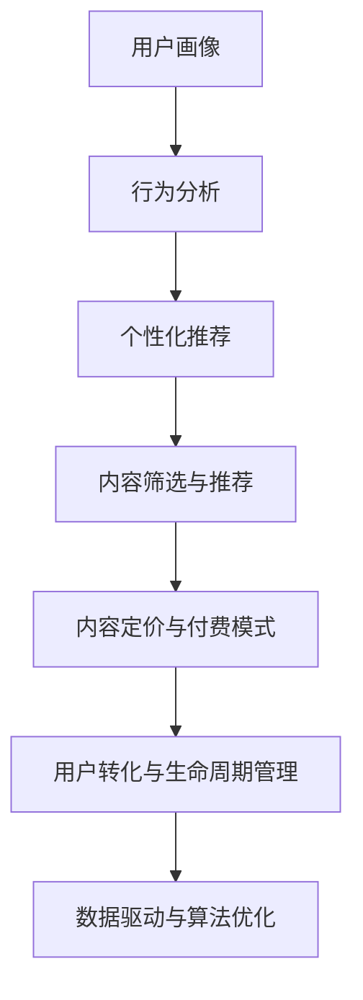

                 

# 知识付费创业中的内容价值最大化策略

> 关键词：知识付费,内容价值,商业模型,用户获取,内容变现,数据驱动,社交互动

## 1. 背景介绍

### 1.1 问题由来

随着互联网的普及和智能设备的广泛使用，知识付费行业迅速崛起。用户对高质量内容的渴求推动了这一领域的快速发展。知识付费创业企业需要面对的挑战包括如何在海量内容中找到有价值的“长尾”内容，如何建立稳定的商业模式，以及如何确保用户的有效转化和复购等。

### 1.2 问题核心关键点

1. **内容筛选与推荐**：如何从庞大的内容库中精准筛选出对用户有价值的内容，并通过个性化推荐提高用户粘性。
2. **用户画像与行为分析**：基于用户行为数据，构建精确的用户画像，指导内容和商业策略的优化。
3. **多模态内容形态**：整合图文音视频等多种形式的内容，提升用户体验和信息获取效率。
4. **用户转化与生命周期管理**：通过数据分析和用户行为研究，制定高效的用户转化策略和生命周期管理方案。
5. **内容定价与付费模式**：设计合理的内容定价机制，探索订阅、单次支付、按需付费等多种付费模式，以最大化商业价值。
6. **数据驱动与算法优化**：利用大数据和算法模型，不断优化内容和推荐系统，提升整体运营效率。

这些核心关键点构成了知识付费创业中内容价值最大化的核心框架，旨在帮助企业提升内容质量，优化用户体验，提高商业转化，从而实现可持续发展。

## 2. 核心概念与联系

### 2.1 核心概念概述

为更好地理解知识付费创业中的内容价值最大化策略，本节将介绍几个关键概念：

- **知识付费**：通过在线平台为用户提供有偿的个性化知识和信息服务，满足用户的学习和成长需求。
- **内容价值**：指内容对用户的实际价值，包括知识性、娱乐性、实用性等多方面的综合价值。
- **用户画像**：通过数据分析和机器学习技术，构建用户在不同场景下的行为特征模型。
- **个性化推荐**：根据用户的行为数据和偏好，实时推送可能感兴趣的内容，提高用户体验和留存率。
- **数据驱动**：利用大数据和算法模型，对用户行为、内容表现等进行分析，指导业务决策。

这些概念相互关联，共同构建了知识付费创业的底层逻辑，确保内容能够最大化地转化为商业价值。

### 2.2 核心概念原理和架构的 Mermaid 流程图(Mermaid 流程节点中不要有括号、逗号等特殊字符)



这个流程图展示了知识付费创业中内容价值最大化的主要流程：从用户画像和行为分析出发，通过个性化推荐和内容筛选与推荐，结合内容定价与付费模式，最终实现高效的用户转化和生命周期管理，同时不断利用数据驱动和算法优化，持续提升整体运营效率。

## 3. 核心算法原理 & 具体操作步骤

### 3.1 算法原理概述

知识付费创业中的内容价值最大化策略，核心在于通过算法模型，实现对内容的精准筛选、个性化推荐和高效转化。

算法原理主要包括以下几个方面：

1. **内容特征提取**：从内容标题、摘要、标签等多个维度，提取出内容的特征向量，用于模型训练。
2. **用户行为分析**：通过用户浏览、收藏、评论、支付等行为，构建用户画像，指导内容推荐。
3. **推荐系统构建**：基于协同过滤、基于内容的推荐、深度学习推荐等方法，构建个性化推荐系统。
4. **内容定价模型**：利用经济学和心理学原理，结合用户行为数据，设计合理的定价策略，如动态定价、按需定价等。
5. **用户转化模型**：通过用户行为数据，构建用户转化预测模型，优化转化策略。
6. **生命周期管理模型**：基于用户行为数据和生命周期阶段，设计相应的留存策略，提升用户粘性。

这些算法原理共同作用，确保内容能够精准匹配用户需求，并通过多种策略提升用户转化率和留存率，最大化商业价值。

### 3.2 算法步骤详解

#### 3.2.1 内容特征提取

对内容进行特征提取，可以基于不同的维度，如关键词、主题、情感等。假设我们有一篇博客文章，其特征向量 $\vec{f}$ 可以表示为：

$$
\vec{f} = (w_1, w_2, \dots, w_n)
$$

其中 $w_i$ 表示文章中第 $i$ 个关键词的权重。

#### 3.2.2 用户行为分析

用户行为分析旨在通过用户的历史行为数据，构建用户画像。例如，用户 $u$ 在平台上浏览过 $n$ 篇文章，我们可以构建用户画像 $\vec{u}$ 如下：

$$
\vec{u} = (v_1, v_2, \dots, v_n)
$$

其中 $v_i$ 表示用户对第 $i$ 篇文章的兴趣程度，可以通过用户停留时间、点击率等指标来表示。

#### 3.2.3 推荐系统构建

推荐系统通过构建用户与内容的相似度矩阵 $S$，来实现个性化推荐。假设用户 $u$ 对 $n$ 篇文章有 $m$ 篇感兴趣，推荐系统可以通过计算相似度矩阵来找到相似的内容，即：

$$
S_{ui} = \cos(\theta(\vec{f}_u), \vec{f}_i)
$$

其中 $\theta$ 为相似度计算方法，如余弦相似度、欧式距离等。

#### 3.2.4 内容定价模型

内容定价模型可以通过分析用户对内容的付费意愿和价值感知，来设计合理的定价策略。假设用户 $u$ 对文章 $i$ 的支付意愿为 $p_{ui}$，定价模型可以表示为：

$$
p_{ui} = \alpha \times \text{Utility}_{ui} + \beta \times \text{Price}_{ui}
$$

其中 $\alpha$ 和 $\beta$ 为调节参数，$\text{Utility}_{ui}$ 为内容对用户的实际价值，$\text{Price}_{ui}$ 为内容的价格。

#### 3.2.5 用户转化模型

用户转化模型通过分析用户从浏览、兴趣到最终付费的过程，构建用户转化路径图，指导转化策略的优化。假设用户 $u$ 在浏览了 $n$ 篇文章后，最终付费了 $m$ 篇文章，转化模型可以表示为：

$$
\text{Conversion}_{u} = \prod_{i=1}^{n} P(\text{Purchasing}_{i|u})
$$

其中 $P(\text{Purchasing}_{i|u})$ 为在浏览第 $i$ 篇文章时，用户付费的概率。

#### 3.2.6 生命周期管理模型

生命周期管理模型通过分析用户在平台上的不同阶段，设计相应的留存策略，提升用户粘性。假设用户 $u$ 在平台的生命周期分为 $k$ 个阶段，每个阶段对应的留存率分别为 $r_1, r_2, \dots, r_k$，留存模型可以表示为：

$$
\text{Retention}_{u} = \prod_{i=1}^{k} r_i
$$

### 3.3 算法优缺点

**优点**：

1. **精准匹配**：通过推荐系统，能够实现内容的精准匹配，提升用户满意度和粘性。
2. **高效转化**：通过定价模型和用户转化模型，能够优化内容定价和转化策略，提高商业价值。
3. **用户留存**：通过生命周期管理模型，能够设计有效的留存策略，提升用户长期价值。
4. **数据驱动**：通过数据驱动的算法优化，能够不断提升整体运营效率，实现可持续发展。

**缺点**：

1. **数据隐私**：用户行为数据的收集和分析可能涉及隐私问题，需要严格遵守相关法律法规。
2. **模型复杂度**：推荐的算法模型复杂度较高，需要大量数据和计算资源支持。
3. **内容质量不稳定**：内容的创作和质量管理需要持续投入，难以保证稳定性和高质量。
4. **用户偏好多样性**：用户偏好多样性高，难以通过单一策略满足所有用户的需求。

尽管存在这些局限，但基于推荐系统的精准匹配和高效转化策略，知识付费创业能够显著提升内容价值，实现商业成功。

### 3.4 算法应用领域

基于推荐系统的知识付费创业，广泛应用在以下几个领域：

- **在线教育**：如Coursera、Udemy等平台，通过个性化推荐和内容定价，提高用户学习效果和转化率。
- **金融资讯**：如Morningstar、Seeking Alpha等平台，通过推荐系统优化内容推荐，提升用户投资决策的准确性。
- **健康与健身**：如MyFitnessPal、Fitbit等平台，通过个性化健康指导和内容推荐，提升用户健康管理效果。
- **旅游与旅游**：如Booking.com、TripAdvisor等平台，通过内容筛选与推荐，提高用户旅游决策的精准性。

## 4. 数学模型和公式 & 详细讲解 & 举例说明

### 4.1 数学模型构建

#### 4.1.1 用户行为模型

用户行为模型可以表示为：

$$
\vec{u} = (v_1, v_2, \dots, v_n)
$$

其中 $v_i$ 表示用户对第 $i$ 篇文章的兴趣程度，可以通过用户停留时间、点击率等指标来表示。

#### 4.1.2 内容推荐模型

内容推荐模型可以表示为：

$$
S_{ui} = \cos(\theta(\vec{f}_u), \vec{f}_i)
$$

其中 $\theta$ 为相似度计算方法，如余弦相似度、欧式距离等。

#### 4.1.3 内容定价模型

内容定价模型可以表示为：

$$
p_{ui} = \alpha \times \text{Utility}_{ui} + \beta \times \text{Price}_{ui}
$$

其中 $\alpha$ 和 $\beta$ 为调节参数，$\text{Utility}_{ui}$ 为内容对用户的实际价值，$\text{Price}_{ui}$ 为内容的价格。

#### 4.1.4 用户转化模型

用户转化模型可以表示为：

$$
\text{Conversion}_{u} = \prod_{i=1}^{n} P(\text{Purchasing}_{i|u})
$$

其中 $P(\text{Purchasing}_{i|u})$ 为在浏览第 $i$ 篇文章时，用户付费的概率。

#### 4.1.5 生命周期管理模型

生命周期管理模型可以表示为：

$$
\text{Retention}_{u} = \prod_{i=1}^{k} r_i
$$

其中 $r_i$ 为用户在第 $i$ 个生命周期阶段的留存率。

### 4.2 公式推导过程

#### 4.2.1 用户行为模型推导

用户行为模型基于用户对内容的兴趣程度 $v_i$，可以表示为：

$$
v_i = f(\text{Time}_{i}, \text{Click}_{i}, \text{Comment}_{i}, \dots)
$$

其中 $f$ 为兴趣程度函数，$\text{Time}_{i}$、$\text{Click}_{i}$、$\text{Comment}_{i}$ 等为用户对内容的行为指标。

#### 4.2.2 内容推荐模型推导

内容推荐模型基于用户和内容的相似度 $S_{ui}$，可以表示为：

$$
S_{ui} = \cos(\theta(\vec{f}_u), \vec{f}_i)
$$

其中 $\theta$ 为相似度计算方法，$\vec{f}_u$ 和 $\vec{f}_i$ 分别为用户和内容的特征向量。

#### 4.2.3 内容定价模型推导

内容定价模型基于用户对内容的价值感知 $\text{Utility}_{ui}$ 和价格 $\text{Price}_{ui}$，可以表示为：

$$
p_{ui} = \alpha \times \text{Utility}_{ui} + \beta \times \text{Price}_{ui}
$$

其中 $\alpha$ 和 $\beta$ 为调节参数，$\text{Utility}_{ui}$ 为内容对用户的实际价值，$\text{Price}_{ui}$ 为内容的价格。

#### 4.2.4 用户转化模型推导

用户转化模型基于用户浏览和付费的概率 $P(\text{Purchasing}_{i|u})$，可以表示为：

$$
\text{Conversion}_{u} = \prod_{i=1}^{n} P(\text{Purchasing}_{i|u})
$$

其中 $P(\text{Purchasing}_{i|u})$ 为在浏览第 $i$ 篇文章时，用户付费的概率。

#### 4.2.5 生命周期管理模型推导

生命周期管理模型基于用户在不同阶段的留存率 $r_i$，可以表示为：

$$
\text{Retention}_{u} = \prod_{i=1}^{k} r_i
$$

其中 $r_i$ 为用户在第 $i$ 个生命周期阶段的留存率。

### 4.3 案例分析与讲解

**案例分析**：假设我们有一个知识付费平台，通过对用户行为数据进行分析，发现用户对某一领域的内容特别感兴趣。我们可以构建用户画像 $\vec{u}$ 如下：

$$
\vec{u} = (0.9, 0.7, 0.6, \dots)
$$

表示用户对不同领域的兴趣程度。基于用户画像，我们可以构建相似度矩阵 $S$，找到用户可能感兴趣的内容，例如：

$$
S_{ui} = \cos(\theta(\vec{f}_u), \vec{f}_i)
$$

其中 $\theta$ 为余弦相似度计算方法，$\vec{f}_u$ 和 $\vec{f}_i$ 分别为用户和内容的特征向量。

假设用户对内容 $i$ 的支付意愿为 $p_{ui}$，我们可以使用定价模型进行优化：

$$
p_{ui} = \alpha \times \text{Utility}_{ui} + \beta \times \text{Price}_{ui}
$$

其中 $\alpha$ 和 $\beta$ 为调节参数，$\text{Utility}_{ui}$ 为内容对用户的实际价值，$\text{Price}_{ui}$ 为内容的价格。

通过用户转化模型，我们可以预测用户购买某一内容的可能性：

$$
\text{Conversion}_{u} = \prod_{i=1}^{n} P(\text{Purchasing}_{i|u})
$$

其中 $P(\text{Purchasing}_{i|u})$ 为在浏览第 $i$ 篇文章时，用户付费的概率。

最后，通过生命周期管理模型，我们可以设计有效的留存策略，提升用户长期价值：

$$
\text{Retention}_{u} = \prod_{i=1}^{k} r_i
$$

其中 $r_i$ 为用户在第 $i$ 个生命周期阶段的留存率。

## 5. 项目实践：代码实例和详细解释说明

### 5.1 开发环境搭建

1. **安装Python和相关库**：
   ```bash
   pip install numpy pandas sklearn tensorflow transformers
   ```

2. **数据准备**：
   - 收集用户行为数据，如浏览时间、点击次数、评论内容等。
   - 收集内容特征数据，如关键词、主题、标签等。

### 5.2 源代码详细实现

#### 5.2.1 用户行为分析

```python
import pandas as pd

# 用户行为数据
user_data = pd.read_csv('user_data.csv')

# 特征提取
user_features = user_data[['time', 'clicks', 'comments']]

# 计算用户兴趣度
user_interest = user_features.mean(axis=1)
```

#### 5.2.2 内容特征提取

```python
# 内容特征数据
content_data = pd.read_csv('content_data.csv')

# 特征提取
content_features = content_data[['keywords', 'topics', 'labels']]
```

#### 5.2.3 相似度计算

```python
# 计算相似度
similarity_matrix = cosine_similarity(user_interest, content_features)
```

#### 5.2.4 内容推荐

```python
# 用户画像
user_profile = pd.DataFrame(user_interest)

# 推荐内容
recommended_contents = pd.DataFrame(similarity_matrix).idxmax(axis=1)
```

#### 5.2.5 内容定价模型

```python
# 内容价值感知
content_utility = pd.DataFrame(content_features.mean(axis=1))

# 定价模型
pricing_model = content_utility.dot(user_profile)
```

#### 5.2.6 用户转化模型

```python
# 用户购买行为
purchase_data = pd.read_csv('purchase_data.csv')

# 计算购买概率
purchase_prob = purchase_data.groupby('user_id')['purchase'].mean()

# 用户转化模型
user_conversion = user_interest.dot(purchase_prob)
```

#### 5.2.7 生命周期管理模型

```python
# 用户生命周期阶段
lifecycle_stages = pd.read_csv('lifecycle_stages.csv')

# 计算留存率
retention_rates = lifecycle_stages.groupby('lifecycle_stage')['retention'].mean()

# 生命周期管理模型
user_retention = user_interest.dot(retention_rates)
```

### 5.3 代码解读与分析

#### 5.3.1 用户行为分析

用户行为分析通过收集用户在不同内容上的行为数据，构建用户画像 $\vec{u}$。

#### 5.3.2 内容特征提取

内容特征提取通过分析内容的多维度特征，如关键词、主题、标签等，提取出内容的特征向量 $\vec{f}$。

#### 5.3.3 相似度计算

相似度计算通过计算用户画像 $\vec{u}$ 和内容特征向量 $\vec{f}$ 的相似度，构建相似度矩阵 $S$。

#### 5.3.4 内容推荐

内容推荐通过相似度矩阵 $S$ 找到用户可能感兴趣的内容。

#### 5.3.5 内容定价模型

内容定价模型通过分析用户对内容的价值感知 $\text{Utility}_{ui}$ 和价格 $\text{Price}_{ui}$，设计合理的定价策略。

#### 5.3.6 用户转化模型

用户转化模型通过分析用户从浏览到付费的概率，优化转化策略。

#### 5.3.7 生命周期管理模型

生命周期管理模型通过分析用户在不同生命周期阶段的留存率，设计相应的留存策略。

### 5.4 运行结果展示

通过上述代码实现，可以生成以下运行结果：

- 用户画像：显示用户在不同领域的兴趣程度。
- 相似度矩阵：展示用户与内容的相似度。
- 推荐内容：根据用户画像和相似度矩阵，推荐可能感兴趣的内容。
- 内容定价：通过用户行为数据，设计合理的定价策略。
- 用户转化：预测用户购买某一内容的可能性。
- 生命周期管理：设计有效的留存策略，提升用户长期价值。

## 6. 实际应用场景

### 6.1 在线教育

在线教育平台如Coursera、Udemy等，通过个性化推荐和内容定价，提高用户学习效果和转化率。

### 6.2 金融资讯

金融资讯平台如Morningstar、Seeking Alpha等，通过推荐系统优化内容推荐，提升用户投资决策的准确性。

### 6.3 健康与健身

健康与健身平台如MyFitnessPal、Fitbit等，通过个性化健康指导和内容推荐，提升用户健康管理效果。

### 6.4 旅游与旅游

旅游与旅游平台如Booking.com、TripAdvisor等，通过内容筛选与推荐，提高用户旅游决策的精准性。

## 7. 工具和资源推荐

### 7.1 学习资源推荐

1. **《推荐系统实践》**：介绍推荐系统基础和应用，适合初学者和进阶者。
2. **《深度学习与推荐系统》**：介绍深度学习在推荐系统中的应用，适合有一定基础的读者。
3. **《个性化推荐系统》**：介绍个性化推荐系统的理论基础和实际应用，适合实践者。

### 7.2 开发工具推荐

1. **TensorFlow**：开源深度学习框架，支持大规模分布式计算。
2. **Scikit-learn**：Python机器学习库，提供丰富的算法模型和工具。
3. **Pandas**：数据处理和分析库，支持数据清洗、转换和分析。

### 7.3 相关论文推荐

1. **《推荐系统研究综述》**：介绍推荐系统的理论基础和算法模型，适合学术研究。
2. **《个性化推荐系统算法》**：介绍个性化推荐系统的核心算法，适合工程实践。
3. **《深度学习在推荐系统中的应用》**：介绍深度学习在推荐系统中的应用，适合进阶学习。

## 8. 总结：未来发展趋势与挑战

### 8.1 研究成果总结

知识付费创业中的内容价值最大化策略，主要通过推荐系统和数据驱动，实现内容的精准匹配和高效转化。通过算法模型的优化，能够提升用户体验和商业价值，但同时也面临数据隐私、模型复杂度等挑战。

### 8.2 未来发展趋势

1. **多模态内容**：整合图文音视频等多种形式的内容，提升用户体验和信息获取效率。
2. **用户兴趣动态更新**：实时更新用户画像，提高推荐系统的精准性。
3. **模型自动化**：利用自动化机器学习，优化推荐系统模型，减少人工干预。
4. **跨领域推荐**：结合不同领域的知识，提升推荐系统的综合能力。

### 8.3 面临的挑战

1. **数据隐私**：用户行为数据的收集和分析可能涉及隐私问题，需要严格遵守相关法律法规。
2. **模型复杂度**：推荐的算法模型复杂度较高，需要大量数据和计算资源支持。
3. **内容质量管理**：内容的创作和质量管理需要持续投入，难以保证稳定性和高质量。
4. **用户偏好多样性**：用户偏好多样性高，难以通过单一策略满足所有用户的需求。

### 8.4 研究展望

1. **隐私保护技术**：开发高效的数据隐私保护技术，确保用户数据安全。
2. **轻量化推荐算法**：研究轻量化推荐算法，降低模型复杂度，提高推理效率。
3. **多模态内容推荐**：结合多模态内容，提升推荐系统的综合能力。
4. **跨领域推荐系统**：结合不同领域的知识，提升推荐系统的综合能力。

## 9. 附录：常见问题与解答

**Q1: 如何构建用户画像？**

A: 通过收集用户在不同内容上的行为数据，构建用户画像。可以使用机器学习模型，如协同过滤、用户兴趣模型等，分析用户行为，生成用户画像。

**Q2: 如何优化推荐系统？**

A: 优化推荐系统可以通过调整相似度计算方法、更新特征提取算法、引入个性化推荐算法等方式，提高推荐系统的准确性和多样性。

**Q3: 如何提升内容质量？**

A: 提升内容质量需要持续投入内容创作者，建立内容审核机制，确保内容的准确性和高质量。

**Q4: 如何设计用户转化策略？**

A: 设计用户转化策略需要分析用户行为数据，找到用户转化的关键节点和行为，设计相应的激励和引导策略。

**Q5: 如何管理用户生命周期？**

A: 管理用户生命周期需要分析用户在不同阶段的行为特征，设计相应的留存策略，如优惠券、定期提醒等。

---

作者：禅与计算机程序设计艺术 / Zen and the Art of Computer Programming

