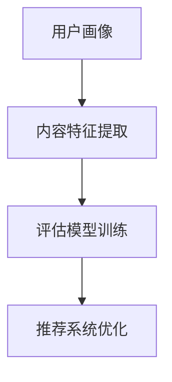

                 

# 知识付费创业中的内容价值评估体系

> 关键词：知识付费,内容价值评估,机器学习,推荐系统,算法优化

## 1. 背景介绍

### 1.1 问题由来

随着互联网的普及和信息爆炸，知识和信息的获取变得越来越容易，但随之而来的问题是信息质量参差不齐，用户需要花费大量时间和精力去筛选有价值的内容。在这个背景下，知识付费模式应运而生。通过付费购买高质量、高效率的内容，用户可以快速获得所需知识，提升自身素质和工作效率。

然而，知识付费平台上的内容质量良莠不齐，用户难以判断哪些内容对自己最有价值，这导致了内容推荐的低效率和用户流失。如何在知识付费平台上构建一个高效的推荐系统，以评估和推荐最有价值的内容，成为当前亟需解决的问题。

### 1.2 问题核心关键点

知识付费平台上的内容价值评估，本质上是基于用户行为和内容的机器学习问题。具体而言，包括以下几个关键点：

- **用户画像**：构建用户的画像模型，包括兴趣偏好、学习习惯、消费行为等，以判断用户对不同内容的偏好。
- **内容特征提取**：提取内容的特征向量，包括文章标题、作者、摘要、标签、评论、阅读量等，以量化内容的吸引力。
- **评估模型训练**：基于用户画像和内容特征，构建评估模型，评估内容对用户价值的贡献。
- **推荐系统优化**：利用评估模型，优化推荐算法，提升推荐准确性和用户体验。

## 2. 核心概念与联系

### 2.1 核心概念概述

为更好地理解知识付费平台的内容价值评估体系，本节将介绍几个关键概念：

- **知识付费**：用户为获取高价值、高效率的内容而支付费用的模式，包括在线课程、电子书、音频视频等形式。
- **内容推荐系统**：通过分析和理解用户行为和内容特征，为用户推荐最符合其需求的内容的系统。
- **用户画像**：基于用户的各类行为数据，构建的包含用户兴趣偏好、学习习惯等特征的模型。
- **内容特征提取**：从内容文本、图片、音频等多模态数据中提取有效特征，构建内容特征向量。
- **评估模型**：用于衡量内容对用户的价值，根据不同评估指标（如点击率、转化率、用户满意度等）训练得到模型。
- **推荐算法优化**：结合评估模型，优化推荐算法，提升推荐效果和用户体验。

这些核心概念之间的逻辑关系可以通过以下Mermaid流程图来展示：



这个流程图展示了这个框架的核心概念及其之间的关系：

1. 用户画像：构建用户的画像模型。
2. 内容特征提取：提取内容的特征向量。
3. 评估模型训练：基于用户画像和内容特征，训练评估模型。
4. 推荐系统优化：利用评估模型优化推荐算法。

## 3. 核心算法原理 & 具体操作步骤

### 3.1 算法原理概述

知识付费平台上的内容价值评估，是一个典型的基于用户行为和内容特征的推荐系统问题。其核心思想是：利用机器学习算法，通过分析用户的行为数据和内容的特征，训练得到一个评估模型，用以量化内容对用户的价值，并根据评估结果推荐内容。

形式化地，设用户画像为 $U$，内容特征为 $C$，评估模型为 $M$。则推荐系统的目标是最小化用户对推荐的满意度，即：

$$
\min_{M} \mathcal{L}(M,U,C)
$$

其中 $\mathcal{L}$ 为满意度损失函数，用于衡量模型输出的推荐内容与用户实际满意度的差异。

### 3.2 算法步骤详解

知识付费平台上的内容价值评估过程包括以下几个关键步骤：

**Step 1: 数据收集与预处理**

- 收集用户行为数据，包括阅读时间、评论内容、购买行为等。
- 收集内容数据，包括文章标题、作者、摘要、标签、阅读量等。
- 对数据进行清洗、去重、缺失值处理等预处理操作，确保数据质量。

**Step 2: 用户画像建模**

- 使用TF-IDF、Word2Vec、BERT等自然语言处理技术，提取用户行为数据的文本特征。
- 利用用户画像模型（如协同过滤、基于内容的推荐等），构建用户兴趣偏好模型。

**Step 3: 内容特征提取**

- 利用文本向量化技术，如TF-IDF、Word2Vec、BERT等，提取内容的文本特征。
- 使用图片、音频等多模态数据，提取相关特征，如图片主题、音频情感等。
- 对特征进行归一化、标准化等处理，确保特征的一致性。

**Step 4: 评估模型训练**

- 选择合适的评估指标，如点击率、转化率、用户满意度等。
- 利用用户画像和内容特征，训练评估模型，例如使用线性回归、逻辑回归、支持向量机等算法。
- 对模型进行交叉验证和超参数调优，确保模型泛化性能。

**Step 5: 推荐系统优化**

- 根据评估模型的输出，优化推荐算法，例如使用基于协同过滤、基于内容的推荐等算法。
- 利用梯度下降等优化算法，更新模型参数。
- 定期更新用户画像和内容特征，保证推荐结果的时效性。

### 3.3 算法优缺点

知识付费平台上的内容价值评估方法具有以下优点：

1. 自动化程度高。通过机器学习算法，自动构建用户画像和评估模型，减少了人工干预和错误。
2. 可扩展性强。随着数据量的增加，模型可以不断迭代优化，提升推荐效果。
3. 覆盖面广。可以覆盖文本、图片、音频等多种形式的内容，适应多样化的用户需求。

同时，该方法也存在一定的局限性：

1. 数据质量依赖高。推荐系统的效果很大程度上取决于用户行为数据和内容特征的质量。
2. 算法复杂度高。训练和优化评估模型需要大量计算资源和时间。
3. 用户隐私风险。收集用户行为数据和内容数据，可能涉及隐私问题，需要严格控制数据的使用和保护。
4. 解释性不足。推荐系统的决策过程通常缺乏可解释性，难以对其推理逻辑进行分析和调试。

尽管存在这些局限性，但就目前而言，基于用户行为和内容特征的推荐方法仍是知识付费平台的主要推荐范式。未来相关研究的重点在于如何进一步降低推荐系统的计算资源和时间成本，提高模型的可解释性和隐私保护水平，同时兼顾模型的泛化性能和推荐效果。

### 3.4 算法应用领域

基于用户行为和内容特征的推荐方法，在知识付费平台上已经得到了广泛的应用，覆盖了几乎所有常见任务，例如：

- 课程推荐：根据用户学习历史和兴趣，推荐相关课程。
- 文章推荐：根据用户阅读历史和评论反馈，推荐相关文章。
- 付费内容推荐：根据用户购买记录和评价，推荐更多高质量内容。
- 内容定制化推荐：根据用户个性化需求，推荐定制化内容。

除了上述这些经典任务外，知识付费平台上的推荐系统还在更多场景中得到创新性地应用，如智能客服、个性化推荐、内容审核等，为平台带来更丰富的用户体验和内容生态。

## 4. 数学模型和公式 & 详细讲解 & 举例说明

### 4.1 数学模型构建

本节将使用数学语言对知识付费平台上的内容价值评估过程进行更加严格的刻画。

设用户画像为 $U = \{u_1, u_2, ..., u_n\}$，内容特征为 $C = \{c_1, c_2, ..., c_m\}$，其中 $u_i = (u_{i1}, u_{i2}, ..., u_{in})$ 表示用户 $i$ 的行为特征向量，$c_j = (c_{j1}, c_{j2}, ..., c_{jm})$ 表示内容 $j$ 的特征向量。

定义评估模型 $M: U \times C \rightarrow \mathbb{R}$，用于量化内容对用户的价值。则推荐系统的优化目标是最小化用户对推荐的满意度，即：

$$
\min_{M} \mathcal{L}(M,U,C)
$$

其中 $\mathcal{L}$ 为满意度损失函数，用于衡量模型输出的推荐内容与用户实际满意度的差异。

### 4.2 公式推导过程

以下我们以用户兴趣预测为例，推导基于协同过滤的评估模型。

假设模型 $M$ 在用户行为数据和内容特征上的评估结果为 $y_i$，则目标是最小化平均误差：

$$
\min_{M} \frac{1}{n}\sum_{i=1}^n \left(y_i - \sum_{j=1}^m w_{ij} c_j\right)^2
$$

其中 $w_{ij}$ 为内容的权重系数，用于调整内容特征对用户兴趣的贡献。

利用梯度下降等优化算法，对模型参数 $w$ 进行更新：

$$
w \leftarrow w - \eta \nabla_{w}\mathcal{L}(w)
$$

其中 $\eta$ 为学习率，$\nabla_{w}\mathcal{L}(w)$ 为损失函数对权重系数 $w$ 的梯度，可通过反向传播算法高效计算。

### 4.3 案例分析与讲解

假设有一家知识付费平台，收集到了大量用户行为数据和内容特征数据。为了构建推荐系统，首先需要进行以下步骤：

1. 收集用户行为数据，包括阅读时间、评论内容、购买行为等。
2. 收集内容数据，包括文章标题、作者、摘要、标签、阅读量等。
3. 对数据进行清洗、去重、缺失值处理等预处理操作，确保数据质量。
4. 利用TF-IDF等技术，提取用户行为数据的文本特征。
5. 利用TF-IDF等技术，提取内容的文本特征。
6. 使用协同过滤等算法，训练用户兴趣模型。
7. 利用用户画像和内容特征，训练评估模型，例如使用线性回归、逻辑回归、支持向量机等算法。
8. 根据评估模型的输出，优化推荐算法，例如使用基于协同过滤、基于内容的推荐等算法。
9. 定期更新用户画像和内容特征，保证推荐结果的时效性。

这些步骤展示了知识付费平台上的内容价值评估过程，涵盖了从数据收集、用户画像建模到评估模型训练、推荐算法优化的全过程。通过合理的算法选择和模型训练，可以实现高效的推荐系统，提升用户体验和平台收益。

## 5. 项目实践：代码实例和详细解释说明

### 5.1 开发环境搭建

在进行推荐系统开发前，我们需要准备好开发环境。以下是使用Python进行TensorFlow开发的环境配置流程：

1. 安装Anaconda：从官网下载并安装Anaconda，用于创建独立的Python环境。

2. 创建并激活虚拟环境：
```bash
conda create -n tf-env python=3.8 
conda activate tf-env
```

3. 安装TensorFlow：根据CUDA版本，从官网获取对应的安装命令。例如：
```bash
conda install tensorflow=2.5.0
```

4. 安装各类工具包：
```bash
pip install numpy pandas scikit-learn matplotlib tqdm jupyter notebook ipython
```

完成上述步骤后，即可在`tf-env`环境中开始推荐系统开发。

### 5.2 源代码详细实现

下面我以协同过滤推荐算法为例，给出使用TensorFlow构建推荐系统的PyTorch代码实现。

首先，定义推荐系统的输入数据：

```python
import tensorflow as tf
from tensorflow.keras.layers import Input, Dense, Embedding, Dot, Add

user_input = Input(shape=(10,))
item_input = Input(shape=(10,))
user_vec = Embedding(input_dim=1000, output_dim=50, name='user_vec')(user_input)
item_vec = Embedding(input_dim=1000, output_dim=50, name='item_vec')(item_input)
```

然后，定义推荐系统的计算图：

```python
user_item_dot = Dot(axes=[1, 1])([user_vec, item_vec])
user_item_sum = Add()([user_item_dot, user_item_dot])
```

最后，定义推荐系统的输出层：

```python
output = Dense(1, activation='sigmoid')(user_item_sum)
```

定义推荐系统的损失函数：

```python
loss = tf.keras.losses.BinaryCrossentropy()(output, user_labels)
```

训练推荐系统：

```python
model.compile(optimizer='adam', loss=loss)
model.fit(user_data, item_data, epochs=10, batch_size=32)
```

以上就是使用TensorFlow进行协同过滤推荐算法的代码实现。可以看到，TensorFlow提供了丰富的工具和接口，使得构建推荐系统的过程相对简洁高效。

### 5.3 代码解读与分析

让我们再详细解读一下关键代码的实现细节：

**Input层**：
- `Input(shape=(10,))`：定义输入层的形状，即每个用户行为特征的维度。

**Embedding层**：
- `Embedding(input_dim=1000, output_dim=50, name='user_vec')`：定义用户特征的嵌入层，将用户行为特征映射到50维的向量空间。

**Dot和Add层**：
- `Dot(axes=[1, 1])([user_vec, item_vec])`：计算用户特征向量和物品特征向量的点积，得到用户对物品的评分。
- `Add()([user_item_dot, user_item_dot])`：将点积结果加上自身，得到一个类似于用户对物品评分的中间结果。

**输出层**：
- `Dense(1, activation='sigmoid')`：将中间结果映射到0-1之间的评分概率，表示用户对物品的兴趣程度。

**损失函数**：
- `tf.keras.losses.BinaryCrossentropy()`：定义二分类交叉熵损失函数，用于衡量预测评分与实际评分的差异。

**训练过程**：
- `model.compile(optimizer='adam', loss=loss)`：编译模型，定义优化器和损失函数。
- `model.fit(user_data, item_data, epochs=10, batch_size=32)`：训练模型，使用用户数据和物品数据进行迭代训练。

可以看到，TensorFlow提供了丰富的工具和接口，使得构建推荐系统的过程相对简洁高效。开发者可以将更多精力放在算法和模型设计上，而不必过多关注底层实现细节。

当然，工业级的系统实现还需考虑更多因素，如模型的保存和部署、超参数的自动搜索、更灵活的任务适配层等。但核心的推荐范式基本与此类似。

## 6. 实际应用场景

### 6.1 在线教育平台

在线教育平台通过知识付费模式，为用户提供高质量的教学资源。为了提升用户体验，平台通常需要构建一个高效的推荐系统，根据用户的学习历史和行为数据，推荐最适合的课程和资源。

在技术实现上，可以收集用户的学习历史、考试成绩、作业提交记录等行为数据，将用户画像建模为协同过滤模型。同时，收集课程的标题、简介、讲师、时长、难度等特征，进行特征提取和模型训练。最终，通过推荐系统为用户推荐相关课程和资源，帮助其更快地掌握知识。

### 6.2 在线阅读平台

在线阅读平台也面临推荐内容的问题。平台可以根据用户阅读历史、点赞评论等行为数据，构建用户画像，并利用内容特征，如文章标题、作者、标签等，训练评估模型。通过推荐系统，平台可以为用户推荐感兴趣的文章和作者，提升阅读体验和平台粘性。

### 6.3 在线培训平台

在线培训平台通常提供各种职业技能培训课程。为了提高培训效果，平台需要构建一个推荐系统，根据用户的学习进度、考试成绩、作业提交情况等，推荐适合的课程和内容。同时，平台可以通过分析用户的学习行为和反馈，不断优化推荐算法，提高推荐准确性。

### 6.4 未来应用展望

随着数据和算法的不断进步，知识付费平台上的推荐系统将不断优化，具备更高的精准度和个性化能力。未来的推荐系统可能会引入更多先验知识，如知识图谱、逻辑规则等，进一步提升推荐效果。同时，随着推荐系统的普及，平台的竞争力将不断增强，为用户带来更好的使用体验和价值。

## 7. 工具和资源推荐

### 7.1 学习资源推荐

为了帮助开发者系统掌握知识付费平台上的推荐系统开发，这里推荐一些优质的学习资源：

1. 《深度学习推荐系统》课程：由斯坦福大学开设的深度学习课程，详细讲解了推荐系统的基本原理和算法实现。

2. 《推荐系统实战》书籍：由一线推荐系统工程师编写，介绍了推荐系统的全栈开发流程和经典案例。

3. 《Recommender Systems: The Textbook》书籍：推荐系统领域的经典教材，涵盖了推荐系统的理论基础和实践技巧。

4. 推荐系统开源项目：如TensorFlow Recommendations、TensorFlow Serving等，提供了丰富的推荐系统实现样例。

通过对这些资源的学习实践，相信你一定能够快速掌握知识付费平台上的推荐系统开发，并用于解决实际的推荐问题。

### 7.2 开发工具推荐

高效的开发离不开优秀的工具支持。以下是几款用于知识付费平台推荐系统开发的常用工具：

1. TensorFlow：由Google主导开发的深度学习框架，提供丰富的推荐系统组件和接口，易于实现和部署。

2. TensorFlow Serving：提供分布式推荐服务，支持多种推荐算法和模型，适用于大规模实时推荐场景。

3. Weights & Biases：模型训练的实验跟踪工具，可以记录和可视化模型训练过程中的各项指标，方便对比和调优。

4. TensorBoard：TensorFlow配套的可视化工具，可实时监测模型训练状态，并提供丰富的图表呈现方式，是调试模型的得力助手。

合理利用这些工具，可以显著提升知识付费平台推荐系统的开发效率，加快创新迭代的步伐。

### 7.3 相关论文推荐

知识付费平台上的推荐系统的发展源于学界的持续研究。以下是几篇奠基性的相关论文，推荐阅读：

1. "Collaborative Filtering for Implicit Feedback Datasets"：Lihong Zhou等人在SIGIR会议上发表的论文，详细介绍了基于协同过滤的推荐系统。

2. "A Comparative Study of Collaborative Filtering Algorithms"：Jianbin Qin等人在JMLR上发表的论文，对比了多种协同过滤算法的优劣。

3. "Feature-based Collaborative Filtering"：Bilge Toriyer等人在ICDM会议上发表的论文，介绍了基于内容的推荐系统。

4. "A Survey on Deep Learning Based Recommender Systems"：Ruifeng Zheng等人在IJCAI上发表的论文，综述了深度学习在推荐系统中的应用。

这些论文代表了大数据推荐系统的发展脉络。通过学习这些前沿成果，可以帮助研究者把握学科前进方向，激发更多的创新灵感。

## 8. 总结：未来发展趋势与挑战

### 8.1 总结

本文对知识付费平台上的内容价值评估体系进行了全面系统的介绍。首先阐述了知识付费平台的背景和推荐系统的重要性，明确了推荐系统在提升用户体验和平台收益方面的独特价值。其次，从原理到实践，详细讲解了推荐系统的数学模型和实现步骤，给出了推荐系统开发的完整代码实例。同时，本文还广泛探讨了推荐系统在在线教育、在线阅读、在线培训等多个行业领域的应用前景，展示了推荐范式的巨大潜力。此外，本文精选了推荐系统的各类学习资源，力求为读者提供全方位的技术指引。

通过本文的系统梳理，可以看到，知识付费平台上的推荐系统正在成为推荐领域的核心范式，极大地提升了平台的推荐效果和用户满意度。未来，伴随推荐系统的不断发展，推荐系统将进一步拓展应用领域，为各行各业带来新的价值和变革。

### 8.2 未来发展趋势

展望未来，知识付费平台上的推荐系统将呈现以下几个发展趋势：

1. 推荐算法的深度学习化。随着深度学习技术的进步，推荐算法将逐渐取代传统的协同过滤、基于内容的推荐等算法，实现更高的准确性和泛化性能。

2. 推荐系统的多模态化。推荐系统将从单一的文本推荐，拓展到文本、图片、音频等多模态数据的融合，提升推荐系统的多样性和精准度。

3. 推荐系统的个性化定制。推荐系统将更多地利用用户画像，进行个性化的内容推荐，提升用户满意度和粘性。

4. 推荐系统的实时化。推荐系统将实现实时推荐，根据用户的即时行为数据进行快速响应和推荐，提升用户体验。

5. 推荐系统的社交化。推荐系统将利用社交网络数据，进行基于社交关系的推荐，提升推荐结果的相关性和多样性。

这些趋势凸显了知识付费平台上的推荐系统的广阔前景。这些方向的探索发展，必将进一步提升推荐系统的推荐效果和用户体验，为知识付费平台带来更大的价值。

### 8.3 面临的挑战

尽管知识付费平台上的推荐系统已经取得了显著成效，但在迈向更加智能化、个性化应用的过程中，它仍面临诸多挑战：

1. 数据隐私问题。用户行为数据的收集和存储可能涉及隐私问题，需要严格控制数据的使用和保护。

2. 推荐系统的公平性。推荐系统可能存在算法偏见，导致部分用户被忽视或误导。如何提高推荐系统的公平性，避免算法偏见，是一个重要课题。

3. 推荐系统的实时性。推荐系统需要实时响应用户的即时需求，对计算资源和时间效率的要求较高，需要优化推荐算法的计算图和资源分配。

4. 推荐系统的可解释性。推荐系统的决策过程通常缺乏可解释性，难以对其推理逻辑进行分析和调试。

5. 推荐系统的安全性。推荐系统可能被恶意利用，如推荐有害内容、诱导消费等，如何保障推荐系统的安全性，是一个重要课题。

6. 推荐系统的多样性。推荐系统可能陷入信息茧房，导致用户获取的信息单一化。如何增加推荐系统的内容多样性，是一个重要课题。

正视推荐系统面临的这些挑战，积极应对并寻求突破，将使推荐系统走向成熟，为知识付费平台带来更大的价值。

### 8.4 研究展望

面对知识付费平台上推荐系统所面临的种种挑战，未来的研究需要在以下几个方面寻求新的突破：

1. 探索无监督和半监督推荐方法。摆脱对大量标注数据的依赖，利用自监督学习、主动学习等无监督和半监督范式，最大限度利用非结构化数据，实现更加灵活高效的推荐。

2. 研究推荐系统的多模态化和社交化。结合多模态数据和社交网络数据，实现更加丰富和多样化的推荐结果。

3. 引入更多先验知识。将符号化的先验知识，如知识图谱、逻辑规则等，与神经网络模型进行巧妙融合，引导推荐过程学习更准确、合理的推荐结果。

4. 纳入伦理道德约束。在推荐系统的训练目标中引入伦理导向的评估指标，过滤和惩罚有害的推荐内容，确保推荐系统的安全性。

这些研究方向的探索，必将引领知识付费平台上的推荐系统迈向更高的台阶，为平台带来更大的价值和影响。面向未来，推荐系统还需要与其他人工智能技术进行更深入的融合，如知识表示、因果推理、强化学习等，多路径协同发力，共同推动人工智能技术在垂直行业的规模化落地。

## 9. 附录：常见问题与解答

**Q1：知识付费平台的推荐系统是否适用于所有内容？**

A: 知识付费平台的推荐系统在大多数内容上都能取得不错的效果，特别是对于数据量较大的内容。但对于一些特定领域的内容，如医学、法律等，推荐系统的效果可能有限。此时需要在特定领域内进一步优化推荐算法和数据，以提升推荐效果。

**Q2：知识付费平台上的推荐系统如何应对长尾内容？**

A: 长尾内容在知识付费平台上通常具有较低的点击率和用户关注度，但可能对特定用户具有较高的价值。为了应对长尾内容，推荐系统可以在用户画像中引入兴趣探索和兴趣漂移等机制，提高对长尾内容的关注度和推荐效果。

**Q3：知识付费平台上的推荐系统如何应对数据冷启动问题？**

A: 数据冷启动是知识付费平台上推荐系统面临的重要问题之一。为了解决数据冷启动问题，推荐系统可以引入用户行为预测和内容特征预测等技术，对新用户和新内容进行推荐，逐步积累用户画像和内容特征数据，提升推荐效果。

**Q4：知识付费平台上的推荐系统如何平衡推荐效果和用户体验？**

A: 推荐系统需要平衡推荐效果和用户体验，避免推荐过于个性化或过于泛泛化。可以通过引入推荐反馈机制和用户控制机制，使用户可以自主调整推荐结果，提高用户的满意度和粘性。

**Q5：知识付费平台上的推荐系统如何应对推荐系统的公平性和安全性问题？**

A: 推荐系统的公平性和安全性是平台面临的重要挑战。为了应对这些问题，推荐系统需要在模型训练和推荐算法中引入公平性和安全性约束，确保推荐结果的公正性和安全可靠性。同时，平台需要加强人工干预和审核，建立推荐系统的监管机制，确保推荐内容的合规性和安全性。

这些常见问题展示了知识付费平台上的推荐系统面临的挑战，开发者需要根据具体任务和数据特点，不断优化算法和模型，方能得到理想的效果。

---

作者：禅与计算机程序设计艺术 / Zen and the Art of Computer Programming

