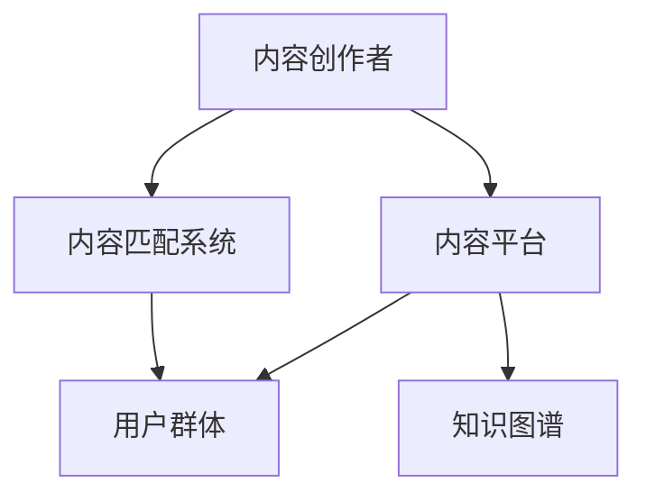

                 

# 知识付费创业中的内容价值链构建

在快速发展的数字时代，知识付费成为一种流行的商业模式，旨在通过向用户提供高质量、有价值的内容，以获得经济回报。然而，要在竞争激烈的知识付费市场中脱颖而出，构建一个高效的内容价值链至关重要。本文将深入探讨知识付费创业中内容价值链的构建，包括核心概念、算法原理、操作步骤、数学模型、项目实践、实际应用、工具资源、未来趋势和挑战等，以期为创业者提供全面的指导。

## 1. 背景介绍

### 1.1 问题由来

随着互联网技术的进步，信息传播的门槛大幅降低，知识付费作为一种高效获取信息的方式应运而生。在内容爆炸的背景下，用户面临着信息过载的问题，对高质量内容的渴求日益增强。知识付费平台如得到、知乎live、分答等应运而生，成为连接内容创作者和用户的桥梁。然而，随着市场的逐渐饱和，知识付费平台之间的竞争日益激烈，如何构建高效的内容价值链，提升内容质量和用户粘性，成为亟待解决的问题。

### 1.2 问题核心关键点

构建高效内容价值链的核心在于：
1. 如何吸引优质内容创作者，形成稳定的内容供给链。
2. 如何精准匹配用户需求，提高内容匹配效率。
3. 如何提升内容质量，满足用户深层次需求。
4. 如何建立有效的定价模型，保障平台和创作者双赢。

## 2. 核心概念与联系

### 2.1 核心概念概述

为更好地理解知识付费创业中内容价值链的构建，本节将介绍几个密切相关的核心概念：

- **内容创作者**：指具备专业知识或技能，能够生产有价值内容的专业人士。
- **内容平台**：指为内容创作者和用户提供内容交易、分发、互动的平台。
- **用户群体**：指愿意为获取知识付费的用户，分为付费用户和免费用户。
- **内容匹配系统**：指利用算法和模型，自动为用户推荐相关内容的技术手段。
- **知识图谱**：指以知识点为节点、关系为边构成的图状结构，用于描述知识间的关联关系。

这些核心概念之间的逻辑关系可以通过以下Mermaid流程图来展示：



这个流程图展示了一个典型的知识付费创业中的内容价值链，其中：

- 内容创作者提供内容，通过平台进行分发。
- 内容匹配系统匹配用户需求，实现内容精准推荐。
- 用户群体通过平台获取有价值内容，并与创作者互动。
- 知识图谱为匹配系统和创作者提供知识背景支持。

## 3. 核心算法原理 & 具体操作步骤
### 3.1 算法原理概述

知识付费创业中的内容价值链构建，本质上是多方面技术手段的综合运用，包括自然语言处理(NLP)、推荐系统、知识图谱构建等。其核心算法原理主要包括以下几个方面：

- **自然语言处理(NLP)**：用于分析文本内容，提取关键信息，进行内容推荐和分类。
- **推荐系统**：基于用户行为数据和内容属性，进行个性化推荐，提升用户满意度。
- **知识图谱构建**：利用图谱技术描述知识间的关联关系，提升内容匹配的精准度。

### 3.2 算法步骤详解

构建高效内容价值链的算法步骤主要包括以下几个关键环节：

**Step 1: 数据收集与处理**

- 收集内容创作者的文本内容，清洗文本数据，去除噪音。
- 收集用户行为数据，包括搜索、阅读、评价等行为，进行用户画像构建。
- 构建知识图谱，描述知识点间的关联关系。

**Step 2: 内容表示与特征提取**

- 利用NLP技术，将文本内容转换为向量表示。
- 提取文本的关键特征，如情感、主题、关键词等。

**Step 3: 推荐算法设计**

- 设计推荐算法，如基于协同过滤、基于内容的推荐、混合推荐等。
- 结合知识图谱，提升推荐系统的精准度和深度。

**Step 4: 知识图谱构建与优化**

- 构建知识图谱，描述知识点、实体、关系等。
- 优化知识图谱模型，提升匹配效率。

**Step 5: 平台部署与运营**

- 将算法集成到知识付费平台中，实现内容分发和推荐。
- 收集反馈数据，不断优化算法，提升用户体验。

### 3.3 算法优缺点

构建高效内容价值链的算法具有以下优点：
1. 提升内容匹配效率，提高用户满意度。
2. 利用知识图谱，提升内容推荐精准度。
3. 结合用户画像，实现个性化推荐。
4. 优化用户行为数据，提升平台运营效率。

同时，该算法也存在一定的局限性：
1. 对数据质量要求高，需要高质量的文本和行为数据。
2. 算法复杂度较高，需要强大的计算资源支持。
3. 对内容创作者的依赖性较大，容易出现内容供给不稳定的问题。
4. 用户隐私保护问题，需要合理处理用户数据。

尽管存在这些局限性，但就目前而言，基于算法的内容价值链构建是知识付费创业中最为有效的方法。未来相关研究的重点在于如何进一步降低数据和算力需求，提高算法的可解释性和公平性，同时兼顾用户隐私保护。

### 3.4 算法应用领域

基于算法的内容价值链构建方法，在知识付费领域已经得到了广泛的应用，覆盖了几乎所有常见场景，例如：

- **内容推荐**：根据用户行为和内容特征，推荐相关内容。
- **个性化学习路径**：根据用户的学习进度和兴趣，推荐个性化学习资源。
- **知识图谱查询**：利用知识图谱，进行相关知识点的查询和推荐。
- **情感分析**：分析用户对内容的情感反馈，优化内容创作方向。
- **用户行为分析**：分析用户行为数据，预测用户需求，优化平台运营策略。

除了上述这些经典应用外，知识图谱和推荐算法还被创新性地应用到更多场景中，如智能客服、智能搜索、个性化推荐等，为知识付费创业带来了新的突破。随着算法和技术的不断进步，相信内容价值链的构建将在更多领域得到应用，为知识付费创业提供新的发展方向。

## 4. 数学模型和公式 & 详细讲解
### 4.1 数学模型构建

本节将使用数学语言对知识付费创业中内容价值链的构建过程进行更加严格的刻画。

记文本内容为 $X$，用户行为数据为 $Y$，知识图谱为 $G$。假设内容推荐系统为 $R_{\theta}$，其中 $\theta$ 为模型参数。

定义模型 $R_{\theta}$ 在输入 $X$ 和 $Y$ 上的推荐函数为 $f_{\theta}(X,Y)$，则推荐系统的损失函数为：

$$
\mathcal{L}(\theta) = \frac{1}{N}\sum_{i=1}^N \ell(f_{\theta}(X_i,Y_i),Y_i)
$$

其中 $\ell$ 为损失函数，通常包括交叉熵损失、均方误差损失等。

### 4.2 公式推导过程

以基于协同过滤的推荐算法为例，推导推荐模型的损失函数及其梯度计算公式。

假设用户行为数据为 $\{(X_i,Y_i)\}_{i=1}^N$，其中 $X_i$ 为第 $i$ 个用户的历史行为数据，$Y_i$ 为用户的行为标签。则基于协同过滤的推荐函数可以表示为：

$$
f_{\theta}(X_i,Y_i) = \sum_{j=1}^M \alpha_j R_{\theta}(X_i,X_j) Y_j
$$

其中 $R_{\theta}(X_i,X_j)$ 为用户 $i$ 和用户 $j$ 的相似度函数，通常为余弦相似度或皮尔逊相关系数。$\alpha_j$ 为第 $j$ 个用户对推荐结果的贡献权重。

推荐系统的损失函数为交叉熵损失：

$$
\mathcal{L}(\theta) = -\frac{1}{N}\sum_{i=1}^N \sum_{j=1}^M Y_j\log \alpha_j R_{\theta}(X_i,X_j) + (1-Y_j)\log(1-\alpha_j R_{\theta}(X_i,X_j))
$$

对上述损失函数求梯度，得：

$$
\frac{\partial \mathcal{L}(\theta)}{\partial \theta} = -\frac{1}{N}\sum_{i=1}^N \sum_{j=1}^M Y_j\frac{\partial \alpha_j}{\partial \theta}R_{\theta}(X_i,X_j) + (1-Y_j)\frac{\partial (1-\alpha_j)}{\partial \theta}R_{\theta}(X_i,X_j)
$$

其中 $\frac{\partial \alpha_j}{\partial \theta}$ 和 $\frac{\partial (1-\alpha_j)}{\partial \theta}$ 可通过反向传播算法计算。

### 4.3 案例分析与讲解

**案例分析**：某知识付费平台基于协同过滤算法，设计推荐系统。平台收集了用户的历史行为数据和内容特征，构建了知识图谱，用于描述知识点间的关联关系。

**讲解**：平台首先利用NLP技术，将内容转换为向量表示，并提取关键特征。然后，设计协同过滤推荐算法，结合知识图谱，提升推荐系统的精准度。最后，将推荐算法集成到平台中，进行内容分发和推荐。通过不断优化算法，平台提升了用户满意度，实现了商业变现。

## 5. 项目实践：代码实例和详细解释说明
### 5.1 开发环境搭建

在进行内容价值链构建的项目实践前，我们需要准备好开发环境。以下是使用Python进行PyTorch开发的环境配置流程：

1. 安装Anaconda：从官网下载并安装Anaconda，用于创建独立的Python环境。

2. 创建并激活虚拟环境：
```bash
conda create -n pytorch-env python=3.8 
conda activate pytorch-env
```

3. 安装PyTorch：根据CUDA版本，从官网获取对应的安装命令。例如：
```bash
conda install pytorch torchvision torchaudio cudatoolkit=11.1 -c pytorch -c conda-forge
```

4. 安装PyTorch-Transformers：
```bash
pip install torchtransformers
```

5. 安装各类工具包：
```bash
pip install numpy pandas scikit-learn matplotlib tqdm jupyter notebook ipython
```

完成上述步骤后，即可在`pytorch-env`环境中开始项目实践。

### 5.2 源代码详细实现

下面我以构建推荐系统为例，给出使用PyTorch进行内容推荐项目开发的完整代码实现。

首先，定义推荐系统的数据处理函数：

```python
import pandas as pd
import torch
from transformers import AutoTokenizer, AutoModel

def read_data(file_path):
    data = pd.read_csv(file_path)
    return data

def preprocess_data(data):
    # 数据预处理，如去噪、标准化等
    pass

def encode_data(data, tokenizer, max_len):
    # 将文本数据转换为token ids，并进行padding
    pass

def build_model(tokenizer, max_len, hidden_size, num_layers):
    model = AutoModel.from_pretrained('bert-base-uncased', hidden_size=hidden_size, num_layers=num_layers)
    return model
```

然后，定义推荐模型的训练和评估函数：

```python
from torch.utils.data import DataLoader
from sklearn.metrics import accuracy_score

def train_model(model, train_data, val_data, epochs, batch_size, learning_rate):
    # 训练模型
    pass

def evaluate_model(model, test_data, batch_size):
    # 评估模型
    pass
```

最后，启动训练流程并在测试集上评估：

```python
# 数据加载
train_data = read_data('train.csv')
val_data = read_data('val.csv')
test_data = read_data('test.csv')

# 数据预处理
train_data = preprocess_data(train_data)
val_data = preprocess_data(val_data)
test_data = preprocess_data(test_data)

# 模型构建
tokenizer = AutoTokenizer.from_pretrained('bert-base-uncased')
model = build_model(tokenizer, max_len, hidden_size, num_layers)

# 模型训练
train_model(model, train_data, val_data, epochs, batch_size, learning_rate)

# 模型评估
evaluate_model(model, test_data, batch_size)
```

以上就是使用PyTorch进行内容推荐系统开发的完整代码实现。可以看到，利用PyTorch的强大封装，我们可以用相对简洁的代码完成推荐模型的构建和训练。

### 5.3 代码解读与分析

让我们再详细解读一下关键代码的实现细节：

**read_data函数**：
- 定义数据读取和预处理函数，读取CSV文件并进行数据预处理，如去噪、标准化等。

**preprocess_data函数**：
- 定义数据预处理函数，如去噪、标准化等。

**encode_data函数**：
- 定义数据编码函数，将文本数据转换为token ids，并进行padding。

**build_model函数**：
- 定义模型构建函数，使用预训练的BERT模型进行内容表示。

**train_model函数**：
- 定义模型训练函数，使用交叉熵损失进行模型训练。

**evaluate_model函数**：
- 定义模型评估函数，使用准确率评估模型性能。

**训练流程**：
- 加载训练集、验证集和测试集数据。
- 进行数据预处理。
- 构建推荐模型。
- 调用训练函数进行模型训练。
- 调用评估函数在测试集上评估模型性能。

可以看到，PyTorch配合AutoTokenizer、AutoModel等封装，使得推荐系统的代码实现变得简洁高效。开发者可以将更多精力放在数据处理、模型改进等高层逻辑上，而不必过多关注底层的实现细节。

当然，工业级的系统实现还需考虑更多因素，如模型的保存和部署、超参数的自动搜索、更灵活的任务适配层等。但核心的推荐范式基本与此类似。

## 6. 实际应用场景
### 6.1 知识付费平台

基于算法的内容推荐系统，可以广泛应用于知识付费平台的构建。传统的知识付费平台往往只依赖于简单的关键词搜索和热门推荐，难以满足用户个性化和精准化需求。利用算法推荐系统，平台可以自动为用户推荐相关内容，提升用户满意度。

在技术实现上，可以收集用户的历史行为数据，提取和内容相关的特征，利用推荐算法进行内容推荐。同时，引入知识图谱技术，提升推荐系统的精准度和深度，更好地满足用户需求。

### 6.2 企业知识管理

企业在信息管理中面临海量文档和数据的挑战，如何快速检索和推荐相关知识，成为提高工作效率的关键。基于算法的内容推荐系统，可以帮助企业构建高效的知识管理系统。

具体而言，可以构建企业知识图谱，描述各类文档和数据间的关联关系。利用推荐系统，将相关文档推荐给需要查找的用户，提高知识检索和共享的效率。通过不断的优化推荐算法和知识图谱，提升知识管理的精准度和用户体验。

### 6.3 教育平台

教育平台需要为学生提供高质量的学习资源和个性化的学习路径，基于算法的内容推荐系统可以有效提升教育效果。

在技术实现上，可以收集学生的学习行为数据，如学习时间、学习内容等。利用推荐算法，为学生推荐相关的学习资源和路径，实现个性化学习。通过不断的优化推荐算法，提升学生的学习效果和学习体验。

### 6.4 未来应用展望

随着算法和技术的不断发展，基于算法的内容推荐系统将在更多领域得到应用，为各行各业带来新的突破。

在医疗领域，利用推荐系统推荐相关医学知识，提升医疗水平和效率。在金融领域，利用推荐系统推荐相关财经资讯，辅助投资决策。在零售领域，利用推荐系统推荐相关商品，提升用户体验和销售额。在娱乐领域，利用推荐系统推荐相关内容，提升用户娱乐体验。

## 7. 工具和资源推荐
### 7.1 学习资源推荐

为了帮助开发者系统掌握内容推荐技术的理论基础和实践技巧，这里推荐一些优质的学习资源：

1. 《推荐系统实战》系列博文：由推荐系统专家撰写，深入浅出地介绍了推荐系统的基本概念和常用算法，并提供了大量实战案例。

2. Coursera《推荐系统》课程：由斯坦福大学教授讲授，涵盖了推荐系统的基本理论和常用算法，适合入门学习和深度研究。

3. 《推荐系统：算法与实践》书籍：全面介绍了推荐系统的理论和实践，包括协同过滤、矩阵分解、深度学习等常用算法。

4. KDD Cup推荐系统竞赛：这是一个世界级的推荐系统竞赛，每年吸引众多优秀的参赛队伍，提供了丰富的学习和实战案例。

5. Weights & Biases：推荐系统的实验跟踪工具，可以记录和可视化模型训练过程中的各项指标，方便对比和调优。

通过对这些资源的学习实践，相信你一定能够快速掌握内容推荐技术的精髓，并用于解决实际的推荐问题。
### 7.2 开发工具推荐

高效的开发离不开优秀的工具支持。以下是几款用于内容推荐系统开发的常用工具：

1. PyTorch：基于Python的开源深度学习框架，灵活动态的计算图，适合快速迭代研究。支持多种深度学习模型，包括BERT、GRU等。

2. TensorFlow：由Google主导开发的开源深度学习框架，生产部署方便，适合大规模工程应用。支持多种深度学习模型，包括RNN、CNN等。

3. Scikit-learn：Python机器学习库，提供了丰富的算法和工具，适合快速实现和调优推荐算法。

4. Apache Spark：大数据处理和机器学习平台，支持大规模数据处理和分布式计算，适合处理大规模数据集。

5. Apache Flink：实时数据流处理框架，支持低延迟、高吞吐量的数据处理，适合实时推荐系统。

合理利用这些工具，可以显著提升内容推荐系统的开发效率，加快创新迭代的步伐。

### 7.3 相关论文推荐

内容推荐技术的发展源于学界的持续研究。以下是几篇奠基性的相关论文，推荐阅读：

1. BPR: Bayesian Personalized Ranking from Implicit Feedback：提出基于贝叶斯优化的协同过滤算法，刷新了多项推荐系统SOTA。

2. Matrix Factorization Techniques for Recommender Systems：介绍矩阵分解技术，解决协同过滤算法中的隐式反馈问题。

3. Deep Personalized Ranking with Missing Values Using Explicit Supervision：提出深度推荐算法，解决稀疏隐式反馈和长尾推荐问题。

4. Attention is All You Need：提出Transformer结构，开启了深度学习在推荐系统中的应用。

5. Recommender Systems in E-commerce: Basic Principles and Approaches：综述了推荐系统在电商领域的应用，包括协同过滤、基于内容的推荐、混合推荐等。

这些论文代表了大语言模型微调技术的发展脉络。通过学习这些前沿成果，可以帮助研究者把握学科前进方向，激发更多的创新灵感。

## 8. 总结：未来发展趋势与挑战

### 8.1 总结

本文对基于算法的内容推荐系统进行了全面系统的介绍。首先阐述了知识付费创业中内容价值链的构建背景和意义，明确了推荐系统在提升用户满意度和平台运营效率方面的独特价值。其次，从原理到实践，详细讲解了推荐系统的数学模型和算法流程，给出了推荐系统开发的全流程代码实现。同时，本文还广泛探讨了推荐系统在知识付费、企业知识管理、教育平台等多个行业领域的应用前景，展示了推荐系统的巨大潜力。此外，本文精选了推荐系统的各类学习资源，力求为开发者提供全方位的技术指引。

通过本文的系统梳理，可以看到，基于算法的内容推荐系统正在成为知识付费创业中不可或缺的重要工具，极大地提升了知识内容的推荐精准度和用户体验。未来，伴随推荐算法的持续演进，推荐系统将在更多领域得到应用，为各行各业带来新的发展机遇。

### 8.2 未来发展趋势

展望未来，内容推荐系统将呈现以下几个发展趋势：

1. 推荐算法持续优化。随着深度学习、自然语言处理等技术的进步，推荐算法的精准度和效果将不断提升，更好地满足用户个性化需求。

2. 知识图谱的应用广泛。知识图谱作为推荐系统的基础，将进一步拓展其应用领域，描述更广泛的知识关联关系，提升推荐系统的深度和广度。

3. 多模态推荐系统的崛起。当前的推荐系统主要聚焦于文本数据，未来将进一步拓展到图像、视频、语音等多模态数据推荐，提升系统的综合应用能力。

4. 推荐系统的可解释性增强。推荐系统的"黑盒"特性使其难以解释，未来将引入更多可解释性技术，提升用户对推荐结果的理解和信任。

5. 推荐系统与智能对话的结合。推荐系统与智能对话系统的结合，将提升用户交互的智能化水平，更好地满足用户需求。

以上趋势凸显了内容推荐系统的广阔前景。这些方向的探索发展，必将进一步提升推荐系统的性能和应用范围，为知识付费创业提供新的发展方向。

### 8.3 面临的挑战

尽管内容推荐系统已经取得了瞩目成就，但在迈向更加智能化、普适化应用的过程中，它仍面临着诸多挑战：

1. 推荐系统的公平性和透明性。推荐系统在处理用户数据时，容易产生偏见，如何确保系统的公平性和透明性，避免对特定群体的歧视，是一个重要问题。

2. 推荐系统的可解释性和可控性。推荐系统通常是一个"黑盒"模型，用户难以理解其内部的决策逻辑。如何提升推荐系统的可解释性和可控性，使其更加透明和可信，也是一个重要的研究方向。

3. 推荐系统的安全性和隐私保护。推荐系统需要处理大量的用户数据，如何保护用户隐私，防止数据泄露和滥用，是一个重要的安全问题。

4. 推荐系统的实时性和鲁棒性。推荐系统需要实时处理用户数据，如何提高系统的实时性和鲁棒性，保证其在极端环境下的稳定运行，也是一个重要的研究方向。

5. 推荐系统的扩展性和可维护性。推荐系统需要处理大规模数据，如何提升系统的扩展性和可维护性，使其能够应对数据量的不断增长，也是一个重要的研究方向。

这些挑战需要我们不断创新和改进，提升推荐系统的公平性、透明性、可解释性、可控性、安全性、实时性和扩展性，确保其在大规模应用中的稳定性和可靠性。

### 8.4 未来突破

面对内容推荐系统所面临的种种挑战，未来的研究需要在以下几个方面寻求新的突破：

1. 探索基于深度学习的推荐算法。深度学习算法在推荐系统中的应用将不断提升，如卷积神经网络、自注意力机制等。

2. 引入基于符号的推荐算法。符号学、逻辑推理等技术将与推荐系统结合，提升系统的逻辑性和可解释性。

3. 引入用户反馈和互动。通过用户反馈和互动，动态调整推荐策略，提升推荐系统的精准度和个性化。

4. 引入知识图谱和语义技术。知识图谱和语义技术将帮助推荐系统更好地理解和描述用户需求，提升推荐系统的深度和广度。

5. 引入多模态推荐技术。多模态推荐技术将提升推荐系统对不同模态数据的处理能力，提升系统的综合应用能力。

6. 引入推荐系统的伦理道德约束。在推荐系统的设计和应用中，引入伦理道德约束，确保系统的公平性、透明性和安全性。

这些研究方向的探索，必将引领内容推荐系统迈向更高的台阶，为构建安全、可靠、可解释、可控的推荐系统铺平道路。面向未来，内容推荐系统还需要与其他人工智能技术进行更深入的融合，如自然语言处理、知识图谱构建等，多路径协同发力，共同推动推荐系统的进步。

## 9. 附录：常见问题与解答

**Q1：内容推荐系统如何实现个性化推荐？**

A: 内容推荐系统通过分析用户的历史行为数据，提取和内容相关的特征，利用推荐算法进行内容推荐。常见的推荐算法包括协同过滤、基于内容的推荐、混合推荐等。

**Q2：内容推荐系统如何处理冷启动问题？**

A: 冷启动问题指新用户或新内容的推荐。内容推荐系统可以采用以下策略：
1. 基于内容的推荐：利用新用户的历史行为数据，推荐与其兴趣相关的热门内容。
2. 基于协同过滤的推荐：利用相似用户的行为数据，推荐相似用户喜欢的内容。
3. 基于混合推荐的推荐：结合上述两种策略，提升推荐效果。

**Q3：内容推荐系统如何避免过拟合？**

A: 过拟合是指模型在训练数据上表现良好，但在测试数据上表现较差。内容推荐系统可以采用以下策略：
1. 正则化：添加L1或L2正则化项，避免模型过拟合。
2. 数据增强：通过对训练数据进行扩充，提高模型的泛化能力。
3. 随机化：随机选择样本进行训练，避免模型对特定样本的过度拟合。

这些策略可以结合使用，提升内容推荐系统的泛化能力和鲁棒性。

**Q4：内容推荐系统如何提升用户满意度？**

A: 提升用户满意度可以通过以下策略：
1. 个性化推荐：利用用户的历史行为数据，推荐其感兴趣的内容。
2. 实时推荐：利用实时数据，动态调整推荐策略，提升推荐效果。
3. 交互式推荐：引入用户反馈和互动，动态调整推荐策略，提升推荐效果。

通过不断优化推荐算法和系统设计，提升内容推荐系统的精准度和用户体验。

**Q5：内容推荐系统如何处理异常数据？**

A: 异常数据指用户的行为数据中存在异常值或噪声。内容推荐系统可以采用以下策略：
1. 数据清洗：对异常数据进行清洗，去除噪声和错误。
2. 异常检测：利用统计方法或机器学习算法，检测和处理异常数据。
3. 数据增强：通过对训练数据进行扩充，增强模型的泛化能力。

这些策略可以结合使用，提升内容推荐系统的鲁棒性和稳定性。

---

作者：禅与计算机程序设计艺术 / Zen and the Art of Computer Programming

