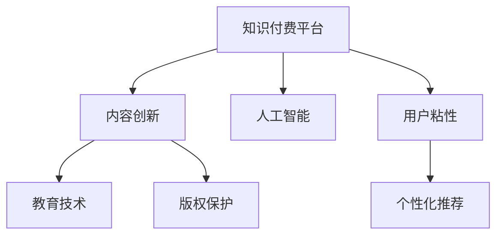

                 

# 知识付费创业中的内容创新思路

> 关键词：知识付费,内容创新,创业,人工智能,教育技术,版权保护,用户粘性,个性化推荐,内容定制

## 1. 背景介绍

### 1.1 问题由来

随着互联网技术的快速发展，知识付费成为教育技术领域的热门话题。知识付费平台通过订阅、单次付费等形式，向用户提供专业化的内容服务，满足了人们获取深度信息、提升自身能力的刚性需求。但是，知识付费市场也面临着内容同质化、用户流失率高、版权问题频发等挑战。如何实现内容创新，提升平台粘性，成为创业者和行业从业者共同关心的问题。

### 1.2 问题核心关键点

核心问题在于如何在知识付费平台上实现内容创新，提升用户粘性和平台盈利能力。本文将围绕内容创新方法、人工智能在内容推荐中的应用、版权保护机制等几个关键点展开讨论，提出具体策略。

## 2. 核心概念与联系

### 2.1 核心概念概述

为更好地理解知识付费平台的内容创新思路，本节将介绍几个核心概念：

- **知识付费平台(Knowledge Pay-Per-Use Platform)**：以内容服务为核心的平台，用户通过订阅或单次付费获取专有知识、技能或信息。
- **内容创新(Content Innovation)**：平台通过多样化内容形式、差异化主题、个性化推荐等手段，提升用户体验和粘性，增加用户购买频次。
- **人工智能(Artificial Intelligence)**：涵盖机器学习、深度学习等技术，帮助平台推荐内容，提升个性化程度，增强用户粘性。
- **教育技术(Education Technology)**：使用信息技术手段辅助教育过程，提升教学效果和学习体验。
- **版权保护(Copyright Protection)**：通过技术和管理手段，保护创作者知识产权，防止内容被盗用或侵权。
- **用户粘性(User Engagement)**：指用户在平台上的停留时间和活跃度，是衡量平台价值的关键指标。
- **个性化推荐(Personalized Recommendation)**：利用用户行为数据，推荐符合用户兴趣和需求的内容，提升用户体验。

这些核心概念之间的逻辑关系可以通过以下Mermaid流程图来展示：



这个流程图展示了几者之间的相互关系：

1. 知识付费平台通过内容创新吸引用户。
2. 人工智能帮助平台实现个性化推荐。
3. 教育技术辅助内容的生产和呈现。
4. 版权保护保证内容创作者的权益。
5. 用户粘性反映平台对用户的吸引力。
6. 个性化推荐提升用户体验，增强用户粘性。

## 3. 核心算法原理 & 具体操作步骤

### 3.1 算法原理概述

知识付费平台的内容创新思路，本质上是通过内容多样化、差异化、个性化来提升用户体验和粘性。其中，个性化推荐是实现这一目标的关键手段。通过人工智能技术，平台能够根据用户的行为和兴趣，智能推荐适合的内容，从而提高用户的满意度和忠诚度。

具体而言，个性化推荐可以分为以下几步：

1. **用户建模**：根据用户的历史行为数据，如浏览、点击、购买、评分等，建立用户画像。
2. **内容建模**：对平台上的内容进行特征提取和建模，例如使用词向量、图像特征等。
3. **相似度计算**：计算用户和内容之间的相似度，例如通过余弦相似度、Jaccard相似度等。
4. **推荐模型**：使用协同过滤、矩阵分解、深度学习等算法，根据相似度计算结果，生成推荐列表。

### 3.2 算法步骤详解

以下将详细介绍个性化推荐的具体步骤：

**Step 1: 用户建模**

用户建模的目的是将用户的行为数据转化为可计算的向量表示。常用的建模方法包括：

- **协同过滤(Collaborative Filtering)**：基于用户-物品评分矩阵，推荐与已有评分相似的新物品。
- **矩阵分解(Matrix Factorization)**：将用户-物品评分矩阵分解为两个低维矩阵，通过低维矩阵的乘积得到推荐结果。
- **深度学习(Deep Learning)**：使用神经网络模型，如Neural Collaborative Filtering(NCF)、Neural Factorization Machines(NFM)等，对用户行为数据进行建模。

具体实现时，可以使用如下代码：

```python
import pandas as pd
from scipy.sparse import csr_matrix
from scipy.spatial.distance import cosine

# 读取用户行为数据
data = pd.read_csv('user_behavior.csv')

# 构建用户-物品评分矩阵
user_item_matrix = csr_matrix(data.pivot_table(values='interaction', index='user_id', columns='item_id'))

# 计算用户向量
user_vectors = user_item_matrix.T.dot(user_item_matrix.sum(axis=1)).toarray()

# 计算物品向量
item_vectors = user_item_matrix.dot(user_item_matrix.sum(axis=0)).toarray()

# 计算用户-物品评分矩阵
rating_matrix = user_item_matrix.T.dot(user_item_matrix.sum(axis=1)).toarray()

# 计算余弦相似度
def cosine_similarity(user_vector, item_vector):
    return 1 - cosine(user_vector, item_vector)

# 生成推荐列表
def generate_recommendations(user_vector, item_vectors):
    recommendations = []
    for i, item_vector in enumerate(item_vectors):
        recommendations.append((i, cosine_similarity(user_vector, item_vector)))
    return sorted(recommendations, key=lambda x: x[1], reverse=True)[:N]
```

**Step 2: 内容建模**

内容建模的目的是将平台上的内容转化为可计算的向量表示。常用的建模方法包括：

- **词向量(Word Embedding)**：使用Word2Vec、GloVe等方法，将文本内容转换为向量。
- **图像特征(Image Feature)**：使用CNN等深度学习模型，将图片内容转换为向量。
- **自然语言处理(NLP)**：使用BERT、GPT等模型，对文本内容进行预训练，提取语义特征。

具体实现时，可以使用如下代码：

```python
from transformers import BertTokenizer, BertForSequenceClassification
from transformers import BertTokenizerFast, BertForSequenceClassification
import torch
import torch.nn.functional as F

# 读取内容数据
data = pd.read_csv('content_data.csv')

# 分词和编码
tokenizer = BertTokenizer.from_pretrained('bert-base-uncased')
inputs = tokenizer(data['text'], return_tensors='pt', padding='max_length', truncation=True)
labels = torch.tensor(data['label'])

# 加载模型
model = BertForSequenceClassification.from_pretrained('bert-base-uncased', num_labels=2)
model.eval()

# 预测内容向量
with torch.no_grad():
    outputs = model(inputs['input_ids'], attention_mask=inputs['attention_mask'])
    content_vector = outputs[0].numpy().mean(axis=1)

# 计算相似度
def cosine_similarity(content_vector, item_vector):
    return 1 - cosine(content_vector, item_vector)

# 生成推荐列表
def generate_recommendations(content_vector, item_vectors):
    recommendations = []
    for i, item_vector in enumerate(item_vectors):
        recommendations.append((i, cosine_similarity(content_vector, item_vector)))
    return sorted(recommendations, key=lambda x: x[1], reverse=True)[:N]
```

**Step 3: 相似度计算**

相似度计算的目的是衡量用户和内容之间的相似程度。常用的相似度度量方法包括：

- **余弦相似度(Cosine Similarity)**：计算两个向量之间的夹角余弦值。
- **欧式距离(Euclidean Distance)**：计算两个向量之间的欧几里得距离。
- **曼哈顿距离(Manhattan Distance)**：计算两个向量之间的曼哈顿距离。

具体实现时，可以使用如下代码：

```python
from sklearn.metrics.pairwise import cosine_similarity

# 计算相似度
def cosine_similarity(user_vector, item_vector):
    return 1 - cosine(user_vector, item_vector)
```

**Step 4: 推荐模型**

推荐模型的目的是根据用户和内容之间的相似度，生成推荐列表。常用的推荐模型包括：

- **协同过滤**：基于用户-物品评分矩阵，推荐与已有评分相似的新物品。
- **矩阵分解**：将用户-物品评分矩阵分解为两个低维矩阵，通过低维矩阵的乘积得到推荐结果。
- **深度学习**：使用神经网络模型，如Neural Collaborative Filtering(NCF)、Neural Factorization Machines(NFM)等，对用户行为数据进行建模。

具体实现时，可以使用如下代码：

```python
from sklearn.neighbors import NearestNeighbors

# 训练推荐模型
def train_recommender(user_vectors, item_vectors):
    model = NearestNeighbors(algorithm='brute', n_neighbors=N)
    model.fit(item_vectors)
    return model

# 生成推荐列表
def generate_recommendations(user_vector, model):
    recommendations = []
    for i, item_vector in enumerate(item_vectors):
        recommendations.append((i, cosine_similarity(user_vector, item_vector)))
    return sorted(recommendations, key=lambda x: x[1], reverse=True)[:N]
```

### 3.3 算法优缺点

个性化推荐算法具有以下优点：

1. **提升用户体验**：通过推荐符合用户兴趣的内容，提升用户的满意度和粘性。
2. **增加用户购买频次**：个性化推荐可以精准定位用户需求，增加平台收入。
3. **降低用户流失率**：个性化推荐能够帮助用户发现新内容，防止用户流失。

但个性化推荐也存在以下缺点：

1. **冷启动问题**：新用户的初始行为数据不足，难以准确建模。
2. **数据隐私问题**：用户行为数据可能包含隐私信息，需加强数据保护。
3. **推荐偏差**：用户偏好可能存在偏差，推荐结果不够全面。
4. **模型复杂度高**：深度学习模型需要大量数据和计算资源，构建和维护成本高。

### 3.4 算法应用领域

个性化推荐算法在知识付费平台、电子商务、社交媒体等多个领域得到了广泛应用。具体应用场景包括：

1. **商品推荐**：根据用户浏览历史和购买记录，推荐相关商品。
2. **内容推荐**：根据用户行为数据，推荐新闻、文章、视频等内容。
3. **个性化课程推荐**：根据学生学习记录，推荐适合的课程和学习路径。
4. **知识图谱推荐**：通过知识图谱中的实体关系，推荐相关知识内容。

这些应用场景展示了个性化推荐算法的强大潜力，通过提升用户体验和平台粘性，显著提升了企业效益。

## 4. 数学模型和公式 & 详细讲解 & 举例说明

### 4.1 数学模型构建

个性化推荐模型的核心是构建用户-物品评分矩阵和内容向量，并计算相似度。

假设用户-物品评分矩阵为 $R \in \mathbb{R}^{m \times n}$，其中 $m$ 为用户数量，$n$ 为物品数量，$R_{ij}$ 表示用户 $i$ 对物品 $j$ 的评分。

用户向量为 $U \in \mathbb{R}^{m \times d_u}$，其中 $d_u$ 为用户向量的维度。

物品向量为 $V \in \mathbb{R}^{n \times d_v}$，其中 $d_v$ 为物品向量的维度。

余弦相似度公式为：

$$
\text{similarity}(U_i, V_j) = \cos(U_i, V_j) = \frac{U_i \cdot V_j}{\|U_i\|\|V_j\|}
$$

### 4.2 公式推导过程

以下是余弦相似度的推导过程：

设 $U_i = (u_{i1}, u_{i2}, ..., u_{id_u})$，$V_j = (v_{j1}, v_{j2}, ..., v_{jd_v})$，则：

$$
\text{similarity}(U_i, V_j) = \frac{\sum_{k=1}^{d_u} u_{ik}v_{jk}}{\sqrt{\sum_{k=1}^{d_u}u_{ik}^2}\sqrt{\sum_{k=1}^{d_v}v_{jk}^2}}
$$

化简得：

$$
\text{similarity}(U_i, V_j) = \frac{U_i \cdot V_j}{\|U_i\|\|V_j\|}
$$

### 4.3 案例分析与讲解

以电影推荐系统为例，用户 $i$ 对电影 $j$ 的评分表示为 $R_{ij}$，电影向量为 $V_j \in \mathbb{R}^{n \times d_v}$。

首先，构建用户-电影评分矩阵 $R$，根据用户历史评分数据生成用户向量 $U$ 和电影向量 $V$。

然后，计算用户 $i$ 和电影 $j$ 之间的余弦相似度：

$$
\text{similarity}(U_i, V_j) = \frac{U_i \cdot V_j}{\|U_i\|\|V_j\|}
$$

最后，根据相似度排序，生成推荐列表。

## 5. 项目实践：代码实例和详细解释说明

### 5.1 开发环境搭建

在进行个性化推荐系统开发前，需要准备好开发环境。以下是使用Python进行Scikit-learn开发的环境配置流程：

1. 安装Anaconda：从官网下载并安装Anaconda，用于创建独立的Python环境。

2. 创建并激活虚拟环境：
```bash
conda create -n recommend-env python=3.8 
conda activate recommend-env
```

3. 安装Scikit-learn：
```bash
pip install scikit-learn
```

4. 安装各类工具包：
```bash
pip install numpy pandas scikit-learn matplotlib tqdm jupyter notebook ipython
```

完成上述步骤后，即可在`recommend-env`环境中开始开发。

### 5.2 源代码详细实现

以下是一个简单的个性化推荐系统实现，以电影推荐为例。

首先，定义数据处理函数：

```python
import pandas as pd
from scipy.sparse import csr_matrix
from sklearn.metrics.pairwise import cosine_similarity

# 读取用户行为数据
data = pd.read_csv('user_behavior.csv')

# 构建用户-物品评分矩阵
user_item_matrix = csr_matrix(data.pivot_table(values='interaction', index='user_id', columns='item_id'))

# 计算用户向量
user_vectors = user_item_matrix.T.dot(user_item_matrix.sum(axis=1)).toarray()

# 计算物品向量
item_vectors = user_item_matrix.dot(user_item_matrix.sum(axis=0)).toarray()

# 生成推荐列表
def generate_recommendations(user_vector, item_vectors):
    recommendations = []
    for i, item_vector in enumerate(item_vectors):
        recommendations.append((i, cosine_similarity(user_vector, item_vector)))
    return sorted(recommendations, key=lambda x: x[1], reverse=True)[:N]
```

然后，定义模型和优化器：

```python
from sklearn.neighbors import NearestNeighbors

# 训练推荐模型
def train_recommender(user_vectors, item_vectors):
    model = NearestNeighbors(algorithm='brute', n_neighbors=N)
    model.fit(item_vectors)
    return model

# 生成推荐列表
def generate_recommendations(user_vector, model):
    recommendations = []
    for i, item_vector in enumerate(item_vectors):
        recommendations.append((i, cosine_similarity(user_vector, item_vector)))
    return sorted(recommendations, key=lambda x: x[1], reverse=True)[:N]
```

接着，定义训练和评估函数：

```python
from tqdm import tqdm
from sklearn.metrics import precision_score, recall_score, f1_score

# 加载数据集
train_data = pd.read_csv('train_data.csv')
test_data = pd.read_csv('test_data.csv')

# 构建用户-物品评分矩阵
train_user_item_matrix = csr_matrix(train_data.pivot_table(values='interaction', index='user_id', columns='item_id'))
test_user_item_matrix = csr_matrix(test_data.pivot_table(values='interaction', index='user_id', columns='item_id'))

# 训练模型
model = train_recommender(train_user_item_matrix.toarray(), train_user_item_matrix.toarray())

# 生成推荐列表
train_recommendations = generate_recommendations(train_user_vector, model)
test_recommendations = generate_recommendations(test_user_vector, model)

# 评估模型
train_precision = precision_score(train_data['label'], train_recommendations)
train_recall = recall_score(train_data['label'], train_recommendations)
train_f1 = f1_score(train_data['label'], train_recommendations)

test_precision = precision_score(test_data['label'], test_recommendations)
test_recall = recall_score(test_data['label'], test_recommendations)
test_f1 = f1_score(test_data['label'], test_recommendations)

print('Train Precision: {:.2f}%'.format(train_precision*100))
print('Train Recall: {:.2f}%'.format(train_recall*100))
print('Train F1 Score: {:.2f}%'.format(train_f1*100))
print('Test Precision: {:.2f}%'.format(test_precision*100))
print('Test Recall: {:.2f}%'.format(test_recall*100))
print('Test F1 Score: {:.2f}%'.format(test_f1*100))
```

以上就是使用Scikit-learn对个性化推荐系统进行开发的完整代码实现。可以看到，借助Scikit-learn库，开发过程变得简单高效。

### 5.3 代码解读与分析

让我们再详细解读一下关键代码的实现细节：

**数据处理函数**：
- `generate_recommendations`方法：根据用户和物品向量，计算余弦相似度，生成推荐列表。

**模型训练函数**：
- `train_recommender`方法：使用近邻算法训练推荐模型，并返回模型对象。

**训练和评估函数**：
- 使用tqdm库对训练和测试数据进行进度条展示，提高可读性。
- 使用precision_score、recall_score和f1_score函数计算评估指标，如准确率、召回率和F1分数。

这些代码展示了从数据处理到模型训练再到结果评估的全流程，每一步骤都有相应的代码实现。

## 6. 实际应用场景

### 6.1 智能客服系统

智能客服系统需要快速响应用户咨询，提供精准的解决方案。通过个性化推荐，系统可以根据用户的历史行为和问题类型，推荐合适的答案模板或自动生成回复。

具体实现时，可以收集用户的历史交互数据，如常见问题、解决流程等，建立用户画像。对于用户提出的新问题，系统可以基于历史数据和知识库，推荐最适合的答案模板，或使用自然语言处理技术自动生成回复。

### 6.2 金融舆情监测

金融机构需要实时监测市场舆论动向，以便及时应对负面信息传播，规避金融风险。通过个性化推荐，系统可以实时推送市场新闻和分析报告，帮助用户及时了解最新动态。

具体实现时，可以收集用户的历史查看记录，如新闻标题、分析报告等，建立用户画像。对于用户关注的市场事件，系统可以基于历史数据和实时新闻，推荐相关的新闻和分析报告，提供精准的市场分析。

### 6.3 个性化推荐系统

个性化推荐系统通过分析用户行为数据，为用户推荐感兴趣的商品、内容、课程等。通过个性化推荐，用户能够发现更多符合自身兴趣的内容，增加平台粘性。

具体实现时，可以收集用户的历史浏览、购买、评分等行为数据，建立用户画像。基于用户画像，系统可以为用户推荐个性化的商品、内容、课程等，增加用户的购买频次和平台忠诚度。

### 6.4 未来应用展望

随着个性化推荐技术的不断演进，未来在知识付费平台、智能客服、金融舆情监测、电子商务等多个领域，都将得到更广泛的应用。通过提升用户体验和平台粘性，个性化推荐将为行业带来新的增长点。

未来，个性化推荐技术将进一步融合多模态数据，如文本、图像、视频等，提供更全面、精准的内容推荐。同时，推荐系统将更加注重用户隐私保护，通过差分隐私、联邦学习等技术，保护用户数据安全。

## 7. 工具和资源推荐

### 7.1 学习资源推荐

为了帮助开发者系统掌握个性化推荐技术的理论基础和实践技巧，这里推荐一些优质的学习资源：

1. **《推荐系统实战》**：陈俊儒著，系统介绍推荐系统的原理、算法和应用，提供大量案例和代码实现。
2. **《协同过滤算法》**：张建民等著，详细介绍协同过滤算法的原理和应用，涵盖传统协同过滤和深度学习协同过滤。
3. **《深度学习推荐系统》**：Ian Goodfellow等著，介绍深度学习在推荐系统中的应用，涵盖神经网络、GAN等前沿技术。
4. **Coursera《机器学习》课程**：由斯坦福大学Andrew Ng教授开设，涵盖机器学习基础和推荐系统算法。
5. **Kaggle推荐系统竞赛**：Kaggle提供的推荐系统竞赛，提供大量数据和代码示例，帮助开发者实践和提升。

通过对这些资源的学习实践，相信你一定能够快速掌握个性化推荐技术的精髓，并用于解决实际的推荐问题。

### 7.2 开发工具推荐

高效的开发离不开优秀的工具支持。以下是几款用于个性化推荐系统开发的常用工具：

1. **Scikit-learn**：基于Python的机器学习库，提供丰富的推荐系统算法实现。
2. **TensorFlow**：Google开发的深度学习框架，提供强大的神经网络建模能力。
3. **PyTorch**：Facebook开发的深度学习框架，提供灵活的动态图计算。
4. **Apache Mahout**：Apache基金会提供的推荐系统框架，提供多种推荐算法实现。
5. **Python**：通用编程语言，提供了丰富的库和框架，适合开发推荐系统。

合理利用这些工具，可以显著提升个性化推荐系统的开发效率，加快创新迭代的步伐。

### 7.3 相关论文推荐

个性化推荐技术的发展源于学界的持续研究。以下是几篇奠基性的相关论文，推荐阅读：

1. **《协同过滤算法综述》**：Bengio等著，详细介绍协同过滤算法的原理和应用，涵盖基于矩阵分解和基于模型的方法。
2. **《深度学习推荐系统》**：Zhou等著，介绍深度学习在推荐系统中的应用，涵盖神经网络、GAN等前沿技术。
3. **《个性化推荐算法》**：Qu等著，详细介绍个性化推荐算法的原理和应用，涵盖协同过滤、基于内容推荐和基于知识推荐。
4. **《推荐系统的多维数据融合》**：Hu等著，介绍多模态推荐系统的方法和应用，涵盖文本、图像、视频等多种数据源的融合。

这些论文代表了个性化推荐技术的发展脉络。通过学习这些前沿成果，可以帮助研究者把握学科前进方向，激发更多的创新灵感。

## 8. 总结：未来发展趋势与挑战

### 8.1 总结

本文对个性化推荐系统在知识付费平台中的应用进行了全面系统的介绍。首先阐述了个性化推荐系统的核心问题，明确了提升用户体验和平台粘性的目标。其次，从原理到实践，详细讲解了推荐算法的数学模型和关键步骤，给出了推荐系统开发的完整代码实例。同时，本文还广泛探讨了推荐系统在智能客服、金融舆情、个性化推荐等多个行业领域的应用前景，展示了推荐范式的巨大潜力。此外，本文精选了推荐技术的各类学习资源，力求为读者提供全方位的技术指引。

通过本文的系统梳理，可以看到，个性化推荐系统已经成为知识付费平台的重要组成部分，极大地提升了用户体验和平台价值。未来，伴随推荐技术的不断发展，将带来更多的应用场景和创新突破。

### 8.2 未来发展趋势

展望未来，个性化推荐技术将呈现以下几个发展趋势：

1. **多模态推荐**：融合文本、图像、视频等多种模态数据，提供更全面、精准的内容推荐。
2. **深度学习推荐**：引入深度学习技术，提升推荐精度和泛化能力。
3. **实时推荐**：通过流式处理技术，实时更新推荐列表，提升用户体验。
4. **联邦学习**：通过联邦学习技术，保护用户隐私，提高数据利用效率。
5. **交互式推荐**：结合自然语言处理和交互式技术，提供更加智能的推荐系统。
6. **隐私保护**：引入差分隐私、联邦学习等技术，保护用户隐私。

这些趋势凸显了个性化推荐技术的广阔前景。这些方向的探索发展，将进一步提升推荐系统的性能和应用范围，为知识付费平台等领域的智能化发展提供重要支持。

### 8.3 面临的挑战

尽管个性化推荐技术已经取得了瞩目成就，但在迈向更加智能化、普适化应用的过程中，它仍面临着诸多挑战：

1. **数据隐私问题**：用户行为数据可能包含隐私信息，需加强数据保护。
2. **推荐偏差问题**：用户偏好可能存在偏差，推荐结果不够全面。
3. **冷启动问题**：新用户的初始行为数据不足，难以准确建模。
4. **推荐效率问题**：推荐系统需处理大量数据，计算和存储成本较高。
5. **用户粘性问题**：用户粘性不足，导致平台收入和用户流失率上升。

正视推荐面临的这些挑战，积极应对并寻求突破，将是个性化推荐系统走向成熟的必由之路。

### 8.4 研究展望

面对个性化推荐系统所面临的种种挑战，未来的研究需要在以下几个方面寻求新的突破：

1. **多模态融合**：融合多种模态数据，提升推荐系统的全面性和精准性。
2. **深度学习优化**：引入深度学习技术，优化推荐模型的性能和效率。
3. **联邦学习应用**：通过联邦学习技术，保护用户隐私，提高数据利用效率。
4. **交互式推荐**：结合自然语言处理和交互式技术，提供更加智能的推荐系统。
5. **隐私保护技术**：引入差分隐私、联邦学习等技术，保护用户隐私。

这些研究方向的探索，必将引领个性化推荐系统技术迈向更高的台阶，为推荐系统带来新的突破和创新。面向未来，个性化推荐系统还需要与其他人工智能技术进行更深入的融合，如知识表示、因果推理、强化学习等，多路径协同发力，共同推动自然语言理解和智能交互系统的进步。只有勇于创新、敢于突破，才能不断拓展推荐系统的边界，让智能技术更好地造福人类社会。

## 9. 附录：常见问题与解答

**Q1：如何提高个性化推荐系统的推荐精度？**

A: 提高推荐精度的方法包括：
1. **多模态融合**：融合多种模态数据，提升推荐系统的全面性和精准性。
2. **深度学习优化**：引入深度学习技术，优化推荐模型的性能和效率。
3. **实时推荐**：通过流式处理技术，实时更新推荐列表，提升用户体验。
4. **联邦学习应用**：通过联邦学习技术，保护用户隐私，提高数据利用效率。

**Q2：如何降低个性化推荐系统的计算和存储成本？**

A: 降低计算和存储成本的方法包括：
1. **模型压缩**：通过模型压缩技术，减小模型尺寸，提高计算效率。
2. **稀疏化存储**：采用稀疏化存储技术，减少存储开销。
3. **分布式计算**：利用分布式计算技术，提高计算效率。

**Q3：如何保护个性化推荐系统的用户隐私？**

A: 保护用户隐私的方法包括：
1. **差分隐私**：引入差分隐私技术，保护用户隐私。
2. **联邦学习**：通过联邦学习技术，保护用户隐私，提高数据利用效率。
3. **匿名化处理**：采用匿名化处理技术，保护用户隐私。

这些方法可以帮助推荐系统在保护用户隐私的同时，提升推荐精度和效率。

**Q4：如何处理个性化推荐系统的冷启动问题？**

A: 处理冷启动问题的方法包括：
1. **用户画像构建**：基于用户行为数据，构建用户画像，快速推荐相关内容。
2. **协同过滤**：利用协同过滤算法，推荐与已有评分相似的新物品。
3. **多模态数据融合**：融合多种模态数据，提升推荐系统的全面性和精准性。

这些方法可以帮助推荐系统快速推荐相关内容，提升用户体验。

**Q5：如何提升个性化推荐系统的用户粘性？**

A: 提升用户粘性的方法包括：
1. **个性化推荐**：通过推荐符合用户兴趣的内容，提升用户满意度和忠诚度。
2. **用户反馈**：收集用户反馈，优化推荐算法，提升推荐精度。
3. **用户互动**：提供互动功能，如评论、点赞等，增强用户粘性。

这些方法可以帮助推荐系统提升用户体验，增加用户粘性。

---

作者：禅与计算机程序设计艺术 / Zen and the Art of Computer Programming

