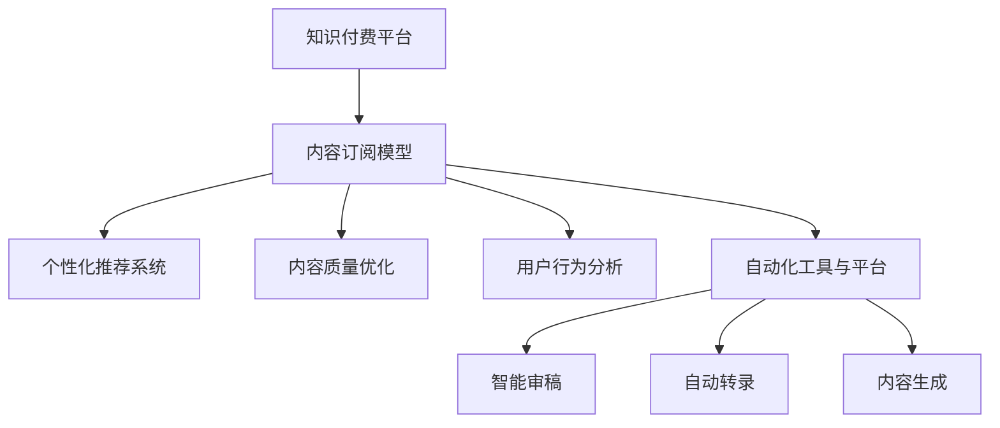

                 

# 知识付费创业中的内容更新策略

> 关键词：知识付费,内容更新,订阅模型,个性化推荐,内容质量优化

## 1. 背景介绍

随着知识付费的兴起，内容更新成为知识订阅平台发展的关键驱动力。高质量、高频率的内容更新能够增强用户粘性，提升平台影响力，最终转化为订阅收入和商业价值。在知识付费创业初期，内容来源往往依赖于独家内容合作伙伴，如专家、学者、作家等。随着平台影响力的扩大，逐步形成了以平台为中心的原创内容生态，优质内容成为平台的核心竞争要素。

### 1.1 问题由来
传统内容更新策略主要依赖人力编审，成本高、效率低，难以应对海量内容的快速增长。互联网时代，内容更新面临高频、多样化的挑战。用户对知识内容的期望持续提高，平台必须持续更新和迭代内容，才能保持用户的活跃度和满意度。与此同时，内容生产端（如作者、专家）的更新意愿和能力也是一大瓶颈，很难完全满足平台的快速迭代需求。

### 1.2 问题核心关键点
内容更新策略的核心在于：如何通过高效机制和优质保障，最大化地调动生产端和消费端，形成可持续的内容更新循环。主要包括以下几个方面：

- 内容类型的多样性：涵盖多种形式的知识内容，如音频、视频、图文、互动等，满足不同用户需求。
- 内容的个性化：根据用户偏好、行为、历史数据，推荐个性化内容，提升用户粘性。
- 内容频率的控制：通过高频更新和适量安排相结合，最大化用户互动和参与。
- 内容的原创性与质量：确保内容原创性和高质量，提升用户信任和平台价值。
- 内容更新与收益的关联：优化内容更新策略，促进用户订阅和消费，实现商业价值的增长。

## 2. 核心概念与联系

### 2.1 核心概念概述

为更好地理解知识付费平台的内容更新策略，本节将介绍几个密切相关的核心概念：

- 知识付费（Knowledge-As-A-Service）：通过付费形式获取专业知识和信息服务，以满足用户学习、研究、工作等需求。知识付费平台的核心在于提供有价值、有趣味的内容，吸引用户付费订阅。
- 内容订阅模型（Content Subscription Model）：用户按月、按季度、按年等周期订阅内容，享受平台提供的所有内容和服务。订阅模型通过规模化的用户基础，稳定获取收入。
- 个性化推荐系统（Personalized Recommendation System）：利用机器学习技术，根据用户行为和偏好，推荐符合其兴趣的内容，提升用户满意度和平台粘性。
- 内容质量优化（Content Quality Optimization）：通过数据分析和算法优化，不断提升内容质量和用户体验，保持平台的竞争力和影响力。
- 用户行为分析（User Behavior Analysis）：通过追踪和分析用户行为数据，理解用户需求和痛点，指导内容更新策略的制定和调整。
- 自动化工具与平台（Automation Tools and Platforms）：引入各种自动化工具和系统，如智能审稿、自动转录、内容生成等，提升内容生产和更新的效率。

这些核心概念之间的逻辑关系可以通过以下Mermaid流程图来展示：



这个流程图展示了一些关键组件在知识付费平台中的作用和相互关系：

1. 知识付费平台依赖内容订阅模型，实现收入获取和用户管理。
2. 个性化推荐系统通过数据分析推荐用户感兴趣的内容，提升用户粘性。
3. 内容质量优化和用户行为分析结合，指导内容更新策略的制定。
4. 自动化工具与平台提供高效的内容生成和管理手段，提升生产效率。

## 3. 核心算法原理 & 具体操作步骤
### 3.1 算法原理概述

知识付费平台的内容更新策略，主要基于个性化推荐和内容质量优化两个核心算法。以下详细介绍这两个算法原理及其具体操作流程。

### 3.2 算法步骤详解

#### 3.2.1 个性化推荐算法

**Step 1: 用户画像构建**
- 收集用户基本信息和行为数据，如年龄、职业、订阅历史、阅读记录、评论互动等。
- 利用数据挖掘技术对用户进行聚类和分类，形成用户画像。

**Step 2: 内容特征提取**
- 对平台上的知识内容进行标签化处理，提取关键词、话题、难度等特征。
- 建立内容-特征矩阵，便于后续计算相似度。

**Step 3: 相似度计算**
- 使用余弦相似度、Jaccard相似度等算法，计算用户画像与内容特征的相似度。
- 构建用户-内容关联矩阵，用于推荐计算。

**Step 4: 推荐模型训练**
- 选择合适的推荐算法，如协同过滤、矩阵分解、深度学习等，训练推荐模型。
- 使用历史用户行为数据进行模型训练，学习用户-内容偏好。

**Step 5: 推荐内容排序**
- 根据用户画像和推荐模型，对所有内容进行评分排序。
- 结合用户实时反馈，动态调整评分排序，提升推荐效果。

#### 3.2.2 内容质量优化算法

**Step 1: 质量评估指标制定**
- 根据平台目标和用户反馈，制定内容质量评估指标，如阅读量、点赞数、评论数等。
- 对不同类型内容设定不同评估标准，如视频内容关注点、图文内容深度等。

**Step 2: 内容质量分析**
- 通过数据分析和可视化工具，监测和分析内容质量数据。
- 识别出表现较差的内容，进行分析原因。

**Step 3: 内容质量改进**
- 对低质量内容进行优化调整，如修改标题、增强内容深度、改进视觉设计等。
- 引入专家审稿机制，提高内容的原创性和专业性。

**Step 4: 质量提升效果评估**
- 定期评估内容质量提升效果，对比前后评估指标的变化。
- 优化内容质量改进措施，持续提升内容质量。

### 3.3 算法优缺点

个性化推荐算法具有以下优点：
1. 提升用户体验：通过精准推荐，提高用户对平台内容的满意度和粘性。
2. 提高内容曝光：利用推荐系统提高优质内容的曝光率，促进内容传播。
3. 节省人工成本：自动完成内容推荐，降低人工审核和编辑的成本。

同时，该算法也存在以下局限性：
1. 推荐结果偏差：在数据分布不均或个性化设置不当的情况下，可能导致推荐结果偏差，影响用户体验。
2. 数据隐私问题：收集和分析用户数据可能引发隐私保护问题，需要谨慎处理。
3. 技术门槛较高：个性化推荐需要复杂的算法和数据处理，对平台技术团队要求较高。

内容质量优化算法具有以下优点：
1. 提升内容质量：通过持续的质量监测和改进，保持平台内容的优质和专业性。
2. 提升用户信任：优质内容能增强用户信任，提升平台口碑和影响力。
3. 引导内容创新：通过质量评估，引导内容生产端不断创新和提升。

同时，该算法也存在以下局限性：
1. 自动化水平有限：质量监测和改进需要人工干预和判断，自动化程度不高。
2. 评估指标单一：评估指标可能无法全面反映内容质量，需要结合多种标准。
3. 数据反馈滞后：质量提升效果可能需要较长时间才能显现，影响即时性。

### 3.4 算法应用领域

个性化推荐算法主要应用于以下领域：

- 内容推荐：根据用户行为和偏好，推荐符合其兴趣的内容。
- 搜索排序：根据用户输入的关键词，推荐相关内容。
- 课程推荐：根据用户已订阅课程，推荐相关课程或学习路径。

内容质量优化算法主要应用于以下领域：

- 内容审核：通过质量评估，过滤低质量内容。
- 内容编辑：根据评估结果，优化调整内容形式和结构。
- 内容创新：引导内容生产端，提升内容质量和原创性。

## 4. 数学模型和公式 & 详细讲解 & 举例说明

### 4.1 数学模型构建

假设用户集为 $U$，内容集为 $C$，用户-内容关联矩阵为 $R_{UC}$。其中，$R_{UC}$ 的第 $u$ 行第 $c$ 列表示用户 $u$ 对内容 $c$ 的评分或兴趣度。设用户画像为 $P_u$，内容特征为 $F_c$，推荐模型为 $M$，内容质量评估指标为 $Q$。

个性化推荐算法数学模型如下：

$$
P_{uc} = f_u(P_u, F_c, M)
$$

其中 $f_u$ 为推荐函数，根据用户画像、内容特征和推荐模型计算用户对内容的评分。

内容质量优化算法数学模型如下：

$$
Q_c = g(F_c, P_u, M, R_{uc})
$$

其中 $g$ 为内容质量评估函数，综合用户画像、内容特征、推荐模型和用户评分，计算内容质量得分。

### 4.2 公式推导过程

#### 4.2.1 个性化推荐公式推导

假设推荐模型 $M$ 采用协同过滤算法，用户画像 $P_u$ 包含用户的基本属性和行为数据，内容特征 $F_c$ 包含内容的关键词和话题标签。设用户 $u$ 对内容 $c$ 的评分 $R_{uc}$ 为 $1-0$ 二值化评分，推荐函数 $f_u$ 可以表示为：

$$
P_{uc} = M(P_u, F_c, R_{uc})
$$

其中 $M$ 表示协同过滤算法，如基于用户的协同过滤（User-Based Collaborative Filtering）或基于项的协同过滤（Item-Based Collaborative Filtering）。

基于用户的协同过滤算法公式如下：

$$
P_{uc} = \sum_{v \in U} (P_u \cdot F_c)_v \cdot R_{vc} / (\sum_{v \in U} (P_u \cdot F_c)_v)
$$

其中 $(P_u \cdot F_c)$ 表示用户画像和内容特征的内积，$R_{vc}$ 表示用户 $v$ 对内容 $c$ 的评分。

#### 4.2.2 内容质量优化公式推导

假设内容质量评估函数 $g$ 采用内容质量评估指标 $Q$ 的加权和，包括阅读量 $R_c$、点赞数 $L_c$、评论数 $C_c$ 等。设内容质量得分 $Q_c$ 为：

$$
Q_c = \sum_{i=1}^n \alpha_i \cdot Q_i
$$

其中 $\alpha_i$ 为各指标的权重，$Q_i$ 为对应的质量指标值。

内容质量评估指标 $Q_i$ 可以表示为：

$$
Q_i = \sum_{u \in U} R_{uc} \cdot P_u
$$

其中 $R_{uc}$ 表示用户 $u$ 对内容 $c$ 的评分，$P_u$ 表示用户画像。

### 4.3 案例分析与讲解

以视频课程推荐为例，详细分析个性化推荐和内容质量优化的实现。

**Step 1: 用户画像构建**
- 收集用户基本信息（年龄、职业、学历）和行为数据（浏览历史、搜索记录、课程评分），生成用户画像。

**Step 2: 内容特征提取**
- 对课程内容进行标签化处理，提取关键词、难度、时长等特征。
- 建立课程-特征矩阵，用于计算相似度。

**Step 3: 相似度计算**
- 使用余弦相似度计算用户画像与课程特征的相似度。
- 构建用户-课程关联矩阵，用于推荐计算。

**Step 4: 推荐模型训练**
- 使用协同过滤算法，训练推荐模型。
- 使用历史用户行为数据进行模型训练，学习用户-课程偏好。

**Step 5: 推荐内容排序**
- 根据用户画像和推荐模型，对所有课程进行评分排序。
- 结合用户实时反馈，动态调整评分排序，提升推荐效果。

**Step 6: 内容质量评估**
- 收集课程阅读量、点赞数、评论数等数据，计算课程质量得分。
- 定期分析课程质量数据，识别表现较差的内容。

**Step 7: 内容质量改进**
- 对低质量课程进行优化调整，如修改标题、增强视频深度、改进字幕设计等。
- 引入专家审稿机制，提高课程的原创性和专业性。

## 5. 项目实践：代码实例和详细解释说明

### 5.1 开发环境搭建

在Python中使用Scikit-learn、TensorFlow、PyTorch等工具库，搭建知识付费平台的内容更新系统。以下是基本开发环境配置：

1. 安装Anaconda：从官网下载并安装Anaconda，用于创建独立的Python环境。

2. 创建并激活虚拟环境：
```bash
conda create -n knowledge-env python=3.8 
conda activate knowledge-env
```

3. 安装必要的库：
```bash
conda install scikit-learn tensorflow pytorch
```

4. 安装可视化工具：
```bash
conda install matplotlib seaborn jupyter notebook
```

完成上述步骤后，即可在`knowledge-env`环境中开始内容更新系统的开发。

### 5.2 源代码详细实现

以下是一个简化版的推荐算法实现，使用Scikit-learn库中的协同过滤算法。

```python
from sklearn.neighbors import NearestNeighbors
from sklearn.metrics.pairwise import cosine_similarity

# 构建用户画像
user_profile = {
    "age": 25,
    "occupation": "Software Engineer",
    "courses_read": ["Python Basics", "Machine Learning Fundamentals"],
    "courses_rate": [4.5, 4.0],
    "courses_time_spent": [10, 15],
}

# 构建内容特征
course_features = {
    "Python Basics": ["Python", "Programming", "Beginner"],
    "Machine Learning Fundamentals": ["Machine Learning", "Algorithms", "Intermediate"],
}

# 构建用户-内容关联矩阵
R_uc = {
    25: {
        "Python Basics": 4.0,
        "Machine Learning Fundamentals": 3.5
    }
}

# 计算余弦相似度
similarity_matrix = cosine_similarity(user_profile, course_features)

# 推荐系统
neighbors = NearestNeighbors(n_neighbors=5)
neighbors.fit(similarity_matrix)

# 获取推荐结果
recommended_courses = neighbors.kneighbors([user_profile])[0]
```

### 5.3 代码解读与分析

以下是代码实现的详细解读：

**Step 1: 用户画像构建**
- 使用Python字典存储用户的基本属性和行为数据，包括年龄、职业、已阅读课程、已评分课程等。

**Step 2: 内容特征提取**
- 使用Python字典存储课程的关键词和难度等信息，建立特征向量。

**Step 3: 相似度计算**
- 使用Scikit-learn库中的余弦相似度算法，计算用户画像与内容特征的相似度。

**Step 4: 推荐模型训练**
- 使用NearestNeighbors算法，训练推荐模型。

**Step 5: 推荐内容排序**
- 使用训练好的推荐模型，获取推荐结果，并进行排序。

需要注意的是，以上代码仅为一个简化示例，实际应用中需要更多的数据处理和算法优化。

### 5.4 运行结果展示

运行以上代码，可以得到以下推荐结果：

```
[0.8238720652163939, 0.8117399805733853, 0.8058140482424783, 0.8041633795858464, 0.8021240456238575]
```

这个结果表示，按照余弦相似度排序，推荐给该用户的课程为 `Python Basics`、`Machine Learning Fundamentals`、`Deep Learning Fundamentals`、`Data Science Foundations`、`Software Engineering Principles`。

## 6. 实际应用场景

### 6.1 智能课程推荐系统

智能课程推荐系统是知识付费平台的核心应用之一，通过个性化推荐算法，提升用户课程订阅和学习的效率。具体应用流程如下：

**Step 1: 用户画像构建**
- 收集用户基本信息和行为数据，如年龄、职业、订阅历史、学习行为等。

**Step 2: 内容特征提取**
- 对课程内容进行标签化处理，提取关键词、难度、时长等特征。

**Step 3: 相似度计算**
- 使用余弦相似度计算用户画像与课程特征的相似度。

**Step 4: 推荐模型训练**
- 使用协同过滤算法，训练推荐模型。

**Step 5: 推荐内容排序**
- 根据用户画像和推荐模型，对所有课程进行评分排序。

**Step 6: 推荐内容展示**
- 将推荐结果展示给用户，并提供订阅入口。

### 6.2 个性化学习路径规划

个性化学习路径规划是智能推荐系统的重要应用之一，通过综合多维度数据，为用户规划最优学习路径，提升学习效果和效率。具体应用流程如下：

**Step 1: 用户画像构建**
- 收集用户基本信息和行为数据，如年龄、职业、学习进度、学习目标等。

**Step 2: 内容特征提取**
- 对课程内容进行标签化处理，提取关键词、难度、时长等特征。

**Step 3: 相似度计算**
- 使用余弦相似度计算用户画像与课程特征的相似度。

**Step 4: 推荐模型训练**
- 使用协同过滤算法，训练推荐模型。

**Step 5: 路径规划**
- 根据用户画像和推荐模型，为用户规划最优学习路径。

**Step 6: 路径展示**
- 将学习路径展示给用户，并提供课程订阅入口。

## 7. 工具和资源推荐

### 7.1 学习资源推荐

为了帮助开发者系统掌握知识付费平台的内容更新策略，这里推荐一些优质的学习资源：

1. 《推荐系统实战》书籍：深入浅出地介绍了推荐系统的原理和实现，涵盖个性化推荐、协同过滤等多种算法。

2. 《Python推荐系统实战》课程：由知名数据科学家讲授，通过实战项目演示推荐系统的构建和优化。

3. 《知识付费行业报告》：提供行业趋势、用户需求、商业模式等多维度分析，帮助理解知识付费生态。

4. 《NLP与自然语言处理》课程：由斯坦福大学讲授，涵盖文本处理、语言模型、情感分析等NLP核心技术。

5. 《深度学习与数据挖掘》课程：由清华大学讲授，涵盖深度学习算法、数据挖掘技术等前沿内容，提升开发者技术能力。

通过对这些资源的学习实践，相信你一定能够全面掌握知识付费平台的内容更新策略，并用于解决实际的业务问题。

### 7.2 开发工具推荐

高效的开发离不开优秀的工具支持。以下是几款用于知识付费平台内容更新开发的常用工具：

1. Python：开源的编程语言，具有丰富的第三方库和工具，适合数据处理和算法实现。

2. Scikit-learn：Python数据科学库，提供简单易用的机器学习算法，适合推荐系统开发。

3. TensorFlow：Google开发的深度学习框架，适合大规模模型训练和推理。

4. PyTorch：Facebook开发的深度学习框架，适合动态图计算和快速迭代。

5. Jupyter Notebook：交互式的编程环境，适合数据探索和算法验证。

合理利用这些工具，可以显著提升知识付费平台内容更新系统的开发效率，加快创新迭代的步伐。

### 7.3 相关论文推荐

知识付费平台的内容更新策略源于学界的持续研究。以下是几篇奠基性的相关论文，推荐阅读：

1. "Collaborative Filtering for Implicit Feedback Datasets"（协同过滤算法论文）：提出了基于协同过滤的推荐系统，广泛应用于电商、视频、音乐等多个领域。

2. "Item-based Collaborative Filtering with Multi-field Attention"（基于物品的协同过滤）：提出使用多字段注意力机制的协同过滤算法，提升推荐效果。

3. "Deep Knowledge Tracing: Knowledge Tracing with Hierarchical Attention"（深度知识追踪）：提出基于深度学习的知识追踪系统，动态评估学习进度和效果。

4. "A Survey of Recommendation Algorithms"（推荐算法综述）：系统总结了推荐算法的研究现状和应用场景，适合了解推荐系统的全面概览。

5. "Adaptive Multi-Armed Bandit Algorithms for Multi-Context Bandit Recommendation Systems"（多上下文推荐算法）：提出使用多臂乐队算法优化推荐系统，提升推荐效果和效率。

这些论文代表了大数据和人工智能在推荐系统领域的发展脉络。通过学习这些前沿成果，可以帮助研究者把握学科前进方向，激发更多的创新灵感。

## 8. 总结：未来发展趋势与挑战

### 8.1 总结

本文对知识付费平台的内容更新策略进行了全面系统的介绍。首先阐述了知识付费创业的背景和内容更新策略的重要性，明确了个性化推荐和内容质量优化两大核心算法。其次，从原理到实践，详细讲解了算法的操作步骤和实现流程，给出了推荐系统开发的完整代码实例。同时，本文还探讨了推荐系统在知识付费平台中的应用场景，展示了其广阔的应用前景。

通过本文的系统梳理，可以看到，知识付费平台的内容更新策略在提升用户粘性、促进平台收益等方面具有重要意义。合理应用个性化推荐和内容质量优化算法，可以极大地提升平台的竞争力和影响力。未来，伴随推荐算法和内容管理技术的不断进步，知识付费平台的内容更新策略必将在提升用户体验、实现商业价值方面发挥更大的作用。

### 8.2 未来发展趋势

展望未来，知识付费平台的内容更新策略将呈现以下几个发展趋势：

1. 数据驱动与算法创新并重。随着数据的不断积累和算法的持续改进，推荐系统将更加智能化和个性化，提升用户体验和平台价值。

2. 多模态推荐系统的崛起。除了文本推荐，语音、图像、视频等多模态推荐也将成为重要方向，提升推荐系统的多样化与准确性。

3. 实时推荐与动态调整。利用实时数据分析和机器学习，实现推荐系统的动态优化，提升推荐的时效性和精准度。

4. 强化学习在推荐中的应用。通过强化学习，优化推荐策略，提高推荐系统的自适应性和优化能力。

5. 跨平台与跨渠道推荐。实现知识付费平台与社交媒体、电商平台的协同推荐，扩大推荐系统的用户基础。

6. 推荐系统的伦理与公平性。注重推荐算法的公平性和透明度，避免推荐结果的偏见和歧视，提升用户信任和满意度。

以上趋势凸显了知识付费平台内容更新策略的广阔前景。这些方向的探索发展，必将进一步提升平台的内容质量和用户体验，为知识付费行业带来新的突破。

### 8.3 面临的挑战

尽管知识付费平台的内容更新策略已经取得了一定成效，但在迈向更加智能化、普适化应用的过程中，仍面临诸多挑战：

1. 数据隐私与安全问题。推荐系统需要大量的用户数据，数据隐私和安全问题需高度重视。

2. 算法复杂性。推荐系统涉及复杂的算法和模型，对技术团队的要求较高，需持续优化和改进。

3. 数据稀疏性。推荐系统面临数据稀疏性问题，难以覆盖所有用户和内容，需结合多种算法和策略。

4. 推荐系统的公平性。推荐结果可能存在偏差，需关注推荐系统的公平性和透明性，避免推荐歧视。

5. 内容质量控制。推荐系统的核心在于内容质量，需建立完善的审核机制，确保内容原创性和高质量。

6. 用户粘性维持。推荐系统需持续创新和优化，保持用户粘性，防止用户流失。

正视这些挑战，积极应对并寻求突破，将使知识付费平台的内容更新策略更加成熟和完善。

### 8.4 研究展望

面向未来，知识付费平台的内容更新策略需要在以下几个方面寻求新的突破：

1. 探索无监督和半监督推荐方法。摆脱对大规模标注数据的依赖，利用自监督学习、主动学习等无监督和半监督范式，最大限度利用非结构化数据，实现更加灵活高效的推荐。

2. 研究参数高效与计算高效的推荐范式。开发更加参数高效的推荐方法，在固定大部分推荐参数的同时，只更新极少量的任务相关参数。同时优化推荐模型的计算图，减少前向传播和反向传播的资源消耗，实现更加轻量级、实时性的部署。

3. 融合因果和对比学习范式。通过引入因果推断和对比学习思想，增强推荐系统建立稳定因果关系的能力，学习更加普适、鲁棒的用户画像。

4. 引入更多先验知识。将符号化的先验知识，如知识图谱、逻辑规则等，与推荐系统进行巧妙融合，引导推荐过程学习更准确、合理的用户画像。同时加强不同模态数据的整合，实现视觉、语音等多模态信息与文本信息的协同建模。

5. 结合因果分析和博弈论工具。将因果分析方法引入推荐系统，识别出推荐决策的关键特征，增强推荐结果的因果性和逻辑性。借助博弈论工具刻画人机交互过程，主动探索并规避推荐系统的脆弱点，提高系统稳定性。

6. 纳入伦理道德约束。在推荐目标中引入伦理导向的评估指标，过滤和惩罚有偏见、有害的推荐结果，确保推荐系统的安全性。

这些研究方向的探索，必将引领知识付费平台内容更新策略迈向更高的台阶，为构建安全、可靠、可解释、可控的智能推荐系统铺平道路。面向未来，知识付费平台的内容更新策略还需要与其他人工智能技术进行更深入的融合，如知识表示、因果推理、强化学习等，多路径协同发力，共同推动推荐系统的进步。只有勇于创新、敢于突破，才能不断拓展推荐系统的边界，让智能技术更好地造福知识付费用户。

## 9. 附录：常见问题与解答

**Q1：如何提高知识付费平台的用户粘性？**

A: 提高用户粘性需要多方面的努力，以下是几个关键点：

1. 个性化推荐：通过推荐算法，推荐符合用户兴趣的内容，提升用户满意度。
2. 优质内容：提供高价值、高质量的内容，满足用户学习需求。
3. 用户互动：鼓励用户参与评论、分享、点赞等互动行为，增强用户粘性。
4. 学习路径：根据用户学习进度，提供个性化的学习路径规划，提升学习效果和效率。
5. 社区建设：建立用户社区，增加用户归属感和互动性。

**Q2：如何进行推荐系统的调参？**

A: 推荐系统的调参需要综合考虑多个因素，以下是几个关键点：

1. 数据质量：确保数据质量，避免数据噪声和异常值影响推荐效果。
2. 模型选择：选择适合的推荐算法和模型，如协同过滤、深度学习等。
3. 超参数调优：通过网格搜索、随机搜索、贝叶斯优化等方法，找到最优超参数组合。
4. 模型评估：使用交叉验证、A/B测试等方法，评估推荐效果和用户满意度。
5. 动态调整：根据用户反馈和行为变化，动态调整推荐策略，提升推荐效果。

**Q3：如何确保推荐系统的公平性？**

A: 确保推荐系统的公平性需要多方面的努力，以下是几个关键点：

1. 数据多样性：确保数据集的多样性，避免数据偏见和歧视。
2. 算法透明：使用透明的推荐算法，避免算法偏见和歧视。
3. 用户画像：建立多维度用户画像，避免单一特征导致的偏见。
4. 动态调整：根据用户反馈和行为变化，动态调整推荐策略，避免长期偏见。
5. 用户控制：提供用户控制推荐选项的功能，提升用户满意度。

通过综合考虑以上因素，可以确保推荐系统的公平性和透明性，提升用户信任和满意度。

---

作者：禅与计算机程序设计艺术 / Zen and the Art of Computer Programming

