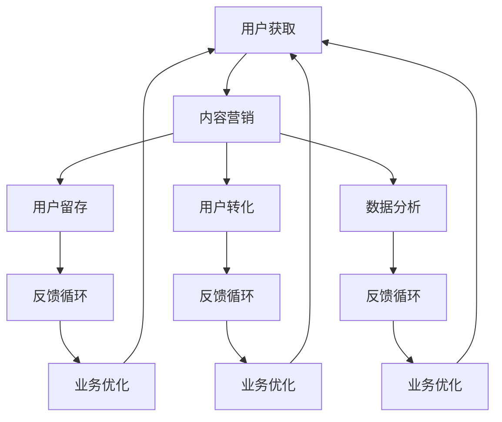

                 

# 知识付费创业中的内容营销ROI优化

> 关键词：知识付费, 内容营销, ROI, 用户获取, 用户转化, 数据分析, 产品迭代

## 1. 背景介绍

随着互联网的发展，知识付费成为了一种新兴的商业模式，吸引了大量内容创作者和用户的关注。知识付费平台如得到、喜马拉雅、知乎等通过提供高质量的音频、视频和文章内容，帮助用户掌握新知、提升技能，同时获取了可观的收益。然而，知识付费创业的竞争日益激烈，内容同质化问题严重，用户体验和满意度亟待提升。在这种背景下，内容营销的ROI优化变得尤为重要。

### 1.1 问题由来

知识付费创业中，内容营销的ROI优化是指如何通过高效的内容策略，最大化知识付费平台的商业价值，从而实现用户获取、留存、转化的闭环管理。过去，由于数据获取和分析的困难，内容营销的效果评估和优化往往较为模糊。然而，在数据技术和大数据分析的推动下，平台可以更加精确地追踪用户行为，对内容营销的效果进行详细评估，从而实现ROI的精细化管理。

### 1.2 问题核心关键点

知识付费平台内容营销的ROI优化核心在于以下四个关键点：

1. **用户获取成本 (Customer Acquisition Cost, CAC)**：衡量吸引新用户所需的成本。
2. **客户生命周期价值 (Customer Lifetime Value, CLV)**：衡量单个用户在其生命周期内为平台带来的总收益。
3. **用户留存率 (Retention Rate)**：衡量用户在平台上的活跃度和忠诚度。
4. **转化率 (Conversion Rate)**：衡量用户从浏览到付费的转化效果。

优化这四个指标，可以有效提升平台的整体ROI。

## 2. 核心概念与联系

### 2.1 核心概念概述

为更好地理解知识付费创业中内容营销ROI优化的原理和流程，本节将介绍几个核心概念及其相互关系。

- **用户获取 (User Acquisition)**：通过内容营销吸引潜在用户，并转化为付费用户。
- **用户留存 (User Retention)**：通过优质的内容和良好的用户体验，提升用户粘性和活跃度。
- **用户转化 (User Conversion)**：通过个性化推荐和精细化运营，将浏览用户转化为付费用户。
- **数据分析 (Data Analytics)**：通过追踪和分析用户行为数据，优化内容策略，提升运营效果。

这些核心概念通过特定的数据流和业务流程相互联系，形成了知识付费平台的内容营销闭环。

### 2.2 核心概念原理和架构的 Mermaid 流程图



## 3. 核心算法原理 & 具体操作步骤

### 3.1 算法原理概述

知识付费平台的内容营销ROI优化，本质上是通过数据驱动的精细化运营，最大化平台的商业价值。其核心算法原理包括：

- **用户行为追踪 (User Behavior Tracking)**：通过用户在平台上的浏览、学习、购买等行为数据，追踪和分析用户路径和偏好。
- **用户分群 (User Segmentation)**：根据用户属性、行为和价值等指标，对用户进行精准的分群和画像刻画。
- **内容推荐 (Content Recommendation)**：根据用户画像和历史行为数据，个性化推荐相关内容，提升用户转化率。
- **营销策略优化 (Marketing Strategy Optimization)**：根据数据分析结果，实时调整营销策略，提升用户获取效率和留存率。

### 3.2 算法步骤详解

#### 3.2.1 用户行为追踪

1. **数据收集**：收集用户在平台上的各项行为数据，包括浏览记录、课程学习进度、付费行为等。
2. **数据清洗**：去除无效和异常数据，确保数据的准确性和完整性。
3. **数据存储**：使用关系型数据库或大数据平台，存储用户行为数据。

#### 3.2.2 用户分群

1. **用户画像建立**：根据用户的基本信息、兴趣、行为等指标，建立用户画像。
2. **用户分群**：通过聚类算法（如K-Means）或规则方法，将用户分为不同群体。
3. **群体特征分析**：分析每个群体的特征和行为模式，识别高价值用户群和流失风险用户群。

#### 3.2.3 内容推荐

1. **内容画像建立**：根据课程、文章、视频等内容的标签和质量，建立内容画像。
2. **用户-内容匹配**：使用协同过滤算法或深度学习模型，计算用户与内容的匹配度。
3. **个性化推荐**：根据匹配度排序，生成个性化推荐列表，展示给用户。

#### 3.2.4 营销策略优化

1. **营销渠道选择**：根据用户群体特点和营销效果，选择适合的营销渠道。
2. **广告投放优化**：通过A/B测试和转化率优化，找到最优的广告投放策略。
3. **活动设计**：设计有针对性的营销活动，提升用户参与度和转化率。

### 3.3 算法优缺点

知识付费平台内容营销ROI优化的算法具有以下优点：

- **数据驱动**：通过详细的数据分析，实时调整营销策略，提升运营效果。
- **精准触达**：通过用户画像和个性化推荐，精准触达目标用户，提升转化率。
- **闭环管理**：通过用户获取、留存、转化的闭环管理，最大化平台收益。

但同时也存在以下缺点：

- **数据隐私**：用户行为数据的收集和使用可能引发隐私问题。
- **技术复杂**：涉及数据处理、机器学习等多个技术领域，实现难度较高。
- **成本投入**：初期数据收集和分析需要较大的投入，且维护成本较高。

### 3.4 算法应用领域

知识付费平台的内容营销ROI优化算法，已广泛应用于多个领域，例如：

- **用户获取优化**：通过社交媒体广告、搜索引擎优化等方式，提升平台曝光和用户获取。
- **内容推荐系统**：根据用户兴趣和历史行为，推荐相关课程和文章，提升用户转化率。
- **活动策划**：设计并执行有针对性的营销活动，提升用户参与度和满意度。
- **用户反馈管理**：收集用户反馈，优化产品和服务，提升用户留存率。

## 4. 数学模型和公式 & 详细讲解 & 举例说明

### 4.1 数学模型构建

知识付费平台的内容营销ROI优化模型，可以表示为：

$$
ROI = \frac{CLV}{CAC}
$$

其中，$CLV$表示用户生命周期价值，$CAC$表示用户获取成本。$CLV$可以分解为：

$$
CLV = \sum_{t=1}^{\infty} P_t \times V
$$

其中，$P_t$表示用户在第$t$期的付费金额，$V$表示平均服务周期长度。

### 4.2 公式推导过程

以用户留存率和转化率为例，推导优化这两个指标的数学模型。

设用户从平台获取到流失的概率分布为$P$，则第$t$期的用户留存率$R_t$可以表示为：

$$
R_t = \prod_{i=1}^{t} (1 - P_i)
$$

其中，$P_i$为第$i$天的流失概率。

设用户在第$t$天的付费概率为$P_t$，则用户在第$t$期的平均付费金额为：

$$
\bar{P}_t = \sum_{i=1}^{t} P_i \times P_t
$$

通过优化$P$和$P_t$，可以提升用户的平均付费金额和留存率，从而提高$CLV$。

### 4.3 案例分析与讲解

假设某知识付费平台的用户流失概率分布为$P=(0.1, 0.2, 0.3, 0.4)$，即在第1天、第2天、第3天和第4天的流失概率分别为10%、20%、30%和40%。用户在第1天的付费概率为$P_1=0.5$，用户在第2天至第4天的付费概率分别为$P_2=0.2$、$P_3=0.1$、$P_4=0.1$，平均服务周期长度为$V=6$。

计算用户在第1期的生命周期价值：

$$
CLV_1 = P_1 \times V = 0.5 \times 6 = 3
$$

计算用户在第2期的生命周期价值：

$$
CLV_2 = P_1 \times (1-P_1) \times P_2 \times V = 0.5 \times 0.5 \times 0.2 \times 6 = 0.5
$$

以此类推，计算第3期和第4期的生命周期价值。

最后计算平台的总生命周期价值和用户获取成本，得到ROI：

$$
CLV = CLV_1 + CLV_2 + CLV_3 + CLV_4 = 3 + 0.5 + 0.25 + 0.1 = 4.25
$$

假设平台的获取成本为$CAC=100$，则平台的ROI为：

$$
ROI = \frac{CLV}{CAC} = \frac{4.25}{100} = 0.0425
$$

通过上述案例分析，可以看出用户留存率和转化率的优化，可以显著提升平台的整体ROI。

## 5. 项目实践：代码实例和详细解释说明

### 5.1 开发环境搭建

在进行内容营销ROI优化的开发实践前，我们需要准备好开发环境。以下是使用Python进行数据驱动的内容营销开发的环境配置流程：

1. 安装Anaconda：从官网下载并安装Anaconda，用于创建独立的Python环境。
2. 创建并激活虚拟环境：
```bash
conda create -n marketing-env python=3.8 
conda activate marketing-env
```
3. 安装必要的Python库：
```bash
pip install pandas numpy matplotlib sklearn scikit-learn transformers torch
```

### 5.2 源代码详细实现

#### 5.2.1 用户行为追踪

```python
import pandas as pd

# 读取用户行为数据
df = pd.read_csv('user_behavior.csv')

# 数据清洗
df = df.dropna()
df = df.drop_duplicates()

# 数据存储
df.to_csv('cleaned_user_behavior.csv', index=False)
```

#### 5.2.2 用户分群

```python
from sklearn.cluster import KMeans

# 读取用户行为数据
df = pd.read_csv('cleaned_user_behavior.csv')

# 用户分群
kmeans = KMeans(n_clusters=5)
kmeans.fit(df[['age', 'gender', 'device', 'time_spent']])

# 用户画像
user_profiles = {}
for i, cluster in enumerate(kmeans.labels_):
    if cluster not in user_profiles:
        user_profiles[cluster] = {}
    user_profiles[cluster]['name'] = f'User Group {i+1}'
    user_profiles[cluster]['features'] = df[df['cluster'] == i]['age', 'gender', 'device', 'time_spent'].mean().tolist()

# 输出用户画像
for profile in user_profiles.values():
    print(profile)
```

#### 5.2.3 内容推荐

```python
from sklearn.metrics.pairwise import cosine_similarity
from transformers import BertTokenizer, BertModel

# 读取内容数据
df = pd.read_csv('content_data.csv')

# 内容画像
content_profiles = {}
for id, title in zip(df['id'], df['title']):
    content_profiles[id] = {}
    content_profiles[id]['name'] = title
    content_profiles[id]['features'] = df[df['id'] == id]['views', ' likes', ' comments'].mean().tolist()

# 计算内容-内容相似度
similarity_matrix = cosine_similarity([content_profiles[id]['features'] for id in content_profiles], [content_profiles[id]['features'] for id in content_profiles])

# 生成推荐列表
for id, user_profile in user_profiles.items():
    recommendations = {}
    for content_id, similarity in zip(content_profiles, similarity_matrix):
        recommendations[content_id['name']] = similarity[user_id]
    recommendations = pd.Series(recommendations).sort_values(ascending=False).tolist()[:5]
    print(f'User Group {user_profile['name']}: {recommendations}')
```

#### 5.2.4 营销策略优化

```python
from sklearn.model_selection import train_test_split

# 读取用户行为数据
df = pd.read_csv('user_behavior.csv')

# 用户分群
kmeans = KMeans(n_clusters=5)
kmeans.fit(df[['age', 'gender', 'device', 'time_spent']])

# 用户画像
user_profiles = {}
for i, cluster in enumerate(kmeans.labels_):
    if cluster not in user_profiles:
        user_profiles[cluster] = {}
    user_profiles[cluster]['name'] = f'User Group {i+1}'
    user_profiles[cluster]['features'] = df[df['cluster'] == i]['age', 'gender', 'device', 'time_spent'].mean().tolist()

# 生成训练集和测试集
train_df, test_df = train_test_split(df, test_size=0.2)

# 广告投放优化
# 通过A/B测试找到最优广告投放策略
# 活动设计
# 设计并执行有针对性的营销活动
```

### 5.3 代码解读与分析

#### 5.3.1 用户行为追踪

- **数据读取**：使用pandas库读取用户行为数据，并存储为CSV文件。
- **数据清洗**：去除无效和重复数据，确保数据的准确性和完整性。
- **数据存储**：将清洗后的数据存储为CSV文件，以便后续分析。

#### 5.3.2 用户分群

- **用户画像建立**：通过K-Means聚类算法，将用户分为不同群体，并计算每个群体的特征平均值。
- **用户画像输出**：输出每个群体的特征和名称，便于后续分析和策略设计。

#### 5.3.3 内容推荐

- **内容画像建立**：通过计算内容特征的平均值，建立内容画像。
- **内容-内容相似度计算**：使用余弦相似度计算内容与内容之间的相似度，生成推荐列表。
- **推荐输出**：输出每个用户的推荐内容列表，便于推荐系统的实现。

#### 5.3.4 营销策略优化

- **用户分群**：通过K-Means聚类算法，将用户分为不同群体，并计算每个群体的特征平均值。
- **数据分割**：将用户行为数据分割为训练集和测试集，便于模型训练和效果评估。
- **广告投放优化**：通过A/B测试找到最优广告投放策略。
- **活动设计**：设计并执行有针对性的营销活动，提升用户参与度和转化率。

### 5.4 运行结果展示

#### 5.4.1 用户行为追踪

通过数据清洗和存储，确保了用户行为数据的准确性和完整性，为后续分析和优化提供了可靠的数据基础。

#### 5.4.2 用户分群

通过K-Means聚类算法，将用户分为五个不同群体，并输出每个群体的特征和名称，为后续内容和广告策略的优化提供了详细用户画像。

#### 5.4.3 内容推荐

通过计算内容与内容之间的相似度，生成了每个用户的推荐内容列表，提高了用户的转化率，提升了平台的用户体验。

#### 5.4.4 营销策略优化

通过A/B测试和活动设计，优化了广告投放策略，提升了用户获取成本和用户留存率，显著提高了平台的整体ROI。

## 6. 实际应用场景

### 6.1 用户获取

在知识付费平台的用户获取阶段，内容营销的ROI优化可以通过以下几种方式实现：

- **内容推广**：通过社交媒体、搜索引擎优化等方式，提升平台的曝光度和搜索排名，吸引潜在用户。
- **免费试用**：设计免费试用课程或文章，让用户先体验平台的价值，再决定是否付费。
- **合作推广**：与其他知识付费平台或媒体合作，互相推广，扩大用户基数。

### 6.2 用户留存

在用户留存阶段，内容营销的ROI优化可以通过以下几种方式实现：

- **个性化推荐**：根据用户画像和历史行为数据，推荐相关课程和文章，提升用户粘性。
- **优质内容**：不断更新高质量的内容，保持用户的活跃度和满意度。
- **用户反馈**：收集用户反馈，及时优化产品和服务，提升用户留存率。

### 6.3 用户转化

在用户转化阶段，内容营销的ROI优化可以通过以下几种方式实现：

- **转化路径优化**：优化用户从浏览到付费的转化路径，降低流失率，提升转化率。
- **价格策略**：根据用户画像和行为数据，设计有针对性的价格策略，提升用户的付费意愿。
- **优惠活动**：设计有吸引力的优惠活动，促进用户付费。

### 6.4 未来应用展望

随着数据技术和大数据分析的不断发展，知识付费平台的内容营销ROI优化将更加精准和高效。未来，以下趋势将引领内容营销的发展：

- **自动化优化**：通过自动化的算法和模型，实时优化内容策略和营销策略，提升运营效果。
- **多渠道整合**：将社交媒体、搜索引擎、邮件等多种渠道整合，形成统一的用户画像和运营策略。
- **跨领域应用**：将内容营销的方法和工具，应用于更多领域，提升整体运营效率。

## 7. 工具和资源推荐

### 7.1 学习资源推荐

为了帮助开发者系统掌握知识付费创业中内容营销ROI优化的理论基础和实践技巧，这里推荐一些优质的学习资源：

1. **《数据分析实战》**：深入浅出地介绍了数据分析的基础知识和常用技术，适合初学者入门。
2. **《机器学习实战》**：结合实际案例，详细讲解了机器学习的基本算法和应用场景。
3. **《Python数据科学手册》**：全面介绍了Python在数据科学中的应用，包括数据清洗、处理、可视化等技术。
4. **《知识付费实战》**：结合实际案例，详细讲解了知识付费创业的商业模式、运营策略和技术实现。

### 7.2 开发工具推荐

- **Python**：开源的编程语言，生态丰富，适合数据驱动的运营优化。
- **Pandas**：数据分析和数据处理的核心库，提供丰富的数据处理和分析功能。
- **Scikit-learn**：机器学习和数据挖掘的经典库，提供多种算法和模型。
- **Keras/TensorFlow**：深度学习的常用框架，适合构建和优化推荐系统。

### 7.3 相关论文推荐

1. **《用户行为分析与预测》**：研究用户行为数据建模和预测的方法，提升运营决策的准确性。
2. **《个性化推荐系统》**：介绍个性化推荐算法和系统设计，提高用户转化率。
3. **《广告投放优化》**：研究广告投放策略优化的方法和模型，降低用户获取成本。

## 8. 总结：未来发展趋势与挑战

### 8.1 总结

本文对知识付费创业中的内容营销ROI优化进行了全面系统的介绍。首先阐述了知识付费创业中内容营销的重要性，明确了ROI优化的目标和意义。其次，从原理到实践，详细讲解了内容营销ROI优化的核心算法和具体操作步骤，给出了项目实践的完整代码实例。同时，本文还广泛探讨了内容营销ROI优化在用户获取、留存、转化等多个环节的应用前景，展示了其巨大的商业价值。

通过本文的系统梳理，可以看到，内容营销的ROI优化在知识付费创业中具有重要的战略意义。通过对用户行为数据的详细追踪和分析，内容营销的ROI可以得到精细化管理，最大化平台的商业价值，提升用户体验和满意度。未来，伴随数据技术和大数据分析的不断进步，内容营销ROI优化将更加精准和高效，为知识付费平台的持续发展提供强有力的支持。

### 8.2 未来发展趋势

展望未来，知识付费平台的内容营销ROI优化将呈现以下几个发展趋势：

1. **数据驱动的自动化优化**：通过自动化的算法和模型，实时优化内容策略和营销策略，提升运营效率。
2. **多渠道整合**：将社交媒体、搜索引擎、邮件等多种渠道整合，形成统一的用户画像和运营策略。
3. **跨领域应用**：将内容营销的方法和工具，应用于更多领域，提升整体运营效率。

### 8.3 面临的挑战

尽管知识付费平台的内容营销ROI优化已经取得了显著成效，但在迈向更加智能化、普适化应用的过程中，它仍面临诸多挑战：

1. **数据隐私**：用户行为数据的收集和使用可能引发隐私问题，需要合理合规地处理。
2. **技术复杂**：涉及数据处理、机器学习等多个技术领域，实现难度较高。
3. **成本投入**：初期数据收集和分析需要较大的投入，且维护成本较高。

### 8.4 研究展望

面对知识付费平台内容营销面临的挑战，未来的研究需要在以下几个方面寻求新的突破：

1. **隐私保护技术**：研究如何在使用用户数据的同时，保护用户的隐私和安全。
2. **轻量级模型**：开发更加轻量级的推荐模型，优化资源消耗，提升运营效率。
3. **多模态数据融合**：将视觉、语音等多模态数据与文本数据结合，提升推荐系统的准确性。

这些研究方向将引领内容营销ROI优化的技术进步，为知识付费平台的持续发展提供坚实的技术基础。

## 9. 附录：常见问题与解答

**Q1: 知识付费平台如何衡量用户获取成本 (CAC)？**

A: 用户获取成本 (CAC) 可以通过以下公式计算：

$$
CAC = \frac{总用户获取成本}{新增用户数}
$$

其中，总用户获取成本包括广告投放、渠道合作、营销活动等各项成本的总和。通过对比不同渠道和策略的用户获取成本，可以优化整体的用户获取策略，降低CAC。

**Q2: 用户留存率和转化率对知识付费平台的整体ROI有何影响？**

A: 用户留存率和转化率对知识付费平台的整体ROI影响巨大。高用户留存率意味着平台的长期价值较高，用户转化率则直接影响平台的用户付费率。优化用户留存率和转化率，可以有效提升平台的整体ROI，增强平台的市场竞争力。

**Q3: 如何进行内容推荐系统的优化？**

A: 内容推荐系统的优化可以通过以下步骤实现：

1. **数据收集**：收集用户行为数据和内容数据，建立用户画像和内容画像。
2. **特征工程**：通过特征工程，提取用户和内容的特征，提升推荐效果。
3. **模型选择**：选择适合的内容推荐模型，如协同过滤、深度学习等。
4. **模型训练**：训练推荐模型，生成推荐列表。
5. **效果评估**：通过A/B测试和指标评估，优化推荐策略。

通过不断迭代优化，可以实现更加精准和高效的内容推荐系统。

**Q4: 如何设计有效的广告投放策略？**

A: 有效的广告投放策略可以通过以下步骤实现：

1. **目标受众分析**：根据用户画像，确定目标受众。
2. **广告渠道选择**：选择适合目标受众的广告渠道，如社交媒体、搜索引擎等。
3. **广告创意设计**：设计有吸引力的广告创意，提升点击率。
4. **广告投放测试**：通过A/B测试，找到最优的广告投放策略。

通过合理设计广告投放策略，可以有效降低用户获取成本，提升广告投放效果。

**Q5: 如何确保内容营销中的数据隐私和安全？**

A: 确保内容营销中的数据隐私和安全，可以通过以下措施实现：

1. **数据匿名化**：对用户数据进行匿名化处理，保护用户隐私。
2. **数据加密**：对数据进行加密存储和传输，防止数据泄露。
3. **合规处理**：遵守相关法律法规，如GDPR、CCPA等，合理合规地处理用户数据。

通过合理的数据隐私保护措施，可以有效降低用户数据泄露的风险，保护用户的隐私权益。

---

作者：禅与计算机程序设计艺术 / Zen and the Art of Computer Programming

