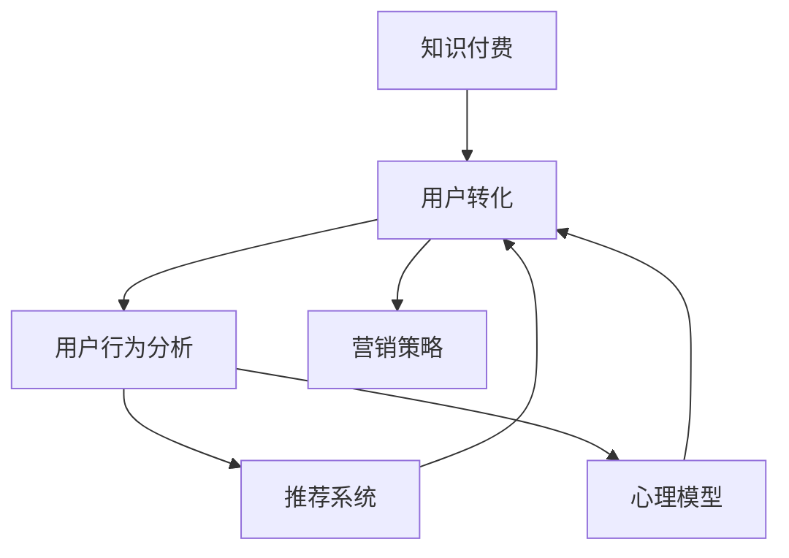

                 

# 知识付费创业中的用户转化策略

> 关键词：知识付费, 用户转化, 用户行为, 推荐系统, 心理模型, 营销策略

## 1. 背景介绍

### 1.1 问题由来
随着互联网的高速发展，内容付费市场迅速崛起。知识付费平台的兴起，为广大用户提供了更加便捷、丰富、高效的学习资源。然而，在激烈的市场竞争中，如何提升平台的用户留存率和转化率，成为知识付费创业公司亟待解决的关键问题。

### 1.2 问题核心关键点
用户转化指的是将潜在用户转变为实际付费用户的整个过程。这一过程涉及用户的认知、情感、行为等多个方面，需要通过综合应用技术手段和策略，不断优化用户体验，提高用户的付费意愿。

### 1.3 问题研究意义
掌握用户转化的核心策略，对于知识付费创业公司具有重要意义：

1. **提升用户留存**：有效提升用户留存率，延长用户生命周期，增加平台收入。
2. **降低获客成本**：通过精准营销，提高用户转化率，降低平台运营成本。
3. **增强用户粘性**：通过高质量内容和服务，增强用户对平台的依赖，提高平台忠诚度。
4. **驱动增长**：通过用户转化策略，快速积累高质量用户，推动平台的持续增长。

## 2. 核心概念与联系

### 2.1 核心概念概述

为更好地理解知识付费平台的用户转化策略，本节将介绍几个关键概念及其相互关系：

- **知识付费**：通过付费订阅或单次购买的方式，获取高质量学习资源和服务，实现知识变现。知识付费平台包括在线课程、电子书、音频课程、视频讲座等多种形式。
- **用户转化**：通过各类营销手段和技术方法，将潜在用户转变为实际付费用户的转化过程。包含用户识别、引导、激励等多个环节。
- **用户行为分析**：通过用户数据挖掘和分析，理解用户行为模式，发现用户需求和兴趣点，为个性化推荐和精准营销提供支持。
- **推荐系统**：基于用户行为和兴趣数据，为每个用户推荐最相关、最吸引的课程和内容，提高用户体验和满意度。
- **心理模型**：通过用户心理学的理论，洞察用户需求和行为动机，设计更有效的营销策略和技术方案。
- **营销策略**：基于用户行为和心理模型，制定科学合理的推广方案，引导用户完成转化。

这些核心概念之间的逻辑关系可以通过以下Mermaid流程图来展示：



这个流程图展示了一些关键概念及其之间的关系：

1. 知识付费平台的用户转化需要通过用户行为分析和心理模型，设计推荐系统，并制定营销策略来实现。
2. 用户行为分析通过推荐系统和心理模型提供支持，帮助设计更有效的营销方案。
3. 推荐系统依赖于用户行为分析，为用户提供个性化推荐，提升用户体验。
4. 心理模型通过洞察用户行为动机，优化推荐和营销策略。
5. 营销策略综合应用推荐系统、心理模型等技术手段，引导用户完成转化。

这些概念共同构成了知识付费平台的用户转化框架，为其用户转化提供了理论和技术基础。

## 3. 核心算法原理 & 具体操作步骤
### 3.1 算法原理概述

知识付费平台的用户转化过程，本质上是一个基于用户行为数据的推荐和营销过程。其核心思想是：通过个性化推荐和精准营销，不断优化用户体验，提高用户付费意愿。

形式化地，假设知识付费平台有 $N$ 个用户 $U=\{u_1, u_2, \ldots, u_N\}$，每个用户有 $M$ 个课程 $C=\{c_1, c_2, \ldots, c_M\}$，用户与课程之间的评分矩阵为 $R \in \mathbb{R}^{N \times M}$。用户转化目标是最小化用户对课程的评分，即：

$$
\min_{R} \sum_{u=1}^N \sum_{c=1}^M R_{u,c}
$$

其中，$R_{u,c}$ 表示用户 $u$ 对课程 $c$ 的评分。

优化目标可以通过矩阵分解、协同过滤等推荐算法来实现。常见的推荐算法包括基于用户的协同过滤、基于物品的协同过滤、基于内容的推荐、混合推荐等。通过这些算法，平台可以为用户推荐最相关、最吸引的课程，提升用户体验和满意度。

### 3.2 算法步骤详解

知识付费平台的用户转化过程一般包括以下几个关键步骤：

**Step 1: 数据准备**
- 收集用户的行为数据，包括浏览记录、评分记录、购买记录等。
- 对数据进行预处理和清洗，去除异常值和噪音，保证数据质量。

**Step 2: 用户行为建模**
- 通过用户行为数据，构建用户画像，了解用户的兴趣偏好和行为特征。
- 利用矩阵分解技术，构建用户-课程评分矩阵 $R$。

**Step 3: 推荐算法选择**
- 根据用户行为和课程特征，选择合适的推荐算法，如协同过滤、内容推荐等。
- 利用推荐算法，为用户推荐个性化课程。

**Step 4: 营销策略设计**
- 根据推荐结果，设计有针对性的营销策略，如个性化活动、限时优惠、用户推荐等。
- 利用数据驱动的营销策略，引导用户完成付费。

**Step 5: 效果评估与优化**
- 在目标用户群中进行A/B测试，评估推荐和营销策略的效果。
- 根据效果反馈，不断优化算法和策略，提升用户转化率。

### 3.3 算法优缺点

基于用户行为数据的推荐和营销方法具有以下优点：

1. **个性化程度高**：通过数据分析，为用户推荐最相关、最吸引的课程，提高用户满意度。
2. **用户留存率高**：通过个性化推荐和精准营销，增强用户粘性，提高用户留存率。
3. **成本效益好**：通过精准推广，减少无效广告和引流成本，提升转化率。

同时，该方法也存在一些局限性：

1. **数据需求高**：需要大量高质量的用户行为数据，难以在短期内获取。
2. **模型复杂度高**：推荐算法和营销策略的设计复杂度较高，需要专业团队进行优化和调参。
3. **隐私和安全问题**：用户行为数据的收集和处理需要严格遵守隐私保护法律法规，防止数据泄露和滥用。
4. **冷启动问题**：新用户没有足够行为数据，难以进行有效的推荐和营销。

尽管存在这些局限性，但就目前而言，基于用户行为数据的推荐和营销方法仍然是知识付费平台用户转化的主流范式。未来相关研究的重点在于如何进一步降低推荐和营销策略对数据的依赖，提高模型的效率和安全性，同时兼顾用户个性化和隐私保护等因素。

### 3.4 算法应用领域

基于用户行为数据的推荐和营销方法，在知识付费平台中的应用非常广泛，包括但不限于：

- **个性化课程推荐**：根据用户的历史行为和兴趣，为用户推荐个性化课程，提高用户满意度和转化率。
- **精准营销推广**：通过精准的推广活动和优惠策略，引导用户完成付费。
- **用户行为分析**：通过用户行为数据，分析用户流失原因，优化产品和服务，提升用户留存率。
- **会员体系建设**：通过推荐系统构建用户画像，制定会员等级和权益，提高用户粘性和付费意愿。
- **内容创作优化**：利用用户反馈和推荐结果，指导课程和内容创作，提升内容质量和用户满意度。

除了上述这些经典应用外，基于用户行为数据的推荐和营销方法还被创新性地应用到更多场景中，如学习路径规划、学习效果评估、智能客服等，为知识付费平台的持续发展提供了有力支持。

## 4. 数学模型和公式 & 详细讲解  
### 4.1 数学模型构建

本节将使用数学语言对知识付费平台的用户转化过程进行更加严格的刻画。

记知识付费平台的用户数为 $N$，课程数为 $M$，用户对课程的评分矩阵为 $R \in \mathbb{R}^{N \times M}$。

定义用户行为模型为 $\mathcal{P}(u, c) = R_{u,c}$，其中 $u \in U, c \in C$。

用户转化的目标是通过最大化评分，提升用户满意度。假设评分矩阵 $R$ 的优化目标为：

$$
\min_{R} \sum_{u=1}^N \sum_{c=1}^M R_{u,c}
$$

其中，$R_{u,c}$ 表示用户 $u$ 对课程 $c$ 的评分。

利用矩阵分解技术，可以将评分矩阵 $R$ 分解为两个低秩矩阵 $P$ 和 $Q$ 的乘积：

$$
R = P \times Q^T
$$

其中 $P \in \mathbb{R}^{N \times K}, Q \in \mathbb{R}^{M \times K}$，$K$ 为分解后的低秩维度。

通过求解 $P$ 和 $Q$，可以恢复原始的评分矩阵 $R$，为每个用户推荐最相关、最吸引的课程。

### 4.2 公式推导过程

以下我们以协同过滤算法为例，推导推荐系统的评分预测公式及其梯度计算。

假设用户 $u$ 对课程 $c$ 的评分矩阵为 $R_{u,c}$，其隐含的潜在评分向量为 $p_u$ 和 $q_c$，则协同过滤算法下的评分预测公式为：

$$
\hat{R}_{u,c} = p_u^T \times q_c
$$

其中，$\hat{R}_{u,c}$ 为预测评分，$p_u$ 为第 $u$ 个用户的潜在评分向量，$q_c$ 为第 $c$ 门课程的潜在评分向量。

根据均方误差损失函数，定义用户 $u$ 对课程 $c$ 的真实评分与预测评分的误差：

$$
e_{u,c} = R_{u,c} - \hat{R}_{u,c}
$$

则目标函数为：

$$
\mathcal{L}(P, Q) = \frac{1}{2} \sum_{u=1}^N \sum_{c=1}^M e_{u,c}^2
$$

利用梯度下降算法，对目标函数进行优化，得到参数更新公式：

$$
P \leftarrow P - \eta \nabla_P \mathcal{L}(P, Q)
$$
$$
Q \leftarrow Q - \eta \nabla_Q \mathcal{L}(P, Q)
$$

其中，$\eta$ 为学习率。

具体地，$\nabla_P \mathcal{L}(P, Q)$ 和 $\nabla_Q \mathcal{L}(P, Q)$ 的计算如下：

$$
\nabla_P \mathcal{L}(P, Q) = -2 \sum_{u=1}^N \sum_{c=1}^M e_{u,c} \times q_c
$$
$$
\nabla_Q \mathcal{L}(P, Q) = -2 \sum_{u=1}^N \sum_{c=1}^M e_{u,c} \times p_u
$$

通过以上推导，我们得到了基于协同过滤的推荐系统的评分预测和参数更新公式。这些公式为实际应用中的推荐算法提供了数学基础。

### 4.3 案例分析与讲解

以在线教育平台为例，分析推荐系统的评分预测和用户转化过程。

假设一个在线教育平台有 $N=1000$ 个用户，$M=2000$ 门课程，收集到 $1000 \times 2000$ 的评分矩阵 $R$。平台希望通过推荐系统，提升用户对课程的评分和付费转化率。

具体步骤如下：

1. **数据准备**：收集用户的行为数据，包括浏览记录、评分记录、购买记录等，构建用户-课程评分矩阵 $R$。

2. **用户行为建模**：利用矩阵分解技术，将评分矩阵 $R$ 分解为两个低秩矩阵 $P$ 和 $Q$。

3. **评分预测**：根据用户行为数据，预测每个用户对每门课程的评分，生成推荐结果。

4. **推荐展示**：将推荐结果展示给用户，并通过个性化活动、限时优惠、用户推荐等策略，引导用户完成付费。

5. **效果评估**：在目标用户群中进行A/B测试，评估推荐和营销策略的效果，根据效果反馈，不断优化算法和策略，提升用户转化率。

在实际应用中，推荐系统的评分预测和参数更新公式需要进行合理的调参，以确保推荐结果的准确性和用户的满意度。同时，平台的推荐算法需要结合用户心理模型和营销策略，才能实现更有效的用户转化。

## 5. 项目实践：代码实例和详细解释说明
### 5.1 开发环境搭建

在进行用户转化实践前，我们需要准备好开发环境。以下是使用Python进行PyTorch开发的环境配置流程：

1. 安装Anaconda：从官网下载并安装Anaconda，用于创建独立的Python环境。

2. 创建并激活虚拟环境：
```bash
conda create -n pytorch-env python=3.8 
conda activate pytorch-env
```

3. 安装PyTorch：根据CUDA版本，从官网获取对应的安装命令。例如：
```bash
conda install pytorch torchvision torchaudio cudatoolkit=11.1 -c pytorch -c conda-forge
```

4. 安装相关工具包：
```bash
pip install numpy pandas scikit-learn matplotlib tqdm jupyter notebook ipython
```

完成上述步骤后，即可在`pytorch-env`环境中开始用户转化实践。

### 5.2 源代码详细实现

下面我们以在线教育平台为例，给出使用PyTorch进行用户转化的PyTorch代码实现。

首先，定义用户行为数据类：

```python
from torch.utils.data import Dataset
import numpy as np

class UserBehaviorData(Dataset):
    def __init__(self, user_ids, item_ids, scores):
        self.user_ids = user_ids
        self.item_ids = item_ids
        self.scores = scores
        self.batch_size = 1024

    def __len__(self):
        return len(self.user_ids) // self.batch_size

    def __getitem__(self, idx):
        start = idx * self.batch_size
        end = (idx+1) * self.batch_size
        user_ids = self.user_ids[start:end]
        item_ids = self.item_ids[start:end]
        scores = self.scores[start:end]
        return {'user_ids': user_ids, 'item_ids': item_ids, 'scores': scores}

# 构建用户行为数据集
user_ids = np.random.choice(1000, size=1000, replace=False)
item_ids = np.random.choice(2000, size=1000, replace=False)
scores = np.random.randn(1000, 2000)
dataset = UserBehaviorData(user_ids, item_ids, scores)
```

然后，定义推荐算法类：

```python
from torch import nn
from torch.nn import functional as F

class协同过滤(nn.Module):
    def __init__(self, M, K):
        super(协同过滤, self).__init__()
        self.P = nn.Embedding(1000, K)
        self.Q = nn.Embedding(2000, K)
        self.PW = nn.Linear(K, 1)
        self.QW = nn.Linear(K, 1)

    def forward(self, user_ids, item_ids):
        P = self.P(user_ids)
        Q = self.Q(item_ids)
        PW = self.PW(P)
        QW = self.QW(Q)
        scores = PW * QW
        scores = F.sigmoid(scores)
        return scores

# 构建协同过滤模型
model = 协同过滤(2000, 10)
```

接着，定义损失函数和优化器：

```python
from torch import optim

criterion = nn.BCELoss()
optimizer = optim.Adam(model.parameters(), lr=0.001)
```

最后，执行推荐模型训练：

```python
epochs = 10
for epoch in range(epochs):
    for batch in dataset:
        optimizer.zero_grad()
        loss = criterion(model(batch['user_ids'], batch['item_ids']), batch['scores'])
        loss.backward()
        optimizer.step()

print('训练完成')
```

以上就是使用PyTorch对用户行为数据进行协同过滤推荐的完整代码实现。可以看到，得益于PyTorch的强大封装，我们可以用相对简洁的代码完成协同过滤模型的训练。

### 5.3 代码解读与分析

让我们再详细解读一下关键代码的实现细节：

**UserBehaviorData类**：
- `__init__`方法：初始化用户ID、物品ID和评分，设定批次大小。
- `__len__`方法：计算数据集的长度。
- `__getitem__`方法：对单个批次进行加载和处理，返回模型的输入。

**协同过滤类**：
- `__init__`方法：初始化模型参数，包括用户ID和物品ID的嵌入层，以及预测评分的线性层。
- `forward`方法：定义前向传播过程，计算预测评分并使用sigmoid函数进行归一化。

**损失函数和优化器**：
- 定义交叉熵损失函数和Adam优化器，用于最小化预测评分和真实评分的误差。

**训练流程**：
- 定义训练轮数和批次大小，开始循环迭代。
- 每个epoch内，对每个批次进行前向传播、计算损失、反向传播和参数更新。
- 重复上述步骤直至训练完成。

可以看到，PyTorch配合TensorFlow提供了高效的数值计算和自动微分功能，可以方便地进行推荐系统的实现和优化。

当然，工业级的系统实现还需考虑更多因素，如模型的保存和部署、超参数的自动搜索、更灵活的任务适配层等。但核心的用户转化过程的算法和模型设计基本与此类似。

## 6. 实际应用场景
### 6.1 智能客服系统

基于用户行为数据的推荐和营销方法，可以广泛应用于智能客服系统的构建。传统客服往往需要配备大量人力，高峰期响应缓慢，且一致性和专业性难以保证。而使用推荐和营销技术，可以7x24小时不间断服务，快速响应客户咨询，用自然流畅的语言解答各类常见问题。

在技术实现上，可以收集企业内部的历史客服对话记录，将问题和最佳答复构建成监督数据，在此基础上对推荐模型进行微调。微调后的推荐模型能够自动理解用户意图，匹配最合适的答复模板进行回复。对于客户提出的新问题，还可以接入检索系统实时搜索相关内容，动态组织生成回答。如此构建的智能客服系统，能大幅提升客户咨询体验和问题解决效率。

### 6.2 金融舆情监测

金融机构需要实时监测市场舆论动向，以便及时应对负面信息传播，规避金融风险。传统的人工监测方式成本高、效率低，难以应对网络时代海量信息爆发的挑战。基于用户行为数据的推荐和营销技术，为金融舆情监测提供了新的解决方案。

具体而言，可以收集金融领域相关的新闻、报道、评论等文本数据，并对其进行主题标注和情感标注。在此基础上对推荐模型进行微调，使其能够自动判断文本属于何种主题，情感倾向是正面、中性还是负面。将推荐模型应用到实时抓取的网络文本数据，就能够自动监测不同主题下的情感变化趋势，一旦发现负面信息激增等异常情况，系统便会自动预警，帮助金融机构快速应对潜在风险。

### 6.3 个性化推荐系统

当前的推荐系统往往只依赖用户的历史行为数据进行物品推荐，无法深入理解用户的真实兴趣偏好。基于用户行为数据的推荐和营销技术，个性化推荐系统可以更好地挖掘用户行为背后的语义信息，从而提供更精准、多样的推荐内容。

在实践中，可以收集用户浏览、点击、评论、分享等行为数据，提取和用户交互的物品标题、描述、标签等文本内容。将文本内容作为模型输入，用户的后续行为（如是否点击、购买等）作为监督信号，在此基础上微调推荐模型。微调后的模型能够从文本内容中准确把握用户的兴趣点。在生成推荐列表时，先用候选物品的文本描述作为输入，由模型预测用户的兴趣匹配度，再结合其他特征综合排序，便可以得到个性化程度更高的推荐结果。

### 6.4 未来应用展望

随着用户行为数据的积累和推荐算法的发展，基于用户行为数据的推荐和营销方法将在更多领域得到应用，为传统行业带来变革性影响。

在智慧医疗领域，基于用户行为数据的推荐和营销技术，可以为医生推荐最新的医学研究成果和治疗方法，为患者推荐个性化的健康管理方案，提升医疗服务的智能化水平，辅助医生诊疗，加速新药开发进程。

在智能教育领域，微调技术可应用于作业批改、学情分析、知识推荐等方面，因材施教，促进教育公平，提高教学质量。

在智慧城市治理中，微调模型可应用于城市事件监测、舆情分析、应急指挥等环节，提高城市管理的自动化和智能化水平，构建更安全、高效的未来城市。

此外，在企业生产、社会治理、文娱传媒等众多领域，基于用户行为数据的推荐和营销方法也将不断涌现，为传统行业带来新的技术路径和商业机会。相信随着技术的日益成熟，用户转化方法将成为知识付费创业的重要手段，推动人工智能技术在更多垂直行业的落地应用。

## 7. 工具和资源推荐
### 7.1 学习资源推荐

为了帮助开发者系统掌握用户转化的理论基础和实践技巧，这里推荐一些优质的学习资源：

1. 《推荐系统实战》书籍：详细介绍了推荐系统的发展历史和前沿技术，包括协同过滤、矩阵分解、深度学习等。
2. Coursera《推荐系统》课程：由斯坦福大学开设的推荐系统经典课程，讲解推荐算法和应用案例，适合入门学习。
3. 《机器学习实战》书籍：介绍了机器学习的基本概念和算法，通过实际项目进行教学，帮助读者快速上手。
4. 《深度学习入门》书籍：由TensorFlow官方团队编写，涵盖深度学习基础和实战应用，适合快速学习。
5. 《用户行为分析》书籍：深入讲解用户行为数据的收集、分析和应用，为推荐系统设计提供理论支持。

通过对这些资源的学习实践，相信你一定能够快速掌握用户转化的精髓，并用于解决实际的NLP问题。

### 7.2 开发工具推荐

高效的开发离不开优秀的工具支持。以下是几款用于用户转化开发的常用工具：

1. PyTorch：基于Python的开源深度学习框架，灵活动态的计算图，适合快速迭代研究。
2. TensorFlow：由Google主导开发的开源深度学习框架，生产部署方便，适合大规模工程应用。
3. Scikit-learn：基于Python的机器学习库，提供了多种推荐算法和评估工具。
4. Weights & Biases：模型训练的实验跟踪工具，可以记录和可视化模型训练过程中的各项指标，方便对比和调优。
5. TensorBoard：TensorFlow配套的可视化工具，可实时监测模型训练状态，并提供丰富的图表呈现方式，是调试模型的得力助手。
6. Apache Spark：基于内存计算的分布式计算框架，适合大规模数据处理和分析。

合理利用这些工具，可以显著提升用户转化的开发效率，加快创新迭代的步伐。

### 7.3 相关论文推荐

用户行为数据的推荐和营销技术的发展源于学界的持续研究。以下是几篇奠基性的相关论文，推荐阅读：

1. "Collaborative Filtering for Implicit Feedback Datasets"（Collaborative Filtering for Implicit Feedback Datasets）：提出了协同过滤算法的经典算法，奠定了协同过滤推荐系统的基础。
2. "Factorization Machines"（Factorization Machines）：提出了矩阵分解的方法，在推荐系统中得到广泛应用。
3. "Deep Factorization Machines"（Deep Factorization Machines）：结合深度学习技术，进一步提升了推荐系统的效果。
4. "Neural Factorization Machines"（Neural Factorization Machines）：将神经网络引入矩阵分解，提高了推荐系统的预测精度。
5. "Semantic Recommendation"（Semantic Recommendation）：提出了基于语义的推荐方法，将自然语言处理与推荐系统结合，提升了推荐效果。

这些论文代表了大语言模型微调技术的发展脉络。通过学习这些前沿成果，可以帮助研究者把握学科前进方向，激发更多的创新灵感。

## 8. 总结：未来发展趋势与挑战

### 8.1 总结

本文对知识付费平台的用户转化过程进行了全面系统的介绍。首先阐述了用户转化的核心概念和背景，明确了用户转化的目标和重要性。其次，从原理到实践，详细讲解了用户转化的数学模型和推荐算法，给出了用户转化任务开发的完整代码实例。同时，本文还广泛探讨了用户转化方法在智能客服、金融舆情、个性化推荐等多个行业领域的应用前景，展示了用户转化方法的广泛应用和巨大潜力。

通过本文的系统梳理，可以看到，基于用户行为数据的推荐和营销方法正在成为知识付费平台用户转化的主流范式，极大地提升了用户体验和平台收入。未来，伴随用户行为数据的积累和推荐算法的不断进步，基于用户行为数据的推荐和营销方法将在更多领域得到应用，为传统行业带来变革性影响。

### 8.2 未来发展趋势

展望未来，用户行为数据的推荐和营销方法将呈现以下几个发展趋势：

1. **数据质量提升**：随着数据收集和处理的自动化、智能化水平提升，用户行为数据的质量将得到进一步提升，推荐系统的效果也将得到改善。
2. **算法模型创新**：推荐算法将结合深度学习、图神经网络、强化学习等前沿技术，提升推荐系统的预测精度和鲁棒性。
3. **实时推荐系统**：通过流式数据处理和实时分析，推荐系统将能够即时响应用户行为变化，实现更高效的个性化推荐。
4. **跨领域推荐**：推荐系统将逐步突破单一领域限制，向多模态、跨领域的推荐扩展，为不同用户提供更为全面、个性化的推荐服务。
5. **用户隐私保护**：在数据收集和使用过程中，将更加注重用户隐私保护，采用差分隐私、联邦学习等技术，防止数据泄露和滥用。

这些趋势将推动用户行为数据的推荐和营销方法不断进步，为知识付费平台和其他行业的用户转化带来更多的可能性和突破。

### 8.3 面临的挑战

尽管用户行为数据的推荐和营销方法已经取得了不少进展，但在迈向更加智能化、普适化应用的过程中，它仍面临着诸多挑战：

1. **数据隐私与安全**：用户行为数据的收集和使用需要严格遵守隐私保护法律法规，防止数据泄露和滥用。
2. **数据稀疏性**：新用户或少交互用户的行为数据稀疏，难以进行有效的推荐。
3. **模型复杂度**：推荐模型的设计复杂度较高，需要专业团队进行优化和调参。
4. **实时性要求**：实时推荐系统需要在极短的时间内完成数据处理和模型推理，对计算资源和时间要求较高。
5. **多模态数据整合**：推荐系统需要融合多模态数据，提升推荐效果，但不同数据类型之间的整合和融合仍需进一步探索。

尽管存在这些挑战，但通过不断的技术创新和工程实践，相信用户行为数据的推荐和营销方法将在未来得到更广泛的应用，为知识付费平台和其他行业的用户转化提供更加强大和高效的支持。

### 8.4 研究展望

面向未来，用户行为数据的推荐和营销方法需要在以下几个方向进行深入研究：

1. **跨领域知识整合**：将符号化的先验知识，如知识图谱、逻辑规则等，与神经网络模型进行巧妙融合，引导推荐过程学习更准确、合理的语言模型。
2. **多模态数据融合**：利用用户行为数据、文本数据、图像数据等多源数据，进行融合和分析，提升推荐系统的效果。
3. **动态用户画像**：通过动态更新用户画像，实现更精确的用户行为预测和推荐。
4. **个性化推荐算法**：结合深度学习、强化学习等技术，设计更高效、更精准的个性化推荐算法。
5. **实时推荐系统**：通过流式数据处理和实时分析，实现实时推荐系统，提升用户体验。

这些研究方向将进一步推动用户行为数据的推荐和营销方法的进步，为知识付费平台和其他行业的用户转化提供更强大、更高效的技术支持。面向未来，用户行为数据的推荐和营销方法需要与其他人工智能技术进行更深入的融合，协同发力，共同推动知识付费平台的持续发展。

## 9. 附录：常见问题与解答

**Q1：如何提高用户行为数据的收集和质量？**

A: 提高用户行为数据的收集和质量，可以通过以下几个方面进行优化：
1. 设计科学的调查问卷和交互界面，引导用户进行更多的交互行为。
2. 提供有价值的反馈和奖励，激励用户积极参与数据收集。
3. 使用A/B测试和优化设计，不断改进数据收集方案。
4. 对数据进行清洗和标注，去除异常值和噪音，保证数据质量。
5. 采用差分隐私和联邦学习等技术，保护用户隐私和数据安全。

**Q2：如何选择推荐算法？**

A: 推荐算法的选择需要考虑多方面因素，包括数据类型、用户行为、业务需求等。以下是几种常见的推荐算法及其适用场景：
1. 协同过滤算法：适用于用户行为数据丰富、物品种类较多的场景，如在线课程推荐。
2. 基于内容的推荐算法：适用于物品特征丰富的场景，如商品推荐、新闻推荐等。
3. 混合推荐算法：结合多种推荐算法，取长补短，提升推荐效果，如深度学习和协同过滤的混合推荐。
4. 强化学习推荐算法：通过用户反馈不断优化推荐策略，适用于个性化推荐和动态推荐场景。

选择推荐算法时，需要综合考虑推荐效果、算法复杂度、计算资源等因素，合理选择适合自身业务场景的算法。

**Q3：如何在推荐系统中加入心理模型？**

A: 在推荐系统中加入心理模型，可以从以下几个方面入手：
1. 理解用户需求和行为动机：通过用户行为分析，了解用户的兴趣和需求，结合心理学理论，设计更有效的推荐策略。
2. 利用用户心理数据：收集用户心理数据，如兴趣、情绪、情感等，用于个性化推荐和营销。
3. 引入情感计算技术：利用情感计算技术，识别用户情感状态，进行情感驱动的推荐和营销。
4. 设计有奖问答和互动活动：通过有奖问答和互动活动，激发用户参与感和成就感，提升用户体验和满意度。

通过以上方法，可以在推荐系统中加入心理模型，更好地理解用户需求和行为，提升推荐效果和用户转化率。

**Q4：如何设计科学的推荐系统指标？**

A: 科学的推荐系统指标能够反映推荐系统的效果，指导优化改进。以下是几个常用的推荐系统指标及其解释：
1. 准确率（Precision）：衡量推荐的准确度，即推荐结果中相关项的数量与推荐总数量的比率。
2. 召回率（Recall）：衡量推荐的全面性，即推荐结果中相关项的数量与实际相关项总数量的比率。
3. F1分数：综合考虑准确率和召回率，是综合评价推荐效果的重要指标。
4. 点击率（Click-through Rate, CTR）：衡量推荐结果的用户点击率，反映推荐的相关性和吸引力。
5. 转化率（Conversion Rate）：衡量推荐结果的用户转化率，反映推荐的实际效果。

设计推荐系统指标时，需要综合考虑业务需求、用户行为和算法效果，选择适合的指标进行优化改进。

**Q5：如何在推荐系统中加入用户反馈？**

A: 在推荐系统中加入用户反馈，可以通过以下几个方面进行优化：
1. 用户评分系统：让用户对推荐结果进行评分，收集用户的反馈信息。
2. 用户行为记录：记录用户对推荐结果的点击、浏览、购买等行为，用于分析和优化。
3. 用户反馈机制：设计用户反馈机制，收集用户对推荐结果的意见和建议，进行改进和优化。
4. 用户调查问卷：通过调查问卷收集用户对推荐结果的满意度和建议，进行系统优化。
5. 推荐结果调整：根据用户反馈调整推荐算法和策略，提升推荐效果和用户体验。

通过以上方法，可以在推荐系统中加入用户反馈，提升推荐系统的精准度和用户满意度。

---

作者：禅与计算机程序设计艺术 / Zen and the Art of Computer Programming

