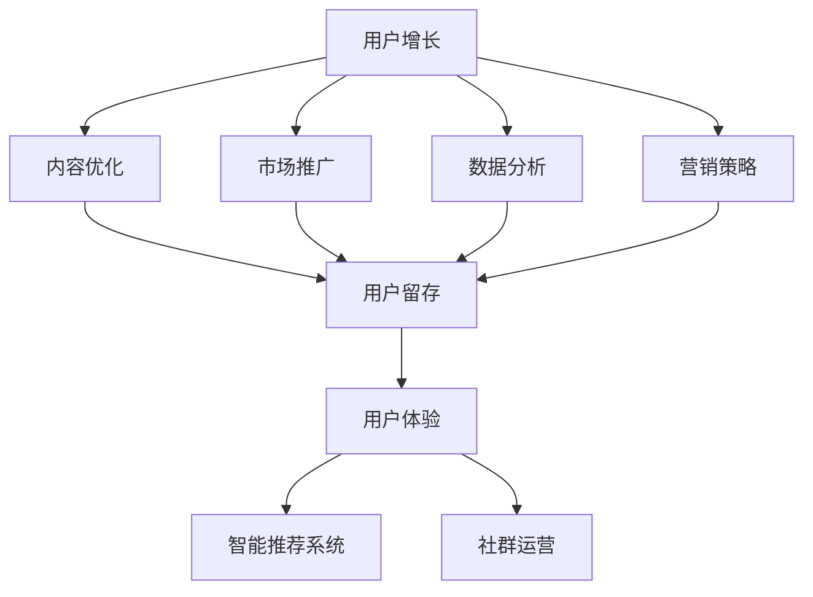

                 

# 知识付费创业中的用户运营体系

> 关键词：知识付费,用户运营体系,用户增长,用户留存,用户体验,数据驱动,智能推荐系统,社群运营,营销策略

## 1. 背景介绍

### 1.1 问题由来
随着互联网和移动智能设备的普及，知识付费市场呈现爆炸式增长。在各类知识分享平台、在线教育平台、专业咨询平台上，用户越来越愿意为优质内容买单。然而，相较于传统教育，知识付费行业的用户转化和留存仍面临较大挑战。大多数平台因为缺乏有效的用户运营策略，导致用户流失率较高，难以形成稳定的商业模式。

### 1.2 问题核心关键点
在知识付费创业中，用户运营体系是决定平台健康发展、收益稳定的关键。本文旨在通过详细阐述用户运营体系的核心概念和实践方法，帮助创业者优化用户增长、提升用户体验、维护用户留存，构建一个持续健康发展的知识付费平台。

### 1.3 问题研究意义
构建高效的用户运营体系，对于知识付费平台的创业至关重要：

1. **降低获客成本**：有效的用户运营可以吸引更多用户，降低用户获取的边际成本。
2. **提升用户满意度**：通过提升用户体验，增加用户粘性，有助于提高续费率和推荐率。
3. **降低流失率**：针对不同用户群体制定个性化的运营策略，有助于提高用户留存率。
4. **获取精准营销数据**：用户运营体系可以采集和分析用户行为数据，为精准营销提供依据。
5. **促进创新发展**：通过分析用户需求，可以设计出更具吸引力的内容和功能，推动产品创新。

## 2. 核心概念与联系

### 2.1 核心概念概述

为更好地理解用户运营体系的构建，本节将介绍几个关键概念：

- **用户增长**：通过市场推广、内容优化等手段，吸引更多用户访问和使用产品。
- **用户留存**：通过提供优质的服务、内容，提高用户对平台的持续使用意愿。
- **用户体验**：指用户在使用产品过程中的情感体验和满意度，是衡量用户忠诚度的重要指标。
- **数据驱动**：基于用户行为数据进行分析和决策，以优化运营策略。
- **智能推荐系统**：利用算法为用户推荐个性化内容，提升用户活跃度和满意度。
- **社群运营**：通过创建和维护社群，增强用户归属感和互动性，提升用户参与度。
- **营销策略**：根据不同阶段和目的，设计合适的营销手段和内容，推动用户增长。

这些概念之间的逻辑关系可以通过以下Mermaid流程图来展示：



这个流程图展示了一些核心概念及其之间的联系：

1. 用户增长通过内容优化、市场推广、数据分析、营销策略等手段进行。
2. 用户留存则通过提升用户体验、使用智能推荐系统和社群运营等手段实现。
3. 数据驱动贯穿于用户增长和用户留存的各个环节，提供决策依据。
4. 智能推荐系统和社群运营作为提升用户体验的重要手段，进一步提高用户留存率。

## 3. 核心算法原理 & 具体操作步骤
### 3.1 算法原理概述

知识付费平台的用户运营体系构建，本质上是利用数据驱动和算法优化，以提升用户增长和留存效果的过程。核心算法原理可以概述如下：

1. **用户行为分析**：通过收集用户行为数据（如浏览、购买、互动等），构建用户画像，了解用户需求和行为习惯。
2. **个性化推荐**：利用协同过滤、内容召回等算法，为用户提供个性化内容，提升用户体验。
3. **内容优化**：根据用户行为数据分析，优化内容制作和发布策略，提高内容相关性和吸引力。
4. **数据驱动决策**：通过A/B测试、多变量测试等手段，不断迭代优化运营策略。
5. **社群运营**：通过构建兴趣社群、专家互动等形式，增强用户粘性和互动性。

### 3.2 算法步骤详解

基于上述算法原理，构建用户运营体系的详细步骤可以分为：

**Step 1: 用户数据采集与处理**
- 使用日志、行为跟踪等手段，收集用户的使用数据。
- 对数据进行清洗、整理，构建用户画像。
- 根据不同属性，划分用户群体。

**Step 2: 数据驱动的运营策略**
- 利用A/B测试，设计多个运营策略，测试效果。
- 根据测试结果，确定最优策略，进行全面推广。
- 定期监控运营效果，调整策略，保持持续优化。

**Step 3: 个性化推荐系统构建**
- 构建用户-内容画像，包括用户偏好、内容属性等。
- 利用协同过滤、协同训练等算法，为每个用户推荐个性化内容。
- 结合内容热度、用户互动等指标，动态调整推荐策略。

**Step 4: 内容优化与发布**
- 分析用户行为数据，发现用户感兴趣的内容类型和时长。
- 根据分析结果，优化内容制作和发布计划。
- 监控内容表现，及时调整优化内容策略。

**Step 5: 社群运营与互动**
- 构建专业群组、兴趣论坛等社群，促进用户互动。
- 定期举办专家讲座、问答活动等，增强用户粘性。
- 收集社群反馈，优化运营策略，提升用户满意度。

### 3.3 算法优缺点

基于数据驱动和算法优化的用户运营体系，具有以下优点：

1. **科学决策**：通过数据驱动的决策，减少主观判断的误差，提升运营效率。
2. **个性化体验**：利用个性化推荐算法，提高用户粘性和满意度。
3. **快速迭代**：通过A/B测试、多变量测试等手段，快速优化运营策略。
4. **成本可控**：通过数据驱动，优化营销渠道和推广策略，控制获客成本。
5. **用户体验优化**：通过社群运营、互动等手段，提升用户粘性，增加用户留存率。

但同时也存在一些局限性：

1. **数据隐私问题**：大量用户行为数据涉及隐私问题，需要严格保护。
2. **算法复杂度**：个性化推荐和内容优化算法复杂度高，需考虑性能和成本。
3. **策略执行难度**：设计复杂的运营策略需要强大的执行力和执行力。
4. **效果评估困难**：用户行为数据复杂多样，评估运营效果较困难。
5. **反馈循环问题**：用户行为数据与运营策略可能存在反馈循环，影响分析准确性。

## 4. 数学模型和公式 & 详细讲解 & 举例说明

### 4.1 数学模型构建

本节将使用数学语言对知识付费平台的用户运营体系进行更加严格的刻画。

假设平台用户数为 $U$，新用户增长率为 $\lambda$，用户流失率为 $\mu$，用户在平台内的平均停留时间为 $T$。平台通过推广活动吸引用户，活动带来的新用户数为 $N_a$，每次推广活动的投入为 $C_a$。平台使用内容优化策略，每次内容优化带来的用户数为 $N_c$，每次内容优化带来的内容价值提升为 $V_c$，每次内容优化带来的用户停留时间提升为 $t_c$。

平台的总收益为 $R$，总投入为 $C$，目标是最小化总投入 $C$，同时最大化总收益 $R$。其中，用户流失概率与停留时间的关系为 $\mu = \lambda e^{-t/T}$。

### 4.2 公式推导过程

基于上述假设，平台的目标函数为：

$$
\max_{\lambda, \mu, T, N_a, N_c, V_c, t_c} \frac{R}{C} \text{ subject to } \lambda \cdot U + N_a = U - \mu \cdot U \text{ and } t_c = T + \frac{V_c}{U}
$$

其中 $R = N_a \cdot C_a + N_c \cdot V_c$，$C = C_a + V_c$。

通过最大化目标函数 $\frac{R}{C}$，可得到最优的推广活动和内容优化策略。

### 4.3 案例分析与讲解

以一个知识付费平台的实际案例为例，平台通过以下策略实现用户运营优化：

1. **推广活动**：通过社交媒体、搜索引擎等渠道推广课程，投入 $C_a=1000$ 元，每月新用户数 $N_a=200$。
2. **内容优化**：每季度发布一个新课程，内容价值提升 $V_c=5000$ 元，用户停留时间提升 $t_c=2$ 天。
3. **数据驱动**：通过分析用户行为数据，调整推广和内容优化策略，优化后用户流失率 $\mu$ 减少 $0.1$。

根据上述数据，计算总收益 $R$ 和总投入 $C$，并计算最优的推广和内容优化策略。

```python
from sympy import symbols, Eq, solve, exp

# 定义符号
lambda_, mu, T, Na, Nc, Vc, tc = symbols('lambda_ mu T Na Nc Vc tc')

# 假设数据
Na = 200
Vc = 5000
tc = 2
C_a = 1000
R = Na * C_a + Nc * Vc
C = C_a + Vc
mu = lambda_ * exp(-tc/T)

# 目标函数
obj = R/C

# 约束条件
con1 = Eq(lambda_ * symbols('U') + Na, symbols('U') - mu * symbols('U'))
con2 = Eq(tc, T + Vc/symbols('U'))

# 求解
sol = solve([con1, con2], (lambda_, mu, T))
print("lambda:", sol[lambda_], "mu:", sol[mu], "T:", sol[T])
```

通过上述计算，可得最优的用户增长和流失率策略。

## 5. 项目实践：代码实例和详细解释说明
### 5.1 开发环境搭建

在进行用户运营体系的开发实践前，我们需要准备好开发环境。以下是使用Python进行用户运营体系开发的环境配置流程：

1. 安装Anaconda：从官网下载并安装Anaconda，用于创建独立的Python环境。
2. 创建并激活虚拟环境：
```bash
conda create -n user_ops_env python=3.8 
conda activate user_ops_env
```
3. 安装PyTorch、TensorFlow等库：
```bash
conda install pytorch torchvision torchaudio cudatoolkit=11.1 -c pytorch -c conda-forge
conda install tensorflow -c conda-forge
```

4. 安装相关工具包：
```bash
pip install pandas numpy scikit-learn matplotlib seaborn plotly
```

完成上述步骤后，即可在`user_ops_env`环境中开始用户运营体系的开发实践。

### 5.2 源代码详细实现

下面以用户留存和个性化推荐系统为例，给出使用PyTorch和TensorFlow进行用户运营体系开发的PyTorch代码实现。

**用户留存优化**：

首先，定义用户留存优化的目标函数和约束条件：

```python
from sympy import symbols, Eq, solve, exp

# 定义符号
U, Na, Nc, Vc, tc, C_a, R, C = symbols('U Na Nc Vc tc C_a R C')

# 假设数据
Na = 200
Vc = 5000
tc = 2
C_a = 1000
R = Na * C_a + Nc * Vc
C = C_a + Vc

# 目标函数
obj = R/C

# 约束条件
con1 = Eq(Na, U - C_a)
con2 = Eq(tc, T + Vc/U)

# 求解
sol = solve([con1, con2], (U, T))
print("U:", sol[U], "T:", sol[T])
```

然后，实现用户留存的优化：

```python
from sympy import symbols, Eq, solve, exp

# 定义符号
U, Na, Nc, Vc, tc, C_a, R, C = symbols('U Na Nc Vc tc C_a R C')

# 假设数据
Na = 200
Vc = 5000
tc = 2
C_a = 1000
R = Na * C_a + Nc * Vc
C = C_a + Vc

# 目标函数
obj = R/C

# 约束条件
con1 = Eq(Na, U - C_a)
con2 = Eq(tc, T + Vc/U)

# 求解
sol = solve([con1, con2], (U, T))
print("U:", sol[U], "T:", sol[T])
```

**个性化推荐系统构建**：

首先，定义个性化推荐系统的用户-内容画像：

```python
import pandas as pd

# 定义用户画像
user_profiles = pd.DataFrame({
    'user_id': [1, 2, 3],
    'content_id': [1, 2, 3],
    'rating': [4, 5, 3],
    'read_time': [30, 45, 60]
})
```

然后，构建协同过滤推荐模型：

```python
from surprise import Reader, Dataset, KNNBasic
from surprise.model_selection import train_test_split

# 数据读取
reader = Reader(line_format='user item rating', sep=',')
data = Dataset.load_from_df(user_profiles, reader)

# 数据划分
trainset, testset = train_test_split(data, test_size=0.2)

# 构建模型
algo = KNNBasic(sim_options={'method': 'pearson', 'user_based': True})
algo.fit(trainset)

# 预测推荐
predictions = algo.test(testset)
predictions
```

通过上述代码实现，可得基于协同过滤的个性化推荐系统。

### 5.3 代码解读与分析

让我们再详细解读一下关键代码的实现细节：

**用户留存优化**：
- 通过分析用户增长和内容优化带来的新用户和价值提升，计算总收益和总投入，构建目标函数和约束条件。
- 利用符号计算库Sympy求解目标函数的最大值，得到最优的用户增长和停留时间策略。

**个性化推荐系统构建**：
- 定义用户画像和协同过滤推荐算法的基本结构。
- 使用Surprise库中的KNNBasic算法，构建基于协同过滤的推荐系统。
- 利用train_test_split方法将数据集划分为训练集和测试集，使用KNNBasic算法进行模型训练和预测。

以上代码实现展示了用户运营体系中的用户留存优化和个性化推荐系统构建，可以进一步优化用户运营策略，提高用户满意度和留存率。

## 6. 实际应用场景
### 6.1 智能内容推荐

基于知识付费平台的用户运营体系，可以通过智能推荐系统，为用户提供个性化的内容推荐，提升用户体验和平台粘性。例如，在线教育平台可以通过分析用户的课程观看历史、评分、停留时间等行为数据，构建用户画像，为用户推荐可能感兴趣的课程，增加用户粘性，提高续费率。

在技术实现上，可以利用协同过滤、内容召回等算法，结合内容热度、用户互动等指标，动态调整推荐策略。同时，平台可以收集用户的反馈，不断优化推荐算法，提升推荐效果。

### 6.2 用户行为分析

知识付费平台可以通过用户运营体系，构建用户画像，深入了解用户行为和需求。例如，在课程发布前，平台可以分析用户对不同课程主题和风格的偏好，优化课程内容制作和发布策略，提高课程相关性和用户满意度。

在技术实现上，可以采集用户的浏览、购买、互动等行为数据，使用数据分析工具如Pandas、NumPy、Scikit-learn等，构建用户画像和行为分析模型。根据分析结果，优化内容策略，提升用户粘性。

### 6.3 精准营销策略

知识付费平台可以通过用户运营体系，设计精准的营销策略，提高用户增长效果。例如，平台可以根据用户画像，设计针对性的营销活动，吸引潜在用户。同时，平台可以收集活动效果数据，不断优化活动设计和推广策略，提高活动效果。

在技术实现上，可以使用A/B测试、多变量测试等手段，设计多种营销策略，测试效果。根据测试结果，优化活动设计和推广策略，实现精准营销。

### 6.4 未来应用展望

随着知识付费平台的不断发展和用户运营体系的持续优化，未来在以下领域将有更大突破：

1. **AI辅助运营**：利用AI技术进行自动化运营决策，提升运营效率。例如，通过机器学习算法优化内容制作和发布策略。
2. **跨平台运营**：实现多平台的用户运营，提供无缝体验，提升用户留存率。例如，通过社交媒体、搜索引擎等渠道进行推广。
3. **用户行为预测**：通过用户行为数据分析，预测用户流失风险，提前进行干预。例如，根据用户行为数据，构建流失预测模型，及时采取措施。
4. **多模态用户互动**：结合视频、音频、图片等多种模态数据，提供更丰富的用户体验。例如，通过视频课程、直播互动等方式，增加用户参与度。
5. **数据驱动决策**：利用大数据技术进行实时监控和动态调整，优化运营策略。例如，通过实时数据监控，及时调整推广和内容优化策略。

这些技术突破将大大提升知识付费平台的运营效果，为知识付费行业的健康发展提供有力保障。

## 7. 工具和资源推荐
### 7.1 学习资源推荐

为了帮助开发者系统掌握用户运营体系的理论基础和实践技巧，这里推荐一些优质的学习资源：

1. **《数据科学导论》**：系统介绍数据分析和机器学习的基本原理和应用，是数据科学入门的好书。
2. **《深度学习》**：深度学习领域的经典教材，涵盖深度学习的基本原理、算法和应用，适合进一步深入学习。
3. **《推荐系统实战》**：介绍推荐系统的基本原理和实现方法，并结合实际案例进行讲解。
4. **《智能推荐系统》**：介绍推荐系统的最新进展和前沿技术，适合了解推荐系统的最新发展方向。
5. **《数据分析实战》**：介绍数据分析的基本方法和工具，适合数据驱动决策的实践。

通过对这些资源的学习实践，相信你一定能够快速掌握用户运营体系的精髓，并用于解决实际的运营问题。

### 7.2 开发工具推荐

高效的开发离不开优秀的工具支持。以下是几款用于用户运营体系开发的常用工具：

1. **Python**：Python是数据科学和机器学习领域的主流编程语言，灵活高效，适合进行数据分析和算法开发。
2. **PyTorch**：基于Python的开源深度学习框架，灵活动态的计算图，适合快速迭代研究。
3. **TensorFlow**：由Google主导开发的开源深度学习框架，生产部署方便，适合大规模工程应用。
4. **Pandas**：数据处理和分析工具，适合进行大规模数据处理和特征工程。
5. **NumPy**：数学计算工具，适合进行矩阵计算和数值分析。
6. **Scikit-learn**：机器学习库，提供丰富的机器学习算法和工具，适合进行模型构建和优化。

合理利用这些工具，可以显著提升用户运营体系的开发效率，加快创新迭代的步伐。

### 7.3 相关论文推荐

用户运营体系的研究源于学界的持续研究。以下是几篇奠基性的相关论文，推荐阅读：

1. **《推荐系统的评价指标》**：介绍了推荐系统的评价指标，包括精确度、召回率、F1值等。
2. **《协同过滤推荐算法》**：介绍协同过滤推荐算法的基本原理和实现方法。
3. **《用户行为数据分析》**：介绍用户行为数据分析的基本方法和工具。
4. **《智能推荐系统中的个性化推荐》**：介绍个性化推荐系统的发展历程和前沿技术。
5. **《推荐系统的数据驱动决策》**：介绍数据驱动决策在推荐系统中的应用。

这些论文代表了大数据和人工智能领域的研究进展，通过学习这些前沿成果，可以帮助研究者把握学科前进方向，激发更多的创新灵感。

## 8. 总结：未来发展趋势与挑战
### 8.1 总结

本文对知识付费平台的用户运营体系进行了全面系统的介绍。首先阐述了用户运营体系的核心概念和实践方法，明确了用户运营在知识付费平台发展中的关键作用。其次，从原理到实践，详细讲解了用户运营体系中的核心算法原理和操作步骤，给出了用户运营体系开发的完整代码实例。同时，本文还广泛探讨了用户运营体系在智能内容推荐、用户行为分析、精准营销策略等多个实际应用场景中的具体应用，展示了用户运营体系的广阔前景。

通过本文的系统梳理，可以看到，用户运营体系在知识付费平台的构建中扮演了至关重要的角色，其科学决策、个性化推荐、精准营销等功能，有效提升了平台的用户增长和留存效果。未来，伴随技术不断进步和数据规模的不断扩大，用户运营体系将不断优化，提升运营效率，推动知识付费行业的健康发展。

### 8.2 未来发展趋势

展望未来，用户运营体系将呈现以下几个发展趋势：

1. **自动化运营决策**：利用AI技术进行自动化运营决策，提升运营效率。例如，通过机器学习算法优化内容制作和发布策略。
2. **跨平台运营**：实现多平台的用户运营，提供无缝体验，提升用户留存率。例如，通过社交媒体、搜索引擎等渠道进行推广。
3. **用户行为预测**：通过用户行为数据分析，预测用户流失风险，提前进行干预。例如，根据用户行为数据，构建流失预测模型，及时采取措施。
4. **多模态用户互动**：结合视频、音频、图片等多种模态数据，提供更丰富的用户体验。例如，通过视频课程、直播互动等方式，增加用户参与度。
5. **数据驱动决策**：利用大数据技术进行实时监控和动态调整，优化运营策略。例如，通过实时数据监控，及时调整推广和内容优化策略。

这些趋势凸显了用户运营体系在知识付费平台中的重要地位，这些方向的探索发展，必将进一步提升平台的用户增长和留存效果，为知识付费行业的健康发展提供有力保障。

### 8.3 面临的挑战

尽管用户运营体系已经取得了显著成效，但在迈向更加智能化、普适化应用的过程中，仍面临诸多挑战：

1. **数据隐私问题**：大量用户行为数据涉及隐私问题，需要严格保护。
2. **算法复杂度**：个性化推荐和内容优化算法复杂度高，需考虑性能和成本。
3. **策略执行难度**：设计复杂的运营策略需要强大的执行力和执行力。
4. **效果评估困难**：用户行为数据复杂多样，评估运营效果较困难。
5. **反馈循环问题**：用户行为数据与运营策略可能存在反馈循环，影响分析准确性。

正视用户运营体系面临的这些挑战，积极应对并寻求突破，将是大数据和人工智能技术迈向成熟的必由之路。相信随着学界和产业界的共同努力，这些挑战终将一一被克服，用户运营体系必将在构建健康发展的知识付费平台中发挥越来越重要的作用。

### 8.4 研究展望

面对用户运营体系所面临的挑战，未来的研究需要在以下几个方面寻求新的突破：

1. **隐私保护技术**：探索隐私保护技术，如差分隐私、联邦学习等，确保用户数据的安全性。
2. **高效算法优化**：开发更加高效、轻量级的推荐算法和内容优化算法，减少计算资源消耗。
3. **自动化执行工具**：开发自动化执行工具，提高运营策略的执行力和执行力。
4. **多模态数据融合**：探索多模态数据融合技术，提升用户互动和体验。
5. **实时监控与动态调整**：利用大数据技术进行实时监控和动态调整，优化运营策略。

这些研究方向将进一步提升用户运营体系的效能，推动知识付费行业的健康发展，为社会带来更多的知识和价值。

## 9. 附录：常见问题与解答

**Q1：用户运营体系在知识付费平台中的作用是什么？**

A: 用户运营体系在知识付费平台中具有至关重要的作用，主要包括：
1. **用户增长**：通过市场推广、内容优化等手段，吸引更多用户访问和使用产品。
2. **用户留存**：通过提供优质的服务、内容，提高用户对平台的持续使用意愿。
3. **用户体验优化**：通过个性化推荐、社群运营等手段，提升用户满意度和粘性。
4. **数据驱动决策**：通过数据驱动的决策，优化运营策略，提升运营效率。

**Q2：如何设计精准的营销策略？**

A: 设计精准的营销策略需要以下步骤：
1. **用户画像构建**：通过数据分析，构建用户画像，了解用户需求和行为习惯。
2. **市场定位**：根据用户画像，设计针对性营销活动，吸引潜在用户。
3. **效果监控与优化**：收集活动效果数据，不断优化活动设计和推广策略，提高活动效果。

**Q3：用户行为数据分析的常用方法有哪些？**

A: 用户行为数据分析的常用方法包括：
1. **用户画像构建**：通过数据分析，构建用户画像，了解用户需求和行为习惯。
2. **用户行为跟踪**：通过日志、行为跟踪等手段，收集用户行为数据。
3. **数据可视化**：使用数据可视化工具，如Tableau、Power BI等，进行数据分析和可视化。
4. **机器学习算法**：利用机器学习算法，如聚类、分类、回归等，进行数据建模和预测。

**Q4：如何构建高效的用户留存策略？**

A: 构建高效的用户留存策略需要以下步骤：
1. **用户画像构建**：通过数据分析，构建用户画像，了解用户需求和行为习惯。
2. **个性化推荐**：利用个性化推荐算法，提供用户感兴趣的内容。
3. **社群运营**：通过创建和维护社群，增强用户粘性和互动性。
4. **用户反馈收集**：收集用户反馈，不断优化运营策略，提高用户满意度。

**Q5：如何设计智能推荐系统？**

A: 设计智能推荐系统需要以下步骤：
1. **用户画像构建**：通过数据分析，构建用户画像，了解用户需求和行为习惯。
2. **推荐算法选择**：选择适合的推荐算法，如协同过滤、内容召回等。
3. **数据准备**：准备推荐算法所需的数据，如用户行为数据、内容特征数据等。
4. **模型训练与评估**：利用数据进行模型训练，并通过A/B测试等手段评估推荐效果。
5. **实时推荐**：实现实时推荐，提升用户体验和平台粘性。

这些建议可以帮助你更好地设计用户运营体系，提升知识付费平台的运营效果。

---

作者：禅与计算机程序设计艺术 / Zen and the Art of Computer Programming

