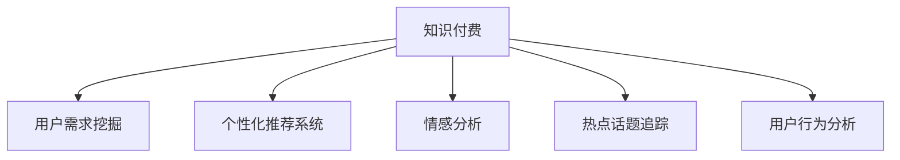

                 

# 知识付费创业中的用户需求挖掘技巧

## 1. 背景介绍

### 1.1 问题由来

在知识付费领域，成功的商业模式依赖于精准的用户需求挖掘和满足。然而，随着用户需求的多样化和变化迅速，如何高效、精确地把握用户需求，已成为知识付费创业成功的关键。传统调研方法耗时耗力、成本高昂，而利用人工智能和大数据分析，可以更快速、准确地挖掘用户需求，从而提升用户体验和增加收益。

### 1.2 问题核心关键点

用户需求挖掘的核心在于理解用户的多元需求，并为其提供个性化、有价值的内容。关键点包括：

1. **用户行为分析**：通过分析用户在平台上的行为数据（如浏览、点击、购买、评价等），可以发现用户的兴趣和偏好。
2. **情感分析**：分析用户对内容的情感反应，判断其满意度和情感倾向。
3. **热点话题追踪**：通过文本分析和大数据分析，追踪和预测热门话题和趋势，及时调整内容策略。
4. **个性化推荐**：根据用户的历史行为和偏好，提供个性化内容推荐，提升用户粘性。
5. **用户反馈分析**：收集和分析用户反馈，持续改进内容和产品，提升用户满意度。

### 1.3 问题研究意义

用户需求挖掘在知识付费创业中具有重要意义，主要体现在：

1. **提升用户体验**：通过精准的内容推荐和个性化服务，满足用户的多样化需求，提升用户满意度和忠诚度。
2. **优化资源配置**：根据用户需求，合理配置内容资源和人力资源，提高运营效率。
3. **增加收益**：精准挖掘用户需求，引导用户进行付费行为，增加平台收入。
4. **增强竞争力**：通过精准的用户需求把握，建立竞争优势，吸引更多用户和合作伙伴。
5. **推动创新**：需求挖掘数据的积累和分析，可以驱动产品创新和内容创新，不断提升服务质量。

## 2. 核心概念与联系

### 2.1 核心概念概述

本节将介绍几个关键概念及其相互关系：

- **知识付费**：指用户通过付费获取高质量知识内容的服务模式，如在线课程、电子书、音频讲座等。
- **用户需求挖掘**：指通过数据分析、人工智能等技术手段，精准捕捉和分析用户需求的过程。
- **个性化推荐系统**：利用用户历史行为和偏好，智能推荐个性化的内容或产品，提升用户满意度和粘性。
- **情感分析**：通过自然语言处理技术，分析用户对内容的情感反应，判断其满意度和情感倾向。
- **热点话题追踪**：利用大数据分析技术，追踪和预测热门话题和趋势，优化内容策略。
- **用户行为分析**：通过分析用户在平台上的行为数据，了解用户兴趣和偏好。

这些概念之间的关系可以用以下Mermaid流程图来表示：



### 2.2 核心概念原理和架构

- **知识付费模型**：知识付费服务由内容提供、平台运营、用户交互等多个模块构成。内容提供者通过平台发布高质量知识内容，平台运营负责内容的维护、推荐和用户体验优化，用户通过付费获取内容。
- **用户需求挖掘模型**：利用自然语言处理、机器学习和大数据分析等技术，从用户行为数据中挖掘用户需求，并转化为内容推荐、个性化服务等。
- **个性化推荐模型**：基于协同过滤、内容推荐、深度学习等算法，为用户提供个性化推荐服务，提升用户粘性。
- **情感分析模型**：通过文本分类、情感分类等技术，分析用户对内容的情感反应，优化内容策略。
- **热点话题模型**：通过主题模型、时序分析等技术，追踪和预测热门话题，指导内容生产。
- **用户行为分析模型**：通过数据挖掘、统计分析等技术，提取用户兴趣和偏好，指导内容推荐和运营策略。

这些模型的构建和应用，共同支撑了知识付费平台的成功运营，实现了精准的用户需求挖掘和满足。

## 3. 核心算法原理 & 具体操作步骤

### 3.1 算法原理概述

用户需求挖掘的核心算法原理主要包括以下几个方面：

1. **协同过滤算法**：通过分析用户和内容的交互数据，发现用户和内容的相似度，推荐相似用户喜欢的内容。
2. **内容推荐算法**：基于用户历史行为和偏好，利用内容标签和特征，推荐用户可能感兴趣的内容。
3. **情感分析算法**：通过文本分类技术，分析用户对内容的情感倾向，优化内容质量。
4. **热点话题追踪算法**：通过时序分析和主题模型，追踪和预测热门话题，指导内容生产。
5. **用户行为分析算法**：利用统计分析和机器学习技术，提取用户兴趣和偏好，指导内容推荐和运营策略。

这些算法通过模型训练和优化，可以高效、准确地挖掘用户需求，提供个性化服务。

### 3.2 算法步骤详解

基于上述算法原理，用户需求挖掘的具体操作步骤如下：

1. **数据采集**：收集用户行为数据（如浏览、点击、购买、评价等），平台运营数据（如内容发布、推荐、互动等），用户反馈数据等。
2. **数据预处理**：清洗和格式化数据，处理缺失值和异常值，生成特征向量。
3. **模型训练**：利用机器学习算法（如协同过滤、内容推荐、情感分析等）训练模型，并根据实际效果进行调参优化。
4. **需求挖掘**：通过模型预测和分析，挖掘用户需求，生成推荐结果、情感分析结果、热点话题结果等。
5. **反馈循环**：根据用户反馈和实际效果，持续优化模型，提升需求挖掘精度。

### 3.3 算法优缺点

用户需求挖掘算法具有以下优点：

1. **高效性**：利用机器学习和大数据分析技术，可以快速挖掘用户需求，优化运营策略。
2. **精准性**：通过多维数据综合分析，提供精准的内容推荐和个性化服务。
3. **灵活性**：算法可灵活调整，适应不同平台和用户需求变化。

同时，也存在以下缺点：

1. **数据质量依赖**：算法效果依赖于数据质量和完整性，数据偏差可能导致误判。
2. **模型复杂度**：复杂的模型训练和调参需要高水平的技术团队，成本较高。
3. **隐私问题**：用户行为数据的收集和分析可能涉及隐私问题，需严格遵守数据保护法规。
4. **动态性不足**：算法需要定期更新，以适应用户需求变化，维护成本较高。

### 3.4 算法应用领域

用户需求挖掘算法在知识付费创业中具有广泛应用，主要领域包括：

1. **在线教育平台**：分析学生学习行为和评价，提供个性化课程推荐，提升学习效果。
2. **职业培训平台**：分析用户职业需求和学习兴趣，推荐相关课程和资源，提升培训效果。
3. **职业技能认证平台**：分析用户职业兴趣和认证需求，推荐适合的认证项目，增加平台收入。
4. **健康管理平台**：分析用户健康数据和行为，提供个性化健康建议，增加用户粘性。
5. **技能培训平台**：分析用户技能需求和学习路径，推荐相关课程和资料，提升技能水平。
6. **商业咨询平台**：分析企业需求和市场趋势，提供个性化咨询服务，增加平台收益。

## 4. 数学模型和公式 & 详细讲解 & 举例说明

### 4.1 数学模型构建

用户需求挖掘的数学模型构建主要包括以下几个方面：

1. **协同过滤模型**：
   - **数据矩阵**：用户和内容的交互矩阵 $U \in R^{N \times M}$，$N$ 为用户数，$M$ 为内容数。
   - **相似度矩阵**：用户与内容的相似度矩阵 $P \in R^{N \times M}$，相似度计算方法包括余弦相似度、皮尔逊相关系数等。
   - **推荐公式**：$R_{ui} = \sum_{j=1}^{M} P_{uj} U_{ji}$，其中 $P_{uj}$ 为第 $u$ 用户对第 $j$ 内容的相似度，$U_{ji}$ 为第 $j$ 内容的评分。

2. **内容推荐模型**：
   - **特征提取**：将内容转换为向量 $X \in R^{d}$，$d$ 为特征维度。
   - **相似度计算**：计算用户 $u$ 与内容 $j$ 的相似度 $s_{uj} = \langle X_u, X_j \rangle$，其中 $\langle \cdot, \cdot \rangle$ 为内积运算。
   - **推荐公式**：$R_{uj} = \alpha s_{uj} + (1-\alpha) \bar{R}_{u} / \bar{r}$，其中 $\alpha$ 为相似度权重，$\bar{R}_{u}$ 为用户历史评分均值，$\bar{r}$ 为内容评分均值。

3. **情感分析模型**：
   - **情感词典**：利用情感词典提取文本中的情感词。
   - **情感得分计算**：计算文本情感得分 $s_{uj} = \sum_{w \in W_u} \lambda_w w_{uj}$，其中 $W_u$ 为第 $u$ 用户情感词集合，$w_{uj}$ 为情感词 $w$ 的情感得分，$\lambda_w$ 为情感词权重。

4. **热点话题模型**：
   - **时间序列分析**：利用时间序列分析技术，识别热门话题。
   - **主题模型**：利用主题模型（如LDA），识别和追踪热门话题。

5. **用户行为分析模型**：
   - **统计分析**：利用统计方法，提取用户兴趣和偏好。
   - **机器学习**：利用机器学习算法，挖掘用户需求和行为模式。

### 4.2 公式推导过程

以协同过滤算法为例，推导推荐公式：

设用户 $u$ 对内容 $j$ 的评分向量为 $U_{u} \in R^{M}$，内容 $j$ 的评分向量为 $X_{j} \in R^{d}$，用户 $u$ 与内容 $j$ 的相似度矩阵为 $P_{uj}$，则用户 $u$ 对内容 $j$ 的推荐评分 $R_{uj}$ 可以通过下式计算：

$$
R_{uj} = \sum_{i=1}^{N} P_{ui} U_{ij}
$$

在实际应用中，为了提升推荐效果，可以引入多维特征、权重调整等策略，使得推荐结果更加符合用户实际需求。

### 4.3 案例分析与讲解

以在线教育平台为例，分析用户需求挖掘的应用：

1. **数据采集**：收集学生浏览课程、点击课程、购买课程、评价课程等行为数据。
2. **数据预处理**：清洗数据，处理缺失值和异常值，生成特征向量。
3. **模型训练**：利用协同过滤算法，训练用户和内容的相似度矩阵 $P$，并根据用户历史评分生成推荐评分 $R$。
4. **需求挖掘**：根据推荐评分 $R$，生成个性化课程推荐，提升学生学习效果。
5. **反馈循环**：收集学生对推荐结果的评价和反馈，持续优化推荐算法，提升推荐精度。

## 5. 项目实践：代码实例和详细解释说明

### 5.1 开发环境搭建

在进行用户需求挖掘实践前，我们需要准备好开发环境。以下是使用Python进行PyTorch和Scikit-learn开发的环境配置流程：

1. 安装Anaconda：从官网下载并安装Anaconda，用于创建独立的Python环境。

2. 创建并激活虚拟环境：
```bash
conda create -n knowledge-payment python=3.8 
conda activate knowledge-payment
```

3. 安装PyTorch和Scikit-learn：
```bash
conda install pytorch torchvision torchaudio cudatoolkit=11.1 -c pytorch -c conda-forge
conda install scikit-learn
```

4. 安装必要的工具包：
```bash
pip install numpy pandas matplotlib seaborn jupyter notebook
```

完成上述步骤后，即可在`knowledge-payment`环境中开始用户需求挖掘实践。

### 5.2 源代码详细实现

这里我们以在线教育平台为例，给出使用PyTorch和Scikit-learn对协同过滤模型进行实现的PyTorch代码：

```python
import torch
import numpy as np
from sklearn.metrics.pairwise import cosine_similarity

# 生成随机用户和内容评分数据
N = 100  # 用户数
M = 50  # 内容数
X = np.random.randn(N, M)  # 内容评分矩阵
U = np.random.randn(N, M)  # 用户评分矩阵

# 计算用户与内容的相似度矩阵
P = cosine_similarity(X, U)

# 计算推荐评分
R = P.dot(U)

# 输出前10个推荐评分
print(R[:10])
```

这个代码实现了基于协同过滤的推荐评分计算。其中，`cosine_similarity`函数用于计算用户与内容的相似度矩阵 $P$，通过矩阵乘法计算推荐评分 $R$。

### 5.3 代码解读与分析

让我们再详细解读一下关键代码的实现细节：

**协同过滤模型代码**：
- `cosine_similarity`函数：利用余弦相似度计算用户与内容的相似度矩阵 $P$。
- 矩阵乘法：通过 $P$ 和 $U$ 的乘积计算推荐评分 $R$。

**用户行为数据**：
- `X` 和 `U` 表示用户和内容的评分矩阵，其中的随机数生成可以根据实际数据进行替换。

**推荐评分输出**：
- `R[:10]` 表示输出前10个推荐评分，可以根据实际需求调整输出数量。

## 6. 实际应用场景

### 6.1 智能推荐系统

基于用户需求挖掘的智能推荐系统广泛应用于各类知识付费平台。通过分析用户行为数据，平台可以提供个性化课程推荐，提升用户学习体验和粘性，增加用户注册和付费率。

在技术实现上，可以采用协同过滤、内容推荐、情感分析等多种算法，全面挖掘用户需求，提供精准的推荐服务。例如，在课程推荐中，可以结合用户的浏览记录、点击行为、学习进度等数据，综合计算推荐评分，生成个性化的课程推荐列表。

### 6.2 用户行为分析

通过用户行为分析，平台可以了解用户的学习偏好和行为模式，优化内容生产、推荐策略和运营活动。例如，通过分析用户的访问路径、学习时长、评价内容等数据，平台可以识别出热门课程和话题，优化课程安排和内容推荐，提升用户满意度和忠诚度。

### 6.3 情感分析与反馈优化

利用情感分析技术，平台可以实时监测用户对课程的情感倾向，优化课程质量和内容策略。例如，通过分析用户对课程的评价和评论，平台可以识别出用户对课程的满意度和不满意度，及时调整课程内容和推荐算法，提升用户满意度。

### 6.4 未来应用展望

随着用户需求的多样化和复杂化，基于用户需求挖掘的智能推荐系统将在知识付费领域发挥越来越重要的作用。未来，随着技术的进步和数据的积累，用户需求挖掘将更加精准和高效，推动知识付费行业向智能化、个性化方向发展。

在实际应用中，知识付费平台可以通过结合大数据分析、深度学习、自然语言处理等技术，进一步提升推荐精度和用户体验，实现更高水平的智能推荐服务。

## 7. 工具和资源推荐

### 7.1 学习资源推荐

为了帮助开发者系统掌握用户需求挖掘的理论基础和实践技巧，这里推荐一些优质的学习资源：

1. **《推荐系统实战》**：详细介绍了协同过滤、内容推荐等推荐算法的实现，适合初学者和实践者。
2. **《自然语言处理入门》**：介绍了情感分析、主题模型等自然语言处理技术，适合了解用户行为分析。
3. **Coursera《机器学习》**：由斯坦福大学开设的机器学习课程，涵盖多种推荐算法和情感分析技术，适合系统学习。
4. **Kaggle竞赛**：参与推荐系统、情感分析等竞赛项目，实战演练用户需求挖掘技术。
5. **HuggingFace官方文档**：详细介绍了Transformer、BERT等模型的应用，适合参考和学习。

通过对这些资源的学习实践，相信你一定能够快速掌握用户需求挖掘的精髓，并用于解决实际的NLP问题。

### 7.2 开发工具推荐

高效的开发离不开优秀的工具支持。以下是几款用于用户需求挖掘开发的常用工具：

1. **PyTorch**：基于Python的开源深度学习框架，灵活的计算图设计，适合快速迭代研究。
2. **Scikit-learn**：基于Python的机器学习库，提供了多种算法和工具，适合数据处理和模型训练。
3. **TensorFlow**：由Google主导开发的深度学习框架，生产部署方便，适合大规模工程应用。
4. **Jupyter Notebook**：交互式的Python开发环境，适合数据探索和模型实验。
5. **Google Colab**：谷歌提供的在线Jupyter Notebook环境，免费提供GPU/TPU算力，适合快速实验。

合理利用这些工具，可以显著提升用户需求挖掘任务的开发效率，加快创新迭代的步伐。

### 7.3 相关论文推荐

用户需求挖掘在学界和业界得到了广泛研究。以下是几篇奠基性的相关论文，推荐阅读：

1. **《协同过滤推荐系统》**：详细介绍了协同过滤算法的实现和优化，适合入门学习。
2. **《内容推荐系统》**：介绍了内容推荐算法的原理和应用，适合了解推荐系统的基本原理。
3. **《情感分析综述》**：综述了情感分析技术的进展和应用，适合了解情感分析的基础知识。
4. **《主题模型综述》**：综述了主题模型的进展和应用，适合了解文本分析和自然语言处理的基本原理。
5. **《用户行为分析综述》**：综述了用户行为分析技术的进展和应用，适合了解用户行为分析的基础知识。

这些论文代表了大语言模型微调技术的发展脉络。通过学习这些前沿成果，可以帮助研究者把握学科前进方向，激发更多的创新灵感。

## 8. 总结：未来发展趋势与挑战

### 8.1 总结

本文对基于用户需求挖掘的推荐系统进行了全面系统的介绍。首先阐述了知识付费领域对用户需求挖掘的重要性，明确了挖掘用户需求在提升用户体验和增加收益方面的独特价值。其次，从原理到实践，详细讲解了推荐系统的数学模型和算法实现，提供了具体的代码实现和解释。同时，本文还探讨了推荐系统在知识付费平台中的实际应用，展示了推荐范式的巨大潜力。

通过本文的系统梳理，可以看到，用户需求挖掘在知识付费创业中具有重要意义，必将推动知识付费平台向智能化、个性化方向发展。未来，随着技术的进步和数据的积累，推荐系统将不断优化，为用户提供更高水平的服务体验。

### 8.2 未来发展趋势

展望未来，用户需求挖掘和推荐系统将呈现以下几个发展趋势：

1. **多模态数据融合**：结合文本、图像、音频等多种模态数据，提升推荐精度和用户体验。
2. **实时推荐系统**：利用流式数据处理技术，实现实时推荐，提升推荐时效性。
3. **个性化推荐算法**：结合深度学习和强化学习等技术，提升推荐算法的精准性和个性化程度。
4. **用户行为分析**：利用多维数据综合分析，识别用户需求和行为模式，优化推荐策略。
5. **情感分析**：利用情感分类技术，优化用户反馈机制，提升用户满意度。
6. **隐私保护**：在数据收集和分析过程中，严格遵守数据保护法规，保护用户隐私。

这些趋势凸显了用户需求挖掘和推荐系统的广阔前景，将不断推动知识付费平台向智能化、个性化方向发展，提升用户体验和运营效率。

### 8.3 面临的挑战

尽管用户需求挖掘和推荐系统已经取得了显著成效，但在迈向更加智能化、普适化应用的过程中，仍面临诸多挑战：

1. **数据质量问题**：数据缺失、偏差、噪声等问题会影响推荐效果，需采用数据清洗、特征工程等技术手段进行优化。
2. **模型复杂度**：推荐系统涉及多种算法和模型，模型复杂度高，需要高水平的技术团队进行调参和优化。
3. **隐私保护**：用户行为数据的收集和分析可能涉及隐私问题，需严格遵守数据保护法规，保护用户隐私。
4. **实时性要求**：实时推荐系统需处理大量流式数据，实时计算推荐结果，对算力和资源要求较高。
5. **用户需求多样性**：用户需求多样且变化迅速，推荐系统需灵活调整策略，提升个性化推荐效果。

### 8.4 研究展望

面对用户需求挖掘和推荐系统所面临的挑战，未来的研究需要在以下几个方面寻求新的突破：

1. **数据采集和处理**：采用先进的数据采集和清洗技术，确保数据质量和完整性，提升推荐系统效果。
2. **模型优化**：优化推荐算法和模型，提升推荐精度和个性化程度，降低模型复杂度。
3. **隐私保护**：在数据收集和分析过程中，严格遵守数据保护法规，保护用户隐私。
4. **实时推荐技术**：采用流式数据处理和实时计算技术，提升推荐系统实时性和用户体验。
5. **多模态数据融合**：结合多模态数据，提升推荐系统的全面性和精准性，优化用户体验。
6. **个性化推荐算法**：结合深度学习和强化学习等技术，提升推荐算法的精准性和个性化程度。

这些研究方向将不断推动用户需求挖掘和推荐系统的发展，提升知识付费平台的智能化和个性化水平，为用户带来更好的服务体验。

## 9. 附录：常见问题与解答

**Q1：协同过滤算法和内容推荐算法有什么区别？**

A: 协同过滤算法是基于用户和内容的交互数据，通过计算相似度推荐相似用户喜欢的内容。内容推荐算法则基于用户历史行为和内容特征，利用机器学习算法推荐用户可能感兴趣的内容。协同过滤算法适用于数据量较小、用户较少的平台，内容推荐算法适用于数据量较大、用户较多的平台。

**Q2：情感分析技术在推荐系统中有何应用？**

A: 情感分析技术可以分析用户对内容的情感反应，优化内容策略和推荐算法。通过情感分析，平台可以识别出用户对内容的满意度和情感倾向，及时调整推荐内容和策略，提升用户满意度。例如，在课程推荐中，可以根据用户对课程的情感评分，调整课程推荐列表。

**Q3：用户行为分析数据如何收集和处理？**

A: 用户行为数据可以通过网站日志、应用数据等途径收集。数据收集后，需要进行清洗和格式化，处理缺失值和异常值，生成特征向量。常见的特征包括浏览记录、点击行为、学习进度、评价内容等。

**Q4：如何优化协同过滤算法的效果？**

A: 协同过滤算法可以通过以下方法优化：
1. 数据预处理：清洗和格式化数据，处理缺失值和异常值。
2. 特征工程：提取用户和内容的特征，提升相似度计算的准确性。
3. 算法优化：选择适合相似度计算的算法（如余弦相似度、皮尔逊相关系数等），调整相似度权重。
4. 实时更新：利用流式数据处理技术，实时更新用户和内容评分，提升推荐效果。

**Q5：推荐系统如何保证推荐精度和个性化程度？**

A: 推荐系统可以通过以下方法保证推荐精度和个性化程度：
1. 多维特征提取：结合用户行为数据和内容特征，提升推荐精度。
2. 个性化推荐算法：利用深度学习、协同过滤等算法，提升个性化推荐效果。
3. 实时推荐系统：利用流式数据处理技术，实时计算推荐结果，提升推荐时效性。
4. 动态策略调整：根据用户反馈和实际效果，动态调整推荐策略，优化推荐效果。

这些方法可以综合应用，提升推荐系统的精度和个性化程度，满足用户多样化需求。

---

作者：禅与计算机程序设计艺术 / Zen and the Art of Computer Programming

