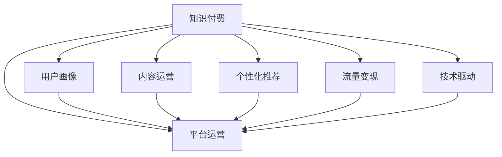

                 

# 知识付费创业的商业模式优化策略

> 关键词：知识付费, 商业模式, 用户画像, 内容运营, 盈利模式, 个性化推荐, 流量变现, 技术驱动

## 1. 背景介绍

### 1.1 问题由来
随着互联网技术的迅猛发展，知识付费逐渐成为越来越多人的选择。无论是专业人士的深度剖析、教育机构的优质课程，还是个人提升的实用技巧，都可以通过知识付费获得。在移动支付和短视频等新兴技术的推动下，知识付费行业进入高速发展期。然而，竞争日益激烈、内容同质化问题突出，如何提升知识付费平台的价值，提升用户体验，成为亟需解决的问题。

### 1.2 问题核心关键点
当前知识付费行业面临着诸多挑战：
- 内容质量参差不齐。许多平台为了获取流量，吸引用户，引入大量低质量内容，影响了用户体验和平台的品牌声誉。
- 用户体验有待提升。付费内容难以满足个性化需求，用户容易产生倦怠感。
- 盈利模式单一。主要依靠付费会员和广告分成，随着竞争加剧，市场份额和盈利空间逐渐缩小。
- 运营成本高昂。内容制作、用户获取、平台运营等环节需要大量的资金投入，增加了平台的运营压力。

### 1.3 问题研究意义
提升知识付费平台的商业模式，对于保持行业竞争力和持续创新具有重要意义：
- 提升内容质量和用户体验，提高用户粘性和忠诚度。
- 丰富盈利模式，实现多元化和精准化的收入来源。
- 降低运营成本，提高平台整体的运营效率和盈利能力。
- 驱动技术创新，不断探索新型的知识服务模式，吸引更多用户。

## 2. 核心概念与联系

### 2.1 核心概念概述

为更好地理解知识付费商业模式的优化策略，本节将介绍几个密切相关的核心概念：

- 知识付费：一种通过付费获取知识或提升技能的服务模式，常见形式包括订阅服务、单次付费课程、会员专享内容等。
- 平台运营：包括用户管理、内容管理、流量获取、用户留存等环节。
- 用户画像：通过数据分析，对用户行为和特征进行描绘，以便更精准地提供个性化服务。
- 内容运营：内容推荐、内容制作、内容营销等环节，旨在提升内容吸引力和用户黏性。
- 个性化推荐：利用机器学习和数据挖掘技术，根据用户兴趣和行为推荐相关内容。
- 流量变现：通过用户获取和留存，提升平台流量，实现多元化盈利模式，如广告分成、增值服务、会员服务等。
- 技术驱动：运用大数据、人工智能等技术，提升运营效率和服务质量。

这些核心概念之间的逻辑关系可以通过以下Mermaid流程图来展示：



这个流程图展示的知识付费平台运营框架，将各个环节串联起来，形成了一个完整的商业模式生态。

## 3. 核心算法原理 & 具体操作步骤
### 3.1 算法原理概述

知识付费平台的商业模式优化，本质上是一个数据驱动的运营优化过程。其核心思想是：通过对用户行为和内容特征的数据分析，构建精准的用户画像，设计个性化的推荐系统，利用技术手段提升运营效率和用户体验，从而实现平台流量和盈利的最大化。

形式化地，设知识付费平台有 $N$ 个用户，每个用户对 $M$ 个内容项 $c_1, c_2, ..., c_M$ 的评分 $s_{i,j} \in [1, 5]$，评分矩阵为 $S \in \mathbb{R}^{N \times M}$。设内容项的特征向量为 $X \in \mathbb{R}^{M \times D}$，用户特征向量为 $U \in \mathbb{R}^{N \times D}$。设推荐算法为 $F: \mathbb{R}^{N \times D} \times \mathbb{R}^{M \times D} \rightarrow \mathbb{R}^{N \times M}$。则推荐系统的目标是最大化用户对推荐内容的满意度：

$$
\maximize \quad \sum_{i=1}^N \sum_{j=1}^M u_i F(c_j, U_i, X_j)
$$

其中 $u_i$ 为用户 $i$ 的满意度系数，通常设定为 $s_{i,j}$。

### 3.2 算法步骤详解

基于上述原理，知识付费平台的商业模式优化主要包括以下几个关键步骤：

**Step 1: 用户画像构建**
- 收集用户注册信息、历史行为数据、社交网络信息等，构建用户画像。
- 使用聚类算法如K-Means、LDA等，对用户进行标签划分，得到用户特征向量 $U$。

**Step 2: 内容特征提取**
- 对每个内容项 $c_j$，提取文本摘要、标签、作者信息等特征，构建内容特征向量 $X_j$。
- 使用特征工程技术，将文本特征转化为向量表示，如TF-IDF、Word2Vec等。

**Step 3: 个性化推荐算法选择**
- 选择适合的推荐算法，如协同过滤、基于内容的推荐、深度学习等。
- 针对不同场景，选择合适的推荐算法，如冷启动场景可使用基于内容的推荐，个性化推荐场景可使用协同过滤。

**Step 4: 模型训练与评估**
- 使用推荐系统算法，对用户特征 $U$ 和内容特征 $X$ 进行训练，得到推荐模型 $F$。
- 在测试集上评估推荐模型的性能，常用指标包括准确率、召回率、F1分数等。

**Step 5: 流量变现策略**
- 根据用户行为数据，设计个性化广告投放策略，提高广告转化率。
- 开发增值服务，如专家答疑、社区交流、证书认证等，提升用户价值。
- 推出会员制服务，提供更优质、更丰富的内容，同时增加用户粘性和付费意愿。

**Step 6: 技术优化与持续迭代**
- 使用机器学习模型进行A/B测试，不断优化推荐算法和流量变现策略。
- 根据用户反馈和行为数据，持续迭代优化算法和运营策略。

### 3.3 算法优缺点

基于个性化推荐的知识付费平台商业模式，具有以下优点：
1. 提升用户体验。个性化推荐满足用户多样化需求，提高用户粘性和满意度。
2. 提高平台流量和收入。精准推荐吸引更多用户，实现流量变现和会员收入的增长。
3. 降低运营成本。优化算法可减少内容制作和用户获取成本，提升平台整体运营效率。

同时，该方法也存在以下局限性：
1. 数据隐私问题。用户数据的收集和使用可能引发隐私泄露和伦理问题。
2. 数据偏差和多样性不足。用户数据的不充分和偏差可能导致推荐结果的偏差，影响用户体验。
3. 算法复杂度。个性化推荐算法模型复杂，需要大量的计算资源和时间成本。
4. 动态性挑战。用户行为和兴趣随时间变化，推荐系统需要持续更新和优化。

尽管存在这些局限性，但就目前而言，基于个性化推荐的知识付费平台商业模式仍然是最主流的运营方式。未来相关研究的重点在于如何进一步降低推荐算法的计算复杂度，提高推荐系统的实时性和可解释性，同时兼顾用户隐私和数据安全性等因素。

### 3.4 算法应用领域

基于个性化推荐的知识付费商业模式，在诸多领域得到了广泛的应用，例如：

- 教育培训：根据学生的学习进度和兴趣，推荐个性化的课程和学习资料。
- 健身健康：根据用户的健身数据和偏好，推荐个性化的健身计划和指导。
- 旅游出行：根据用户的旅行历史和偏好，推荐个性化的旅行线路和景点。
- 财经资讯：根据用户的投资兴趣和行为，推荐个性化的财经文章和资讯。
- 娱乐文化：根据用户的娱乐偏好，推荐个性化的电影、音乐、书籍等内容。

除了上述这些经典应用外，基于个性化推荐的知识付费商业模式还不断拓展到更多场景中，如理财规划、心理辅导、情感生活等，为各行各业带来了新的发展机遇。

## 4. 数学模型和公式 & 详细讲解 & 举例说明

### 4.1 数学模型构建

本节将使用数学语言对基于个性化推荐的知识付费平台商业模式进行更加严格的刻画。

设用户 $i$ 对内容项 $j$ 的评分矩阵为 $S \in \mathbb{R}^{N \times M}$，用户特征向量为 $U \in \mathbb{R}^{N \times D}$，内容项特征向量为 $X \in \mathbb{R}^{M \times D}$。推荐模型 $F: \mathbb{R}^{N \times D} \times \mathbb{R}^{M \times D} \rightarrow \mathbb{R}^{N \times M}$。推荐系统模型的目标函数为：

$$
\maximize \quad \sum_{i=1}^N \sum_{j=1}^M u_i F(c_j, U_i, X_j)
$$

其中 $u_i$ 为用户 $i$ 的满意度系数，通常设定为 $s_{i,j}$。

### 4.2 公式推导过程

以下我们以协同过滤算法为例，推导推荐系统模型的具体实现。

协同过滤算法基于用户和内容之间的隐式反馈矩阵 $S$，通过构建用户-用户相似矩阵 $V \in \mathbb{R}^{N \times N}$ 和内容-内容相似矩阵 $H \in \mathbb{R}^{M \times M}$，进行相似度计算。推荐模型为：

$$
F(u_i, h_j) = \sum_{k=1}^D v_{i,k} h_{j,k} / \sqrt{(v_{i,k}^2 + h_{j,k}^2)}
$$

其中 $v_{i,k}$ 和 $h_{j,k}$ 分别为用户 $i$ 和内容 $j$ 的特征向量在维度 $k$ 上的值。

对于每个用户 $i$，推荐模型为：

$$
\hat{y}_i = \sum_{j=1}^M v_{i,j} h_{j,j} / \sqrt{\sum_{j=1}^M (v_{i,j}^2 + h_{j,j}^2)}
$$

其中 $v_{i,j}$ 为 $i$ 和 $j$ 的相似度，$h_{j,j}$ 为 $j$ 的特征向量在 $j$ 维度的值。

最终，推荐模型输出 $\hat{y}_i$ 为用户对内容 $j$ 的预测评分，根据 $\hat{y}_i$ 排序得到推荐列表。

### 4.3 案例分析与讲解

以一个简单的知识付费平台为例，分析其个性化推荐系统的实现：

1. **数据收集**：平台收集用户注册信息、购买记录、学习进度、阅读时长等数据。
2. **用户画像构建**：使用K-Means算法，将用户分为兴趣相似的用户组。
3. **内容特征提取**：提取课程标题、作者、课程描述等文本信息，使用TF-IDF进行向量化。
4. **相似度计算**：计算用户之间的相似度和内容之间的相似度，构建相似矩阵 $V$ 和 $H$。
5. **推荐模型训练**：使用协同过滤算法，训练推荐模型 $F$。
6. **个性化推荐**：根据用户画像和内容特征，进行个性化推荐，提升用户体验。

通过上述流程，可以构建一个高效的知识付费平台推荐系统，提高平台的用户粘性和收入。

## 5. 项目实践：代码实例和详细解释说明
### 5.1 开发环境搭建

在进行知识付费平台推荐系统开发前，我们需要准备好开发环境。以下是使用Python进行Scikit-learn开发的推荐系统环境配置流程：

1. 安装Anaconda：从官网下载并安装Anaconda，用于创建独立的Python环境。

2. 创建并激活虚拟环境：
```bash
conda create -n recsys python=3.8 
conda activate recsys
```

3. 安装Scikit-learn：
```bash
conda install scikit-learn
```

4. 安装numpy、pandas、matplotlib等工具包：
```bash
pip install numpy pandas matplotlib scikit-learn scikit-mix
```

5. 下载和准备数据集：
```bash
wget https://archive.ics.uci.edu/ml/machine-learning-databases/datasets/user-item-ratings.txt.gz
gunzip user-item-ratings.txt.gz
```

完成上述步骤后，即可在`recsys`环境中开始推荐系统开发。

### 5.2 源代码详细实现

下面我们以协同过滤算法为例，给出使用Scikit-learn库进行推荐系统的PyTorch代码实现。

首先，定义推荐系统类：

```python
from sklearn.metrics.pairwise import cosine_similarity
import numpy as np

class RecommendationSystem:
    def __init__(self, user_num, item_num, sim_matrix=None, data=None):
        self.user_num = user_num
        self.item_num = item_num
        self.sim_matrix = sim_matrix
        self.data = data
        self.cf = None
    
    def train(self):
        self.cf = cosine_similarity(self.data)
        self.cf = np.dot(self.cf, self.cf)
    
    def predict(self, user_idx, top_k=10):
        user_similarity = self.cf[user_idx, :]
        recommendation_scores = np.dot(user_similarity, self.cf[:, self.item_num-10:])
        top_k_idx = np.argsort(recommendation_scores)[::-1][0:top_k]
        return top_k_idx
```

然后，定义数据准备和模型训练函数：

```python
def load_data():
    with open('user-item-ratings.txt', 'r') as f:
        data = []
        for line in f:
            user, item, rating = map(int, line.strip().split(' '))
            data.append([user-1, item-1, rating])
        return np.array(data)

def prepare_data(data, user_num, item_num):
    user_cnt = data[:, 0].unique().shape[0]
    item_cnt = data[:, 1].unique().shape[0]
    data = data[:, 1:3]  # 去掉评分值
    return data, user_cnt, item_cnt

def train_model(data, user_num, item_num):
    rec_sys = RecommendationSystem(user_num, item_num)
    rec_sys.train()
    return rec_sys

# 加载数据
data = load_data()
data, user_num, item_num = prepare_data(data, user_num, item_num)

# 训练模型
rec_sys = train_model(data, user_num, item_num)

# 测试模型
user_idx = 0
top_k_idx = rec_sys.predict(user_idx, top_k=10)
print(f'推荐内容ID：{top_k_idx}')
```

以上代码实现了基于协同过滤算法的推荐系统，并给出具体的推荐结果。

### 5.3 代码解读与分析

让我们再详细解读一下关键代码的实现细节：

**RecommendationSystem类**：
- `__init__`方法：初始化用户数量、物品数量、相似度矩阵和数据集。
- `train`方法：计算用户和物品之间的余弦相似度矩阵，并进行归一化处理。
- `predict`方法：根据用户ID，计算并返回用户对物品的推荐评分。

**load_data函数**：
- 加载数据集，并将其转换为NumPy数组。

**prepare_data函数**：
- 计算用户和物品的个数，去掉评分值，返回处理后的数据集。

**train_model函数**：
- 创建RecommendationSystem实例，训练模型，并返回训练后的推荐系统。

通过上述代码，可以构建一个基本的推荐系统模型，用于用户个性化推荐。在实际应用中，还需要进一步优化算法，如使用多维特征、采用模型集成等方法，以提升推荐系统的性能。

## 6. 实际应用场景
### 6.1 智能教育平台

智能教育平台可以利用推荐系统，提供个性化的课程推荐和内容资源，提高教育效果和用户体验。平台可以根据学生的学习进度、成绩和兴趣，动态调整推荐内容，帮助学生更高效地学习。例如，一个智能教育平台可以提供以下功能：

- 智能推荐课程：根据学生的学习进度和兴趣，推荐适合的学习资源和课程。
- 个性化作业推荐：根据学生的作业完成情况，推荐针对性的练习和习题。
- 智能答疑系统：根据学生的问题，推荐相似问题的解答和解释。

通过这些功能，智能教育平台可以提升学生的学习效率，降低教师的工作压力，提高教育的公平性和可及性。

### 6.2 健康管理应用

健康管理应用可以利用推荐系统，为用户提供个性化的健康建议和监测服务。平台可以根据用户的健康数据和行为习惯，提供定制化的健身计划、饮食建议和健康监测。例如，一个健康管理应用可以提供以下功能：

- 个性化健身计划：根据用户的身体状况和健身目标，推荐适合的健身计划和训练方案。
- 饮食建议：根据用户的饮食习惯和健康数据，推荐健康饮食建议。
- 健康监测：根据用户的健康数据，监测和分析健康状况，提供个性化的健康建议。

通过这些功能，健康管理应用可以提高用户的健康水平，提升用户的满意度和粘性。

### 6.3 商业智能平台

商业智能平台可以利用推荐系统，帮助企业进行市场分析和用户行为预测，提升决策效率和市场响应速度。平台可以根据用户的行为数据和历史交易记录，提供个性化的推荐商品和营销策略。例如，一个商业智能平台可以提供以下功能：

- 个性化商品推荐：根据用户的购买历史和行为数据，推荐用户可能感兴趣的商品。
- 用户画像分析：根据用户的行为数据，生成详细的用户画像，帮助企业了解用户需求和偏好。
- 营销策略优化：根据用户的购买行为和反馈，优化营销策略，提升用户转化率和满意度。

通过这些功能，商业智能平台可以提高企业的营销效率，提升用户满意度和忠诚度，增加企业收入。

### 6.4 未来应用展望

随着推荐系统技术的发展，基于个性化推荐的知识付费平台将在更多领域得到应用，为传统行业带来变革性影响。

在智慧医疗领域，基于推荐系统的智能诊疗系统，可以推荐最适合的诊疗方案和治疗药物，提高医疗服务的质量和效率。

在智能家居领域，基于推荐系统的个性化智能设备推荐，可以根据用户的生活习惯和偏好，推荐适合的智能家居设备和场景，提升用户的生活品质。

在智能交通领域，基于推荐系统的智能出行推荐，可以根据用户的出行习惯和交通状况，推荐最优的出行方案和路线，提高出行效率。

此外，在教育、金融、旅游、娱乐等多个领域，基于推荐系统的个性化服务也将不断涌现，为各行各业带来新的发展机遇。相信随着推荐系统技术的不断进步，基于个性化推荐的知识付费平台将拓展出更多应用场景，为各行各业带来深远的影响。

## 7. 工具和资源推荐
### 7.1 学习资源推荐

为了帮助开发者系统掌握推荐系统理论基础和实践技巧，这里推荐一些优质的学习资源：

1. 《推荐系统实战》系列博文：由推荐系统技术专家撰写，深入浅出地介绍了推荐系统的原理、算法和应用。

2. CS229《机器学习》课程：斯坦福大学开设的机器学习明星课程，有Lecture视频和配套作业，带你入门推荐系统的基础概念和经典模型。

3. 《推荐系统》书籍：经典推荐系统著作，系统介绍了推荐系统的理论和实践，是推荐系统学习的必读书籍。

4. KDD推荐系统竞赛：国际知名推荐系统竞赛平台，提供丰富的数据集和竞赛任务，帮助你快速上手推荐系统实践。

5. RecSys会议论文集：国际推荐系统会议的论文集，涵盖最新的推荐系统研究成果和技术动态，是推荐系统研究的权威资源。

通过对这些资源的学习实践，相信你一定能够快速掌握推荐系统的精髓，并用于解决实际的推荐问题。

### 7.2 开发工具推荐

高效的推荐系统开发离不开优秀的工具支持。以下是几款用于推荐系统开发的常用工具：

1. Scikit-learn：基于Python的机器学习库，包含丰富的推荐系统算法实现，如协同过滤、基于内容的推荐等。

2. TensorFlow Recsys：谷歌推出的推荐系统框架，支持分布式计算和深度学习，适合大规模推荐系统开发。

3. PyTorch Recsys：基于PyTorch的推荐系统库，支持深度学习和分布式计算，适合科研和工程实践。

4. Spark MLlib：Apache Spark推荐的机器学习库，支持大规模推荐系统开发，适合大数据环境下的推荐系统部署。

5. H2O Recsys：基于H2O机器学习框架的推荐系统库，支持分布式计算和深度学习，适合工程实践。

合理利用这些工具，可以显著提升推荐系统的开发效率，加快创新迭代的步伐。

### 7.3 相关论文推荐

推荐系统领域的研究不断发展，以下是几篇奠基性的相关论文，推荐阅读：

1. ALS: The Alternating Least Squares for Recommendations at Amazon：提出交替最小二乘法(ALS)推荐算法，广泛应用于电子商务推荐。

2. BPR: Bayesian Personalized Ranking from Pairwise Preferences：提出BPR算法，解决隐式反馈推荐问题。

3. Matrix Factorization Techniques for Recommender Systems：综述推荐系统的矩阵分解技术，介绍了SVD和ALS等经典算法。

4. TrustRank: A General Framework for Recommendation Using PageRank：引入PageRank思想，优化推荐系统中的信任度计算。

5. Deep Collaborative Filtering with Multi-task Learning：提出多任务学习深度推荐模型，提升推荐系统性能。

这些论文代表推荐系统领域的发展脉络。通过学习这些前沿成果，可以帮助研究者把握学科前进方向，激发更多的创新灵感。

## 8. 总结：未来发展趋势与挑战

### 8.1 总结

本文对基于个性化推荐的知识付费平台商业模式进行了全面系统的介绍。首先阐述了知识付费平台的运营背景和面临的问题，明确了个性化推荐在提升用户体验和平台盈利能力方面的独特价值。其次，从原理到实践，详细讲解了推荐系统的数学模型和算法实现，给出了推荐系统开发的具体代码实例。同时，本文还广泛探讨了推荐系统在多个行业领域的应用前景，展示了个性化推荐范式的巨大潜力。此外，本文精选了推荐系统的学习资源、开发工具和相关论文，力求为读者提供全方位的技术指引。

通过本文的系统梳理，可以看到，基于个性化推荐的知识付费平台商业模式正在成为知识付费行业的重要范式，极大地拓展了平台的用户粘性和收入来源。未来，伴随推荐系统技术的不断演进，基于推荐系统的知识付费平台将拓展出更多应用场景，为各行各业带来新的发展机遇。

### 8.2 未来发展趋势

展望未来，个性化推荐系统的发展趋势将呈现以下几个方向：

1. 数据源多样化。推荐系统将不再局限于单一数据源，整合多维数据，提升推荐的准确性和个性化程度。
2. 算法复杂度降低。通过模型压缩、轻量化优化等技术，降低推荐算法的计算复杂度，提升推荐系统的实时性和可扩展性。
3. 多模态融合。结合图像、语音、文本等多模态数据，提升推荐系统的感知和理解能力。
4. 社交网络融入。利用社交网络数据，提升推荐系统的社交推荐能力和用户粘性。
5. 实时性提升。通过实时推荐引擎和实时数据分析，提高推荐系统的动态性和响应速度。
6. 分布式计算。利用分布式计算框架，提升推荐系统的计算能力和性能。

以上趋势凸显了推荐系统的广阔前景。这些方向的探索发展，必将进一步提升推荐系统的性能和用户体验，为知识付费平台带来新的竞争优势和发展机遇。

### 8.3 面临的挑战

尽管个性化推荐系统已经取得了显著成就，但在迈向更加智能化、普适化应用的过程中，它仍面临着诸多挑战：

1. 数据隐私问题。用户数据的收集和使用可能引发隐私泄露和伦理问题。
2. 数据偏差和多样性不足。用户数据的不充分和偏差可能导致推荐结果的偏差，影响用户体验。
3. 算法复杂度。个性化推荐算法模型复杂，需要大量的计算资源和时间成本。
4. 动态性挑战。用户行为和兴趣随时间变化，推荐系统需要持续更新和优化。
5. 实时性要求。用户对实时推荐的需求日益增加，推荐系统需要实时处理和更新数据。
6. 多模态融合挑战。多模态数据融合技术尚未成熟，难以实现高效的多模态推荐。

尽管存在这些挑战，但通过不断优化算法和技术手段，个性化推荐系统将在未来得到更大程度的提升和应用。

### 8.4 研究展望

未来的推荐系统研究需要在以下几个方面寻求新的突破：

1. 探索无监督和半监督推荐方法。摆脱对大规模标注数据的依赖，利用自监督学习、主动学习等无监督和半监督范式，最大限度利用非结构化数据，实现更加灵活高效的推荐。
2. 研究参数高效和计算高效的推荐范式。开发更加参数高效的推荐方法，在固定大部分推荐参数的情况下，只更新极少量的用户和内容相关参数。同时优化推荐模型的计算图，减少前向传播和反向传播的资源消耗，实现更加轻量级、实时性的部署。
3. 引入更多先验知识。将符号化的先验知识，如知识图谱、逻辑规则等，与推荐模型进行巧妙融合，引导推荐过程学习更准确、合理的推荐结果。同时加强不同模态数据的整合，实现视觉、语音等多模态信息与文本信息的协同建模。
4. 结合因果分析和博弈论工具。将因果分析方法引入推荐模型，识别出推荐决策的关键特征，增强推荐输出解释的因果性和逻辑性。借助博弈论工具刻画用户和平台之间的互动过程，主动探索并规避推荐系统的脆弱点，提高系统稳定性。
5. 纳入伦理道德约束。在推荐系统设计目标中引入伦理导向的评估指标，过滤和惩罚有害的推荐结果，确保推荐系统的公平性和可解释性。

这些研究方向的探索，必将引领推荐系统技术迈向更高的台阶，为推荐系统应用提供新的创新方向和实践路径。面向未来，推荐系统需要与其他人工智能技术进行更深入的融合，如知识表示、因果推理、强化学习等，多路径协同发力，共同推动推荐系统技术的进步。

## 9. 附录：常见问题与解答

**Q1：推荐系统如何缓解数据偏差问题？**

A: 推荐系统缓解数据偏差问题的方法主要包括以下几种：
1. 数据增强：通过数据合成、数据采掘等手段，丰富数据集，减少数据偏差。
2. 采样策略：采用重采样、欠采样等策略，平衡各类数据分布，减少数据偏差。
3. 特征工程：使用特征工程技术，挖掘用户特征和行为，提升推荐系统的公平性。
4. 模型优化：使用偏差校正技术，调整模型参数，减少数据偏差影响。

**Q2：推荐系统如何进行实时推荐？**

A: 推荐系统进行实时推荐的方法主要包括以下几种：
1. 实时数据更新：通过流式数据处理技术，实时更新推荐模型，提升推荐实时性。
2. 缓存机制：使用缓存技术，将热门内容和推荐结果存储在缓存中，减少实时计算负担。
3. 异步处理：使用异步处理技术，将推荐计算任务分批处理，提高推荐系统的并发能力。
4. 分布式计算：使用分布式计算框架，将推荐计算任务分配到多个节点上，提升推荐系统的计算能力和性能。

**Q3：推荐系统如何进行多模态数据融合？**

A: 推荐系统进行多模态数据融合的方法主要包括以下几种：
1. 特征对齐：将不同模态的数据特征进行对齐，减少特征不一致性。
2. 融合算法：使用融合算法，如基于加权平均、基于深度学习等，将多模态数据进行融合。
3. 多模态嵌入：使用多模态嵌入技术，将不同模态的数据映射到统一的特征空间，提升融合效果。
4. 多任务学习：使用多任务学习技术，将不同模态的数据同时优化，提高推荐系统的多模态融合能力。

**Q4：推荐系统如何进行社交网络推荐？**

A: 推荐系统进行社交网络推荐的方法主要包括以下几种：
1. 社交网络嵌入：将社交网络数据进行嵌入，生成社交网络特征。
2. 社交网络图谱：将社交网络数据转换为图谱结构，利用图谱结构进行推荐。
3. 社交网络融合：将社交网络数据与其他数据进行融合，提升推荐系统的社交推荐能力。
4. 社交网络反馈：利用社交网络数据进行反馈优化，提升推荐系统的社交推荐效果。

**Q5：推荐系统如何进行用户画像分析？**

A: 推荐系统进行用户画像分析的方法主要包括以下几种：
1. 用户行为分析：通过分析用户的行为数据，生成用户画像。
2. 多维特征融合：将用户的多维特征进行融合，提升用户画像的全面性。
3. 用户行为预测：通过预测用户的行为数据，生成用户画像。
4. 用户画像评估：评估用户画像的准确性和完备性，提升推荐系统的效果。

通过这些方法，推荐系统可以更好地理解用户需求，提升推荐系统的个性化程度和用户满意度。

---

作者：禅与计算机程序设计艺术 / Zen and the Art of Computer Programming

