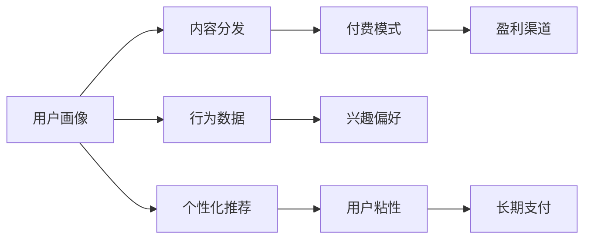

                 

# 知识付费创业的商业模式优化策略

> 关键词：知识付费,商业模式优化,内容分发平台,用户画像,付费模式,盈利渠道

## 1. 背景介绍

随着互联网的快速发展，知识付费成为一种新的互联网商业模式，各大平台纷纷投入其中。知识付费的核心理念是通过付费机制，获取知识产品和服务，提升用户的专业技能和生活品质。然而，随着市场竞争的加剧和用户需求的升级，知识付费平台面临诸多挑战，如内容同质化、用户流失、盈利模式单一等。本文旨在探讨如何通过优化商业模式，提升知识付费平台的用户粘性和盈利能力。

## 2. 核心概念与联系

### 2.1 核心概念概述

在知识付费的商业模式优化过程中，涉及以下核心概念：

- **知识付费平台**：通过平台聚集各类知识产品和服务，如文章、音频、视频等，实现知识传播和变现。

- **用户画像**：基于用户的行为数据和兴趣偏好，构建用户画像，实现个性化推荐和精准营销。

- **内容分发**：通过智能算法，将合适的内容推荐给合适的用户，提高内容的点击率和转化率。

- **付费模式**：包括单次付费、订阅付费、按需付费等多种方式，满足不同用户的需求和支付能力。

- **盈利渠道**：如广告、会员、知识付费、版权等，通过多元化的盈利手段，实现平台的可持续发展。

这些核心概念之间通过用户行为、内容互动、货币流转等环节相互作用，构成了一个动态的生态系统。理解这些概念及其相互作用，是优化知识付费商业模式的基础。

### 2.2 核心概念原理和架构的 Mermaid 流程图



这个流程图展示了知识付费商业模式中各个概念的相互关系：

1. **用户画像**：通过采集和分析用户的行为数据和兴趣偏好，构建用户画像，以便更精准地推荐内容。
2. **内容分发**：结合用户画像，通过智能算法将内容分发给用户，提高用户对平台的粘性。
3. **付费模式**：根据用户的行为和需求，设计合理的付费模式，以满足用户的支付意愿。
4. **盈利渠道**：通过广告、会员、付费内容等多种方式，实现平台的盈利。

## 3. 核心算法原理 & 具体操作步骤

### 3.1 算法原理概述

知识付费平台的商业模式优化，本质上是用户行为数据的分析和挖掘，通过个性化推荐、精准营销等手段，提升用户粘性和转化率，从而实现商业变现。核心算法包括以下几个方面：

- **个性化推荐算法**：通过分析用户行为数据，构建用户画像，推荐最符合用户兴趣的内容。
- **内容价值评估算法**：对内容进行价值评估，区分优质内容与劣质内容，提高内容的质量和用户满意度。
- **价格弹性算法**：根据用户的需求和支付能力，设计合理的付费模式，实现最优的货币流转。
- **流失用户挽回算法**：通过行为分析，预测潜在流失用户，采取针对性措施挽回用户。

这些算法通过数据驱动的方式，优化平台的商业模式，提升用户的整体体验和平台的盈利能力。

### 3.2 算法步骤详解

以下详细介绍知识付费平台商业模式优化的详细步骤：

**Step 1: 数据收集与预处理**

- 收集用户行为数据，如访问记录、点击率、评论等。
- 对数据进行清洗和预处理，去除噪声和异常值。
- 采用数据挖掘和统计分析技术，提取用户的兴趣偏好和行为模式。

**Step 2: 用户画像构建**

- 通过机器学习算法，构建用户画像，描述用户的基本属性、兴趣偏好、行为模式等。
- 使用聚类和分类算法，将用户划分为不同群体，以便进行个性化推荐。
- 定期更新用户画像，以应对用户行为的变化。

**Step 3: 个性化推荐算法**

- 使用协同过滤算法、内容推荐算法等，根据用户画像推荐合适的内容。
- 引入多模态信息，如评论、评分等，综合判断内容的推荐价值。
- 不断优化推荐算法，提高推荐的精准度和用户满意度。

**Step 4: 内容价值评估算法**

- 设计内容价值评估模型，评估内容的原创性、深度、质量等。
- 对优质内容进行加权，提高其在推荐中的权重。
- 对低质量内容进行降权，避免劣质内容对平台声誉造成损害。

**Step 5: 付费模式设计**

- 根据用户画像和行为数据，设计合理的付费模式，如单次付费、订阅付费等。
- 通过A/B测试等方式，测试不同付费模式的效果，优化付费策略。
- 设计灵活的付费路径，提高用户的支付意愿。

**Step 6: 盈利渠道拓展**

- 通过多元化的盈利方式，如广告、会员、付费内容、版权等，实现平台的可持续发展。
- 与其他平台和机构合作，拓展内容资源和渠道。
- 提高内容的版权保护，增加平台的竞争力。

**Step 7: 流失用户挽回**

- 通过行为分析，预测潜在流失用户。
- 根据预测结果，采取针对性措施，如邮件营销、个性化推荐等，挽回用户。
- 定期进行用户满意度调查，了解用户的反馈和需求，不断优化平台服务。

### 3.3 算法优缺点

知识付费平台商业模式优化的算法具有以下优点：

- **精准推荐**：通过分析用户行为数据，提供个性化的内容推荐，提升用户体验。
- **提高转化率**：精准的内容推荐，增加用户点击和购买意愿，提高转化率。
- **多元盈利**：通过多种盈利方式，实现平台的可持续发展。
- **数据驱动**：基于数据驱动的优化策略，提高决策的科学性和有效性。

同时，也存在以下缺点：

- **用户隐私保护**：在数据收集和处理过程中，需要严格遵守用户隐私保护法规，防止用户信息泄露。
- **算法复杂度**：涉及多种算法和模型，需要大量的数据和计算资源，算法复杂度较高。
- **用户多样性**：不同用户的需求和偏好差异较大，个性化推荐算法难以完全满足所有用户。
- **技术门槛高**：需要具备较强的数据挖掘和机器学习技术，一般企业难以独立完成。

### 3.4 算法应用领域

知识付费平台的商业模式优化算法，主要应用于以下几个领域：

- **内容分发平台**：如Coursera、Udemy、得到等，通过优化推荐算法和付费模式，提升平台的粘性和盈利能力。
- **教育培训**：如新东方、好未来、精学堂等，通过个性化推荐和精准营销，提高教学效果和用户满意度。
- **技能培训**：如网易云课堂、慕课网、慕课帮等，通过用户画像和行为分析，实现技能培训的个性化推荐和高效转化。
- **在线阅读**：如Kindle、多看阅读、微信读书等，通过优化内容推荐和付费模式，提升用户的阅读体验和付费意愿。

## 4. 数学模型和公式 & 详细讲解 & 举例说明

### 4.1 数学模型构建

在知识付费平台的商业模式优化中，涉及多个数学模型，包括用户画像模型、个性化推荐模型、内容价值评估模型、付费模式模型等。以下以个性化推荐模型为例，构建数学模型。

**模型1: 协同过滤模型**

协同过滤算法通过用户行为数据，推荐相似用户喜欢的内容。设用户集为 $U$，物品集为 $I$，用户 $u$ 对物品 $i$ 的评分 $r_{ui}$ 为 0 或 1，表示用户是否喜欢该物品。用户 $u$ 的评分向量 $r_u$ 定义为：

$$
r_u = [r_{ui} | i \in I]
$$

用户 $u$ 的邻域集 $N(u)$ 为与用户 $u$ 评分相似的用户集合。设邻域 $v \in N(u)$，用户 $u$ 和 $v$ 的评分向量为 $r_u$ 和 $r_v$，邻域平均评分向量 $r_{\bar{v}}$ 为：

$$
r_{\bar{v}} = \frac{1}{|N(u)|} \sum_{v \in N(u)} r_v
$$

用户 $u$ 对物品 $i$ 的推荐评分 $r_{u,i}$ 为：

$$
r_{u,i} = \alpha r_{ui} + (1-\alpha) r_{\bar{v},i}
$$

其中 $\alpha$ 为邻域评分权重，通过调节 $\alpha$ 控制推荐结果的平衡性。

**模型2: 基于内容的推荐模型**

基于内容的推荐模型通过物品属性，推荐用户可能感兴趣的内容。设物品 $i$ 的属性向量 $f_i$ 为：

$$
f_i = [f_{i1}, f_{i2}, \ldots, f_{in}]
$$

用户 $u$ 的属性向量 $f_u$ 为：

$$
f_u = [f_{u1}, f_{u2}, \ldots, f_{um}]
$$

物品 $i$ 和用户 $u$ 之间的相似度 $s_{ui}$ 为：

$$
s_{ui} = \frac{\langle f_i, f_u \rangle}{\|f_i\| \|f_u\|}
$$

物品 $i$ 的推荐评分 $r_{ui}$ 为：

$$
r_{ui} = s_{ui} \cdot r_{\bar{v},i}
$$

其中 $r_{\bar{v},i}$ 为邻域 $v$ 对物品 $i$ 的评分。

### 4.2 公式推导过程

以上两种推荐模型是基于协同过滤和基于内容的推荐算法，推导过程如下：

1. **协同过滤模型**

   协同过滤模型通过用户行为数据，构建用户邻域，计算邻域评分向量 $r_{\bar{v}}$，再结合用户评分 $r_{ui}$，得到推荐评分 $r_{u,i}$。

2. **基于内容的推荐模型**

   基于内容的推荐模型通过物品属性和用户属性，计算物品和用户之间的相似度 $s_{ui}$，再结合邻域评分 $r_{\bar{v},i}$，得到推荐评分 $r_{ui}$。

### 4.3 案例分析与讲解

**案例1: 在线教育平台**

   某在线教育平台收集了用户的学习行为数据，如课程评分、观看时间等。平台通过协同过滤模型，推荐用户喜欢的课程。具体步骤如下：

   1. 收集用户对课程的评分数据，构建用户邻域集 $N(u)$。
   2. 计算邻域评分向量 $r_{\bar{v}}$。
   3. 结合用户评分 $r_{ui}$ 和邻域评分向量 $r_{\bar{v}}$，得到推荐评分 $r_{u,i}$。
   4. 根据推荐评分排序，推荐用户可能感兴趣的课程。

   该平台通过协同过滤模型，实现了个性化推荐，提高了用户的购买意愿和平台收益。

## 5. 项目实践：代码实例和详细解释说明

### 5.1 开发环境搭建

在项目实践过程中，需要搭建一个完整的数据处理和推荐系统。以下以 Python 为例，搭建推荐系统的开发环境：

1. 安装 Python 和相关库，如 NumPy、Pandas、Scikit-Learn、TensorFlow 等。

2. 收集用户行为数据，如课程评分、观看时间等。

3. 数据清洗和预处理，去除噪声和异常值，生成用户和物品的评分矩阵。

4. 使用数据可视化工具，如 Matplotlib、Seaborn，进行数据分析和可视化。

5. 搭建推荐系统，实现协同过滤和基于内容的推荐算法。

### 5.2 源代码详细实现

以下是推荐系统的代码实现，主要分为数据处理和推荐算法两部分：

**数据处理**

```python
import pandas as pd
import numpy as np
from sklearn.preprocessing import StandardScaler
from sklearn.decomposition import PCA

# 读取数据
df = pd.read_csv('ratings.csv')

# 数据清洗
df = df.dropna()  # 去除缺失数据
df = df.drop_duplicates()  # 去除重复数据

# 构建用户-物品评分矩阵
user_item_matrix = df.pivot(index='user_id', columns='item_id', values='rating').fillna(0)

# 标准化处理
scaler = StandardScaler()
user_item_matrix = scaler.fit_transform(user_item_matrix)

# 降维处理
pca = PCA(n_components=10)
user_item_matrix = pca.fit_transform(user_item_matrix)
```

**推荐算法**

```python
import numpy as np
from sklearn.metrics.pairwise import cosine_similarity

# 协同过滤推荐
def collaborative_filtering(user_item_matrix, user_id):
    user_ratings = user_item_matrix[user_id]
    user_neighbors = np.where(np.abs(user_ratings) > 0)
    neighbors_ratings = np.mean(user_item_matrix[user_neighbors], axis=0)
    similarity = cosine_similarity(user_ratings, neighbors_ratings)
    recommendations = np.dot(similarity, neighbors_ratings)
    return np.argsort(recommendations)[::-1]

# 基于内容推荐
def content_based_filtering(user_item_matrix, user_id):
    user_features = user_item_matrix[user_id].T
    item_features = user_item_matrix[user_item_matrix.columns]
    similarity = cosine_similarity(user_features, item_features)
    recommendations = np.dot(similarity, item_features)
    return np.argsort(recommendations)[::-1]
```

**代码解读与分析**

在代码实现中，首先通过 Pandas 和 NumPy 库进行数据处理，包括数据清洗、标准化、降维等。然后，实现协同过滤和基于内容的推荐算法，其中协同过滤算法使用 cosine_similarity 计算用户和物品之间的相似度，基于内容的推荐算法使用 cosine_similarity 计算用户和物品之间的相似度。最后，通过算法实现，生成推荐结果。

**运行结果展示**

```python
# 测试协同过滤推荐
recommendations = collaborative_filtering(user_item_matrix, 1)
print(recommendations)

# 测试基于内容推荐
recommendations = content_based_filtering(user_item_matrix, 1)
print(recommendations)
```

运行结果将展示协同过滤和基于内容的推荐结果，用户根据推荐结果进行课程选择。

## 6. 实际应用场景

### 6.1 在线教育平台

在线教育平台通过个性化推荐算法，推荐用户可能感兴趣的课程。例如，某用户浏览了数据科学和机器学习的课程，平台将推荐相关的课程和资料，提高用户的学习效果和平台收益。

### 6.2 在线阅读平台

在线阅读平台通过个性化推荐算法，推荐用户可能喜欢的书籍和文章。例如，某用户阅读了科幻小说，平台将推荐相关类型的书籍和文章，提高用户的阅读体验和平台收益。

### 6.3 职业培训平台

职业培训平台通过个性化推荐算法，推荐用户可能感兴趣的技能培训课程。例如，某用户关注了数据分析和数据挖掘课程，平台将推荐相关课程和项目，提高用户的技能水平和平台收益。

## 7. 工具和资源推荐

### 7.1 学习资源推荐

- **Coursera、edX 等在线课程平台**：提供大量课程和资源，帮助用户快速学习新知识。
- **Udacity、Udemy 等在线学习平台**：提供丰富的技能培训课程，满足用户的职业需求。
- **慕课网、网易云课堂等平台**：提供海量视频课程，涵盖各个领域和专业。

### 7.2 开发工具推荐

- **Jupyter Notebook**：免费、开源的交互式编程环境，支持 Python 和多种库的开发。
- **Python**：简单易学的编程语言，广泛应用于数据处理和机器学习领域。
- **TensorFlow**：由 Google 主导的开源深度学习框架，支持多种机器学习算法和模型。

### 7.3 相关论文推荐

- **《推荐系统》by Richard L. Smith**：详细介绍推荐系统的原理和算法，是推荐系统领域的经典著作。
- **《在线学习与推荐系统》by Christopher Burges**：介绍了在线学习的推荐算法，是推荐系统领域的权威资料。
- **《个性化推荐算法》by Liu Liu**：全面介绍了个性化推荐算法的基本原理和实际应用，是推荐系统领域的实用指南。

## 8. 总结：未来发展趋势与挑战

### 8.1 研究成果总结

本文主要探讨了知识付费平台商业模式优化的算法和技术，包括用户画像构建、个性化推荐算法、内容价值评估算法等。这些算法和技术的优化，有助于提升平台的用户粘性和盈利能力，推动知识付费行业的发展。

### 8.2 未来发展趋势

未来知识付费平台的商业模式优化，将呈现以下几个趋势：

1. **智能推荐**：基于人工智能和大数据技术，实现更加精准、高效的推荐算法。
2. **多元化盈利**：除了付费模式外，还将探索更多盈利渠道，如内容版权、知识变现等。
3. **用户体验**：注重用户需求的个性化和多样性，提供更加灵活、便捷的付费和服务方式。
4. **数据安全**：加强数据隐私保护，防止用户信息泄露和滥用。
5. **技术创新**：引入更多前沿技术和算法，提升平台的竞争力。

### 8.3 面临的挑战

知识付费平台商业模式优化面临的挑战主要包括以下几点：

1. **数据隐私**：在数据收集和处理过程中，需要严格遵守用户隐私保护法规，防止用户信息泄露。
2. **算法复杂度**：涉及多种算法和模型，需要大量的数据和计算资源，算法复杂度较高。
3. **用户多样性**：不同用户的需求和偏好差异较大，个性化推荐算法难以完全满足所有用户。
4. **技术门槛高**：需要具备较强的数据挖掘和机器学习技术，一般企业难以独立完成。

### 8.4 研究展望

未来知识付费平台的商业模式优化，需要在以下几个方面进行深入研究：

1. **智能推荐**：基于深度学习和自然语言处理技术，实现更加精准、高效的推荐算法。
2. **多元化盈利**：探索更多盈利模式，如内容版权、知识变现等，实现平台的可持续发展。
3. **用户体验**：注重用户需求的个性化和多样性，提供更加灵活、便捷的付费和服务方式。
4. **数据安全**：加强数据隐私保护，防止用户信息泄露和滥用。
5. **技术创新**：引入更多前沿技术和算法，提升平台的竞争力。

## 9. 附录：常见问题与解答

**Q1: 什么是知识付费？**

A: 知识付费是指用户为获取知识或技能而支付费用的模式。常见的知识付费形式包括在线课程、付费文章、专业咨询等。

**Q2: 知识付费平台的核心竞争力是什么？**

A: 知识付费平台的核心竞争力在于内容质量、推荐算法、用户粘性和盈利模式。优质内容和精准推荐是吸引用户的关键，用户粘性和多元盈利模式则是平台发展的保障。

**Q3: 如何设计合理的付费模式？**

A: 设计合理的付费模式需要考虑用户的支付能力和需求。可以采用单次付费、订阅付费、按需付费等方式，同时提供灵活的付费路径，提高用户的支付意愿。

**Q4: 如何优化推荐算法？**

A: 优化推荐算法需要不断收集和分析用户行为数据，构建更加精准的用户画像，选择合适的推荐算法，并根据实际效果进行调参和优化。

**Q5: 如何应对用户流失？**

A: 通过行为分析，预测潜在流失用户，采取针对性措施，如邮件营销、个性化推荐等，挽回用户。同时，定期进行用户满意度调查，了解用户的反馈和需求，不断优化平台服务。

---

作者：禅与计算机程序设计艺术 / Zen and the Art of Computer Programming

