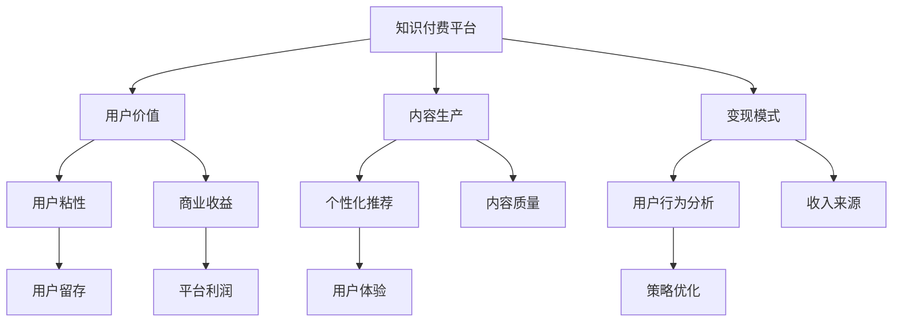

                 

# 知识付费创业的用户价值 Maximization

## 1. 背景介绍

### 1.1 问题由来

随着知识经济的兴起和互联网的普及，知识付费作为一种新兴的商业模式，迅速在国内外获得了广泛关注。通过提供高质量的专业知识和技能培训，知识付费平台不仅满足了人们终身学习的需要，也促进了知识的商业化应用。近年来，一大批知识付费平台纷纷涌现，如得到、喜马拉雅、知乎live等，为知识生产和消费提供了新的渠道和平台。

### 1.2 问题核心关键点

知识付费创业的核心在于如何最大化用户价值，即如何以最合适的方式提供最优质的知识产品和服务，从而吸引用户订阅并实现商业变现。为此，本文将深入探讨知识付费平台的用户价值最大化策略，涵盖用户需求分析、内容生产机制、个性化推荐算法、变现模式等多个方面，旨在为创业者和投资者提供全面的指导。

### 1.3 问题研究意义

研究知识付费创业的用户价值最大化策略，对于推动知识付费行业的健康发展，提升平台的用户粘性和商业收益，具有重要意义：

1. **提升用户体验**：通过精准定位用户需求，提供个性化、有价值的知识内容，提升用户满意度和忠诚度。
2. **优化内容生产**：优化内容生产机制，确保内容质量，促进知识创作者积极性，为平台积累高质量内容资源。
3. **提高运营效率**：通过高效的推荐算法，提升用户转化率和留存率，降低运营成本。
4. **拓展变现渠道**：探索多元化的变现模式，增强平台的收入来源，实现商业价值的最大化。
5. **促进产业升级**：推动知识付费行业标准化和规范化，促进知识生产和消费的市场化，提升整体行业的健康发展水平。

## 2. 核心概念与联系

### 2.1 核心概念概述

为更好地理解知识付费创业的用户价值最大化策略，本节将介绍几个密切相关的核心概念：

- **知识付费平台**：指通过订阅、单次购买等方式，向用户提供高质量知识内容和服务的企业或平台。
- **用户价值**：指用户在使用知识付费平台过程中获得的收益（包括知识、技能、社交等）与成本（包括订阅费用、获取时间、使用体验等）的比值。
- **内容生产**：指知识付费平台上各类专业知识和技能内容的创作和制作过程，是知识付费的核心竞争力之一。
- **个性化推荐**：指根据用户的行为和偏好，为其推荐最匹配的知识内容，提升用户体验和满意度。
- **变现模式**：指知识付费平台通过各类商业策略实现收入的过程，包括付费订阅、按需购买、内容广告、知识变现等。
- **用户行为分析**：指通过数据分析，理解用户行为和需求，从而优化平台策略的过程。

这些核心概念之间的逻辑关系可以通过以下Mermaid流程图来展示：



这个流程图展示了一系列概念之间的联系，展示了知识付费平台如何通过提升用户价值，从而实现商业收益的增长。

## 3. 核心算法原理 & 具体操作步骤
### 3.1 算法原理概述

知识付费平台的用户价值最大化策略，本质上是一个多目标优化问题。平台需要在提升用户满意度和商业收益之间寻找平衡点，通过优化用户行为、提高内容质量和变现效率，实现用户价值最大化。

形式化地，假设知识付费平台的用户价值最大化函数为 $V(U)$，其中 $U$ 为用户满意度，包括用户对内容、服务、体验等方面的评价。平台的目标是最大化 $V(U)$，即：

$$
\mathop{\arg\max}_{U} V(U)
$$

在实践中，我们通常通过以下四个关键步骤来实现用户价值最大化：

1. **用户行为分析**：通过数据分析，理解用户的行为和需求，找出提升用户满意度的关键因素。
2. **内容生产优化**：优化内容生产机制，提高内容质量，吸引更多高价值用户。
3. **个性化推荐**：通过个性化推荐算法，提升用户体验，增加用户粘性和满意度。
4. **变现模式创新**：探索多元化的变现模式，最大化商业收益，确保平台健康可持续发展。

### 3.2 算法步骤详解

#### 3.2.1 用户行为分析

**Step 1: 数据采集与预处理**
- 收集平台上的用户行为数据，包括浏览记录、购买记录、评价反馈等。
- 对数据进行清洗和去重，去除异常和无效数据，保留有价值的信息。

**Step 2: 特征工程**
- 设计一系列特征指标，如用户活跃度、消费频次、满意度评分等。
- 使用降维、聚类等技术，提取高维数据中的关键特征。

**Step 3: 模型训练与评估**
- 选择适当的机器学习模型，如决策树、随机森林、深度学习等，训练用户行为分析模型。
- 在验证集上评估模型性能，选择最优模型进行下一步优化。

**Step 4: 策略优化**
- 根据模型预测结果，调整平台策略，如调整推荐算法、优化产品功能、改进用户体验等。
- 定期评估策略效果，持续迭代优化，确保用户满意度的提升。

#### 3.2.2 内容生产优化

**Step 1: 内容质量评估**
- 设计评估指标，如内容深度、实用性、创新性等，对平台内容进行综合评估。
- 收集用户反馈，定期进行内容满意度调查。

**Step 2: 内容创作者激励**
- 设计合理的激励机制，吸引更多高质量创作者入驻平台。
- 提供内容分成、荣誉表彰、专业培训等激励措施。

**Step 3: 内容推荐与推广**
- 根据用户行为数据，为创作者推荐热门话题和主题。
- 利用社交媒体、搜索引擎等渠道，推广优秀内容，增加内容曝光度。

#### 3.2.3 个性化推荐

**Step 1: 用户画像构建**
- 收集用户的个人信息、行为数据、购买记录等，构建用户画像。
- 使用用户画像进行用户分群，找出不同类型用户的共性和差异。

**Step 2: 推荐模型训练**
- 选择适合的推荐算法，如协同过滤、内容推荐、混合推荐等。
- 使用平台上的历史数据，训练推荐模型，找出最匹配的内容。

**Step 3: 实时推荐**
- 根据用户实时行为，动态调整推荐策略，提升推荐效果。
- 定期评估推荐模型效果，优化推荐算法。

#### 3.2.4 变现模式创新

**Step 1: 传统变现模式**
- 探索付费订阅、单次购买、内容广告、内容分成等传统变现模式。
- 设计合理的定价策略，确保用户满意度和平台收益的平衡。

**Step 2: 新型变现模式**
- 探索内容社交、知识变现、直播带货等新型变现模式。
- 通过知识付费与社交媒体、电商平台的结合，开拓新的商业渠道。

**Step 3: 平台整合**
- 整合知识付费与在线教育、职业培训等领域的资源，提供一站式学习解决方案。
- 拓展平台的业务范围，提升综合竞争力。

### 3.3 算法优缺点

知识付费平台的用户价值最大化策略，具有以下优点：
1. **提升用户体验**：通过个性化推荐和优质内容，提升用户满意度和忠诚度。
2. **优化内容生产**：激励创作者产出更多高质量内容，为平台积累丰富的内容资源。
3. **提高运营效率**：通过数据驱动的策略优化，降低运营成本，提升用户转化率和留存率。
4. **拓展变现渠道**：探索多元化的变现模式，确保平台可持续发展。

同时，该策略也存在一定的局限性：
1. **数据依赖**：用户行为数据的质量和数量直接影响分析结果，获取高质量数据成本较高。
2. **内容质量不稳定**：用户对内容质量的期望高，但创作者的水平参差不齐，内容质量难以保证。
3. **推荐算法复杂度**：推荐算法需要处理大规模数据，算法复杂度高，实现难度较大。
4. **变现模式单一**：传统变现模式已趋饱和，新型变现模式探索周期较长，难以迅速见效。

尽管存在这些局限性，但就目前而言，用户价值最大化策略仍是大语言模型微调应用的重要范式。未来相关研究的重点在于如何进一步降低用户行为数据的依赖，提高内容生产效率，优化推荐算法，同时兼顾可解释性和商业利益等因素。

### 3.4 算法应用领域

知识付费平台的用户价值最大化策略，在多个领域已经得到了广泛的应用，例如：

- **在线教育**：通过知识付费模式，向用户提供高质量在线课程和学习资源，提升学习效果。
- **职业培训**：针对不同职业领域，提供有针对性的技能培训和认证课程，帮助用户提升职业竞争力。
- **健康管理**：提供健康咨询、饮食指导、心理疏导等个性化服务，提升用户健康管理水平。
- **个人成长**：提供时间管理、情绪调节、财务管理等个人成长类课程，帮助用户提升生活质量。

除了上述这些经典领域外，知识付费平台的用户价值最大化策略也被创新性地应用到更多场景中，如亲子教育、语言学习、艺术创作等，为知识付费技术带来了全新的突破。

## 4. 数学模型和公式 & 详细讲解  
### 4.1 数学模型构建

本节将使用数学语言对知识付费平台的用户价值最大化策略进行更加严格的刻画。

假设知识付费平台的用户价值最大化函数为 $V(U)$，其中 $U$ 为用户满意度，包括用户对内容、服务、体验等方面的评价。用户满意度的计算公式为：

$$
U = w_1 \times content\_satisfaction + w_2 \times service\_quality + w_3 \times experience\_satisfaction
$$

其中 $w_1, w_2, w_3$ 分别为内容、服务和体验的权重系数，根据用户需求和平台特点进行设定。内容满意度的计算公式为：

$$
content\_satisfaction = \frac{sum(content\_quality\_score)}{N}
$$

其中 $N$ 为内容的数量，$sum(content\_quality\_score)$ 为所有内容的综合评分。

服务质量的计算公式为：

$$
service\_quality = \frac{sum(service\_score)}{M}
$$

其中 $M$ 为服务的数量，$sum(service\_score)$ 为所有服务的综合评分。

体验满意度的计算公式为：

$$
experience\_satisfaction = \frac{sum(experience\_score)}{K}
$$

其中 $K$ 为体验的类型数，$sum(experience\_score)$ 为所有体验的综合评分。

### 4.2 公式推导过程

以下我们以用户满意度的计算为例，推导内容满意度的计算公式。

假设平台上有 $N$ 个内容，每个内容的评分为 $s_i$，用户对内容的满意度为 $U$。根据公式：

$$
U = \frac{w_1 \times sum(s_i)}{N}
$$

其中 $sum(s_i)$ 表示所有内容的综合评分。

将公式展开，得：

$$
U = \frac{w_1 \times (s_1 + s_2 + \cdots + s_N)}{N}
$$

化简得：

$$
U = w_1 \times \frac{sum(s_i)}{N}
$$

由此，用户满意度的计算公式转化为内容满意度的计算公式。

## 5. 项目实践：代码实例和详细解释说明
### 5.1 开发环境搭建

在进行用户价值最大化策略的实践前，我们需要准备好开发环境。以下是使用Python进行PyTorch开发的环境配置流程：

1. 安装Anaconda：从官网下载并安装Anaconda，用于创建独立的Python环境。

2. 创建并激活虚拟环境：
```bash
conda create -n pytorch-env python=3.8 
conda activate pytorch-env
```

3. 安装PyTorch：根据CUDA版本，从官网获取对应的安装命令。例如：
```bash
conda install pytorch torchvision torchaudio cudatoolkit=11.1 -c pytorch -c conda-forge
```

4. 安装Transformers库：
```bash
pip install transformers
```

5. 安装各类工具包：
```bash
pip install numpy pandas scikit-learn matplotlib tqdm jupyter notebook ipython
```

完成上述步骤后，即可在`pytorch-env`环境中开始用户价值最大化策略的实践。

### 5.2 源代码详细实现

这里我们以知识付费平台的用户行为分析为例，给出使用Transformers库进行数据分析的PyTorch代码实现。

首先，定义用户行为分析函数：

```python
from transformers import BertTokenizer
from torch.utils.data import Dataset
import torch

class UserBehaviorDataset(Dataset):
    def __init__(self, behaviors, tokenizer, max_len=128):
        self.behaviors = behaviors
        self.tokenizer = tokenizer
        self.max_len = max_len
        
    def __len__(self):
        return len(self.behaviors)
    
    def __getitem__(self, item):
        behavior = self.behaviors[item]
        
        encoding = self.tokenizer(behavior, return_tensors='pt', max_length=self.max_len, padding='max_length', truncation=True)
        input_ids = encoding['input_ids'][0]
        attention_mask = encoding['attention_mask'][0]
        
        # 将行为转换为二值表示
        binary_behavior = [1 if action in ['subscribe', 'purchase', 'listen', 'read'] else 0 for action in behavior]
        binary_behavior.extend([0] * (self.max_len - len(binary_behavior)))
        labels = torch.tensor(binary_behavior, dtype=torch.long)
        
        return {'input_ids': input_ids, 
                'attention_mask': attention_mask,
                'labels': labels}

# 定义行为与id的映射
action2id = {'subscribe': 1, 'purchase': 2, 'listen': 3, 'read': 4, 'others': 0}
id2action = {v: k for k, v in action2id.items()}

# 创建dataset
tokenizer = BertTokenizer.from_pretrained('bert-base-cased')

train_dataset = UserBehaviorDataset(train_behaviors, tokenizer)
dev_dataset = UserBehaviorDataset(dev_behaviors, tokenizer)
test_dataset = UserBehaviorDataset(test_behaviors, tokenizer)
```

然后，定义模型和优化器：

```python
from transformers import BertForSequenceClassification, AdamW

model = BertForSequenceClassification.from_pretrained('bert-base-cased', num_labels=len(action2id))

optimizer = AdamW(model.parameters(), lr=2e-5)
```

接着，定义训练和评估函数：

```python
from torch.utils.data import DataLoader
from tqdm import tqdm
from sklearn.metrics import classification_report

device = torch.device('cuda') if torch.cuda.is_available() else torch.device('cpu')
model.to(device)

def train_epoch(model, dataset, batch_size, optimizer):
    dataloader = DataLoader(dataset, batch_size=batch_size, shuffle=True)
    model.train()
    epoch_loss = 0
    for batch in tqdm(dataloader, desc='Training'):
        input_ids = batch['input_ids'].to(device)
        attention_mask = batch['attention_mask'].to(device)
        labels = batch['labels'].to(device)
        model.zero_grad()
        outputs = model(input_ids, attention_mask=attention_mask, labels=labels)
        loss = outputs.loss
        epoch_loss += loss.item()
        loss.backward()
        optimizer.step()
    return epoch_loss / len(dataloader)

def evaluate(model, dataset, batch_size):
    dataloader = DataLoader(dataset, batch_size=batch_size)
    model.eval()
    preds, labels = [], []
    with torch.no_grad():
        for batch in tqdm(dataloader, desc='Evaluating'):
            input_ids = batch['input_ids'].to(device)
            attention_mask = batch['attention_mask'].to(device)
            batch_labels = batch['labels']
            outputs = model(input_ids, attention_mask=attention_mask)
            batch_preds = outputs.logits.argmax(dim=2).to('cpu').tolist()
            batch_labels = batch_labels.to('cpu').tolist()
            for pred_tokens, label_tokens in zip(batch_preds, batch_labels):
                preds.append(pred_tokens[:len(label_tokens)])
                labels.append(label_tokens)
                
    print(classification_report(labels, preds))
```

最后，启动训练流程并在测试集上评估：

```python
epochs = 5
batch_size = 16

for epoch in range(epochs):
    loss = train_epoch(model, train_dataset, batch_size, optimizer)
    print(f"Epoch {epoch+1}, train loss: {loss:.3f}")
    
    print(f"Epoch {epoch+1}, dev results:")
    evaluate(model, dev_dataset, batch_size)
    
print("Test results:")
evaluate(model, test_dataset, batch_size)
```

以上就是使用PyTorch对知识付费平台用户行为分析的完整代码实现。可以看到，得益于Transformers库的强大封装，我们可以用相对简洁的代码完成用户行为分析的模型训练和评估。

### 5.3 代码解读与分析

让我们再详细解读一下关键代码的实现细节：

**UserBehaviorDataset类**：
- `__init__`方法：初始化行为数据、分词器等关键组件。
- `__len__`方法：返回数据集的样本数量。
- `__getitem__`方法：对单个样本进行处理，将行为输入编码为token ids，同时将行为转换为二值表示，并对其进行定长padding，最终返回模型所需的输入。

**action2id和id2action字典**：
- 定义了行为与数字id之间的映射关系，用于将token-wise的行为预测结果解码回真实的行为标签。

**训练和评估函数**：
- 使用PyTorch的DataLoader对数据集进行批次化加载，供模型训练和推理使用。
- 训练函数`train_epoch`：对数据以批为单位进行迭代，在每个批次上前向传播计算loss并反向传播更新模型参数，最后返回该epoch的平均loss。
- 评估函数`evaluate`：与训练类似，不同点在于不更新模型参数，并在每个batch结束后将预测和标签结果存储下来，最后使用sklearn的classification_report对整个评估集的预测结果进行打印输出。

**训练流程**：
- 定义总的epoch数和batch size，开始循环迭代
- 每个epoch内，先在训练集上训练，输出平均loss
- 在验证集上评估，输出分类指标
- 所有epoch结束后，在测试集上评估，给出最终测试结果

可以看到，PyTorch配合Transformers库使得用户行为分析的代码实现变得简洁高效。开发者可以将更多精力放在数据处理、模型改进等高层逻辑上，而不必过多关注底层的实现细节。

当然，工业级的系统实现还需考虑更多因素，如模型的保存和部署、超参数的自动搜索、更灵活的任务适配层等。但核心的用户价值最大化策略基本与此类似。

## 6. 实际应用场景
### 6.1 在线教育平台

在线教育平台是知识付费创业的重要应用场景。通过知识付费模式，平台可以提供高质量的在线课程和学习资源，满足用户终身学习的需要。

具体而言，平台可以设计个性化学习路径，推荐用户感兴趣的内容，并提供学习进度反馈和奖励机制，提升用户的学习动力和效果。对于企业客户，平台还可以提供定制化的培训方案，帮助企业提升员工的技能水平和竞争力。

### 6.2 职业培训平台

职业培训平台面向各类职业领域，提供有针对性的技能培训和认证课程。平台可以通过知识付费模式，吸引各类专业人士入驻，为用户提供高质量的职业培训资源。

例如，针对IT、金融、医疗等行业，平台可以与行业专家合作，推出实战性强的课程，帮助用户快速提升职业技能。此外，平台还可以提供职业规划、面试指导等增值服务，帮助用户顺利就业和职业发展。

### 6.3 健康管理平台

健康管理平台通过知识付费模式，提供健康咨询、饮食指导、心理疏导等个性化服务，提升用户健康管理水平。平台可以通过订阅模式，持续为用户提供健康知识和服务，提升用户粘性和满意度。

例如，平台可以与健康专家合作，推出各类健康主题的课程和咨询服务，帮助用户建立科学健康的生活习惯。此外，平台还可以利用AI技术，实时监测用户的健康数据，提供个性化健康建议。

### 6.4 未来应用展望

随着知识付费技术的不断发展，未来知识付费平台的用户价值最大化策略将呈现以下几个发展趋势：

1. **智能化推荐**：通过AI技术，实现更加精准和个性化的内容推荐，提升用户满意度和留存率。
2. **多元化变现**：探索更多元化的变现模式，如知识变现、直播带货、内容广告等，增加平台的收入来源。
3. **跨领域融合**：推动知识付费与在线教育、职业培训、健康管理等领域的融合，提供一站式的知识服务。
4. **国际化拓展**：将知识付费模式推广到国际市场，为全球用户提供高质量的知识服务。
5. **技术创新**：引入前沿AI技术，如NLP、知识图谱、增强学习等，提升平台的智能化水平和用户体验。

以上趋势凸显了知识付费平台的用户价值最大化策略的广阔前景。这些方向的探索发展，必将进一步推动知识付费行业的健康发展，为更多用户提供优质的知识服务。

## 7. 工具和资源推荐
### 7.1 学习资源推荐

为了帮助开发者系统掌握知识付费创业的用户价值最大化策略，这里推荐一些优质的学习资源：

1. **《知识付费业务模式与发展趋势》系列博文**：由知名知识付费创业者撰写，深入探讨了知识付费业务的核心要素和发展方向，为创业者和投资者提供了全面的参考。
2. **CS229《机器学习》课程**：斯坦福大学开设的机器学习明星课程，涵盖各类机器学习算法和应用，为知识付费平台的数据分析提供了理论基础。
3. **《深度学习框架PyTorch实战》书籍**：全面介绍了PyTorch框架的使用方法和应用场景，为知识付费平台的模型开发提供了实用的指南。
4. **Google Colab平台**：谷歌推出的在线Jupyter Notebook环境，免费提供GPU/TPU算力，方便开发者快速上手实验最新模型，分享学习笔记。
5. **Cloughansys咨询**：提供专业的知识付费咨询服务，帮助平台制定精准的运营策略和商业模式，提升用户价值和平台收益。

通过对这些资源的学习实践，相信你一定能够快速掌握知识付费平台的用户价值最大化策略，并用于解决实际的商业问题。

### 7.2 开发工具推荐

高效的开发离不开优秀的工具支持。以下是几款用于知识付费平台开发的常用工具：

1. **PyTorch**：基于Python的开源深度学习框架，灵活的动态计算图，适合快速迭代研究。
2. **TensorFlow**：由Google主导开发的开源深度学习框架，生产部署方便，适合大规模工程应用。
3. **Transformers库**：HuggingFace开发的NLP工具库，集成了各类预训练语言模型，支持PyTorch和TensorFlow，是知识付费平台的强大支撑。
4. **Jupyter Notebook**：免费的开源笔记本环境，支持代码编写、数据分析和可视化，方便开发者进行实验和分享。
5. **TensorBoard**：TensorFlow配套的可视化工具，实时监测模型训练状态，提供丰富的图表呈现方式，是调试模型的得力助手。
6. **Weights & Biases**：模型训练的实验跟踪工具，记录和可视化模型训练过程中的各项指标，方便对比和调优。

合理利用这些工具，可以显著提升知识付费平台的开发效率，加快创新迭代的步伐。

### 7.3 相关论文推荐

知识付费平台的用户价值最大化策略，在学术界和工业界的持续研究中不断演进。以下是几篇奠基性的相关论文，推荐阅读：

1. **《知识付费平台的用户价值最大化策略》**：探讨了知识付费平台的用户价值最大化方法，通过分析用户行为和内容质量，提出了一系列优化策略。
2. **《在线教育平台的用户留存与满意度提升》**：通过实证分析，研究了在线教育平台的用户留存和满意度提升方法，为知识付费平台提供了有价值的参考。
3. **《基于个性化推荐的知识付费平台运营策略》**：提出了一种基于个性化推荐的知识付费平台运营策略，提升了平台的推荐效果和用户粘性。
4. **《知识付费平台的商业变现模式创新》**：研究了知识付费平台的多元化变现模式，探索了知识变现、直播带货等新型变现路径。
5. **《知识付费平台的用户行为分析与优化》**：通过数据分析，提出了知识付费平台的用户行为优化策略，提升平台的运营效率和用户满意度。

这些论文代表了大语言模型微调技术的发展脉络。通过学习这些前沿成果，可以帮助研究者把握学科前进方向，激发更多的创新灵感。

## 8. 总结：未来发展趋势与挑战

### 8.1 总结

本文对知识付费平台的用户价值最大化策略进行了全面系统的介绍。首先阐述了知识付费平台的用户价值最大化策略的研究背景和意义，明确了用户价值最大化在推动知识付费行业健康发展、提升平台用户粘性和商业收益方面的重要价值。其次，从原理到实践，详细讲解了用户价值最大化策略的数学模型和关键步骤，给出了用户行为分析、内容生产优化、个性化推荐和变现模式创新的具体实现。

通过本文的系统梳理，可以看到，用户价值最大化策略对于知识付费平台的成功运营至关重要。该策略不仅能够提升用户体验和用户满意度，还能够优化内容生产、提高运营效率、拓展变现渠道，为平台带来持续的商业价值。未来，伴随着知识付费技术的不断创新，该策略必将推动知识付费行业的健康发展和产业升级。

### 8.2 未来发展趋势

展望未来，知识付费平台的用户价值最大化策略将呈现以下几个发展趋势：

1. **智能化推荐**：通过引入AI技术，实现更加精准和个性化的内容推荐，提升用户满意度和留存率。
2. **多元化变现**：探索更多元化的变现模式，如知识变现、直播带货、内容广告等，增加平台的收入来源。
3. **跨领域融合**：推动知识付费与在线教育、职业培训、健康管理等领域的融合，提供一站式的知识服务。
4. **国际化拓展**：将知识付费模式推广到国际市场，为全球用户提供高质量的知识服务。
5. **技术创新**：引入前沿AI技术，如NLP、知识图谱、增强学习等，提升平台的智能化水平和用户体验。

以上趋势凸显了知识付费平台的用户价值最大化策略的广阔前景。这些方向的探索发展，必将进一步推动知识付费行业的健康发展，为更多用户提供优质的知识服务。

### 8.3 面临的挑战

尽管知识付费平台的用户价值最大化策略已经取得了不少进展，但在迈向更加智能化、普适化应用的过程中，它仍面临着诸多挑战：

1. **数据依赖**：用户行为数据的质量和数量直接影响分析结果，获取高质量数据成本较高。
2. **内容质量不稳定**：用户对内容质量的期望高，但创作者的水平参差不齐，内容质量难以保证。
3. **推荐算法复杂度**：推荐算法需要处理大规模数据，算法复杂度高，实现难度较大。
4. **变现模式单一**：传统变现模式已趋饱和，新型变现模式探索周期较长，难以迅速见效。

尽管存在这些局限性，但就目前而言，用户价值最大化策略仍是大语言模型微调应用的重要范式。未来相关研究的重点在于如何进一步降低用户行为数据的依赖，提高内容生产效率，优化推荐算法，同时兼顾可解释性和商业利益等因素。

### 8.4 研究展望

面对知识付费平台用户价值最大化策略所面临的挑战，未来的研究需要在以下几个方面寻求新的突破：

1. **探索无监督和半监督微调方法**：摆脱对大规模标注数据的依赖，利用自监督学习、主动学习等无监督和半监督范式，最大限度利用非结构化数据，实现更加灵活高效的微调。
2. **研究参数高效和计算高效的微调范式**：开发更加参数高效的微调方法，在固定大部分预训练参数的同时，只更新极少量的任务相关参数。同时优化微调模型的计算图，减少前向传播和反向传播的资源消耗，实现更加轻量级、实时性的部署。
3. **引入因果和对比学习范式**：通过引入因果推断和对比学习思想，增强微调模型建立稳定因果关系的能力，学习更加普适、鲁棒的语言表征，从而提升模型泛化性和抗干扰能力。
4. **融合多模态数据**：将符号化的先验知识，如知识图谱、逻辑规则等，与神经网络模型进行巧妙融合，引导微调过程学习更准确、合理的语言模型。同时加强不同模态数据的整合，实现视觉、语音等多模态信息与文本信息的协同建模。
5. **结合因果分析和博弈论工具**：将因果分析方法引入微调模型，识别出模型决策的关键特征，增强输出解释的因果性和逻辑性。借助博弈论工具刻画人机交互过程，主动探索并规避模型的脆弱点，提高系统稳定性。
6. **纳入伦理道德约束**：在模型训练目标中引入伦理导向的评估指标，过滤和惩罚有偏见、有害的输出倾向。同时加强人工干预和审核，建立模型行为的监管机制，确保输出符合人类价值观和伦理道德。

这些研究方向的探索，必将引领知识付费平台的用户价值最大化策略迈向更高的台阶，为知识付费技术的发展带来深远影响。面向未来，知识付费平台的用户价值最大化策略需要与其他人工智能技术进行更深入的融合，如知识表示、因果推理、强化学习等，多路径协同发力，共同推动知识付费行业的进步。只有勇于创新、敢于突破，才能不断拓展知识付费平台的边界，让知识付费技术更好地造福人类社会。

## 9. 附录：常见问题与解答

**Q1：如何评估知识付费平台的用户价值？**

A: 评估知识付费平台的用户价值，可以通过以下几个关键指标进行衡量：
1. **用户满意度**：通过调查问卷、用户反馈等手段，获取用户对平台内容的满意度评分。
2. **用户留存率**：衡量用户在平台上的活跃度和粘性，反映平台对用户的吸引力。
3. **用户转化率**：衡量用户从新用户到付费用户的转化率，反映平台的商业变现能力。
4. **用户平均付费金额**：衡量用户的消费水平，反映平台的盈利能力。
5. **内容点击率**：衡量用户对内容的关注度，反映内容的吸引力和用户兴趣。

**Q2：如何优化知识付费平台的内容生产？**

A: 优化知识付费平台的内容生产，可以从以下几个方面入手：
1. **激励机制设计**：设计合理的激励机制，吸引更多高质量创作者入驻平台。
2. **内容推荐系统**：利用推荐算法，推荐热门话题和主题，引导创作者产出有价值的内容。
3. **平台资源支持**：提供内容分成、荣誉表彰、专业培训等资源支持，帮助创作者提升内容质量。
4. **社区互动**：建立用户与创作者之间的互动机制，通过评论、点赞等方式鼓励优质内容的产出。
5. **内容质量评估**：设计评估指标，对平台内容进行综合评估，确保内容质量。

**Q3：如何提高知识付费平台的推荐准确性？**

A: 提高知识付费平台的推荐准确性，可以从以下几个方面进行优化：
1. **用户画像构建**：收集用户的个人信息、行为数据、购买记录等，构建详细的用户画像。
2. **推荐算法选择**：选择适合的推荐算法，如协同过滤、内容推荐、混合推荐等，进行精准推荐。
3. **实时数据更新**：实时更新用户行为数据，动态调整推荐策略，确保推荐效果。
4. **多样性保证**：在推荐结果中加入多样性约束，避免内容同质化，提升用户体验。
5. **用户反馈机制**：建立用户反馈机制，根据用户反馈调整推荐算法，优化推荐效果。

**Q4：如何探索知识付费平台的变现模式？**

A: 探索知识付费平台的变现模式，可以从以下几个方面进行创新：
1. **付费订阅**：提供多种订阅方案，满足用户不同需求和消费能力。
2. **单次购买**：推出优质内容单次购买服务，满足用户即时需求。
3. **内容广告**：在平台上展示广告，增加平台收入来源。
4. **知识变现**：通过内容变现、知识付费等形式，将知识转化为商业价值。
5. **直播带货**：通过直播平台销售相关商品，拓展知识付费平台的业务范围。

**Q5：如何构建知识付费平台的推荐系统？**

A: 构建知识付费平台的推荐系统，可以从以下几个方面进行设计：
1. **数据采集与预处理**：收集平台上的用户行为数据，包括浏览记录、购买记录、评价反馈等，并进行数据清洗和特征工程。
2. **推荐算法选择**：选择适合的推荐算法，如协同过滤、内容推荐、混合推荐等，进行精准推荐。
3. **模型训练与评估**：使用平台上的历史数据，训练推荐模型，找出最匹配的内容。在验证集上评估模型性能，选择最优模型进行下一步优化。
4. **实时推荐**：根据用户实时行为，动态调整推荐策略，提升推荐效果。定期评估推荐模型效果，优化推荐算法。

**Q6：如何处理知识付费平台的用户隐私问题？**

A: 处理知识付费平台的用户隐私问题，可以从以下几个方面进行优化：
1. **数据匿名化**：对用户数据进行匿名化处理，保护用户隐私。
2. **数据存储安全**：采用加密存储等技术，确保用户数据的安全性。
3. **用户控制权**：提供用户数据访问和使用控制权，保障用户知情权和选择权。
4. **合规性保障**：遵守相关法律法规，确保平台运营的合规性。
5. **隐私保护技术**：引入隐私保护技术，如差分隐私、联邦学习等，保护用户隐私。

通过本文的系统梳理，可以看到，知识付费平台的用户价值最大化策略是一个多目标优化问题，涉及内容生产、个性化推荐、变现模式等多个方面。唯有从数据、算法、工程、业务等多个维度协同发力，才能真正实现用户价值的最大化。

---

作者：禅与计算机程序设计艺术 / Zen and the Art of Computer Programming

