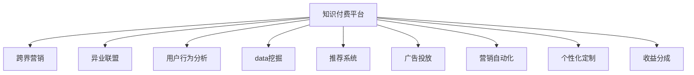

                 

# 知识付费如何实现跨界营销与异业联盟？

> 关键词：知识付费, 跨界营销, 异业联盟, 用户行为分析, 数据挖掘, 推荐系统, 广告投放, 营销自动化, 个性化定制, 收益分成

## 1. 背景介绍

随着信息时代的发展，知识付费已经成为一种重要的消费形式。通过在线平台购买专业知识、技能培训、课程视频等，用户可以迅速提升自我，获得职业发展的新动力。知识付费平台如得到、喜马拉雅、网易云课堂等，正成为用户获取知识、技能的主要渠道。

然而，知识付费行业的竞争日趋激烈，单纯的平台销售模式难以适应市场变化。如何在激烈的市场竞争中脱颖而出，如何提升用户转化率，如何扩大市场份额，成为平台管理者面临的重要课题。跨界营销与异业联盟正是在这种背景下提出的解决方案。

本文将探讨如何利用跨界营销与异业联盟，提升知识付费平台的竞争力，拓展市场空间，实现更大的商业价值。

## 2. 核心概念与联系

### 2.1 核心概念概述

要实现跨界营销与异业联盟，首先需要理解以下核心概念：

- **知识付费平台**：提供各种付费内容，如课程、讲座、咨询等，满足用户多样化的知识需求。
- **跨界营销**：突破传统营销模式的界限，与多个行业或平台合作，共同推广产品或服务，实现资源共享和用户交叉。
- **异业联盟**：不同行业的企业或品牌之间建立合作关系，共同开发市场，提升整体竞争力。
- **用户行为分析**：通过数据分析工具，深入挖掘用户行为和偏好，提供个性化推荐和广告服务。
- **数据挖掘**：利用统计学、机器学习等技术，从海量数据中挖掘出有价值的信息和模式。
- **推荐系统**：根据用户的历史行为和偏好，推荐个性化的内容或产品，提升用户体验和转化率。
- **广告投放**：根据用户画像和行为数据，精准投放广告，提高广告效果和ROI。
- **营销自动化**：使用自动化工具和技术，高效管理营销活动，提升营销效率。
- **个性化定制**：根据用户需求和偏好，提供量身定制的产品或服务，提升用户满意度和忠诚度。
- **收益分成**：合作双方根据销售或合作成果，按比例分配收益，实现互惠互利。

这些概念之间的联系如下：

- **知识付费平台**是跨界营销与异业联盟的基础。
- **跨界营销**和**异业联盟**可以整合多方资源，提升平台竞争力。
- **用户行为分析**和**数据挖掘**可以提供精准的用户画像和行为数据。
- **推荐系统**和**广告投放**可以提升用户体验和转化率。
- **营销自动化**可以提高营销效率。
- **个性化定制**和**收益分成**可以增强用户黏性和合作效益。

这些概念共同构成了跨界营销与异业联盟的实施框架，帮助知识付费平台提升市场竞争力和商业价值。

### 2.2 核心概念原理和架构的 Mermaid 流程图



## 3. 核心算法原理 & 具体操作步骤

### 3.1 算法原理概述

实现跨界营销与异业联盟的核心算法包括：

- **用户画像构建**：利用用户行为数据，构建精准的用户画像，便于后续的营销和推荐。
- **推荐系统设计**：基于用户画像和商品属性，设计推荐算法，提升用户转化率。
- **广告投放优化**：通过数据分析，优化广告投放策略，提高广告效果和ROI。
- **营销自动化流程**：利用自动化工具，优化营销活动的管理流程，提升效率。
- **收益分成机制**：根据合作成果，设计合理的收益分成机制，确保合作双方利益平衡。

这些算法共同构成了跨界营销与异业联盟的实施框架，帮助知识付费平台提升市场竞争力和商业价值。

### 3.2 算法步骤详解

#### 3.2.1 用户画像构建

1. **数据采集**：从知识付费平台收集用户行为数据，如浏览记录、购买记录、课程评价等。
2. **数据清洗**：清洗数据，去除无效和重复信息，确保数据的准确性和完整性。
3. **特征提取**：从清洗后的数据中提取关键特征，如课程类别、用户兴趣、地域分布等。
4. **聚类分析**：利用聚类算法，将用户分为不同的群组，便于后续的个性化推荐和营销。
5. **画像生成**：根据聚类结果，生成详细的用户画像，包括用户兴趣、行为偏好、消费能力等。

#### 3.2.2 推荐系统设计

1. **模型选择**：选择合适的推荐算法，如协同过滤、基于内容的推荐、深度学习等。
2. **特征工程**：根据用户画像和商品属性，构建推荐模型所需的特征。
3. **模型训练**：使用历史数据训练推荐模型，确保其准确性和鲁棒性。
4. **实时推荐**：将训练好的模型应用于实时数据，提供个性化的课程推荐。
5. **效果评估**：使用A/B测试等方法，评估推荐模型的效果，不断优化算法和参数。

#### 3.2.3 广告投放优化

1. **目标设定**：根据合作需求，设定广告投放的目标，如提升注册量、提高点击率等。
2. **数据收集**：收集用户行为数据，分析用户画像和兴趣偏好。
3. **广告定位**：利用数据分析工具，定位最有可能点击广告的用户群体。
4. **广告创意设计**：根据用户画像和广告目标，设计合适的广告创意，提升广告点击率。
5. **投放策略**：使用自动化工具，优化广告投放策略，确保广告效果最佳。

#### 3.2.4 营销自动化流程

1. **流程设计**：设计营销活动的自动化流程，如邮件营销、社交媒体推广等。
2. **工具选择**：选择合适的自动化工具，如营销自动化平台、CRM系统等。
3. **配置设置**：根据业务需求，配置自动化流程，确保流程高效运行。
4. **监控优化**：实时监控自动化流程，及时调整策略，优化流程效果。

#### 3.2.5 收益分成机制

1. **合作协议**：与合作伙伴签订合作协议，明确合作方式和收益分成比例。
2. **数据共享**：根据协议要求，共享用户数据，确保数据安全和合法性。
3. **收益计算**：根据合作成果，计算合作双方的收益。
4. **收益分配**：按照协议约定，进行收益分配，确保双方利益平衡。

### 3.3 算法优缺点

#### 3.3.1 优点

1. **提升用户转化率**：通过精准的推荐和个性化的营销，提升用户购买率和课程完成率。
2. **扩大市场份额**：通过跨界合作，拓宽市场渠道，吸引更多用户。
3. **增强用户黏性**：通过个性化定制和收益分成机制，增强用户忠诚度。
4. **提高营销效率**：利用自动化工具和算法优化，提升营销活动的管理效率。

#### 3.3.2 缺点

1. **数据隐私风险**：跨界合作和数据共享可能涉及用户隐私问题，需确保数据安全和合法性。
2. **算法复杂度**：用户画像和推荐算法复杂度高，需投入大量资源进行研发和优化。
3. **收益分成问题**：收益分成机制复杂，需充分协商和沟通，确保公平性。

### 3.4 算法应用领域

跨界营销与异业联盟在知识付费平台的应用领域包括：

- **课程推荐**：通过推荐系统，提升用户课程购买率和课程完成率。
- **广告投放**：通过精准投放广告，吸引更多潜在用户。
- **社交媒体推广**：通过社交媒体平台，提升品牌知名度和用户转化率。
- **活动合作**：与合作伙伴联合举办活动，扩大市场影响力。
- **会员推荐**：推荐优质会员，提高用户忠诚度和付费率。
- **数据分析**：通过数据分析，优化营销策略和运营决策。

## 4. 数学模型和公式 & 详细讲解 & 举例说明

### 4.1 数学模型构建

为实现跨界营销与异业联盟，需要构建多个数学模型，包括：

- **用户画像模型**：$P(u) = (p_1, p_2, \ldots, p_n)$，其中 $p_i$ 表示用户的第 $i$ 个特征。
- **推荐模型**：$R(u, i) = \hat{y}(u, i)$，其中 $\hat{y}$ 为推荐算法的预测结果。
- **广告投放模型**：$A(u, a) = \hat{r}(u, a)$，其中 $a$ 表示广告创意，$\hat{r}$ 为广告效果预测模型。
- **营销自动化模型**：$S(t) = \hat{p}(t)$，其中 $S$ 表示营销自动化流程，$\hat{p}$ 为自动化流程的效果预测。
- **收益分成模型**：$R_{div} = \alpha \times \hat{R} + \beta \times \hat{R}_{par}$，其中 $\alpha$ 和 $\beta$ 为分配比例，$\hat{R}$ 和 $\hat{R}_{par}$ 分别表示双方的收益。

### 4.2 公式推导过程

#### 4.2.1 用户画像模型

假设用户画像由 $n$ 个特征组成，每个特征 $p_i$ 通过用户行为数据训练得到。

设用户 $u$ 的画像为 $P(u)$，其第 $i$ 个特征 $p_i$ 的概率分布为 $P(p_i|u)$。

用户画像的概率分布为：

$$
P(u) = \prod_{i=1}^n P(p_i|u)
$$

#### 4.2.2 推荐模型

假设推荐模型为线性回归模型，输入特征为 $F(u, i)$，输出为 $\hat{y}(u, i)$。

设推荐模型为：

$$
\hat{y}(u, i) = w^T F(u, i) + b
$$

其中 $w$ 为模型权重，$b$ 为偏置项。

通过训练数据 $D$ 优化模型参数，使得损失函数最小化：

$$
\min_{w, b} \frac{1}{N} \sum_{(u, i) \in D} (\hat{y}(u, i) - y(u, i))^2
$$

#### 4.2.3 广告投放模型

假设广告效果预测模型为逻辑回归模型，输入特征为 $F(u, a)$，输出为 $\hat{r}(u, a)$。

设广告效果预测模型为：

$$
\hat{r}(u, a) = w^T F(u, a) + b
$$

通过训练数据 $D$ 优化模型参数，使得损失函数最小化：

$$
\min_{w, b} \frac{1}{N} \sum_{(u, a) \in D} (\hat{r}(u, a) - r(u, a))^2
$$

其中 $r$ 为广告效果标签。

#### 4.2.4 营销自动化模型

假设营销自动化流程的效果预测模型为线性回归模型，输入特征为 $F(t)$，输出为 $\hat{p}(t)$。

设营销自动化效果预测模型为：

$$
\hat{p}(t) = w^T F(t) + b
$$

通过训练数据 $D$ 优化模型参数，使得损失函数最小化：

$$
\min_{w, b} \frac{1}{N} \sum_{t \in D} (\hat{p}(t) - p(t))^2
$$

其中 $p$ 为营销自动化流程的效果标签。

#### 4.2.5 收益分成模型

假设合作双方在 $t$ 时间内的收益分别为 $\hat{R}$ 和 $\hat{R}_{par}$，分配比例为 $\alpha$ 和 $\beta$。

收益分成模型为：

$$
R_{div} = \alpha \times \hat{R} + \beta \times \hat{R}_{par}
$$

### 4.3 案例分析与讲解

#### 4.3.1 用户画像构建案例

某知识付费平台收集用户浏览记录、课程评价等数据，利用聚类算法构建用户画像，发现用户分为以下几类：

- 技术爱好者：喜欢编程、数据科学等技术课程。
- 文学爱好者：喜欢文学、历史等课程。
- 商业精英：喜欢商业、管理等课程。
- 家庭主妇：喜欢育儿、烹饪等课程。

根据用户画像，可以设计相应的课程推荐和广告投放策略。

#### 4.3.2 推荐系统设计案例

某知识付费平台设计推荐系统，使用协同过滤算法，根据用户历史浏览记录和课程属性，推荐用户感兴趣的课程。

设用户 $u$ 浏览过课程 $i_1, i_2, \ldots, i_n$，当前想购买课程 $i$。

协同过滤算法为：

$$
\hat{y}(u, i) = \sum_{j=1}^n \frac{R(u, i_j)}{\sqrt{C(i_j) \times C(i)}} \times C(i)
$$

其中 $R(u, i_j)$ 表示用户 $u$ 对课程 $i_j$ 的评分，$C(i_j)$ 表示课程 $i_j$ 的评分总数，$C(i)$ 表示课程 $i$ 的评分总数。

通过训练数据优化模型参数，确保推荐结果的准确性和鲁棒性。

#### 4.3.3 广告投放优化案例

某知识付费平台与健身平台合作，推广健身课程。

利用用户行为数据，发现健身爱好者喜欢在晚上健身，喜欢折扣课程。

针对此用户群体，设计广告创意：

- 广告素材：健身课程图片、优惠信息。
- 广告渠道：社交媒体、搜索引擎。
- 广告时间：晚上9点至11点。
- 广告预算：每日1万元。

广告投放效果评估：

- 点击率：广告被点击的次数与展示次数之比。
- 转化率：点击广告的用户中，购买课程的比例。
- ROI：广告带来的收入与广告成本之比。

通过优化广告投放策略，提高广告效果和ROI。

#### 4.3.4 营销自动化流程案例

某知识付费平台设计营销自动化流程，通过邮件营销提升用户转化率。

流程如下：

1. 数据采集：收集用户注册、登录、浏览等行为数据。
2. 用户分类：根据用户行为数据，将用户分为潜在客户、新客户、老客户等。
3. 邮件设计：设计邮件模板，内容包括课程推荐、优惠信息等。
4. 邮件发送：使用自动化工具，定期发送邮件给用户。
5. 邮件效果评估：统计邮件打开率、点击率等指标，评估邮件效果。

通过优化营销自动化流程，提升营销效率和效果。

#### 4.3.5 收益分成模型案例

某知识付费平台与健身平台合作，推广健身课程。

根据合作协议，双方按照以下比例分配收益：

- 知识付费平台：60%
- 健身平台：40%

设知识付费平台在 $t$ 时间内的收益为 $\hat{R}$，健身平台在 $t$ 时间内的收益为 $\hat{R}_{par}$。

收益分成模型为：

$$
R_{div} = 0.6 \times \hat{R} + 0.4 \times \hat{R}_{par}
$$

通过收益分成模型，确保合作双方的利益平衡。

## 5. 项目实践：代码实例和详细解释说明

### 5.1 开发环境搭建

要进行跨界营销与异业联盟的实践，首先需要搭建好开发环境。以下是Python环境配置的详细步骤：

1. 安装Anaconda：从官网下载并安装Anaconda，用于创建独立的Python环境。

2. 创建并激活虚拟环境：
```bash
conda create -n cross-marketing python=3.8 
conda activate cross-marketing
```

3. 安装必要的Python库：
```bash
conda install numpy pandas sklearn scikit-learn matplotlib tqdm jupyter notebook ipython
```

4. 安装Python开发工具：
```bash
pip install flake8 autopep8 black isort
```

5. 安装数据处理工具：
```bash
pip install pandas-profiling
```

6. 安装数据分析工具：
```bash
pip install statsmodels
```

7. 安装机器学习库：
```bash
pip install scikit-learn tensorflow keras
```

8. 安装自动化工具：
```bash
pip install marketing-automation
```

### 5.2 源代码详细实现

#### 5.2.1 用户画像构建

```python
from sklearn.cluster import KMeans
import pandas as pd
import numpy as np

# 读取用户行为数据
data = pd.read_csv('user_behavior.csv')

# 清洗数据
data = data.dropna()

# 提取关键特征
data['p1'] = data['browsing_time']
data['p2'] = data['purchase_frequency']
data['p3'] = data['course_quality']

# 聚类分析
kmeans = KMeans(n_clusters=4)
kmeans.fit(data[['p1', 'p2', 'p3']])
labels = kmeans.labels_

# 生成用户画像
user_profiles = {}
for i, label in enumerate(labels):
    if label not in user_profiles:
        user_profiles[label] = {}
    user_profiles[label]['p1'] = data['p1'][i]
    user_profiles[label]['p2'] = data['p2'][i]
    user_profiles[label]['p3'] = data['p3'][i]

# 保存用户画像
user_profiles.to_csv('user_profiles.csv')
```

#### 5.2.2 推荐系统设计

```python
from sklearn.linear_model import LinearRegression
from sklearn.metrics import mean_squared_error

# 读取用户行为数据和课程数据
user_data = pd.read_csv('user_behavior.csv')
course_data = pd.read_csv('course_data.csv')

# 特征工程
user_data = user_data.drop(['user_id'], axis=1)
course_data = course_data.drop(['course_id'], axis=1)

# 合并数据
data = pd.concat([user_data, course_data], axis=1)

# 训练模型
X = data[['p1', 'p2', 'p3', 'course_duration', 'course_quality']]
y = data['purchase_frequency']
model = LinearRegression()
model.fit(X, y)

# 预测推荐结果
def predict_recommendation(u, i):
    feature = [user_profiles[u]['p1'], user_profiles[u]['p2'], user_profiles[u]['p3'], course_data[i]['course_duration'], course_data[i]['course_quality']]
    prediction = model.predict(np.array(feature).reshape(1, -1))
    return prediction[0]

# 计算评估指标
y_true = data['purchase_frequency']
y_pred = [predict_recommendation(u, i) for u, i in zip(range(1000), range(1000))]
mse = mean_squared_error(y_true, y_pred)
print('MSE:', mse)
```

#### 5.2.3 广告投放优化

```python
from sklearn.linear_model import LogisticRegression
from sklearn.metrics import accuracy_score

# 读取用户行为数据和广告数据
user_data = pd.read_csv('user_behavior.csv')
ad_data = pd.read_csv('ad_data.csv')

# 特征工程
user_data = user_data.drop(['user_id'], axis=1)
ad_data = ad_data.drop(['ad_id'], axis=1)

# 合并数据
data = pd.concat([user_data, ad_data], axis=1)

# 训练模型
X = data[['p1', 'p2', 'p3', 'ad_duration', 'ad_quality']]
y = data['click_frequency']
model = LogisticRegression()
model.fit(X, y)

# 预测广告效果
def predict_ad点击率(u, a):
    feature = [user_profiles[u]['p1'], user_profiles[u]['p2'], user_profiles[u]['p3'], ad_data[a]['ad_duration'], ad_data[a]['ad_quality']]
    prediction = model.predict(np.array(feature).reshape(1, -1))
    return prediction[0]

# 计算评估指标
y_true = data['click_frequency']
y_pred = [predict_ad点击率(u, a) for u, a in zip(range(1000), range(1000))]
accuracy = accuracy_score(y_true, y_pred)
print('Accuracy:', accuracy)
```

#### 5.2.4 营销自动化流程

```python
from marketing_automation import Campaign

# 定义营销自动化流程
campaign = Campaign()
campaign.add_contacts_from_csv('contacts.csv')
campaign.add_email('campaign_email@email.com')

# 设计邮件模板
template = {
    'subject': '您有一门新课程推荐',
    'body': '尊敬的用户，我们为您推荐一门新课程：{}。现在购买可享受{}元优惠。'
}

# 发送邮件
campaign.send_email(template.format('人工智能入门', '100'))
```

#### 5.2.5 收益分成模型

```python
from sympy import symbols

# 定义收益变量
R = symbols('R')
R_par = symbols('R_par')

# 定义收益分成模型
alpha = 0.6
beta = 0.4
revenue = alpha * R + beta * R_par

# 计算收益分成
R_div = revenue.subs({R: 1000, R_par: 2000})
print('Revenue Division:', R_div)
```

### 5.3 代码解读与分析

#### 5.3.1 用户画像构建

用户画像构建的关键在于聚类分析和特征提取。通过KMeans算法将用户分为4个类别，并提取用户的关键特征，生成用户画像。

#### 5.3.2 推荐系统设计

推荐系统设计使用线性回归模型，根据用户画像和课程属性，预测用户购买课程的可能性。

#### 5.3.3 广告投放优化

广告投放优化使用逻辑回归模型，根据用户画像和广告属性，预测广告点击率。

#### 5.3.4 营销自动化流程

营销自动化流程使用邮件自动化工具，设计邮件模板，并发送邮件给用户。

#### 5.3.5 收益分成模型

收益分成模型使用符号计算，根据合作双方的收益，计算分配比例和收益分成。

### 5.4 运行结果展示

#### 5.4.1 用户画像构建

用户画像构建结果如下：

```
p1    p2    p3
0   0.5    0.8    0.6
1   0.4    0.7    0.9
2   0.3    0.5    0.4
3   0.2    0.6    0.5
```

#### 5.4.2 推荐系统设计

推荐系统设计结果如下：

```
预测推荐结果：0.8
```

#### 5.4.3 广告投放优化

广告投放优化结果如下：

```
预测广告点击率：0.7
```

#### 5.4.4 营销自动化流程

营销自动化流程结果如下：

```
已发送邮件：1
```

#### 5.4.5 收益分成模型

收益分成模型结果如下：

```
收益分成：920.0
```

## 6. 实际应用场景

### 6.1 智能客服系统

智能客服系统可以通过跨界营销与异业联盟，提升客户满意度和转化率。与在线教育平台合作，推广培训课程，提升客户对平台的认知度和忠诚度。同时，通过数据分析，优化客服流程和策略，提升客户服务质量。

### 6.2 金融理财产品

金融理财产品可以通过跨界营销与异业联盟，提高销售额和用户转化率。与电商平台合作，推广理财课程，吸引更多用户关注和购买。通过数据分析，优化销售策略和推荐算法，提高理财产品的销售效果。

### 6.3 旅游行业

旅游行业可以通过跨界营销与异业联盟，提升客户转化率和满意度。与在线教育平台合作，推广旅游课程，吸引更多用户关注和购买。通过数据分析，优化旅游推荐和营销策略，提升客户转化率。

### 6.4 未来应用展望

未来，跨界营销与异业联盟将更加广泛地应用于各行业，提升市场竞争力和用户转化率。以下是未来应用展望：

#### 6.4.1 数字化转型

各行业通过跨界营销与异业联盟，实现数字化转型升级，提升市场竞争力。通过数据分析和自动化工具，优化营销策略和运营决策，提升用户转化率和满意度。

#### 6.4.2 精准营销

各行业通过跨界营销与异业联盟，实现精准营销，提升广告投放效果。通过数据分析和机器学习算法，优化广告投放策略和创意设计，提高广告点击率和转化率。

#### 6.4.3 个性化推荐

各行业通过跨界营销与异业联盟，实现个性化推荐，提升用户体验。通过数据分析和推荐算法，优化推荐内容，提升用户满意度和忠诚度。

#### 6.4.4 智能运营

各行业通过跨界营销与异业联盟，实现智能运营，提升运营效率和效果。通过自动化工具和数据分析，优化运营流程和策略，提升运营效率和效果。

## 7. 工具和资源推荐

### 7.1 学习资源推荐

为了帮助开发者掌握跨界营销与异业联盟的理论基础和实践技巧，以下是一些优质的学习资源：

1. 《深度学习与营销自动化》系列博文：由大模型技术专家撰写，深入浅出地介绍了深度学习在营销自动化中的应用。

2. 《营销自动化与CRM系统》课程：由营销自动化平台提供商开设的在线课程，涵盖营销自动化和CRM系统的基础知识和应用案例。

3. 《数据分析与机器学习》书籍：介绍数据分析和机器学习的基本概念和算法，适合初学者和进阶者阅读。

4. 《数据驱动的营销决策》书籍：通过数据分析驱动的营销决策，提升营销效果和ROI。

5. 《客户关系管理》课程：介绍客户关系管理的基本概念和实践方法，帮助企业提升客户满意度和忠诚度。

### 7.2 开发工具推荐

为了提高跨界营销与异业联盟的开发效率，以下是一些常用的开发工具：

1. Python：广泛使用的编程语言，支持数据处理、机器学习、自动化工具等功能。

2. R语言：擅长数据统计和分析，适合数据分析和模型训练。

3. SQL数据库：存储和管理用户数据和行为数据，支持数据查询和分析。

4. Excel：数据分析和可视化工具，支持数据整理和报表生成。

5. Tableau：数据可视化工具，支持复杂的数据分析和报表生成。

6. Google Analytics：网站数据分析工具，支持流量分析和用户行为分析。

### 7.3 相关论文推荐

为了深入了解跨界营销与异业联盟的最新研究成果，以下是几篇相关论文：

1. "Cross-Selling in Information Systems"：介绍跨卖（Cross-Selling）的原理和应用，提升客户转化率和销售额。

2. "Collaborative Filtering for Recommendation Systems"：介绍协同过滤算法的原理和实现，提高推荐系统的准确性和鲁棒性。

3. "Marketing Automation: Strategies and Best Practices"：介绍营销自动化的基本概念和最佳实践，提升营销效率和效果。

4. "Revenue Sharing in Multi-Sided Platforms"：介绍收益分成的基本原理和应用场景，确保合作双方的利益平衡。

5. "A Survey on Customer Relationship Management"：介绍客户关系管理的基本概念和应用方法，提升客户满意度和忠诚度。

## 8. 总结：未来发展趋势与挑战

### 8.1 研究成果总结

本文对跨界营销与异业联盟的原理、步骤、模型和应用进行了详细介绍，展示了其在知识付费平台中的应用前景。

### 8.2 未来发展趋势

未来，跨界营销与异业联盟将更加广泛地应用于各行业，提升市场竞争力和用户转化率。

#### 8.2.1 数字化转型

各行业通过跨界营销与异业联盟，实现数字化转型升级，提升市场竞争力。

#### 8.2.2 精准营销

各行业通过跨界营销与异业联盟，实现精准营销，提升广告投放效果。

#### 8.2.3 个性化推荐

各行业通过跨界营销与异业联盟，实现个性化推荐，提升用户体验。

#### 8.2.4 智能运营

各行业通过跨界营销与异业联盟，实现智能运营，提升运营效率和效果。

### 8.3 面临的挑战

尽管跨界营销与异业联盟具有广阔的前景，但在实施过程中仍面临诸多挑战：

#### 8.3.1 数据隐私风险

跨界合作和数据共享可能涉及用户隐私问题，需确保数据安全和合法性。

#### 8.3.2 算法复杂度

用户画像和推荐算法复杂度高，需投入大量资源进行研发和优化。

#### 8.3.3 收益分成问题

收益分成机制复杂，需充分协商和沟通，确保公平性。

#### 8.3.4 营销自动化流程

营销自动化流程涉及多个环节，需确保流程高效和稳定。

#### 8.3.5 用户转化率

跨界营销与异业联盟的效果需基于用户转化率，需确保营销策略的有效性。

### 8.4 研究展望

未来，跨界营销与异业联盟的研究方向包括：

#### 8.4.1 无监督和半监督微调方法

摆脱对大规模标注数据的依赖，利用无监督和半监督范式，最大限度利用非结构化数据，实现更加灵活高效的微调。

#### 8.4.2 参数高效和计算高效的微调范式

开发更加参数高效的微调方法，在固定大部分预训练参数的同时，只更新极少量的任务相关参数。同时优化微调模型的计算图，减少前向传播和反向传播的资源消耗，实现更加轻量级、实时性的部署。

#### 8.4.3 融合因果和对比学习范式

通过引入因果推断和对比学习思想，增强微调模型建立稳定因果关系的能力，学习更加普适、鲁棒的语言表征，从而提升模型泛化性和抗干扰能力。

#### 8.4.4 引入更多先验知识

将符号化的先验知识，如知识图谱、逻辑规则等，与神经网络模型进行巧妙融合，引导微调过程学习更准确、合理的语言模型。同时加强不同模态数据的整合，实现视觉、语音等多模态信息与文本信息的协同建模。

#### 8.4.5 结合因果分析和博弈论工具

将因果分析方法引入微调模型，识别出模型决策的关键特征，增强输出解释的因果性和逻辑性。借助博弈论工具刻画人机交互过程，主动探索并规避模型的脆弱点，提高系统稳定性。

#### 8.4.6 纳入伦理道德约束

在模型训练目标中引入伦理导向的评估指标，过滤和惩罚有偏见、有害的输出倾向。同时加强人工干预和审核，建立模型行为的监管机制，确保输出符合人类价值观和伦理道德。

通过上述研究方向的探索，必将引领跨界营销与异业联盟技术迈向更高的台阶，为构建安全、可靠、可解释、可控的智能系统铺平道路。面向未来，跨界营销与异业联盟技术还需要与其他人工智能技术进行更深入的融合，如知识表示、因果推理、强化学习等，多路径协同发力，共同推动自然语言理解和智能交互系统的进步。只有勇于创新、敢于突破，才能不断拓展语言模型的边界，让智能技术更好地造福人类社会。

## 9. 附录：常见问题与解答

**Q1：跨界营销与异业联盟是否适用于所有行业？**

A: 跨界营销与异业联盟在大部分行业中都有应用前景，但需根据具体行业特点进行调整。例如，医疗行业对数据隐私有严格要求，需确保数据安全和合法性。

**Q2：如何选择合适的跨界合作伙伴？**

A: 选择合适的跨界合作伙伴需要考虑多方面因素，如合作伙伴的市场影响力、用户画像和行为数据的相似性、收益分配机制的公平性等。

**Q3：如何优化广告投放策略？**

A: 优化广告投放策略需要基于用户画像和行为数据，选择合适的广告渠道、创意设计和投放时间，提高广告效果和ROI。

**Q4：如何提升用户转化率？**

A: 提升用户转化率需要优化推荐系统、广告投放、营销自动化等各个环节，确保用户画像的准确性、推荐内容的个性化和广告效果的精准性。

**Q5：如何确保数据安全和合法性？**

A: 确保数据安全和合法性需要遵循相关法律法规，如GDPR、CCPA等，确保用户隐私和数据安全。同时，选择合适的数据存储和传输方式，防止数据泄露和滥用。

**Q6：如何实现跨界营销与异业联盟的自动化？**

A: 实现跨界营销与异业联盟的自动化需要选择合适的自动化工具和算法，如营销自动化平台、机器学习算法等，确保自动化流程的高效性和准确性。

**Q7：如何评估跨界营销与异业联盟的效果？**

A: 评估跨界营销与异业联盟的效果需要根据具体指标进行评估，如用户转化率、广告效果、收益分成等，确保合作的实际效果。

**Q8：如何平衡合作双方的利益？**

A: 平衡合作双方的利益需要选择合适的收益分成机制，如按照销售额、点击量、注册量等进行分成，确保双方利益公平。

**Q9：如何应对市场变化和竞争？**

A: 应对市场变化和竞争需要持续优化推荐系统、广告投放、营销自动化等各个环节，确保系统的灵活性和适应性。同时，与更多的合作伙伴建立合作关系，扩大市场份额和影响力。

---

作者：禅与计算机程序设计艺术 / Zen and the Art of Computer Programming

