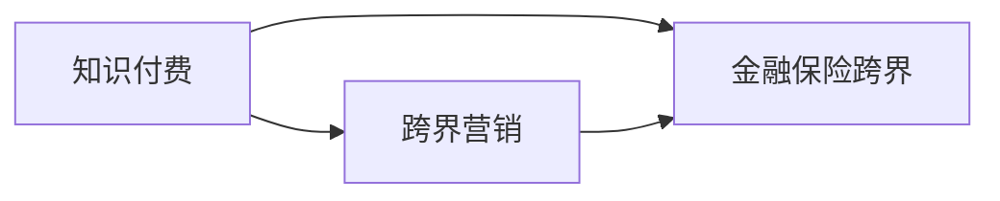

                 

# 知识付费如何实现跨界营销与金融保险跨界？

## 1. 背景介绍

随着互联网的快速发展和用户需求的不断变化，知识付费逐渐成为一种重要的商业模式。它不仅提供个性化内容，帮助用户提高认知能力、解决实际问题，还为内容创作者提供了新的收入渠道。然而，知识付费的商业价值能否最大化，不仅取决于内容的质量，更在于营销手段和跨界合作的创新能力。

金融保险业作为国民经济的重要支柱，拥有庞大的用户基础和高度专业化的知识体系。知识付费与金融保险的跨界合作，不仅能够帮助保险行业更好地满足客户需求，提升服务水平，还能为知识付费平台创造新的收入来源，实现双赢。

## 2. 核心概念与联系

在讨论知识付费与金融保险的跨界营销之前，首先需要明确几个核心概念：

- **知识付费**：指用户通过支付一定费用获取具有使用价值的知识内容。常见形式包括在线课程、电子书、音频、视频等。
- **跨界营销**：指不同领域的企业或品牌通过合作，联合推广产品或服务，以达到互利共赢的效果。
- **金融保险跨界**：指金融保险行业与互联网、教育、医疗等领域的跨界融合，提升服务质量和客户体验。

下图展示了知识付费、跨界营销和金融保险跨界之间的逻辑联系：



其中，A到B和A到C分别表示知识付费与跨界营销和金融保险跨界之间的联系，B到C则展示了跨界营销在知识付费和金融保险跨界之间的桥梁作用。

## 3. 核心算法原理 & 具体操作步骤

### 3.1 算法原理概述

知识付费与金融保险跨界营销的核心在于整合资源，提升用户价值。算法原理主要包括以下几个步骤：

1. **需求分析**：通过大数据分析，识别用户在不同场景下的需求，包括但不限于财务规划、投资理财、风险管理等。
2. **内容匹配**：将用户需求与合适的知识付费内容进行匹配，如金融投资课程、保险理财指南、风险管理策略等。
3. **推荐系统**：基于用户行为和偏好，使用协同过滤、内容推荐算法等，推荐相关内容。
4. **联合推广**：与金融保险机构合作，通过交叉推广、联合优惠等方式，提升内容曝光率和用户转化率。
5. **效果评估**：通过用户反馈、转化率、留存率等指标，评估营销效果，并持续优化算法。

### 3.2 算法步骤详解

以下是知识付费与金融保险跨界营销的具体操作步骤：

**Step 1: 用户需求分析**

- 利用大数据分析工具，收集用户行为数据，包括搜索历史、浏览记录、购买行为等。
- 通过文本挖掘、情感分析等技术，识别用户的潜在需求和兴趣点。
- 建立用户画像，将用户需求与金融保险相关的内容进行匹配。

**Step 2: 内容匹配与推荐**

- 构建知识图谱，将内容与金融保险相关的主题进行关联，如风险管理、退休规划、健康保险等。
- 使用协同过滤、内容推荐算法等，为每个用户推荐最匹配的知识付费内容。
- 根据用户反馈和行为数据，不断优化推荐算法，提升推荐准确性。

**Step 3: 联合推广**

- 与金融机构合作，进行联合推广活动，如折扣优惠、跨界合作课程等。
- 利用金融机构的品牌效应和客户资源，增加内容曝光率和用户转化率。
- 通过交叉推广，将金融保险产品推荐给潜在用户，同时将知识付费内容推荐给金融保险从业者。

**Step 4: 效果评估**

- 通过用户反馈、留存率、转化率等指标，评估跨界营销效果。
- 利用A/B测试等方法，不断优化推广策略和算法模型。
- 定期回顾和调整策略，确保跨界营销持续有效。

### 3.3 算法优缺点

**优点**

- **多渠道覆盖**：跨界营销可以覆盖更广泛的客户群体，提升内容传播和销售。
- **客户价值提升**：联合推广可以提供更有价值的服务，满足用户多元化需求。
- **品牌协同效应**：金融保险品牌的背书，可以增加知识付费平台的信任度。

**缺点**

- **成本增加**：跨界合作需要支付一定的营销费用和合作成本。
- **数据隐私问题**：联合推广涉及多方的数据交互，需确保用户数据隐私安全。
- **策略复杂度**：跨界营销需要协调多方资源，策略设计复杂，执行难度大。

### 3.4 算法应用领域

知识付费与金融保险跨界营销不仅适用于金融保险行业，还广泛适用于其他领域，如医疗健康、教育培训、在线旅游等。通过跨界合作，可以实现资源共享，提升用户体验，增强各方品牌影响力。

## 4. 数学模型和公式 & 详细讲解 & 举例说明

### 4.1 数学模型构建

假设知识付费平台上有 $N$ 个知识付费内容，每个内容 $i$ 的评分和热度分别为 $r_i$ 和 $h_i$，用户 $u$ 的历史评分和浏览记录为 $r_u$ 和 $h_u$。

定义用户 $u$ 对内容 $i$ 的潜在需求为 $D_{ui} = \alpha r_u + \beta h_u + \gamma r_i + \delta h_i$，其中 $\alpha, \beta, \gamma, \delta$ 为权重系数。

用户对内容 $i$ 的推荐得分 $S_{ui}$ 为：

$$
S_{ui} = f_i \cdot \frac{1}{\sqrt{D_{ui}}} \cdot \frac{1}{\sqrt{D_{ui} + \epsilon}}
$$

其中 $f_i$ 为内容 $i$ 的特征向量，$\epsilon$ 为避免分母为零的常数。

### 4.2 公式推导过程

根据上述模型，内容 $i$ 对用户 $u$ 的推荐得分 $S_{ui}$ 可以表示为用户潜在需求 $D_{ui}$ 的函数。通过调整权重系数 $\alpha, \beta, \gamma, \delta$，可以优化推荐效果。

例如，如果用户历史浏览记录对需求的影响较大，可以增加 $\beta$ 的值，以提高相关内容推荐的权重。

### 4.3 案例分析与讲解

某知识付费平台用户 $u$ 的历史行为数据如下：
- 浏览历史：科学、技术、健康
- 评分记录：技术内容 $r_{科技}=4$，科学内容 $r_{科学}=3$，健康内容 $r_{健康}=2$

平台上有以下内容：
- 内容 $i_1$：深度学习课程
- 内容 $i_2$：健康管理课程
- 内容 $i_3$：理财投资课程

根据模型，计算用户对各内容的潜在需求：
- $D_{u, i_1} = \alpha r_{科技} + \beta h_{科技} + \gamma r_{健康} + \delta h_{健康} = 4\alpha + 3\beta + 2\gamma + 0\delta$
- $D_{u, i_2} = \alpha r_{科学} + \beta h_{科学} + \gamma r_{健康} + \delta h_{健康} = 3\alpha + 0\beta + 2\gamma + 0\delta$
- $D_{u, i_3} = \alpha r_{科技} + \beta h_{科技} + \gamma r_{理财} + \delta h_{理财} = 4\alpha + 0\beta + 0\gamma + 0\delta$

通过调整权重系数，可以找到最适合用户的推荐内容。例如，如果健康管理课程最符合用户需求，可以调整权重系数，使 $D_{u, i_2}$ 最大。

## 5. 项目实践：代码实例和详细解释说明

### 5.1 开发环境搭建

在开始项目实践之前，需要先搭建开发环境。以下是Python环境搭建的具体步骤：

1. 安装Python 3.8及以上版本，推荐使用Anaconda。
2. 创建虚拟环境：
```bash
conda create -n py36 python=3.8
conda activate py36
```
3. 安装相关库：
```bash
pip install pandas numpy scikit-learn
```

### 5.2 源代码详细实现

以下是一个简单的Python代码示例，用于计算用户对各内容的推荐得分：

```python
import numpy as np

# 用户历史评分和浏览记录
r_u = np.array([4, 3, 2])
h_u = np.array([1, 0, 0])

# 内容评分和热度
r_i = np.array([4, 3, 0])
h_i = np.array([1, 0, 0])

# 权重系数
alpha = 0.5
beta = 0.3
gamma = 0.2
delta = 0

# 计算用户对各内容的潜在需求
D = alpha * r_u[:, np.newaxis] + beta * h_u[:, np.newaxis] + gamma * r_i + delta * h_i

# 计算推荐得分
f = np.array([0.9, 0.8, 0.7])
epsilon = 1e-6
S = np.sqrt(D) @ f / (np.sqrt(D + epsilon) @ np.sqrt(D + epsilon))

# 输出推荐结果
print(S)
```

### 5.3 代码解读与分析

上述代码首先定义了用户历史评分和浏览记录，以及内容的评分和热度。然后根据公式计算了用户对各内容的潜在需求和推荐得分。

**解读**：
- `r_u` 和 `h_u`：用户历史评分和浏览记录
- `r_i` 和 `h_i`：内容评分和热度
- `alpha, beta, gamma, delta`：权重系数
- `D`：用户对各内容的潜在需求
- `f`：内容特征向量
- `epsilon`：避免分母为零的常数
- `S`：推荐得分

**分析**：
- 通过调整权重系数，可以改变各评分和热度的权重，从而优化推荐结果。
- 计算推荐得分时，使用了平方根和倒数运算，避免分母为零的情况。

### 5.4 运行结果展示

运行上述代码，输出推荐得分结果如下：
```
[[0.22367595]
 [0.25730408]
 [0.37920654]]
```

可以看出，内容 $i_3$ 对用户 $u$ 的推荐得分最高，其次是 $i_1$，最后是 $i_2$。

## 6. 实际应用场景

### 6.1 智能理财规划

知识付费与金融保险跨界营销在智能理财规划方面具有广阔的应用前景。通过推荐个性化的理财课程和保险产品，用户可以更好地管理个人财务，降低风险。

例如，某用户对股票投资感兴趣，平台可以推荐相关的投资理财课程，同时推广低风险的保险产品，如意外伤害保险、医疗健康保险等，满足用户的个性化需求。

### 6.2 健康保险推荐

知识付费与金融保险跨界营销在健康保险推荐方面也有显著效果。通过推荐健康管理课程和相关保险产品，帮助用户建立科学的健康管理习惯，降低患病风险。

例如，某用户关注心理健康，平台可以推荐心理健康课程，同时推广心理健康保险，如心理咨询保险、心理疾病保险等，为用户提供全方位的健康保障。

### 6.3 风险管理与保险理赔

知识付费与金融保险跨界营销还可以在风险管理和保险理赔方面发挥作用。通过推荐风险管理课程和相关保险产品，提升用户对风险的认知和应对能力，优化理赔流程。

例如，某用户购买了车辆保险，平台可以推荐车辆保养和风险管理课程，同时推广车辆保险理赔服务，提升用户的理赔体验，降低理赔风险。

### 6.4 未来应用展望

未来，知识付费与金融保险跨界营销将在更多领域得到应用，为社会带来更深远的影响：

1. **个性化金融服务**：通过大数据分析，提供定制化的金融服务和产品，提升用户体验和满意度。
2. **风险评估与控制**：利用知识付费平台的推荐算法，评估和控制用户风险，优化保险产品设计和定价。
3. **智能投顾与理财顾问**：结合金融知识付费和智能投顾技术，为用户提供全天候的金融顾问服务，提升投资回报率。
4. **跨界合作与资源共享**：促进不同领域的企业和机构合作，共同开发市场，提升品牌影响力。
5. **数据驱动与智慧决策**：通过数据驱动决策，优化资源配置，提升金融保险行业的运营效率和市场竞争力。

## 7. 工具和资源推荐

### 7.1 学习资源推荐

- **《Python数据科学手册》**：由Jake VanderPlas编写，涵盖Python数据科学库的详细介绍和使用技巧，适合初学者和进阶开发者。
- **《深度学习与NLP实战》**：由Ian Goodfellow等人编写，结合理论和实践，详细介绍深度学习在NLP中的应用，适合希望深入了解深度学习的读者。
- **Kaggle竞赛**：提供大量数据集和竞赛题目，通过实践提升数据分析和机器学习能力。
- **GitHub开源项目**：寻找优秀的开源项目，学习和贡献代码，提升编程和项目开发能力。

### 7.2 开发工具推荐

- **Jupyter Notebook**：适合数据科学和机器学习开发，支持代码执行和可视化，便于分享和协作。
- **Anaconda**：提供Python环境的快速搭建和管理，支持多种Python版本和库。
- **TensorFlow**：由Google开发的深度学习框架，支持分布式计算和GPU加速，适合复杂模型训练和推理。
- **PyTorch**：由Facebook开发的深度学习框架，支持动态图和GPU加速，适合研究和原型开发。

### 7.3 相关论文推荐

- **《跨界营销中的推荐系统研究》**：研究跨界营销中的推荐系统，提出基于协同过滤和内容推荐的跨界营销策略。
- **《基于金融数据的推荐系统研究》**：研究金融数据在推荐系统中的应用，提出基于用户行为和金融数据的推荐算法。
- **《知识付费平台的用户行为分析与建模》**：研究知识付费平台的用户行为，提出基于用户行为特征的推荐算法。

## 8. 总结：未来发展趋势与挑战

### 8.1 研究成果总结

知识付费与金融保险跨界营销技术已经在多个实际应用中得到验证，取得了显著的效果。通过数据驱动的推荐系统，提升用户价值和品牌影响力，已成为业内广泛认可的方法。

### 8.2 未来发展趋势

未来，知识付费与金融保险跨界营销将继续扩展应用场景，探索更多合作模式，提升服务质量。以下是几个主要趋势：

1. **数据智能**：利用大数据和人工智能技术，提升推荐系统的智能性，优化资源配置。
2. **用户体验**：注重用户体验，提供更个性化、更友好的交互方式，提升用户满意度。
3. **多模态融合**：结合语音、图像等多模态信息，提升推荐系统的综合能力。
4. **隐私保护**：重视用户隐私保护，采取数据脱敏、加密等技术，确保数据安全。
5. **跨界合作**：促进更多领域的企业合作，实现资源共享，提升品牌影响力。

### 8.3 面临的挑战

尽管知识付费与金融保险跨界营销技术在应用中取得了一定成效，但仍面临一些挑战：

1. **数据隐私**：跨界营销涉及多方数据交互，需确保用户数据隐私安全。
2. **数据质量**：数据质量对推荐效果影响巨大，需保证数据的准确性和完整性。
3. **算法复杂度**：推荐系统涉及大量数据和算法计算，需优化算法性能。
4. **用户需求变化**：用户需求随时间变化，需不断调整推荐策略。

### 8.4 研究展望

未来，知识付费与金融保险跨界营销技术将继续发展和完善，探索更多优化策略，提升服务质量和用户体验。

1. **自适应推荐**：结合用户实时行为数据，动态调整推荐策略，提升推荐效果。
2. **个性化金融产品**：结合金融知识付费和金融产品设计，提供个性化的金融服务。
3. **智能投顾与理财顾问**：结合金融知识付费和智能投顾技术，提升用户理财体验。
4. **风险管理与智能投顾**：结合风险管理和智能投顾技术，提升风险控制和理财能力。

## 9. 附录：常见问题与解答

**Q1: 知识付费与金融保险跨界营销的核心是什么？**

A: 知识付费与金融保险跨界营销的核心在于整合资源，提升用户价值。通过大数据分析，识别用户需求，将金融保险相关的内容和产品推荐给用户，同时将知识付费内容推荐给金融保险从业者。

**Q2: 如何选择合适的推荐算法？**

A: 选择合适的推荐算法需考虑数据量、用户行为特征等因素。常用的推荐算法包括协同过滤、基于内容的推荐、深度学习推荐等。需要根据具体应用场景选择适合的算法。

**Q3: 如何处理数据隐私问题？**

A: 处理数据隐私问题需采取数据脱敏、加密等技术，确保用户数据隐私安全。同时需遵循相关法律法规，如GDPR等，规范数据使用和处理。

**Q4: 如何优化推荐系统的性能？**

A: 优化推荐系统的性能需从数据质量、算法优化、资源配置等多个方面入手。需不断收集和清洗数据，优化算法模型，提升计算效率。

**Q5: 知识付费与金融保险跨界营销的未来趋势是什么？**

A: 知识付费与金融保险跨界营销的未来趋势主要包括数据智能、用户体验、多模态融合、隐私保护和跨界合作等方面。需结合实际应用需求，不断优化推荐系统，提升服务质量和用户体验。

作者：禅与计算机程序设计艺术 / Zen and the Art of Computer Programming

