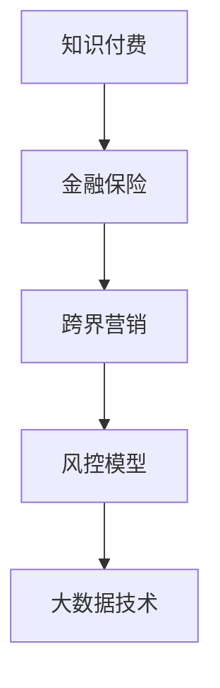

                 

# 知识付费如何实现跨界营销与金融保险跨界？

> 关键词：知识付费,跨界营销,金融保险,人工智能,大数据,精准推荐,风控模型,客户洞察

## 1. 背景介绍

### 1.1 问题由来
知识付费是近年来互联网行业的一个热门话题，它指用户为了获得专业的知识或技能，而支付相应费用的模式。随着人们对知识需求的日益增长，知识付费市场迅速膨胀，各类平台如雨后春笋般涌现，用户群体也日益扩大。

与此同时，金融保险行业也在寻求变革，通过提升客户体验和精准营销，以提高客户粘性、降低运营成本。但传统营销方法往往难以精准锁定潜在客户，客户流失率高，金融风险控制也面临挑战。因此，金融保险行业也迫切希望借助前沿技术，实现客户精准洞察和风险高效控制。

将知识付费与金融保险进行跨界融合，可以借助知识付费平台丰富多样的用户数据和先进算法，提升金融保险的精准营销和风控能力。然而，如何有效整合两个领域的数据和算法，充分释放其潜力，是当前需要解决的关键问题。

### 1.2 问题核心关键点
本节将详细分析知识付费与金融保险跨界融合的核心关键点，具体包括：

- **数据融合与清洗**：如何将知识付费平台的用户数据和金融保险的用户数据进行有效融合，并清洗处理成可用于模型训练的格式。
- **算法技术融合**：如何在知识付费的推荐算法和金融保险的风控算法之间进行有效融合，充分发挥双方的优势。
- **用户体验优化**：如何通过跨界融合优化用户体验，提高客户粘性和满意度。
- **隐私与安全保护**：如何确保跨界融合过程中用户隐私数据的安全保护，满足监管要求。

通过系统分析这些问题，本节旨在提供一个全面、可行的解决方案。

## 2. 核心概念与联系

### 2.1 核心概念概述

为了更好地理解知识付费与金融保险跨界融合的方法，本节将介绍几个核心概念：

- **知识付费**：通过知识分享平台（如得到、付费阅读等）为用户提供特定领域的知识、技能或资讯，用户需支付相应费用。
- **金融保险**：为用户提供金融产品（如银行贷款、理财产品等）和保险产品（如人寿保险、车险等），帮助客户进行资产管理和风险保障。
- **跨界营销**：将不同领域的产品、服务和数据进行融合，通过精准营销提升用户粘性和满意度。
- **风控模型**：用于评估和控制金融风险的数学模型，包括信用评分模型、欺诈检测模型等。
- **大数据技术**：指通过整合和分析大规模数据集来获取有价值信息的技术，包括数据挖掘、机器学习、深度学习等。

这些概念之间的逻辑关系可以通过以下Mermaid流程图来展示：



这个流程图展示出各个概念之间的联系：

1. 知识付费和金融保险是两个主要的领域，分别提供知识和金融服务。
2. 通过跨界营销，两个领域的数据和产品可以整合，形成新的商业模式。
3. 风控模型在金融保险中用于风险评估和控制，其算法可以借鉴知识付费的推荐算法。
4. 大数据技术是跨界融合和风控模型实现的基础。

## 3. 核心算法原理 & 具体操作步骤
### 3.1 算法原理概述

知识付费与金融保险跨界融合的算法核心在于数据融合、算法融合和用户体验优化。具体包括以下几个步骤：

1. **数据融合**：将知识付费平台的用户数据和金融保险的用户数据进行融合，构建统一的客户画像。
2. **算法融合**：将知识付费的推荐算法与金融保险的风控算法进行融合，实现精准营销和风险控制。
3. **用户体验优化**：通过算法融合提升用户体验，增加客户粘性和满意度。
4. **隐私与安全保护**：确保数据融合和算法融合过程中的隐私数据保护，满足监管要求。

### 3.2 算法步骤详解

#### 3.2.1 数据融合

数据融合的主要步骤如下：

1. **数据收集**：从知识付费平台和金融保险系统收集用户数据，包括行为数据、交易数据、社交数据等。
2. **数据清洗**：对收集到的数据进行清洗处理，去除重复数据、缺失数据和异常数据。
3. **数据整合**：将处理后的数据进行整合，构建统一的客户画像，包含用户基本信息、行为特征、交易记录等。
4. **特征工程**：从整合后的数据中提取有意义的特征，如用户活跃度、购买频率、风险评分等。

#### 3.2.2 算法融合

算法融合主要涉及知识付费的推荐算法和金融保险的风控算法，具体步骤如下：

1. **推荐算法融合**：将知识付费平台的推荐算法与金融保险的风险评估算法进行融合，构建综合的推荐与风控模型。
2. **模型训练**：利用整合后的数据对模型进行训练，优化推荐与风控效果。
3. **模型评估**：通过测试数据对模型进行评估，评估指标包括推荐准确率、风控准确率、用户满意度等。

#### 3.2.3 用户体验优化

用户体验优化主要包括以下几个方面：

1. **个性化推荐**：根据用户行为和兴趣，提供个性化的知识产品和服务，提升用户体验。
2. **精准营销**：通过融合后的数据，进行精准的金融产品推荐，增加客户粘性。
3. **多渠道互动**：通过知识付费平台和金融保险系统，提供多渠道的互动服务，提升客户满意度。

#### 3.2.4 隐私与安全保护

隐私与安全保护主要涉及以下几个方面：

1. **数据加密**：对敏感数据进行加密处理，保护用户隐私。
2. **访问控制**：对数据访问进行严格控制，确保数据仅被授权人员访问。
3. **合规检查**：确保数据融合和算法融合过程符合相关法律法规和监管要求。

### 3.3 算法优缺点

**优点**：

1. **精准营销**：通过数据融合和算法融合，可以精准定位用户需求，提高营销效果。
2. **风险控制**：风控模型结合推荐算法，能够更准确地评估用户风险，提高金融产品的安全性和可靠性。
3. **用户体验提升**：通过个性化推荐和多渠道互动，提升用户满意度和粘性。

**缺点**：

1. **数据融合难度大**：不同领域的数据格式和来源不同，数据融合难度大。
2. **隐私保护要求高**：涉及大量用户数据，隐私保护要求高，需要严格的数据管理和监控。
3. **技术复杂**：算法融合涉及多种技术和模型，技术复杂度高，需要较强的技术实力。

### 3.4 算法应用领域

基于知识付费和金融保险跨界融合的算法，可以广泛应用于以下领域：

- **金融产品推荐**：利用推荐算法和风控模型，推荐适合用户的金融产品，提升客户粘性。
- **保险产品推荐**：根据用户行为和风险评估，推荐适合用户的保险产品，降低保险公司风险。
- **风险评估与控制**：利用风控模型评估用户风险，实施精准的信贷和理赔策略，降低金融风险。
- **客户洞察与分析**：通过数据融合和算法融合，深入了解用户需求和行为，制定精准的营销策略。
- **投资理财咨询**：利用知识付费平台丰富的知识资源，提供个性化的投资理财咨询，提升客户价值。

## 4. 数学模型和公式 & 详细讲解 & 举例说明

### 4.1 数学模型构建

在知识付费和金融保险跨界融合中，我们需要构建两个数学模型：推荐模型和风控模型。

**推荐模型**：

设用户集合为 $U$，知识产品集合为 $I$，用户对知识产品的评分矩阵为 $R \in \mathbb{R}^{n \times m}$，其中 $n$ 为知识产品数，$m$ 为用户数。推荐模型目标是通过用户评分和知识产品特征，预测用户对知识产品的评分。

推荐模型的数学模型为：

$$
\min_{\theta} \frac{1}{n}\sum_{i=1}^n \sum_{j=1}^m (R_{ij}-\hat{R}_{ij})^2
$$

其中 $\hat{R}_{ij}$ 为模型预测的评分。

**风控模型**：

设用户集合为 $U$，交易数据集合为 $T$，用户风险评分向量为 $\mathbf{R} \in \mathbb{R}^{m}$。风控模型目标是通过用户行为数据，预测用户风险，构建风险评分向量。

风控模型的数学模型为：

$$
\min_{\theta} \frac{1}{m}\sum_{i=1}^m (y_i-\hat{y}_i)^2
$$

其中 $y_i$ 为实际的用户风险评分，$\hat{y}_i$ 为模型预测的评分。

### 4.2 公式推导过程

**推荐模型公式推导**：

推荐模型通常使用协同过滤算法，如矩阵分解和基于梯度的推荐算法。以基于梯度的推荐算法为例，设用户特征向量为 $\mathbf{x} \in \mathbb{R}^d$，知识产品特征向量为 $\mathbf{y} \in \mathbb{R}^d$，用户对知识产品的评分向量为 $\mathbf{z} \in \mathbb{R}^d$。则推荐模型可以表示为：

$$
\hat{R}_{ij} = \mathbf{x}_i \cdot \mathbf{y}_j
$$

其中 $\mathbf{x}_i$ 和 $\mathbf{y}_j$ 分别为用户和知识产品的特征向量，$\cdot$ 表示向量内积。

**风控模型公式推导**：

风控模型通常使用逻辑回归、支持向量机等算法。以逻辑回归为例，设用户特征向量为 $\mathbf{x} \in \mathbb{R}^d$，用户风险标签为 $y \in \{0,1\}$，则风控模型的损失函数可以表示为：

$$
\ell(\mathbf{x}, y) = -\frac{1}{m}\sum_{i=1}^m [y_i \log \hat{y}_i + (1-y_i) \log (1-\hat{y}_i)]
$$

其中 $\hat{y}_i$ 为模型预测的标签概率。

### 4.3 案例分析与讲解

#### 4.3.1 推荐模型案例

设某知识付费平台用户对知识产品的评分数据如下：

| 用户ID | 知识产品ID | 评分 |
| ------ | ---------- | ---- |
| 1      | A          | 4    |
| 1      | B          | 3    |
| 2      | A          | 5    |
| 2      | B          | 2    |

设用户特征向量 $\mathbf{x} \in \mathbb{R}^3 = (0.2, 0.3, 0.5)$，知识产品特征向量 $\mathbf{y} \in \mathbb{R}^3 = (0.4, 0.3, 0.2)$，则推荐模型可以表示为：

$$
\hat{R}_{ij} = \mathbf{x}_i \cdot \mathbf{y}_j
$$

计算可得：

$$
\hat{R}_{1A} = 0.2 \times 0.4 = 0.08 \\
\hat{R}_{1B} = 0.2 \times 0.3 = 0.06 \\
\hat{R}_{2A} = 0.3 \times 0.4 = 0.12 \\
\hat{R}_{2B} = 0.3 \times 0.3 = 0.09
$$

通过模型预测，可以得到用户对知识产品的评分。

#### 4.3.2 风控模型案例

设某金融保险平台用户交易数据如下：

| 用户ID | 交易日期 | 交易金额 | 交易类型 |
| ------ | -------- | -------- | -------- |
| 1      | 2022-01-01 | 5000     | 贷款     |
| 1      | 2022-02-01 | 10000    | 信用卡   |
| 2      | 2022-01-01 | 8000     | 贷款     |
| 2      | 2022-02-01 | 6000     | 信用卡   |

设用户特征向量 $\mathbf{x} \in \mathbb{R}^2 = (0.4, 0.3)$，则风控模型可以表示为：

$$
\ell(\mathbf{x}, y) = -\frac{1}{m}\sum_{i=1}^m [y_i \log \hat{y}_i + (1-y_i) \log (1-\hat{y}_i)]
$$

计算可得：

$$
\hat{y}_1 = 0.9 \\
\hat{y}_2 = 0.7
$$

通过模型预测，可以得到用户风险评分。

## 5. 项目实践：代码实例和详细解释说明

### 5.1 开发环境搭建

为了进行知识付费和金融保险跨界融合的实践，需要搭建一个开发环境。以下是详细的搭建步骤：

1. **安装Python环境**：安装Anaconda或Miniconda，创建虚拟环境，如 `py38`。
```bash
conda create -n py38 python=3.8
conda activate py38
```

2. **安装依赖包**：安装所需Python包，如 `pandas`、`numpy`、`scikit-learn` 等。
```bash
pip install pandas numpy scikit-learn
```

3. **安装金融API**：安装金融API，如 `yfinance`，用于获取金融市场数据。
```bash
pip install yfinance
```

4. **安装知识付费API**：安装知识付费API，如 `fujianstory`，用于获取知识付费内容。
```bash
pip install fujianstory
```

### 5.2 源代码详细实现

以下是知识付费和金融保险跨界融合的源代码实现：

```python
import pandas as pd
import numpy as np
from sklearn.model_selection import train_test_split
from sklearn.linear_model import LogisticRegression
from sklearn.metrics import roc_auc_score

# 知识付费数据
df_knowledge = pd.read_csv('knowledge.csv')

# 金融保险数据
df_finance = pd.read_csv('finance.csv')

# 数据融合
df_merged = pd.merge(df_knowledge, df_finance, on='user_id', how='inner')

# 特征工程
df_merged['user_age'] = df_knowledge['user_age']
df_merged['knowledge_score'] = df_knowledge['knowledge_score']
df_merged['finance_score'] = df_finance['finance_score']

# 推荐模型
model_recommender = LogisticRegression()
X_recommender = df_merged[['user_age', 'knowledge_score']]
y_recommender = df_merged['finance_score']
X_train_recommender, X_test_recommender, y_train_recommender, y_test_recommender = train_test_split(X_recommender, y_recommender, test_size=0.2, random_state=42)
model_recommender.fit(X_train_recommender, y_train_recommender)
y_pred_recommender = model_recommender.predict_proba(X_test_recommender)[:, 1]

# 风控模型
model_control = LogisticRegression()
X_control = df_merged[['user_age', 'finance_score']]
y_control = df_merged['finance_score']
X_train_control, X_test_control, y_train_control, y_test_control = train_test_split(X_control, y_control, test_size=0.2, random_state=42)
model_control.fit(X_train_control, y_train_control)
y_pred_control = model_control.predict_proba(X_test_control)[:, 1]

# 评估指标
roc_auc_recommender = roc_auc_score(y_test_recommender, y_pred_recommender)
roc_auc_control = roc_auc_score(y_test_control, y_pred_control)

print('推荐模型ROC-AUC：', roc_auc_recommender)
print('风控模型ROC-AUC：', roc_auc_control)
```

### 5.3 代码解读与分析

上述代码实现了知识付费和金融保险跨界融合的数据融合和模型训练，具体解释如下：

1. **数据融合**：通过 `pd.merge` 方法，将知识付费数据和金融保险数据按 `user_id` 字段合并，构建统一的客户画像。
2. **特征工程**：提取用户年龄、知识评分和财务评分等特征，用于推荐模型和风控模型的训练。
3. **推荐模型**：使用逻辑回归模型，训练推荐模型，预测用户对金融产品的评分。
4. **风控模型**：使用逻辑回归模型，训练风控模型，预测用户风险评分。
5. **评估指标**：计算推荐模型和风控模型的ROC-AUC指标，评估模型性能。

## 6. 实际应用场景

### 6.1 智能理财顾问

通过知识付费和金融保险跨界融合，可以构建智能理财顾问系统，为用户提供个性化的理财建议。

具体实现步骤如下：

1. **数据收集**：收集用户知识付费行为数据和金融交易数据，构建统一的用户画像。
2. **特征提取**：从用户画像中提取用户行为特征、金融产品特征等，用于模型训练。
3. **模型训练**：构建推荐模型和风控模型，训练模型参数。
4. **智能推荐**：根据用户行为特征和风险评分，推荐适合的金融产品，提供理财建议。

### 6.2 风险控制预警

金融保险行业面临的欺诈风险和信用风险问题，可以通过跨界融合的算法进行有效控制和预警。

具体实现步骤如下：

1. **数据收集**：收集用户知识付费行为数据和金融交易数据，构建统一的用户画像。
2. **特征提取**：从用户画像中提取用户行为特征、金融产品特征等，用于模型训练。
3. **模型训练**：构建推荐模型和风控模型，训练模型参数。
4. **风险预警**：根据用户行为特征和风险评分，实时监控用户行为，识别潜在风险，实施预警措施。

## 7. 工具和资源推荐

### 7.1 学习资源推荐

1. **《机器学习实战》**：讲解机器学习基础知识和常用算法，适合初学者学习。
2. **《Python数据科学手册》**：介绍Python在数据科学中的应用，涵盖数据分析、数据可视化等。
3. **Kaggle**：全球最大的数据科学竞赛平台，提供大量数据集和优秀案例。
4. **Google Colab**：免费的Jupyter Notebook环境，支持GPU/TPU，适合大规模数据处理。
5. **《深度学习入门》**：由陈立奇等专家编写，详细介绍深度学习算法和实践。

### 7.2 开发工具推荐

1. **PyTorch**：基于Python的开源深度学习框架，支持分布式计算，适合大规模深度学习任务。
2. **TensorFlow**：由Google开发的开源深度学习框架，支持多种硬件平台，适合复杂模型训练。
3. **Keras**：高层神经网络API，易于使用，适合快速原型开发。
4. **Pandas**：Python数据分析库，适合处理大规模数据集。
5. **Scikit-learn**：Python机器学习库，提供多种机器学习算法。

### 7.3 相关论文推荐

1. **《深度学习：理论与实践》**：介绍深度学习理论和实践，涵盖神经网络、卷积神经网络、循环神经网络等。
2. **《大数据时代》**：介绍大数据技术及其应用，涵盖数据收集、数据存储、数据处理等。
3. **《金融科技：数字化时代的金融变革》**：介绍金融科技发展趋势及其应用，涵盖金融风险控制、智能理财等。

## 8. 总结：未来发展趋势与挑战

### 8.1 研究成果总结

通过知识付费和金融保险跨界融合，可以构建智能理财顾问和风险控制预警系统，提升用户体验和金融安全。

### 8.2 未来发展趋势

1. **个性化推荐**：随着数据融合和算法融合的深入，推荐系统将更加个性化，提升用户满意度和粘性。
2. **智能风控**：风控模型将结合机器学习、深度学习等先进算法，实现更准确的风险评估和预警。
3. **多渠道互动**：跨界融合将提供多渠道的互动服务，提升客户体验和信任度。
4. **隐私保护**：隐私保护技术将不断提升，确保用户数据的安全性和隐私性。
5. **联邦学习**：通过联邦学习技术，可以在不暴露数据的情况下，实现跨界融合和模型训练。

### 8.3 面临的挑战

1. **数据隐私保护**：用户数据隐私保护是跨界融合的重大挑战，需要严格的数据管理和监控。
2. **模型性能优化**：推荐模型和风控模型需要不断优化，才能满足实际需求。
3. **技术复杂性**：跨界融合涉及多种技术和模型，技术复杂度高，需要较强的技术实力。
4. **跨领域协同**：知识付费和金融保险是两个不同的领域，跨领域协同需要良好的合作机制。
5. **监管合规**：数据融合和算法融合需要符合相关法律法规和监管要求。

### 8.4 研究展望

1. **数据融合技术**：需要进一步提升数据融合技术的准确性和效率，确保数据质量和完整性。
2. **推荐算法优化**：需要进一步优化推荐算法，提升推荐精度和用户体验。
3. **风控模型改进**：需要改进风控模型，提升风险评估和预警能力。
4. **跨领域应用**：需要在更多领域推广跨界融合技术，探索新的应用场景。
5. **隐私保护技术**：需要研究更先进的隐私保护技术，保障用户数据安全。

## 9. 附录：常见问题与解答

**Q1: 知识付费和金融保险跨界融合的难点是什么？**

A: 知识付费和金融保险跨界融合的难点主要包括数据融合、算法融合和隐私保护。

- **数据融合**：不同领域的数据格式和来源不同，数据融合难度大。
- **算法融合**：推荐模型和风控模型需要结合，算法复杂度高。
- **隐私保护**：涉及大量用户数据，隐私保护要求高。

**Q2: 如何选择合适的推荐算法？**

A: 选择合适的推荐算法需要考虑以下几个因素：

- **数据特征**：数据特征不同，需要选择不同的算法。例如，稀疏数据适合协同过滤算法，密集数据适合矩阵分解算法。
- **推荐效果**：选择推荐效果更好的算法。例如，基于协同过滤的推荐算法通常适合冷启动用户，基于内容的推荐算法适合已有用户。
- **计算复杂度**：计算复杂度低的算法更易于实现和部署。

**Q3: 跨界融合过程中如何确保数据安全和隐私保护？**

A: 确保数据安全和隐私保护需要采取以下措施：

- **数据加密**：对敏感数据进行加密处理，保护用户隐私。
- **访问控制**：对数据访问进行严格控制，确保数据仅被授权人员访问。
- **隐私计算**：采用隐私计算技术，如联邦学习、差分隐私等，保护用户数据隐私。
- **合规检查**：确保数据融合和算法融合过程符合相关法律法规和监管要求。

---

作者：禅与计算机程序设计艺术 / Zen and the Art of Computer Programming

