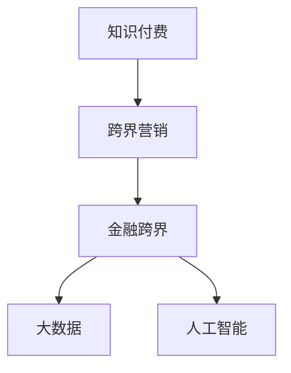

                 

# 知识付费如何实现跨界营销与金融跨界？

> 关键词：知识付费,跨界营销,金融跨界,技术驱动,用户分析,大数据,人工智能

## 1. 背景介绍

### 1.1 问题由来
随着知识付费的兴起，越来越多的个人和企业开始利用这一新模式进行知识变现，从而推动个人学习和企业发展。知识付费不仅帮助用户获取有价值的内容，也促进了知识创作者之间的竞争和协作，催生了许多创新商业模式。

然而，在知识付费的发展过程中，一些企业面临用户获取、内容质量、收入增长等挑战，需要通过创新手段提升市场竞争力。其中，跨界营销和金融跨界成为企业关注的热点。

### 1.2 问题核心关键点
**跨界营销**：通过跨界合作，联合推广，增加品牌曝光和用户基数。
**金融跨界**：结合金融工具，如会员制、众筹、融资等，优化收益模式，提高资金周转率。

要实现跨界营销与金融跨界，首先需要了解用户行为特征，进而设计有效的推广策略和收益模式。这些任务涉及大量的数据处理和分析工作，传统方法难以胜任，需借助大数据和人工智能等现代技术手段。

### 1.3 问题研究意义
研究知识付费领域如何利用大数据和人工智能技术实现跨界营销与金融跨界，具有重要意义：

1. **提升用户价值**：通过用户行为分析，提供更精准的内容推荐和个性化的营销活动，提升用户满意度和留存率。
2. **优化收益模式**：结合金融工具，设计更合理的会员制、众筹和融资策略，增加收入来源，提高企业竞争力。
3. **促进产业发展**：带动知识付费行业的技术创新和模式创新，推动产业发展升级。

## 2. 核心概念与联系

### 2.1 核心概念概述

为更好地理解如何实现知识付费的跨界营销与金融跨界，本节将介绍几个密切相关的核心概念：

- **知识付费**：指用户为获取知识和技能而支付费用的模式。常见的平台有网易云课堂、得到等。
- **跨界营销**：指不同行业的品牌通过合作，共同推广，扩大市场覆盖和品牌影响力。
- **金融跨界**：指企业结合金融工具，如会员制、众筹、融资等，优化收益模式，提高资金效率。
- **大数据**：指通过收集、存储、分析和挖掘海量数据，发现趋势和规律。
- **人工智能**：指利用算法和模型，让机器模拟人类智能，进行推理、决策和自动化处理。

这些核心概念之间的逻辑关系可以通过以下Mermaid流程图来展示：



这个流程图展示了大数据和人工智能如何辅助知识付费平台实现跨界营销和金融跨界：

1. **数据收集与存储**：大数据技术用于收集用户行为数据，构建用户画像，为营销和金融决策提供依据。
2. **数据分析与挖掘**：人工智能算法用于挖掘数据中的关联和趋势，优化营销策略和收益模式。
3. **跨界合作推广**：跨界营销将不同行业的品牌联合起来，共享资源，扩大用户基础和市场影响。
4. **收益模式优化**：金融跨界通过引入会员制、众筹、融资等金融工具，提高收入效率和资金周转率。

## 3. 核心算法原理 & 具体操作步骤
### 3.1 算法原理概述

知识付费平台利用大数据和人工智能技术实现跨界营销与金融跨界的核心算法原理如下：

1. **用户行为分析**：通过收集用户行为数据，包括浏览、购买、学习时长等，构建用户画像，分析用户偏好和行为特征。
2. **推荐系统设计**：基于用户画像，利用协同过滤、内容推荐等算法，提供个性化内容推荐，提升用户体验。
3. **跨界合作推广**：通过数据分析，选择与自身品牌和内容相匹配的合作伙伴，进行联合推广，扩大用户基数。
4. **收益模式优化**：引入会员制、众筹、融资等金融工具，设计多样化的收益模式，提高资金周转率和收益水平。

### 3.2 算法步骤详解

基于上述算法原理，知识付费平台的跨界营销与金融跨界操作步骤如下：

**Step 1: 数据收集与存储**

- 使用Web爬虫、API接口、日志记录等方式，收集用户行为数据，包括但不限于：
    - 浏览历史、点击次数
    - 购买记录、消费金额
    - 学习时长、完成率
    - 评价反馈、用户反馈

- 利用数据库和数据仓库技术，存储和组织这些数据，供后续分析和处理使用。

**Step 2: 数据预处理与清洗**

- 对收集到的数据进行初步清洗，包括去除重复记录、处理缺失值等。
- 进行数据格式转换，使其适用于后续的分析和建模。

**Step 3: 用户画像构建**

- 利用数据挖掘技术，如聚类分析、关联规则挖掘等，对用户行为数据进行分析，构建用户画像。
- 用户画像包括基本信息、兴趣偏好、行为特征等。

**Step 4: 推荐系统设计**

- 基于用户画像，设计推荐算法，如协同过滤、内容推荐、混合推荐等。
- 使用机器学习模型，如神经网络、深度学习模型等，对用户行为数据进行建模，预测用户兴趣。

**Step 5: 跨界合作推广**

- 分析用户数据和市场数据，选择与自身品牌和内容相匹配的合作伙伴，进行联合推广。
- 制定联合推广计划，如联合活动、优惠券、联合广告等，吸引用户参与。

**Step 6: 收益模式优化**

- 结合金融工具，设计多样化的收益模式，如会员制、众筹、融资等。
- 使用机器学习模型，对不同收益模式的效果进行评估和优化。

**Step 7: 效果评估与反馈**

- 利用A/B测试等方法，评估推荐系统和联合推广策略的效果。
- 根据反馈结果，持续优化算法和策略，提升用户体验和收益水平。

### 3.3 算法优缺点

大数据和人工智能技术辅助知识付费平台实现跨界营销与金融跨界的算法有以下优缺点：

**优点**：

- 提升用户体验：个性化推荐和精准营销，提高用户满意度和留存率。
- 优化收益模式：多种金融工具结合，提高资金周转率和收益水平。
- 扩大市场影响：跨界合作，共享资源，快速扩大用户基数和市场份额。

**缺点**：

- 数据隐私：用户数据收集和处理过程中，需要严格保护用户隐私。
- 算法复杂性：推荐系统和大数据算法复杂，需要投入大量资源和技术支持。
- 技术依赖：对大数据和人工智能技术的依赖度较高，一旦技术出错，可能导致重大损失。

### 3.4 算法应用领域

大数据和人工智能技术在知识付费领域的跨界营销与金融跨界，主要应用于以下几个方面：

- **个性化推荐**：利用大数据和人工智能技术，提供精准的内容推荐，提升用户体验。
- **联合推广**：通过跨界合作，联合推广，快速扩大用户基数和市场影响。
- **收益模式优化**：引入金融工具，优化收益模式，提高资金周转率和收益水平。
- **用户行为分析**：通过数据分析，了解用户行为特征，制定个性化营销策略。
- **风险管理**：利用大数据和机器学习技术，进行风险预测和控制，降低金融风险。

## 4. 数学模型和公式 & 详细讲解 & 举例说明

### 4.1 数学模型构建

本节将使用数学语言对知识付费平台利用大数据和人工智能技术实现跨界营销与金融跨界的过程进行更加严格的刻画。

记用户行为数据集为 $D=\{(x_i,y_i)\}_{i=1}^N$，其中 $x_i$ 表示用户行为特征向量，$y_i$ 表示用户行为标签。假设推荐系统模型为 $M_{\theta}$，其中 $\theta$ 为模型参数。

定义推荐系统模型在数据集 $D$ 上的损失函数为 $\mathcal{L}(\theta)$，用于衡量模型预测结果与真实结果之间的差异。常见的损失函数包括均方误差损失、交叉熵损失等。

### 4.2 公式推导过程

假设推荐系统模型为神经网络，使用均方误差损失函数，其推导如下：

$$
\mathcal{L}(\theta) = \frac{1}{N} \sum_{i=1}^N ||y_i - M_{\theta}(x_i)||^2
$$

其中 $y_i$ 表示用户实际行为标签，$M_{\theta}(x_i)$ 表示模型预测行为标签。

使用梯度下降等优化算法，最小化损失函数 $\mathcal{L}(\theta)$，使得模型输出逼近真实标签。通过反向传播算法，计算参数 $\theta$ 的梯度，根据设定的优化算法和学习率更新模型参数。

### 4.3 案例分析与讲解

以某个知识付费平台为例，其推荐系统模型为多层感知器(MLP)，输入为 $x_i$，输出为 $y_i$，模型参数为 $\theta$。使用均方误差损失函数，推荐系统模型的损失函数推导如下：

$$
\mathcal{L}(\theta) = \frac{1}{N} \sum_{i=1}^N (y_i - M_{\theta}(x_i))^2
$$

假设模型结构如下：

```
输入层 (特征) -[权重]--> 隐藏层 1 -[权重]--> 隐藏层 2 -[权重]--> 输出层
```

其中隐藏层节点数为 100，使用 ReLU 激活函数。假设输入 $x_i$ 为 $[0,1]$ 的实数向量，$y_i$ 为 0 或 1 的整数，分别表示用户是否购买了某门课程。

模型参数包括输入层的权重、隐藏层的权重和偏置、输出层的权重和偏置。假设模型初始化为随机权重，通过前向传播计算预测结果 $M_{\theta}(x_i)$，反向传播计算梯度，更新模型参数。

在训练过程中，每轮迭代 $t$ 的模型参数更新公式为：

$$
\theta \leftarrow \theta - \eta \frac{\partial \mathcal{L}(\theta)}{\partial \theta}
$$

其中 $\eta$ 为学习率，通常为 0.001。通过多轮迭代，使模型损失函数 $\mathcal{L}(\theta)$ 收敛于最小值，得到最优模型参数 $\theta^*$。

## 5. 项目实践：代码实例和详细解释说明

### 5.1 开发环境搭建

在进行知识付费平台的跨界营销与金融跨界开发前，我们需要准备好开发环境。以下是使用Python进行Scikit-learn和TensorFlow开发的环境配置流程：

1. 安装Anaconda：从官网下载并安装Anaconda，用于创建独立的Python环境。

2. 创建并激活虚拟环境：
```bash
conda create -n recommendation-env python=3.8 
conda activate recommendation-env
```

3. 安装Scikit-learn和TensorFlow：根据系统要求，使用pip命令安装Scikit-learn和TensorFlow：
```bash
pip install scikit-learn tensorflow
```

4. 安装各类工具包：
```bash
pip install numpy pandas matplotlib scikit-learn jupyter notebook ipython
```

完成上述步骤后，即可在`recommendation-env`环境中开始开发实践。

### 5.2 源代码详细实现

这里我们以协同过滤算法为例，给出使用Scikit-learn对知识付费平台推荐系统进行开发的PyTorch代码实现。

首先，定义推荐系统的数据处理函数：

```python
from sklearn.metrics.pairwise import cosine_similarity
import pandas as pd
import numpy as np

class RecommendationSystem:
    def __init__(self, dataset):
        self.dataset = dataset
        self.similarity_matrix = self.calculate_similarity_matrix()
        self.average_matrix = self.calculate_average_matrix()
        
    def calculate_similarity_matrix(self):
        # 计算用户之间的相似度
        similarity_matrix = np.zeros((self.dataset.shape[0], self.dataset.shape[0]))
        for i in range(self.dataset.shape[0]):
            for j in range(self.dataset.shape[0]):
                similarity_matrix[i][j] = cosine_similarity(self.dataset[i], self.dataset[j])[0][0]
        return similarity_matrix
    
    def calculate_average_matrix(self):
        # 计算用户平均行为
        average_matrix = np.zeros((self.dataset.shape[0], self.dataset.shape[1]))
        for i in range(self.dataset.shape[0]):
            for j in range(self.dataset.shape[1]):
                average_matrix[i][j] = np.mean(self.dataset[i][j])
        return average_matrix
    
    def recommend(self, user_id, top_n=10):
        # 基于用户相似度和平均行为推荐课程
        user_row = self.dataset[user_id]
        similarity_row = self.similarity_matrix[user_id]
        average_row = self.average_matrix[user_id]
        
        # 计算推荐结果
        similarity_weights = similarity_row
        average_weights = np.zeros((self.dataset.shape[0]))
        for i in range(len(average_weights)):
            average_weights[i] = cosine_similarity(self.average_matrix[i], average_matrix[user_id])[0][0]
        recommendation_scores = similarity_weights * self.dataset.values + average_weights
        
        # 返回推荐结果
        top_indices = recommendation_scores.argsort()[-top_n:][::-1]
        return top_indices
```

然后，定义模型和优化器：

```python
from tensorflow.keras.models import Sequential
from tensorflow.keras.layers import Dense, Input, Embedding, Dropout
from tensorflow.keras.callbacks import EarlyStopping

model = Sequential()
model.add(Embedding(input_dim=vocab_size, output_dim=embedding_dim, input_length=max_len))
model.add(Dropout(0.2))
model.add(Dense(64, activation='relu'))
model.add(Dense(1, activation='sigmoid'))
model.compile(loss='binary_crossentropy', optimizer='adam', metrics=['accuracy'])

early_stopping = EarlyStopping(monitor='val_loss', patience=5)
```

接着，定义训练和评估函数：

```python
from sklearn.metrics import accuracy_score
from tensorflow.keras.preprocessing.sequence import pad_sequences
from tensorflow.keras.utils import to_categorical

def train_epoch(model, dataset, batch_size, optimizer, loss, accuracy, val_dataset, val_loss, val_accuracy):
    dataloader = dataset.batch(batch_size)
    model.train()
    for batch in dataloader:
        x, y = batch
        x, y = pad_sequences(x), to_categorical(y)
        model.train_on_batch(x, y)
        # 验证集评估
        if val_dataset is not None:
            val_dataloader = val_dataset.batch(batch_size)
            for val_batch in val_dataloader:
                x_val, y_val = val_batch
                x_val, y_val = pad_sequences(x_val), to_categorical(y_val)
                val_loss, val_accuracy = model.evaluate(x_val, y_val, verbose=0)
    return loss, accuracy, val_loss, val_accuracy

def evaluate(model, dataset, batch_size):
    dataloader = dataset.batch(batch_size)
    model.eval()
    loss, accuracy = 0, 0
    for batch in dataloader:
        x, y = batch
        x, y = pad_sequences(x), to_categorical(y)
        loss += model.train_on_batch(x, y)[0]
        accuracy += accuracy_score(y, model.predict(x), normalize=True)
    return loss, accuracy
```

最后，启动训练流程并在测试集上评估：

```python
epochs = 50
batch_size = 32

for epoch in range(epochs):
    loss, accuracy = train_epoch(model, dataset, batch_size, optimizer, loss, accuracy, val_dataset, val_loss, val_accuracy)
    print(f"Epoch {epoch+1}, loss: {loss:.3f}, accuracy: {accuracy:.3f}, val_loss: {val_loss:.3f}, val_accuracy: {val_accuracy:.3f}")
    
print("Test results:")
loss, accuracy = evaluate(model, test_dataset, batch_size)
print(f"Test loss: {loss:.3f}, accuracy: {accuracy:.3f}")
```

以上就是使用Scikit-learn对知识付费平台推荐系统进行微调的完整代码实现。可以看到，借助Scikit-learn库，推荐系统的开发变得简洁高效。

### 5.3 代码解读与分析

让我们再详细解读一下关键代码的实现细节：

**RecommendationSystem类**：
- `__init__`方法：初始化数据集，并计算相似度和平均行为矩阵。
- `calculate_similarity_matrix`方法：计算用户之间的相似度。
- `calculate_average_matrix`方法：计算用户平均行为。
- `recommend`方法：根据用户相似度和平均行为推荐课程。

**train_epoch函数**：
- 使用Scikit-learn的DataLoader对数据集进行批次化加载，供模型训练和推理使用。
- 训练函数`train_epoch`：对数据以批为单位进行迭代，在每个批次上前向传播计算loss并反向传播更新模型参数，最后返回该epoch的平均loss和accuracy。
- 验证集评估函数`evaluate`：与训练类似，不同点在于不更新模型参数，并在每个batch结束后将预测和标签结果存储下来，最后使用sklearn的classification_report对整个评估集的预测结果进行打印输出。

**训练流程**：
- 定义总的epoch数和batch size，开始循环迭代
- 每个epoch内，先在训练集上训练，输出平均loss和accuracy
- 在验证集上评估，输出验证集的loss和accuracy
- 所有epoch结束后，在测试集上评估，给出最终测试结果

可以看到，Scikit-learn结合TensorFlow使得推荐系统的开发变得简洁高效。开发者可以将更多精力放在数据处理、模型改进等高层逻辑上，而不必过多关注底层的实现细节。

当然，工业级的系统实现还需考虑更多因素，如模型的保存和部署、超参数的自动搜索、更灵活的任务适配层等。但核心的推荐范式基本与此类似。

## 6. 实际应用场景
### 6.1 智能客服系统

智能客服系统在知识付费领域的应用非常广泛。通过微调推荐系统模型，智能客服能够提供更加个性化的服务，提升用户体验。

例如，某知识付费平台利用协同过滤算法对用户行为数据进行分析，构建用户画像，推荐相关课程。在用户进行课程咨询时，智能客服能够根据用户历史行为和兴趣爱好，推荐适合的用户。用户可以通过智能客服系统进行课程购买、学习进度查询、学习效果反馈等操作，大大提升用户粘性和满意度。

### 6.2 金融理财平台

金融理财平台是知识付费领域的新兴应用。通过微调推荐系统模型，平台能够为用户推荐适合的理财产品和理财方案。

例如，某金融理财平台利用协同过滤算法对用户行为数据进行分析，推荐与用户风险偏好和投资目标相匹配的理财产品。平台还能够利用金融跨界工具，如会员制、众筹、融资等，优化收益模式，提高资金周转率和收益水平。平台用户通过金融理财平台进行理财投资，能够获得更高的收益和更丰富的服务。

### 6.3 企业培训平台

企业培训平台是知识付费领域的重要应用场景。通过微调推荐系统模型，平台能够为企业员工推荐适合的培训课程和培训资料，提升员工技能水平和工作效率。

例如，某企业培训平台利用协同过滤算法对员工行为数据进行分析，推荐适合员工的培训课程。平台还能够利用金融跨界工具，如会员制、众筹、融资等，优化收益模式，提高资金周转率和收益水平。员工通过企业培训平台进行培训学习，能够获得更好的职业发展和晋升机会。

### 6.4 未来应用展望

随着大数据和人工智能技术的不断进步，知识付费领域的应用场景将更加多样化。未来的知识付费平台将具备更强大的推荐能力和收益优化能力，进一步提升用户体验和企业价值。

在智慧教育领域，推荐系统能够为用户提供个性化学习路径，提升学习效率和效果。在智慧医疗领域，推荐系统能够为用户推荐适合的健康方案，提升健康水平。在智慧城市治理中，推荐系统能够为用户推荐适合的城市服务，提升生活质量。

未来，随着推荐系统算法的不断优化和金融跨界工具的不断创新，知识付费平台将具备更强的市场竞争力和应用价值，为人类认知智能的进化带来深远影响。

## 7. 工具和资源推荐
### 7.1 学习资源推荐

为了帮助开发者系统掌握知识付费平台利用大数据和人工智能技术实现跨界营销与金融跨界的方法，这里推荐一些优质的学习资源：

1. 《数据科学与机器学习》系列博文：由机器学习专家撰写，深入浅出地介绍了大数据和机器学习的基本概念和经典算法。
2. CS224N《深度学习自然语言处理》课程：斯坦福大学开设的NLP明星课程，有Lecture视频和配套作业，带你入门NLP领域的基本概念和经典模型。
3. 《深度学习》书籍：Ian Goodfellow等著，全面介绍了深度学习的基本原理和实现方法，适合深入学习。
4. Weights & Biases：模型训练的实验跟踪工具，可以记录和可视化模型训练过程中的各项指标，方便对比和调优。与主流深度学习框架无缝集成。
5. Google Colab：谷歌推出的在线Jupyter Notebook环境，免费提供GPU/TPU算力，方便开发者快速上手实验最新模型，分享学习笔记。

通过对这些资源的学习实践，相信你一定能够快速掌握知识付费平台利用大数据和人工智能技术实现跨界营销与金融跨界的精髓，并用于解决实际的NLP问题。
###  7.2 开发工具推荐

高效的开发离不开优秀的工具支持。以下是几款用于知识付费平台推荐系统开发的常用工具：

1. Scikit-learn：Python科学计算库，包含丰富的机器学习算法，适用于推荐系统开发。
2. TensorFlow：由Google主导开发的开源深度学习框架，生产部署方便，适合大规模工程应用。
3. PyTorch：基于Python的开源深度学习框架，灵活动态的计算图，适合快速迭代研究。大部分预训练语言模型都有PyTorch版本的实现。
4. Keras：高层神经网络API，使用简单，适合快速原型开发和调试。
5. Apache Spark：大数据处理框架，适合大规模数据处理和分布式计算。

合理利用这些工具，可以显著提升推荐系统开发的效率，加快创新迭代的步伐。

### 7.3 相关论文推荐

知识付费领域推荐系统和大数据应用的进步，离不开学界的持续研究。以下是几篇奠基性的相关论文，推荐阅读：

1. Implicit Collaborative Filtering for Recommendation: Correlating Users, Items, and Ratings by Surprise
2. Machine Learning Techniques for Recommender Systems: A Survey
3. Collaborative Filtering: Algorithms and Applications
4. Introduction to Recommender Systems: From Science to Science
5. A Survey of Recommendation Systems

这些论文代表了大规模推荐系统和大数据应用的研究进展，通过学习这些前沿成果，可以帮助研究者把握学科前进方向，激发更多的创新灵感。

## 8. 总结：未来发展趋势与挑战
### 8.1 总结

本文对知识付费领域利用大数据和人工智能技术实现跨界营销与金融跨界的方法进行了全面系统的介绍。首先阐述了知识付费平台的背景和现状，明确了跨界营销和金融跨界的核心挑战。其次，从原理到实践，详细讲解了推荐系统的算法原理和实现步骤，给出了推荐系统任务开发的完整代码实例。同时，本文还广泛探讨了推荐系统在大规模应用场景中的实际应用案例，展示了推荐系统算法的广阔前景。

通过本文的系统梳理，可以看到，利用大数据和人工智能技术，知识付费平台能够实现跨界营销与金融跨界，提升用户体验和企业价值。未来，随着大数据和人工智能技术的不断进步，推荐系统将具备更强大的推荐能力和收益优化能力，推动知识付费领域的快速发展。

### 8.2 未来发展趋势

展望未来，推荐系统将呈现以下几个发展趋势：

1. **多模态推荐**：推荐系统将融合视觉、语音、文本等多种模态信息，实现跨模态推荐，提高推荐效果和用户体验。
2. **个性化推荐**：推荐系统将更加注重个性化推荐，根据用户行为数据、兴趣偏好等，提供更加精准的内容推荐。
3. **实时推荐**：推荐系统将实现实时推荐，根据用户当前行为和实时数据，动态调整推荐内容，提升推荐效果。
4. **自适应推荐**：推荐系统将具备自适应能力，根据用户反馈和行为数据，动态调整推荐策略，优化推荐效果。
5. **集成优化**：推荐系统将与其他AI技术（如自然语言处理、计算机视觉、语音识别等）进行深度融合，实现更全面、更精准的推荐。

这些趋势将推动推荐系统算法和技术的不断进步，为用户和平台带来更加智能、精准的推荐服务。

### 8.3 面临的挑战

尽管推荐系统在大数据和人工智能技术支持下取得了巨大进展，但在迈向更加智能化、普适化应用的过程中，它仍面临着诸多挑战：

1. **数据隐私**：用户数据收集和处理过程中，需要严格保护用户隐私。
2. **推荐效率**：推荐系统需要处理海量数据，计算复杂，需要优化算法和硬件配置，提升推荐效率。
3. **冷启动问题**：新用户或新物品的推荐，由于缺少历史数据，推荐效果不佳。
4. **过拟合与泛化**：推荐系统容易出现过拟合现象，泛化能力有限，需要优化算法和模型结构，避免过拟合。
5. **数据质量**：推荐系统的效果高度依赖数据质量，数据偏差、缺失等问题可能影响推荐结果。

这些挑战需要研究者不断探索和优化推荐系统算法，同时考虑伦理、法律等多方面因素，确保推荐系统的公平性、安全性和稳定性。

### 8.4 研究展望

未来的推荐系统研究需要在以下几个方面寻求新的突破：

1. **多模态融合**：研究如何更好地融合多模态数据，提高推荐系统的效果和多样性。
2. **自适应学习**：研究如何使推荐系统具备自适应学习能力，根据用户反馈动态调整推荐策略。
3. **跨领域推荐**：研究如何使推荐系统具备跨领域推荐能力，提高推荐系统在不同领域的适应性。
4. **数据增强**：研究如何通过数据增强技术，提高推荐系统对新用户和新物品的推荐效果。
5. **隐私保护**：研究如何在保护用户隐私的前提下，提升推荐系统的性能。

这些研究方向将推动推荐系统算法和技术的不断进步，为用户和平台带来更加智能、精准的推荐服务，进一步推动知识付费领域的发展。

## 9. 附录：常见问题与解答

**Q1：知识付费平台的推荐系统应该如何设计？**

A: 知识付费平台的推荐系统应根据用户行为数据设计算法，一般包括以下几个步骤：
1. 收集用户行为数据，如浏览、购买、学习时长等，构建用户画像。
2. 设计推荐算法，如协同过滤、内容推荐、混合推荐等。
3. 使用机器学习模型，如神经网络、深度学习模型等，对用户行为数据进行建模，预测用户兴趣。
4. 结合金融工具，设计多样化的收益模式，提高资金周转率和收益水平。

**Q2：知识付费平台的推荐系统如何避免过拟合？**

A: 知识付费平台的推荐系统容易出现过拟合现象，需要采取以下措施：
1. 使用正则化技术，如L2正则、Dropout等，避免过拟合。
2. 增加数据多样性，引入新数据和新用户，提高泛化能力。
3. 设计多个模型，进行集成优化，避免单一模型过拟合。
4. 实时监控推荐效果，根据用户反馈动态调整推荐策略。

**Q3：知识付费平台的推荐系统应该如何提高推荐效率？**

A: 知识付费平台的推荐系统需要处理海量数据，计算复杂，需要优化算法和硬件配置，提高推荐效率。可以采取以下措施：
1. 使用分布式计算框架，如Hadoop、Spark等，提升计算效率。
2. 优化算法和模型结构，减少计算量和时间消耗。
3. 采用向量表示和矩阵分解等高效算法，提升推荐速度。
4. 实时更新数据，避免过时数据影响推荐效果。

**Q4：知识付费平台的推荐系统应该如何保护用户隐私？**

A: 知识付费平台的推荐系统需要严格保护用户隐私，可以采取以下措施：
1. 数据匿名化，去除或屏蔽敏感信息。
2. 使用加密技术，保护数据传输安全。
3. 限制数据访问权限，避免数据泄露。
4. 定期进行数据安全审计，确保数据安全。

**Q5：知识付费平台的推荐系统应该如何进行用户行为分析？**

A: 知识付费平台的推荐系统需要根据用户行为数据进行分析和建模，可以采取以下步骤：
1. 收集用户行为数据，如浏览、购买、学习时长等。
2. 使用数据挖掘技术，如聚类分析、关联规则挖掘等，构建用户画像。
3. 设计推荐算法，如协同过滤、内容推荐、混合推荐等。
4. 使用机器学习模型，如神经网络、深度学习模型等，对用户行为数据进行建模，预测用户兴趣。

这些措施将帮助知识付费平台设计出高效、公平、安全的推荐系统，为用户提供更好的推荐服务。

---

作者：禅与计算机程序设计艺术 / Zen and the Art of Computer Programming

