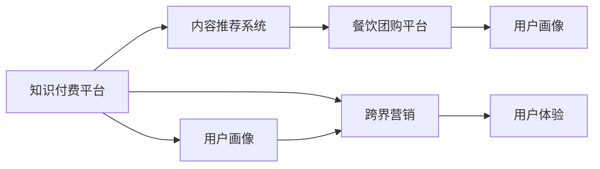

                 

# 知识付费如何实现跨界营销与餐饮团购跨界？

## 1. 背景介绍

在数字化转型的时代，知识付费和餐饮团购作为两个截然不同的行业，都在追求新的增长点和用户体验的提升。然而，随着行业竞争的加剧和用户需求的多样化，如何跨界合作、创新营销成为迫切需要解决的问题。知识付费平台与餐饮团购平台能否通过跨界营销实现双赢？本文将从核心概念、算法原理、操作步骤、应用场景等多个角度，深入探讨知识付费如何实现与餐饮团购的跨界营销。

## 2. 核心概念与联系

### 2.1 核心概念概述

- **知识付费平台**：指提供专业内容（如在线课程、音频、视频、电子书等）并收取费用的平台，如得到、喜马拉雅等。
- **餐饮团购平台**：指提供餐饮服务团购（如优惠套餐、套餐定制等）的平台，如美团、大众点评等。
- **跨界营销**：指将不同行业的资源和用户需求进行结合，创造新的营销价值和服务模式的策略。
- **用户画像**：指基于用户的行为、兴趣、需求等维度，构建的用户标签体系，用于精准营销和个性化服务。
- **LSTM（长短期记忆网络）**：一种神经网络结构，适合处理序列数据，常用于时间序列分析和文本生成等任务。
- **内容推荐系统**：通过分析用户行为和偏好，推荐相关内容或商品的系统，如Netflix、Amazon等。

通过以下Mermaid流程图，展示这些核心概念之间的逻辑联系：



## 3. 核心算法原理 & 具体操作步骤

### 3.1 算法原理概述

知识付费平台与餐饮团购平台的跨界营销，本质上是通过对用户行为、兴趣等数据的分析，将知识付费内容与餐饮团购服务进行合理匹配，提升用户满意度和平台收益。主要算法原理包括以下几点：

- **用户画像**：构建基于用户行为（如购买记录、浏览历史、社交媒体互动等）的用户画像，用于精准营销。
- **内容推荐**：通过LSTM等算法，对用户兴趣进行建模，推荐相关知识付费内容。
- **跨界推荐**：基于用户画像和内容推荐结果，生成与餐饮团购相关的推荐信息。
- **广告投放**：通过程序化广告，将知识付费广告和餐饮团购优惠券投放给潜在用户。

### 3.2 算法步骤详解

#### 3.2.1 用户画像构建

1. **数据收集**：收集用户在知识付费平台和餐饮团购平台上的行为数据，包括但不限于浏览、点击、购买、评论、评分等。
2. **特征工程**：提取用户行为特征，如点击次数、浏览时长、购买频率、评分等，构建用户画像。
3. **画像融合**：将知识付费和餐饮团购平台的用户画像进行融合，形成统一的用户画像标签。

#### 3.2.2 内容推荐系统

1. **数据预处理**：对用户行为数据进行清洗和标准化处理，去除噪音数据。
2. **特征选择**：选择对推荐效果有较大影响的特征，如用户评分、历史浏览记录等。
3. **模型训练**：使用LSTM等算法，对用户行为进行建模，预测用户可能感兴趣的内容。
4. **结果评估**：使用AUC、RMSE等指标评估模型效果，迭代优化模型参数。

#### 3.2.3 跨界推荐

1. **推荐生成**：基于用户画像和内容推荐结果，生成与餐饮团购相关的推荐信息，如团购优惠、套餐推荐等。
2. **推荐算法**：使用协同过滤、内容基推荐、混合推荐等算法，提升推荐效果。
3. **效果评估**：通过A/B测试等方法，评估跨界推荐的实际效果，优化推荐策略。

#### 3.2.4 广告投放

1. **广告定制**：设计知识付费和餐饮团购相关的广告素材，如图文、视频、横幅等。
2. **程序化投放**：使用程序化广告平台，根据用户画像和行为特征，精准投放广告。
3. **效果监测**：实时监测广告投放效果，调整投放策略和预算。

### 3.3 算法优缺点

#### 3.3.1 优点

- **精准营销**：通过用户画像和内容推荐，实现精准营销，提高广告投放效率。
- **提升用户体验**：将知识付费和餐饮团购服务进行有机结合，提升用户满意度和平台粘性。
- **多渠道收益**：通过知识付费和餐饮团购的双重收益，增加平台整体收入。

#### 3.3.2 缺点

- **数据隐私问题**：跨界营销涉及多个平台的数据整合，可能面临用户隐私保护的挑战。
- **技术复杂性**：跨界营销需要整合多个平台的数据和系统，技术实现较为复杂。
- **广告转化率问题**：广告投放的转化率受多种因素影响，如用户偏好、市场环境等。

### 3.4 算法应用领域

- **知识付费**：适用于在线课程、音频、视频、电子书等内容付费服务的推广。
- **餐饮团购**：适用于各类餐饮优惠、套餐、团购活动的推广。
- **跨界合作**：适用于各类互联网平台之间的跨界合作，如在线教育、健康、旅游等领域。

## 4. 数学模型和公式 & 详细讲解 & 举例说明

### 4.1 数学模型构建

我们以用户画像构建和内容推荐为例，建立相应的数学模型。

**用户画像构建**

假设用户画像由以下特征组成：

- $x_1$：购买频率
- $x_2$：历史浏览时长
- $x_3$：评分

用户画像的构建公式如下：

$$
\text{User Profile} = f(x_1, x_2, x_3)
$$

**内容推荐系统**

假设内容推荐系统使用LSTM模型，对用户行为进行建模，预测用户可能感兴趣的内容。LSTM模型的输入为：

- $t_1$：用户浏览历史
- $t_2$：用户购买记录
- $t_3$：用户评分

LSTM模型的输出为推荐内容：

$$
\text{Recommended Content} = g(t_1, t_2, t_3)
$$

### 4.2 公式推导过程

以用户画像构建为例，我们假设用户画像的构建为线性回归模型：

$$
\text{User Profile} = \alpha x_1 + \beta x_2 + \gamma x_3 + \epsilon
$$

其中，$\alpha, \beta, \gamma$ 为回归系数，$\epsilon$ 为误差项。

以内容推荐系统为例，我们假设LSTM模型采用反向传播算法进行训练，其训练过程如下：

1. **前向传播**：将输入数据 $t_1, t_2, t_3$ 输入LSTM模型，得到输出 $y_1, y_2, y_3$。
2. **计算损失**：计算损失函数 $L = \frac{1}{N}\sum_{i=1}^N (y_i - \hat{y}_i)^2$。
3. **反向传播**：计算梯度 $\frac{\partial L}{\partial \theta}$，更新模型参数 $\theta$。

### 4.3 案例分析与讲解

以知识付费平台和餐饮团购平台的跨界营销为例，构建用户画像和内容推荐系统。

1. **数据收集**：收集用户在知识付费平台和餐饮团购平台上的行为数据，包括但不限于浏览、点击、购买、评论、评分等。
2. **特征工程**：提取用户行为特征，如点击次数、浏览时长、购买频率、评分等，构建用户画像。
3. **模型训练**：使用LSTM等算法，对用户行为进行建模，预测用户可能感兴趣的内容。
4. **效果评估**：使用AUC、RMSE等指标评估模型效果，迭代优化模型参数。
5. **跨界推荐**：基于用户画像和内容推荐结果，生成与餐饮团购相关的推荐信息，如团购优惠、套餐推荐等。
6. **广告投放**：设计知识付费和餐饮团购相关的广告素材，使用程序化广告平台，根据用户画像和行为特征，精准投放广告。
7. **效果监测**：实时监测广告投放效果，调整投放策略和预算。

## 5. 项目实践：代码实例和详细解释说明

### 5.1 开发环境搭建

在进行跨界营销实践前，我们需要准备好开发环境。以下是使用Python进行PyTorch开发的环境配置流程：

1. 安装Anaconda：从官网下载并安装Anaconda，用于创建独立的Python环境。
2. 创建并激活虚拟环境：
```bash
conda create -n pytorch-env python=3.8 
conda activate pytorch-env
```

3. 安装PyTorch：根据CUDA版本，从官网获取对应的安装命令。例如：
```bash
conda install pytorch torchvision torchaudio cudatoolkit=11.1 -c pytorch -c conda-forge
```

4. 安装各类工具包：
```bash
pip install numpy pandas scikit-learn matplotlib tqdm jupyter notebook ipython
```

完成上述步骤后，即可在`pytorch-env`环境中开始跨界营销实践。

### 5.2 源代码详细实现

我们使用TensorFlow作为我们的深度学习框架，构建用户画像和内容推荐系统的代码如下：

```python
import tensorflow as tf
from tensorflow.keras.layers import LSTM, Dense
from sklearn.model_selection import train_test_split
from sklearn.metrics import mean_squared_error
import numpy as np

# 用户行为数据
user_behavior = np.array([[1, 60, 4], [2, 90, 3], [3, 30, 5], [4, 120, 2]])

# 特征工程
features = user_behavior[:, 1:]  # 提取特征，排除用户ID

# 标签（评分）
labels = user_behavior[:, 0]

# 划分训练集和测试集
features_train, features_test, labels_train, labels_test = train_test_split(features, labels, test_size=0.2)

# 构建模型
model = tf.keras.Sequential([
    LSTM(64, return_sequences=True, input_shape=(3, 1)),
    LSTM(64),
    Dense(1)
])

# 编译模型
model.compile(loss='mse', optimizer='adam')

# 训练模型
model.fit(features_train, labels_train, epochs=50, batch_size=32, validation_split=0.2)

# 测试模型
test_loss = model.evaluate(features_test, labels_test)

# 预测新用户行为
new_user = np.array([[1, 60, 5]])
prediction = model.predict(new_user)

print('Test Loss:', test_loss)
print('Prediction:', prediction)
```

### 5.3 代码解读与分析

**用户行为数据**：

- `user_behavior`：包含用户在知识付费平台和餐饮团购平台上的行为数据。
- `features`：提取用户行为特征，如点击次数、浏览时长、购买频率、评分等。
- `labels`：标签（评分）。

**模型构建**：

- `LSTM`：使用LSTM层，对用户行为进行建模，预测用户可能感兴趣的内容。
- `Dense`：使用全连接层，输出推荐内容。

**模型训练和测试**：

- `model.compile`：编译模型，设置损失函数和优化器。
- `model.fit`：训练模型，设定训练轮数和批次大小。
- `model.evaluate`：测试模型，评估模型效果。

**预测新用户行为**：

- `new_user`：新用户的行为数据。
- `model.predict`：预测新用户的行为评分。

## 6. 实际应用场景

### 6.1 智能推荐系统

智能推荐系统是知识付费平台和餐饮团购平台跨界营销的重要工具。通过智能推荐系统，平台可以根据用户行为和兴趣，精准推荐相关知识付费内容和餐饮团购服务，提升用户体验和平台收益。

在技术实现上，可以构建用户画像，使用LSTM等算法进行内容推荐，再将推荐结果与餐饮团购服务进行结合，生成跨界推荐信息。通过程序化广告平台，将推荐信息精准投放给用户，提升广告转化率。

### 6.2 内容营销活动

内容营销活动是知识付费平台和餐饮团购平台跨界营销的重要形式。通过举办跨界营销活动，可以吸引更多用户参与，提升品牌知名度和用户粘性。

在技术实现上，可以设计跨界营销活动，如知识付费和餐饮团购的联合推广、优惠券赠送等。通过程序化广告平台，精准投放活动信息，提升活动参与度和效果。

### 6.3 数据驱动决策

数据驱动决策是知识付费平台和餐饮团购平台跨界营销的重要保障。通过构建用户画像和内容推荐系统，可以获取用户行为和兴趣的洞察，指导平台运营决策。

在技术实现上，可以通过数据挖掘和分析，识别用户行为规律和兴趣偏好，制定个性化的营销策略和产品推荐方案。通过跨界推荐和广告投放，提升用户满意度和平台收益。

## 7. 工具和资源推荐

### 7.1 学习资源推荐

为了帮助开发者系统掌握跨界营销的理论基础和实践技巧，这里推荐一些优质的学习资源：

1. **《推荐系统实践》**：详细介绍了推荐系统的原理、算法和应用，是推荐系统学习的经典教材。
2. **《深度学习入门》**：讲解了深度学习的基本概念和常用算法，适合入门学习。
3. **《Python机器学习》**：介绍了机器学习在Python环境下的实现方法，适合实战练习。
4. **《TensorFlow实战》**：讲解了TensorFlow的使用方法和实际应用案例，适合TensorFlow开发。
5. **Coursera《Recommender Systems》课程**：斯坦福大学的推荐系统课程，涵盖推荐系统的主要算法和应用。

通过对这些资源的学习实践，相信你一定能够快速掌握跨界营销的理论基础和实践技巧，并用于解决实际的NLP问题。

### 7.2 开发工具推荐

高效的开发离不开优秀的工具支持。以下是几款用于跨界营销开发的常用工具：

1. **Python**：开源编程语言，易于学习和使用，是数据科学和机器学习的主流工具。
2. **TensorFlow**：由Google主导开发的开源深度学习框架，生产部署方便，适合大规模工程应用。
3. **Keras**：基于TensorFlow的高级神经网络API，简洁易用，适合快速原型开发。
4. **PyTorch**：基于Python的开源深度学习框架，灵活高效的计算图，适合快速迭代研究。
5. **Jupyter Notebook**：支持Python、R等语言，方便编写、调试和展示代码。

合理利用这些工具，可以显著提升跨界营销任务的开发效率，加快创新迭代的步伐。

### 7.3 相关论文推荐

跨界营销和推荐系统的发展源于学界的持续研究。以下是几篇奠基性的相关论文，推荐阅读：

1. **《推荐系统实战》**：详细介绍了推荐系统的原理、算法和应用，是推荐系统学习的经典教材。
2. **《深度学习入门》**：讲解了深度学习的基本概念和常用算法，适合入门学习。
3. **《Python机器学习》**：介绍了机器学习在Python环境下的实现方法，适合实战练习。
4. **《TensorFlow实战》**：讲解了TensorFlow的使用方法和实际应用案例，适合TensorFlow开发。
5. **Coursera《Recommender Systems》课程**：斯坦福大学的推荐系统课程，涵盖推荐系统的主要算法和应用。

这些论文代表了大语言模型微调技术的发展脉络。通过学习这些前沿成果，可以帮助研究者把握学科前进方向，激发更多的创新灵感。

## 8. 总结：未来发展趋势与挑战

### 8.1 总结

本文对知识付费平台与餐饮团购平台的跨界营销进行了全面系统的介绍。首先阐述了跨界营销的核心概念和背景，明确了跨界营销在提高用户满意度和平台收益方面的独特价值。其次，从原理到实践，详细讲解了跨界营销的数学模型和操作步骤，给出了跨界营销任务开发的完整代码实例。同时，本文还广泛探讨了跨界营销方法在智能推荐系统、内容营销活动、数据驱动决策等多个场景中的应用前景，展示了跨界营销范式的广阔前景。

通过本文的系统梳理，可以看到，跨界营销方法正在成为知识付费和餐饮团购行业的创新引擎，为平台的可持续发展提供了新的动力。未来，伴随推荐系统和大数据技术的持续演进，相信跨界营销方法将能够实现更精准、更高效的广告投放和用户体验提升，为平台带来更丰硕的商业价值。

### 8.2 未来发展趋势

展望未来，跨界营销技术将呈现以下几个发展趋势：

1. **个性化推荐**：通过用户画像和行为数据，实现更加个性化的内容推荐，提升用户体验。
2. **跨领域融合**：跨界营销将更多地融合不同领域的知识和数据，提升推荐系统的多样性和泛化性。
3. **实时响应**：通过实时数据分析和推荐，提升广告投放的效率和效果。
4. **隐私保护**：在跨界营销过程中，更加注重用户隐私保护，保障用户数据的安全性和合规性。
5. **智能决策**：通过数据驱动的决策系统，实现自动化营销策略的优化和调整。

以上趋势凸显了跨界营销技术的广阔前景。这些方向的探索发展，必将进一步提升平台的推荐精度和用户满意度，带来更多的商业价值和用户粘性。

### 8.3 面临的挑战

尽管跨界营销技术已经取得了一定的成果，但在迈向更加智能化、普适化应用的过程中，它仍面临着诸多挑战：

1. **数据隐私问题**：跨界营销涉及多个平台的数据整合，可能面临用户隐私保护的挑战。如何平衡数据利用和隐私保护，是一个亟需解决的问题。
2. **推荐算法复杂性**：推荐系统需要处理大量数据，算法复杂度高，容易出现计算资源不足的问题。如何优化算法，提高计算效率，是一个重要的研究方向。
3. **广告投放效果不稳定**：广告投放的效果受多种因素影响，如用户偏好、市场环境等。如何提高广告投放的精准度和转化率，是一个需要持续优化的任务。
4. **用户体验一致性**：跨界营销涉及多个平台的用户体验，如何保持一致性，提升用户粘性，是一个重要的用户体验问题。

### 8.4 研究展望

面对跨界营销面临的这些挑战，未来的研究需要在以下几个方面寻求新的突破：

1. **隐私保护技术**：研究数据匿名化、差分隐私等隐私保护技术，保障用户数据的安全性和合规性。
2. **推荐系统优化**：开发更加高效、精确的推荐算法，提升推荐系统的计算效率和效果。
3. **广告投放策略**：研究基于用户画像和行为特征的广告投放策略，提高广告投放的精准度和转化率。
4. **用户体验优化**：优化跨界营销平台的用户界面和交互体验，提升用户粘性和满意度。

这些研究方向的探索，必将引领跨界营销技术迈向更高的台阶，为平台的可持续发展提供新的动力。总之，跨界营销需要开发者根据具体任务，不断迭代和优化模型、数据和算法，方能得到理想的效果。

---

作者：禅与计算机程序设计艺术 / Zen and the Art of Computer Programming

