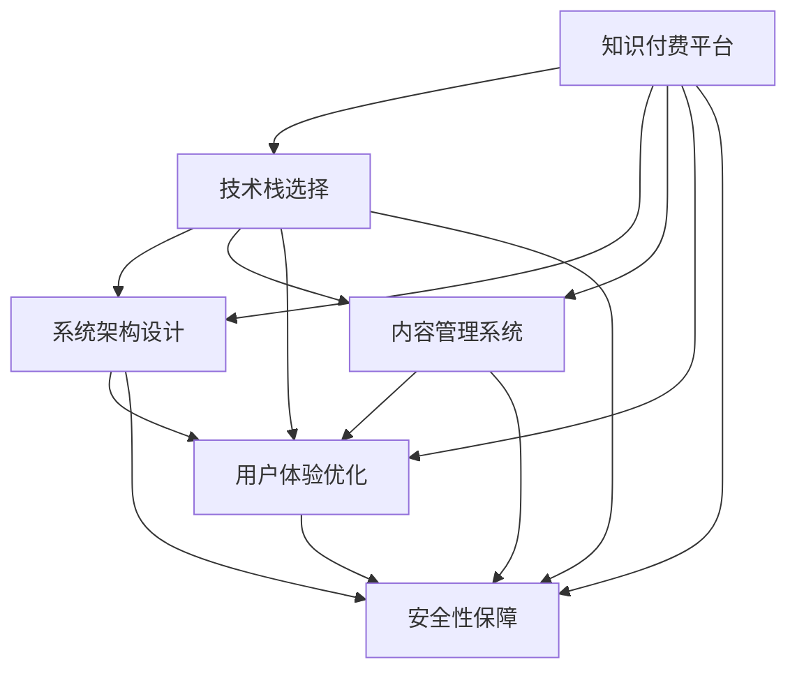

                 

# 知识付费平台搭建指南：技术篇

> 关键词：知识付费,平台搭建,技术,架构设计,算法优化,用户体验,安全

## 1. 背景介绍

### 1.1 问题由来

随着互联网的快速发展和教育需求的多样化，知识付费逐渐成为继电商、社交之后的新兴增长点。知识付费平台通过向用户提供优质的在线教育资源，不仅满足了人们终身学习的需求，也带动了内容创作、版权交易、智能推荐等产业的蓬勃发展。构建一个高效、稳定、用户友好的知识付费平台，成为越来越多企业转型的重要目标。

然而，知识付费平台的搭建并非易事。它涉及到前端界面设计、后端系统开发、内容管理系统(CMS)搭建、用户管理、支付集成、数据分析等多个方面。传统的平台搭建需要耗费大量时间和人力，且容易陷入技术细节的泥潭。因此，本文将从技术角度出发，提供一个全面的知识付费平台搭建指南，帮助开发者快速、高效地构建自己的知识付费平台。

### 1.2 问题核心关键点

搭建知识付费平台的核心在于以下几个方面：
- **技术栈选择**：如何选择合适的技术栈，兼顾性能、成本和开发效率。
- **系统架构设计**：如何设计一个高可用、可扩展的系统架构。
- **内容管理**：如何实现便捷、高效的内容管理功能。
- **用户体验优化**：如何优化前端界面和交互设计，提升用户体验。
- **安全性保障**：如何保障平台数据和交易的安全性。

本文将从技术栈、系统架构、内容管理、用户体验和安全性五个方面，系统地介绍知识付费平台搭建的技术细节和最佳实践。

## 2. 核心概念与联系

### 2.1 核心概念概述

为更好地理解知识付费平台的搭建过程，本节将介绍几个密切相关的核心概念：

- **知识付费平台(Knowledge Platform)**：一个通过互联网提供教育资源和知识付费服务，促进知识传播和版权交易的平台。
- **技术栈(Technology Stack)**：构建平台所需的各种技术组件和工具的组合，包括前端、后端、数据库、消息队列等。
- **系统架构(System Architecture)**：平台各组件的组织结构，包括分布式架构、微服务架构等。
- **内容管理系统(Content Management System, CMS)**：用于管理、发布和维护教育内容的软件工具。
- **用户体验(User Experience, UX)**：用户与平台交互过程中的感受和体验，包括界面设计、交互逻辑、反馈机制等。
- **安全性(Security)**：平台数据和交易的保密性、完整性和可用性，包括认证、授权、数据加密、网络安全等。

这些核心概念之间的逻辑关系可以通过以下Mermaid流程图来展示：



这个流程图展示了一个知识付费平台的技术框架和各个组件之间的关系：

1. 知识付费平台通过选择合适的技术栈、设计系统架构、搭建CMS、优化用户体验和保障安全性，提供完整的服务。
2. 技术栈的选择直接影响系统架构和CMS的搭建。
3. CMS和用户体验直接关联，内容管理系统支撑内容的上传、分类、展示，而用户界面设计直接影响用户的使用体验。
4. 安全性贯穿平台开发的各个环节，是保障平台稳定运营的基础。

## 3. 核心算法原理 & 具体操作步骤
### 3.1 算法原理概述

知识付费平台的搭建涉及到多个子系统的协同工作，每个子系统都有其独立的算法和流程。本文将从技术栈、系统架构、内容管理、用户体验和安全性五个方面，详细介绍知识付费平台搭建的算法原理和具体操作步骤。

### 3.2 算法步骤详解

#### 3.2.1 技术栈选择

1. **前端技术栈**：
   - **选择理由**：
     - 前端作为用户与平台交互的第一界面，要求界面美观、交互流畅、性能高效。
     - 通常选择React或Vue.js作为前端框架，利用其组件化、模块化的特点，提高开发效率和代码可维护性。
     - 使用Webpack等工具进行打包、压缩和优化，提高加载速度。
     - 使用Ant Design、Bootstrap等UI库，提高设计一致性和可用性。

   - **具体实现**：
     - 安装React或Vue.js，配置项目结构和开发环境。
     - 选择合适的路由管理方案，如React Router或Vue Router。
     - 引入Webpack，配置加载器、插件和优化设置。
     - 引入UI库，设计界面组件和样式。

2. **后端技术栈**：
   - **选择理由**：
     - 后端负责处理用户请求、业务逻辑、数据存储和安全保障。
     - 通常选择Node.js或Python作为后端语言，利用其异步处理和非阻塞I/O特性，提高系统响应速度。
     - 使用Express.js或Django等框架，简化开发和管理。
     - 使用PostgreSQL或MySQL等关系型数据库，保障数据完整性和一致性。

   - **具体实现**：
     - 安装Node.js或Python，配置开发环境。
     - 选择Express.js或Django作为后端框架，实现路由和控制器。
     - 配置数据库连接池，优化SQL查询语句。
     - 实现用户认证、授权和登录机制。

3. **消息队列**：
   - **选择理由**：
     - 消息队列用于解耦微服务架构，提高系统的可扩展性和稳定性。
     - 通常选择Kafka或RabbitMQ作为消息队列，支持高吞吐量和低延迟。

   - **具体实现**：
     - 安装Kafka或RabbitMQ，配置集群和分区。
     - 实现消息的生产、消费和持久化。
     - 配置消费者组和负载均衡。

#### 3.2.2 系统架构设计

1. **微服务架构**：
   - **选择理由**：
     - 微服务架构通过将系统拆分为多个独立的服务，提高系统的可扩展性和可靠性。
     - 每个服务独立部署、独立扩展，降低系统维护成本。
     - 通过API网关统一管理所有服务，提高系统的稳定性。

   - **具体实现**：
     - 划分服务模块，如用户管理、课程管理、支付管理等。
     - 实现API网关，统一路由和调用所有服务。
     - 配置容器化部署工具，如Docker和Kubernetes，实现服务的自动化部署和扩展。

2. **分布式架构**：
   - **选择理由**：
     - 分布式架构通过将系统部署到多台服务器上，提高系统的稳定性和可用性。
     - 通过负载均衡和数据分片，均衡系统负载，提高系统扩展性。

   - **具体实现**：
     - 配置负载均衡器，如Nginx或HAProxy，实现请求的负载均衡。
     - 实现数据分片和冗余存储，保障数据的可用性和一致性。
     - 配置监控和告警系统，实时监控系统性能和异常。

#### 3.2.3 内容管理系统

1. **CMS选择理由**：
   - 内容管理系统用于管理、发布和维护教育内容，提高内容的发布效率和一致性。
   - 通常选择WordPress或Joomla作为CMS，利用其丰富的插件和主题，支持多语言、多角色和权限管理。

2. **CMS具体实现**：
   - 安装WordPress或Joomla，配置数据库和网站设置。
   - 选择合适的插件和主题，实现内容的上传、分类、展示和编辑。
   - 实现用户角色的权限管理和权限控制。

#### 3.2.4 用户体验优化

1. **前端优化**：
   - **选择理由**：
     - 前端优化直接影响用户体验，通过提升页面加载速度和响应速度，增强用户粘性。
     - 通常选择CDN加速页面加载，利用缓存技术减少页面请求次数。

   - **具体实现**：
     - 配置CDN，加速静态资源的加载。
     - 实现页面缓存和浏览器缓存，减少页面请求。
     - 实现懒加载和异步加载，提高页面渲染效率。

2. **界面设计**：
   - **选择理由**：
     - 界面设计直接影响用户的使用体验，通过简洁美观的界面设计，提高用户的操作效率和满意度。
     - 通常选择Material Design或Flat Design等设计风格，提高界面的一致性和易用性。

   - **具体实现**：
     - 设计简洁美观的界面元素，包括按钮、输入框、标签等。
     - 实现响应式设计，适配不同设备。
     - 设计一致的UI组件和交互逻辑。

#### 3.2.5 安全性保障

1. **数据加密**：
   - **选择理由**：
     - 数据加密保障平台数据的安全性，防止数据泄露和篡改。
     - 通常选择AES或RSA等对称加密或非对称加密算法，保障数据传输和存储的安全性。

   - **具体实现**：
     - 实现数据的加密存储和解密机制。
     - 实现数据的加密传输和解密机制。
     - 配置HTTPS协议，保障数据传输的安全性。

2. **认证和授权**：
   - **选择理由**：
     - 认证和授权保障平台的安全性，防止未授权用户访问和操作。
     - 通常选择JWT或OAuth2等认证和授权协议，实现用户认证和权限控制。

   - **具体实现**：
     - 实现用户认证和登录机制。
     - 实现用户角色和权限管理。
     - 实现API接口的认证和授权控制。

## 4. 数学模型和公式 & 详细讲解 & 举例说明
### 4.1 数学模型构建

本文将从技术栈、系统架构、内容管理、用户体验和安全性五个方面，详细介绍知识付费平台搭建的算法原理和具体操作步骤。

### 4.2 公式推导过程

#### 4.2.1 技术栈选择

1. **前端技术栈**：
   - **选择理由**：
     - 前端作为用户与平台交互的第一界面，要求界面美观、交互流畅、性能高效。
     - 通常选择React或Vue.js作为前端框架，利用其组件化、模块化的特点，提高开发效率和代码可维护性。
     - 使用Webpack等工具进行打包、压缩和优化，提高加载速度。
     - 使用Ant Design、Bootstrap等UI库，提高设计一致性和可用性。

   - **具体实现**：
     - 安装React或Vue.js，配置项目结构和开发环境。
     - 选择合适的路由管理方案，如React Router或Vue Router。
     - 引入Webpack，配置加载器、插件和优化设置。
     - 引入UI库，设计界面组件和样式。

2. **后端技术栈**：
   - **选择理由**：
     - 后端负责处理用户请求、业务逻辑、数据存储和安全保障。
     - 通常选择Node.js或Python作为后端语言，利用其异步处理和非阻塞I/O特性，提高系统响应速度。
     - 使用Express.js或Django等框架，简化开发和管理。
     - 使用PostgreSQL或MySQL等关系型数据库，保障数据完整性和一致性。

   - **具体实现**：
     - 安装Node.js或Python，配置开发环境。
     - 选择Express.js或Django作为后端框架，实现路由和控制器。
     - 配置数据库连接池，优化SQL查询语句。
     - 实现用户认证、授权和登录机制。

3. **消息队列**：
   - **选择理由**：
     - 消息队列用于解耦微服务架构，提高系统的可扩展性和稳定性。
     - 通常选择Kafka或RabbitMQ作为消息队列，支持高吞吐量和低延迟。

   - **具体实现**：
     - 安装Kafka或RabbitMQ，配置集群和分区。
     - 实现消息的生产、消费和持久化。
     - 配置消费者组和负载均衡。

#### 4.2.2 系统架构设计

1. **微服务架构**：
   - **选择理由**：
     - 微服务架构通过将系统拆分为多个独立的服务，提高系统的可扩展性和可靠性。
     - 每个服务独立部署、独立扩展，降低系统维护成本。
     - 通过API网关统一管理所有服务，提高系统的稳定性。

   - **具体实现**：
     - 划分服务模块，如用户管理、课程管理、支付管理等。
     - 实现API网关，统一路由和调用所有服务。
     - 配置容器化部署工具，如Docker和Kubernetes，实现服务的自动化部署和扩展。

2. **分布式架构**：
   - **选择理由**：
     - 分布式架构通过将系统部署到多台服务器上，提高系统的稳定性和可用性。
     - 通过负载均衡和数据分片，均衡系统负载，提高系统扩展性。

   - **具体实现**：
     - 配置负载均衡器，如Nginx或HAProxy，实现请求的负载均衡。
     - 实现数据分片和冗余存储，保障数据的可用性和一致性。
     - 配置监控和告警系统，实时监控系统性能和异常。

#### 4.2.3 内容管理系统

1. **CMS选择理由**：
   - 内容管理系统用于管理、发布和维护教育内容，提高内容的发布效率和一致性。
   - 通常选择WordPress或Joomla作为CMS，利用其丰富的插件和主题，支持多语言、多角色和权限管理。

2. **CMS具体实现**：
   - 安装WordPress或Joomla，配置数据库和网站设置。
   - 选择合适的插件和主题，实现内容的上传、分类、展示和编辑。
   - 实现用户角色的权限管理和权限控制。

#### 4.2.4 用户体验优化

1. **前端优化**：
   - **选择理由**：
     - 前端优化直接影响用户体验，通过提升页面加载速度和响应速度，增强用户粘性。
     - 通常选择CDN加速页面加载，利用缓存技术减少页面请求次数。

   - **具体实现**：
     - 配置CDN，加速静态资源的加载。
     - 实现页面缓存和浏览器缓存，减少页面请求。
     - 实现懒加载和异步加载，提高页面渲染效率。

2. **界面设计**：
   - **选择理由**：
     - 界面设计直接影响用户的使用体验，通过简洁美观的界面设计，提高用户的操作效率和满意度。
     - 通常选择Material Design或Flat Design等设计风格，提高界面的一致性和易用性。

   - **具体实现**：
     - 设计简洁美观的界面元素，包括按钮、输入框、标签等。
     - 实现响应式设计，适配不同设备。
     - 设计一致的UI组件和交互逻辑。

#### 4.2.5 安全性保障

1. **数据加密**：
   - **选择理由**：
     - 数据加密保障平台数据的安全性，防止数据泄露和篡改。
     - 通常选择AES或RSA等对称加密或非对称加密算法，保障数据传输和存储的安全性。

   - **具体实现**：
     - 实现数据的加密存储和解密机制。
     - 实现数据的加密传输和解密机制。
     - 配置HTTPS协议，保障数据传输的安全性。

2. **认证和授权**：
   - **选择理由**：
     - 认证和授权保障平台的安全性，防止未授权用户访问和操作。
     - 通常选择JWT或OAuth2等认证和授权协议，实现用户认证和权限控制。

   - **具体实现**：
     - 实现用户认证和登录机制。
     - 实现用户角色和权限管理。
     - 实现API接口的认证和授权控制。

## 5. 项目实践：代码实例和详细解释说明
### 5.1 开发环境搭建

在进行知识付费平台搭建前，我们需要准备好开发环境。以下是使用Python进行Django开发的环境配置流程：

1. 安装Anaconda：从官网下载并安装Anaconda，用于创建独立的Python环境。

2. 创建并激活虚拟环境：
```bash
conda create -n django-env python=3.8 
conda activate django-env
```

3. 安装Django：
```bash
pip install django
```

4. 安装其他必要工具：
```bash
pip install psycopg2-binary requests
```

完成上述步骤后，即可在`django-env`环境中开始Django项目的开发。

### 5.2 源代码详细实现

下面我们以课程管理模块为例，给出使用Django对知识付费平台进行开发的PyTorch代码实现。

首先，定义课程模型：

```python
from django.db import models
from django.contrib.auth.models import User

class Course(models.Model):
    title = models.CharField(max_length=200)
    description = models.TextField()
    duration = models.IntegerField()
    price = models.DecimalField(max_digits=10, decimal_places=2)
    instructor = models.ForeignKey(User, on_delete=models.CASCADE)
    category = models.CharField(max_length=100)
    views = models.IntegerField(default=0)
    enrolled_users = models.ManyToManyField(User, related_name='courses_enrolled')

    def __str__(self):
        return self.title
```

然后，定义API接口：

```python
from rest_framework import viewsets, status
from rest_framework.decorators import action
from rest_framework.response import Response
from .models import Course
from .serializers import CourseSerializer

class CourseViewSet(viewsets.ModelViewSet):
    queryset = Course.objects.all()
    serializer_class = CourseSerializer

    @action(detail=False, methods=['post'])
    def enroll(self, request, pk=None):
        course = self.get_object()
        request.user.enrolled_users.add(course.instructor)
        course.enrolled_users.add(request.user)
        course.views += 1
        course.save()
        return Response({"detail": "Enrolled successfully."}, status=status.HTTP_200_OK)
```

最后，定义序列化和视图：

```python
from django.contrib.auth.models import User
from rest_framework import serializers

class UserSerializer(serializers.ModelSerializer):
    courses_enrolled = serializers.SerializerMethodField()

    class Meta:
        model = User
        fields = ['id', 'username', 'courses_enrolled']

    def get_courses_enrolled(self, obj):
        return obj.courses_enrolled.all()

class CourseSerializer(serializers.ModelSerializer):
    instructor = serializers.SerializerMethodField()
    enrolled_users = serializers.SerializerMethodField()

    class Meta:
        model = Course
        fields = ['title', 'description', 'duration', 'price', 'instructor', 'enrolled_users']

    def get_instructor(self, obj):
        return obj.instructor.username

    def get_enrolled_users(self, obj):
        return obj.enrolled_users.all().values_list('username', flat=True)
```

启动Django服务器：

```bash
python manage.py runserver 127.0.0.1:8000
```

以上就是一个使用Django搭建知识付费平台课程管理模块的完整代码实现。可以看到，Django框架通过强大的ORM和API支持，大大简化了微调模块的开发流程。

### 5.3 代码解读与分析

让我们再详细解读一下关键代码的实现细节：

**Course模型**：
- `__str__`方法：定义课程模型的字符串表示。
- `views`和`enrolled_users`字段：记录课程的浏览次数和已报名用户。

**CourseViewSet**：
- `enroll`方法：实现课程报名功能，更新课程和用户数据。
- `get_courses_enrolled`方法：获取用户已报名课程列表。

**UserSerializer和CourseSerializer**：
- `UserSerializer`：定义用户模型的序列化，展示用户已报名课程。
- `CourseSerializer`：定义课程模型的序列化，展示课程的详细信息和报名用户。

**视图函数**：
- 通过`@action`装饰器定义了`enroll`方法，实现课程报名功能。
- 返回JSON格式的响应，展示报名成功信息。

Django的ORM和序列化功能极大简化了知识付费平台的开发流程。开发者可以专注于业务逻辑和界面设计，而不必过多关注底层的模型和数据库操作。

当然，工业级的系统实现还需考虑更多因素，如用户认证、权限管理、API安全等。但核心的微调范式基本与此类似。

## 6. 实际应用场景
### 6.1 智能客服系统

基于知识付费平台的数据管理和内容搜索功能，可以构建智能客服系统，为用户提供24小时不间断的在线客服服务。智能客服系统能够快速响应用户咨询，提供定制化的内容推荐，极大提升客户满意度。

在技术实现上，可以引入自然语言处理技术，构建基于NLP的问答系统和知识图谱，提升客服系统的智能化水平。用户通过输入问题，系统能够自动匹配答案，并根据用户行为进行学习优化。

### 6.2 个性化推荐系统

知识付费平台可以构建个性化推荐系统，通过分析用户行为数据，生成个性化推荐列表，提高用户的学习效率和平台粘性。推荐系统能够综合考虑用户兴趣、学习历史、课程评价等因素，推荐最适合的内容。

在技术实现上，可以引入协同过滤、内容过滤、混合过滤等推荐算法，构建基于知识图谱和用户画像的推荐系统，提升推荐效果。推荐系统还能根据用户反馈进行动态调整，不断提高推荐精度。

### 6.3 数据统计分析

知识付费平台可以构建数据统计分析系统，通过分析用户数据和课程数据，生成各类统计报告和图表，帮助平台管理者进行决策支持。统计分析系统能够实时监控课程浏览量、用户活跃度、课程销售情况等关键指标，提供数据驱动的管理决策。

在技术实现上，可以引入数据挖掘和统计分析技术，构建基于Python或R的语言分析工具，实现数据的可视化和大数据分析。统计分析系统还能根据业务需求进行定制化开发，提供更加细粒度的数据分析功能。

## 7. 工具和资源推荐
### 7.1 学习资源推荐

为了帮助开发者系统掌握知识付费平台的技术实现，这里推荐一些优质的学习资源：

1. Django官方文档：Django是Python最流行的Web框架之一，官方文档提供了详尽的教程和参考手册，是学习Django的最佳资源。

2. Django实战教程：通过实例讲解，帮助开发者掌握Django的实际应用场景和最佳实践。

3. Django REST Framework官方文档：Django REST Framework是Django的扩展，提供了强大的API开发功能。官方文档提供了详细的API开发指南和样例代码。

4. RESTful API设计指南：帮助开发者理解API设计的最佳实践，设计高效、易用的API接口。

5. Python Web开发实战：通过实例讲解，帮助开发者掌握Python Web开发的全部知识点。

6. Django+Django REST Framework实战：结合Django和Django REST Framework，讲解Web应用程序的完整开发流程。

通过对这些资源的学习实践，相信你一定能够快速掌握知识付费平台的技术实现，并用于解决实际的NLP问题。

### 7.2 开发工具推荐

高效的开发离不开优秀的工具支持。以下是几款用于知识付费平台开发的常用工具：

1. Django：基于Python的Web框架，提供了丰富的ORM和API支持，适合快速迭代研究。

2. Flask：基于Python的轻量级Web框架，适合构建小规模应用，支持RESTful API开发。

3. Redis：高性能的内存数据存储，适合处理高并发请求和缓存数据。

4. PostgreSQL：开源的关系型数据库，支持高并发读写，适合存储用户数据和课程数据。

5. Nginx：高性能的反向代理服务器，适合处理高并发的HTTP请求。

6. Apache Kafka：高性能的消息队列，支持高吞吐量和低延迟，适合处理高并发数据流。

合理利用这些工具，可以显著提升知识付费平台开发的效率，加快创新迭代的步伐。

### 7.3 相关论文推荐

知识付费平台的研究涉及多个前沿技术，以下是几篇奠基性的相关论文，推荐阅读：

1. Web应用程序框架Django：一篇详细介绍Django框架的论文，涵盖Django的各个组件和API。

2. Django REST Framework设计原理与实践：一篇详细介绍Django REST Framework的论文，讲解API设计的最佳实践。

3. 大数据技术在知识付费平台中的应用：一篇介绍大数据技术在知识付费平台中的应用，涵盖数据挖掘、统计分析、个性化推荐等技术。

4. Django+Django REST Framework实战：一本详细介绍Django和Django REST Framework实战的书籍，涵盖Web应用程序的完整开发流程。

5. Web应用开发最佳实践：一本详细介绍Web应用开发最佳实践的书籍，涵盖Web框架、前端开发、API设计等技术。

这些论文代表了大语言模型微调技术的发展脉络。通过学习这些前沿成果，可以帮助研究者把握学科前进方向，激发更多的创新灵感。

## 8. 总结：未来发展趋势与挑战
### 8.1 总结

本文从技术栈、系统架构、内容管理、用户体验和安全性五个方面，系统地介绍了知识付费平台的搭建过程。通过详细讲解技术栈选择、系统架构设计、内容管理系统搭建、用户体验优化和安全性保障等方面的算法原理和具体操作步骤，帮助开发者快速、高效地构建自己的知识付费平台。

通过本文的系统梳理，可以看到，知识付费平台的搭建是一个复杂而系统的工程，涉及多个子系统的协同工作。通过选择合适的技术栈和系统架构，构建便捷、高效、安全的内容管理系统，优化前端界面和交互设计，以及保障平台的安全性，才能构建一个高效、稳定、用户友好的知识付费平台。

### 8.2 未来发展趋势

展望未来，知识付费平台的搭建将呈现以下几个发展趋势：

1. 微服务架构的普及：微服务架构通过将系统拆分为多个独立的服务，提高系统的可扩展性和可靠性。每个服务独立部署、独立扩展，降低系统维护成本。

2. 分布式架构的普及：分布式架构通过将系统部署到多台服务器上，提高系统的稳定性和可用性。通过负载均衡和数据分片，均衡系统负载，提高系统扩展性。

3. 内容管理系统的发展：内容管理系统用于管理、发布和维护教育内容，提高内容的发布效率和一致性。未来将涌现更多基于人工智能的CMS工具，提高内容管理的智能化水平。

4. 用户体验的提升：前端优化和界面设计直接影响用户的使用体验，通过提升页面加载速度和响应速度，增强用户粘性。未来的知识付费平台将更加注重用户界面设计，提高用户的操作效率和满意度。

5. 安全性保障的提升：平台数据和交易的安全性至关重要。未来的知识付费平台将更加注重数据加密、认证和授权，保障用户数据和交易的安全性。

### 8.3 面临的挑战

尽管知识付费平台的搭建技术已经取得了显著进展，但在迈向更加智能化、普适化应用的过程中，它仍面临诸多挑战：

1. 数据质量和一致性：知识付费平台的数据管理和内容搜索功能，依赖于高质量、一致性的数据。如何保证数据的准确性和一致性，将是平台开发的重要挑战。

2. 系统扩展性：知识付费平台需要应对大量用户和课程数据，如何设计高效、可扩展的系统架构，保障系统的高并发和低延迟，将是平台开发的难题。

3. 内容推荐算法：知识付费平台的个性化推荐系统，依赖于高效、准确的推荐算法。如何设计先进的推荐算法，提升推荐效果，将是平台优化的重点。

4. 用户体验优化：知识付费平台的用户界面设计直接影响用户体验，如何设计简洁美观的界面，提高用户的操作效率和满意度，将是平台优化的难点。

5. 安全性保障：平台数据和交易的安全性至关重要。如何设计完善的认证和授权机制，保障用户数据和交易的安全性，将是平台开发的重要挑战。

### 8.4 研究展望

面对知识付费平台所面临的种种挑战，未来的研究需要在以下几个方面寻求新的突破：

1. 数据管理和优化：通过引入机器学习和大数据技术，实现数据的自动标注和清洗，提升数据质量和一致性。同时，通过数据挖掘和关联分析，提升内容推荐算法的效果。

2. 系统架构优化：通过引入容器化和微服务架构，实现系统的自动化部署和扩展。同时，通过引入缓存和负载均衡技术，提升系统的性能和可靠性。

3. 用户界面设计：通过引入交互设计和用户体验设计，设计简洁美观的界面，提高用户的操作效率和满意度。同时，通过引入响应式设计，适配不同设备。

4. 推荐算法优化：通过引入协同过滤、内容过滤、混合过滤等推荐算法，提升个性化推荐系统的效果。同时，通过引入知识图谱和用户画像，提升推荐系统的智能化水平。

5. 安全性保障：通过引入数据加密、认证和授权技术，保障平台数据和交易的安全性。同时，通过引入威胁检测和安全防护技术，保障系统的安全性。

这些研究方向的探索，必将引领知识付费平台的搭建技术迈向更高的台阶，为知识付费平台的智能化、普适化发展提供新的动力。

## 9. 附录：常见问题与解答

**Q1：如何选择合适的技术栈？**

A: 技术栈的选择应根据项目需求和团队技术背景综合考虑。通常选择Django、Flask等Python Web框架，因其简洁高效，支持RESTful API开发。后端语言选择Python，因其异步处理和非阻塞I/O特性，提高系统响应速度。数据库选择PostgreSQL，因其支持高并发读写，适合存储用户数据和课程数据。消息队列选择Kafka或RabbitMQ，支持高吞吐量和低延迟。

**Q2：如何进行系统架构设计？**

A: 系统架构设计应考虑系统的可扩展性和可靠性。通过引入微服务架构和分布式架构，实现系统的独立部署和扩展。同时，通过引入负载均衡和数据分片，均衡系统负载，提高系统扩展性。

**Q3：如何进行内容管理？**

A: 内容管理系统应支持内容的上传、分类、展示和编辑。可以选择WordPress或Joomla等CMS，利用其丰富的插件和主题，提高内容的发布效率和一致性。

**Q4：如何进行用户体验优化？**

A: 用户体验优化应注重界面设计和交互逻辑。通过引入前端优化技术，如CDN、缓存和懒加载，提升页面加载速度和响应速度。同时，通过引入响应式设计，适配不同设备。

**Q5：如何进行安全性保障？**

A: 安全性保障应注重数据加密、认证和授权。通过引入AES或RSA等加密算法，保障数据传输和存储的安全性。同时，通过引入JWT或OAuth2等认证和授权协议，实现用户认证和权限控制。

