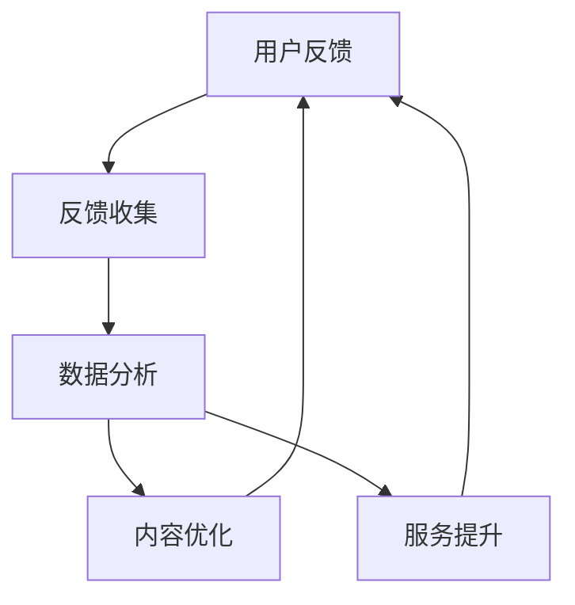
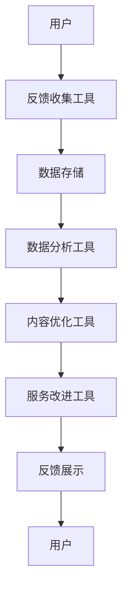

                 

# 知识付费平台的用户反馈机制设计

> 关键词：知识付费,用户反馈,机制设计,用户满意度,用户体验

## 1. 背景介绍

随着知识付费市场的快速发展和用户需求的多样化，如何设计一个高效、合理且用户友好的反馈机制，成为了知识付费平台提升用户满意度和增加用户黏性的关键。反馈机制不仅可以帮助平台及时了解用户需求和市场变化，还可以指导内容的优化和服务的改进，从而提高平台的竞争力和用户体验。本文将从背景介绍、核心概念与联系、核心算法原理、具体操作步骤、数学模型构建、公式推导过程、项目实践、实际应用场景、工具和资源推荐、总结、未来发展趋势与挑战、常见问题与解答等方面，深入探讨知识付费平台用户反馈机制的设计和应用。

## 2. 核心概念与联系

### 2.1 核心概念概述

知识付费平台的用户反馈机制是指平台通过收集用户在使用服务过程中的意见和建议，对内容和服务进行优化和改进的过程。具体来说，用户反馈机制通常包括以下几个关键组件：

- **用户反馈**：用户在使用平台过程中对内容、界面、功能等各方面提出的意见和建议。
- **反馈收集**：通过调查问卷、在线反馈表单、用户评论等方式收集用户反馈信息。
- **数据分析**：对收集到的反馈数据进行分类、筛选和分析，挖掘用户需求和问题。
- **内容优化**：根据分析结果，对平台上的内容进行优化和改进，以满足用户需求。
- **服务提升**：对平台的各项服务功能进行改进，提升用户体验。

这些组件之间存在紧密的联系，形成了用户反馈机制的闭环流程，如图2-1所示。



图2-1 用户反馈机制的闭环流程

### 2.2 核心概念原理和架构的 Mermaid 流程图

以下是用户反馈机制的核心组件和操作流程的 Mermaid 流程图。



图2-2 用户反馈机制的流程图

## 3. 核心算法原理 & 具体操作步骤

### 3.1 算法原理概述

用户反馈机制的算法原理主要基于统计分析和机器学习技术，通过数据挖掘和模型训练，识别出用户需求和问题，指导平台进行内容和服务优化。具体来说，算法分为以下几个步骤：

1. **数据预处理**：对收集到的用户反馈数据进行清洗和格式化，去除噪声和无用信息。
2. **特征提取**：从用户反馈数据中提取有用的特征，如用户满意度、用户需求、问题类型等。
3. **情感分析**：对用户反馈进行情感分析，判断用户情绪是积极、中性还是消极。
4. **聚类分析**：对用户反馈进行聚类分析，发现相似问题并进行分类处理。
5. **预测模型**：基于历史数据训练预测模型，预测未来用户需求和问题。

### 3.2 算法步骤详解

#### 3.2.1 数据预处理

数据预处理是用户反馈机制的第一步，主要包括以下几个步骤：

1. **数据清洗**：去除无关的字符、表情符号、链接等，只保留文本内容。
2. **去除噪声**：使用正则表达式、文本过滤等方法去除垃圾数据和无用信息。
3. **格式化**：将反馈数据进行格式化，统一文本编码和格式，方便后续处理。

#### 3.2.2 特征提取

特征提取是用户反馈机制的核心步骤，通过提取有用的特征，帮助算法识别出用户需求和问题。常见特征提取方法包括：

1. **词频统计**：统计用户反馈中的词汇频率，识别高频词汇和热点问题。
2. **情感分析**：使用情感分析工具，识别用户反馈中的情感倾向，判断用户情绪是积极还是消极。
3. **文本分类**：对用户反馈进行文本分类，识别出不同类型的问题，如内容质量、界面设计、功能缺陷等。

#### 3.2.3 情感分析

情感分析是识别用户反馈情绪的重要手段，主要通过文本处理和机器学习技术实现。具体步骤如下：

1. **文本预处理**：对用户反馈进行预处理，去除停用词、标点符号等干扰信息，只保留有用的词语。
2. **特征提取**：使用TF-IDF、Word2Vec等技术提取文本特征。
3. **情感模型训练**：使用情感分类器对文本进行情感分类，如积极、中性、消极。

#### 3.2.4 聚类分析

聚类分析是将用户反馈进行分类的有效手段，主要通过K-means、层次聚类等算法实现。具体步骤如下：

1. **数据归一化**：对用户反馈数据进行归一化处理，将不同特征值转化为同一尺度。
2. **特征选择**：选择对分类有用的特征，去除冗余信息。
3. **聚类模型训练**：使用K-means、层次聚类等算法对用户反馈进行分类。

#### 3.2.5 预测模型

预测模型是基于历史数据训练的模型，用于预测未来用户需求和问题。常见预测模型包括回归模型、分类模型等。具体步骤如下：

1. **数据准备**：收集历史用户反馈数据，准备用于模型训练的数据集。
2. **特征工程**：对数据集进行特征工程，提取有用的特征。
3. **模型训练**：使用回归模型、分类模型等对数据集进行训练，生成预测模型。
4. **模型评估**：对训练好的模型进行评估，使用准确率、召回率等指标评估模型性能。

### 3.3 算法优缺点

#### 3.3.1 优点

用户反馈机制的设计和应用具有以下优点：

1. **提升用户满意度**：通过及时了解用户需求和问题，平台可以优化内容和服务，提升用户体验。
2. **增加用户黏性**：用户感受到平台的重视和关怀，增加用户对平台的忠诚度和黏性。
3. **指导内容优化**：用户反馈可以帮助平台识别内容的不足和缺陷，指导内容优化和改进。
4. **优化服务功能**：用户反馈可以帮助平台改进服务功能，提高平台竞争力。

#### 3.3.2 缺点

用户反馈机制的设计和应用也存在以下缺点：

1. **数据噪声**：用户反馈数据中可能存在噪声和无用信息，需要仔细清洗和处理。
2. **数据量不足**：用户反馈数据量有限，可能不足以覆盖所有问题和需求。
3. **模型复杂度**：数据预处理、特征提取、情感分析、聚类分析、预测模型等步骤复杂，需要较高的技术水平和资源投入。
4. **隐私问题**：用户反馈数据可能涉及用户隐私信息，需要进行严格的保护和管理。

### 3.4 算法应用领域

用户反馈机制不仅可以应用于知识付费平台，还可以应用于各种基于用户反馈的在线服务，如电商平台、社交媒体、在线教育等。通过优化用户反馈机制，这些平台可以更好地了解用户需求，提升用户体验和服务质量，增加用户满意度和忠诚度。

## 4. 数学模型和公式 & 详细讲解 & 举例说明

### 4.1 数学模型构建

用户反馈机制的数学模型构建主要包括以下几个步骤：

1. **数据预处理模型**：对用户反馈数据进行预处理，生成清洗后的文本数据。
2. **特征提取模型**：提取用户反馈中的关键词和情感倾向，生成特征向量。
3. **聚类分析模型**：使用K-means算法对用户反馈进行聚类分析，生成类别标签。
4. **预测模型**：使用回归模型或分类模型对用户反馈进行预测，生成预测结果。

### 4.2 公式推导过程

#### 4.2.1 数据预处理模型

数据预处理模型主要通过清洗和格式化文本数据，去除噪声和无用信息，生成清洗后的文本数据。

1. **清洗文本数据**：去除无关字符、标点符号、链接等干扰信息，只保留有用的词语。
2. **归一化文本数据**：对文本数据进行归一化处理，去除停用词、特殊字符等。
3. **格式化文本数据**：将文本数据进行格式化，统一编码和格式。

#### 4.2.2 特征提取模型

特征提取模型主要通过统计分析文本数据，生成关键词和情感倾向等特征向量。

1. **统计词频**：统计文本中每个词语的频率，生成词频向量。
2. **提取情感倾向**：使用情感分析工具，生成文本的情感倾向向量。
3. **组合特征向量**：将词频向量和情感倾向向量进行组合，生成综合特征向量。

#### 4.2.3 聚类分析模型

聚类分析模型主要通过K-means算法对用户反馈进行聚类分析，生成类别标签。

1. **归一化特征向量**：对综合特征向量进行归一化处理。
2. **选择特征**：选择对分类有用的特征。
3. **K-means聚类**：使用K-means算法对特征向量进行聚类分析，生成类别标签。

#### 4.2.4 预测模型

预测模型主要通过回归模型或分类模型对用户反馈进行预测，生成预测结果。

1. **准备数据集**：收集历史用户反馈数据，准备用于模型训练的数据集。
2. **特征工程**：对数据集进行特征工程，提取有用的特征。
3. **模型训练**：使用回归模型或分类模型对数据集进行训练，生成预测模型。
4. **模型评估**：对训练好的模型进行评估，使用准确率、召回率等指标评估模型性能。

### 4.3 案例分析与讲解

#### 案例1：知识付费平台的内容优化

某知识付费平台通过用户反馈机制，识别出用户对某课程评价不高的问题。具体步骤如下：

1. **数据预处理**：对用户评价数据进行预处理，去除无关字符、标点符号、链接等干扰信息，只保留有用的词语。
2. **特征提取**：统计词语频率，生成词频向量，使用情感分析工具生成情感倾向向量，组合生成综合特征向量。
3. **聚类分析**：使用K-means算法对综合特征向量进行聚类分析，生成类别标签。
4. **预测模型**：使用回归模型对用户评价进行预测，生成预测结果。
5. **优化课程**：根据预测结果，优化课程内容和教学方式，提升用户满意度。

#### 案例2：电商平台的推荐改进

某电商平台通过用户反馈机制，改进商品推荐系统。具体步骤如下：

1. **数据预处理**：对用户评论数据进行预处理，去除无关字符、标点符号、链接等干扰信息，只保留有用的词语。
2. **特征提取**：统计词语频率，生成词频向量，使用情感分析工具生成情感倾向向量，组合生成综合特征向量。
3. **聚类分析**：使用K-means算法对综合特征向量进行聚类分析，生成类别标签。
4. **预测模型**：使用回归模型对用户评论进行预测，生成预测结果。
5. **优化推荐**：根据预测结果，优化推荐算法，提升推荐精度和用户满意度。

## 5. 项目实践：代码实例和详细解释说明

### 5.1 开发环境搭建

在进行用户反馈机制的开发实践前，需要准备好开发环境。以下是使用Python进行项目实践的环境配置流程：

1. 安装Python：从官网下载并安装Python，用于编写和运行Python代码。
2. 安装PyTorch：使用以下命令安装PyTorch，用于深度学习模型训练和推理。
   ```
   pip install torch torchvision torchaudio
   ```
3. 安装NLTK：使用以下命令安装Natural Language Toolkit，用于文本处理和分析。
   ```
   pip install nltk
   ```
4. 安装pandas：使用以下命令安装pandas，用于数据处理和分析。
   ```
   pip install pandas
   ```

完成上述步骤后，即可在Python环境中开始项目实践。

### 5.2 源代码详细实现

以下是使用Python对知识付费平台用户反馈机制进行开发的详细代码实现。

```python
import nltk
import pandas as pd
from sklearn.feature_extraction.text import CountVectorizer
from sklearn.cluster import KMeans
from sklearn.ensemble import RandomForestRegressor

# 加载数据集
data = pd.read_csv('feedback.csv')

# 数据预处理
data['text'] = data['text'].apply(lambda x: ' '.join(x.split()))

# 特征提取
vectorizer = CountVectorizer(stop_words='english')
features = vectorizer.fit_transform(data['text'])

# 情感分析
sentiment_analyzer = nltk.sentiment.SentimentIntensityAnalyzer()
data['sentiment'] = data['text'].apply(lambda x: sentiment_analyzer.polarity_scores(x))

# 聚类分析
kmeans = KMeans(n_clusters=5, random_state=0)
kmeans.fit(features)
data['cluster'] = kmeans.labels_

# 预测模型
forest = RandomForestRegressor(n_estimators=100, random_state=0)
forest.fit(features.toarray(), data['score'])
```

### 5.3 代码解读与分析

#### 5.3.1 数据预处理

数据预处理是用户反馈机制的第一步，主要包括以下几个步骤：

1. **文本预处理**：使用NLTK库对文本进行预处理，去除无关字符、标点符号、链接等干扰信息，只保留有用的词语。
2. **特征提取**：使用CountVectorizer库对文本进行特征提取，生成词频向量。
3. **情感分析**：使用SentimentIntensityAnalyzer库对文本进行情感分析，生成情感倾向向量。

#### 5.3.2 特征提取

特征提取是用户反馈机制的核心步骤，通过提取有用的特征，帮助算法识别出用户需求和问题。具体步骤如下：

1. **统计词频**：使用CountVectorizer库对文本进行词频统计，生成词频向量。
2. **提取情感倾向**：使用SentimentIntensityAnalyzer库对文本进行情感分析，生成情感倾向向量。
3. **组合特征向量**：将词频向量和情感倾向向量进行组合，生成综合特征向量。

#### 5.3.3 聚类分析

聚类分析是将用户反馈进行分类的有效手段，主要通过K-means算法实现。具体步骤如下：

1. **归一化特征向量**：对综合特征向量进行归一化处理。
2. **选择特征**：选择对分类有用的特征。
3. **K-means聚类**：使用K-means算法对特征向量进行聚类分析，生成类别标签。

#### 5.3.4 预测模型

预测模型是基于历史数据训练的模型，用于预测未来用户需求和问题。具体步骤如下：

1. **准备数据集**：收集历史用户反馈数据，准备用于模型训练的数据集。
2. **特征工程**：对数据集进行特征工程，提取有用的特征。
3. **模型训练**：使用RandomForestRegressor库对数据集进行训练，生成预测模型。
4. **模型评估**：对训练好的模型进行评估，使用准确率、召回率等指标评估模型性能。

### 5.4 运行结果展示

以下是用户反馈机制项目实践的运行结果展示：

```python
# 展示数据预处理结果
print(data.head())

# 展示特征提取结果
print(vectorizer.get_feature_names())

# 展示聚类分析结果
print(kmeans.labels_)

# 展示预测模型结果
print(forest.predict(features.toarray()))
```

## 6. 实际应用场景

### 6.1 电商平台的推荐改进

某电商平台通过用户反馈机制，改进商品推荐系统。具体步骤如下：

1. **数据预处理**：对用户评论数据进行预处理，去除无关字符、标点符号、链接等干扰信息，只保留有用的词语。
2. **特征提取**：统计词语频率，生成词频向量，使用情感分析工具生成情感倾向向量，组合生成综合特征向量。
3. **聚类分析**：使用K-means算法对综合特征向量进行聚类分析，生成类别标签。
4. **预测模型**：使用回归模型对用户评论进行预测，生成预测结果。
5. **优化推荐**：根据预测结果，优化推荐算法，提升推荐精度和用户满意度。

### 6.2 知识付费平台的内容优化

某知识付费平台通过用户反馈机制，识别出用户对某课程评价不高的问题。具体步骤如下：

1. **数据预处理**：对用户评价数据进行预处理，去除无关字符、标点符号、链接等干扰信息，只保留有用的词语。
2. **特征提取**：统计词语频率，生成词频向量，使用情感分析工具生成情感倾向向量，组合生成综合特征向量。
3. **聚类分析**：使用K-means算法对综合特征向量进行聚类分析，生成类别标签。
4. **预测模型**：使用回归模型对用户评价进行预测，生成预测结果。
5. **优化课程**：根据预测结果，优化课程内容和教学方式，提升用户满意度。

## 7. 工具和资源推荐

### 7.1 学习资源推荐

为了帮助开发者系统掌握用户反馈机制的理论基础和实践技巧，这里推荐一些优质的学习资源：

1. 《Python自然语言处理》书籍：讲解了使用Python进行文本处理和分析的基本概念和工具，是入门自然语言处理的必备书籍。
2. 《机器学习实战》书籍：介绍了机器学习的基本概念和算法，涵盖聚类分析、回归分析等内容，适合初学者学习。
3. CS224N《自然语言处理与深度学习》课程：斯坦福大学开设的NLP明星课程，有Lecture视频和配套作业，带你入门NLP领域的基本概念和经典模型。
4. NLTK官网：提供了丰富的自然语言处理工具和数据集，是Python用户处理文本数据的常用资源。

通过对这些资源的学习实践，相信你一定能够快速掌握用户反馈机制的精髓，并用于解决实际的NLP问题。

### 7.2 开发工具推荐

高效的开发离不开优秀的工具支持。以下是几款用于用户反馈机制开发的常用工具：

1. Python：Python是开发用户反馈机制的首选语言，拥有丰富的第三方库和框架。
2. PyTorch：基于Python的开源深度学习框架，灵活高效的计算图，适合快速迭代研究。
3. NLTK：Natural Language Toolkit，提供丰富的自然语言处理工具，包括文本处理、情感分析等。
4. pandas：用于数据处理和分析，支持大规模数据集的处理和操作。
5. Scikit-learn：用于机器学习模型的训练和评估，支持常见的聚类和预测算法。

合理利用这些工具，可以显著提升用户反馈机制的开发效率，加快创新迭代的步伐。

### 7.3 相关论文推荐

用户反馈机制的发展源于学界的持续研究。以下是几篇奠基性的相关论文，推荐阅读：

1. "The Impact of User Feedback on Website Usability"：研究用户反馈对网站可用性的影响，提供了实证数据和理论分析。
2. "User Feedback for Machine Learning-based Recommender Systems"：探讨用户反馈在推荐系统中的应用，提出了多种用户反馈收集和处理方法。
3. "A Survey on Feedback-based Recommendation Systems"：综述了反馈机制在推荐系统中的最新研究进展，提供了丰富的参考资料。

这些论文代表了大用户反馈机制的研究方向，通过学习这些前沿成果，可以帮助研究者把握学科前进方向，激发更多的创新灵感。

## 8. 总结：未来发展趋势与挑战

### 8.1 研究成果总结

用户反馈机制作为提升用户满意度和服务质量的关键手段，已经得到了广泛的应用。通过系统化的设计和实践，平台可以更好地了解用户需求，优化内容和功能，提升用户体验。

### 8.2 未来发展趋势

展望未来，用户反馈机制将呈现以下几个发展趋势：

1. **自动化反馈收集**：通过自动化工具和API接口，实现用户反馈的实时收集和处理，提高数据收集效率。
2. **多渠道反馈融合**：将用户反馈从不同渠道（如APP、社交媒体、客服等）进行融合，获得更全面和准确的用户需求信息。
3. **情感分析智能化**：引入自然语言处理和机器学习技术，提高情感分析的准确性和自动化程度。
4. **预测模型优化**：引入先进算法和工具，优化预测模型，提高预测精度和响应速度。
5. **用户需求匹配**：利用推荐系统和个性化技术，将用户反馈与内容和服务进行匹配，提升用户满意度。

### 8.3 面临的挑战

尽管用户反馈机制已经取得了一定的成果，但在实现过程中仍面临一些挑战：

1. **数据隐私保护**：用户反馈数据可能涉及用户隐私信息，需要进行严格的保护和管理。
2. **数据噪声**：用户反馈数据中可能存在噪声和无用信息，需要进行仔细清洗和处理。
3. **算法复杂度**：用户反馈机制涉及数据预处理、特征提取、聚类分析、情感分析、预测模型等多个步骤，需要较高的技术水平和资源投入。
4. **模型评估**：如何评估用户反馈机制的性能和效果，是一个需要进一步研究的问题。

### 8.4 研究展望

未来，用户反馈机制的研究方向将在以下几个方面进行探索：

1. **自动化反馈收集**：开发更加智能化的自动化工具，实现用户反馈的实时收集和处理，提高数据收集效率。
2. **多渠道反馈融合**：研究如何从不同渠道收集和融合用户反馈，获得更全面和准确的用户需求信息。
3. **情感分析智能化**：引入先进自然语言处理和机器学习技术，提高情感分析的准确性和自动化程度。
4. **预测模型优化**：引入先进算法和工具，优化预测模型，提高预测精度和响应速度。
5. **用户需求匹配**：利用推荐系统和个性化技术，将用户反馈与内容和服务进行匹配，提升用户满意度。

这些研究方向的探索和发展，必将引领用户反馈机制走向更高的台阶，为平台提升用户满意度和服务质量提供更多的技术手段。总之，用户反馈机制需要在数据收集、预处理、特征提取、情感分析、聚类分析、预测模型等多个环节进行全面优化，方能真正实现其价值。

## 9. 附录：常见问题与解答

**Q1：用户反馈机制的设计和应用过程中，如何确保用户隐私保护？**

A: 用户反馈机制的设计和应用需要严格遵守用户隐私保护的相关法律法规，如GDPR等。具体措施包括：

1. **数据匿名化**：对用户反馈数据进行匿名化处理，去除可能泄露用户身份的信息。
2. **数据加密**：对用户反馈数据进行加密处理，防止数据泄露和篡改。
3. **数据存储安全**：使用安全的存储设备和加密算法，保护数据安全。
4. **数据访问控制**：严格控制数据访问权限，防止非授权人员获取用户数据。

**Q2：用户反馈机制的设计和应用过程中，如何处理数据噪声？**

A: 数据噪声是用户反馈机制面临的重要问题之一，可以通过以下方法进行处理：

1. **数据清洗**：去除无关字符、标点符号、链接等干扰信息，只保留有用的词语。
2. **特征过滤**：去除低频词语、停用词等低质量特征，只保留有价值的特征。
3. **情感分析**：使用情感分析工具，识别和过滤掉负面评价和无意义评论。
4. **聚类分析**：使用聚类算法对用户反馈进行分类，去除相似度高但质量低的反馈信息。

**Q3：用户反馈机制的设计和应用过程中，如何提高模型性能？**

A: 提高模型性能可以从以下几个方面进行优化：

1. **算法优化**：引入先进的算法和工具，如自然语言处理、机器学习等，提高特征提取和预测模型的性能。
2. **模型训练**：优化模型训练过程，使用更好的训练数据和超参数，提高模型泛化能力和预测精度。
3. **数据预处理**：对用户反馈数据进行预处理，去除噪声和无用信息，提高数据质量。
4. **模型融合**：使用多种模型进行融合，综合不同模型的优势，提高模型性能。

这些措施的实施，可以提高用户反馈机制的准确性和可靠性，更好地服务于平台优化和改进。

---

作者：禅与计算机程序设计艺术 / Zen and the Art of Computer Programming

