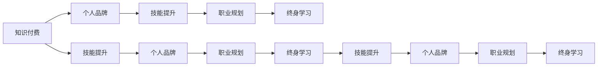

                 

# 知识付费时代程序员的个人发展策略

> 关键词：知识付费, 程序员发展, 个人品牌, 技能提升, 职业规划, 终身学习

## 1. 背景介绍

### 1.1 问题由来

随着知识付费浪潮的兴起，程序员面临的竞争环境愈加激烈。一方面，新技术层出不穷，旧技术被快速淘汰，从业者需要不断学习和适应；另一方面，企业对于程序员的技能要求越来越全面，既要有深度，也要有广度。如何在这一背景下实现个人发展，提升竞争力，已成为程序员普遍关注的问题。

### 1.2 问题核心关键点

程序员在知识付费时代应采取哪些策略来提升自身发展？这个问题的核心在于：如何利用付费知识资源，结合自身实际情况，制定合理的学习计划，构建个人品牌，拓展职业道路。

## 2. 核心概念与联系

### 2.1 核心概念概述

在探讨程序员个人发展策略时，有几个核心概念需要明确：

- **知识付费**：通过付费获取优质的教育资源，学习前沿技术和方法。
- **个人品牌**：通过持续学习和实践，在某一领域内建立自己独特的专业形象和影响力。
- **技能提升**：不断学习新技术、新方法，提高编程能力和解决问题的能力。
- **职业规划**：根据自身兴趣和市场需求，制定清晰的职业发展路线。
- **终身学习**：持续不断地学习，适应技术发展的变化。

这些概念之间相互关联，共同构成了程序员个人发展的核心框架。理解并应用这些概念，有助于我们在知识付费时代更好地实现个人发展。

### 2.2 核心概念原理和架构的 Mermaid 流程图



该流程图展示了知识付费、个人品牌、技能提升、职业规划和终身学习之间的联系。知识付费提供了学习资源，技能提升和个人品牌是学习的成果，职业规划和终身学习则是长期发展的指导和保障。

## 3. 核心算法原理 & 具体操作步骤

### 3.1 算法原理概述

程序员的个人发展策略，本质上是一种基于目标导向的学习策略。该策略的目标是通过不断获取和应用付费知识资源，提升自己的编程技能和解决问题的能力，同时在某一领域内建立独特的专业形象，制定清晰的职业发展路线，实现终身学习。

这一过程涉及多个阶段，包括目标设定、资源选择、学习方法、实践应用、成果展示和持续改进。每个阶段都需要细致规划和执行，才能实现个人发展的最优效果。

### 3.2 算法步骤详解

以下是基于知识付费的程序员个人发展策略的具体操作步骤：

**Step 1: 目标设定**
- 确定长远职业目标和短期技能提升目标。
- 分析自身优势和劣势，明确需要提升的领域。

**Step 2: 资源选择**
- 根据目标，筛选付费课程、书籍、文章等资源。
- 选择适合自己学习风格和节奏的资源。
- 关注领域内的知名专家和意见领袖，获取最新资讯和趋势。

**Step 3: 学习方法**
- 制定详细的学习计划，划分学习阶段和时间节点。
- 采用主动学习和深度学习的方式，注重理解和实践。
- 利用番茄工作法等时间管理技巧，提高学习效率。

**Step 4: 实践应用**
- 将所学知识应用到实际项目中，积累项目经验。
- 参与开源项目，贡献代码和文档，提升影响力。
- 通过构建个人作品集，展示自己的能力和成果。

**Step 5: 成果展示**
- 通过博客、社交媒体等渠道，分享学习心得和项目经验。
- 参与技术交流活动，建立专业网络。
- 建立个人网站或GitHub仓库，集中展示自己的作品和成果。

**Step 6: 持续改进**
- 定期回顾学习进度和职业发展状态，调整策略。
- 关注新技术和新方法，保持学习热情和动力。
- 向更高级别和技术领域挑战，不断拓展能力边界。

### 3.3 算法优缺点

基于知识付费的程序员个人发展策略具有以下优点：
1. 系统性：通过目标设定、资源选择、方法执行和成果展示的闭环流程，形成系统的个人发展路径。
2. 高效性：有针对性地选择付费资源，避免无效学习和资源浪费。
3. 可操作性：步骤明确，易于执行和跟踪。

然而，该策略也存在一些缺点：
1. 成本较高：高质量的付费知识资源通常价格不菲，可能存在一定的经济压力。
2. 知识过载：在资源丰富的时代，如何选择最有价值的学习材料是一个挑战。
3. 缺乏实践机会：在线学习多依赖于理论知识，实际操作经验不足。
4. 效果难评估：学习效果和职业发展的评估标准不统一，难以量化。

### 3.4 算法应用领域

知识付费的程序员个人发展策略不仅适用于软件开发领域，还可以应用于数据分析、人工智能、云计算等技术领域。任何需要持续学习、技术进步和职业发展的从业人员，都可以通过这一策略提升自己的能力。

## 4. 数学模型和公式 & 详细讲解 & 举例说明

### 4.1 数学模型构建

我们可以使用数学模型来描述基于知识付费的程序员个人发展过程。假设目标函数的为个人价值最大化 $V$，时间 $T$，学习效率 $E$，知识成本 $C$，知识资源数量 $N$，则有：

$$ V(T,E,C,N) = f(T,E) \cdot g(C,N) $$

其中 $f$ 为个人价值与时间和学习效率的关系，$g$ 为个人价值与知识成本和资源数量的关系。

### 4.2 公式推导过程

对于 $f$ 和 $g$ 的具体表达式，我们可以根据实际情况进行推导。例如，如果假设学习效率与时间成正比，则有：

$$ f(T,E) = E \cdot T $$

而对于 $g$，如果假设知识成本和资源数量成线性关系，则有：

$$ g(C,N) = C + kN $$

其中 $k$ 为知识资源对个人价值的边际贡献。

### 4.3 案例分析与讲解

以一名软件工程师为例，假设其目标是在一年内提升前端开发能力。他可以选择购买在线课程，参加线下培训，参与开源项目等，具体步骤如下：

1. 设定目标：提升前端开发能力，获取高级前端工程师职位。
2. 资源选择：选择包含React、Vue、Node.js等新技术的付费课程，选择知名的在线教育平台如Udemy、Coursera等。
3. 学习方法：制定学习计划，每天学习1-2小时，每周复习和实践。
4. 实践应用：在GitHub上建立个人仓库，贡献开源项目，展示项目经验。
5. 成果展示：在博客上分享学习心得和技术文章，参与技术社区讨论。
6. 持续改进：定期回顾学习进度，调整学习策略，关注新技术和项目需求。

## 5. 项目实践：代码实例和详细解释说明

### 5.1 开发环境搭建

在实际开发过程中，我们需要一个稳定的开发环境。以下是一个基本的开发环境配置流程：

1. 安装Python和pip，配置环境变量。
2. 安装必要的开发工具，如Visual Studio Code、Git等。
3. 设置开发环境，如虚拟环境、JDK等。
4. 安装依赖包，如Django、Flask等。
5. 配置版本控制系统，如Git，进行代码版本管理。

### 5.2 源代码详细实现

以下是一个简单的Python示例代码，用于展示如何使用Python进行软件开发：

```python
# 示例代码：计算两个数的和
def add(x, y):
    return x + y

# 测试代码
print(add(1, 2))  # 输出3
```

### 5.3 代码解读与分析

上述代码展示了基本的Python语法和函数实现。在实际项目中，开发者需要根据具体需求，设计复杂的算法和数据结构，并考虑性能优化、安全性和可维护性等因素。

### 5.4 运行结果展示

运行上述代码，输出为：

```
3
```

## 6. 实际应用场景

### 6.1 智能家居系统开发

智能家居系统开发是知识付费时代程序员个人发展的典型应用场景之一。通过学习物联网、人工智能、嵌入式系统等领域的知识，程序员可以设计并开发智能家居产品，如智能音箱、智能门锁、智能温控器等，满足人们的生活需求。

### 6.2 电商数据分析

电商平台数据分析是另一个热门应用场景。通过学习数据分析、机器学习、数据可视化等技术，程序员可以开发电商平台的智能推荐系统、销售预测系统、用户行为分析系统等，提升用户购物体验和平台运营效率。

### 6.3 企业级软件开发

企业级软件开发是程序员个人发展的另一条重要道路。通过学习Java、Spring、Docker等技术，程序员可以开发高效、可靠的企业级应用系统，如企业级CRM、ERP、HR系统等，帮助企业提高管理效率。

### 6.4 未来应用展望

随着技术的发展，知识付费时代的程序员将面临更多机会和挑战。人工智能、区块链、物联网等领域的技术应用，将为程序员带来新的发展方向。同时，云计算、大数据、微服务架构等新兴技术，也为程序员提供了更广阔的职业发展空间。

## 7. 工具和资源推荐

### 7.1 学习资源推荐

1. 《深入理解计算机系统》：学习计算机原理和系统设计。
2. 《程序员修炼之道》：提升软件开发能力和职业素养。
3. 《LeetCode》：通过算法练习提升编程能力。
4. 《数据科学导论》：学习数据分析和机器学习。
5. 《Udemy、Coursera》：学习前沿技术和方法。

### 7.2 开发工具推荐

1. Visual Studio Code：开发IDE，支持多种编程语言。
2. Git：版本控制系统，实现代码管理和协作。
3. Docker：容器化技术，简化开发和部署。
4. PostgreSQL：开源数据库，提供高效的数据存储和管理。
5. Kubernetes：容器编排工具，支持集群管理和扩展。

### 7.3 相关论文推荐

1. "Deep Learning" by Ian Goodfellow：深度学习领域的经典教材。
2. "Human-Computer Interaction" by Jon B..kafka：人机交互领域的经典教材。
3. "Programming Languages: Principles and Practice" by Matthias Felleisen：编程语言设计原理的教材。
4. "Software Architecture in Practice" by Peter J. Holmes：软件架构设计的教材。
5. "Design Patterns: Elements of Reusable Object-Oriented Software" by Erich Gamma：设计模式经典著作。

## 8. 总结：未来发展趋势与挑战

### 8.1 研究成果总结

基于知识付费的程序员个人发展策略，已经在实践中取得显著成效。通过系统学习、持续实践和成果展示，许多程序员在技术领域取得了突破性进展。这一策略不仅适用于技术领域，也适用于其他知识密集型行业。

### 8.2 未来发展趋势

未来的发展趋势将更加注重技术融合、跨学科学习和终身学习。以下趋势值得关注：

1. 技术融合：人工智能、大数据、物联网等技术的融合，将带来新的应用场景和机会。
2. 跨学科学习：程序员不仅需要掌握编程技术，还需要了解其他领域的知识，如心理学、经济学、社会学等。
3. 终身学习：知识更新速度加快，程序员需要持续学习，适应技术变化。

### 8.3 面临的挑战

尽管发展前景广阔，知识付费的程序员个人发展策略仍面临一些挑战：

1. 学习资源分散：海量的知识资源如何有效筛选和整合，是一个挑战。
2. 知识应用困难：如何将学到的知识应用到实际项目中，是一个难题。
3. 时间和精力不足：平衡学习和工作，是一个需要解决的问题。
4. 职业发展路径模糊：如何在多变的市场中找到适合自己的职业发展道路。

### 8.4 研究展望

未来，知识付费的程序员个人发展策略需要不断优化和改进，以应对新的挑战。以下是一些研究展望：

1. 学习资源智能化：开发智能化学习推荐系统，根据个人学习历史和兴趣推荐资源。
2. 知识应用平台化：构建知识应用平台，提供实际项目和开源项目，帮助程序员实践所学知识。
3. 职业发展引导：建立职业发展指导系统，帮助程序员规划职业道路和提升技能。
4. 社会化学习：鼓励社会化学习，建立技术社区，促进知识交流和合作。

总之，知识付费时代为程序员提供了广阔的发展空间，但也需要持续学习和实践，才能真正实现个人价值的最大化。只有不断提升自我，适应技术变化，才能在激烈的市场竞争中脱颖而出。

## 9. 附录：常见问题与解答

**Q1: 程序员应该如何制定学习计划？**

A: 制定学习计划需要考虑以下步骤：
1. 确定目标：明确学习目标，包括短期和长期目标。
2. 资源选择：筛选与目标相关的付费课程、书籍和文章。
3. 时间管理：合理分配时间，使用番茄工作法等时间管理技巧。
4. 反馈调整：定期回顾学习进度，调整学习计划。

**Q2: 如何提升编程能力？**

A: 提升编程能力需要多方面的努力：
1. 学习算法和数据结构：通过《算法导论》等书籍，掌握常见算法和数据结构。
2. 参与开源项目：在GitHub上参与开源项目，积累实践经验。
3. 编写代码：通过LeetCode等平台，编写代码，提升编程能力。
4. 阅读源码：学习经典开源项目，如Linux内核、TensorFlow等，理解其设计和实现。

**Q3: 如何建立个人品牌？**

A: 建立个人品牌需要以下几个步骤：
1. 确定领域：选择适合自己的技术领域，如前端开发、人工智能等。
2. 编写博客：在博客上分享学习心得和项目经验，积累读者。
3. 参与社区：加入技术社区，如Stack Overflow、GitHub等，积极参与讨论和贡献。
4. 发布作品：通过个人网站或GitHub仓库，展示自己的项目和技术成果。

**Q4: 如何持续改进？**

A: 持续改进需要以下几个步骤：
1. 定期回顾：定期回顾学习进度和职业发展状态。
2. 学习新技术：关注新技术和前沿技术，学习新知识。
3. 调整策略：根据个人成长和市场需求，调整学习策略。
4. 不断实践：将所学知识应用到实际项目中，积累经验。

总之，知识付费时代为程序员提供了新的发展机会，但也需要付出更多的努力和投入。通过系统学习、持续实践和成果展示，程序员可以在技术和职业发展上取得突破，实现个人价值的最大化。

---

作者：禅与计算机程序设计艺术 / Zen and the Art of Computer Programming

