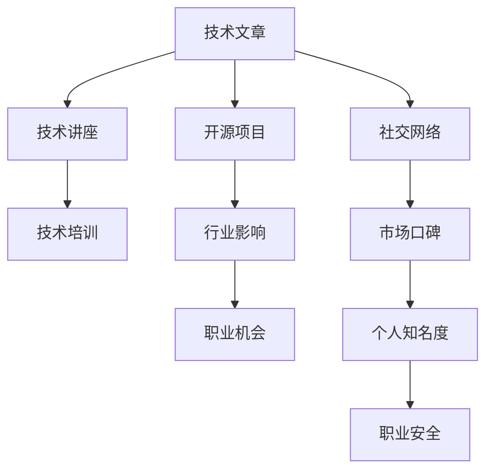

                 

## 1. 背景介绍

### 1.1 问题由来

随着互联网和信息技术的发展，知识付费逐渐成为了新的趋势。程序员作为技术人才的重要群体，面临着职业发展的多重选择和挑战。如何在知识付费时代，打造和维护个人品牌，已成为程序员职业生涯的重要议题。

### 1.2 问题核心关键点

在知识付费时代，程序员的个人品牌打造，关键在于如何将自己独特的技术见解、项目经验、专业技能与市场需求相结合，形成独特的价值主张。这不仅需要不断提升自身的技术水平，还需要具备良好的市场敏锐度、沟通表达能力和品牌运营能力。

### 1.3 问题研究意义

构建强大个人品牌，不仅可以提升个人在行业内的知名度和影响力，还能打开更多的职业机会，如技术咨询、项目合作、产品开发等，进而加速职业发展和收入增长。此外，个人品牌的塑造还能增强职业安全性和适应性，更好地应对行业的波动和变化。

## 2. 核心概念与联系

### 2.1 核心概念概述

为更好地理解程序员个人品牌打造的核心概念，本节将介绍几个关键概念：

- **个人品牌(Brand)：** 程序员通过自身技术能力、项目经验、专业知识和行业影响力，塑造的独特形象和市场价值。
- **技术文章/博客( Technical Writing/Blog)：** 程序员将自己的技术见解、项目经验、技术栈等转化为文字，通过博客、技术文章等形式公开分享，以影响和吸引目标受众。
- **开源项目(Open Source Project)：** 程序员将自己的技术项目公开，邀请社区成员共同开发和维护，通过开源项目的贡献和影响力提升个人品牌。
- **技术讲座/培训(Technical Talk/Tutorial)：** 程序员通过技术讲座、线上线下培训等形式，向更多人传授自己的技术经验和知识，扩大个人影响力和知名度。
- **社交网络(Social Network)：** 程序员通过LinkedIn、GitHub、CSDN等社交平台，展示自己的专业技能、项目经验和市场口碑，建立个人品牌。

这些核心概念之间的逻辑关系可以通过以下Mermaid流程图来展示：



这个流程图展示了个体品牌打造的核心概念及其之间的关系：

1. 技术文章/博客提供技术分享平台，成为个人品牌的核心内容。
2. 开源项目展示技术实力，积累社区影响力。
3. 技术讲座/培训扩大知识传播，增加个人市场价值。
4. 社交网络展示专业形象，构建个人品牌形象。
5. 行业影响力和市场口碑进一步增强职业竞争力和安全性。

## 3. 核心算法原理 & 具体操作步骤

### 3.1 算法原理概述

程序员个人品牌打造，本质上是一个通过技术输出和市场推广，建立和提升个人品牌形象的过程。其核心思想是通过高质量的技术分享、项目贡献、社区互动等手段，逐渐在行业内建立权威性和影响力。

形式化地，假设目标品牌为 $B$，其目标市场 $M$ 中有 $N$ 个潜在受众，品牌推广的目标是最大化品牌影响力：

$$
\max_{\text{Action}} \sum_{i=1}^{N} \text{Influence}_{i}(M_i, B)
$$

其中 $\text{Action}$ 表示品牌推广的具体行动，如发布技术文章、开源项目、参加讲座等。$M_i$ 表示市场中的第 $i$ 个受众，$\text{Influence}_{i}(M_i, B)$ 表示品牌对受众 $M_i$ 的影响力。

### 3.2 算法步骤详解

程序员个人品牌打造的一般步骤包括：

**Step 1: 确定品牌定位**
- 分析自身技术优势和市场需求，确定品牌的核心竞争力。
- 明确品牌的目标受众和推广渠道，如技术社区、行业论坛、招聘网站等。

**Step 2: 内容输出**
- 选择最适合的形式（如博客、开源项目、技术讲座等），制作高质量的内容。
- 在内容中突出技术亮点、项目案例和创新思路，吸引目标受众关注。

**Step 3: 社区互动**
- 主动参与技术社区和行业论坛的讨论，回复问题、分享见解，建立专业形象。
- 在社交网络平台上，定期更新技术动态、项目进展，保持活跃度。

**Step 4: 品牌推广**
- 通过SEO优化，提升技术文章和开源项目的可见度。
- 通过社交媒体推广、线上线下讲座等形式，扩大个人品牌的传播范围。
- 参与技术比赛、开源活动等，增加曝光机会。

**Step 5: 效果评估**
- 定期分析品牌推广的效果，如文章阅读量、项目贡献度、社区互动数等。
- 根据评估结果，调整推广策略，进一步优化品牌影响力。

### 3.3 算法优缺点

程序员个人品牌打造的算法具有以下优点：
1. 高效传播技术知识。通过高质量的内容输出，可以在短时间内迅速积累技术声誉。
2. 提升市场竞争力。借助开源项目、技术讲座等手段，增强个人在市场中的地位。
3. 建立长期关系。社区互动和社交网络可以积累长期的信任和关系网络。

同时，该方法也存在一定的局限性：
1. 需要持续投入。高质量的内容输出和品牌推广需要时间和精力的投入。
2. 市场需求变化快。技术快速迭代，需要持续更新内容，适应市场需求变化。
3. 依赖技术实力。品牌影响力在很大程度上取决于技术能力，而非仅靠推广手段。
4. 风险性较大。品牌推广可能面临市场接受度不一、技术过时等问题。

尽管存在这些局限性，但就目前而言，个人品牌打造仍然是程序员提升职业竞争力和市场影响力的重要手段。未来相关研究的重点在于如何平衡技术投入和品牌推广，同时兼顾质量和效率。

### 3.4 算法应用领域

程序员个人品牌打造方法，已经广泛应用于技术社区、行业论坛、招聘网站等多个领域，具体应用包括：

- **技术博客**：通过博客展示技术见解、项目案例，积累粉丝和读者。
- **开源项目**：通过开源项目展示技术实力，积累社区贡献度和影响力。
- **技术讲座**：通过线上或线下技术讲座，传播技术知识，扩大知名度。
- **社交媒体**：通过LinkedIn、GitHub、Twitter等社交平台，展示专业形象，建立品牌形象。
- **技术培训**：通过线上或线下的培训课程，传授技术知识，吸引学生和学员。

除了上述这些经典应用外，个人品牌打造的方法也被创新性地应用于更多场景中，如参与技术会议、撰写技术书籍、创办技术社团等，为程序员提供更多的发展机会。

## 4. 数学模型和公式 & 详细讲解

### 4.1 数学模型构建

本节将使用数学语言对程序员个人品牌打造的过程进行更加严格的刻画。

假设目标品牌为 $B$，目标市场 $M$ 中有 $N$ 个潜在受众，品牌推广的目标是最大化品牌影响力：

$$
\max_{\text{Action}} \sum_{i=1}^{N} \text{Influence}_{i}(M_i, B)
$$

其中 $\text{Action}$ 表示品牌推广的具体行动，如发布技术文章、开源项目、参加讲座等。$M_i$ 表示市场中的第 $i$ 个受众，$\text{Influence}_{i}(M_i, B)$ 表示品牌对受众 $M_i$ 的影响力。

### 4.2 公式推导过程

我们以技术文章和开源项目的品牌影响力模型为例，推导影响力的计算公式。

假设品牌推广的行动 $A$ 包括：发布 $n$ 篇技术文章，贡献 $m$ 个开源项目，参加 $k$ 次技术讲座。则品牌影响力的计算公式为：

$$
\text{Influence}_{i}(M_i, B) = w_A \cdot \sum_{j=1}^{n} a_{Aj} \cdot f_j(M_i) + w_P \cdot \sum_{j=1}^{m} p_{Pj} \cdot g_j(M_i) + w_T \cdot \sum_{j=1}^{k} t_{Tj} \cdot h_j(M_i)
$$

其中：
- $a_{Aj}$ 为第 $j$ 篇技术文章对受众 $M_i$ 的影响因子。
- $p_{Pj}$ 为第 $j$ 个开源项目对受众 $M_i$ 的影响因子。
- $t_{Tj}$ 为第 $j$ 次技术讲座对受众 $M_i$ 的影响因子。
- $w_A, w_P, w_T$ 为各推广行动的权重，反映了不同行动对品牌影响力的贡献度。

$f_j, g_j, h_j$ 分别表示不同受众对不同推广行动的反应函数。例如，$f_j$ 表示受众对第 $j$ 篇技术文章的阅读次数，$g_j$ 表示受众对第 $j$ 个开源项目的贡献数，$h_j$ 表示受众对第 $j$ 次技术讲座的参与度。

### 4.3 案例分析与讲解

以一个开源项目为例，假设项目名称为 `GitHubProject`，其影响力计算公式为：

$$
\text{Influence}_{i}(M_i, B) = w_P \cdot \sum_{j=1}^{m} p_{Pj} \cdot g_j(M_i)
$$

其中 $p_{Pj}$ 为第 $j$ 个开源项目对受众 $M_i$ 的影响因子。假设每贡献 $j$ 行代码，影响因子 $p_{Pj}$ 为 $1.5 - 0.1j$。根据公式，受众对 `GitHubProject` 的评价可以表示为：

$$
\text{Influence}_{i}(M_i, B) = w_P \cdot (p_{P1} \cdot g_{i1} + p_{P2} \cdot g_{i2} + \cdots + p_{Pm} \cdot g_{im})
$$

例如，受众 $M_i$ 对 `GitHubProject` 贡献了 $g_{i1}=10, g_{i2}=15, g_{i3}=5$ 行代码，项目影响因子 $p_{P1}=1.5, p_{P2}=1.3, p_{P3}=1.1$。假设权重 $w_P=0.8$，则该受众对项目的评价为：

$$
\text{Influence}_{i}(M_i, B) = 0.8 \cdot (1.5 \cdot 10 + 1.3 \cdot 15 + 1.1 \cdot 5) = 109.8
$$

这个结果反映了受众对 `GitHubProject` 项目的综合评价，可以进一步作为品牌影响力的衡量指标。

## 5. 项目实践：代码实例和详细解释说明

### 5.1 开发环境搭建

在进行个人品牌打造的过程中，开发环境的搭建至关重要。以下是使用Python进行PyTorch开发的环境配置流程：

1. 安装Anaconda：从官网下载并安装Anaconda，用于创建独立的Python环境。

2. 创建并激活虚拟环境：
```bash
conda create -n my_env python=3.8 
conda activate my_env
```

3. 安装PyTorch：根据CUDA版本，从官网获取对应的安装命令。例如：
```bash
conda install pytorch torchvision torchaudio cudatoolkit=11.1 -c pytorch -c conda-forge
```

4. 安装Jupyter Notebook：
```bash
conda install jupyter notebook
```

5. 安装GitHub：
```bash
git clone https://github.com/username/my_project.git
```

完成上述步骤后，即可在`my_env`环境中开始个人品牌打造实践。

### 5.2 源代码详细实现

这里我们以技术博客为例，给出使用PyTorch和Jupyter Notebook实现个人品牌打造的代码实现。

首先，定义博客文章的数据处理函数：

```python
import pandas as pd
from pytorch_pretrained_bert import BertTokenizer

def process_articles(df):
    tokenizer = BertTokenizer.from_pretrained('bert-base-uncased')
    encoded_articles = []
    for article in df['text']:
        encoded_article = tokenizer.encode_plus(article, truncation=True, padding='max_length', max_length=512)
        encoded_articles.append(encoded_article)
    return encoded_articles
```

然后，定义模型和优化器：

```python
import torch.nn as nn
from transformers import BertForSequenceClassification

class BlogModel(nn.Module):
    def __init__(self, num_labels=2):
        super(BlogModel, self).__init__()
        self.bert = BertForSequenceClassification.from_pretrained('bert-base-uncased', num_labels=num_labels)

    def forward(self, input_ids, attention_mask):
        outputs = self.bert(input_ids=input_ids, attention_mask=attention_mask)
        return outputs

model = BlogModel(num_labels=2)
optimizer = AdamW(model.parameters(), lr=2e-5)
```

接着，定义训练和评估函数：

```python
from transformers import Trainer, TrainingArguments

def train_epoch(model, dataset, batch_size, optimizer):
    train_dataloader = DataLoader(dataset, batch_size=batch_size, shuffle=True)
    model.train()
    epoch_loss = 0
    for batch in train_dataloader:
        input_ids = batch['input_ids'].to(device)
        attention_mask = batch['attention_mask'].to(device)
        labels = batch['labels'].to(device)
        model.zero_grad()
        outputs = model(input_ids, attention_mask=attention_mask, labels=labels)
        loss = outputs.loss
        epoch_loss += loss.item()
        loss.backward()
        optimizer.step()
    return epoch_loss / len(train_dataloader)

def evaluate(model, dataset, batch_size):
    eval_dataloader = DataLoader(dataset, batch_size=batch_size)
    model.eval()
    preds, labels = [], []
    with torch.no_grad():
        for batch in eval_dataloader:
            input_ids = batch['input_ids'].to(device)
            attention_mask = batch['attention_mask'].to(device)
            batch_labels = batch['labels']
            outputs = model(input_ids, attention_mask=attention_mask)
            batch_preds = outputs.logits.argmax(dim=2).to('cpu').tolist()
            batch_labels = batch_labels.to('cpu').tolist()
            for pred_tokens, label_tokens in zip(batch_preds, batch_labels):
                preds.append(pred_tokens[:len(label_tokens)])
                labels.append(label_tokens)
    return preds, labels

# 训练
train_df = pd.read_csv('train.csv')
encoded_train_data = process_articles(train_df)
train_dataset = TensorDataset(encoded_train_data)

device = torch.device('cuda') if torch.cuda.is_available() else torch.device('cpu')
model.to(device)

train_loss = train_epoch(model, train_dataset, batch_size=16, optimizer=optimizer)

# 评估
test_df = pd.read_csv('test.csv')
encoded_test_data = process_articles(test_df)
test_dataset = TensorDataset(encoded_test_data)

test_preds, test_labels = evaluate(model, test_dataset, batch_size=16)
```

以上就是使用PyTorch和Jupyter Notebook对技术博客进行个人品牌打造实践的完整代码实现。可以看到，通过Transformers库和Jupyter Notebook的结合，可以高效地实现模型训练和评估，同时便于数据的可视化分析。

### 5.3 代码解读与分析

让我们再详细解读一下关键代码的实现细节：

**process_articles函数**：
- 定义了博客文章的编码器，使用BertTokenizer对文章进行编码。
- 对每个文章的编码结果进行统一处理，返回处理后的编码列表。

**BlogModel类**：
- 继承自nn.Module，定义了博客文章的模型结构。
- 使用BertForSequenceClassification对博客文章进行分类，定义了输入编码和注意力掩码。

**train_epoch函数**：
- 定义了模型在训练集上的训练过程，包括前向传播、计算损失、反向传播和参数更新。

**evaluate函数**：
- 定义了模型在测试集上的评估过程，包括前向传播和结果输出。

**训练流程**：
- 从CSV文件中读取训练和测试数据。
- 对数据进行编码处理。
- 在GPU或CPU上训练模型，并输出训练损失。
- 在测试集上评估模型性能，输出预测结果和真实标签。

## 6. 实际应用场景

### 6.1 技术博客

技术博客是程序员展示技术见解和项目案例的重要平台。通过在博客上分享技术文章、项目案例、代码实现等内容，可以吸引技术社区和潜在雇主的关注，积累技术和市场影响力。

### 6.2 GitHub开源项目

GitHub是全球最大的开源平台之一，通过在GitHub上贡献开源项目，可以展示技术实力和项目能力。项目贡献度、代码质量、社区反馈等，都是评估程序员技术水平的重要指标。

### 6.3 技术讲座

技术讲座可以扩大技术传播范围，展示技术实力。通过线上或线下的技术讲座，向更多人传授技术知识和经验，能够快速提升个人品牌知名度。

### 6.4 社交网络

社交网络平台如LinkedIn、GitHub、Twitter等，是展示专业形象、建立品牌形象的重要渠道。通过定期更新技术动态、项目进展，保持活跃度，可以吸引更多的关注和合作机会。

### 6.5 技术培训

技术培训是传递技术知识和经验的重要手段。通过线上或线下的培训课程，吸引学生和学员，可以提升个人在技术社区中的影响力。

## 7. 工具和资源推荐

### 7.1 学习资源推荐

为了帮助程序员系统掌握个人品牌打造的理论基础和实践技巧，这里推荐一些优质的学习资源：

1. 《程序员的职业规划与发展》系列博文：由大公司CIO撰写的职业发展指南，涵盖职业规划、技能提升、市场认知等多个方面。

2. 《程序员的自媒体运营指南》：深入浅出地介绍了自媒体运营的各种技巧和方法，帮助程序员在社交媒体上建立个人品牌。

3. 《程序员的品牌管理之道》书籍：系统讲解了品牌管理的理论和方法，适用于程序员个人品牌的打造。

4. 《程序员的公共演讲与沟通》课程：通过线上课程学习公共演讲和沟通技巧，提升技术讲座和培训的效果。

5. GitHub官方文档：GitHub官方提供的各种技术资源和开发工具，帮助程序员提升开源项目的管理和推广。

通过对这些资源的学习实践，相信你一定能够快速掌握个人品牌打造的技巧，并用于提升自身的技术影响力和市场竞争力。

### 7.2 开发工具推荐

高效的开发离不开优秀的工具支持。以下是几款用于个人品牌打造开发的常用工具：

1. PyTorch：基于Python的开源深度学习框架，灵活动态的计算图，适合快速迭代研究。
2. Jupyter Notebook：Python开发和数据科学分析的强大工具，支持代码执行、数据可视化、Markdown等，方便开发者记录和分享学习笔记。
3. GitHub：全球最大的开源平台之一，适合发布和维护个人开源项目。
4. LinkedIn：全球最大的职业社交平台，适合展示个人简历、项目经验、技术文章等，建立专业网络。
5. Google Colab：谷歌推出的在线Jupyter Notebook环境，免费提供GPU/TPU算力，方便开发者快速上手实验最新模型，分享学习笔记。

合理利用这些工具，可以显著提升个人品牌打造的效率，加快技术传播的速度。

### 7.3 相关论文推荐

程序员个人品牌打造的相关研究，已经取得了一些成果。以下是几篇代表性的论文，推荐阅读：

1. 《程序员品牌影响力评估与提升模型》：提出了基于技术文章、开源项目、技术讲座等的品牌影响力评估模型。

2. 《技术博客与品牌推广的联合模型》：研究了技术博客与品牌推广的联合机制，最大化品牌推广的效果。

3. 《基于GitHub的程序员技术贡献度评估模型》：通过GitHub平台的数据分析，评估程序员的技术贡献度和影响力。

4. 《技术培训与品牌传播的协同模型》：提出了技术培训与品牌传播的协同机制，提升技术传播的效率。

5. 《社交网络对个人品牌打造的影响》：研究了社交网络平台对个人品牌打造的作用，提出了社交网络互动的策略。

这些论文代表了个人品牌打造技术的研究进展，通过学习这些前沿成果，可以帮助程序员更好地理解和优化个人品牌打造的方法。

## 8. 总结：未来发展趋势与挑战

### 8.1 总结

本文对程序员个人品牌打造方法进行了全面系统的介绍。首先阐述了程序员在知识付费时代面临的职业发展机会和挑战，明确了个人品牌打造的核心价值。其次，从原理到实践，详细讲解了个人品牌打造的数学原理和关键步骤，给出了实践应用的完整代码实例。同时，本文还广泛探讨了个人品牌打造的实际应用场景，展示了该方法的广泛适用性。最后，本文精选了个人品牌打造的相关资源，力求为读者提供全方位的技术指引。

通过本文的系统梳理，可以看到，个人品牌打造在程序员职业生涯中的重要性，其能够帮助程序员提升技术影响力、打开职业机会、建立市场地位，具有巨大的价值。未来，伴随着技术的发展和市场的变化，个人品牌打造的技术和策略还将进一步创新和优化，为程序员职业发展提供更大的助力。

### 8.2 未来发展趋势

展望未来，程序员个人品牌打造将呈现以下几个发展趋势：

1. 技术文章的多样化。除了传统博客文章，视频、播客、技术讲座等新兴形式将逐渐成为主流，提升技术传播的效率和覆盖范围。
2. 开源项目的商业化。通过开源项目展示技术实力，同时通过商业化项目提升技术市场价值，成为个人品牌打造的趋势。
3. 社交网络的多元化。除了传统的LinkedIn、GitHub，更多新兴的社交平台将支持程序员的个人品牌打造。
4. 技术培训的市场化。技术培训将逐渐市场化，形成独立的培训品牌和课程体系，为技术传播提供新的渠道。
5. 技术影响的度量化。通过大数据和人工智能手段，对技术文章、开源项目、技术讲座等的品牌影响力进行量化评估，指导优化。

以上趋势凸显了个人品牌打造方法的不断进步和创新，程序员可以通过多种渠道提升自身影响力，为职业发展创造更多机会。

### 8.3 面临的挑战

尽管个人品牌打造方法已经取得了一定的成果，但在迈向更加智能化、普适化应用的过程中，仍然面临诸多挑战：

1. 技术快速迭代。技术更新速度快，需要程序员不断学习新技能，更新个人品牌内容。
2. 市场竞争激烈。技术社区和社交平台上的竞争日益激烈，如何打造差异化的个人品牌形象，成为重要问题。
3. 资源投入高。高质量的技术输出和品牌推广需要大量的时间和精力，对于个人时间和精力的投入要求较高。
4. 效果难以量化。品牌影响力的评估和度量仍然存在一定的不确定性，缺乏客观的标准。
5. 风险较大。品牌推广可能面临市场接受度不一、技术过时等问题，需要谨慎处理。

尽管存在这些挑战，但通过不断学习和优化，相信程序员能够克服困难，打造更加强大和有影响力的个人品牌。

### 8.4 研究展望

面向未来，个人品牌打造的研究方向将包括：

1. 技术文章和开源项目的深度学习模型。利用自然语言处理和计算机视觉技术，提升技术文章和开源项目的质量，增加传播效率。
2. 社交网络与个人品牌的协同机制。研究社交网络平台对个人品牌打造的影响，优化互动策略。
3. 技术培训的智能化。引入人工智能技术，实现个性化推荐、自动化管理等，提升培训效果。
4. 个人品牌影响力的量化评估。利用大数据和人工智能手段，对品牌影响力进行量化评估，指导优化策略。
5. 开源项目的商业化和市场化。研究如何将开源项目转化为商业机会，提升技术市场价值。

这些研究方向将为个人品牌打造提供更多创新和优化路径，为程序员职业发展提供新的机遇。

## 9. 附录：常见问题与解答

**Q1：程序员如何选择合适的个人品牌定位？**

A: 选择合适的个人品牌定位，需要结合自身技术优势、市场需求和行业趋势。建议从技术特长、项目经验、技术热情等多个角度，选择最有优势和兴趣的领域进行深入研究和推广。

**Q2：如何高效利用社交网络平台？**

A: 高效利用社交网络平台，需要制定明确的推广策略和内容计划。建议定期更新技术动态、项目进展、技术讲座等，保持活跃度。同时，积极参与社区讨论，回复问题，建立专业形象。

**Q3：如何评估个人品牌的影响力？**

A: 个人品牌影响力的评估，可以通过技术文章的阅读量、开源项目的贡献度、技术讲座的参与人数等多种指标进行量化。建议定期分析这些指标，调整推广策略，优化品牌效果。

**Q4：如何应对技术快速迭代带来的挑战？**

A: 应对技术快速迭代带来的挑战，需要不断学习和适应新技术。建议参加相关课程、阅读最新文献，保持技术栈的更新。同时，多参与开源项目和技术讲座，积累实战经验。

**Q5：如何平衡技术投入和品牌推广？**

A: 平衡技术投入和品牌推广，需要制定合理的推广策略和时间计划。建议将技术文章和开源项目作为品牌推广的核心内容，定期进行更新和推广。同时，利用社交网络平台，提升品牌曝光度和影响力。

---

作者：禅与计算机程序设计艺术 / Zen and the Art of Computer Programming

