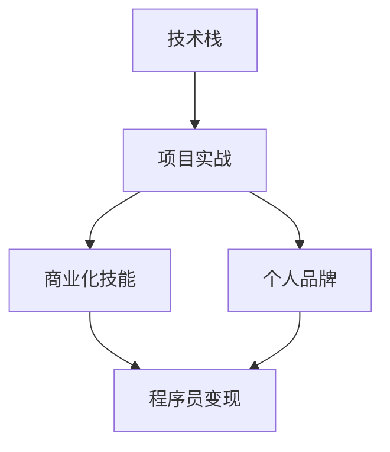

                 

# 知识付费时代程序员的致富之路

## 1. 背景介绍

### 1.1 问题由来
随着互联网的迅猛发展和数字经济的崛起，程序员作为一个高技能、高需求的职业群体，面临着前所未有的机遇与挑战。在知识付费时代，程序员的知识和技能被视为极具价值的资产，通过技术赋能，可以实现职业转型、创业变现、财务自由等多样化收益。本文将深入探讨知识付费时代程序员的致富之路，通过技术栈、市场趋势、商业模式等关键维度的剖析，为程序员提供切实可行的职业发展策略。

### 1.2 问题核心关键点
程序员在知识付费时代致富的关键在于掌握以下核心要素：
- **技术栈的全面性**：掌握主流的编程语言和框架，如Java、Python、JavaScript等，同时了解云服务、大数据、人工智能等前沿技术。
- **项目实战能力**：具备解决实际问题的能力，积累丰富的项目经验，能够应对复杂、多样化的需求。
- **商业意识和创新能力**：具备产品设计、市场分析、项目管理等商业技能，能够识别市场机会，打造具有竞争力的产品。
- **营销与品牌建设**：拥有良好的线上线下营销能力，能够通过内容创作、社群运营等方式建立个人品牌，实现个人品牌价值变现。
- **持续学习与更新**：保持对新技术、新知识的持续学习和探索，始终处于行业前沿。

## 2. 核心概念与联系

### 2.1 核心概念概述
为深入理解程序员如何在知识付费时代致富，本节将介绍几个核心概念：

- **知识付费**：一种新兴的商业模式，通过知识和技能的分享，实现对知识消费者的收费，包括在线课程、技术博客、咨询服务等。
- **程序员变现**：程序员将自身的技术知识和经验转化为经济收益，包括全职创业、兼职咨询、技术博客、开源贡献等。
- **技术栈**：程序员需要掌握的编程语言、框架、工具集，以及相关领域的知识。
- **项目实战**：通过实际项目积累经验，解决实际问题，提升技术能力和业务理解。
- **商业化技能**：包括产品设计、市场分析、项目管理等商业知识和技能。
- **个人品牌**：通过内容创作、社交媒体运营等方式，在专业领域内建立知名度和信任度。

这些概念之间存在密切联系，技术栈和项目实战能力的提升是变现的基础，而商业化技能和个人品牌的建设则是变现的关键。

### 2.2 核心概念原理和架构的 Mermaid 流程图(Mermaid 流程节点中不要有括号、逗号等特殊字符)



该流程图展示了核心概念之间的相互关系和作用机制：技术栈和项目实战能力为变现奠定基础，商业化技能和品牌建设则推动变现。技术栈、项目实战、商业化技能、个人品牌构成了一个良性循环，共同支撑程序员在知识付费时代的财富积累。

## 3. 核心算法原理 & 具体操作步骤
### 3.1 算法原理概述

基于知识付费模式的程序员致富之路，核心在于将技术知识转化为商业价值，其基本算法原理如下：

1. **数据收集与处理**：收集和整理海量的技术文档、案例、工具等资源，利用自然语言处理、信息检索等技术进行处理和分类。
2. **知识组织与展示**：将处理后的知识组织成有结构的形式，如课程、文章、博客等，并通过网站、应用程序等平台进行展示。
3. **个性化推荐**：利用机器学习算法，根据用户的行为数据，推荐个性化的内容，提高用户粘性和转化率。
4. **定价与销售**：根据内容的价值和使用频率，制定合理的定价策略，并通过平台进行销售。
5. **营销与推广**：通过社交媒体、邮件营销、SEO优化等手段，推广内容，吸引潜在用户。
6. **用户反馈与优化**：收集用户反馈，不断优化内容和推荐算法，提升用户体验和满意度。

### 3.2 算法步骤详解

基于上述算法原理，程序员致富的具体操作步骤如下：

**Step 1: 数据收集与处理**

1. 通过GitHub、技术博客、书籍、视频教程等渠道，收集海量的技术相关资源。
2. 利用文本分析、分类算法等技术，对收集到的资源进行初步筛选和分类。
3. 通过数据清洗、归一化处理等手段，确保数据的质量和一致性。

**Step 2: 知识组织与展示**

1. 将处理后的数据进行结构化组织，如创建课程目录、技术博客、代码示例等。
2. 使用HTML、Markdown等语言编写和排版内容，确保信息展示的清晰和易读性。
3. 将内容上传至个人网站、技术社区、博客平台等，进行公开分享。

**Step 3: 个性化推荐**

1. 收集用户的行为数据，包括浏览记录、购买行为、评价反馈等。
2. 利用协同过滤、内容推荐、深度学习等算法，为用户推荐相关内容。
3. 实时更新推荐算法，根据用户反馈进行优化，提升推荐效果。

**Step 4: 定价与销售**

1. 根据内容的难度、深度、价值等因素，制定合理的定价策略，如单次购买、订阅制、按需付费等。
2. 使用支付平台、电子商务平台等工具，实现内容的在线销售和结算。
3. 提供多样化的支付方式和优惠活动，提高用户购买意愿。

**Step 5: 营销与推广**

1. 通过社交媒体、邮件营销、SEO优化等手段，推广内容，吸引潜在用户。
2. 利用广告投放、内容付费等策略，增加内容的曝光率和用户转化率。
3. 定期举办线上线下的技术分享会、培训课程等活动，建立用户社群，增强品牌影响力。

**Step 6: 用户反馈与优化**

1. 收集用户的反馈意见，包括评价、评论、建议等。
2. 分析用户反馈，识别内容中的问题和不足之处。
3. 根据用户反馈进行内容更新和优化，提高用户满意度和黏性。

### 3.3 算法优缺点

基于知识付费模式的程序员致富算法具有以下优点：

1. **灵活性高**：适合不同技术栈和项目类型的程序员，能够根据自身的特点和兴趣，选择适合自己的变现方式。
2. **市场潜力大**：知识付费市场潜力巨大，市场需求多样，程序员可以根据自己的专长和兴趣，找到合适的变现领域。
3. **可操作性强**：大部分变现操作可以通过互联网平台进行，无需大规模的资金投入和物理资源。
4. **效率高**：借助自动化工具和推荐算法，可以快速覆盖大量用户，提高变现效率。

然而，该算法也存在一些缺点：

1. **依赖平台**：大部分变现操作需要依赖第三方平台，可能受到平台规则、收费政策等因素的限制。
2. **内容质量要求高**：高质量的内容是变现的基础，需要程序员具备较强的知识积累和内容创作能力。
3. **市场竞争激烈**：知识付费市场竞争激烈，如何在众多内容中脱颖而出，需要独特的内容和创新的营销手段。
4. **用户获取难度大**：在早期阶段，获取足够的用户量和流量是一个挑战，需要通过持续的内容输出和营销活动来积累。

### 3.4 算法应用领域

基于知识付费模式的程序员致富算法，主要应用于以下几个领域：

1. **在线课程**：通过制作技术课程，向学习者收费。适合具备系统化知识的程序员，如通过Coursera、Udemy等平台进行变现。
2. **技术博客**：通过撰写技术文章，向读者收费。适合具有较强文字表达和内容创作能力的程序员，如通过Medium、知乎等平台进行变现。
3. **开源贡献**：通过在开源项目上进行贡献，并通过GitHub Sponsors等平台获得捐赠。适合对开源社区有贡献意愿的程序员。
4. **技术咨询服务**：通过提供技术咨询、项目定制等服务，向企业或个人收费。适合具备丰富项目经验和高技术水平的程序员。
5. **技术培训**：通过举办线下或线上的技术培训课程，向学员收费。适合具备教学能力和项目管理经验的程序员。
6. **工具开发与销售**：开发并销售自有技术工具或插件，向用户收费。适合具备软件工程能力的程序员。

## 4. 数学模型和公式 & 详细讲解 & 举例说明

### 4.1 数学模型构建

为更好地理解程序员在知识付费时代致富的算法模型，本节将介绍几个关键数学模型：

1. **协同过滤推荐模型**：利用用户和物品之间的相似性，为用户推荐个性化的内容。
2. **内容推荐算法**：基于内容的相似性，为用户推荐相关内容，如基于TF-IDF、协同矩阵等方法。
3. **用户行为分析模型**：通过分析用户行为数据，预测用户对内容的喜好和兴趣。

### 4.2 公式推导过程

以下将详细推导协同过滤推荐模型的数学公式。

**协同过滤推荐模型**：假设用户集合为 $U=\{u_1,u_2,\cdots,u_M\}$，物品集合为 $I=\{i_1,i_2,\cdots,i_N\}$，用户 $u$ 对物品 $i$ 的评分 $r_{ui}$ 构成矩阵 $R$。协同过滤模型的目标是通过矩阵 $R$ 预测用户 $u$ 对物品 $i$ 的评分 $r_{ui}$。

设用户 $u$ 和物品 $i$ 的向量表示分别为 $\boldsymbol{u}$ 和 $\boldsymbol{i}$，协同过滤模型可以通过矩阵分解的方式，将 $R$ 分解为两个低秩矩阵 $P$ 和 $Q$：

$$
R = PQ^T
$$

其中 $P \in \mathbb{R}^{M \times K}, Q \in \mathbb{R}^{K \times N}$，$K$ 为分解维度。协同过滤模型的目标是最小化预测误差 $\epsilon$：

$$
\epsilon = \|R - PQ^T\|_F^2
$$

利用梯度下降等优化算法，最小化预测误差，即可得到 $P$ 和 $Q$ 的优化解，进而预测用户 $u$ 对物品 $i$ 的评分 $r_{ui}$。

### 4.3 案例分析与讲解

以在线课程变现为例，分析协同过滤推荐模型的应用：

假设某在线课程平台上有 $M=10$ 门课程，$N=100$ 名用户，用户对课程的评分构成矩阵 $R \in \mathbb{R}^{10 \times 100}$。通过协同过滤推荐模型，可以为用户推荐与其兴趣相似的其他课程，从而增加课程购买和完成率。

具体步骤包括：
1. 收集用户对课程的评分数据，形成矩阵 $R$。
2. 将 $R$ 分解为两个低秩矩阵 $P$ 和 $Q$，得到 $P \in \mathbb{R}^{10 \times K}, Q \in \mathbb{R}^{K \times 100}$。
3. 根据 $P$ 和 $Q$，计算用户 $u$ 对物品 $i$ 的预测评分 $r_{ui} = \boldsymbol{u} \times P \times \boldsymbol{i}^T$。
4. 根据预测评分，推荐用户 $u$ 可能感兴趣的课程，提高课程购买和完成率。

## 5. 项目实践：代码实例和详细解释说明

### 5.1 开发环境搭建

在进行项目实践前，我们需要准备好开发环境。以下是使用Python进行Flask开发的环境配置流程：

1. 安装Python：确保系统安装了Python 3.7及以上版本。
2. 安装Flask：通过pip安装Flask框架，如 `pip install Flask`。
3. 安装相关库：安装Flask支持的扩展库，如SQLAlchemy、WTForms、Jinja2等，如 `pip install Flask-SQLAlchemy Flask-WTF Flask-Jinja2`。
4. 创建虚拟环境：确保项目代码在一个独立的Python环境中运行，如 `python -m venv env`，然后激活虚拟环境，如 `source env/bin/activate`。
5. 安装依赖：使用pip安装Flask应用所需的依赖，如 `pip install -r requirements.txt`。

完成上述步骤后，即可在虚拟环境中开始Flask应用的开发。

### 5.2 源代码详细实现

下面我们以在线课程变现项目为例，给出使用Flask框架开发在线课程应用的具体实现。

```python
from flask import Flask, request, render_template, redirect
from flask_sqlalchemy import SQLAlchemy
from flask_login import LoginManager, UserMixin, login_user, logout_user, login_required

app = Flask(__name__)
app.config['SECRET_KEY'] = 'mysecretkey'
app.config['SQLALCHEMY_DATABASE_URI'] = 'sqlite:///courses.db'
db = SQLAlchemy(app)
login_manager = LoginManager()
login_manager.init_app(app)

class User(UserMixin, db.Model):
    id = db.Column(db.Integer, primary_key=True)
    username = db.Column(db.String(50), unique=True)
    password = db.Column(db.String(100))

@app.route('/')
@login_required
def index():
    courses = Course.query.all()
    return render_template('index.html', courses=courses)

@app.route('/login', methods=['GET', 'POST'])
def login():
    if request.method == 'POST':
        user = User.query.filter_by(username=request.form['username']).first()
        if user and user.password == request.form['password']:
            login_user(user)
            return redirect('/')
        else:
            return render_template('login.html', error='Invalid username or password.')
    return render_template('login.html')

@app.route('/logout')
@login_required
def logout():
    logout_user()
    return redirect('/')

@app.route('/course/<id>')
@login_required
def course(id):
    course = Course.query.get(id)
    return render_template('course.html', course=course)

@app.route('/submit', methods=['POST'])
@login_required
def submit():
    title = request.form['title']
    description = request.form['description']
    price = request.form['price']
    user = User.query.filter_by(id=current_user.id).first()
    course = Course(title=title, description=description, price=price, user=user)
    db.session.add(course)
    db.session.commit()
    return redirect('/')

@login_manager.user_loader
def load_user(user_id):
    return User.query.get(int(user_id))

if __name__ == '__main__':
    app.run(debug=True)
```

### 5.3 代码解读与分析

让我们再详细解读一下关键代码的实现细节：

**Flask应用初始化**：
1. 创建Flask应用对象 `app`，并配置应用参数。
2. 配置数据库连接参数，使用SQLAlchemy库进行数据库操作。
3. 配置登录管理器，设置用户认证相关参数。

**User模型定义**：
1. 定义User模型，包含用户名和密码字段，并使用SQLAlchemy进行持久化存储。
2. 实现用户认证逻辑，包括用户登录、注销等功能。

**路由定义**：
1. 定义主页路由 `index`，显示所有课程。
2. 定义登录路由 `login`，处理用户登录请求。
3. 定义注销路由 `logout`，处理用户注销请求。
4. 定义课程详情路由 `course`，显示指定课程的详细信息。
5. 定义提交新课程路由 `submit`，处理用户提交新课程的请求。

**模板渲染**：
1. 使用Flask的模板渲染功能，将数据传递给HTML模板，渲染页面。
2. 通过Flask的路由装饰器，将渲染函数映射到URL路径。

### 5.4 运行结果展示

启动Flask应用后，访问 `http://127.0.0.1:5000/`，可以看到一个简单的在线课程管理系统。用户可以登录进入系统，查看所有课程，提交新课程，管理课程信息等。

运行结果如下：
- 首页：显示所有课程列表。
- 课程详情：显示指定课程的详细信息。
- 登录页面：用户可以输入用户名和密码进行登录。
- 提交新课程：用户可以提交新课程信息，添加到课程列表中。
- 注销：用户可以注销当前登录状态。

## 6. 实际应用场景

### 6.1 在线教育平台

在线教育平台通过知识付费变现，为程序员提供了一个极佳的变现机会。平台不仅需要高质量的教学内容，还需要具备个性化推荐、用户管理、支付结算等功能。程序员可以通过开发高质量的课程和工具，打造具有竞争力的在线教育品牌，实现稳定的变现收入。

### 6.2 技术咨询公司

技术咨询公司通过提供专业的技术服务和解决方案，向企业收费。程序员可以建立技术咨询公司，提供定制化开发、项目管理、技术支持等服务，帮助企业解决技术难题。通过知识付费变现，实现技术技能的经济价值。

### 6.3 开源社区贡献

开源社区是程序员交流、分享、贡献的重要平台。程序员可以通过在GitHub等开源社区进行高质量的代码贡献、技术分享、项目维护等，获得社区成员的赞赏和支持，实现知识变现。

### 6.4 未来应用展望

随着知识付费市场的不断扩展和深入，未来程序员的致富之路将更加多元和广阔。以下是对未来应用场景的展望：

1. **内容创作与平台化**：利用视频、音频、直播等多种形式，创作多样化的内容，通过平台化运营，实现内容变现。
2. **知识服务与智能化**：基于人工智能和大数据技术，提供个性化的知识服务，如智能咨询、专家问答等，提升知识变现的效率和质量。
3. **技术培训与认证**：开发系统化的技术培训课程，提供认证考试和培训服务，实现技术技能的高价值变现。
4. **产品设计与开发**：将技术知识应用于产品设计和开发，打造具有创新性的产品，实现商业化变现。
5. **技术与资本结合**：通过技术与资本的结合，实现快速规模化发展，如创业融资、技术并购等，加速财富积累。

## 7. 工具和资源推荐

### 7.1 学习资源推荐

为帮助程序员系统掌握知识付费变现的相关知识和技能，这里推荐一些优质的学习资源：

1. **Coursera、Udemy**：提供大量的在线课程，涵盖技术、商业、市场营销等多个领域，适合系统学习知识付费的相关知识和技能。
2. **Medium**：通过写作和阅读，分享技术文章和博客，积累写作经验和品牌影响力。
3. **GitHub**：参与开源项目，贡献代码，积累项目经验和社区声誉。
4. **TED Talks**：观看技术领域的TED演讲，学习行业领袖的思维方式和创新理念。
5. **线上社区**：如知乎、Stack Overflow等，通过问答和讨论，积累技术知识和社区声誉。

通过这些资源的学习和实践，相信程序员能够快速掌握知识付费变现的相关知识和技能，打造自己的专业品牌，实现职业发展和财富积累。

### 7.2 开发工具推荐

高效的开发离不开优秀的工具支持。以下是几款用于知识付费变现开发的常用工具：

1. **Flask**：轻量级的Web框架，适合快速开发在线课程、知识管理系统等Web应用。
2. **SQLAlchemy**：Python的SQL工具包，提供高级ORM功能，适合进行数据库操作。
3. **WTForms**：基于Flask的表单处理库，适合处理Web应用中的表单数据。
4. **Jinja2**：Python的模板引擎，支持动态生成HTML页面，适合进行页面渲染。
5. **GitHub**：开源社区和版本控制平台，支持代码托管、协作开发、项目发布等功能。
6. **Markdown**：轻量级标记语言，适合编写技术文章、博客等。

合理利用这些工具，可以显著提升知识付费变现的开发效率，加快创新迭代的步伐。

### 7.3 相关论文推荐

知识付费领域的快速发展，得益于学界的持续研究。以下是几篇奠基性的相关论文，推荐阅读：

1. **《在线课程推荐系统研究综述》**：详细介绍了在线课程推荐系统的原理、算法和应用，为在线教育平台提供了技术支撑。
2. **《基于协同过滤的个性化推荐算法》**：介绍了协同过滤推荐算法的原理和实现，为知识付费变现提供了推荐策略。
3. **《知识付费平台用户行为分析》**：通过数据分析，揭示了知识付费平台用户行为的特点和规律，为平台运营提供了科学依据。
4. **《技术博客变现的商业模型》**：分析了技术博客变现的商业模型，探讨了内容创作、广告投放、会员订阅等变现方式。
5. **《开源社区的变现策略》**：探讨了开源社区变现的策略和模式，如开源贡献、社区维护、项目赞助等。

这些论文代表了大语言模型微调技术的发展脉络。通过学习这些前沿成果，可以帮助研究者把握学科前进方向，激发更多的创新灵感。

## 8. 总结：未来发展趋势与挑战

### 8.1 总结

本文对基于知识付费模式的程序员致富之路进行了全面系统的介绍。首先阐述了知识付费的兴起背景和程序员变现的关键要素，明确了变现的基础在于技术栈的全面性和项目实战能力，以及商业化技能和个人品牌的建设。其次，从算法原理到具体操作步骤，详细讲解了程序员变现的数学模型和实现步骤，给出了微调任务开发的完整代码实例。同时，本文还广泛探讨了程序员变现在多个行业领域的应用前景，展示了知识付费变现的巨大潜力。此外，本文精选了变现相关的学习资源、开发工具和相关论文，力求为程序员提供全方位的技术指引。

通过本文的系统梳理，可以看到，知识付费模式为程序员提供了多样化的变现渠道，为技术知识的经济价值提供了广阔的应用场景。程序员可以通过技术栈的全面性、项目实战能力、商业化技能和个人品牌建设，实现从技术到商业的跨越，在知识付费时代实现个人价值和社会价值的双赢。

### 8.2 未来发展趋势

展望未来，知识付费变现技术将呈现以下几个发展趋势：

1. **技术栈的持续升级**：随着新兴技术的不断涌现，程序员需要持续学习新的编程语言、框架和工具，保持技术栈的前沿性。
2. **内容创作的多样化**：除了传统的技术文章和博客，视频、音频、直播等多种形式的内容创作将逐步普及，提供更多的变现机会。
3. **商业模式的创新**：知识付费变现的商业模式将更加多样化，如会员制、众筹、版权等，为程序员提供更多元化的变现途径。
4. **技术培训与认证的普及**：系统化的技术培训和认证将得到广泛应用，提升技术知识的市场价值和经济收益。
5. **平台化的发展**：在线平台和社区将更加普及和完善，为程序员提供更高效、便捷的变现渠道。
6. **国际化与全球化**：知识付费变现将逐步国际化，程序员可以借助全球化的市场和资源，实现全球化的财富积累。

### 8.3 面临的挑战

尽管知识付费变现技术已经取得了瞩目成就，但在迈向更加智能化、普适化应用的过程中，它仍面临着诸多挑战：

1. **内容质量与创意不足**：高质量内容的创作和创新是变现的基础，但缺乏创意和技术深度的内容，难以吸引用户和获得高收益。
2. **市场竞争激烈**：知识付费市场竞争激烈，如何在众多内容中脱颖而出，需要独特的内容和创新的营销手段。
3. **用户获取难度大**：在早期阶段，获取足够的用户量和流量是一个挑战，需要通过持续的内容输出和营销活动来积累。
4. **商业化技能欠缺**：部分程序员在商业化技能方面欠缺，如产品设计、市场营销、项目管理等，需要加强相关技能的培训和学习。
5. **时间与精力的投入**：变现过程需要投入大量时间和精力，可能与工作和学习产生冲突，需要合理安排时间。
6. **内容更新与维护**：内容需要持续更新和维护，以保持其时效性和价值，需要持续的技术投入和人力支持。

### 8.4 研究展望

面对知识付费变现面临的挑战，未来的研究需要在以下几个方面寻求新的突破：

1. **内容创新的深化**：通过深入挖掘技术知识的内涵和外延，创作具有深度和广度的内容，吸引更多用户和提升收益。
2. **算法优化的提升**：利用大数据和人工智能技术，优化推荐算法，提高个性化推荐的精准度和用户满意度。
3. **商业模式的创新**：探索新的商业模式，如众筹、订阅、广告等，为程序员提供更多元化的变现途径。
4. **国际化与全球化的拓展**：借助全球化市场，拓展知识付费变现的地理范围，获取更多的用户和收益。
5. **社区与平台的协同**：加强与技术社区和平台的合作，通过平台流量和社区资源，提升变现效果。
6. **法律与伦理的规范**：加强对知识付费变现的法律法规和伦理道德研究，保护用户和创作者权益，确保变现过程的公正和透明。

通过这些研究方向的探索，相信知识付费变现技术将不断成熟，为程序员提供更多元的变现途径，加速职业发展和财富积累的步伐。面向未来，知识付费变现技术还需要与其他技术手段进行更深入的融合，如人工智能、区块链、大数据等，共同推动智能交互系统和知识变现生态的进步。只有勇于创新、敢于突破，才能不断拓展知识付费变现的边界，为程序员带来更广阔的职业和财富发展空间。

## 9. 附录：常见问题与解答

**Q1：程序员在知识付费时代应该如何选择变现方式？**

A: 程序员应该根据自身特点和兴趣，选择适合自己的变现方式。可以考虑以下几个方面：
1. 技术栈的全面性：选择掌握的编程语言和框架进行变现，如通过编写课程、开发工具、参与开源项目等。
2. 项目实战能力：选择具备项目经验的内容进行变现，如通过技术咨询服务、项目定制、技术培训等。
3. 商业化技能：选择具备商业化技能的内容进行变现，如通过产品设计、市场营销、项目管理等。
4. 个人品牌：选择具有影响力的内容进行变现，如通过博客、视频、社交媒体等。

**Q2：如何提升知识付费变现的效率和收益？**

A: 提升知识付费变现的效率和收益，可以从以下几个方面入手：
1. 内容创作的质量与创意：创作高质量、具有创新性的内容，吸引更多用户和提高收益。
2. 算法优化与个性化推荐：利用算法优化推荐系统，提高个性化推荐的精准度和用户满意度。
3. 商业模式的创新与多样化：探索新的商业模式，如会员制、众筹、版权等，提供更多元化的变现途径。
4. 用户获取与留存：通过持续的内容输出和营销活动，获取足够的用户量和流量，提高用户粘性和留存率。
5. 技术栈的全面性与前沿性：持续学习新的编程语言、框架和工具，保持技术栈的前沿性。
6. 商业化技能的提升：加强相关技能的培训和学习，如产品设计、市场营销、项目管理等。

**Q3：知识付费变现过程中，如何平衡工作与生活？**

A: 知识付费变现过程中，平衡工作与生活需要合理规划时间，以下是一些建议：
1. 时间管理：制定明确的时间规划，划分工作、学习和变现的时间段，避免时间冲突。
2. 任务优先级：根据重要性和紧急程度，合理安排任务优先级，提高工作效率。
3. 自动化工具：利用自动化工具和脚本，减少重复性工作，提高效率。
4. 团队协作：组建团队，分工协作，分担工作负担，提高工作满意度。
5. 健康管理：注重身体健康，保证充足的休息和运动时间，提高工作和学习效率。

通过科学的时间管理和团队协作，可以平衡工作与生活，实现知识付费变现的可持续发展。

**Q4：如何应对知识付费变现中的市场竞争？**

A: 应对知识付费变现中的市场竞争，可以从以下几个方面入手：
1. 内容创新与深度：创作具有深度和广度的内容，吸引更多用户和提升收益。
2. 个性化推荐：利用算法优化推荐系统，提高个性化推荐的精准度和用户满意度。
3. 多样化变现途径：探索新的商业模式，如会员制、众筹、版权等，提供更多元化的变现途径。
4. 用户获取与留存：通过持续的内容输出和营销活动，获取足够的用户量和流量，提高用户粘性和留存率。
5. 品牌建设与传播：加强个人品牌和社区建设，通过内容创作、社交媒体运营等方式，提升品牌影响力和用户信任度。
6. 技术栈的全面性与前沿性：持续学习新的编程语言、框架和工具，保持技术栈的前沿性。

通过多维度的努力，可以提升知识付费变现的竞争力，实现可持续发展。

**Q5：如何在知识付费变现中避免版权和伦理问题？**

A: 在知识付费变现中避免版权和伦理问题，可以从以下几个方面入手：
1. 内容创作与授权：确保所有内容创作和发布都符合版权法律法规，避免侵犯他人权益。
2. 版权声明与授权：在内容中明确版权声明，并取得相关版权授权，避免版权纠纷。
3. 伦理规范与责任：遵循行业伦理规范，确保内容传递正确的价值观和伦理导向，避免误导性、歧视性的输出。
4. 用户反馈与监督：建立用户反馈和监督机制，及时处理用户投诉和违规内容，维护平台和用户权益。
5. 法律合规与保障：遵守法律法规，建立合规保障机制，确保变现过程的公正和透明。

通过严格遵守版权和伦理规范，可以避免知识付费变现中的法律和伦理问题，维护创作者和用户的权益，确保变现过程的公正和透明。

---

作者：禅与计算机程序设计艺术 / Zen and the Art of Computer Programming

