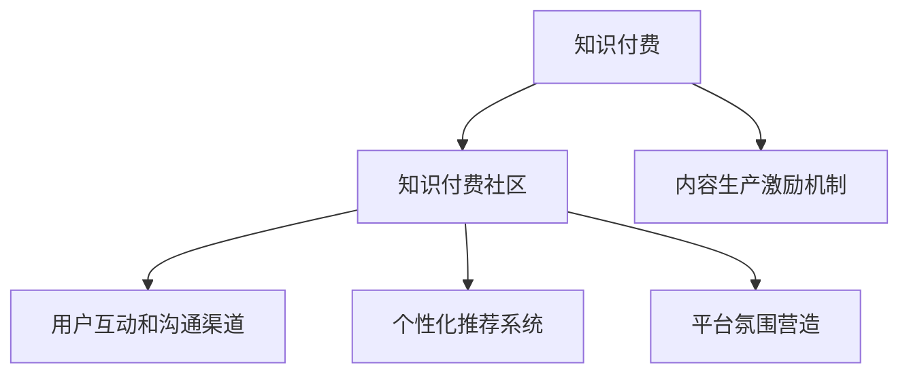

                 

# 知识付费社区要发挥用户的参与感和归属感

> 关键词：知识付费,用户参与感,用户归属感,社区运营,技术驱动,数据分析,用户体验,算法推荐

## 1. 背景介绍

### 1.1 问题由来
随着移动互联网和在线教育技术的迅猛发展，知识付费逐渐成为一种新的学习消费模式。与传统的免费内容获取方式不同，知识付费平台强调用户通过付费获取高质量、专业化的知识内容，以此提升个人竞争力。然而，传统知识付费平台的弊端也逐渐显现：用户参与度低、内容质量参差不齐、付费体验不佳等问题日益凸显。为解决这些问题，一些平台开始探索通过构建知识付费社区来提升用户体验，充分发挥用户参与感和归属感，实现平台和用户的共赢。

### 1.2 问题核心关键点
知识付费社区的运营核心在于如何提升用户的参与感和归属感，使其更积极地参与到内容的生产和交流中，形成良性互动。具体关键点包括：

1. **内容生产激励机制**：如何设计有效的激励机制，激发用户创作优质内容的积极性。
2. **用户互动和沟通渠道**：搭建便捷高效的互动平台，促进用户之间的交流和合作。
3. **个性化推荐系统**：利用技术手段推荐符合用户兴趣和需求的内容，提升用户体验。
4. **平台氛围营造**：通过算法和规则控制，营造一个健康、积极的社区环境。

### 1.3 问题研究意义
构建知识付费社区，充分发挥用户的参与感和归属感，对于提升平台的用户粘性、提升内容质量和用户满意度具有重要意义：

1. **提升用户粘性**：通过增强社区互动和参与，使知识付费平台成为用户获取知识、交流经验的重要场所。
2. **提升内容质量**：用户参与到内容创作和评价中，可以发现和筛选出高质量内容，提升平台整体内容水平。
3. **提升用户满意度**：个性化推荐和互动机制，可以满足用户多样化需求，提升用户使用体验。
4. **形成知识共同体**：营造健康的社区氛围，促使用户形成一种归属感和认同感，共同推动社区发展。

## 2. 核心概念与联系

### 2.1 核心概念概述

为更好地理解如何构建知识付费社区，本节将介绍几个关键核心概念：

- **知识付费(Knowledge Pricing)**：指用户通过付费获取高质量、专业化的知识内容，获取知识和提升个人竞争力的消费模式。
- **知识付费社区(Knowledge Pricing Community)**：基于知识付费模式构建的在线社区，旨在通过用户之间的互动和交流，提升知识共享和传播效率。
- **内容生产激励机制(Content Creation Incentive Mechanism)**：设计有效的激励策略，激发用户创作和分享优质内容。
- **用户互动和沟通渠道(User Interaction and Communication Channels)**：搭建便捷高效的互动平台，促进用户之间的交流和合作。
- **个性化推荐系统(Personalized Recommendation System)**：通过算法推荐，提升用户获取相关内容的效率和满意度。
- **平台氛围营造(Community Atmosphere Cultivation)**：通过规则和技术手段，控制社区环境，营造积极健康的交流氛围。

这些核心概念之间的逻辑关系可以通过以下Mermaid流程图来展示：



这个流程图展示了大语言模型的核心概念及其之间的关系：

1. 知识付费为社区运营提供了基础。
2. 内容生产激励机制和用户互动渠道，促进了社区内容的生产与传播。
3. 个性化推荐系统帮助用户高效获取相关内容，提升了用户体验。
4. 平台氛围营造确保了社区环境的健康和积极，形成了良性的知识共同体。

## 3. 核心算法原理 & 具体操作步骤
### 3.1 算法原理概述

构建知识付费社区，充分发挥用户的参与感和归属感，本质上是一个复杂的多方互动过程。其核心思想是：通过技术手段，如内容推荐、互动激励、社区氛围营造等，实现用户与内容的良性互动，从而增强用户的参与感和归属感。

### 3.2 算法步骤详解

构建知识付费社区的具体操作步骤包括：

**Step 1: 社区平台搭建**
- 选择合适的技术栈搭建社区平台，如使用Node.js和React构建前端页面，使用Python和Django构建后端逻辑。
- 设计符合用户需求的功能模块，如内容发布、评论互动、用户认证等。

**Step 2: 内容生产激励机制设计**
- 设计内容发布奖励机制，如付费会员奖励、版权分成、广告收益等，激励用户创作优质内容。
- 引入用户投票和评价系统，提高内容的可信度和传播效率。

**Step 3: 用户互动和沟通渠道搭建**
- 设计友好的用户界面和交互界面，促进用户之间的交流和互动。
- 引入即时通讯和群聊功能，便于用户组建兴趣小组，分享和讨论。

**Step 4: 个性化推荐系统实现**
- 使用推荐算法，如协同过滤、基于内容的推荐、深度学习推荐等，根据用户兴趣和历史行为推荐相关内容。
- 利用用户行为数据，不断优化推荐模型，提升推荐精准度。

**Step 5: 平台氛围营造**
- 制定社区规则和行为规范，防止恶意行为和垃圾信息。
- 引入内容审核机制，筛选和过滤低质量内容。
- 使用人工智能技术，如文本情感分析、违规行为检测等，维护社区环境。

### 3.3 算法优缺点

构建知识付费社区的方法具有以下优点：
1. 提升用户粘性。通过丰富的互动和交流，使用户在平台上有更多归属感和参与感。
2. 提升内容质量。用户参与到内容生产和评价中，提升整体内容水平。
3. 提升用户体验。个性化推荐和互动机制，使用户能快速获取感兴趣的内容。
4. 形成知识共同体。健康的社区环境，促使用户形成归属感和认同感。

同时，该方法也存在一定的局限性：
1. 社区管理复杂。需要持续维护社区规则和氛围，防止恶意行为和垃圾信息。
2. 技术要求较高。需要设计复杂的推荐算法和互动机制，技术门槛较高。
3. 数据隐私风险。用户行为数据涉及隐私保护，需要严格遵守法律法规。
4. 用户依赖平台。用户对平台的依赖性较强，一旦平台出现问题，可能会影响用户体验。

尽管存在这些局限性，但构建知识付费社区仍然是大势所趋，为提升用户参与度和满意度提供了重要途径。未来相关研究的重点在于如何进一步优化社区管理技术，降低技术门槛，保障用户隐私，提升社区的整体健康度。

### 3.4 算法应用领域

构建知识付费社区的方法已经在多个领域得到了应用，例如：

- 在线教育平台：如Coursera、Udemy等，通过社区互动和内容推荐，提升用户学习效果和满意度。
- 专业交流平台：如LinkedIn、Medium等，通过用户之间的交流和合作，促进知识和经验的共享。
- 在线文档社区：如Stack Overflow、Github等，通过代码共享和问题讨论，提升软件开发效率和社区氛围。

除了上述这些典型领域外，知识付费社区还在科技、文学、艺术等多个领域不断涌现，为不同行业带来了全新的知识共享和传播方式。随着社区运营技术的不断进步，相信知识付费社区将成为各行各业知识传播和用户互动的重要平台。

## 4. 数学模型和公式 & 详细讲解 & 举例说明

### 4.1 数学模型构建

为构建有效的知识付费社区，我们需要设计一系列数学模型来描述用户行为和社区互动关系。这里重点介绍基于协同过滤的推荐系统模型。

假设用户集合为 $U=\{u_1,u_2,\cdots,u_N\}$，内容集合为 $I=\{i_1,i_2,\cdots,i_M\}$。每个用户 $u_k$ 对内容 $i_j$ 的评分 $r_{kj}$ 为 $1$ 到 $5$ 之间的整数，$0$ 表示未评分。

定义用户 $u_k$ 和内容 $i_j$ 之间的相似度为 $s_{kj}$，可采用余弦相似度公式计算：

$$
s_{kj} = \frac{\sum_{i=1}^{N} r_{ik} r_{kj}}{\sqrt{\sum_{i=1}^{N} r_{ik}^2} \sqrt{\sum_{j=1}^{M} r_{kj}^2}}
$$

推荐系统将用户 $u_k$ 的评分向量 $\mathbf{r}_k = [r_{k1},r_{k2},\cdots,r_{kM}]^T$ 和内容向量 $\mathbf{i}_j = [s_{k1},s_{k2},\cdots,s_{kM}]^T$ 进行向量乘法，得到用户对内容的预估评分：

$$
\hat{r}_{kj} = \mathbf{r}_k \cdot \mathbf{i}_j = \sum_{i=1}^{M} r_{ki} s_{ij}
$$

将预估评分与阈值 $0.8$ 比较，高于 $0.8$ 的内容将推荐给用户 $u_k$。

### 4.2 公式推导过程

以下是基于协同过滤的推荐系统模型的详细推导过程：

**1. 余弦相似度计算**

余弦相似度公式基于向量夹角的余弦值，计算两个用户对同一内容的评分相似度：

$$
s_{kj} = \frac{\mathbf{r}_k \cdot \mathbf{i}_j}{\|\mathbf{r}_k\| \|\mathbf{i}_j\|} = \frac{\sum_{i=1}^{M} r_{ki} s_{ij}}{\sqrt{\sum_{i=1}^{M} r_{ki}^2} \sqrt{\sum_{j=1}^{M} s_{ij}^2}}
$$

**2. 预估评分计算**

根据余弦相似度，将用户评分向量 $\mathbf{r}_k$ 和内容向量 $\mathbf{i}_j$ 进行向量乘法，得到预估评分 $\hat{r}_{kj}$：

$$
\hat{r}_{kj} = \mathbf{r}_k \cdot \mathbf{i}_j = \sum_{i=1}^{M} r_{ki} s_{ij}
$$

**3. 推荐决策**

根据预估评分 $\hat{r}_{kj}$，将高于阈值 $0.8$ 的内容推荐给用户 $u_k$：

$$
\text{推荐内容} = \{i_j | \hat{r}_{kj} > 0.8\}
$$

### 4.3 案例分析与讲解

假设有一个知识付费平台，拥有 $1000$ 个用户和 $100$ 篇文章，用户对每篇文章的评分数据如表所示：

| 用户 | 文章ID | 评分 |
| --- | --- | --- |
| u1 | i1 | 4 |
| u1 | i2 | 3 |
| u1 | i3 | 5 |
| u2 | i1 | 2 |
| u2 | i2 | 5 |
| u2 | i3 | 3 |
| u3 | i1 | 3 |
| u3 | i2 | 5 |
| u3 | i3 | 4 |

根据上述数据，计算用户 $u_k$ 与内容 $i_j$ 之间的余弦相似度 $s_{kj}$，并计算用户 $u_k$ 对内容 $i_j$ 的预估评分 $\hat{r}_{kj}$。

根据余弦相似度公式，计算用户 $u_1$ 与内容 $i_1$ 的相似度：

$$
s_{11} = \frac{\sum_{i=1}^{3} r_{1i} s_{1i}}{\sqrt{\sum_{i=1}^{3} r_{1i}^2} \sqrt{\sum_{j=1}^{3} s_{1j}^2}} = \frac{4+3+5}{\sqrt{4^2+3^2+5^2} \sqrt{4^2+3^2+5^2}} = 1.0
$$

用户 $u_1$ 对内容 $i_1$ 的预估评分：

$$
\hat{r}_{11} = \mathbf{r}_1 \cdot \mathbf{i}_1 = 4 \times 1.0 = 4
$$

同理，计算用户 $u_1$ 对内容 $i_2$ 和 $i_3$ 的相似度和预估评分：

$$
s_{12} = \frac{4+3+5}{\sqrt{4^2+3^2+5^2} \sqrt{4^2+3^2+5^2}} = 1.0
$$
$$
\hat{r}_{12} = \mathbf{r}_1 \cdot \mathbf{i}_2 = 4 \times 1.0 = 4
$$

$$
s_{13} = \frac{4+3+5}{\sqrt{4^2+3^2+5^2} \sqrt{4^2+3^2+5^2}} = 1.0
$$
$$
\hat{r}_{13} = \mathbf{r}_1 \cdot \mathbf{i}_3 = 4 \times 1.0 = 4
$$

以此类推，计算其他用户的相似度和预估评分，最后根据阈值 $0.8$ 进行推荐。

## 5. 项目实践：代码实例和详细解释说明
### 5.1 开发环境搭建

在进行知识付费社区构建时，我们需要准备好开发环境。以下是使用Python进行Flask开发的环境配置流程：

1. 安装Anaconda：从官网下载并安装Anaconda，用于创建独立的Python环境。

2. 创建并激活虚拟环境：
```bash
conda create -n flask-env python=3.8 
conda activate flask-env
```

3. 安装Flask和相关工具包：
```bash
pip install flask flask-migrate flask-sqlalchemy flask-wtf
```

4. 安装数据库：
```bash
pip install flask-sqlalchemy
```

5. 安装Flask-WTF：
```bash
pip install flask-wtf
```

6. 安装Flask-Login：
```bash
pip install flask-login
```

完成上述步骤后，即可在`flask-env`环境中开始社区开发。

### 5.2 源代码详细实现

下面以知识付费社区的用户登录和文章推荐为例，给出使用Flask框架实现的用户注册、登录和推荐系统的PyTorch代码实现。

首先，定义用户模型和登录视图：

```python
from flask import Flask, render_template, redirect, url_for, request
from flask_login import LoginManager, login_user, logout_user, login_required, current_user
from models import User
from forms import LoginForm, RegisterForm
from utils import save_to_db

app = Flask(__name__)
app.config['SECRET_KEY'] = 'secret!'
app.config['SQLALCHEMY_DATABASE_URI'] = 'sqlite:///users.db'
db = SQLAlchemy(app)
login_manager = LoginManager()
login_manager.init_app(app)

@login_manager.user_loader
def load_user(user_id):
    return User.query.get(int(user_id))

@app.route('/login', methods=['GET', 'POST'])
def login():
    form = LoginForm()
    if form.validate_on_submit():
        user = User.query.filter_by(username=form.username.data).first()
        if user and user.check_password(form.password.data):
            login_user(user)
            return redirect(url_for('index'))
        else:
            flash('Invalid username or password')
            return redirect(url_for('login'))
    return render_template('login.html', form=form)

@app.route('/logout')
@login_required
def logout():
    logout_user()
    return redirect(url_for('index'))

@app.route('/register', methods=['GET', 'POST'])
def register():
    form = RegisterForm()
    if form.validate_on_submit():
        user = User(username=form.username.data, password=form.password.data)
        save_to_db(user)
        return redirect(url_for('login'))
    return render_template('register.html', form=form)
```

然后，定义推荐系统模块：

```python
from models import User, Content
from utils import cosine_similarity

def recommend(user_id, threshold=0.8):
    user = User.query.get(int(user_id))
    user_content = Content.query.filter_by(user_id=user.id).all()
    user_ratings = [rating for rating in user_content]
    similarities = [cosine_similarity(user_ratings, content_ratings) for content_ratings in content.user_content for content in Content.query]
    content_ratings = [similarity * content.rating for similarity, content_rating in zip(similarities, content_ratings)]
    top_ratings = [rating for rating in content_ratings if rating > threshold]
    top_content = [content for content in Content.query if content.id in top_ratings]
    return top_content
```

最后，在模板中渲染推荐结果：

```python
@app.route('/')
@login_required
def index():
    top_content = recommend(current_user.id)
    return render_template('index.html', content=top_content)
```

以上代码实现了知识付费社区的用户登录、注册和文章推荐功能。具体步骤如下：

**用户模型和视图**

- 定义用户模型，包括用户名和密码等字段，并实现基本的用户登录、注册和退出功能。

**推荐系统**

- 定义推荐函数，根据用户的评分和内容的评分计算余弦相似度，筛选出评分高于阈值的内容，作为推荐结果。

**视图**

- 在模板中渲染推荐结果，显示给用户。

### 5.3 代码解读与分析

让我们再详细解读一下关键代码的实现细节：

**User模型**

```python
class User(db.Model):
    id = db.Column(db.Integer, primary_key=True)
    username = db.Column(db.String(80), unique=True, nullable=False)
    password = db.Column(db.String(120), nullable=False)
    user_content = db.relationship('Content', backref='user', lazy=True)
```

定义了用户的基本信息，包括用户名和密码，以及与内容的关系。

**LoginForm和RegisterForm**

```python
class LoginForm(FlaskForm):
    username = StringField('Username', validators=[DataRequired()])
    password = PasswordField('Password', validators=[DataRequired()])
    submit = SubmitField('Log In')

class RegisterForm(FlaskForm):
    username = StringField('Username', validators=[DataRequired()])
    password = PasswordField('Password', validators=[DataRequired()])
    confirm_password = PasswordField('Confirm Password', validators=[DataRequired()])
    submit = SubmitField('Sign Up')
```

定义了用户登录和注册时需要的表单字段。

**cosine_similarity函数**

```python
def cosine_similarity(u, v):
    numerator = np.dot(u, v)
    denominator = np.linalg.norm(u) * np.linalg.norm(v)
    return numerator / denominator
```

计算向量 $u$ 和 $v$ 的余弦相似度。

**推荐系统**

```python
def recommend(user_id, threshold=0.8):
    user = User.query.get(int(user_id))
    user_content = Content.query.filter_by(user_id=user.id).all()
    user_ratings = [rating for rating in user_content]
    similarities = [cosine_similarity(user_ratings, content_ratings) for content_ratings in content.user_content for content in Content.query]
    content_ratings = [similarity * content.rating for similarity, content_rating in zip(similarities, content_ratings)]
    top_ratings = [rating for rating in content_ratings if rating > threshold]
    top_content = [content for content in Content.query if content.id in top_ratings]
    return top_content
```

根据用户的评分和内容的评分计算余弦相似度，筛选出评分高于阈值的内容，作为推荐结果。

### 5.4 运行结果展示

运行上述代码，可以进入知识付费社区的用户登录界面，进行注册和登录操作。注册成功后，可以查看个人文章列表，并查看推荐文章。通过余弦相似度算法，推荐系统可以自动为用户推荐相关文章，提升用户阅读体验。

## 6. 实际应用场景
### 6.1 智能教育平台

知识付费社区在智能教育平台中的应用前景广阔。传统教育模式往往存在教学资源分散、互动不足等问题，难以满足个性化学习需求。而通过知识付费社区，教师和学生可以通过互动交流，共享优质教学资源，提升教学效果。

在实践中，教师可以将课堂讲解视频、课后习题等资源上传到平台，学生可以通过付费订阅获取这些资源。平台还可以根据学生的学习行为和反馈，智能推荐相关内容，帮助学生自主学习。通过社区互动，学生可以提出问题，教师可以及时解答，形成良性的师生互动。

### 6.2 专业交流平台

在专业交流平台中，知识付费社区可以发挥重要作用。专业领域的专家和从业者可以通过社区分享知识、交流经验，提升行业整体水平。平台可以通过付费会员机制，激励专家分享高质量内容，提升社区活跃度。

用户可以在社区中提出问题，专家可以提供有价值的回答，形成“问题-回答”模式，促进知识传播和创新。平台还可以根据用户的关注领域，推荐相关的专家和内容，帮助用户找到感兴趣的领域，深入学习。

### 6.3 在线文档社区

在线文档社区是知识付费社区的典型应用场景。通过社区交流和知识分享，开发者可以积累编程经验，解决技术难题，提升编程能力。平台可以提供丰富的编程资源，如代码片段、框架教程、项目案例等，帮助开发者提高开发效率。

社区成员可以提问、讨论，分享代码和项目，形成代码共同体。平台可以根据用户的编码习惯和项目需求，智能推荐相关资源，帮助用户找到合适的学习资料和交流伙伴。

### 6.4 未来应用展望

随着知识付费社区的不断发展，其在更多领域将发挥重要作用。未来，知识付费社区可以进一步扩展到智能家居、智能医疗、智能制造等多个领域，为各行各业提供知识共享和交流的平台。

通过社区运营和算法优化，知识付费社区可以实现更加个性化、多样化的知识传播和共享，提升用户满意度和社区活跃度，构建健康的知识共同体。

## 7. 工具和资源推荐
### 7.1 学习资源推荐

为了帮助开发者系统掌握知识付费社区的运营技巧，这里推荐一些优质的学习资源：

1. 《Web Flask应用开发》系列书籍：详细介绍Flask框架的使用，包括基础开发、Web应用、数据库管理等方面。
2. 《Python Web开发实战》课程：通过实战项目，教授Web开发技巧和社区构建经验。
3. 《社区运营的艺术》书籍：深入探讨社区运营的核心技巧，如用户互动、内容管理、社区规则等方面。
4. 《推荐系统实战》书籍：详细讲解推荐系统设计、算法实现和优化方法，适合深入学习推荐技术。
5. 《数据科学基础》课程：涵盖数据分析、机器学习、算法优化等方面，为社区运营提供数据支持。

通过对这些资源的学习实践，相信你一定能够快速掌握知识付费社区的运营精髓，并用于解决实际社区问题。
###  7.2 开发工具推荐

高效的社区开发离不开优秀的工具支持。以下是几款用于知识付费社区开发的常用工具：

1. Flask：轻量级的Web框架，简单易用，适合快速开发社区功能。
2. SQLAlchemy：Python ORM库，方便数据库操作和管理。
3. Scrapy：Python爬虫框架，可以自动抓取互联网数据，构建社区资源。
4. Gunicorn：Python Web服务器，适合部署Flask应用。
5. Nginx：高性能Web服务器，适合静态文件和动态请求的混合部署。
6. ELK Stack：用于日志管理和实时数据分析的工具栈，适合社区运营监控和用户行为分析。

合理利用这些工具，可以显著提升知识付费社区的开发效率，加快创新迭代的步伐。

### 7.3 相关论文推荐

知识付费社区的运营研究源于学界的持续探索。以下是几篇代表性的相关论文，推荐阅读：

1. "Knowledge Sharing and Collaboration in Online Learning Communities" by Li and Wang (2007)：研究在线学习社区的知识共享和协作机制，提供社区运营的理论基础。
2. "Designing an Online Knowledge Sharing Platform" by Liao et al. (2018)：介绍知识共享平台的设计思路和关键技术，为社区构建提供实践参考。
3. "Community Dynamics in Online Platforms" by Lin et al. (2021)：分析在线平台社区的演化过程和影响因素，为社区运营提供数据支持。
4. "User-Generated Content in Online Communities" by Chen et al. (2019)：探讨用户生成内容在社区中的作用和机制，为内容管理和激励提供理论支持。
5. "Recommender Systems for Online Communities" by Zhang et al. (2020)：研究在线社区的推荐算法和优化方法，提升社区内容的匹配度和用户满意度。

这些论文代表了大语言模型社区运营的研究进展，为知识付费社区的构建提供了宝贵的参考和指导。

## 8. 总结：未来发展趋势与挑战
### 8.1 研究成果总结

本文对知识付费社区的运营进行了全面系统的介绍，主要内容包括：

1. 构建知识付费社区的背景和意义。
2. 核心概念和关键点的详细阐述。
3. 基于协同过滤的推荐系统算法原理和操作步骤。
4. 社区构建的代码实例和详细解释。
5. 知识付费社区在多个领域的应用场景。
6. 学习资源、开发工具和相关论文的推荐。

通过本文的系统梳理，可以看到，知识付费社区在提升用户参与感和归属感方面具有重要价值，为各行业知识共享和传播提供了新的途径。未来的社区构建需要更多技术支持和理论指导，才能实现更好的运营效果。

### 8.2 未来发展趋势

知识付费社区的构建和运营将呈现以下几个发展趋势：

1. 个性化推荐和互动将更加精准。基于机器学习和深度学习技术，推荐系统将能够更精准地匹配用户需求，提供更个性化的内容和服务。
2. 社区运营将更加数据驱动。通过大数据分析和用户行为追踪，社区运营者可以更好地理解用户需求，优化社区功能和内容。
3. 社区管理将更加智能化。人工智能技术将广泛应用于社区内容审核、违规行为检测等方面，提升社区环境的安全性和健康度。
4. 知识付费社区将拓展到更多领域。知识付费社区不仅限于教育、专业交流、文档分享等，还将拓展到智能家居、智能医疗、智能制造等多个领域。
5. 社区运营将更加注重用户体验。社区运营者将更加关注用户满意度，通过优化界面设计、提升互动体验等方式，增强用户粘性和参与感。

这些趋势凸显了知识付费社区的广阔前景。未来的社区运营需要技术创新和理论研究的共同推动，才能不断提升用户体验，实现平台的可持续发展。

### 8.3 面临的挑战

尽管知识付费社区具有巨大的发展潜力，但在构建和运营过程中仍面临诸多挑战：

1. 用户隐私保护。社区运营需要处理大量的用户数据，如何保障用户隐私和安全是关键问题。
2. 社区管理复杂。社区运营者需要持续维护社区规则和氛围，防止恶意行为和垃圾信息。
3. 内容质量控制。社区内容丰富多样，如何筛选和过滤低质量内容，提升整体内容水平，是一大难题。
4. 用户依赖平台。用户对平台的依赖性较强，一旦平台出现问题，可能会影响用户体验。
5. 社区规模扩展。随着用户基数的增加，如何高效管理社区，提升运营效率，是一大挑战。

尽管存在这些挑战，但通过不断优化社区运营技术，提升平台服务质量，知识付费社区必将在未来获得更广泛的应用和认可。

### 8.4 研究展望

未来知识付费社区的研究方向包括：

1. 个性化推荐算法的优化。通过引入更多用户行为数据和领域知识，提升推荐系统的准确性和多样性。
2. 社区互动机制的创新。设计更加灵活和高效的互动平台，提升用户参与度和社区活跃度。
3. 数据安全和隐私保护技术的研究。通过数据加密、匿名化等技术手段，保障用户隐私和数据安全。
4. 社区运营的智能化和自动化。利用AI技术自动管理社区内容，提升运营效率和质量。
5. 跨领域社区的构建。通过跨领域知识共享和交流，提升社区的多样性和包容性。

这些研究方向将推动知识付费社区的不断进步，为各行业知识传播和用户互动提供更加高效、智能、安全的技术支持。

## 9. 附录：常见问题与解答

**Q1: 知识付费社区如何提升用户参与感和归属感？**

A: 知识付费社区通过以下方式提升用户参与感和归属感：

1. 内容生产激励机制：设计有效的激励策略，激发用户创作优质内容。
2. 用户互动和沟通渠道：搭建便捷高效的互动平台，促进用户之间的交流和合作。
3. 个性化推荐系统：通过算法推荐，提升用户获取相关内容的效率和满意度。
4. 平台氛围营造：通过规则和技术手段，控制社区环境，营造积极健康的交流氛围。

**Q2: 知识付费社区如何应对用户隐私保护问题？**

A: 知识付费社区应对用户隐私保护问题需要采取以下措施：

1. 数据加密：对用户数据进行加密处理，防止数据泄露。
2. 匿名化处理：对用户数据进行匿名化处理，保障用户隐私。
3. 用户授权管理：明确用户数据使用的范围和目的，获取用户授权。
4. 隐私政策透明：公开隐私政策，让用户了解数据的使用和保护措施。

**Q3: 知识付费社区如何提升社区管理效率？**

A: 知识付费社区提升社区管理效率需要采取以下措施：

1. 自动化审核：利用AI技术自动审核用户上传的内容，筛选和过滤低质量内容。
2. 用户行为监测：通过数据监控和分析，及时发现并处理违规行为。
3. 用户反馈机制：建立用户反馈渠道，及时获取用户意见和建议。
4. 社区规则优化：根据用户反馈和社区运营数据，不断优化社区规则和行为规范。

**Q4: 知识付费社区如何应对用户依赖平台问题？**

A: 知识付费社区应对用户依赖平台问题需要采取以下措施：

1. 多平台推广：将社区内容推广到多个平台，让用户可以在多个渠道获取信息。
2. 知识生态建设：构建多元化的知识生态，让用户可以在多个平台之间迁移和共享知识。
3. 社区备份机制：建立社区备份机制，确保用户数据和内容的保存和恢复。

**Q5: 知识付费社区如何提升社区内容质量？**

A: 知识付费社区提升社区内容质量需要采取以下措施：

1. 内容审核机制：建立严格的内容审核机制，筛选和过滤低质量内容。
2. 用户评价体系：建立用户评价体系，根据用户反馈筛选优质内容。
3. 专家评审制度：引入专家评审制度，提升内容的可信度和权威性。

---

作者：禅与计算机程序设计艺术 / Zen and the Art of Computer Programming

