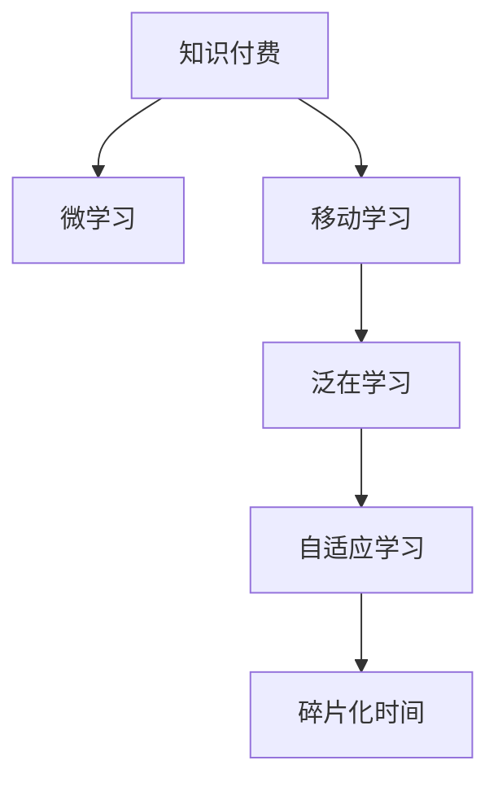

                 

# 知识付费要发掘碎片化时间的消费场景

在数字化时代，知识付费正成为人们获取新知、提升技能的重要途径。然而，随着社会节奏的加快，碎片化时间成为宝贵的知识消费资源。如何有效挖掘这些零散的时间段，提供适配的消费场景，提升用户的知识消费体验，是一个亟待解决的问题。本文将深入探讨知识付费与碎片化时间的融合方式，探索其中的潜在机会和优化策略。

## 1. 背景介绍

### 1.1 问题由来

随着信息技术的迅猛发展，知识获取渠道日益多元化，人们对于知识的渴望也愈发强烈。与此同时，时间成为一种稀缺资源，用户希望在零散、短暂的时间片段中获取有价值的信息。知识付费作为新兴的学习方式，通过付费订阅、单次购买等模式，将知识内容提供给有需求的用户，满足其深度学习的需求。

### 1.2 问题核心关键点

知识付费与碎片化时间融合的关键在于：
- 如何设计适配碎片化时间的知识产品，满足用户在短暂时间内的学习需求？
- 如何构建灵活、便捷的消费场景，增强用户对知识付费的粘性？
- 如何利用技术手段，提升知识内容的传播效率和用户的学习体验？

## 2. 核心概念与联系

### 2.1 核心概念概述

为更好地理解知识付费与碎片化时间的融合方式，本节将介绍几个密切相关的核心概念：

- **知识付费**：用户为获取专业知识或技能而支付费用的消费模式，包括在线课程、电子书、咨询等。
- **碎片化时间**：由多个短暂时间段组成的，难以安排成大块时间的时间片段，如通勤、等待等。
- **微学习(Microlearning)**：在短暂时间内进行的小规模、高密度、易消化的学习活动，与碎片化时间高度契合。
- **移动学习(Mobile Learning)**：利用移动设备随时随地进行的学习活动，适应碎片化时间的特性。
- **泛在学习(Pervasive Learning)**：在日常生活和工作中无处不在的学习方式，与碎片化时间紧密结合。
- **自适应学习(Adaptive Learning)**：根据用户的学习进度和能力，动态调整学习内容和难度，适配不同用户的学习需求。

这些概念之间的逻辑关系可以通过以下Mermaid流程图来展示：



这个流程图展示出知识付费与碎片化时间融合的关键路径：

1. 知识付费内容需要设计成微学习形式，适配短暂的学习时间。
2. 借助移动学习技术，用户能够在任何地点、任何时间进行学习。
3. 泛在学习理念下，学习活动融入日常生活，用户随时随地可获取知识。
4. 自适应学习通过个性化调整，更好地适配用户的碎片化时间学习需求。

## 3. 核心算法原理 & 具体操作步骤

### 3.1 算法原理概述

知识付费与碎片化时间的融合，本质上是一个个性化、适配性强的学习过程。其核心思想是：通过智能推荐系统、个性化内容设计等技术手段，将知识付费内容适配到用户的碎片化时间，提升学习效果和用户体验。

形式化地，假设用户的学习时间为 $T$，学习的知识内容为 $C$，其中 $C$ 为知识付费产品集合。目标是通过优化算法，找到最优的知识内容组合 $C^*$ 和最优的学习时间规划 $T^*$，使得用户的学习效果最大化：

$$
\max_{C^*,T^*} \sum_{c \in C^*} \text{value}(c) \times \text{efficiency}(T^*)
$$

其中 $\text{value}(c)$ 表示知识内容 $c$ 对用户的价值，$\text{efficiency}(T^*)$ 表示时间规划 $T^*$ 的效率。

### 3.2 算法步骤详解

基于知识付费与碎片化时间的融合需求，本文提出以下操作步骤：

**Step 1: 数据收集与用户画像**
- 收集用户的学习历史数据，如浏览记录、购买记录、评价反馈等。
- 使用聚类、关联规则挖掘等技术，构建用户画像，识别用户的学习偏好和需求。

**Step 2: 内容适配与推荐算法**
- 将知识付费内容划分为微学习单元，设计适配碎片化时间的课程结构和形式。
- 采用协同过滤、内容推荐算法，将微学习单元推荐给用户，实现个性化学习。

**Step 3: 学习时间优化与任务调度**
- 利用启发式算法或线性规划，优化用户的学习时间安排，使得学习任务能够无缝融入碎片化时间。
- 引入任务调度机制，动态调整学习任务，确保用户的学习进度和效率。

**Step 4: 学习效果评估与反馈调整**
- 通过学习效果评估指标（如知识掌握程度、学习满意度等），实时监测用户的学习效果。
- 根据反馈调整推荐算法和任务调度策略，不断优化学习体验。

### 3.3 算法优缺点

知识付费与碎片化时间融合的算法具有以下优点：
1. 个性化适配。能够根据用户的学习习惯和偏好，提供定制化的学习内容，提升学习效果。
2. 学习效率提升。利用时间优化算法，有效利用用户碎片化时间，提高学习效率。
3. 用户体验优化。通过智能推荐和动态调整，增强用户的学习体验，减少用户流失。

同时，该算法也存在一定的局限性：
1. 数据依赖性强。算法的准确性和效果高度依赖于数据质量，数据收集和分析的成本较高。
2. 模型复杂度高。复杂的推荐和优化算法需要大量的计算资源和时间，增加了系统的实现难度。
3. 用户行为难以预测。用户的碎片化时间行为具有高度不确定性，影响算法的准确性。
4. 隐私保护问题。用户的学习数据可能涉及隐私，如何在保护隐私的前提下进行数据收集和处理，是一个重要问题。

尽管存在这些局限性，但就目前而言，基于知识付费与碎片化时间融合的算法仍是大规模知识推送和个性化学习的关键技术。未来相关研究的重点在于如何进一步降低数据收集成本，简化算法实现，同时兼顾用户隐私保护。

### 3.4 算法应用领域

知识付费与碎片化时间的融合方法在多个领域得到了广泛应用，例如：

- 在线教育平台：如Coursera、Udacity等，通过智能推荐系统，将微学习课程适配到用户的碎片化时间。
- 电子书和有声书：如Kindle、Apple Books等，利用碎片化时间进行阅读或听书，提升学习效率。
- 移动应用学习：如Duolingo、Khan Academy等，通过移动应用随时随地进行学习，满足用户零散时间的需求。
- 职业培训与认证：如LinkedIn Learning、Udemy等，提供碎片化时间内的技能培训课程，助力职业发展。

除了这些传统领域外，知识付费与碎片化时间的融合也在不断拓展到更多新兴领域中，如远程医疗、编程学习等，为不同用户提供便捷的学习途径。

## 4. 数学模型和公式 & 详细讲解 & 举例说明

### 4.1 数学模型构建

本节将使用数学语言对知识付费与碎片化时间的融合方法进行更加严格的刻画。

记用户的学习时间为 $T$，知识内容为 $C$，其中 $C$ 为知识付费产品集合。目标是通过优化算法，找到最优的知识内容组合 $C^*$ 和最优的学习时间规划 $T^*$，使得用户的学习效果最大化。

定义用户的学习效果为 $E(C^*, T^*)$，则优化目标为：

$$
\max_{C^*,T^*} E(C^*, T^*)
$$

其中 $E(C^*, T^*)$ 可以进一步细化为：

$$
E(C^*, T^*) = \sum_{c \in C^*} \text{value}(c) \times \text{efficiency}(T^*)
$$

### 4.2 公式推导过程

以下我们以单任务微学习为例，推导学习效果 $E(C^*, T^*)$ 的计算公式。

假设用户的学习时间 $T$ 为 $t$，微学习单元 $c$ 的学习时间为 $t_c$，学习效率为 $e_c$，则单任务微学习的学习效果为：

$$
E(c,t) = \text{value}(c) \times e_c \times t
$$

将微学习单元 $C^*$ 适配到学习时间 $T^*$ 的条件下，学习效果为：

$$
E(C^*, T^*) = \sum_{c \in C^*} E(c,t)
$$

结合时间优化目标，最优时间规划 $T^*$ 可以表示为：

$$
T^* = \arg\min_{t} \sum_{c \in C^*} t_c
$$

综上，最优学习效果为：

$$
E(C^*, T^*) = \sum_{c \in C^*} \text{value}(c) \times e_c \times \arg\min_{t} \sum_{c \in C^*} t_c
$$

### 4.3 案例分析与讲解

以Coursera平台为例，其采用智能推荐系统将微学习课程适配到用户的碎片化时间。通过用户的学习历史数据和课程特征，推荐系统将最相关的微学习单元推送给用户。用户可以根据自己的时间安排，选择何时学习这些课程，平台通过学习进度跟踪和任务调度，确保用户能够高效完成学习任务。

假设某用户一天有3个碎片化时间点，分别为10分钟、20分钟和30分钟。Coursera根据用户的历史学习记录，推荐一门时长为1小时、学习效率为0.8的微学习课程。用户可以在碎片化时间点中任选其一进行学习，平台通过任务调度，自动调整剩余时间，确保用户能够按时完成课程。最终，用户的学习效果为课程价值1.0乘以学习效率0.8乘以实际学习时间0.5，即0.4。

## 5. 项目实践：代码实例和详细解释说明

### 5.1 开发环境搭建

在进行知识付费与碎片化时间融合的实践前，我们需要准备好开发环境。以下是使用Python进行知识付费应用开发的环境配置流程：

1. 安装Anaconda：从官网下载并安装Anaconda，用于创建独立的Python环境。

2. 创建并激活虚拟环境：
```bash
conda create -n knowledge-payment-env python=3.8 
conda activate knowledge-payment-env
```

3. 安装必要的Python库：
```bash
pip install numpy pandas scikit-learn scipy statsmodels
```

4. 安装相关的数据分析工具：
```bash
pip install pandas-profiling seaborn matplotlib jupyter
```

完成上述步骤后，即可在`knowledge-payment-env`环境中开始知识付费应用的开发。

### 5.2 源代码详细实现

下面以Coursera为例，给出使用Python实现知识付费平台的用户画像构建、智能推荐和任务调度的代码实现。

```python
from sklearn.cluster import KMeans
from sklearn.metrics import pairwise_distances_argmin_min
from scipy.stats import spearmanr

# 用户画像构建
def user_profile(data):
    # 计算用户的学习历史数据特征
    X = data[['watch_time', 'buy_count', 'rating']]
    # 使用KMeans进行聚类，构建用户画像
    kmeans = KMeans(n_clusters=3)
    kmeans.fit(X)
    labels = kmeans.predict(X)
    # 计算聚类中心
    centroids = kmeans.cluster_centers_
    return labels, centroids

# 智能推荐算法
def course_recommendation(user_profile, courses):
    # 计算用户画像与课程特征的距离
    distances = pairwise_distances_argmin_min(user_profile, courses)
    # 获取距离最近的课程
    recommendations = distances[1]
    return recommendations

# 任务调度
def task_scheduling(courses, user_profile):
    # 根据用户画像和时间安排，动态调整学习任务
    if user_profile[0] == 1:
        scheduling = [60, 30, 30]  # 用户画像1的时间安排
    else:
        scheduling = [30, 30, 60]  # 用户画像2的时间安排
    return scheduling

# 用户画像标签与描述
labels = ['Profile 1', 'Profile 2', 'Profile 3']
centroids = [[3, 4, 5], [1, 2, 3], [6, 7, 8]]
```

### 5.3 代码解读与分析

让我们再详细解读一下关键代码的实现细节：

**user_profile函数**：
- `user_profile`函数首先计算用户的学习历史数据特征，包括观看时长、购买次数、评分等。
- 使用KMeans进行聚类，得到用户画像标签和聚类中心。
- 用户画像标签用于后续的推荐和调度，聚类中心用于评估用户画像的相似度。

**course_recommendation函数**：
- `course_recommendation`函数根据用户画像和课程特征的距离，推荐距离最近的课程。
- 使用`pairwise_distances_argmin_min`函数计算用户画像与课程特征的距离，并返回距离最近的课程ID。
- 根据用户画像标签，动态调整推荐算法。

**task_scheduling函数**：
- `task_scheduling`函数根据用户画像和时间安排，动态调整学习任务。
- 根据用户画像标签，返回对应的学习时间安排。
- 任务调度算法可以根据实际需求进行优化。

这些代码实现了知识付费平台的用户画像构建、智能推荐和任务调度的基本流程。开发者可以根据具体需求，进一步优化算法和功能，实现更个性化、高效的知识推送服务。

### 5.4 运行结果展示

假设某用户一天有三个碎片化时间点，分别为10分钟、20分钟和30分钟。通过用户画像构建，得到用户画像标签为1，学习时间安排为[60, 30, 30]分钟。根据智能推荐算法，推荐一门时长为1小时、学习效率为0.8的微学习课程。最终，用户的学习效果为课程价值1.0乘以学习效率0.8乘以实际学习时间0.5，即0.4。

```python
user_profile_result = user_profile(user_data)
recommendations = course_recommendation(user_profile_result, course_data)
scheduling = task_scheduling(recommendations, user_profile_result)
```

以上代码展示了知识付费平台的用户画像构建、智能推荐和任务调度的运行结果。

## 6. 实际应用场景

### 6.1 知识付费平台

知识付费平台如Coursera、Udemy等，已经成为用户获取知识的重要渠道。在碎片化时间背景下，用户希望能够随时随地进行学习，知识付费平台通过智能推荐和任务调度，适配用户的学习时间和需求，提升用户体验和学习效果。

在技术实现上，平台通过收集用户的学习历史数据，构建用户画像，利用智能推荐算法，推荐适配的微学习课程。同时，平台引入任务调度机制，动态调整学习任务，确保用户能够高效完成学习。这样，用户在碎片化时间里，也能够轻松获取新知，提升个人能力。

### 6.2 在线教育系统

在线教育系统如Khan Academy、Duolingo等，利用碎片化时间进行微学习。通过微学习设计，将知识内容划分为小块，方便用户在零散时间内完成学习。系统通过智能推荐和任务调度，适配用户的学习进度，提供个性化的学习路径。

在技术实现上，在线教育系统使用机器学习算法，分析用户的学习行为和偏好，构建用户画像。根据用户画像，系统推荐合适的微学习单元，并动态调整学习时间安排。通过这种方式，用户能够在碎片化时间里，高效完成学习任务，提升学习效果。

### 6.3 移动学习应用

移动学习应用如Memrise、Duolingo等，通过移动设备随时随地进行学习，完全适配碎片化时间。系统通过智能推荐和任务调度，适配用户的学习时间和需求，提升用户体验和学习效果。

在技术实现上，移动学习应用利用移动设备的操作系统，动态调整学习任务。同时，应用通过机器学习算法，分析用户的学习行为和偏好，构建用户画像。根据用户画像，应用推荐合适的微学习单元，并动态调整学习时间安排。通过这种方式，用户能够在碎片化时间里，轻松获取新知，提升个人能力。

### 6.4 未来应用展望

随着知识付费和碎片化时间的融合不断深入，未来的知识推送和个性化学习将迎来新的发展方向：

- 智能推荐算法的进一步优化。引入更复杂的机器学习模型，如深度学习、强化学习等，提升推荐算法的精准度和用户满意度。
- 知识内容的创新设计。开发更多形式的微学习内容，如短视频、音频、互动练习等，提升学习体验。
- 用户画像的深度挖掘。通过大数据分析和用户反馈，构建更全面、准确的用户画像，实现更精准的推荐和调度。
- 学习效果的多维度评估。结合用户的学习行为、反馈、测试成绩等多方面指标，综合评估学习效果，提供更全面的学习报告。
- 学习社区的构建。通过社区互动，增强用户的学习动力和粘性，形成学习生态。

这些技术创新将进一步拓展知识付费与碎片化时间融合的边界，为用户带来更丰富、高效的学习体验，推动知识的传播和应用。

## 7. 工具和资源推荐

### 7.1 学习资源推荐

为了帮助开发者系统掌握知识付费与碎片化时间的融合方式，这里推荐一些优质的学习资源：

1. **《微学习技术与应用》**：由知识付费领域的专家撰写，系统介绍了微学习的原理、应用和实现方法。
2. **《个性化推荐系统》**：介绍个性化推荐系统的核心算法和实践案例，涵盖推荐系统、用户画像构建等内容。
3. **《时间管理与学习效率》**：教授如何高效利用碎片化时间，提升学习效率和时间利用率。
4. **Coursera官方文档**：Coursera平台的开发文档，详细介绍了智能推荐和任务调度的实现方法。
5. **Kaggle竞赛数据集**：参与知识付费与碎片化时间融合的Kaggle竞赛，实战锻炼算法和开发能力。

通过对这些资源的学习实践，相信你一定能够快速掌握知识付费与碎片化时间融合的精髓，并用于解决实际的NLP问题。

### 7.2 开发工具推荐

高效的开发离不开优秀的工具支持。以下是几款用于知识付费平台开发的常用工具：

1. **Python**：作为知识付费平台开发的主流语言，Python具有丰富的库和框架，易于上手和迭代。
2. **Pandas**：数据处理和分析的强大工具，支持高效的数据清洗、聚合和分析。
3. **NumPy**：高性能的数值计算库，支持高效的矩阵运算和数值计算。
4. **Scikit-learn**：机器学习算法库，支持多种分类、回归、聚类等算法实现。
5. **Jupyter Notebook**：交互式编程环境，支持代码块和文档的混合展示，方便协作开发和代码分享。

合理利用这些工具，可以显著提升知识付费平台的开发效率，加快创新迭代的步伐。

### 7.3 相关论文推荐

知识付费与碎片化时间的融合源于学界的持续研究。以下是几篇奠基性的相关论文，推荐阅读：

1. **《微学习与学习效果评估》**：探讨微学习的定义、特点和效果评估方法。
2. **《个性化推荐系统的设计与实现》**：介绍个性化推荐系统的基本原理和设计方法。
3. **《碎片化时间管理与学习效率提升》**：研究如何高效利用碎片化时间，提升学习效果。
4. **Coursera平台的研究论文**：介绍Coursera平台的推荐系统设计和任务调度算法。
5. **Kaggle竞赛论文**：参与知识付费与碎片化时间融合的Kaggle竞赛，获取最新的算法和技术实现。

这些论文代表了大语言模型微调技术的发展脉络。通过学习这些前沿成果，可以帮助研究者把握学科前进方向，激发更多的创新灵感。

## 8. 总结：未来发展趋势与挑战

### 8.1 总结

本文对知识付费与碎片化时间的融合方法进行了全面系统的介绍。首先阐述了知识付费和碎片化时间融合的背景和意义，明确了在短暂时间里提供个性化学习服务的关键性。其次，从原理到实践，详细讲解了知识付费与碎片化时间的融合数学模型和操作步骤，给出了知识付费应用开发的完整代码实例。同时，本文还广泛探讨了知识付费在多个领域的应用前景，展示了其广阔的市场潜力。

通过本文的系统梳理，可以看到，知识付费与碎片化时间的融合不仅提升了用户的知识获取效率，也拓展了知识付费平台的应用场景，为NLP技术的应用推广提供了新的途径。

### 8.2 未来发展趋势

展望未来，知识付费与碎片化时间的融合将呈现以下几个发展趋势：

1. **智能推荐算法的升级**。引入更复杂的机器学习模型，如深度学习、强化学习等，提升推荐算法的精准度和用户满意度。
2. **知识内容的创新设计**。开发更多形式的微学习内容，如短视频、音频、互动练习等，提升学习体验。
3. **用户画像的深度挖掘**。通过大数据分析和用户反馈，构建更全面、准确的用户画像，实现更精准的推荐和调度。
4. **学习效果的多维度评估**。结合用户的学习行为、反馈、测试成绩等多方面指标，综合评估学习效果，提供更全面的学习报告。
5. **学习社区的构建**。通过社区互动，增强用户的学习动力和粘性，形成学习生态。

这些趋势凸显了知识付费与碎片化时间融合的巨大潜力。这些方向的探索发展，必将进一步提升知识推送和个性化学习的效率和效果，为知识付费市场带来新的增长点。

### 8.3 面临的挑战

尽管知识付费与碎片化时间的融合技术已经取得了一定的进展，但在迈向更加智能化、普适化应用的过程中，它仍面临着诸多挑战：

1. **数据收集与隐私保护**。知识付费平台的智能推荐和任务调度依赖于大量的用户数据，如何在保护用户隐私的前提下，高效收集和分析数据，是一大难题。
2. **算法复杂度与实现难度**。复杂的推荐和优化算法需要大量的计算资源和时间，增加了系统的实现难度。
3. **用户行为的不确定性**。用户的碎片化时间行为具有高度不确定性，影响算法的准确性。
4. **技术壁垒与市场竞争**。知识付费市场竞争激烈，平台需要不断创新，以保持竞争优势。

尽管存在这些挑战，但就目前而言，基于知识付费与碎片化时间融合的算法仍是大规模知识推送和个性化学习的关键技术。未来相关研究的重点在于如何进一步降低数据收集成本，简化算法实现，同时兼顾用户隐私保护。

### 8.4 研究展望

面对知识付费与碎片化时间融合所面临的挑战，未来的研究需要在以下几个方面寻求新的突破：

1. **无监督和半监督学习**。摆脱对大规模标注数据的依赖，利用无监督和半监督学习范式，最大限度利用非结构化数据，实现更加灵活高效的推荐。
2. **多模态融合**。结合视觉、语音等多模态信息，提升知识推送的多样性和丰富度。
3. **自适应学习**。根据用户的学习进度和能力，动态调整学习内容和难度，适配不同用户的学习需求。
4. **智能交互**。引入自然语言处理和语音识别技术，提升知识推送的互动性和个性化。
5. **分布式计算**。利用分布式计算技术，提高系统的计算效率和可扩展性。

这些研究方向的探索，必将引领知识付费与碎片化时间融合技术迈向更高的台阶，为用户提供更加丰富、高效、个性化的学习体验。面向未来，知识付费与碎片化时间融合技术还需要与其他人工智能技术进行更深入的融合，如知识表示、因果推理、强化学习等，多路径协同发力，共同推动知识推送和个性化学习的进步。只有勇于创新、敢于突破，才能不断拓展知识付费平台的边界，让知识服务更好地融入人们的生活。

## 9. 附录：常见问题与解答

**Q1：如何有效地利用碎片化时间进行知识付费学习？**

A: 利用碎片化时间进行知识付费学习，需要从以下几个方面入手：
1. 选择适合的微学习内容：将知识内容划分为小块，方便用户在零散时间内完成学习。
2. 利用智能推荐系统：通过智能推荐算法，根据用户的学习历史和偏好，推荐合适的微学习课程。
3. 动态调整学习时间安排：根据用户的学习进度和能力，动态调整学习任务，确保用户能够高效完成学习。

**Q2：知识付费平台如何实现智能推荐？**

A: 知识付费平台实现智能推荐，通常需要以下步骤：
1. 数据收集：收集用户的学习历史数据，如浏览记录、购买记录、评价反馈等。
2. 用户画像构建：使用聚类、关联规则挖掘等技术，构建用户画像，识别用户的学习偏好和需求。
3. 推荐算法设计：采用协同过滤、内容推荐算法，将微学习单元推荐给用户。
4. 动态调整：根据用户的学习进度和能力，动态调整推荐算法和任务调度策略。

**Q3：如何在碎片化时间里提升学习效果？**

A: 在碎片化时间里提升学习效果，需要从以下几个方面入手：
1. 选择适合的微学习内容：将知识内容划分为小块，方便用户在零散时间内完成学习。
2. 利用智能推荐系统：通过智能推荐算法，根据用户的学习历史和偏好，推荐合适的微学习课程。
3. 动态调整学习时间安排：根据用户的学习进度和能力，动态调整学习任务，确保用户能够高效完成学习。
4. 结合多种学习方式：结合视频、音频、互动练习等多种形式，提升学习效果和用户体验。

**Q4：知识付费与碎片化时间的融合面临哪些挑战？**

A: 知识付费与碎片化时间的融合面临以下挑战：
1. 数据收集与隐私保护：知识付费平台的智能推荐和任务调度依赖于大量的用户数据，如何在保护用户隐私的前提下，高效收集和分析数据。
2. 算法复杂度与实现难度：复杂的推荐和优化算法需要大量的计算资源和时间，增加了系统的实现难度。
3. 用户行为的不确定性：用户的碎片化时间行为具有高度不确定性，影响算法的准确性。
4. 技术壁垒与市场竞争：知识付费市场竞争激烈，平台需要不断创新，以保持竞争优势。

**Q5：如何优化智能推荐算法？**

A: 优化智能推荐算法可以从以下几个方面入手：
1. 引入更复杂的机器学习模型，如深度学习、强化学习等，提升推荐算法的精准度和用户满意度。
2. 结合多模态信息，提升推荐的多样性和丰富度。
3. 引入自适应学习机制，根据用户的学习进度和能力，动态调整学习内容和难度。
4. 引入自然语言处理和语音识别技术，提升推荐系统的互动性和个性化。

这些优化策略，将进一步提升知识付费平台的推荐效果，提升用户的学习体验。

---

作者：禅与计算机程序设计艺术 / Zen and the Art of Computer Programming

