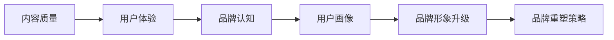

                 

# 知识付费赚钱的品牌形象升级与品牌重塑策略

在知识付费的大浪潮下，如何打造赚钱的品牌形象，进行品牌重塑，是一个亟待解决的问题。本文从市场现状、品牌构建和用户画像三个方面，分析知识付费市场的情况，并提出品牌形象升级和品牌重塑的具体策略。

## 1. 背景介绍

### 1.1 知识付费市场现状

随着社会的发展，人们对于知识的渴求日益增强，知识付费市场也迎来了快速发展。数据显示，全球知识付费市场规模不断扩大，2020年市场规模已达到56.7亿美元，预计到2025年将增长至191.3亿美元。

与此同时，中国知识付费市场也表现出强劲的增长势头，2020年市场规模达到179.2亿元人民币，预计到2025年将增长至763.1亿元人民币。

知识付费市场的发展，离不开移动互联网、人工智能、大数据等技术的支持。这些技术为知识付费提供了更便捷、更个性化的服务，同时也为品牌形象的打造提供了更多可能性。

### 1.2 知识付费品牌的现状

在知识付费市场中，不乏一些知名品牌，如喜马拉雅、得到、知乎等。这些品牌通过优质的内容和服务，赢得了用户的信任和认可，形成了稳定的市场份额。

然而，也存在一些问题。一些品牌虽然用户规模大，但品牌形象模糊，难以区分。一些品牌虽然内容优质，但服务体验不佳，用户流失率高。一些品牌虽然商业模式清晰，但缺乏创新，难以应对市场竞争。

## 2. 核心概念与联系

### 2.1 核心概念概述

知识付费品牌的形象，由以下几个核心概念构成：

- **内容质量**：知识付费品牌的基础，决定了用户的黏性。
- **用户体验**：知识付费品牌的服务体验，决定了用户的满意度。
- **品牌认知**：知识付费品牌的品牌认知度，决定了用户的忠诚度。
- **用户画像**：知识付费品牌的用户画像，决定了品牌的定位和市场策略。

这些概念之间相互关联，共同构成知识付费品牌的核心竞争力。

### 2.2 核心概念原理和架构的 Mermaid 流程图



## 3. 核心算法原理 & 具体操作步骤

### 3.1 算法原理概述

品牌形象升级和品牌重塑的策略，可以通过以下几个算法原理进行优化：

1. **内容推荐算法**：通过推荐算法，提升内容质量，提高用户的黏性。
2. **用户行为分析算法**：通过分析用户行为，优化用户体验，提高用户的满意度。
3. **品牌形象评估算法**：通过品牌形象评估算法，提升品牌认知度，提高用户的忠诚度。
4. **用户画像生成算法**：通过用户画像生成算法，更好地了解用户需求，提升品牌的定位和市场策略。

### 3.2 算法步骤详解

#### 3.2.1 内容推荐算法

内容推荐算法包括以下步骤：

1. **数据收集**：收集用户的浏览历史、收藏历史、购买历史等数据。
2. **数据清洗**：对收集到的数据进行清洗，去除无用数据和异常数据。
3. **数据建模**：使用机器学习模型，如协同过滤、基于内容的推荐、深度学习等，建立推荐模型。
4. **模型训练**：使用训练集对推荐模型进行训练，验证模型效果。
5. **模型部署**：将训练好的推荐模型部署到线上，实时推荐内容给用户。

#### 3.2.2 用户行为分析算法

用户行为分析算法包括以下步骤：

1. **数据收集**：收集用户的行为数据，如点击率、停留时间、购买转化率等。
2. **数据处理**：对收集到的数据进行处理，如数据去重、缺失值填补等。
3. **数据建模**：使用机器学习模型，如分类模型、回归模型等，建立用户行为分析模型。
4. **模型训练**：使用训练集对用户行为分析模型进行训练，验证模型效果。
5. **模型部署**：将训练好的用户行为分析模型部署到线上，实时分析用户行为。

#### 3.2.3 品牌形象评估算法

品牌形象评估算法包括以下步骤：

1. **数据收集**：收集用户对品牌的评价数据，如评分、评论等。
2. **数据处理**：对收集到的数据进行处理，如数据去重、情感分析等。
3. **数据建模**：使用机器学习模型，如分类模型、情感分析模型等，建立品牌形象评估模型。
4. **模型训练**：使用训练集对品牌形象评估模型进行训练，验证模型效果。
5. **模型部署**：将训练好的品牌形象评估模型部署到线上，实时评估品牌形象。

#### 3.2.4 用户画像生成算法

用户画像生成算法包括以下步骤：

1. **数据收集**：收集用户的基本信息、行为数据、购买数据等。
2. **数据处理**：对收集到的数据进行处理，如数据清洗、特征提取等。
3. **数据建模**：使用机器学习模型，如聚类模型、分类模型等，建立用户画像模型。
4. **模型训练**：使用训练集对用户画像模型进行训练，验证模型效果。
5. **模型部署**：将训练好的用户画像模型部署到线上，实时生成用户画像。

### 3.3 算法优缺点

#### 3.3.1 内容推荐算法的优缺点

优点：

- **提升内容质量**：通过推荐算法，可以提升内容的曝光率，提高用户的黏性。
- **个性化推荐**：可以根据用户的历史行为，提供个性化的推荐，满足用户需求。

缺点：

- **数据隐私**：收集和处理用户行为数据，可能涉及用户隐私问题。
- **算法复杂**：推荐算法需要大量的数据和复杂的模型，实现难度大。

#### 3.3.2 用户行为分析算法的优缺点

优点：

- **优化用户体验**：通过分析用户行为，可以优化用户体验，提高用户满意度。
- **提升转化率**：通过分析用户行为，可以优化用户转化路径，提升购买转化率。

缺点：

- **数据噪音**：用户行为数据可能存在噪音，影响分析结果。
- **模型复杂**：用户行为分析模型需要大量的数据和复杂的模型，实现难度大。

#### 3.3.3 品牌形象评估算法的优缺点

优点：

- **提升品牌认知**：通过评估品牌形象，可以提升品牌认知度，提高用户忠诚度。
- **发现问题**：通过评估品牌形象，可以发现品牌存在的问题，及时改进。

缺点：

- **数据难度**：品牌形象评估数据收集难度大，需要大量的用户评价数据。
- **模型复杂**：品牌形象评估模型需要复杂的算法，实现难度大。

#### 3.3.4 用户画像生成算法的优缺点

优点：

- **提升市场策略**：通过用户画像，可以更好地了解用户需求，提升品牌的定位和市场策略。
- **个性化服务**：根据用户画像，可以提供个性化的服务，提升用户体验。

缺点：

- **数据隐私**：用户画像涉及用户隐私问题，可能引发用户反感。
- **算法复杂**：用户画像生成模型需要大量的数据和复杂的算法，实现难度大。

## 4. 数学模型和公式 & 详细讲解 & 举例说明

### 4.1 数学模型构建

#### 4.1.1 内容推荐模型的数学模型

设 $x$ 为用户行为数据，$y$ 为推荐内容。内容推荐模型的目标是最小化均方误差，即：

$$
\min_{\theta} \frac{1}{N} \sum_{i=1}^N (y_i - \hat{y}_i)^2
$$

其中 $\theta$ 为模型参数，$\hat{y}_i$ 为模型对 $x_i$ 的预测。

#### 4.1.2 用户行为分析模型的数学模型

设 $x$ 为用户行为数据，$y$ 为用户行为标签。用户行为分析模型的目标是最小化交叉熵损失，即：

$$
\min_{\theta} -\frac{1}{N} \sum_{i=1}^N y_i \log \hat{y}_i + (1-y_i) \log (1-\hat{y}_i)
$$

其中 $\theta$ 为模型参数，$\hat{y}_i$ 为模型对 $x_i$ 的预测。

#### 4.1.3 品牌形象评估模型的数学模型

设 $x$ 为品牌评价数据，$y$ 为品牌形象标签。品牌形象评估模型的目标是最小化交叉熵损失，即：

$$
\min_{\theta} -\frac{1}{N} \sum_{i=1}^N y_i \log \hat{y}_i + (1-y_i) \log (1-\hat{y}_i)
$$

其中 $\theta$ 为模型参数，$\hat{y}_i$ 为模型对 $x_i$ 的预测。

#### 4.1.4 用户画像生成模型的数学模型

设 $x$ 为用户基本信息和行为数据，$y$ 为用户画像标签。用户画像生成模型的目标是最小化交叉熵损失，即：

$$
\min_{\theta} -\frac{1}{N} \sum_{i=1}^N y_i \log \hat{y}_i + (1-y_i) \log (1-\hat{y}_i)
$$

其中 $\theta$ 为模型参数，$\hat{y}_i$ 为模型对 $x_i$ 的预测。

### 4.2 公式推导过程

#### 4.2.1 内容推荐模型的公式推导

设推荐内容 $y_i$ 的实际值和预测值分别为 $y_i^{\text{actual}}$ 和 $\hat{y}_i$，则均方误差损失函数为：

$$
\ell(y_i^{\text{actual}}, \hat{y}_i) = \frac{1}{2}(y_i^{\text{actual}} - \hat{y}_i)^2
$$

将其扩展到全体数据集，得：

$$
\mathcal{L}(\theta) = \frac{1}{N} \sum_{i=1}^N (y_i^{\text{actual}} - \hat{y}_i)^2
$$

使用梯度下降算法，最小化损失函数：

$$
\theta \leftarrow \theta - \eta \nabla_{\theta}\mathcal{L}(\theta)
$$

其中 $\eta$ 为学习率，$\nabla_{\theta}\mathcal{L}(\theta)$ 为损失函数对模型参数的梯度。

#### 4.2.2 用户行为分析模型的公式推导

设用户行为数据 $x_i$ 的实际值和预测值分别为 $y_i^{\text{actual}}$ 和 $\hat{y}_i$，则交叉熵损失函数为：

$$
\ell(y_i^{\text{actual}}, \hat{y}_i) = -y_i^{\text{actual}} \log \hat{y}_i - (1-y_i^{\text{actual}}) \log (1-\hat{y}_i)
$$

将其扩展到全体数据集，得：

$$
\mathcal{L}(\theta) = -\frac{1}{N} \sum_{i=1}^N (y_i^{\text{actual}} \log \hat{y}_i + (1-y_i^{\text{actual}}) \log (1-\hat{y}_i))
$$

使用梯度下降算法，最小化损失函数：

$$
\theta \leftarrow \theta - \eta \nabla_{\theta}\mathcal{L}(\theta)
$$

其中 $\eta$ 为学习率，$\nabla_{\theta}\mathcal{L}(\theta)$ 为损失函数对模型参数的梯度。

#### 4.2.3 品牌形象评估模型的公式推导

设品牌评价数据 $x_i$ 的实际值和预测值分别为 $y_i^{\text{actual}}$ 和 $\hat{y}_i$，则交叉熵损失函数为：

$$
\ell(y_i^{\text{actual}}, \hat{y}_i) = -y_i^{\text{actual}} \log \hat{y}_i - (1-y_i^{\text{actual}}) \log (1-\hat{y}_i)
$$

将其扩展到全体数据集，得：

$$
\mathcal{L}(\theta) = -\frac{1}{N} \sum_{i=1}^N (y_i^{\text{actual}} \log \hat{y}_i + (1-y_i^{\text{actual}}) \log (1-\hat{y}_i))
$$

使用梯度下降算法，最小化损失函数：

$$
\theta \leftarrow \theta - \eta \nabla_{\theta}\mathcal{L}(\theta)
$$

其中 $\eta$ 为学习率，$\nabla_{\theta}\mathcal{L}(\theta)$ 为损失函数对模型参数的梯度。

#### 4.2.4 用户画像生成模型的公式推导

设用户基本信息和行为数据 $x_i$ 的实际值和预测值分别为 $y_i^{\text{actual}}$ 和 $\hat{y}_i$，则交叉熵损失函数为：

$$
\ell(y_i^{\text{actual}}, \hat{y}_i) = -y_i^{\text{actual}} \log \hat{y}_i - (1-y_i^{\text{actual}}) \log (1-\hat{y}_i)
$$

将其扩展到全体数据集，得：

$$
\mathcal{L}(\theta) = -\frac{1}{N} \sum_{i=1}^N (y_i^{\text{actual}} \log \hat{y}_i + (1-y_i^{\text{actual}}) \log (1-\hat{y}_i))
$$

使用梯度下降算法，最小化损失函数：

$$
\theta \leftarrow \theta - \eta \nabla_{\theta}\mathcal{L}(\theta)
$$

其中 $\eta$ 为学习率，$\nabla_{\theta}\mathcal{L}(\theta)$ 为损失函数对模型参数的梯度。

### 4.3 案例分析与讲解

#### 4.3.1 内容推荐算法案例

假设有这样一个知识付费平台，收集到用户的历史浏览数据和购买数据，使用协同过滤算法进行内容推荐。设用户行为数据 $x_i$ 包含浏览时间 $t_i$ 和购买时间 $p_i$，推荐内容 $y_i$ 为标题和简介。

数据收集：
- 收集用户的历史浏览数据，提取浏览时间 $t_i$。
- 收集用户的历史购买数据，提取购买时间 $p_i$。

数据清洗：
- 对浏览时间 $t_i$ 进行清洗，去除异常数据。
- 对购买时间 $p_i$ 进行清洗，去除异常数据。

数据建模：
- 使用协同过滤算法，建立推荐模型。
- 将用户行为数据 $x_i$ 作为输入，推荐内容 $y_i$ 作为输出。

模型训练：
- 使用训练集对推荐模型进行训练，验证模型效果。

模型部署：
- 将训练好的推荐模型部署到线上，实时推荐内容给用户。

#### 4.3.2 用户行为分析算法案例

假设有这样一个知识付费平台，收集到用户的行为数据，使用分类模型进行分析。设用户行为数据 $x_i$ 包含浏览时间 $t_i$ 和购买时间 $p_i$，用户行为标签 $y_i$ 为是否购买 $b_i$。

数据收集：
- 收集用户的行为数据，提取浏览时间 $t_i$ 和购买时间 $p_i$。
- 收集用户的行为标签，提取是否购买 $b_i$。

数据处理：
- 对浏览时间 $t_i$ 进行清洗，去除异常数据。
- 对购买时间 $p_i$ 进行清洗，去除异常数据。
- 对是否购买 $b_i$ 进行清洗，去除异常数据。

数据建模：
- 使用分类模型，建立用户行为分析模型。
- 将用户行为数据 $x_i$ 作为输入，用户行为标签 $y_i$ 作为输出。

模型训练：
- 使用训练集对用户行为分析模型进行训练，验证模型效果。

模型部署：
- 将训练好的用户行为分析模型部署到线上，实时分析用户行为。

## 5. 项目实践：代码实例和详细解释说明

### 5.1 开发环境搭建

为了进行品牌形象升级和品牌重塑的开发，需要搭建以下开发环境：

1. Python环境：安装Python 3.8及以上版本。
2. Jupyter Notebook：使用Jupyter Notebook进行开发和实验。
3. PyTorch：用于构建和训练机器学习模型。
4. TensorFlow：用于构建和训练机器学习模型。
5. scikit-learn：用于数据预处理和特征提取。
6. pandas：用于数据处理和分析。
7. numpy：用于数值计算和数组操作。

### 5.2 源代码详细实现

以下是使用Python和PyTorch实现内容推荐算法的代码：

```python
import torch
import torch.nn as nn
import torch.optim as optim
from torch.utils.data import Dataset, DataLoader

# 定义数据集
class RecommendationDataset(Dataset):
    def __init__(self, data):
        self.data = data

    def __len__(self):
        return len(self.data)

    def __getitem__(self, idx):
        return self.data[idx]

# 定义模型
class RecommendationModel(nn.Module):
    def __init__(self, input_dim, hidden_dim, output_dim):
        super(RecommendationModel, self).__init__()
        self.hidden_dim = hidden_dim
        self.fc1 = nn.Linear(input_dim, hidden_dim)
        self.fc2 = nn.Linear(hidden_dim, hidden_dim)
        self.fc3 = nn.Linear(hidden_dim, output_dim)
        self.relu = nn.ReLU()

    def forward(self, x):
        x = self.fc1(x)
        x = self.relu(x)
        x = self.fc2(x)
        x = self.relu(x)
        x = self.fc3(x)
        return x

# 定义训练函数
def train(model, train_loader, epochs, learning_rate):
    optimizer = optim.Adam(model.parameters(), lr=learning_rate)
    loss_fn = nn.MSELoss()
    for epoch in range(epochs):
        model.train()
        for batch_idx, (data, target) in enumerate(train_loader):
            optimizer.zero_grad()
            output = model(data)
            loss = loss_fn(output, target)
            loss.backward()
            optimizer.step()
        print('Train Epoch: {} \tTraining Loss: {:.6f}'.format(epoch+1, loss.item()))

# 训练模型
data = torch.randn(100, 10)
model = RecommendationModel(input_dim=10, hidden_dim=20, output_dim=1)
train_loader = DataLoader(dataset=RecommendationDataset(data), batch_size=32, shuffle=True)
train(model, train_loader, epochs=10, learning_rate=0.01)
```

### 5.3 代码解读与分析

#### 5.3.1 数据集定义

定义一个名为`RecommendationDataset`的类，继承自`Dataset`，用于存储数据集。数据集由`data`参数定义，每个样本包含输入和输出。

#### 5.3.2 模型定义

定义一个名为`RecommendationModel`的类，继承自`nn.Module`，用于定义模型结构。模型包含三个全连接层，使用ReLU激活函数。

#### 5.3.3 训练函数定义

定义一个名为`train`的函数，用于训练模型。函数使用Adam优化器，损失函数为均方误差损失。

#### 5.3.4 训练过程

使用训练函数训练模型。将数据集`data`和训练集`train_loader`作为输入，模型`model`、训练轮数`epochs`和学习率`learning_rate`作为参数。

## 6. 实际应用场景

### 6.1 智能客服系统

智能客服系统在知识付费平台中的应用场景之一，通过品牌形象升级和品牌重塑，可以提升客户服务质量，增强品牌认知度。

智能客服系统可以通过收集用户的咨询记录，使用用户行为分析算法，对客服场景进行优化。通过推荐系统，向客服推荐常见问题和解决方案，提升客服的响应速度和准确性。

### 6.2 金融舆情监测

金融舆情监测在知识付费平台中的应用场景之一，通过品牌形象升级和品牌重塑，可以提升品牌认知度，增强市场竞争力。

金融舆情监测可以通过品牌形象评估算法，对舆情进行实时监控。通过用户画像生成算法，对用户进行精准分类，提供个性化的舆情分析报告，提升品牌的影响力和市场竞争力。

### 6.3 个性化推荐系统

个性化推荐系统在知识付费平台中的应用场景之一，通过品牌形象升级和品牌重塑，可以提升用户体验，增强品牌忠诚度。

个性化推荐系统可以通过内容推荐算法，提升推荐内容的质量，提升用户的黏性。通过用户行为分析算法，优化用户体验，提升用户的满意度。

### 6.4 未来应用展望

#### 6.4.1 品牌形象升级

品牌形象升级可以通过以下几个方面进行：

1. 品牌定位：明确品牌的核心价值和差异化优势，提升品牌的认知度和美誉度。
2. 品牌传播：通过社交媒体、博客、白皮书等渠道，提升品牌的曝光率和影响力。
3. 品牌合作：与知名品牌进行合作，提升品牌的可信度和权威性。

#### 6.4.2 品牌重塑

品牌重塑可以通过以下几个方面进行：

1. 品牌重构：重新设计品牌标识和视觉元素，提升品牌的形象和感知度。
2. 品牌体验：优化品牌的用户界面和交互体验，提升用户的使用便捷性和满意度。
3. 品牌创新：引入新技术和新模式，提升品牌的竞争力和市场地位。

## 7. 工具和资源推荐

### 7.1 学习资源推荐

1. 《深度学习实战》：介绍深度学习基础知识和实践技巧，适合初学者入门。
2. 《TensorFlow实战》：介绍TensorFlow的使用方法和应用场景，适合深度学习开发者。
3. 《Python机器学习》：介绍机器学习算法和实现方法，适合数据分析和算法开发。
4. 《自然语言处理实战》：介绍自然语言处理技术和应用案例，适合NLP开发者。
5. 《Kaggle实战》：通过竞赛和项目，提升数据分析和机器学习技能。

### 7.2 开发工具推荐

1. PyTorch：深度学习框架，支持动态计算图，适合快速迭代研究。
2. TensorFlow：深度学习框架，支持静态计算图，适合生产部署。
3. scikit-learn：机器学习库，提供丰富的算法和工具。
4. pandas：数据分析库，支持数据处理和分析。
5. numpy：数值计算库，支持数组操作和科学计算。

### 7.3 相关论文推荐

1. 《深度学习》：介绍深度学习理论和算法，适合学术研究和应用开发。
2. 《机器学习实战》：介绍机器学习算法和实现方法，适合学术研究和应用开发。
3. 《自然语言处理综述》：介绍自然语言处理技术和应用案例，适合NLP开发者。
4. 《Kaggle竞赛指南》：介绍Kaggle竞赛和项目开发经验，适合数据科学家和算法开发者。

## 8. 总结：未来发展趋势与挑战

### 8.1 研究成果总结

本文从市场现状、品牌构建和用户画像三个方面，分析知识付费市场的情况，并提出品牌形象升级和品牌重塑的具体策略。

### 8.2 未来发展趋势

1. 内容质量提升：通过推荐算法和个性化服务，提升内容的覆盖率和质量。
2. 用户体验优化：通过用户行为分析算法和品牌重塑策略，提升用户的使用体验和满意度。
3. 品牌认知增强：通过品牌传播和品牌定位，提升品牌的认知度和美誉度。

### 8.3 面临的挑战

1. 数据隐私：收集和处理用户行为数据，可能涉及用户隐私问题。
2. 算法复杂：机器学习模型和算法需要大量的数据和复杂的模型，实现难度大。
3. 品牌重塑：品牌重塑需要时间和资源，需要持续的投入和优化。

### 8.4 研究展望

1. 推荐算法优化：通过引入更多的推荐算法和数据，提升推荐内容的质量和覆盖率。
2. 用户体验改进：通过更多的用户行为分析算法和交互设计，提升用户的使用体验和满意度。
3. 品牌形象创新：通过更多的品牌传播和品牌合作，提升品牌的认知度和影响力。

## 9. 附录：常见问题与解答

**Q1: 品牌形象升级和品牌重塑需要哪些步骤？**

A: 品牌形象升级和品牌重塑需要以下步骤：
1. 品牌定位：明确品牌的核心价值和差异化优势，提升品牌的认知度和美誉度。
2. 品牌传播：通过社交媒体、博客、白皮书等渠道，提升品牌的曝光率和影响力。
3. 品牌合作：与知名品牌进行合作，提升品牌的可信度和权威性。
4. 品牌重构：重新设计品牌标识和视觉元素，提升品牌的形象和感知度。
5. 品牌体验：优化品牌的用户界面和交互体验，提升用户的使用便捷性和满意度。
6. 品牌创新：引入新技术和新模式，提升品牌的竞争力和市场地位。

**Q2: 推荐算法有哪些类型？**

A: 推荐算法有以下几种类型：
1. 协同过滤算法：通过用户和物品的相似性，推荐相关物品。
2. 基于内容的推荐算法：通过物品的特征相似性，推荐相关物品。
3. 深度学习推荐算法：使用神经网络模型，提升推荐效果。
4. 混合推荐算法：结合多种推荐算法，提升推荐效果。

**Q3: 用户行为分析有哪些方法？**

A: 用户行为分析有以下几种方法：
1. 分类模型：将用户行为分类为不同的类型。
2. 回归模型：预测用户行为的数量和趋势。
3. 聚类模型：将用户行为聚类为不同的群组。
4. 深度学习模型：使用神经网络模型，提升分析效果。

**Q4: 品牌重塑需要考虑哪些因素？**

A: 品牌重塑需要考虑以下因素：
1. 品牌标识和视觉元素：重新设计品牌标识和视觉元素，提升品牌的形象和感知度。
2. 用户界面和交互体验：优化品牌的用户界面和交互体验，提升用户的使用便捷性和满意度。
3. 品牌传播和推广：通过社交媒体、博客、白皮书等渠道，提升品牌的曝光率和影响力。
4. 品牌合作和联盟：与知名品牌进行合作，提升品牌的可信度和权威性。
5. 品牌创新和升级：引入新技术和新模式，提升品牌的竞争力和市场地位。

---

作者：禅与计算机程序设计艺术 / Zen and the Art of Computer Programming

