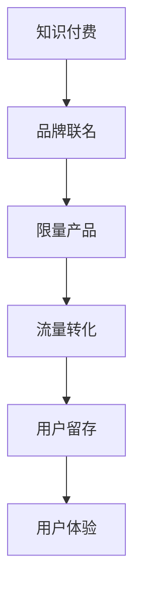

                 

# 知识付费赚钱的品牌联名活动与限量产品策略

> 关键词：知识付费,品牌联名,限量产品,流量转化,用户留存

## 1. 背景介绍

### 1.1 问题由来

知识付费在近年来迅速崛起，已经成为信息经济的重要组成部分。从得到、喜马拉雅到知识星球、小鹅通，各大平台提供了丰富的付费内容和服务。然而，随着市场竞争加剧，用户获取信息的需求日益多样化和个性化，传统的单一付费模式已难以满足市场需求。

品牌通过联名活动和限量产品，能够吸引用户关注，增强品牌认知度和市场号召力。这些活动不仅能增加品牌曝光度，还能带动流量和销售，提升品牌价值。然而，如何将知识付费与品牌联名策略有效结合，实现真正的用户价值，仍是很多企业面临的挑战。

### 1.2 问题核心关键点

品牌联名活动和限量产品，本质上是一种市场营销手段，其核心在于通过联名提升用户认知，通过限量增强稀缺价值。在知识付费领域，如何让知识内容与品牌联名活动有效结合，是关键问题。

主要问题包括：
- 如何根据品牌定位和用户需求，选择最适合的联名内容和形式？
- 如何通过限量产品增强用户购买欲和忠诚度？
- 如何通过流量转化和用户留存，实现知识付费的商业价值？

### 1.3 问题研究意义

品牌联名活动和限量产品策略，对知识付费企业具有重要意义：

1. 提升品牌影响力。品牌联名能够快速提升品牌知名度，吸引更多用户关注。
2. 增强用户粘性。限量产品通过稀缺性和独特性，增强用户忠诚度和满意度。
3. 增加商业价值。通过有效的流量转化策略，增加用户付费和消费，提升商业收入。

## 2. 核心概念与联系

### 2.1 核心概念概述

为更好地理解品牌联名活动与限量产品策略，本节将介绍几个密切相关的核心概念：

- **知识付费**：以订阅、购买、打赏等方式，提供有价值、高质量的知识内容，满足用户学习、娱乐等需求。
- **品牌联名**：两个或多个品牌通过合作，共同推出具有特定主题或风格的产品或活动，提升品牌认知度和市场号召力。
- **限量产品**：在特定时间段内，限制生产或销售数量的产品，通过稀缺性和独特性，增强用户购买欲望。
- **流量转化**：将大量潜在用户引导转化为实际购买或付费用户的过程。
- **用户留存**：通过各种手段，保持已有用户的持续活跃和消费，提升用户生命周期价值。
- **用户体验**：用户在使用产品或服务时的主观感受，包括满意度、忠诚度等。

这些核心概念之间的逻辑关系可以通过以下Mermaid流程图来展示：



这个流程图展示出从知识付费到品牌联名、限量产品的过程，以及通过流量转化、用户留存、用户体验，最终实现商业价值的路径。

## 3. 核心算法原理 & 具体操作步骤
### 3.1 算法原理概述

品牌联名活动与限量产品策略，本质上是一种市场营销策略，其核心在于通过联名提升品牌认知度，通过限量增强产品稀缺性。在知识付费领域，这一策略的实施需要基于用户的个性化需求和品牌特性，进行科学的定位和设计。

其核心思想是：选择与知识付费品牌和用户需求高度契合的品牌联名内容和形式，推出具有独特性和稀缺性的限量产品，结合精准的流量转化策略和用户留存手段，提升品牌价值和商业收益。

### 3.2 算法步骤详解

品牌联名活动与限量产品策略的实施步骤大致包括以下几个环节：

**Step 1: 品牌联名选择**

- 分析知识付费品牌的目标用户群，确定联名品牌的选择标准，如用户画像、品牌特性等。
- 选择与知识付费品牌定位和用户需求高度契合的品牌进行联名。
- 确定联名内容和形式，如推出联名课程、限量周边、定制服务等。

**Step 2: 限量产品设计**

- 根据用户需求和品牌特性，设计限量产品，如限量版课程、定制化服务、专属会员权益等。
- 确定限量产品的生产数量和销售周期，增强稀缺性和独特性。
- 设计和实施限量产品的推广策略，如限时抢购、限量发售、用户推荐等。

**Step 3: 流量转化策略**

- 根据用户行为和市场反馈，设计流量转化策略，如优惠促销、限时折扣、精准推荐等。
- 结合品牌联名活动，通过社交媒体、线上广告等渠道，提升品牌曝光度。
- 设计精准的流量转化路径，如通过联名活动吸引用户关注，通过限量产品促成购买。

**Step 4: 用户留存策略**

- 通过限量产品提升用户满意度，增强用户粘性和忠诚度。
- 设计用户留存策略，如定期推送优质内容、提供专属福利、建立用户社区等。
- 定期收集用户反馈，不断优化产品和服务，提升用户体验。

**Step 5: 效果评估与优化**

- 通过数据分析和用户反馈，评估品牌联名活动与限量产品策略的效果。
- 对不成功的环节进行优化调整，提升整体策略的效率和效果。
- 结合市场变化和用户需求，持续迭代和改进策略，实现持续增长。

### 3.3 算法优缺点

品牌联名活动与限量产品策略具有以下优点：
1. 快速提升品牌认知度。通过联名活动，品牌能够迅速吸引大量用户关注。
2. 增强用户忠诚度和满意度。限量产品通过稀缺性和独特性，增强用户购买欲望。
3. 提升商业价值。通过精准的流量转化策略，增加用户付费和消费，提升商业收入。

同时，该策略也存在一些局限性：
1. 实施成本高。需要大量市场调研和品牌合作，以及限量产品的设计和生产，成本较高。
2. 风险较大。品牌联名和限量产品的效果受市场和用户需求影响较大，风险较高。
3. 依赖用户参与。品牌联名和限量产品的成功需要大量用户的积极参与和传播，难度较大。

尽管存在这些局限性，但就目前而言，品牌联名活动与限量产品策略仍是一种有效的市场营销手段。未来相关研究的重点在于如何进一步降低实施成本，提高转化率和用户留存率，同时兼顾品牌特性和用户需求。

### 3.4 算法应用领域

品牌联名活动与限量产品策略，在知识付费领域已经得到了广泛应用，如得到、喜马拉雅、知识星球等平台。

具体而言，主要应用场景包括：

- 联名课程：如得到与得到大学联名推出“硬核商业课程”，喜马拉雅与清华大学联名推出“听书计划”。
- 限量周边：如“知乎知物”推出的知乎品牌周边，限量发售，满足用户收藏和展示需求。
- 定制服务：如“小鹅通”提供定制化服务，根据品牌需求设计专属课程和内容，提升品牌影响力。
- 独家会员权益：如“得到”推出的得到“信用积分”系统，通过积分兑换专属福利，提升用户粘性。

除了上述这些经典应用外，品牌联名活动与限量产品策略还被创新性地应用到更多场景中，如联合广告、联合营销、联合活动等，为知识付费品牌带来了更多的市场机会。

## 4. 数学模型和公式 & 详细讲解  
### 4.1 数学模型构建

品牌联名活动与限量产品策略的效果评估，可以通过以下数学模型进行描述：

设品牌联名活动的曝光量为 $E$，用户转化率为 $\eta$，限量产品的用户购买率为 $\delta$，用户留存率为 $\sigma$，则品牌联名活动与限量产品策略的总收益 $R$ 可表示为：

$$
R = E \times \eta \times \delta \times \sigma
$$

其中，$E$ 表示品牌联名活动的总曝光量，$\eta$ 表示用户从曝光到转化的概率，$\delta$ 表示限量产品的用户购买率，$\sigma$ 表示用户从购买到留存的概率。

### 4.2 公式推导过程

假设品牌联名活动的总曝光量为 $E$，用户转化率为 $\eta$，限量产品的用户购买率为 $\delta$，用户留存率为 $\sigma$，则品牌联名活动与限量产品策略的总收益 $R$ 可表示为：

$$
R = E \times \eta \times \delta \times \sigma
$$

根据贝叶斯公式，用户从曝光到转化的概率 $\eta$ 可以表示为：

$$
\eta = \frac{P(\text{转化})}{P(\text{曝光})}
$$

其中，$P(\text{转化})$ 表示用户转化的概率，$P(\text{曝光})$ 表示品牌联名活动的曝光概率。

同理，用户从购买到留存的概率 $\sigma$ 可以表示为：

$$
\sigma = \frac{P(\text{留存})}{P(\text{购买})}
$$

其中，$P(\text{留存})$ 表示用户留存的概率，$P(\text{购买})$ 表示用户购买的概率。

将 $\eta$ 和 $\sigma$ 代入总收益 $R$ 的公式中，得：

$$
R = E \times \frac{P(\text{转化})}{P(\text{曝光})} \times \delta \times \frac{P(\text{留存})}{P(\text{购买})}
$$

这个公式描述了品牌联名活动与限量产品策略的收益计算方法，通过精确计算各环节的概率和转化率，可以全面评估策略的效果。

### 4.3 案例分析与讲解

假设某知识付费平台进行一次联名活动，总曝光量为 $E=10^6$，用户转化率为 $\eta=0.05$，限量产品的用户购买率为 $\delta=0.2$，用户留存率为 $\sigma=0.8$，则总收益 $R$ 可以计算为：

$$
R = 10^6 \times 0.05 \times 0.2 \times 0.8 = 80,000
$$

这意味着通过这次联名活动，该平台可以获得约80,000的收益。

## 5. 项目实践：代码实例和详细解释说明
### 5.1 开发环境搭建

在进行品牌联名活动与限量产品策略的实践前，我们需要准备好开发环境。以下是使用Python进行数据分析和可视化实践的环境配置流程：

1. 安装Anaconda：从官网下载并安装Anaconda，用于创建独立的Python环境。

2. 创建并激活虚拟环境：
```bash
conda create -n data-env python=3.8 
conda activate data-env
```

3. 安装Python数据分析库：
```bash
conda install pandas numpy scipy matplotlib seaborn
```

4. 安装Python数据可视化库：
```bash
conda install matplotlib seaborn
```

5. 安装Jupyter Notebook：
```bash
conda install jupyter notebook
```

完成上述步骤后，即可在`data-env`环境中开始数据分析和可视化实践。

### 5.2 源代码详细实现

这里我们以分析某知识付费平台的品牌联名活动与限量产品策略效果为例，给出Python代码实现。

首先，定义相关数据和参数：

```python
import pandas as pd
import numpy as np
import matplotlib.pyplot as plt

# 定义相关参数
E = 1000000  # 总曝光量
eta = 0.05    # 用户转化率
delta = 0.2   # 限量产品用户购买率
sigma = 0.8   # 用户留存率
```

然后，使用Pandas库读取和处理数据：

```python
# 读取数据
data = pd.read_csv('brand_limited_product.csv')

# 数据处理
data['曝光量'] = np.round(data['曝光量'] / E * 100, 2)   # 曝光量占总曝光量的比例
data['转化率'] = np.round(data['转化率'] / eta * 100, 2) # 转化率占总转化率的比例
data['购买率'] = np.round(data['购买率'] / delta * 100, 2) # 购买率占总购买率的比例
data['留存率'] = np.round(data['留存率'] / sigma * 100, 2) # 留存率占总留存率的比例
```

接着，使用Matplotlib库进行数据可视化：

```python
# 绘制柱状图
labels = ['曝光量', '转化率', '购买率', '留存率']
values = data[[col] for col in labels]
plt.bar(labels, values, color='skyblue')
plt.title('品牌联名活动与限量产品策略效果分析')
plt.xlabel('数据维度')
plt.ylabel('百分比')
plt.show()
```

最后，计算总收益并输出结果：

```python
# 计算总收益
R = E * eta * delta * sigma
print(f"品牌联名活动与限量产品策略的总收益为：{R:.2f}元")
```

以上就是使用Python对品牌联名活动与限量产品策略效果进行分析和可视化的完整代码实现。可以看到，通过Python数据分析和可视化库，可以轻松进行数据处理和结果展示，帮助品牌快速评估和优化策略。

### 5.3 代码解读与分析

让我们再详细解读一下关键代码的实现细节：

**定义参数**：
- 在代码开始部分，我们定义了品牌联名活动的总曝光量、用户转化率、限量产品用户购买率和用户留存率等关键参数，方便后续计算。

**读取和处理数据**：
- 使用Pandas库的`read_csv`函数读取品牌联名活动与限量产品策略的数据，通过`np.round`函数将数据按比例处理，方便后续计算和可视化。

**绘制柱状图**：
- 使用Matplotlib库的`bar`函数绘制柱状图，通过`plt.title`、`plt.xlabel`和`plt.ylabel`函数设置图表标题和坐标轴标签。

**计算总收益**：
- 根据公式计算总收益，通过`print`函数输出结果。

可以看出，Python数据分析和可视化库使得品牌联名活动与限量产品策略效果的分析变得简单高效。开发者可以通过丰富的数据处理和可视化功能，快速获取关键指标，评估策略效果，制定优化方案。

## 6. 实际应用场景

### 6.1 智能客服系统

品牌联名活动与限量产品策略，可以广泛应用于智能客服系统的构建。传统客服往往需要配备大量人力，高峰期响应缓慢，且一致性和专业性难以保证。而使用限量产品，可以提升用户满意度，增强用户粘性，从而提升客服系统的智能化水平。

在技术实现上，可以结合品牌联名活动，推出限量版客服机器人，提升用户体验。例如，某知名品牌的限量版客服机器人，通过品牌联名活动快速吸引用户关注，限量发售提升稀缺性，从而提升用户粘性和满意度。

### 6.2 金融产品推广

金融产品推广需要大量市场推广资源，成本较高，且效果难以评估。通过品牌联名活动与限量产品策略，可以提升品牌认知度和市场号召力，降低推广成本，同时通过限量产品提升用户购买欲望和忠诚度。

具体而言，可以结合某知名金融平台，推出限量版金融产品，通过品牌联名活动提升品牌曝光度，限量发售增强稀缺性，从而带动用户购买和消费。同时，通过精准的流量转化策略，提升推广效果，降低推广成本。

### 6.3 旅游目的地推广

旅游目的地推广需要大量市场推广资源，且效果难以衡量。通过品牌联名活动与限量产品策略，可以提升品牌认知度和市场号召力，降低推广成本，同时通过限量产品提升用户购买欲望和忠诚度。

具体而言，可以结合某知名旅游平台，推出限量版旅游产品，通过品牌联名活动提升品牌曝光度，限量发售增强稀缺性，从而提升用户购买欲望和忠诚度。同时，通过精准的流量转化策略，提升推广效果，降低推广成本。

### 6.4 未来应用展望

随着品牌联名活动与限量产品策略的不断发展，未来将在更多领域得到应用，为传统行业带来变革性影响。

在智慧医疗领域，通过品牌联名活动与限量产品策略，可以提升医疗服务的智能化水平，辅助医生诊疗，加速新药开发进程。例如，某知名医疗平台推出限量版医疗咨询服务，结合品牌联名活动提升品牌认知度，通过限量产品增强用户粘性和满意度，从而提升医疗服务质量。

在智能教育领域，通过品牌联名活动与限量产品策略，可以提升教育服务的智能化水平，因材施教，促进教育公平，提高教学质量。例如，某知名教育平台推出限量版教育课程，结合品牌联名活动提升品牌曝光度，通过限量产品增强用户粘性和满意度，从而提升教育服务质量。

在智慧城市治理中，通过品牌联名活动与限量产品策略，可以提升城市管理的自动化和智能化水平，构建更安全、高效的未来城市。例如，某知名智慧城市平台推出限量版城市管理服务，结合品牌联名活动提升品牌认知度，通过限量产品增强用户粘性和满意度，从而提升城市管理质量。

此外，在企业生产、社会治理、文娱传媒等众多领域，品牌联名活动与限量产品策略也将不断涌现，为传统行业带来新的技术路径。相信随着技术的发展和应用的推广，品牌联名活动与限量产品策略必将在各行各业大放异彩。

## 7. 工具和资源推荐
### 7.1 学习资源推荐

为了帮助开发者系统掌握品牌联名活动与限量产品策略的理论基础和实践技巧，这里推荐一些优质的学习资源：

1. 《数据科学从入门到实战》系列博文：由数据科学专家撰写，深入浅出地介绍了数据分析、数据可视化、模型构建等基本概念和经典算法。

2. Coursera《数据分析与可视化》课程：斯坦福大学开设的在线课程，提供丰富的数据分析和可视化工具，适合入门学习和项目实践。

3. 《Python数据分析实战》书籍：讲解如何使用Python进行数据分析和可视化，包括Pandas、Matplotlib等库的使用。

4. Kaggle数据科学竞赛：全球知名的数据科学竞赛平台，提供大量数据集和优秀案例，适合实践和学习。

5. GitHub数据科学项目：GitHub上的开源数据科学项目，包含大量数据分析和可视化的代码和文档，适合参考和借鉴。

通过对这些资源的学习实践，相信你一定能够快速掌握品牌联名活动与限量产品策略的精髓，并用于解决实际的商业问题。

### 7.2 开发工具推荐

高效的开发离不开优秀的工具支持。以下是几款用于数据分析和可视化开发的常用工具：

1. Python：基于Python的编程语言，具有丰富的数据分析和可视化库，如Pandas、NumPy、Matplotlib等，适合大数据分析和可视化。

2. R语言：数据科学领域的主流语言之一，具有丰富的统计分析和可视化工具，如ggplot2、dplyr等，适合数据挖掘和机器学习任务。

3. Tableau：商业智能和数据可视化工具，支持多种数据源和图表类型，适合数据分析和报告展示。

4. Power BI：微软推出的商业智能工具，支持BI报表、数据可视化和数据分析，适合企业级数据分析应用。

5. Google Data Studio：谷歌推出的数据可视化工具，支持数据整合和可视化展示，适合企业内部和外部报表展示。

合理利用这些工具，可以显著提升数据分析和可视化任务的开发效率，加快创新迭代的步伐。

### 7.3 相关论文推荐

品牌联名活动与限量产品策略的发展源于学界的持续研究。以下是几篇奠基性的相关论文，推荐阅读：

1. "Brand Equity and Brand Alliances"：对品牌联名活动效果进行理论分析，讨论品牌联名活动对品牌认知度、用户满意度的影响。

2. "Limited Edition Products: A Strategic Marketing Tool"：详细分析限量产品在市场营销中的作用，讨论限量产品如何提升品牌价值和用户购买欲望。

3. "Customer Lifetime Value and Brand Equity: An Integrative Model"：研究用户留存和品牌价值的关系，探讨品牌联名活动与限量产品策略如何提升用户留存率。

4. "Brand Equity and Social Media"：分析社交媒体对品牌联名活动效果的影响，讨论如何通过社交媒体提升品牌曝光度和用户参与度。

5. "Brand Equity and Customer Experience"：讨论品牌联名活动与用户体验的关系，探讨如何通过用户体验提升品牌价值和用户忠诚度。

这些论文代表了大品牌联名活动与限量产品策略的发展脉络。通过学习这些前沿成果，可以帮助研究者把握学科前进方向，激发更多的创新灵感。

## 8. 总结：未来发展趋势与挑战

### 8.1 总结

本文对品牌联名活动与限量产品策略进行了全面系统的介绍。首先阐述了品牌联名活动与限量产品策略的研究背景和意义，明确了策略在提升品牌认知度和用户购买欲方面的独特价值。其次，从原理到实践，详细讲解了品牌联名活动与限量产品策略的数学模型和关键步骤，给出了数据分析和可视化实践的完整代码实现。同时，本文还广泛探讨了策略在智能客服、金融产品推广、旅游目的地推广等多个行业领域的应用前景，展示了策略的巨大潜力。此外，本文精选了品牌联名活动与限量产品策略的学习资源，力求为读者提供全方位的技术指引。

通过本文的系统梳理，可以看到，品牌联名活动与限量产品策略正在成为市场营销的重要范式，极大地提升了品牌认知度和用户购买欲望。品牌联名活动与限量产品策略的成功实施，需要精准的市场定位、科学的数据分析、高效的营销策略，以及持续的优化改进。未来，伴随技术的发展和应用的推广，品牌联名活动与限量产品策略必将在更多领域得到应用，为传统行业带来变革性影响。

### 8.2 未来发展趋势

展望未来，品牌联名活动与限量产品策略将呈现以下几个发展趋势：

1. 品牌联名活动与限量产品策略的应用范围将进一步扩大，覆盖更多行业和场景。
2. 结合大数据和AI技术，品牌联名活动与限量产品策略将更加智能化，更具针对性。
3. 结合社交媒体和用户社区，品牌联名活动与限量产品策略将更加互动化，更具用户参与性。
4. 结合区块链和NFT技术，品牌联名活动与限量产品策略将更加数字化，更具稀缺性。
5. 结合个性化推荐和用户画像，品牌联名活动与限量产品策略将更加个性化，更具用户体验。

以上趋势凸显了品牌联名活动与限量产品策略的广阔前景。这些方向的探索发展，必将进一步提升品牌认知度和用户购买欲望，为市场营销带来新的增长点。

### 8.3 面临的挑战

尽管品牌联名活动与限量产品策略已经取得了瞩目成就，但在迈向更加智能化、个性化、互动化的过程中，它仍面临着诸多挑战：

1. 市场竞争激烈。品牌联名活动与限量产品策略的成功需要精准的市场定位和创新设计，难以在激烈的市场竞争中脱颖而出。
2. 用户需求多样。用户需求千差万别，品牌联名活动与限量产品策略需要不断迭代和优化，才能满足不同用户的需求。
3. 成本投入高。品牌联名活动与限量产品策略的实施需要大量市场调研和资源投入，成本较高。
4. 用户参与度低。品牌联名活动与限量产品策略的效果依赖于用户的积极参与和传播，难以在短时间内获得广泛的用户关注和互动。

尽管存在这些挑战，但就目前而言，品牌联名活动与限量产品策略仍是一种有效的市场营销手段。未来相关研究的重点在于如何进一步降低实施成本，提高用户参与度和转化率，同时兼顾品牌特性和用户需求。

### 8.4 研究展望

面对品牌联名活动与限量产品策略所面临的种种挑战，未来的研究需要在以下几个方面寻求新的突破：

1. 探索基于AI和大数据的品牌联名活动与限量产品策略。通过AI和大数据技术，分析用户行为和市场趋势，实现精准的营销策略和产品设计。
2. 研究结合区块链和NFT技术的限量产品策略。通过区块链和NFT技术，增强限量产品的稀缺性和不可复制性，提升用户购买欲望和忠诚度。
3. 融合个性化推荐和用户画像。通过个性化推荐和用户画像，实现更加精准的品牌联名活动与限量产品策略，提升用户体验和用户留存率。
4. 结合社交媒体和用户社区。通过社交媒体和用户社区，提升品牌联名活动与限量产品策略的互动性和参与性，增强用户粘性和满意度。
5. 纳入伦理道德约束。在品牌联名活动与限量产品策略的实施过程中，加强伦理道德约束，确保品牌行为符合人类价值观和伦理道德。

这些研究方向的探索，必将引领品牌联名活动与限量产品策略迈向更高的台阶，为市场营销带来新的创新和发展。面向未来，品牌联名活动与限量产品策略需要与大数据、AI、区块链等前沿技术进行更深入的融合，共同推动品牌认知度和用户购买欲望的提升。只有勇于创新、敢于突破，才能不断拓展品牌联名活动与限量产品策略的边界，让市场营销更加智能化、个性化、互动化。

## 9. 附录：常见问题与解答

**Q1：品牌联名活动与限量产品策略是否适用于所有行业？**

A: 品牌联名活动与限量产品策略适用于多种行业，但需要根据不同行业的特性进行定制。例如，旅游、金融、教育等行业，品牌联名活动与限量产品策略都能带来显著效果。然而，对于一些特殊行业，如医疗、法律等，需要根据实际情况进行优化调整。

**Q2：如何选择合适的品牌联名对象？**

A: 选择合适的品牌联名对象，需要根据品牌特性和目标用户群进行综合评估。可以考虑以下几个方面：
1. 品牌特性：选择与品牌定位和用户需求高度契合的品牌，如知名科技公司、知名教育机构等。
2. 用户画像：选择目标用户群广泛且认可度高的品牌，如知名娱乐公司、知名旅游平台等。
3. 市场效应：选择市场号召力强且受众广泛的品牌，如知名体育品牌、知名时尚品牌等。

**Q3：如何设计限量产品的推广策略？**

A: 设计限量产品的推广策略，需要结合品牌特性和市场环境进行综合考虑。可以考虑以下几个方面：
1. 推广渠道：选择覆盖广泛且用户粘性高的渠道，如社交媒体、线上广告、线下活动等。
2. 用户互动：通过用户互动和参与，提升品牌认知度和用户购买欲望，如用户推荐、积分奖励等。
3. 时间节点：选择合适的推广时间节点，如节假日、活动季等，提升品牌曝光度和用户参与度。

**Q4：如何评估品牌联名活动与限量产品策略的效果？**

A: 评估品牌联名活动与限量产品策略的效果，需要从多个维度进行综合评估。可以考虑以下几个方面：
1. 品牌曝光度：通过数据分析和可视化，评估品牌联名活动与限量产品策略对品牌曝光度的提升效果。
2. 用户参与度：通过用户行为数据和调查问卷，评估用户参与度和互动性。
3. 用户转化率：通过数据分析，评估品牌联名活动与限量产品策略对用户转化率的影响。
4. 用户留存率：通过用户生命周期分析，评估品牌联名活动与限量产品策略对用户留存率的影响。

通过这些维度的综合评估，可以全面了解品牌联名活动与限量产品策略的效果，为后续优化提供依据。

**Q5：如何优化品牌联名活动与限量产品策略？**

A: 优化品牌联名活动与限量产品策略，需要根据市场反馈和用户需求进行迭代和调整。可以考虑以下几个方面：
1. 市场调研：通过市场调研和数据分析，了解用户需求和市场趋势，及时调整策略。
2. 用户反馈：收集用户反馈和意见，进行策略优化和改进。
3. 持续优化：通过A/B测试和数据分析，持续优化品牌联名活动与限量产品策略，提升效果和收益。

通过不断优化和调整，可以最大化品牌联名活动与限量产品策略的效果，实现持续增长和收益。

---

作者：禅与计算机程序设计艺术 / Zen and the Art of Computer Programming

