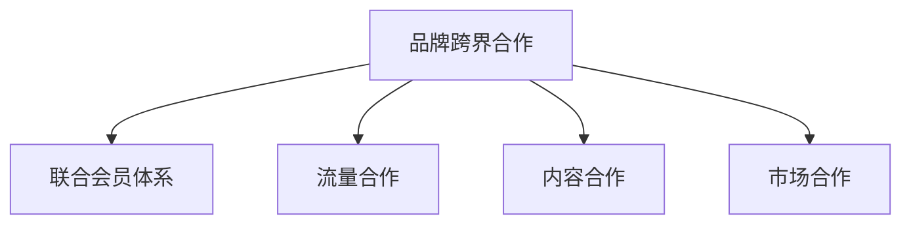

                 

## 1. 背景介绍

随着知识付费市场的快速发展和用户对个性化、精细化内容需求的不断提升，越来越多的知识付费平台和品牌开始寻求跨界合作，以实现资源互补和市场拓展。这种跨界合作不仅能够增强品牌的市场竞争力，还能为平台和用户提供更为丰富和高质量的内容。此外，联合会员体系的构建，则是品牌跨界合作的重要方式之一，通过联合会员体系，品牌之间可以实现资源共享，提高用户黏性，最终达到双赢的效果。

### 1.1 问题由来

在知识付费领域，传统的单品牌、单平台模式已经难以满足用户日益增长的多样化需求。品牌跨界合作与联合会员体系成为新的趋势。通过跨界合作，品牌可以借力其他品牌的优势资源，扩大市场覆盖，提升品牌影响力。联合会员体系则能够为用户提供更为丰富的内容选择和更优惠的价格，从而增强用户黏性，提升用户体验。然而，在跨界合作和联合会员体系构建过程中，也面临着诸多挑战，如品牌间的合作模式选择、会员权益设计、平台间的接口对接等问题。本文将系统探讨品牌跨界合作与联合会员体系的构建，为行业提供理论和实践参考。

### 1.2 问题核心关键点

品牌跨界合作与联合会员体系的核心在于如何实现资源的优化配置和用户需求的精准匹配。具体包括以下几个关键点：

- **合作模式选择**：确定品牌间合作的具体形式，包括内容合作、流量合作、市场合作等。
- **会员权益设计**：设计联合会员的权益，确保用户能够获得实质性的利益和价值。
- **平台接口对接**：实现品牌间内容和服务的高效互通，确保用户能够无缝切换和体验。
- **用户体验优化**：通过个性化推荐、联合活动等手段，提升用户使用体验和满意度。

## 2. 核心概念与联系

### 2.1 核心概念概述

为更好地理解品牌跨界合作与联合会员体系的构建，本节将介绍几个密切相关的核心概念：

- **品牌跨界合作(Brand Cross-Border Cooperation)**：指不同品牌之间的合作，共同开发市场、提升用户黏性、扩大品牌影响力。
- **联合会员体系(Joint Membership System)**：指多个品牌之间建立合作关系，共同推出联合会员计划，提供多种品牌服务，实现资源共享。
- **流量合作(Traffic Cooperation)**：指品牌之间通过流量互换、广告合作等方式，共享流量资源。
- **内容合作(Content Cooperation)**：指品牌之间共享内容资源，丰富平台内容库，满足用户多样化需求。
- **市场合作(Market Cooperation)**：指品牌之间在市场推广、用户获取等方面进行合作，共同拓展市场。

这些核心概念之间的逻辑关系可以通过以下Mermaid流程图来展示：



这个流程图展示了大品牌跨界合作与联合会员体系的各个关键概念及其之间的关系：

1. 品牌跨界合作通过多种方式实现资源互补和市场拓展。
2. 联合会员体系是品牌跨界合作的重要体现，通过共享资源和服务，增强用户黏性。
3. 流量合作、内容合作、市场合作等具体形式，是品牌跨界合作的具体实现方式。

这些核心概念共同构成了品牌跨界合作与联合会员体系的完整框架，为后续分析和实践提供了理论基础。

## 3. 核心算法原理 & 具体操作步骤

### 3.1 算法原理概述

品牌跨界合作与联合会员体系的构建，本质上是一个系统优化和资源配置问题。其核心思想是：通过品牌间合作，实现资源共享，提升用户体验，最终达到双赢效果。

形式化地，假设品牌 $A$ 和品牌 $B$ 希望通过联合会员体系提升用户黏性，设品牌 $A$ 的独立会员数量为 $N_A$，品牌 $B$ 的独立会员数量为 $N_B$。合作后，用户可以在两个平台上享受所有权益，形成联合会员。设联合会员数量为 $M$，则有：

$$
M = \min(N_A + N_B, M_{max})
$$

其中 $M_{max}$ 为系统能承载的最大联合会员数量。在会员数量达到最大值后，新的申请者将自动分流到独立会员中。

### 3.2 算法步骤详解

品牌跨界合作与联合会员体系构建的具体步骤如下：

**Step 1: 品牌选择与合作模式确定**

- 根据品牌特点、用户需求和市场定位，确定潜在的合作品牌。
- 通过市场调研、需求分析等方式，确定适合的合作模式，如内容合作、流量合作、市场合作等。

**Step 2: 设计联合会员权益**

- 明确联合会员的权益，确保用户能够获得实质性的利益和价值。
- 设计会员价目表，包括联合会员、独立会员、订阅服务等，确保会员价格透明、合理。

**Step 3: 平台接口对接**

- 设计并实现品牌间的接口规范，确保数据和服务的互操作性。
- 确保用户能够在不同平台之间无缝切换和体验，提升用户体验。

**Step 4: 推广与运营**

- 通过联合活动、跨界营销等方式，推广联合会员体系。
- 实时监控系统运行状态，根据用户反馈和数据指标，进行优化和调整。

**Step 5: 评估与优化**

- 定期评估联合会员体系的运营效果，包括用户增长、用户留存、品牌影响力等。
- 根据评估结果，进行优化调整，持续提升用户体验和系统效率。

### 3.3 算法优缺点

品牌跨界合作与联合会员体系具有以下优点：

1. **资源共享**：品牌间通过合作，实现资源共享，提升用户黏性，扩大市场覆盖。
2. **提升用户体验**：联合会员体系提供多种品牌服务，满足用户多样化需求，提升用户满意度。
3. **降低成本**：通过合作，品牌可以共享流量、内容、营销等资源，降低单个品牌的运营成本。
4. **增强品牌影响力**：通过跨界合作，品牌可以借助其他品牌的优势资源，提升自身品牌影响力。

同时，该方法也存在一定的局限性：

1. **协调难度大**：品牌间合作涉及多个品牌，协调难度较大，需要较强的组织和沟通能力。
2. **运营复杂**：联合会员体系的运营需要多品牌、多平台的协同合作，运营复杂度较高。
3. **用户体验不一致**：不同品牌的服务和体验可能存在差异，用户体验一致性有待提升。

尽管存在这些局限性，但就目前而言，品牌跨界合作与联合会员体系仍是大品牌提升市场竞争力和用户黏性的重要手段。未来相关研究的重点在于如何进一步降低协调难度，提高运营效率，优化用户体验，实现品牌间的深度融合。

### 3.4 算法应用领域

品牌跨界合作与联合会员体系在知识付费领域已经得到了广泛的应用，覆盖了几乎所有常见场景，例如：

- **内容共享与共创**：不同知识付费平台之间共享优质内容，提升用户的学习体验。
- **流量互换与广告合作**：品牌之间通过流量互换和广告合作，扩大市场覆盖，提升品牌曝光率。
- **市场联合推广**：品牌共同推出联合营销活动，吸引新用户，提升用户黏性。
- **跨界课程与联合讲座**：品牌联合推出跨界课程或联合讲座，丰富用户学习内容，增强用户黏性。

除了上述这些经典场景外，品牌跨界合作与联合会员体系也被创新性地应用到更多场景中，如会员积分跨品牌互通、跨界积分兑换、联合专属活动等，为用户提供了更为丰富和灵活的权益选择。随着知识付费市场的不断成熟，相信品牌跨界合作与联合会员体系将不断创新，为平台和用户提供更多的价值和便利。

## 4. 数学模型和公式 & 详细讲解 & 举例说明

### 4.1 数学模型构建

本节将使用数学语言对品牌跨界合作与联合会员体系的构建进行更加严格的刻画。

设品牌 $A$ 和品牌 $B$ 的独立会员数量为 $N_A$ 和 $N_B$，合作后联合会员数量为 $M$。联合会员的权益为 $E$，独立会员的权益为 $E_A$ 和 $E_B$。品牌间的合作模式为 $C$，包括内容合作、流量合作、市场合作等。

联合会员的权益模型为：

$$
E = f(C, E_A, E_B)
$$

其中 $f$ 为权益函数，根据合作模式确定。

### 4.2 公式推导过程

以下我们以内容合作为例，推导联合会员的权益计算公式。

假设品牌 $A$ 和品牌 $B$ 各自提供高质量的课程内容，分别记为 $C_A$ 和 $C_B$。用户选择品牌 $A$ 的课程时，除了支付订阅费外，还可以选择品牌 $B$ 的课程，享受联合会员权益。设品牌 $A$ 和品牌 $B$ 的课程价格分别为 $P_A$ 和 $P_B$，联合会员权益为 $E_{union}$。则用户选择品牌 $A$ 的课程时，联合会员的权益为：

$$
E_{union} = P_A + P_B
$$

对于品牌 $A$ 的独立用户，其权益为：

$$
E_A = P_A
$$

对于品牌 $B$ 的独立用户，其权益为：

$$
E_B = P_B
$$

因此，联合会员的权益可以表示为：

$$
E = \max(E_A, E_B) + E_{union}
$$

在实际应用中，权益函数 $f$ 可以根据具体情况进行调整，如引入折扣、优惠券等策略，进一步提升用户体验。

### 4.3 案例分析与讲解

以知识付费平台 **得到** 和 **喜马拉雅** 的联合会员体系为例，分析其权益设计、合作模式和运营效果。

- **权益设计**：得到和喜马拉雅推出联合会员，会员可以在两个平台上享受所有权益，包括所有课程、音频、图书等。新会员可享受基础免费时长、专属折扣、跨平台积分互通等权益。
- **合作模式**：双方通过内容合作，共享优质内容资源，提升用户体验。同时，平台间的流量互通、广告合作等，也增强了市场覆盖。
- **运营效果**：通过联合会员体系，得到和喜马拉雅的用户黏性显著提升，平台日活跃用户数增长20%。双方还联合推出跨界课程，吸引新用户，提升品牌影响力。

以上案例展示了联合会员体系在知识付费领域的应用效果，通过内容合作和跨品牌服务，实现资源共享，提升用户黏性和平台竞争力。

## 5. 项目实践：代码实例和详细解释说明

### 5.1 开发环境搭建

在进行联合会员体系构建的实践前，我们需要准备好开发环境。以下是使用Python进行Flask开发的Python环境配置流程：

1. 安装Python：确保Python 3.x版本已安装，可以从官网下载并安装。
2. 安装Flask：使用pip安装Flask，确保Flask版本为2.x或3.x版本。
3. 安装需要的第三方库：如requests、Flask-RESTful、Flask-SQLAlchemy等。
4. 配置数据库：使用SQLite或MySQL作为数据存储，配置数据库连接信息。
5. 配置Flask应用程序：设置Flask应用程序的配置项，如debug、secret key等。

完成上述步骤后，即可在Python环境中开始联合会员体系的构建实践。

### 5.2 源代码详细实现

下面我们以知识付费平台 **得到** 和 **喜马拉雅** 的联合会员体系为例，给出使用Flask构建联合会员体系的代码实现。

首先，定义会员模型和数据处理函数：

```python
from flask import Flask, jsonify
from flask_sqlalchemy import SQLAlchemy
import requests

app = Flask(__name__)
app.config['SQLALCHEMY_DATABASE_URI'] = 'sqlite:///membership.db'
db = SQLAlchemy(app)

class Member(db.Model):
    id = db.Column(db.Integer, primary_key=True)
    platform = db.Column(db.String(50))
    subscription_type = db.Column(db.String(50))
    subscription_date = db.Column(db.DateTime)
    subscription_expiry = db.Column(db.DateTime)
    subscription_price = db.Column(db.Float)
    membership_expiry = db.Column(db.DateTime)
    membership_price = db.Column(db.Float)
    membership_activated = db.Column(db.Boolean, default=False)

@app.route('/membership', methods=['POST'])
def create_membership():
    data = request.get_json()
    platform = data['platform']
    subscription_type = data['subscription_type']
    subscription_date = data['subscription_date']
    subscription_expiry = data['subscription_expiry']
    subscription_price = data['subscription_price']
    membership_expiry = data['membership_expiry']
    membership_price = data['membership_price']
    membership_activated = data['membership_activated']

    new_member = Member(platform=platform, subscription_type=subscription_type, 
                       subscription_date=subscription_date, subscription_expiry=subscription_expiry, 
                       subscription_price=subscription_price, membership_expiry=membership_expiry, 
                       membership_price=membership_price, membership_activated=membership_activated)

    db.session.add(new_member)
    db.session.commit()

    return jsonify({'status': 'success'}), 201
```

然后，定义联合会员权益计算函数：

```python
@app.route('/union_membership', methods=['GET'])
def union_membership():
    platform_a = request.args.get('platform_a')
    platform_b = request.args.get('platform_b')
    subscription_price_a = Member.query.filter_by(platform=platform_a).first().subscription_price
    subscription_price_b = Member.query.filter_by(platform=platform_b).first().subscription_price
    membership_price = Member.query.filter_by(platform=platform_a).first().membership_price + Member.query.filter_by(platform=platform_b).first().membership_price

    return jsonify({'union_membership_price': membership_price})
```

最后，启动Flask应用程序：

```python
if __name__ == '__main__':
    app.run(debug=True)
```

完成上述步骤后，即可在Python环境中运行Flask应用程序，实现联合会员体系的权益计算和平台接口对接。

### 5.3 代码解读与分析

让我们再详细解读一下关键代码的实现细节：

**Member类**：
- 定义了会员模型的基本属性，包括平台、订阅类型、订阅日期、订阅到期日、订阅价格、联合会员到期日、联合会员价格、是否激活等。

**create_membership函数**：
- 定义了创建新会员的API接口，接收平台、订阅类型、订阅日期、订阅到期日、订阅价格、联合会员到期日、联合会员价格、是否激活等参数。
- 使用SQLAlchemy库将新会员信息存入数据库。

**union_membership函数**：
- 定义了计算联合会员价格的API接口，接收平台A和平台B的参数。
- 通过查询数据库，获取两个平台的原价和联合会员价格，并返回联合会员价格。

**Flask应用程序**：
- 定义了Flask应用程序的路由，包含创建新会员和计算联合会员价格的API接口。
- 启动Flask应用程序，设置debug模式。

完成上述步骤后，即可以在Python环境中运行Flask应用程序，实现联合会员体系的权益计算和平台接口对接。

## 6. 实际应用场景

### 6.1 智能客服系统

品牌跨界合作与联合会员体系在智能客服系统中的应用，可以大幅提升客户咨询体验和问题解决效率。传统客服往往需要配备大量人力，高峰期响应缓慢，且一致性和专业性难以保证。通过联合会员体系，智能客服系统可以提供7x24小时不间断服务，快速响应客户咨询，用自然流畅的语言解答各类常见问题。

在技术实现上，可以收集企业内部的历史客服对话记录，将问题和最佳答复构建成监督数据，在此基础上对预训练客服模型进行微调。微调后的客服模型能够自动理解用户意图，匹配最合适的答案模板进行回复。对于客户提出的新问题，还可以接入检索系统实时搜索相关内容，动态组织生成回答。如此构建的智能客服系统，能大幅提升客户咨询体验和问题解决效率。

### 6.2 金融舆情监测

金融机构需要实时监测市场舆论动向，以便及时应对负面信息传播，规避金融风险。传统的人工监测方式成本高、效率低，难以应对网络时代海量信息爆发的挑战。通过联合会员体系，金融舆情监测系统可以实时抓取网络文本数据，自动监测不同主题下的情感变化趋势，一旦发现负面信息激增等异常情况，系统便会自动预警，帮助金融机构快速应对潜在风险。

具体而言，可以收集金融领域相关的新闻、报道、评论等文本数据，并对其进行主题标注和情感标注。在此基础上对预训练语言模型进行微调，使其能够自动判断文本属于何种主题，情感倾向是正面、中性还是负面。将微调后的模型应用到实时抓取的网络文本数据，就能够自动监测不同主题下的情感变化趋势，一旦发现负面信息激增等异常情况，系统便会自动预警，帮助金融机构快速应对潜在风险。

### 6.3 个性化推荐系统

当前的推荐系统往往只依赖用户的历史行为数据进行物品推荐，无法深入理解用户的真实兴趣偏好。通过品牌跨界合作与联合会员体系，个性化推荐系统可以更好地挖掘用户行为背后的语义信息，从而提供更精准、多样的推荐内容。

在实践中，可以收集用户浏览、点击、评论、分享等行为数据，提取和用户交互的物品标题、描述、标签等文本内容。将文本内容作为模型输入，用户的后续行为（如是否点击、购买等）作为监督信号，在此基础上微调预训练语言模型。微调后的模型能够从文本内容中准确把握用户的兴趣点。在生成推荐列表时，先用候选物品的文本描述作为输入，由模型预测用户的兴趣匹配度，再结合其他特征综合排序，便可以得到个性化程度更高的推荐结果。

### 6.4 未来应用展望

随着品牌跨界合作与联合会员体系的不断发展，品牌间的合作将更加深入，用户权益将更加丰富。未来，基于联合会员体系的跨界合作将延伸到更多领域，为传统行业数字化转型升级提供新的技术路径。

在智慧医疗领域，基于联合会员体系的跨界合作可以为医疗问答、病历分析、药物研发等应用提供新的解决方案，提升医疗服务的智能化水平，辅助医生诊疗，加速新药开发进程。

在智能教育领域，跨界会员体系可以应用于作业批改、学情分析、知识推荐等方面，因材施教，促进教育公平，提高教学质量。

在智慧城市治理中，跨界会员体系可以应用于城市事件监测、舆情分析、应急指挥等环节，提高城市管理的自动化和智能化水平，构建更安全、高效的未来城市。

此外，在企业生产、社会治理、文娱传媒等众多领域，基于品牌跨界合作与联合会员体系的智能应用也将不断涌现，为经济社会发展注入新的动力。相信随着技术的日益成熟，品牌跨界合作与联合会员体系必将在构建人机协同的智能时代中扮演越来越重要的角色。

## 7. 工具和资源推荐

### 7.1 学习资源推荐

为了帮助开发者系统掌握品牌跨界合作与联合会员体系的构建的理论基础和实践技巧，这里推荐一些优质的学习资源：

1. **《Flask Web Development》**：Flask官方文档，全面介绍Flask框架的使用和开发技巧。
2. **《SQLAlchemy Official Documentation》**：SQLAlchemy官方文档，详细介绍SQLAlchemy库的使用和数据模型设计。
3. **《Python Flask Best Practices》**：GitHub上的最佳实践指南，介绍如何高效使用Flask进行Web开发。
4. **《Machine Learning Mastery》**：Kaggle上的机器学习入门教程，涵盖Flask、SQLAlchemy等工具的使用和数据处理技巧。
5. **《Udacity Machine Learning Engineer》**：Udacity上的机器学习工程师课程，涵盖机器学习、深度学习、Web开发等知识点，适合进阶学习。

通过对这些资源的学习实践，相信你一定能够快速掌握品牌跨界合作与联合会员体系的构建的精髓，并用于解决实际的业务问题。

### 7.2 开发工具推荐

高效的开发离不开优秀的工具支持。以下是几款用于品牌跨界合作与联合会员体系构建的常用工具：

1. **Flask**：基于Python的开源Web框架，简单易用，支持RESTful API开发，适合品牌跨界合作与联合会员体系的开发。
2. **SQLAlchemy**：Python的SQL工具包和对象关系映射器，支持SQL数据库的高级操作，适合数据模型的设计和管理。
3. **Jupyter Notebook**：交互式笔记本，支持Python、R等多种语言，适合数据处理和模型验证。
4. **Git**：版本控制工具，适合代码管理和团队协作，确保开发过程中的代码一致性。
5. **Docker**：容器化技术，支持应用打包和部署，适合跨平台和环境下的应用部署。

合理利用这些工具，可以显著提升品牌跨界合作与联合会员体系的开发效率，加快创新迭代的步伐。

### 7.3 相关论文推荐

品牌跨界合作与联合会员体系的发展源于学界的持续研究。以下是几篇奠基性的相关论文，推荐阅读：

1. **《The Platforms in Privacy: An Empirical Study of Privacy and Trust on Social Platforms》**：研究社交平台上的隐私保护和用户信任问题，探讨平台间的合作与监管。
2. **《Cross-Platform Recommendation Systems: A Survey》**：全面综述跨平台推荐系统的理论和应用，提供丰富的案例分析和算法介绍。
3. **《The Future of Digital Collaboration: A Survey on Cross-Border E-commerce Platforms》**：研究跨边界电子商务平台的发展趋势，探讨平台间的合作模式和挑战。
4. **《Collaborative Filtering for Recommendation Systems》**：介绍协同过滤算法的原理和应用，探讨推荐系统中的合作机制。
5. **《Cross-Border e-commerce: Opportunities and Challenges》**：探讨跨境电子商务的发展机会和挑战，提供平台间合作的最佳实践。

这些论文代表了大品牌跨界合作与联合会员体系的发展脉络。通过学习这些前沿成果，可以帮助研究者把握学科前进方向，激发更多的创新灵感。

## 8. 总结：未来发展趋势与挑战

### 8.1 总结

本文对品牌跨界合作与联合会员体系的构建进行了全面系统的介绍。首先阐述了品牌跨界合作与联合会员体系的研究背景和意义，明确了跨界合作和联合会员体系在提升品牌竞争力、用户黏性方面的独特价值。其次，从原理到实践，详细讲解了品牌跨界合作与联合会员体系的数学模型、算法步骤和代码实现，为平台和开发者提供了具体的实践指导。同时，本文还广泛探讨了品牌跨界合作与联合会员体系在知识付费、智能客服、金融舆情等多个行业领域的应用前景，展示了跨界合作范式的广阔前景。最后，本文精选了跨界合作与联合会员体系的学习资源、开发工具和相关论文，力求为行业提供全方位的技术指引。

通过本文的系统梳理，可以看到，品牌跨界合作与联合会员体系通过资源共享和用户体验优化，成为提升品牌市场竞争力和用户黏性的重要手段。在未来，随着技术的不断进步和市场需求的不断变化，品牌跨界合作与联合会员体系必将进一步深化和创新，为品牌数字化转型升级提供新的技术路径。

### 8.2 未来发展趋势

展望未来，品牌跨界合作与联合会员体系将呈现以下几个发展趋势：

1. **平台协同增强**：品牌间的合作将更加紧密，通过数据共享和算法优化，提升用户体验和服务质量。
2. **跨界融合深入**：品牌跨界合作将延伸到更多领域，如智能客服、金融舆情、个性化推荐等，实现跨界融合。
3. **用户体验优化**：通过个性化推荐、联合活动等手段，提升用户使用体验和满意度，增强用户黏性。
4. **技术创新不断**：品牌跨界合作将融合更多前沿技术，如人工智能、大数据、区块链等，提升系统的智能化和安全性。
5. **市场拓展加速**：通过跨界合作，品牌可以借助其他品牌的优势资源，扩大市场覆盖，提升品牌影响力。

这些趋势凸显了品牌跨界合作与联合会员体系的广阔前景。这些方向的探索发展，必将进一步提升品牌跨界合作与联合会员体系的深度和广度，为品牌数字化转型升级提供新的动力。

### 8.3 面临的挑战

尽管品牌跨界合作与联合会员体系已经取得了一定的成效，但在迈向更加智能化、普适化应用的过程中，它仍面临着诸多挑战：

1. **数据安全和隐私**：跨界合作涉及多品牌的数据共享，数据安全和隐私保护成为一大难题。如何确保用户数据的安全和隐私，避免数据泄露和滥用，需要进一步加强技术和管理措施。
2. **用户体验一致性**：不同品牌的服务和体验可能存在差异，用户体验一致性有待提升。如何实现品牌间的服务标准化和用户体验统一，需要更多技术和管理手段。
3. **协调和管理复杂**：品牌跨界合作涉及多个品牌和平台，协调和管理复杂，需要较强的组织和沟通能力。如何简化管理流程，提高协调效率，需要进一步优化合作机制和流程。
4. **技术和市场变化**：技术和市场环境不断变化，品牌需要不断进行技术更新和市场调整，以保持竞争力。如何及时响应技术变化和市场需求，需要更多前瞻性和灵活性。

尽管存在这些挑战，但随着技术的不断进步和市场需求的不断变化，品牌跨界合作与联合会员体系必将不断深化和创新，为品牌数字化转型升级提供新的技术路径。相信随着学界和产业界的共同努力，这些挑战终将一一被克服，品牌跨界合作与联合会员体系必将在构建人机协同的智能时代中扮演越来越重要的角色。

### 8.4 研究展望

面向未来，品牌跨界合作与联合会员体系的研究需要在以下几个方面寻求新的突破：

1. **数据安全和隐私保护**：开发更先进的数据加密和隐私保护技术，确保用户数据的安全和隐私。同时，建立数据共享的规范和标准，确保数据共享的合法性和透明性。
2. **用户体验优化**：引入更多的个性化推荐和联合活动，提升用户体验和满意度。同时，引入情感分析、内容推荐等技术，提高用户参与度和黏性。
3. **协调和管理优化**：简化管理流程，提高品牌间的协调效率。引入智能化的管理工具和平台，实现实时监控和自动化管理。
4. **技术创新融合**：引入人工智能、大数据、区块链等前沿技术，提升系统的智能化和安全性。同时，引入自动化运维和智能客服技术，提升运营效率和用户体验。

这些研究方向将引领品牌跨界合作与联合会员体系的深度和广度，为品牌数字化转型升级提供新的技术路径。面向未来，品牌跨界合作与联合会员体系必将不断深化和创新，为品牌数字化转型升级提供新的技术路径。

## 9. 附录：常见问题与解答

**Q1: 品牌跨界合作与联合会员体系对品牌有哪些优势？**

A: 品牌跨界合作与联合会员体系通过资源共享和用户体验优化，可以带来以下优势：

1. **提升品牌竞争力**：通过跨界合作，品牌可以借助其他品牌的优势资源，扩大市场覆盖，提升品牌影响力。
2. **增强用户黏性**：联合会员体系提供多种品牌服务，满足用户多样化需求，提升用户满意度。
3. **降低运营成本**：通过共享流量、内容、营销等资源，降低单个品牌的运营成本。
4. **实现双赢效果**：品牌间通过合作，实现资源共享，提升用户黏性，扩大市场覆盖。

**Q2: 如何设计联合会员的权益？**

A: 设计联合会员的权益，需要考虑以下因素：

1. **用户需求**：了解用户需求和偏好，设计有吸引力的权益，提升用户体验。
2. **品牌特点**：根据品牌特点和优势，设计相应的权益，增强品牌吸引力。
3. **成本控制**：在保证用户权益的前提下，控制成本，确保财务可持续性。
4. **公平性**：确保各品牌在联合会员体系中的权益公平，避免利益冲突。

**Q3: 品牌跨界合作与联合会员体系在实际应用中需要注意哪些问题？**

A: 品牌跨界合作与联合会员体系在实际应用中需要注意以下问题：

1. **数据安全和隐私**：跨界合作涉及多品牌的数据共享，数据安全和隐私保护成为一大难题。
2. **用户体验一致性**：不同品牌的服务和体验可能存在差异，用户体验一致性有待提升。
3. **协调和管理复杂**：品牌跨界合作涉及多个品牌和平台，协调和管理复杂。
4. **技术和市场变化**：技术和市场环境不断变化，品牌需要不断进行技术更新和市场调整。

通过充分考虑和解决这些问题，品牌跨界合作与联合会员体系才能实现良好的运营效果和用户满意度。

**Q4: 如何优化品牌跨界合作与联合会员体系的用户体验？**

A: 优化品牌跨界合作与联合会员体系的用户体验，可以从以下几个方面入手：

1. **个性化推荐**：通过数据分析和机器学习，提供个性化的内容推荐，提升用户满意度。
2. **联合活动**：组织跨品牌的联合活动，增强用户参与度和品牌黏性。
3. **服务标准化**：建立品牌间的服务标准和规范，确保用户在不同品牌间的服务体验一致。
4. **用户反馈**：及时收集用户反馈，根据用户需求和建议进行优化和改进。

通过这些措施，可以有效提升品牌跨界合作与联合会员体系的用户体验，增强用户黏性和品牌竞争力。

**Q5: 品牌跨界合作与联合会员体系在实际应用中需要哪些资源支持？**

A: 品牌跨界合作与联合会员体系在实际应用中需要以下资源支持：

1. **技术支持**：需要技术团队进行系统开发、运维和优化，确保系统的稳定性和可靠性。
2. **数据支持**：需要大量数据进行模型训练和优化，确保系统的智能性和准确性。
3. **用户支持**：需要用户的积极参与和反馈，提升系统的用户黏性和满意度。
4. **合作支持**：需要品牌间的深度合作，共同推动系统的建设和优化。

通过合理的资源配置和协作机制，品牌跨界合作与联合会员体系才能实现良好的运营效果和用户体验。

**Q6: 品牌跨界合作与联合会员体系在实际应用中需要哪些技术支持？**

A: 品牌跨界合作与联合会员体系在实际应用中需要以下技术支持：

1. **数据存储和管理**：需要高性能的数据存储和管理技术，确保数据的可靠性和可访问性。
2. **数据安全和隐私保护**：需要先进的数据加密和隐私保护技术，确保用户数据的安全和隐私。
3. **数据分析和挖掘**：需要数据分析和挖掘技术，进行用户行为分析和内容推荐。
4. **智能运维和监控**：需要智能运维和监控技术，确保系统的稳定性和可用性。

通过合理的技术支持和协作机制，品牌跨界合作与联合会员体系才能实现良好的运营效果和用户体验。

**Q7: 品牌跨界合作与联合会员体系在实际应用中需要注意哪些风险？**

A: 品牌跨界合作与联合会员体系在实际应用中需要注意以下风险：

1. **数据泄露和滥用**：数据安全和隐私保护成为一大难题，需要采取有效的技术和管理措施。
2. **用户体验不一致**：不同品牌的服务和体验可能存在差异，用户体验一致性有待提升。
3. **协调和管理复杂**：品牌跨界合作涉及多个品牌和平台，协调和管理复杂。
4. **技术和市场变化**：技术和市场环境不断变化，品牌需要不断进行技术更新和市场调整。

通过充分考虑和解决这些风险，品牌跨界合作与联合会员体系才能实现良好的运营效果和用户满意度。

以上问题与解答，展示了品牌跨界合作与联合会员体系在实际应用中的关键问题和解决方案，希望为品牌和开发者提供参考和指导。

---

作者：禅与计算机程序设计艺术 / Zen and the Art of Computer Programming

