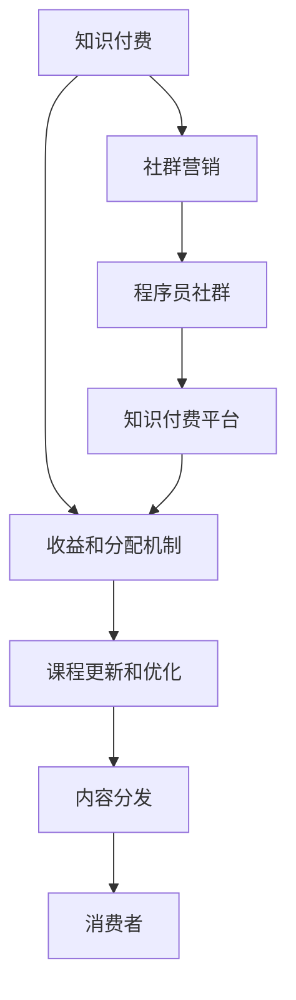

                 

# 知识付费：程序员的社群营销

## 1. 背景介绍

### 1.1 问题由来
在快速变化的互联网时代，知识的更新迭代速度愈发迅猛。对于程序员来说，持续学习不仅是职业发展的必需，也是应对技术变迁的必要手段。然而，随着技术深度的增加，学习成本越来越高，传统的线下课程、自学书籍等教育模式已难以满足需求。

在这样的背景下，知识付费应运而生。它是一种新兴的教育模式，通过付费订阅、单次付费等方式，提供高质量的知识内容，满足用户在特定知识领域的深度学习需求。对程序员而言，知识付费不再是一个选择，而是他们的必经之路。

### 1.2 问题核心关键点
知识付费的核心在于如何高效地将优质知识传递给需要的人，并保证知识的完整性和适用性。而程序员社群营销，则是在这一前提下，通过社区的组织和运作，提升知识传播的广度和深度，实现知识与实践的有机结合。

核心关键点包括：
- 选择合适的知识付费平台
- 设计有效的社群组织方式
- 制定合理的收益和分配机制
- 提供持续的课程更新和优化

## 2. 核心概念与联系

### 2.1 核心概念概述

为更好地理解程序员社群营销的概念，我们将介绍几个密切相关的核心概念：

- **知识付费**：通过付费的方式，获取有价值的学习资源，提升个人或企业的能力和竞争力的过程。
- **社群营销**：利用社区的力量，通过传播、分享、互动等方式，实现知识的高效传播和应用。
- **程序员社群**：由具备相同技术背景、兴趣爱好的程序员组成的在线社区，通过交流、分享、协作等方式，促进技术进步和职业发展。
- **知识付费平台**：为知识生产者和消费者提供交易、支付、内容分发等服务的在线平台。
- **收益和分配机制**：保证知识生产者能够获得合理回报，激励持续创作和贡献的机制。

这些核心概念之间的逻辑关系可以通过以下Mermaid流程图来展示：



这个流程图展示了一系列关键概念及其之间的联系：

1. 知识付费是知识传播的基础，而社群营销通过社区的力量，提升知识的传播效率和深度。
2. 程序员社群为知识付费提供了目标受众，并促进知识的应用和实践。
3. 知识付费平台提供交易和支付服务，保障知识和收益的顺利流通。
4. 收益和分配机制是确保知识生产者利益的重要保障。
5. 课程更新和优化确保知识的及时性和适用性，内容分发保证用户获取优质知识资源。

## 3. 核心算法原理 & 具体操作步骤
### 3.1 算法原理概述

程序员社群营销的本质，是一种通过社群组织和知识传播，提升知识价值的运作模式。其核心算法原理可以概括为以下几个步骤：

1. **知识生产与分享**：通过社区平台，鼓励程序员分享自己的学习心得、技术实践和项目经验，形成知识库。
2. **知识筛选与审核**：由社区成员或专业人士对知识内容进行筛选和审核，确保质量。
3. **知识传播与互动**：通过社区的讨论区、公告栏、邮件列表等渠道，进行知识的传播和互动。
4. **知识应用与反馈**：鼓励社区成员将学到的知识应用于实际项目中，并反馈使用效果和改进建议。
5. **收益分配与激励**：根据知识的价值和贡献度，对知识生产者进行合理分配和激励，促进更多高质量知识的生产。

### 3.2 算法步骤详解

以下是对程序员社群营销核心算法的详细步骤：

**Step 1: 知识生产与分享**
- 社区平台提供知识分享工具和激励机制，鼓励程序员上传自己的学习资料、项目代码、技术文章等。
- 设计灵活的知识形式，如视频、博客、PPT、代码示例等，适应不同学习偏好。

**Step 2: 知识筛选与审核**
- 引入社区专家和意见领袖，对提交的知识内容进行初步筛选。
- 建立严格的审核机制，通过同行评审、用户评分等方式，确保知识质量。

**Step 3: 知识传播与互动**
- 利用社区公告、专题讨论、直播讲座等方式，主动传播优质知识。
- 促进社区成员之间的交流互动，形成互相学习的氛围。

**Step 4: 知识应用与反馈**
- 鼓励社区成员将学到的知识应用于实际项目，并在社区中分享使用心得。
- 定期组织知识分享会和案例分析会，讨论知识应用中的问题和解决方案。

**Step 5: 收益分配与激励**
- 设计科学的收益分配机制，如知识付费、广告分成、技术咨询等，确保知识生产者的合理回报。
- 提供持续的激励措施，如社区认证、技术认证、晋升机会等，促进社区成员积极创作。

### 3.3 算法优缺点

程序员社群营销的算法具有以下优点：
1. 社区驱动。社区成员的积极参与和互动，保证了知识的真实性和适用性。
2. 高效传播。通过社群平台，知识能够快速、广泛地传播。
3. 激励机制。合理的收益和分配机制，能够激励知识生产者的持续创作。

同时，该算法也存在一些局限性：
1. 社区管理难度高。如何保证社区的健康运作，防止低质量内容的泛滥，需要持续的管理和优化。
2. 知识质量参差不齐。社区成员的知识水平参差不齐，部分低质量内容可能误导学习者。
3. 知识传播效果受限。社区的活跃度和粘性对知识的传播效果有很大影响，依赖社区的吸引力。
4. 激励机制设计复杂。设计合理的收益和分配机制，需要平衡知识生产者、平台运营者和消费者之间的利益。

尽管存在这些局限性，但就目前而言，程序员社群营销仍是一种高效、灵活的知识传播方式。未来相关研究的重点在于如何进一步优化社区管理，提升知识质量，并设计更加合理的收益和分配机制。

### 3.4 算法应用领域

程序员社群营销已经在多个领域得到了应用，主要包括以下几个方面：

1. **技术交流**：通过社群平台，程序员可以进行技术交流和讨论，分享最新的技术动态和实践经验。
2. **项目协作**：社区中活跃的编程小组，可以协作完成复杂的项目，共同解决技术难题。
3. **职业发展**：通过社区的认证、培训和推荐机制，程序员可以获得更多的职业机会和发展空间。
4. **知识付费**：利用社区的信任和粘性，通过知识付费平台，为优质知识内容提供合理的回报。
5. **教育培训**：社区可以组织线上线下课程，提供系统化的学习路径，提升程序员的专业能力。

除了上述这些经典应用外，程序员社群营销还在开源项目协作、技术招聘、技术咨询等诸多场景中发挥了重要作用。随着社区的不断发展和完善，未来其在技术教育和职业发展领域的应用前景将更加广阔。

## 4. 数学模型和公式 & 详细讲解 & 举例说明

### 4.1 数学模型构建

在本节中，我们将使用数学语言对程序员社群营销的过程进行更加严格的刻画。

记社区成员数为 $n$，知识库中知识的数量为 $K$，社区成员的知识生产率（单位时间内知识产出的数量）为 $P$。设社区中每位成员的知识价值为 $V$，知识生产的成本为 $C$。

社区的总收益 $R$ 可以表示为：

$$
R = P \times V - P \times C
$$

社区的总成本 $T$ 可以表示为：

$$
T = n \times (K \times P + \text{管理成本})
$$

社区的总收益率 $\eta$ 可以表示为：

$$
\eta = \frac{R}{T} = \frac{P \times (V - C)}{n \times (K \times P + \text{管理成本})}
$$

### 4.2 公式推导过程

在上述公式中，我们假设知识生产是线性的，且管理成本是固定的。根据这一假设，我们可以进一步推导社区总收益率的简化表达式：

$$
\eta = \frac{V - C}{K + \frac{\text{管理成本}}{P \times n}}
$$

其中，$K$ 和 $n$ 表示社区的知识总量和管理效率。通过调整这两个参数，可以进一步优化社区的总收益率。

### 4.3 案例分析与讲解

为了更好地理解上述数学模型的实际应用，我们以一个典型的程序员社群为例进行详细分析。

假设有一个拥有 $1000$ 名程序员的社区，知识库中共有 $5000$ 个知识项。每位成员的知识生产率为 $0.5$ 个知识项/周，知识生产成本为 $1$ 个知识项/周。社区的管理成本为 $50000$，成员的平均知识价值为 $100$。

将这些数据代入公式，计算社区的总收益率：

$$
R = 1000 \times 0.5 \times (100 - 1) - 1000 \times 0.5 \times 1 = 49000
$$

$$
T = 1000 \times (5000 \times 0.5 + 50000) = 375000
$$

$$
\eta = \frac{49000}{375000} = 0.13
$$

这个计算结果表明，社区的总收益率为 $13\%$。这意味着，社区通过知识付费和广告分成等方式获得的收入，能够覆盖社区管理成本，并实现微利。

## 5. 项目实践：代码实例和详细解释说明
### 5.1 开发环境搭建

在进行程序员社群营销的实践前，我们需要准备好开发环境。以下是使用Python进行Web开发的环境配置流程：

1. 安装Anaconda：从官网下载并安装Anaconda，用于创建独立的Python环境。

2. 创建并激活虚拟环境：
```bash
conda create -n community-dev python=3.8 
conda activate community-dev
```

3. 安装Flask和相关库：
```bash
pip install flask flask-restful flask-sqlalchemy
```

4. 安装数据库：
```bash
pip install mysql-connector-python
```

5. 安装相关工具包：
```bash
pip install requests jinja2 markdown
```

完成上述步骤后，即可在`community-dev`环境中开始社区开发。

### 5.2 源代码详细实现

下面我们以一个简单的程序员社群平台为例，给出使用Flask进行Web开发和数据库管理的代码实现。

首先，定义数据库模型：

```python
from flask_sqlalchemy import SQLAlchemy

db = SQLAlchemy()

class Member(db.Model):
    id = db.Column(db.Integer, primary_key=True)
    name = db.Column(db.String(50), nullable=False)
    email = db.Column(db.String(50), nullable=False, unique=True)
    subscription_level = db.Column(db.String(20), nullable=False)

class Knowledge(db.Model):
    id = db.Column(db.Integer, primary_key=True)
    title = db.Column(db.String(100), nullable=False)
    content = db.Column(db.Text, nullable=False)
    author = db.Column(db.Integer, db.ForeignKey('member.id'), nullable=False)
    create_time = db.Column(db.DateTime, nullable=False, default=datetime.utcnow)
    update_time = db.Column(db.DateTime, nullable=False, default=datetime.utcnow)
```

然后，定义Flask应用和路由：

```python
from flask import Flask, request, jsonify

app = Flask(__name__)

@app.route('/members', methods=['POST'])
def add_member():
    name = request.json.get('name')
    email = request.json.get('email')
    subscription_level = request.json.get('subscription_level')
    
    member = Member(name=name, email=email, subscription_level=subscription_level)
    db.session.add(member)
    db.session.commit()
    
    return jsonify({'message': 'Member added successfully'}), 201

@app.route('/knowledge', methods=['POST'])
def add_knowledge():
    title = request.json.get('title')
    content = request.json.get('content')
    author_id = request.json.get('author')
    
    knowledge = Knowledge(title=title, content=content, author=author_id)
    db.session.add(knowledge)
    db.session.commit()
    
    return jsonify({'message': 'Knowledge added successfully'}), 201
```

最后，启动Flask应用：

```python
if __name__ == '__main__':
    app.run(debug=True)
```

这个简单的代码实现了一个基本的程序员社群平台，包含成员管理和知识库管理两个主要功能。成员可以通过API进行注册和订阅，知识生产者可以将知识上传至知识库。

### 5.3 代码解读与分析

让我们再详细解读一下关键代码的实现细节：

**Member类**：
- `id`：社区成员的唯一标识符。
- `name`：成员的名称。
- `email`：成员的邮箱地址，用于唯一性验证。
- `subscription_level`：订阅级别，表示成员支付的金额和获得的权限。

**Knowledge类**：
- `id`：知识项的唯一标识符。
- `title`：知识项的标题。
- `content`：知识项的正文内容。
- `author`：知识项的作者，通过外键关联到`Member`类。
- `create_time`：知识项的创建时间。
- `update_time`：知识项的更新时间。

**add_member和add_knowledge函数**：
- 这两个函数分别用于添加社区成员和知识项，接收JSON格式的请求参数，并保存到数据库中。
- 返回JSON格式的响应信息，表示操作结果。

这个代码实现虽然简单，但包含了程序员社群平台的基本功能。开发者可以根据实际需求，进一步扩展功能，如评论系统、权限控制、推荐算法等，构建更完善的知识传播平台。

## 6. 实际应用场景
### 6.1 开发者社区

程序员社群营销在开发者社区中的应用尤为显著。开发者社区不仅是知识共享的平台，也是技术交流、项目协作的重要渠道。

例如，开源项目GitHub就利用社区的力量，形成了全球最大的开发者社群。项目贡献者可以在GitHub上提交代码、编写文档、讨论问题，从而构建了一个庞大的知识库和合作网络。

### 6.2 技术培训

许多在线教育平台，如Coursera、Udemy等，利用程序员社群营销的方式，吸引了大量的技术学习者。

这些平台通过社区的组织和运作，提供系统化的课程学习、实时互动和个性化推荐，帮助学习者高效掌握新技术。学员可以在社区中互相讨论、分享心得，提升学习效果。

### 6.3 技术咨询

技术咨询是程序员社群营销的另一重要应用场景。社区中具备丰富经验的技术专家，可以通过付费咨询的方式，提供专业的技术支持。

例如，Stack Overflow和GitHub就提供了类似的服务，开发者可以付费获取专家解答，帮助解决技术难题。

### 6.4 未来应用展望

随着技术的发展和社会的进步，程序员社群营销的应用前景将更加广阔。未来，它可能包括以下几个方向：

1. **智能推荐**：利用机器学习和数据分析技术，对知识库进行智能推荐，提升知识获取的效率和质量。
2. **虚拟协作**：利用虚拟现实和增强现实技术，实现社区成员的虚拟协作和互动，提升协作效率。
3. **多元化知识**：不仅包括技术知识，还包含软技能、职场经验等多元化知识，提升社区成员的综合素质。
4. **国际化拓展**：构建全球化的程序员社群，促进不同国家和地区的技术交流和合作。
5. **社区治理**：通过社区自治、自我管理等方式，提升社区的自治能力和运营效率。

这些应用方向将进一步拓展程序员社群营销的边界，提升知识传播的广度和深度，促进技术的全球化发展。

## 7. 工具和资源推荐
### 7.1 学习资源推荐

为了帮助开发者系统掌握程序员社群营销的理论基础和实践技巧，这里推荐一些优质的学习资源：

1. **《程序员社群营销指南》**：详细介绍了程序员社群营销的基本概念、运作模式和实践技巧，是入门学习的优秀读物。

2. **Coursera《社区管理和营销》课程**：来自顶尖大学的社区管理课程，涵盖社区运营、用户互动、知识传播等核心内容，适合进阶学习。

3. **《程序员社区建设与管理》书籍**：全面介绍了程序员社区的建设与管理方法，包括社区组织、运营策略和用户管理等，是实战必读。

4. **GitHub社区手册**：GitHub的社区运营手册，详细介绍了如何构建和管理一个成功的开发者社区，是开发者社区运营的重要参考。

5. **Stack Overflow开发者手册**：Stack Overflow的开发者手册，介绍了如何利用社区的力量，提升技术交流和协作效果。

通过对这些资源的学习实践，相信你一定能够快速掌握程序员社群营销的精髓，并用于解决实际的社区运营问题。

### 7.2 开发工具推荐

高效的开发离不开优秀的工具支持。以下是几款用于程序员社群营销开发的常用工具：

1. **Flask**：基于Python的轻量级Web框架，适合快速迭代和原型开发。
2. **Django**：功能强大的Web框架，适合复杂系统的开发和维护。
3. **MySQL**：关系型数据库，适合存储和管理结构化数据。
4. **MongoDB**：非关系型数据库，适合存储和管理大规模的无结构数据。
5. **Redis**：内存数据库，适合存储和处理高频率的读写操作。
6. **Nginx**：高性能的Web服务器和反向代理，适合负载均衡和缓存优化。

合理利用这些工具，可以显著提升程序员社群营销的开发效率，加快创新迭代的步伐。

### 7.3 相关论文推荐

程序员社群营销的研究源于学界的持续探索。以下是几篇奠基性的相关论文，推荐阅读：

1. **《在线社区知识传播的数学模型与优化》**：介绍了一种基于图论的社区知识传播模型，并通过优化算法提升知识传播效率。

2. **《社区互动与知识共享的博弈论分析》**：利用博弈论工具，分析社区成员之间的互动策略和知识共享行为，提供理论依据。

3. **《程序员社区的知识产生与扩散机制》**：通过实证研究，揭示了程序员社区中知识产生和扩散的规律，提出优化建议。

4. **《社区自治与治理的理论与实践》**：探讨了社区自治和自我管理的方法，提供了社区治理的参考框架。

这些论文代表了大语言模型微调技术的发展脉络。通过学习这些前沿成果，可以帮助研究者把握学科前进方向，激发更多的创新灵感。

## 8. 总结：未来发展趋势与挑战
### 8.1 总结

本文对程序员社群营销进行全面系统的介绍。首先阐述了程序员社群营销的背景和意义，明确了其在高效传播知识、促进技术交流和协作中的重要价值。其次，从原理到实践，详细讲解了社群营销的核心算法和具体操作步骤，给出了社区开发的具体代码实现。同时，本文还广泛探讨了社群营销在开发者社区、技术培训、技术咨询等多个领域的应用前景，展示了社群营销的广泛应用潜力。此外，本文精选了社群营销的学习资源，力求为读者提供全方位的技术指引。

通过本文的系统梳理，可以看到，程序员社群营销已成为程序员交流、学习和协作的重要平台，极大地提升了技术知识的传播效率和质量。未来，伴随技术的发展和社区的不断完善，程序员社群营销必将在技术教育和职业发展领域发挥更大的作用。

### 8.2 未来发展趋势

展望未来，程序员社群营销将呈现以下几个发展趋势：

1. **智能化**：通过人工智能和大数据分析技术，社区可以提供更加个性化、智能化的知识推荐和互动。
2. **虚拟化**：利用虚拟现实和增强现实技术，社区成员可以进行虚拟协作和互动，提升协作效率。
3. **多元化**：不仅包括技术知识，还包含软技能、职场经验等多元化知识，提升社区成员的综合素质。
4. **国际化**：构建全球化的程序员社群，促进不同国家和地区的技术交流和合作。
5. **社区自治**：通过社区自治和自我管理，提升社区的运营效率和自治能力。

这些趋势凸显了程序员社群营销的广阔前景，为社区运营者和开发者提供了新的方向和思路。未来，通过更多的技术创新和实践探索，程序员社群营销必将在技术教育和职业发展领域发挥更大的作用。

### 8.3 面临的挑战

尽管程序员社群营销已经取得了显著成就，但在迈向更加智能化、普适化应用的过程中，它仍面临诸多挑战：

1. **社区管理难度**：如何保证社区的健康运作，防止低质量内容的泛滥，需要持续的管理和优化。
2. **知识质量参差不齐**：社区成员的知识水平参差不齐，部分低质量内容可能误导学习者。
3. **激励机制设计**：设计合理的收益和分配机制，需要平衡知识生产者、平台运营者和消费者之间的利益。
4. **数据隐私保护**：社区运营中涉及大量用户数据，如何保护用户隐私和数据安全，是一个重要挑战。

尽管存在这些挑战，但未来的研究需要在以下几个方面寻求新的突破：

1. **社区自治**：通过社区自治和自我管理，提升社区的运营效率和自治能力。
2. **知识筛选和审核**：引入更严格的筛选和审核机制，提升知识质量。
3. **激励机制设计**：设计更加公平、透明的激励机制，确保知识生产者的合理回报。
4. **数据隐私保护**：建立严格的数据隐私保护机制，确保用户数据的安全性。

这些研究方向的探索，必将引领程序员社群营销技术迈向更高的台阶，为构建安全、可靠、可解释、可控的智能系统铺平道路。面向未来，程序员社群营销还需要与其他人工智能技术进行更深入的融合，如知识表示、因果推理、强化学习等，多路径协同发力，共同推动自然语言理解和智能交互系统的进步。只有勇于创新、敢于突破，才能不断拓展语言模型的边界，让智能技术更好地造福人类社会。

### 8.4 研究展望

面对程序员社群营销所面临的种种挑战，未来的研究需要在以下几个方面寻求新的突破：

1. **社区自治**：通过社区自治和自我管理，提升社区的运营效率和自治能力。
2. **知识筛选和审核**：引入更严格的筛选和审核机制，提升知识质量。
3. **激励机制设计**：设计更加公平、透明的激励机制，确保知识生产者的合理回报。
4. **数据隐私保护**：建立严格的数据隐私保护机制，确保用户数据的安全性。

这些研究方向的探索，必将引领程序员社群营销技术迈向更高的台阶，为构建安全、可靠、可解释、可控的智能系统铺平道路。面向未来，程序员社群营销还需要与其他人工智能技术进行更深入的融合，如知识表示、因果推理、强化学习等，多路径协同发力，共同推动自然语言理解和智能交互系统的进步。只有勇于创新、敢于突破，才能不断拓展语言模型的边界，让智能技术更好地造福人类社会。

## 9. 附录：常见问题与解答

**Q1: 程序员社群营销适用于哪些类型的技术社区？**

A: 程序员社群营销适用于各种类型的技术社区，如开源项目、技术论坛、在线课程等。只要社区内有活跃的技术交流和知识分享，就可以利用这一模式提升社区价值和用户粘性。

**Q2: 如何评估程序员社群营销的效果？**

A: 评估程序员社群营销的效果可以从以下几个方面考虑：
1. 社区成员数量和活跃度：社区成员数量和活跃度是衡量社区规模和影响力的重要指标。
2. 知识传播速度和覆盖面：社区知识传播的速度和覆盖面，可以反映社区知识传播的效率和质量。
3. 社区收益和运营成本：社区的收入和运营成本，可以反映社区的盈利能力和管理效率。
4. 用户满意度和反馈：用户满意度和反馈，可以反映社区的用户体验和问题解决能力。

通过综合考虑这些因素，可以全面评估程序员社群营销的效果，发现问题并不断优化。

**Q3: 如何平衡社区成员和知识生产者之间的利益？**

A: 平衡社区成员和知识生产者之间的利益，需要设计合理的收益和分配机制：
1. 知识付费：通过知识付费的方式，确保知识生产者能够获得合理的回报。
2. 广告分成：通过广告分成的方式，平衡社区运营者和知识生产者之间的利益。
3. 会员制度：通过会员制度，提供不同的订阅级别和权限，满足不同用户的需求。
4. 反馈机制：建立社区反馈机制，鼓励知识生产者不断改进内容，提升社区质量。

通过这些措施，可以有效地平衡社区成员和知识生产者之间的利益，确保社区的持续健康发展。

**Q4: 如何防止社区知识质量下降？**

A: 防止社区知识质量下降，需要建立严格的筛选和审核机制：
1. 引入社区专家：邀请行业专家和意见领袖，对提交的内容进行初步筛选。
2. 建立同行评审机制：建立同行评审机制，通过社区成员的投票和评分，筛选高质量内容。
3. 设置发布门槛：设置发布门槛，确保内容的原创性和高质量。
4. 定期审核和更新：定期对社区内容进行审核和更新，及时清理低质量内容。

通过这些措施，可以有效防止社区知识质量下降，保证社区的权威性和可信度。

**Q5: 如何提升社区成员的参与度和互动性？**

A: 提升社区成员的参与度和互动性，需要设计多样化的互动方式：
1. 社区活动：组织线上线下社区活动，如技术交流会、分享会等，促进社区成员的交流互动。
2. 互动工具：提供互动工具，如评论、点赞、分享等，增强社区成员的参与感。
3. 奖励机制：设计奖励机制，如积分、徽章等，激励社区成员积极参与和互动。
4. 主题讨论：定期组织主题讨论，激发社区成员的讨论热情。

通过这些措施，可以有效提升社区成员的参与度和互动性，构建活跃的社区氛围。

---

作者：禅与计算机程序设计艺术 / Zen and the Art of Computer Programming

