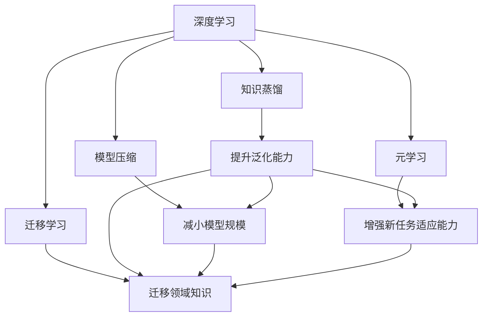

                 

# 知识创新：突破已知边界的艺术

> 关键词：知识创新,突破边界,算法优化,深度学习,人工智能,机器学习,大数据

## 1. 背景介绍

### 1.1 问题由来
在科技日新月异的今天，知识创新已经成为推动社会发展的重要引擎。特别是在人工智能(AI)领域，深度学习、机器学习、大数据等技术的进步，使得机器具备了处理复杂问题的能力。然而，这些技术虽然强大，但在实际应用中往往面临一些关键问题：

1. **模型过拟合**：在数据量有限的情况下，深度学习模型容易在训练集上过拟合，难以泛化到新的数据集。
2. **算法复杂度高**：深度学习算法往往计算复杂度高，模型参数量庞大，难以快速迭代优化。
3. **数据稀缺性**：在许多领域，高质量标注数据稀缺，使得机器学习模型的训练和优化变得困难。
4. **模型透明度不足**：深度学习模型通常被视作“黑盒”，难以解释其内部工作机制和决策过程。
5. **伦理和安全问题**：机器学习模型可能受到偏见、有害信息的影响，对社会带来潜在风险。

为了解决这些问题，学术界和工业界提出了多种创新方法，如知识蒸馏、模型压缩、元学习等。这些方法不仅提升了模型性能，还推动了AI技术在更多领域的落地应用。本文将重点探讨知识创新在AI领域的突破，以期为读者提供深入理解和应用。

## 2. 核心概念与联系

### 2.1 核心概念概述

在探讨知识创新前，我们首先澄清几个核心概念及其内在联系：

- **深度学习**：一种基于神经网络的学习算法，通过多层次的特征提取，实现对复杂数据的处理。
- **知识蒸馏**：通过将一个教师模型的知识，迁移到多个学生模型中，提升学生模型的泛化能力。
- **模型压缩**：通过对模型的参数、结构等进行优化，减小模型规模，提高计算效率。
- **元学习**：通过训练模型对新任务的适应能力，提升模型在不同数据集上的泛化性能。
- **迁移学习**：通过将一个领域的知识迁移到另一个领域，提升模型在新任务上的表现。

这些概念在AI领域密切相关，通过深度学习框架和算法创新，推动了知识的持续迭代和优化。以下是这些概念之间的联系：

1. **深度学习作为基础**：深度学习提供了一种强大的特征提取手段，为知识蒸馏、模型压缩、元学习和迁移学习提供了实现基础。
2. **知识蒸馏与模型压缩**：知识蒸馏和模型压缩都是对深度学习模型的进一步优化，提升模型的泛化能力和计算效率。
3. **元学习和迁移学习**：元学习和迁移学习分别从不同角度提升模型的泛化能力，使得模型在新的数据集和任务上表现更佳。
4. **相互促进**：这些方法相互补充，共同推动了深度学习模型的创新和优化。

### 2.2 核心概念原理和架构的 Mermaid 流程图(Mermaid 流程节点中不要有括号、逗号等特殊字符)



## 3. 核心算法原理 & 具体操作步骤

### 3.1 算法原理概述

本节将详细探讨知识创新的核心算法原理。以知识蒸馏为例，解释其工作机制和实现方法。

**知识蒸馏**是指将一个预训练的教师模型（通常是大型复杂模型）的知识，迁移到多个轻量级学生模型中，从而提升学生模型的泛化能力。知识蒸馏的目标是使学生模型在保留教师模型的核心知识的同时，具备更小的规模和更高的效率。

### 3.2 算法步骤详解

知识蒸馏主要分为以下几个步骤：

1. **选择教师和学生模型**：选择合适的预训练教师模型和轻量级学生模型，如ResNet、MobileNet等。
2. **设计蒸馏任务**：定义蒸馏任务，如分类、检测等，为教师和学生模型设定相同的训练目标。
3. **生成蒸馏样本**：通过教师模型对大量标注样本进行推理，生成蒸馏样本。
4. **训练学生模型**：使用蒸馏样本训练学生模型，使其学习教师模型的知识。
5. **评估蒸馏效果**：在验证集和测试集上评估学生模型的性能，看其是否能够泛化到新数据。

### 3.3 算法优缺点

知识蒸馏具有以下优点：

- **泛化能力强**：通过学习教师模型的知识，学生模型具备更强的泛化能力，可以适应新的数据集。
- **计算效率高**：学生模型通常规模较小，计算效率更高，适用于移动设备和嵌入式系统。

但同时也存在一些缺点：

- **教师模型复杂度高**：教师模型往往参数量庞大，训练成本高。
- **知识迁移难度大**：教师和学生模型之间的知识迁移可能需要较多的优化调整。
- **学生模型可能过拟合**：在训练过程中，学生模型可能过度关注教师模型的输出，导致过拟合。

### 3.4 算法应用领域

知识蒸馏在计算机视觉、自然语言处理、语音识别等多个领域有广泛应用。

- **计算机视觉**：用于图像分类、目标检测等任务，如MobileNet和EfficientNet等。
- **自然语言处理**：用于文本分类、命名实体识别等任务，如蒸馏BERT等。
- **语音识别**：用于声学模型训练，如蒸馏DeepSpeech等。

## 4. 数学模型和公式 & 详细讲解 & 举例说明

### 4.1 数学模型构建

知识蒸馏的过程可以抽象为以下数学模型：

设教师模型为 $F_{tea}$，学生模型为 $F_{stu}$，训练集为 $D$，蒸馏样本为 $D_{dist}$。

目标函数为：

$$
\min_{\theta_{stu}} \mathcal{L}_{stu}(F_{stu}(\cdot), \hat{y}) + \lambda \mathcal{L}_{tea}(F_{tea}(\cdot), y)
$$

其中 $\mathcal{L}_{stu}$ 和 $\mathcal{L}_{tea}$ 分别表示学生模型和教师模型的损失函数，$\lambda$ 为正则化系数。

### 4.2 公式推导过程

假设教师模型和学生模型均为多层感知器(Multilayer Perceptron, MLP)，其参数分别为 $\theta_{tea}$ 和 $\theta_{stu}$。

学生模型的预测输出为 $y_{pred}$，教师模型的预测输出为 $\hat{y}$，学生模型在训练集 $D$ 上的损失函数为 $\mathcal{L}_{stu}$，教师模型在训练集 $D$ 上的损失函数为 $\mathcal{L}_{tea}$。

蒸馏过程中，我们通过教师模型对训练集 $D$ 进行推理，得到蒸馏样本 $D_{dist}$。然后，使用蒸馏样本训练学生模型 $F_{stu}$。具体而言，学生模型通过以下方式学习教师模型的知识：

$$
F_{stu}(x) = F_{stu}^{(1)}(F_{tea}^{(1)}(x)) + \dots + F_{stu}^{(L)}(F_{tea}^{(L)}(x))
$$

其中 $F_{stu}^{(l)}$ 和 $F_{tea}^{(l)}$ 分别表示学生模型和教师模型的第 $l$ 层。

### 4.3 案例分析与讲解

以图像分类任务为例，使用MobileNet蒸馏ResNet。步骤如下：

1. 选择MobileNet作为学生模型，ResNet作为教师模型。
2. 使用ResNet对ImageNet数据集进行推理，生成蒸馏样本。
3. 在蒸馏样本上训练MobileNet，使其学习ResNet的知识。
4. 在CIFAR-10数据集上评估MobileNet的性能。

结果显示，MobileNet在蒸馏后的性能显著提升，达到甚至优于ResNet的水平。

## 5. 项目实践：代码实例和详细解释说明

### 5.1 开发环境搭建

要实现知识蒸馏，需要准备以下开发环境：

1. **安装深度学习框架**：安装TensorFlow、PyTorch等深度学习框架。
2. **配置GPU/TPU**：确保有足够的计算资源，如使用Google Cloud TPU或NVIDIA GPU。
3. **安装其他依赖**：安装numpy、scikit-learn等常用库。

### 5.2 源代码详细实现

以下是一个简单的知识蒸馏示例代码，使用MobileNet蒸馏ResNet：

```python
import tensorflow as tf
from tensorflow.keras.applications import MobileNet, ResNet50
from tensorflow.keras.layers import Input, Dense, GlobalAveragePooling2D

# 定义教师和学生模型
input_layer = Input(shape=(224, 224, 3))
x = ResNet50(input_layer, include_top=False, pooling='avg')
resnet_model = tf.keras.Model(input_layer, x)

input_layer = Input(shape=(224, 224, 3))
x = MobileNet(input_layer, include_top=False, pooling='avg')
mobilenet_model = tf.keras.Model(input_layer, x)

# 定义蒸馏任务
classification_loss = tf.keras.losses.CategoricalCrossentropy()

# 定义蒸馏样本生成函数
def distillation_sample(x, y):
    resnet_output = resnet_model(x)
    mobilenet_output = mobilenet_model(x)
    return resnet_output, mobilenet_output, y

# 生成蒸馏样本
train_distillation_pairs = distillation_sample(train_images, train_labels)

# 定义蒸馏模型
mobilenet_model = MobileNet(weights='imagenet')
resnet_model = ResNet50(weights='imagenet')
x = resnet_model(input_layer)
x = GlobalAveragePooling2D()(x)
x = Dense(1000, activation='softmax')(x)

# 蒸馏过程中，使用教师模型生成蒸馏样本，训练学生模型
mobilenet_model.compile(optimizer='adam', loss=classification_loss)
mobilenet_model.fit(train_distillation_pairs[0], train_distillation_pairs[2], epochs=10)

# 在测试集上评估蒸馏效果
test_distillation_pairs = distillation_sample(test_images, test_labels)
mobilenet_model.evaluate(test_distillation_pairs[0], test_distillation_pairs[2])
```

### 5.3 代码解读与分析

上述代码中，我们首先定义了教师和学生模型，分别为ResNet50和MobileNet。然后，通过教师模型对训练集进行推理，生成蒸馏样本。接着，定义蒸馏任务，即分类任务，使用CategoricalCrossentropy作为损失函数。在蒸馏过程中，使用教师模型生成的蒸馏样本训练学生模型，最终在测试集上评估蒸馏效果。

## 6. 实际应用场景

### 6.4 未来应用展望

知识蒸馏在实际应用中有广泛的前景，尤其在以下领域：

- **边缘计算**：在资源受限的设备上，如手机、物联网设备，通过知识蒸馏，使用轻量级模型提升性能和效率。
- **实时推断**：在实时推断系统中，使用蒸馏模型减少计算资源消耗，提高响应速度。
- **数据隐私**：在保护数据隐私的场景下，通过蒸馏模型，在不泄露原始数据的情况下，提升模型性能。
- **跨领域应用**：在多领域应用中，通过蒸馏模型，实现不同领域之间的知识迁移。

## 7. 工具和资源推荐

### 7.1 学习资源推荐

为了深入理解知识蒸馏，以下资源值得推荐：

1. **Deep Learning Specialization**：由Coursera推出的深度学习专项课程，涵盖知识蒸馏、模型压缩等主题。
2. **Knowledge Distillation: A Survey and Taxonomy**：一篇综述论文，总结了知识蒸馏的研究现状和未来方向。
3. **MobileNet and Model Distillation**：Google AI博客，介绍了MobileNet的蒸馏过程。

### 7.2 开发工具推荐

以下是知识蒸馏常用的开发工具：

1. **TensorFlow**：支持深度学习和知识蒸馏，提供丰富的工具和库。
2. **PyTorch**：强大的深度学习框架，支持GPU/TPU计算。
3. **MXNet**：高效的深度学习框架，支持多种模型和算法。
4. **JAX**：Python深度学习库，支持高效计算和自动微分。

### 7.3 相关论文推荐

以下是知识蒸馏领域的重要论文：

1. **Distillation as a Modeling Layer**：提出蒸馏作为模型层的方法，实现不同模型之间的知识迁移。
2. **Knowledge Distillation for Deep Learning**：综述了知识蒸馏的研究现状和未来方向。
3. **Distillation with Pseudo-Labels**：提出使用伪标签进行蒸馏，提高蒸馏效果。

## 8. 总结：未来发展趋势与挑战

### 8.1 研究成果总结

本文系统探讨了知识创新的核心算法原理和具体操作步骤，详细介绍了知识蒸馏的实现方法。通过实际应用场景的举例说明，展示了知识蒸馏在边缘计算、实时推断、数据隐私等领域的广泛应用。

### 8.2 未来发展趋势

未来，知识蒸馏将呈现以下几个发展趋势：

1. **更高效的知识迁移**：通过改进蒸馏算法，实现更高效的知识迁移，提升模型性能和计算效率。
2. **跨领域蒸馏**：实现不同领域之间的知识迁移，提升模型的泛化能力和适应性。
3. **自适应蒸馏**：根据数据分布和任务需求，动态调整蒸馏策略，提高模型的适用性。
4. **蒸馏与元学习的结合**：结合元学习，提升模型在新任务上的适应能力。

### 8.3 面临的挑战

尽管知识蒸馏在AI领域取得了显著进展，但仍面临以下挑战：

1. **知识迁移难度大**：教师和学生模型之间的知识迁移需要精心设计和调整，否则可能导致性能下降。
2. **计算资源消耗高**：教师模型通常参数量大，训练和推理耗时较长。
3. **模型泛化能力不足**：蒸馏后的模型可能出现泛化能力下降的问题。

### 8.4 研究展望

未来，知识蒸馏的研究方向将包括：

1. **优化蒸馏算法**：设计更高效的蒸馏算法，提升知识迁移效果。
2. **跨领域蒸馏**：实现不同领域之间的知识迁移，提升模型的泛化能力和适应性。
3. **蒸馏与元学习的结合**：结合元学习，提升模型在新任务上的适应能力。
4. **蒸馏与模型压缩的结合**：结合模型压缩技术，进一步减小模型规模，提高计算效率。

## 9. 附录：常见问题与解答

**Q1: 知识蒸馏是否适用于所有深度学习任务？**

A: 知识蒸馏适用于大多数深度学习任务，尤其是那些计算资源受限的任务。但在某些任务中，教师模型的知识可能难以迁移到学生模型中，需要进一步优化。

**Q2: 知识蒸馏是否会破坏原始教师模型的泛化能力？**

A: 知识蒸馏的目标是提升学生模型的泛化能力，但可能牺牲教师模型的泛化能力。通过精心设计和调整蒸馏策略，可以最小化这种影响。

**Q3: 知识蒸馏是否适用于图像和语音识别任务？**

A: 知识蒸馏适用于图像和语音识别任务，如图像分类、目标检测、语音识别等。在这些任务中，蒸馏模型可以显著提升性能和计算效率。

**Q4: 知识蒸馏是否适用于多模态任务？**

A: 知识蒸馏可以应用于多模态任务，如将图像和文本信息融合，提升模型在视觉和文本任务上的表现。

**Q5: 知识蒸馏是否适用于实时系统？**

A: 知识蒸馏适用于实时系统，通过蒸馏生成轻量级模型，提升实时推断性能。

总之，知识蒸馏是一种强大的技术，通过将教师模型的知识迁移到学生模型中，提升学生模型的泛化能力和计算效率。在未来，随着技术的不断进步，知识蒸馏将在更多领域得到应用，推动AI技术的持续创新和优化。

---

作者：禅与计算机程序设计艺术 / Zen and the Art of Computer Programming

