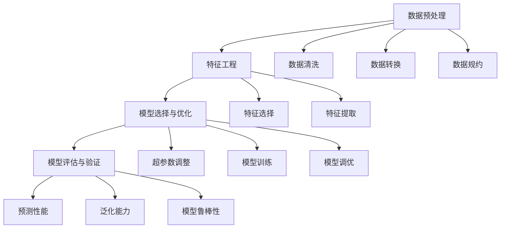

                 

## 1. 背景介绍

### 1.1 问题由来

在信息时代，知识增长迅猛，但人类处理海量信息的能力相对有限。如何将无序的原始数据转换为结构化、可操作的知识，一直是计算机科学的重大挑战之一。随着大数据、人工智能等技术的不断发展，知识发现（Knowledge Discovery, KD）成为一个广受关注的研究方向，旨在自动发现数据中蕴含的有价值的信息和知识。

知识发现可以应用于多个领域，包括商业智能、生物信息学、医疗健康、金融分析、社会科学等。通过自动化知识发现，企业、科学家和决策者可以更快速、更全面地理解和利用知识，提升决策质量和效率，推动创新发展。然而，知识发现并非易事，涉及数据预处理、算法选择、模型评估等多个复杂环节，需要高度专业化的人才和工具支持。

### 1.2 问题核心关键点

知识发现的核心在于如何从原始数据中提取有价值的知识。目前，主流的知识发现范式包括统计分析、机器学习和数据挖掘等。不同方法侧重点各异，各有优缺点，需要根据具体应用场景选择合适的技术路线。

- **统计分析**：基于经典统计方法，如回归、方差分析等，适用于数据分布已知的场景，但无法处理复杂的非线性关系。
- **机器学习**：通过构建模型对数据进行训练预测，适用于高维数据和复杂关系，但需要大量标注数据，模型解释性较差。
- **数据挖掘**：强调在数据中寻找模式和关联，适用于处理大规模无结构数据，但可能陷入局部最优。

这些方法共同构成了知识发现的理论基础，但实际应用中仍需面对诸多挑战。如何设计有效的算法模型，选择合适的特征工程策略，进行模型调优和评估，是知识发现的关键问题。

## 2. 核心概念与联系

### 2.1 核心概念概述

为深入理解知识发现技术，本文将介绍几个核心概念及其联系：

- **知识发现（Knowledge Discovery, KD）**：从原始数据中自动提取、提炼和总结知识的过程。
- **数据预处理（Data Preprocessing）**：对原始数据进行清洗、转换和规约，为知识发现提供准备。
- **特征工程（Feature Engineering）**：设计合适的特征提取策略，提高模型的表达能力。
- **模型选择与优化（Model Selection & Optimization）**：选择适合的算法模型，并对其进行参数调优。
- **模型评估与验证（Model Evaluation & Validation）**：评估模型的预测能力和泛化能力，确保其在实际应用中的可靠性。

这些概念之间存在紧密联系，共同构建了知识发现的工作流程。数据预处理是基础，特征工程是核心，模型选择与优化是关键，模型评估与验证是保障。只有每个环节都设计得当，才能最终发现高质量的知识。

### 2.2 核心概念原理和架构的 Mermaid 流程图



这个流程图展示了知识发现的主要流程和各个环节的关键操作：

1. **数据预处理**：从数据源获取原始数据，并进行清洗、转换和规约，为后续步骤提供准备。
2. **特征工程**：对处理后的数据进行特征选择和提取，设计合适的特征向量，提高模型表达能力。
3. **模型选择与优化**：选择合适的算法模型，并对其进行参数调整和优化，提升模型性能。
4. **模型评估与验证**：通过预测性能、泛化能力和鲁棒性评估模型效果，确保其在实际应用中的可靠性。

这些步骤相互依赖，构成了知识发现的主流程，需要细致设计和精心实施。

## 3. 核心算法原理 & 具体操作步骤

### 3.1 算法原理概述

知识发现算法通常基于统计方法、机器学习或数据挖掘技术，旨在从数据中提取有用的信息。本节将介绍几种常用的知识发现算法，并阐述其核心原理。

- **回归分析（Regression Analysis）**：通过建立一个连续函数来预测因变量，适用于连续型数据。
- **分类算法（Classification Algorithms）**：将数据分为多个类别，适用于分类型数据。常见的分类算法包括决策树、支持向量机、神经网络等。
- **聚类算法（Clustering Algorithms）**：将数据划分为多个组，使组内相似度最大化，组间相似度最小化，适用于无监督学习。常见的聚类算法有K-means、层次聚类等。
- **关联规则学习（Association Rule Learning）**：发现变量之间的关联关系，适用于市场篮分析、购物篮分析等场景。

这些算法在知识发现中各有侧重，需要根据具体问题选择合适的算法路线。

### 3.2 算法步骤详解

知识发现的算法步骤主要包括数据预处理、特征工程、模型选择与优化、模型评估与验证等环节。以下是这些步骤的详细说明：

#### 3.2.1 数据预处理

数据预处理是知识发现的基础环节，主要包括以下步骤：

- **数据清洗**：去除噪声、缺失值和异常值，提高数据质量。
- **数据转换**：将数据转换为适合分析的格式，如归一化、标准化、编码等。
- **数据规约**：减少数据维度，降低计算复杂度，如降维、特征选择等。

#### 3.2.2 特征工程

特征工程是知识发现的核心环节，直接影响模型的预测能力。主要步骤如下：

- **特征选择**：选择最相关的特征，减少噪声和冗余。
- **特征提取**：通过算法或手工设计提取新的特征，提高表达能力。
- **特征转换**：对原始特征进行转换，增强模型的可解释性。

#### 3.2.3 模型选择与优化

模型选择与优化是知识发现的关键环节，主要步骤如下：

- **模型选择**：根据数据特征和问题类型，选择适合的算法模型。
- **模型训练**：使用训练数据对模型进行训练，得到初步预测结果。
- **模型调优**：调整模型参数，提升模型性能。

#### 3.2.4 模型评估与验证

模型评估与验证是知识发现的重要环节，主要步骤如下：

- **预测性能评估**：使用测试数据评估模型的预测准确度。
- **泛化能力评估**：评估模型在新数据上的表现，避免过拟合。
- **模型鲁棒性评估**：评估模型对噪声、缺失值等干扰的鲁棒性。

### 3.3 算法优缺点

知识发现算法具有以下优点：

- **自动化**：自动化地发现数据中的规律和模式，减少人工干预。
- **高效性**：在处理大规模数据时，能够快速发现有价值的信息。
- **可解释性**：通过模型解释，理解数据中蕴含的知识。

但同时，知识发现算法也存在以下缺点：

- **数据依赖**：需要大量标注数据，数据质量对结果影响较大。
- **模型复杂**：模型选择和调优过程复杂，需要专业知识和经验。
- **结果解释**：部分算法结果难以解释，缺乏透明度。

### 3.4 算法应用领域

知识发现算法在多个领域中得到了广泛应用，包括：

- **商业智能（Business Intelligence, BI）**：分析市场数据，优化业务决策。
- **生物信息学（Bioinformatics）**：分析基因组数据，发现疾病机制和潜在药物。
- **金融分析（Financial Analysis）**：预测股票价格，评估投资风险。
- **社交网络分析（Social Network Analysis）**：分析人际关系，挖掘社交网络结构。
- **电子商务（E-commerce）**：推荐系统、广告投放等。

这些应用领域展示了知识发现技术的巨大潜力，为各行各业提供了有力支持。

## 4. 数学模型和公式 & 详细讲解 & 举例说明

### 4.1 数学模型构建

本节将使用数学语言对知识发现的核心算法进行更严格的刻画。

假设数据集为 $D=\{(x_i, y_i)\}_{i=1}^N$，其中 $x_i$ 为输入变量，$y_i$ 为输出变量。知识发现的目标是找到一个函数 $f(x)$，使得 $f(x)$ 的预测值与真实值 $y_i$ 尽可能接近。常见的知识发现模型包括线性回归模型、决策树模型、神经网络模型等。

以线性回归模型为例，假设模型形式为 $f(x) = \beta_0 + \beta_1 x_1 + \beta_2 x_2 + ... + \beta_p x_p$，其中 $\beta$ 为模型参数。通过最小化均方误差（Mean Squared Error, MSE）损失函数，求解 $\beta$：

$$
\min_{\beta} \frac{1}{N}\sum_{i=1}^N (y_i - f(x_i))^2
$$

具体求解过程涉及优化算法、矩阵运算等，这里不再赘述。

### 4.2 公式推导过程

以线性回归模型为例，推导其预测函数和损失函数。

假设输入数据为 $x \in \mathbb{R}^p$，模型参数为 $\beta \in \mathbb{R}^{p+1}$。模型的预测值为 $f(x) = \beta_0 + \beta_1 x_1 + \beta_2 x_2 + ... + \beta_p x_p$。

模型参数 $\beta$ 的最小二乘估计可以通过求解损失函数得到：

$$
\min_{\beta} \frac{1}{N}\sum_{i=1}^N (y_i - f(x_i))^2
$$

对上述损失函数求偏导数，得到：

$$
\frac{\partial}{\partial \beta} \frac{1}{N}\sum_{i=1}^N (y_i - f(x_i))^2 = -2\frac{1}{N}X^T(y - f(X))^T
$$

其中 $X$ 为输入数据矩阵，$y$ 为真实值向量，$f(X)$ 为模型预测值向量。

求解上述方程，得到：

$$
\beta = (X^T X)^{-1}X^T y
$$

将 $\beta$ 代入预测函数 $f(x)$，得到：

$$
f(x) = \beta_0 + \beta_1 x_1 + \beta_2 x_2 + ... + \beta_p x_p
$$

通过上述推导，可以看到线性回归模型是一个线性关系模型，可以通过最小化均方误差损失函数求解参数 $\beta$，从而实现对输入数据的预测。

### 4.3 案例分析与讲解

以房价预测为例，分析线性回归模型的应用。

假设有一组历史房价数据，包含多个影响因素，如地理位置、房屋面积、建筑年份等。通过线性回归模型，可以建立房价与影响因素之间的线性关系，预测新房源的房价。

1. **数据预处理**：收集原始房价数据，进行清洗、转换和规约，去除异常值和缺失值。
2. **特征工程**：选择影响房价的关键因素，如地理位置、房屋面积、建筑年份等，设计合适的特征向量。
3. **模型选择与优化**：选择线性回归模型，使用训练数据对其进行训练和调优。
4. **模型评估与验证**：使用测试数据评估模型的预测性能，确保其在新数据上的泛化能力。

通过上述步骤，可以构建一个房价预测模型，实现自动化地发现房价与影响因素之间的关系，从而为房地产投资提供参考。

## 5. 项目实践：代码实例和详细解释说明

### 5.1 开发环境搭建

在进行知识发现项目实践前，需要准备好开发环境。以下是使用Python进行Scikit-learn开发的简单配置流程：

1. 安装Anaconda：从官网下载并安装Anaconda，用于创建独立的Python环境。
2. 创建并激活虚拟环境：
```bash
conda create -n sklearn-env python=3.8 
conda activate sklearn-env
```
3. 安装Scikit-learn：使用pip安装Scikit-learn，并确保其与Numpy、Matplotlib等库兼容。
```bash
pip install scikit-learn
```

完成上述步骤后，即可在`sklearn-env`环境中开始知识发现项目实践。

### 5.2 源代码详细实现

下面以线性回归模型为例，给出使用Scikit-learn进行房价预测的Python代码实现。

```python
from sklearn.linear_model import LinearRegression
from sklearn.model_selection import train_test_split
from sklearn.metrics import mean_squared_error
import numpy as np
import pandas as pd
import matplotlib.pyplot as plt

# 数据加载
data = pd.read_csv('house_prices.csv')

# 数据预处理
X = data[['location', 'size', 'age']]
y = data['price']

# 数据分割
X_train, X_test, y_train, y_test = train_test_split(X, y, test_size=0.2, random_state=42)

# 模型训练
model = LinearRegression()
model.fit(X_train, y_train)

# 模型评估
y_pred = model.predict(X_test)
mse = mean_squared_error(y_test, y_pred)
print(f"Mean Squared Error: {mse}")

# 可视化
plt.scatter(X_test['location'], y_test)
plt.plot(X_test['location'], y_pred, color='red')
plt.xlabel('Location')
plt.ylabel('Price')
plt.show()
```

### 5.3 代码解读与分析

让我们再详细解读一下关键代码的实现细节：

**数据加载**：使用Pandas加载CSV格式的数据文件，包含房价、地理位置、房屋面积、建筑年份等字段。

**数据预处理**：选择对房价有影响的特征，如地理位置、房屋面积、建筑年份等，设计合适的特征向量。

**模型训练**：使用Scikit-learn的LinearRegression模型，对训练数据进行拟合，得到线性回归模型。

**模型评估**：使用测试数据对模型进行预测，计算均方误差（MSE），评估模型预测性能。

**可视化**：使用Matplotlib绘制模型预测结果，直观展示模型的预测能力。

通过上述代码实现，可以看到Scikit-learn的简单易用，开发者可以高效地构建、训练和评估知识发现模型。

## 6. 实际应用场景

### 6.1 智能客服系统

智能客服系统通过知识发现技术，实现自动理解和解答客户咨询，大幅提升客户满意度和服务效率。具体应用如下：

1. **自动问答**：分析客户咨询历史数据，构建常见问题和最佳答复的知识库。通过知识发现技术，识别问题中的关键词，自动匹配最佳答复，实现自动化问答。
2. **客户分群**：分析客户历史行为数据，发现不同客户群体的特征和需求。通过知识发现技术，构建客户画像，实现差异化服务。
3. **知识更新**：实时采集客户咨询数据，发现新问题和热门话题。通过知识发现技术，更新知识库，保持系统知识的时效性。

### 6.2 金融风险管理

金融风险管理通过知识发现技术，自动识别和评估金融风险，优化风险控制策略。具体应用如下：

1. **信用评估**：分析历史贷款数据，发现贷款申请人的信用特征和违约风险。通过知识发现技术，构建信用评分模型，评估贷款申请人的信用风险。
2. **市场预测**：分析市场数据，预测股票、基金等金融资产的价格走势。通过知识发现技术，构建预测模型，优化投资组合。
3. **欺诈检测**：分析交易数据，发现异常交易行为和潜在欺诈风险。通过知识发现技术，构建欺诈检测模型，提升防范能力。

### 6.3 健康医疗诊断

健康医疗诊断通过知识发现技术，自动分析患者数据，提供精准医疗方案。具体应用如下：

1. **疾病诊断**：分析患者的历史健康记录和最新检查数据，发现潜在疾病。通过知识发现技术，构建诊断模型，提供疾病预测和建议。
2. **治疗方案**：分析患者的基因数据和药物反应历史，发现最合适的治疗方案。通过知识发现技术，构建治疗方案推荐模型，提升治疗效果。
3. **个性化健康管理**：分析患者的生活习惯和健康行为数据，发现影响健康的重要因素。通过知识发现技术，构建个性化健康管理模型，提供健康建议。

### 6.4 未来应用展望

伴随知识发现技术的不断进步，其在更多领域中的应用前景可期：

1. **智能制造**：通过分析生产数据，发现生产流程中的瓶颈和优化方案。构建知识发现模型，提升生产效率和质量。
2. **智慧交通**：通过分析交通数据，发现交通流动的规律和异常情况。构建知识发现模型，优化交通管理和规划。
3. **环境保护**：通过分析环境数据，发现污染源和环境变化趋势。构建知识发现模型，提供环境保护建议。
4. **社交媒体分析**：通过分析社交媒体数据，发现热点话题和用户情感。构建知识发现模型，优化社交媒体内容管理和用户互动。

## 7. 工具和资源推荐

### 7.1 学习资源推荐

为帮助开发者系统掌握知识发现技术，以下是一些优质的学习资源：

1. 《Python数据科学手册》：由Jake VanderPlas编写，全面介绍Python在数据科学中的应用，涵盖数据预处理、特征工程、模型选择与优化等。
2. 《机器学习实战》：Peter Harrington的经典之作，通过实例演示机器学习算法，适合入门学习和实践。
3. 《KDD 2019论文集》：KDD是数据挖掘领域的顶级会议，其论文集展示了最新研究成果，适合深入学习。
4. Coursera《机器学习》课程：由Andrew Ng主讲，通过视频和作业，系统介绍机器学习基础和应用。
5. GitHub知识发现项目：包含大量开源数据集和代码示例，适合实践和交流。

通过对这些资源的学习实践，相信你一定能够快速掌握知识发现的核心技术和应用方法。

### 7.2 开发工具推荐

高效的知识发现开发离不开优秀的工具支持。以下是几款常用的开发工具：

1. Python：面向对象的高级编程语言，广泛应用于数据科学和机器学习领域。
2. Scikit-learn：基于Python的机器学习库，提供丰富的算法和工具函数，适合快速原型设计和模型训练。
3. R语言：专门用于统计分析和数据挖掘的工具，有丰富的数据分析和可视化库。
4. Weka：基于Java的数据挖掘工具，提供可视化界面和算法库，适合初学者和科研人员。
5. RapidMiner：集成式数据科学平台，提供数据准备、模型构建、部署一体化的解决方案。

合理利用这些工具，可以显著提升知识发现任务的开发效率，加快创新迭代的步伐。

### 7.3 相关论文推荐

知识发现技术的发展源于学界的持续研究。以下是几篇奠基性的相关论文，推荐阅读：

1. “A Farewell to Algorithms?” by Pedro Domingos：探讨知识发现的核心原理和未来方向，提出了基于统计学习的知识发现新范式。
2. “A Review of Statistical Learning” by Gareth James, Daniela Witten, Trevor Hastie, Robert Tibshirani：全面介绍统计学习理论和方法，适合深入学习。
3. “Machine Learning Yearning” by Andrew Ng：深度介绍机器学习实践经验和技术细节，适合工程实践和应用开发。
4. “Knowledge Discovery and Data Mining: An Intuitive Introduction” by George Beesley：适合入门学习，通过实例演示数据挖掘技术的应用。
5. “Data Mining: Concepts and Techniques” by Han, Kamber and Pei：经典的数据挖掘教材，涵盖数据预处理、特征工程、模型评估等内容。

这些论文代表了大数据和知识发现领域的研究进展，通过学习这些前沿成果，可以帮助研究者把握学科前进方向，激发更多的创新灵感。

## 8. 总结：未来发展趋势与挑战

### 8.1 总结

本文对知识发现技术进行了全面系统的介绍。首先阐述了知识发现的背景和意义，明确了其在新时代的重要性。其次，从原理到实践，详细讲解了知识发现的核心算法和操作步骤，提供了完整的代码实例。同时，本文还探讨了知识发现技术在多个领域的应用前景，展示了其广阔的应用空间。最后，本文精选了知识发现技术的各类学习资源，力求为读者提供全方位的技术指引。

通过本文的系统梳理，可以看到，知识发现技术已经成为数据驱动决策的重要手段，为各行各业提供了有力的技术支持。伴随知识发现技术的不断发展，其在智能制造、智慧交通、环境保护等多个领域的应用前景可期，将深刻影响社会的数字化转型进程。

### 8.2 未来发展趋势

展望未来，知识发现技术将呈现以下几个发展趋势：

1. **自动化水平提升**：知识发现算法将越来越自动化，减少人工干预，提升发现速度和效率。
2. **跨领域融合**：知识发现技术将与其他AI技术进行更深入的融合，如计算机视觉、自然语言处理、生成对抗网络等，推动多模态数据分析。
3. **深度学习应用**：深度学习算法将在知识发现中发挥更大作用，提高模型表达能力和预测性能。
4. **实时处理能力**：知识发现技术将实现实时处理，快速响应数据变化，提升决策时效性。
5. **隐私保护机制**：数据隐私保护将成为知识发现技术的重要研究方向，保障数据安全。
6. **解释性和可理解性**：提高知识发现模型的解释性和可理解性，增强其可解释性，促进技术的应用和推广。

以上趋势凸显了知识发现技术的广阔前景，这些方向的探索发展，必将进一步推动知识发现技术的应用普及，为各行各业提供更加强大、高效的知识发现服务。

### 8.3 面临的挑战

尽管知识发现技术已经取得了长足进步，但在实际应用中仍面临诸多挑战：

1. **数据质量问题**：数据质量对知识发现结果影响巨大，噪声、缺失值和异常值等都会影响模型的预测能力。
2. **模型复杂度**：复杂的模型往往难以解释和理解，模型的可解释性仍是重要问题。
3. **算法鲁棒性**：知识发现算法面对噪声、缺失值等干扰时，鲁棒性有待提升。
4. **跨领域泛化能力**：不同领域的数据分布和特征差异较大，知识发现模型往往难以泛化。
5. **资源需求高**：知识发现算法计算复杂度高，对计算资源需求大，需要高效优化。
6. **知识提取局限**：现有知识发现算法往往局限于已知关系，难以发现未知的、潜在的关系。

正视知识发现面临的这些挑战，积极应对并寻求突破，将是大数据和知识发现技术不断成熟的关键。相信随着学界和产业界的共同努力，这些挑战终将一一被克服，知识发现技术必将在更多领域大放异彩。

### 8.4 研究展望

面向未来，知识发现技术的研究方向如下：

1. **跨领域知识发现**：构建跨领域的知识库，实现多源数据融合，提升知识发现模型的泛化能力。
2. **多模态数据融合**：结合计算机视觉、自然语言处理等多模态数据，实现更全面、准确的知识发现。
3. **深度学习与知识发现融合**：探索深度学习在知识发现中的应用，提高模型的表达能力和泛化性能。
4. **解释性增强**：提高知识发现模型的解释性和可理解性，增强其可解释性，促进技术的应用和推广。
5. **隐私保护机制**：研究数据隐私保护技术，保障数据安全和用户隐私。
6. **实时处理能力**：提高知识发现算法的实时处理能力，提升数据驱动决策的时效性。

这些研究方向将推动知识发现技术迈向更高的台阶，为各行各业提供更全面、高效、可靠的知识发现服务，加速社会数字化转型的进程。总之，知识发现技术将在构建人机协同的智能时代中扮演越来越重要的角色，为人类社会的数字化转型提供强大动力。

## 9. 附录：常见问题与解答

**Q1：知识发现与数据挖掘有什么区别？**

A: 知识发现和数据挖掘都是自动发现数据中蕴含知识的技术，但侧重点略有不同。知识发现更强调对数据的理解、解释和利用，关注知识的发现和应用。而数据挖掘更强调对数据中模式的发现和挖掘，侧重于统计分析和发现潜在关系。

**Q2：知识发现需要大规模标注数据吗？**

A: 知识发现通常需要大量的标注数据，但并不总是如此。部分知识发现算法（如关联规则学习）可以通过无监督学习发现数据中蕴含的关系，不需要标注数据。但在许多情况下，标注数据仍是不可或缺的，如分类、回归等任务。

**Q3：知识发现中的特征工程如何设计？**

A: 特征工程是知识发现的核心环节，设计合适的特征对模型性能至关重要。特征工程包括以下步骤：
1. 数据清洗和预处理，去除噪声、缺失值和异常值。
2. 特征选择，选择最相关的特征，减少噪声和冗余。
3. 特征提取，通过算法或手工设计提取新的特征，提高表达能力。
4. 特征转换，对原始特征进行转换，增强模型的可解释性。

**Q4：知识发现模型如何评估和验证？**

A: 知识发现模型的评估和验证通常包括以下步骤：
1. 数据分割：将数据集分为训练集、验证集和测试集。
2. 模型训练：使用训练集对模型进行训练，得到初步预测结果。
3. 模型评估：使用验证集评估模型的预测性能，选择最优模型。
4. 模型验证：使用测试集验证模型的泛化能力和鲁棒性，确保其在实际应用中的可靠性。

**Q5：知识发现中的数据预处理有哪些步骤？**

A: 知识发现中的数据预处理包括以下步骤：
1. 数据清洗：去除噪声、缺失值和异常值，提高数据质量。
2. 数据转换：将数据转换为适合分析的格式，如归一化、标准化、编码等。
3. 数据规约：减少数据维度，降低计算复杂度，如降维、特征选择等。

---

作者：禅与计算机程序设计艺术 / Zen and the Art of Computer Programming

