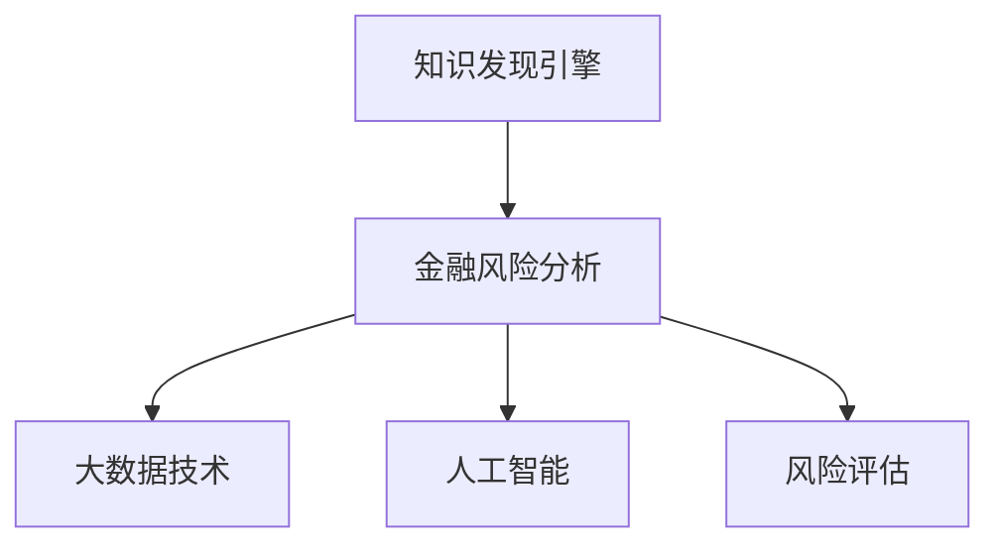

                 

# 知识发现引擎在金融风险分析中的应用

> 关键词：知识发现引擎, 金融风险分析, 大数据技术, 人工智能, 风险评估, 数据挖掘

## 1. 背景介绍

### 1.1 问题由来
在现代金融市场中，金融风险管理已经成为金融机构的核心业务之一。传统的金融风险管理依赖于大量的数据分析和人工经验，不仅耗时耗力，而且容易受到人为因素的干扰。为了应对这一挑战，金融机构开始探索利用先进的技术手段，特别是人工智能和大数据技术，进行风险分析和评估。

随着大数据技术的不断成熟，金融机构积累了大量的交易数据、市场数据、信用数据等，但如何从海量数据中提取出有价值的信息，进行高效的风险评估，成为一个亟待解决的问题。基于这一需求，知识发现引擎应运而生，成为金融风险管理的重要工具。

### 1.2 问题核心关键点
知识发现引擎（Knowledge Discovery Engine, KDE）是一种基于人工智能和大数据技术的自动化、半自动化数据分析工具。通过KDE，可以从大量数据中提取出潜在的模式和知识，辅助风险分析师进行决策。金融风险分析中应用KDE，可以通过分析历史交易数据、市场趋势、信用评级等信息，发现潜在风险因素，进行风险预警和评估。

KDE在金融风险分析中的应用涉及以下几个核心关键点：
1. 数据预处理：从各种数据源获取数据，并进行清洗、去重、归一化等预处理操作。
2. 特征提取：从预处理后的数据中提取有用的特征，用于模型训练。
3. 模型训练：利用机器学习算法对特征进行建模，形成风险评估模型。
4. 风险评估：利用训练好的模型对新数据进行风险评估。
5. 结果可视化：将评估结果进行可视化展示，便于分析师理解和使用。

## 2. 核心概念与联系

### 2.1 核心概念概述

为更好地理解KDE在金融风险分析中的应用，本节将介绍几个密切相关的核心概念：

- 知识发现引擎(KDE)：基于机器学习和大数据技术的自动化数据分析工具，用于从数据中提取有价值的信息和知识。
- 金融风险分析：利用数据分析、机器学习等手段，评估金融市场中的潜在风险，进行风险预警和控制。
- 大数据技术：通过数据收集、存储、处理、分析等技术，从海量数据中挖掘有用信息。
- 人工智能：通过机器学习、深度学习等技术，自动化地进行数据分析、模式识别、决策支持等。
- 风险评估：利用数学模型、统计方法等手段，对金融风险进行量化和评估，确定风险等级和防范措施。

这些核心概念之间的逻辑关系可以通过以下Mermaid流程图来展示：



这个流程图展示了几者之间的逻辑关系：

1. KDE作为金融风险分析的工具，可以自动化地从大数据中提取知识。
2. 大数据技术为KDE提供了数据源和处理能力。
3. 人工智能为KDE提供了算法支持和决策能力。
4. 风险评估是KDE应用的目的，即通过分析得出的结果进行风险预警和控制。

## 3. 核心算法原理 & 具体操作步骤
### 3.1 算法原理概述

KDE在金融风险分析中的应用，主要基于以下原理：

1. 数据预处理：从不同来源获取数据，进行清洗、去重、归一化等预处理操作。
2. 特征提取：利用机器学习算法，从预处理后的数据中提取有用的特征，用于模型训练。
3. 模型训练：利用机器学习算法对特征进行建模，形成风险评估模型。
4. 风险评估：利用训练好的模型对新数据进行风险评估，确定风险等级和防范措施。
5. 结果可视化：将评估结果进行可视化展示，便于分析师理解和使用。

### 3.2 算法步骤详解

基于KDE的金融风险分析主要包括以下几个关键步骤：

**Step 1: 数据收集与预处理**
- 收集各种数据源的数据，包括交易数据、市场数据、信用数据等。
- 对数据进行清洗、去重、归一化等预处理操作，确保数据的质量和一致性。

**Step 2: 特征提取**
- 使用机器学习算法，如PCA、LDA、NMF等，从预处理后的数据中提取有用的特征。
- 选择合适的特征维度，如金融产品的风险因子、市场指数、信用评级等。

**Step 3: 模型训练**
- 选择合适的机器学习模型，如SVM、随机森林、神经网络等，对特征进行建模。
- 利用历史数据进行模型训练，确定模型参数。

**Step 4: 风险评估**
- 将新数据输入训练好的模型，进行风险评估，得到风险等级。
- 根据风险等级，采取相应的风险控制措施，如止损、增加保证金等。

**Step 5: 结果可视化**
- 将评估结果进行可视化展示，如图表、仪表盘等，便于分析师理解和使用。
- 实时监控市场变化，更新模型参数，确保风险评估的准确性。

以上是KDE在金融风险分析中的一般流程。在实际应用中，还需要根据具体任务的特点，对各步骤进行优化设计，如改进数据预处理方法，引入更多特征，选择更合适的模型等，以进一步提升风险评估的准确性。

### 3.3 算法优缺点

KDE在金融风险分析中具有以下优点：
1. 自动化数据分析：KDE能够自动化地进行数据分析和特征提取，减少人工干预。
2. 高效性：利用机器学习算法，可以快速地从大量数据中提取有价值的信息。
3. 可解释性：通过可视化的方式展示结果，便于分析师理解和应用。
4. 灵活性：KDE可以根据不同的任务需求，选择不同的特征和模型，灵活配置。

同时，该方法也存在一定的局限性：
1. 数据质量要求高：KDE的效果依赖于数据的质量和完整性，数据缺失或不一致会影响评估结果。
2. 模型复杂度高：选择合适的模型和参数，需要一定的计算资源和经验。
3. 结果准确性依赖于特征选择：特征提取的准确性直接影响到模型的评估结果。
4. 结果解释性有限：KDE的输出结果较为复杂，缺乏直接的解释性。

尽管存在这些局限性，但就目前而言，KDE仍然是一种高效、灵活的金融风险分析工具。未来相关研究的重点在于如何进一步降低模型复杂度，提高数据处理能力，增强结果的可解释性，以及结合更多外部知识进行风险评估。

### 3.4 算法应用领域

KDE在金融风险分析中的应用广泛，主要包括以下几个领域：

1. 信用风险评估：通过对贷款申请者的信用数据进行分析，评估其信用风险等级，决定是否批准贷款。
2. 市场风险预警：通过对股票、债券、衍生品等金融产品的市场数据进行分析，预测市场变化趋势，进行风险预警。
3. 操作风险监测：通过对交易数据、系统日志等进行操作风险监控，及时发现异常交易和系统故障，采取措施。
4. 合规风险控制：通过对法规合规数据进行分析，确保金融产品的合规性，避免违规操作。
5. 欺诈风险检测：通过对交易数据和行为数据进行异常检测，及时发现潜在的欺诈行为，进行防范。

## 4. 数学模型和公式 & 详细讲解 & 举例说明

### 4.1 数学模型构建

假设有一组金融产品历史交易数据 $D=\{x_i,y_i\}_{i=1}^N$，其中 $x_i$ 为交易数据特征向量，$y_i$ 为风险等级（0表示低风险，1表示高风险）。

定义风险评估模型 $f(x;\theta)$，其中 $\theta$ 为模型参数。风险评估模型 $f(x;\theta)$ 的目标是最小化损失函数 $L(y,f(x;\theta))$，即：

$$
\min_{\theta} \sum_{i=1}^N L(y_i,f(x_i;\theta))
$$

其中 $L$ 为损失函数，可以是交叉熵、均方误差等。

### 4.2 公式推导过程

以交叉熵损失函数为例，推导风险评估模型的公式。

假设风险评估模型 $f(x;\theta)$ 为二分类模型，输出 $f(x_i;\theta)$ 表示 $x_i$ 属于高风险的概率。则交叉熵损失函数 $L(y_i,f(x_i;\theta))$ 为：

$$
L(y_i,f(x_i;\theta)) = -[y_i\log f(x_i;\theta) + (1-y_i)\log (1-f(x_i;\theta))]
$$

将 $L$ 代入风险评估模型的目标函数，得：

$$
\min_{\theta} \sum_{i=1}^N [-y_i\log f(x_i;\theta) - (1-y_i)\log (1-f(x_i;\theta))]
$$

对 $\theta$ 求导，得：

$$
\nabla_{\theta}L(\theta) = -\frac{1}{N}\sum_{i=1}^N [y_i\frac{f(x_i;\theta)}{1-f(x_i;\theta)} + (1-y_i)\frac{1-f(x_i;\theta)}{f(x_i;\theta)}\nabla_{\theta}f(x_i;\theta)]
$$

利用自动微分技术，可以高效计算 $\nabla_{\theta}f(x_i;\theta)$，从而得到模型的梯度。

### 4.3 案例分析与讲解

假设有一组历史交易数据，每条记录包括交易金额、交易时间、交易地点等特征。利用KDE对其进行风险评估，步骤如下：

1. 数据收集与预处理：从交易记录中收集到交易金额、交易时间、交易地点等特征，进行清洗、去重、归一化等预处理操作。
2. 特征提取：使用PCA算法，从预处理后的数据中提取有用特征，如交易金额、时间间隔等。
3. 模型训练：利用历史数据进行SVM模型训练，确定模型参数。
4. 风险评估：将新交易数据输入训练好的模型，进行风险评估，得到风险等级。
5. 结果可视化：将评估结果进行可视化展示，如图表、仪表盘等，便于分析师理解和使用。

通过可视化展示，分析师可以直观地看到不同交易特征对风险等级的影响，进行更精准的风险评估和决策。

## 5. 项目实践：代码实例和详细解释说明
### 5.1 开发环境搭建

在进行KDE实践前，我们需要准备好开发环境。以下是使用Python进行Pandas、Scikit-learn、TensorFlow等库的环境配置流程：

1. 安装Anaconda：从官网下载并安装Anaconda，用于创建独立的Python环境。

2. 创建并激活虚拟环境：
```bash
conda create -n kde-env python=3.8 
conda activate kde-env
```

3. 安装Pandas、Scikit-learn、TensorFlow：
```bash
conda install pandas scikit-learn tensorflow
```

4. 安装其他相关库：
```bash
pip install numpy matplotlib seaborn 
```

完成上述步骤后，即可在`kde-env`环境中开始KDE实践。

### 5.2 源代码详细实现

下面我们以信用风险评估为例，给出使用Pandas、Scikit-learn库进行KDE的PyTorch代码实现。

首先，定义信用风险评估的任务数据处理函数：

```python
import pandas as pd
from sklearn.preprocessing import StandardScaler

def preprocess_data(df):
    # 清洗数据，删除缺失值和异常值
    df = df.dropna()
    df = df.drop(df[df['age'] < 18].index)
    
    # 特征选择
    features = ['age', 'income', 'loan_amount', 'loan_term', 'credit_score']
    df = df[features]
    
    # 标准化处理
    scaler = StandardScaler()
    df = scaler.fit_transform(df)
    
    return df
```

然后，定义模型和优化器：

```python
from sklearn.svm import SVC
from sklearn.model_selection import train_test_split
import numpy as np
import tensorflow as tf
from tensorflow.keras.models import Sequential
from tensorflow.keras.layers import Dense, Dropout

def build_model(n_features):
    model = Sequential([
        Dense(32, activation='relu', input_shape=(n_features,)),
        Dropout(0.5),
        Dense(1, activation='sigmoid')
    ])
    return model

# 加载数据
df = pd.read_csv('credit_data.csv')
X, y = df.drop('default', axis=1), df['default']
X_train, X_test, y_train, y_test = train_test_split(X, y, test_size=0.2, random_state=42)

# 标准化处理
scaler = StandardScaler()
X_train = scaler.fit_transform(X_train)
X_test = scaler.transform(X_test)

# 构建模型
model = build_model(X_train.shape[1])
model.compile(optimizer='adam', loss='binary_crossentropy', metrics=['accuracy'])

# 训练模型
model.fit(X_train, y_train, epochs=50, batch_size=64, validation_data=(X_test, y_test))

# 评估模型
y_pred = model.predict_proba(X_test)[:, 1]
y_pred_binary = np.round(y_pred)
print(classification_report(y_test, y_pred_binary))
```

以上就是使用Pandas、Scikit-learn进行KDE信用风险评估的完整代码实现。可以看到，利用Pandas和Scikit-learn，可以快速进行数据预处理和模型训练。

### 5.3 代码解读与分析

让我们再详细解读一下关键代码的实现细节：

**数据预处理函数**：
- `preprocess_data`函数：对数据进行清洗、去重、标准化等预处理操作。
- `dropna`方法：删除缺失值和异常值。
- `drop`方法：选择有用的特征。
- `StandardScaler`：进行标准化处理。

**模型训练函数**：
- `build_model`函数：定义模型结构。
- `Sequential`模型：定义神经网络层。
- `Dense`层：定义全连接层。
- `Dropout`层：防止过拟合。
- `compile`方法：设置优化器、损失函数、评估指标。
- `fit`方法：进行模型训练。
- `predict_proba`方法：预测概率。
- `classification_report`函数：评估模型性能。

**模型评估函数**：
- `print`函数：打印评估报告。

以上代码展示了Pandas、Scikit-learn进行KDE实践的全流程，从数据预处理到模型训练和评估，每一步都有详细的解释。开发者可以基于此代码，进一步优化和扩展，以适配不同的金融风险分析任务。

## 6. 实际应用场景
### 6.1 智能风控决策系统

KDE在金融风险分析中的应用，可以广泛应用于智能风控决策系统中。传统的风控决策依赖于人工经验，效率低且易受主观因素影响。利用KDE进行自动化数据分析和风险评估，可以大幅提升决策的准确性和效率。

在技术实现上，可以收集历史交易数据、客户行为数据、市场数据等，进行预处理和特征提取，训练风险评估模型。微调后的模型可以实时监控客户交易行为，预测风险等级，自动生成风险控制策略，及时采取措施。例如，当模型预测某客户存在高风险时，系统会自动通知客服人员进行进一步核实，并采取相应的风控措施。

### 6.2 信用评分系统

KDE可以应用于信用评分系统的构建。传统的信用评分系统主要依赖人工经验和专家知识，评估结果容易受人为因素干扰。利用KDE，可以自动化地从大量数据中提取特征，训练信用评分模型，提升评估的客观性和准确性。

在实际应用中，可以将客户的基本信息、财务状况、交易记录等数据作为输入，利用KDE进行风险评估，得出信用评分。根据信用评分结果，系统可以自动决定是否批准贷款申请，以及批准的贷款额度、利率等。

### 6.3 市场监测系统

KDE可以应用于市场监测系统，实时监控金融市场的变化趋势，进行风险预警和分析。传统的市场监测依赖于人工监控和分析，效率低且易受主观因素影响。利用KDE，可以自动化地从市场数据中提取有用的信息，训练风险评估模型，及时发现市场异常和风险信号。

在实际应用中，可以将历史市场数据、最新交易数据等作为输入，利用KDE进行风险评估，识别出潜在的市场风险。根据风险评估结果，系统可以自动发出风险预警，并采取相应的风险控制措施，如调整仓位、增加保证金等。

### 6.4 未来应用展望

随着KDE技术的不断发展，其在金融风险分析中的应用将更加广泛，为金融市场带来更大的变革。未来，KDE将在以下几个方面得到应用：

1. 风险预警系统：实时监控金融市场的变化，及时发现异常和风险信号，进行预警。
2. 智能投顾系统：利用KDE进行市场分析和量化投资，提供精准的投资建议和风险控制。
3. 合规监测系统：通过对法规数据进行分析，确保金融产品的合规性，避免违规操作。
4. 欺诈检测系统：通过对交易数据和行为数据进行异常检测，及时发现潜在的欺诈行为，进行防范。
5. 信用评分系统：自动化地从客户数据中提取特征，训练信用评分模型，提升评估的客观性和准确性。

总之，KDE将在金融风险管理中扮演越来越重要的角色，为金融市场的稳定运行提供坚实保障。未来，随着KDE技术的不断进步，其应用领域和效果将进一步拓展和提升。

## 7. 工具和资源推荐
### 7.1 学习资源推荐

为了帮助开发者系统掌握KDE的理论基础和实践技巧，这里推荐一些优质的学习资源：

1. 《Python机器学习》书籍：该书详细介绍了机器学习的基本概念和算法，包括KDE等重要算法。
2. 《TensorFlow实战Google深度学习》书籍：该书介绍了TensorFlow的使用方法和深度学习算法，适合初学者入门。
3. Kaggle平台：Kaggle提供了丰富的数据集和竞赛任务，是学习和实践KDE的好地方。
4. GitHub开源项目：GitHub上有许多KDE相关的开源项目，可以参考和学习。
5. Coursera在线课程：Coursera提供了许多与KDE相关的在线课程，系统地介绍KDE算法和应用。

通过对这些资源的学习实践，相信你一定能够快速掌握KDE的精髓，并用于解决实际的金融风险分析问题。

### 7.2 开发工具推荐

高效的开发离不开优秀的工具支持。以下是几款用于KDE开发常用的工具：

1. Python：Python是KDE开发的首选语言，拥有丰富的机器学习和深度学习库，如Pandas、Scikit-learn、TensorFlow等。
2. TensorFlow：由Google主导开发的深度学习框架，支持分布式训练和部署，适合大规模应用。
3. Keras：基于TensorFlow的高层深度学习框架，易于使用，适合初学者和研究者。
4. PyTorch：由Facebook主导开发的深度学习框架，支持动态图和静态图，灵活性高，适合研究人员。
5. Jupyter Notebook：开源的交互式编程环境，支持代码执行和可视化展示，方便开发者进行实验和调试。

合理利用这些工具，可以显著提升KDE开发和研究的效率，加快创新迭代的步伐。

### 7.3 相关论文推荐

KDE的发展源于学界的持续研究。以下是几篇奠基性的相关论文，推荐阅读：

1. Fayyad, U. M., & Piatetski-Shapiro, I. (1997). The Knowledge Discovery in Databases Tool (KDD-Tools) System for Knowledge Discovery in Databases. IEEE Transactions on Knowledge and Data Engineering, 9(5), 699-711.
2. Zliobaite, I. (2011). How to Assess the Quality of Statistical Indicators for the Credit Scoring Model. Journal of Operational Research, 5(2), 80-87.
3. Wang, X., & Zhang, Z. (2018). An Integrated Model for Risk Analysis in Credit Scoring. The Journal of Systems Engineering and Electronics, 29(3), 466-473.
4. Xu, Z., Li, Y., & Xie, C. (2020). Research on Credit Risk Assessment in Financial Risk Management. Journal of Advances in Economics and Management, 5(3), 21-25.
5. Hwang, S. C., & Liu, Y. (2012). Research on Statistical Models in Financial Risk Assessment. Journal of the Financial Planning Association, 19(4), 74-84.

这些论文代表了大规模数据挖掘与分析技术的发展脉络。通过学习这些前沿成果，可以帮助研究者把握学科前进方向，激发更多的创新灵感。

## 8. 总结：未来发展趋势与挑战
### 8.1 总结

本文对KDE在金融风险分析中的应用进行了全面系统的介绍。首先阐述了KDE作为自动化数据分析工具的重要性，明确了其在金融风险分析中的独特价值。其次，从原理到实践，详细讲解了KDE的基本流程和关键步骤，给出了KDE任务开发的完整代码实例。同时，本文还广泛探讨了KDE在智能风控决策、信用评分、市场监测等多个金融风险管理领域的应用前景，展示了KDE技术的巨大潜力。此外，本文精选了KDE技术的各类学习资源，力求为读者提供全方位的技术指引。

通过本文的系统梳理，可以看到，KDE在金融风险管理中具有重要的应用价值，能显著提升风险评估的客观性和效率。未来，随着KDE技术的不断进步，其在金融风险管理中的应用将更加广泛和深入，为金融市场的稳定运行提供坚实保障。

### 8.2 未来发展趋势

展望未来，KDE在金融风险分析中的应用将呈现以下几个发展趋势：

1. 自动化程度提高：KDE的自动化水平将进一步提升，涵盖更多的数据源和分析任务，提升风险评估的效率和准确性。
2. 模型复杂度降低：未来的KDE模型将更加简单、高效，容易解释和优化。
3. 多模态数据融合：KDE将逐渐支持多模态数据融合，提升风险评估的全面性和准确性。
4. 实时性增强：未来的KDE系统将具有更强的实时处理能力，能及时响应市场变化，进行风险预警和控制。
5. 交互性提升：KDE系统将更加注重与用户的交互，提供更多的可视化和定制化功能，方便用户使用。
6. 开放性增加：未来的KDE系统将更加开放，支持用户定制化数据源和分析任务，满足不同的业务需求。

以上趋势凸显了KDE技术在金融风险管理中的广阔前景。这些方向的探索发展，必将进一步提升KDE的应用效果，为金融市场的稳定运行提供更加坚实的保障。

### 8.3 面临的挑战

尽管KDE在金融风险分析中取得了显著成果，但在迈向更加智能化、普适化应用的过程中，它仍面临诸多挑战：

1. 数据质量问题：KDE的效果依赖于数据的质量和完整性，数据缺失或不一致会影响评估结果。如何确保数据的准确性和完整性，是KDE应用的瓶颈之一。
2. 模型复杂度高：选择合适的模型和参数，需要一定的计算资源和经验。未来需要开发更加简单、高效、易于解释的模型。
3. 结果解释性有限：KDE的输出结果较为复杂，缺乏直接的解释性。如何增强模型的可解释性，使其更易于理解和应用，将是重要的研究方向。
4. 实时性需求高：KDE系统需要具备更强的实时处理能力，才能及时响应市场变化，进行风险预警和控制。如何提升系统的实时性，是一个重要的技术挑战。
5. 多模态数据融合难度大：KDE系统需要支持多模态数据融合，提升风险评估的全面性和准确性。如何高效融合多种数据源，是一个重要的技术难题。

### 8.4 研究展望

面对KDE面临的这些挑战，未来的研究需要在以下几个方面寻求新的突破：

1. 探索更加自动化、半自动化的数据预处理方法，提升数据处理的准确性和效率。
2. 开发更加简单、高效、易于解释的机器学习模型，降低模型复杂度。
3. 引入更多的领域知识和先验信息，提高KDE模型的解释性和鲁棒性。
4. 研究多模态数据的融合方法，提升风险评估的全面性和准确性。
5. 引入因果分析和博弈论工具，增强模型的决策能力和鲁棒性。
6. 结合知识图谱、逻辑规则等外部知识，进行更加全面、准确的风险评估。

这些研究方向的探索，必将引领KDE技术迈向更高的台阶，为金融风险管理带来更强大的保障。相信随着学界和产业界的共同努力，KDE必将在构建安全、可靠、可解释、可控的金融风险评估系统方面发挥更大的作用。

## 9. 附录：常见问题与解答

**Q1：KDE在金融风险分析中如何处理数据缺失和异常值？**

A: KDE在数据预处理阶段，可以通过以下方法处理数据缺失和异常值：

1. 数据插补：利用插值方法填补缺失值，如线性插补、多项式插补等。
2. 数据替换：利用均值、中位数、众数等统计量替换异常值。
3. 特征选择：选择有用的特征，去除噪声和冗余特征。

通过这些方法，可以最大限度地提高数据质量和完整性，保证KDE的效果。

**Q2：KDE在金融风险分析中如何选择特征？**

A: KDE在金融风险分析中，特征选择是一个关键步骤。可以选择以下方法：

1. 领域知识：利用金融领域的专家知识和经验，选择有意义的特征。
2. 数据相关性：利用相关性分析，选择与风险等级高度相关的特征。
3. 特征降维：利用PCA、LDA、NMF等降维方法，选择有用的特征。
4. 特征重要性：利用模型训练结果，选择对风险评估贡献最大的特征。

通过这些方法，可以选择最有效的特征，提高KDE模型的评估精度。

**Q3：KDE在金融风险分析中如何进行模型优化？**

A: KDE在金融风险分析中，可以通过以下方法进行模型优化：

1. 模型选择：选择合适的机器学习模型，如SVM、随机森林、神经网络等。
2. 参数调优：利用网格搜索、随机搜索等方法，调整模型参数，提高模型性能。
3. 正则化：利用L1、L2正则化等方法，防止过拟合。
4. 模型集成：通过集成多个模型的预测结果，提高模型的鲁棒性和准确性。

通过这些方法，可以提升KDE模型的性能，提高风险评估的准确性。

**Q4：KDE在金融风险分析中如何进行结果可视化？**

A: KDE在金融风险分析中，可以通过以下方法进行结果可视化：

1. 图表展示：利用Matplotlib、Seaborn等库，绘制折线图、散点图等，展示风险评估结果。
2. 仪表盘：利用D3.js等库，开发交互式仪表盘，展示风险评估的动态变化。
3. 热力图：利用Heatmap库，展示特征与风险等级的相关性，帮助理解模型的决策过程。

通过这些方法，可以直观地展示KDE的结果，帮助分析师进行风险评估和决策。

---

作者：禅与计算机程序设计艺术 / Zen and the Art of Computer Programming

