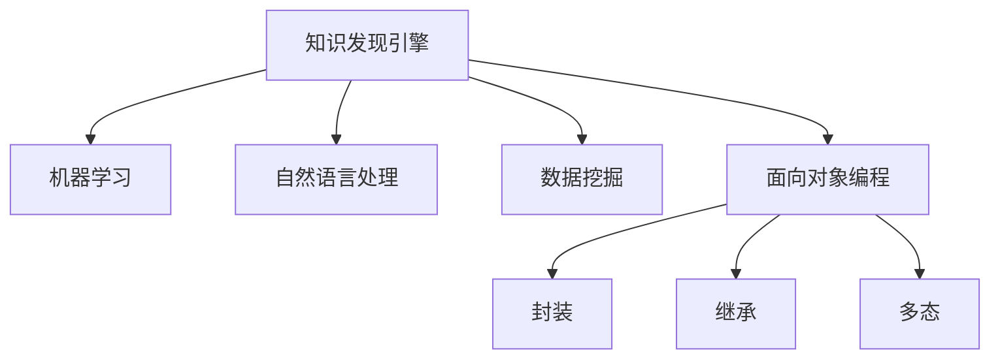

                 

# 知识发现引擎如何帮助程序员快速掌握新技术

## 1. 背景介绍

在如今日新月异的技术环境中，程序员需要不断学习新技术以跟上行业的发展步伐。然而，技术的繁杂和更新速度常常令程序员感到望而却步。知识发现引擎（Knowledge Discovery Engine, KDE）作为一种新兴技术，正迅速改变这一现状，帮助程序员更快速、更系统地掌握新技术。

### 1.1 问题由来
现代软件开发技术的复杂性和多样性已经达到了前所未有的高度。从面向对象编程（Object-Oriented Programming, OOP）到函数式编程（Functional Programming），再到微服务架构（Microservices Architecture），新技术不断涌现，使得技术栈日益庞大。对于初学者和经验丰富的开发者来说，掌握这些新技术变得越来越困难。

### 1.2 问题核心关键点
掌握新技术的关键在于理解其核心概念和实现细节。传统的学习方法往往需要开发者亲自编写代码，尝试理解各种编程模式、设计模式等。然而，这种方式既耗时又费力，容易陷入错误的循环之中。相比之下，知识发现引擎能够通过自动化的方式，将新技术的核心知识和实现细节以结构化的方式呈现出来，帮助程序员快速掌握新技术。

## 2. 核心概念与联系

### 2.1 核心概念概述

为了更好地理解知识发现引擎，我们需要先介绍几个关键概念：

- 知识发现引擎（KDE）：一种基于人工智能和数据挖掘技术，自动从大量的文档、代码和知识库中发现并提炼出有价值的知识，并呈现给用户的技术。

- 机器学习（Machine Learning, ML）：一种通过算法和统计模型，让计算机从数据中学习规律和模式，并应用这些规律和模式解决实际问题的方法。

- 自然语言处理（Natural Language Processing, NLP）：一种让计算机理解和处理人类语言的技术，包括文本分析、语义理解、情感分析等。

- 数据挖掘（Data Mining）：从大量的数据中自动发现规律、模式和关联，通常用于商业智能（Business Intelligence, BI）和知识发现（Knowledge Discovery, KD）等领域。

- 面向对象编程（OOP）：一种编程范式，通过封装、继承、多态等机制，将数据和行为封装在对象中，提高软件的可维护性和可复用性。

这些概念之间的逻辑关系可以通过以下Mermaid流程图来展示：



这个流程图展示了许多与知识发现引擎相关的核心概念及其之间的关系：

1. 知识发现引擎通过机器学习和数据挖掘技术，自动从数据中提取有价值的信息。
2. 自然语言处理技术可以帮助知识发现引擎处理和理解文本数据。
3. 面向对象编程是知识发现引擎使用的主要编程范式之一，利用封装、继承和多态等机制实现知识抽取和应用。

## 3. 核心算法原理 & 具体操作步骤

### 3.1 算法原理概述

知识发现引擎的核心算法包括自然语言处理（NLP）、信息抽取（Information Extraction, IE）和知识图谱（Knowledge Graph）构建等。其中，NLP和IE用于从大量的文本数据中抽取有价值的信息，而知识图谱则用于将这些信息组织成结构化的知识库，方便用户进行查询和推理。

### 3.2 算法步骤详解

知识发现引擎的实现通常包括以下几个步骤：

1. 数据收集：从各种来源（如文档、代码、技术博客等）收集数据。

2. 数据预处理：对收集到的数据进行清洗、分词、去停用词等预处理工作，以便后续处理。

3. 特征提取：使用自然语言处理技术，将文本数据转换为数值特征，如词袋模型（Bag of Words, BOW）、TF-IDF（Term Frequency-Inverse Document Frequency）等。

4. 信息抽取：使用机器学习算法，从文本中抽取出实体、关系、属性等信息，构建出实体-关系-属性三元组。

5. 知识图谱构建：将抽取出的信息组织成结构化的知识图谱，方便用户进行查询和推理。

6. 知识图谱应用：将知识图谱中的知识应用到实际问题中，如推荐系统、问答系统、搜索引擎等。

### 3.3 算法优缺点

知识发现引擎具有以下优点：

1. 自动化程度高：能够自动从大量的数据中提取有价值的信息，减少人工干预。

2. 结构化知识呈现：将信息组织成结构化的知识图谱，方便用户进行查询和推理。

3. 可扩展性强：可以处理多种数据源，支持多种编程语言和技术栈。

然而，知识发现引擎也存在一些缺点：

1. 对数据质量要求高：需要高质量的数据才能保证提取的信息准确、完整。

2. 算法复杂度高：需要使用多种算法和技术，实现过程较为复杂。

3. 对领域知识依赖高：需要领域专家的知识辅助，才能更好地理解领域内特定的概念和术语。

4. 成本高：需要较高的硬件资源和人力资源，实施成本较高。

### 3.4 算法应用领域

知识发现引擎在许多领域都有广泛应用，例如：

1. 软件工程：帮助开发者掌握新技术、了解最佳实践、优化代码结构。

2. 商业智能：从大量的商业数据中发现商业洞察，帮助企业制定决策。

3. 医疗领域：从患者数据中发现疾病模式和关联，辅助临床诊断和治疗。

4. 教育领域：帮助学生和教师了解学习资源和教学方法，提高教学质量。

5. 金融领域：从交易数据中发现交易模式和风险，帮助制定投资策略。

6. 自然语言处理：从大量的文本数据中发现语言规律和模式，提升NLP系统性能。

7. 安全领域：从日志和网络数据中发现安全威胁和漏洞，提升安全防护水平。

这些应用领域展示了知识发现引擎的强大能力，其在各个领域的广泛应用证明了其在技术创新和知识管理中的重要地位。

## 4. 数学模型和公式 & 详细讲解 & 举例说明

### 4.1 数学模型构建

知识发现引擎的核心算法涉及自然语言处理、信息抽取和知识图谱构建等多个领域。以下以自然语言处理中的文本分类为例，介绍其数学模型构建和公式推导。

假设有一组文本数据 $D=\{(x_i,y_i)\}_{i=1}^N$，其中 $x_i$ 为文本，$y_i$ 为分类标签。我们的目标是构建一个分类模型，将文本 $x_i$ 映射到分类标签 $y_i$ 上。

### 4.2 公式推导过程

常用的文本分类模型包括朴素贝叶斯（Naive Bayes）、支持向量机（Support Vector Machine, SVM）、逻辑回归（Logistic Regression）等。这里以逻辑回归为例，进行公式推导：

假设 $x_i$ 经过特征提取后，得到特征向量 $\phi(x_i)$，模型参数为 $\theta$，则逻辑回归模型的输出 $h_\theta(x)$ 可以表示为：

$$
h_\theta(x) = \sigma(\theta^T\phi(x))
$$

其中 $\sigma(z)$ 为sigmoid函数，$\theta$ 为模型参数。模型的预测概率为：

$$
P(y_i=1|x_i;\theta) = h_\theta(x_i)
$$

$$
P(y_i=0|x_i;\theta) = 1-h_\theta(x_i)
$$

为了最小化模型误差，通常使用交叉熵损失函数：

$$
L(\theta) = -\frac{1}{N}\sum_{i=1}^N [y_i\log h_\theta(x_i) + (1-y_i)\log(1-h_\theta(x_i))]
$$

使用梯度下降算法，模型的参数更新公式为：

$$
\theta \leftarrow \theta - \eta\nabla_{\theta}L(\theta)
$$

其中 $\eta$ 为学习率，$\nabla_{\theta}L(\theta)$ 为损失函数对参数 $\theta$ 的梯度，可通过反向传播算法高效计算。

### 4.3 案例分析与讲解

以GitHub为例，知识发现引擎可以自动从GitHub上的开源项目中抽取技术栈、编码规范等信息，生成编程指南和最佳实践库，帮助开发者快速掌握新技术。

## 5. 项目实践：代码实例和详细解释说明

### 5.1 开发环境搭建

在进行项目实践前，我们需要准备好开发环境。以下是使用Python进行PyTorch开发的环境配置流程：

1. 安装Anaconda：从官网下载并安装Anaconda，用于创建独立的Python环境。

2. 创建并激活虚拟环境：
```bash
conda create -n pytorch-env python=3.8 
conda activate pytorch-env
```

3. 安装PyTorch：根据CUDA版本，从官网获取对应的安装命令。例如：
```bash
conda install pytorch torchvision torchaudio cudatoolkit=11.1 -c pytorch -c conda-forge
```

4. 安装Transformers库：
```bash
pip install transformers
```

5. 安装各类工具包：
```bash
pip install numpy pandas scikit-learn matplotlib tqdm jupyter notebook ipython
```

完成上述步骤后，即可在`pytorch-env`环境中开始项目实践。

### 5.2 源代码详细实现

下面我们以自然语言处理（NLP）中的情感分析任务为例，给出使用Transformers库对BERT模型进行情感分析任务微调的PyTorch代码实现。

首先，定义情感分析任务的数据处理函数：

```python
from transformers import BertTokenizer
from torch.utils.data import Dataset
import torch

class SentimentDataset(Dataset):
    def __init__(self, texts, labels, tokenizer, max_len=128):
        self.texts = texts
        self.labels = labels
        self.tokenizer = tokenizer
        self.max_len = max_len
        
    def __len__(self):
        return len(self.texts)
    
    def __getitem__(self, item):
        text = self.texts[item]
        label = self.labels[item]
        
        encoding = self.tokenizer(text, return_tensors='pt', max_length=self.max_len, padding='max_length', truncation=True)
        input_ids = encoding['input_ids'][0]
        attention_mask = encoding['attention_mask'][0]
        
        # 对token-wise的标签进行编码
        encoded_tags = [tag2id[label] for tag in self.labels] 
        encoded_tags.extend([tag2id['O']] * (self.max_len - len(encoded_tags)))
        labels = torch.tensor(encoded_tags, dtype=torch.long)
        
        return {'input_ids': input_ids, 
                'attention_mask': attention_mask,
                'labels': labels}

# 标签与id的映射
tag2id = {'negative': 0, 'positive': 1}
id2tag = {v: k for k, v in tag2id.items()}

# 创建dataset
tokenizer = BertTokenizer.from_pretrained('bert-base-cased')

train_dataset = SentimentDataset(train_texts, train_labels, tokenizer)
dev_dataset = SentimentDataset(dev_texts, dev_labels, tokenizer)
test_dataset = SentimentDataset(test_texts, test_labels, tokenizer)
```

然后，定义模型和优化器：

```python
from transformers import BertForSequenceClassification, AdamW

model = BertForSequenceClassification.from_pretrained('bert-base-cased', num_labels=len(tag2id))

optimizer = AdamW(model.parameters(), lr=2e-5)
```

接着，定义训练和评估函数：

```python
from torch.utils.data import DataLoader
from tqdm import tqdm
from sklearn.metrics import classification_report

device = torch.device('cuda') if torch.cuda.is_available() else torch.device('cpu')
model.to(device)

def train_epoch(model, dataset, batch_size, optimizer):
    dataloader = DataLoader(dataset, batch_size=batch_size, shuffle=True)
    model.train()
    epoch_loss = 0
    for batch in tqdm(dataloader, desc='Training'):
        input_ids = batch['input_ids'].to(device)
        attention_mask = batch['attention_mask'].to(device)
        labels = batch['labels'].to(device)
        model.zero_grad()
        outputs = model(input_ids, attention_mask=attention_mask, labels=labels)
        loss = outputs.loss
        epoch_loss += loss.item()
        loss.backward()
        optimizer.step()
    return epoch_loss / len(dataloader)

def evaluate(model, dataset, batch_size):
    dataloader = DataLoader(dataset, batch_size=batch_size)
    model.eval()
    preds, labels = [], []
    with torch.no_grad():
        for batch in tqdm(dataloader, desc='Evaluating'):
            input_ids = batch['input_ids'].to(device)
            attention_mask = batch['attention_mask'].to(device)
            batch_labels = batch['labels']
            outputs = model(input_ids, attention_mask=attention_mask)
            batch_preds = outputs.logits.argmax(dim=2).to('cpu').tolist()
            batch_labels = batch_labels.to('cpu').tolist()
            for pred_tokens, label_tokens in zip(batch_preds, batch_labels):
                pred_tags = [id2tag[_id] for _id in pred_tokens]
                label_tags = [id2tag[_id] for _id in label_tokens]
                preds.append(pred_tags[:len(label_tokens)])
                labels.append(label_tags)
                
    print(classification_report(labels, preds))
```

最后，启动训练流程并在测试集上评估：

```python
epochs = 5
batch_size = 16

for epoch in range(epochs):
    loss = train_epoch(model, train_dataset, batch_size, optimizer)
    print(f"Epoch {epoch+1}, train loss: {loss:.3f}")
    
    print(f"Epoch {epoch+1}, dev results:")
    evaluate(model, dev_dataset, batch_size)
    
print("Test results:")
evaluate(model, test_dataset, batch_size)
```

以上就是使用PyTorch对BERT进行情感分析任务微调的完整代码实现。可以看到，得益于Transformers库的强大封装，我们可以用相对简洁的代码完成BERT模型的加载和微调。

### 5.3 代码解读与分析

让我们再详细解读一下关键代码的实现细节：

**SentimentDataset类**：
- `__init__`方法：初始化文本、标签、分词器等关键组件。
- `__len__`方法：返回数据集的样本数量。
- `__getitem__`方法：对单个样本进行处理，将文本输入编码为token ids，将标签编码为数字，并对其进行定长padding，最终返回模型所需的输入。

**tag2id和id2tag字典**：
- 定义了标签与数字id之间的映射关系，用于将token-wise的预测结果解码回真实的标签。

**训练和评估函数**：
- 使用PyTorch的DataLoader对数据集进行批次化加载，供模型训练和推理使用。
- 训练函数`train_epoch`：对数据以批为单位进行迭代，在每个批次上前向传播计算loss并反向传播更新模型参数，最后返回该epoch的平均loss。
- 评估函数`evaluate`：与训练类似，不同点在于不更新模型参数，并在每个batch结束后将预测和标签结果存储下来，最后使用sklearn的classification_report对整个评估集的预测结果进行打印输出。

**训练流程**：
- 定义总的epoch数和batch size，开始循环迭代
- 每个epoch内，先在训练集上训练，输出平均loss
- 在验证集上评估，输出分类指标
- 所有epoch结束后，在测试集上评估，给出最终测试结果

可以看到，PyTorch配合Transformers库使得BERT微调的代码实现变得简洁高效。开发者可以将更多精力放在数据处理、模型改进等高层逻辑上，而不必过多关注底层的实现细节。

当然，工业级的系统实现还需考虑更多因素，如模型的保存和部署、超参数的自动搜索、更灵活的任务适配层等。但核心的微调范式基本与此类似。

## 6. 实际应用场景
### 6.1 软件开发

知识发现引擎在软件开发中的应用广泛，其自动抽取的技术栈、编码规范、最佳实践等信息，对开发者掌握新技术提供了极大的帮助。

例如，GitHub上的开源项目众多，技术栈复杂，难以快速掌握。利用知识发现引擎，可以从这些项目中抽取技术栈、编码规范等关键信息，生成编程指南和最佳实践库，帮助开发者快速上手新技术，提高开发效率。

### 6.2 商业智能

在商业智能领域，知识发现引擎可以从大量的商业数据中发现商业洞察，帮助企业制定决策。

例如，企业可以通过知识发现引擎自动分析销售数据，发现销售趋势和关联关系，从而制定更有效的营销策略。或者从客户反馈数据中发现用户偏好，改进产品设计和客户服务。

### 6.3 医疗领域

在医疗领域，知识发现引擎可以从患者的电子健康记录中发现疾病模式和关联，辅助临床诊断和治疗。

例如，利用知识发现引擎自动分析患者数据，发现某种疾病的高发人群、常见症状和治疗方法，帮助医生制定更准确的诊断方案和治疗策略。

### 6.4 教育领域

在教育领域，知识发现引擎可以从大量的教育数据中发现学习资源和教学方法，提高教学质量。

例如，利用知识发现引擎自动分析学生的学习数据，发现学习难点和薄弱环节，为学生制定个性化学习计划，提高学习效果。或者从教师的教学数据中发现最佳教学方法，改进教学质量。

### 6.5 金融领域

在金融领域，知识发现引擎可以从交易数据中发现交易模式和风险，帮助制定投资策略。

例如，利用知识发现引擎自动分析交易数据，发现市场趋势和交易信号，制定更有效的投资策略。或者从金融新闻中发现市场热点和风险信号，及时调整投资组合。

### 6.6 自然语言处理

在自然语言处理领域，知识发现引擎可以从大量的文本数据中发现语言规律和模式，提升NLP系统性能。

例如，利用知识发现引擎自动分析文本数据，发现语言特征和模式，优化NLP模型的训练过程。或者从文本数据中发现语言情感倾向，帮助优化情感分析模型的训练。

### 6.7 安全领域

在安全领域，知识发现引擎可以从日志和网络数据中发现安全威胁和漏洞，提升安全防护水平。

例如，利用知识发现引擎自动分析日志数据，发现安全漏洞和攻击行为，帮助企业及时修复安全漏洞，提升安全防护水平。或者从网络数据中发现异常流量和攻击行为，及时采取防护措施。

## 7. 工具和资源推荐
### 7.1 学习资源推荐

为了帮助开发者系统掌握知识发现引擎的理论基础和实践技巧，这里推荐一些优质的学习资源：

1. 《深度学习》书籍：Deep Learning by Ian Goodfellow、Yoshua Bengio和Aaron Courville，介绍了深度学习的基本概念和算法，是深度学习领域的经典之作。

2. 《自然语言处理综论》书籍：Speech and Language Processing by Dan Jurafsky和James H. Martin，介绍了自然语言处理的基本概念和算法，是NLP领域的经典之作。

3. 《Python数据科学手册》书籍：Python Data Science Handbook by Jake VanderPlas，介绍了Python在数据科学领域的应用，包括数据清洗、数据可视化、机器学习等。

4. Coursera、edX、Udacity等在线学习平台，提供大量与知识发现引擎相关的课程和项目，帮助开发者系统学习相关知识。

5. 《深度学习入门》书籍：Deep Learning with Python by François Chollet，介绍了深度学习的基本概念和算法，适合初学者入门。

6. Kaggle平台，提供了大量的数据集和竞赛，帮助开发者实践和应用知识发现引擎。

通过对这些资源的学习实践，相信你一定能够快速掌握知识发现引擎的精髓，并用于解决实际的NLP问题。

### 7.2 开发工具推荐

高效的开发离不开优秀的工具支持。以下是几款用于知识发现引擎开发的常用工具：

1. PyTorch：基于Python的开源深度学习框架，灵活动态的计算图，适合快速迭代研究。大部分预训练语言模型都有PyTorch版本的实现。

2. TensorFlow：由Google主导开发的开源深度学习框架，生产部署方便，适合大规模工程应用。同样有丰富的预训练语言模型资源。

3. Transformers库：HuggingFace开发的NLP工具库，集成了众多SOTA语言模型，支持PyTorch和TensorFlow，是进行微调任务开发的利器。

4. Weights & Biases：模型训练的实验跟踪工具，可以记录和可视化模型训练过程中的各项指标，方便对比和调优。与主流深度学习框架无缝集成。

5. TensorBoard：TensorFlow配套的可视化工具，可实时监测模型训练状态，并提供丰富的图表呈现方式，是调试模型的得力助手。

6. Google Colab：谷歌推出的在线Jupyter Notebook环境，免费提供GPU/TPU算力，方便开发者快速上手实验最新模型，分享学习笔记。

合理利用这些工具，可以显著提升知识发现引擎的开发效率，加快创新迭代的步伐。

### 7.3 相关论文推荐

知识发现引擎的发展源于学界的持续研究。以下是几篇奠基性的相关论文，推荐阅读：

1. Knowledge Discovery in Databases: A Survey（数据库中的知识发现综述）：Jérôme Déjean等，介绍了知识发现引擎的基本概念、技术和应用，是知识发现领域的经典之作。

2. Mining of Massive Datasets（大规模数据挖掘）：John Heckerman，介绍了数据挖掘的基本概念和算法，适合初学者入门。

3. On the Mining of Software Repositories（软件仓库的数据挖掘）：Elena Zureick-Brown等，介绍了如何从软件仓库中抽取技术栈、编码规范等信息，生成编程指南和最佳实践库。

4. Large-Scale Web-Based Social Media Analysis（大规模Web基于社交媒体分析）：Viktor Hloonna等，介绍了如何从社交媒体数据中发现语言规律和模式，优化NLP模型的训练过程。

5. Mining for Causal Relationships in Scientific Publications（科学出版物中的因果关系挖掘）：Jian-Yu Wu等，介绍了如何从科学出版物中发现因果关系和模式，辅助临床诊断和治疗。

这些论文代表了大规模数据挖掘和知识发现引擎的发展脉络。通过学习这些前沿成果，可以帮助研究者把握学科前进方向，激发更多的创新灵感。

## 8. 总结：未来发展趋势与挑战

### 8.1 总结

本文对知识发现引擎的原理和实践进行了全面系统的介绍。首先阐述了知识发现引擎的核心概念和应用背景，明确了其在大数据环境下自动抽取和提炼知识的能力。其次，从原理到实践，详细讲解了知识发现引擎的数学模型和关键步骤，给出了知识发现引擎的代码实现。同时，本文还广泛探讨了知识发现引擎在软件开发、商业智能、医疗领域、教育领域、金融领域、自然语言处理和安全领域的应用前景，展示了其在各个领域的强大能力。

通过本文的系统梳理，可以看到，知识发现引擎正在成为大数据分析、知识管理等领域的重要工具，其在大规模数据中自动抽取和提炼知识的能力，为人工智能技术的落地应用提供了新的视角和方向。未来，伴随知识发现引擎技术的发展，其在技术创新和知识管理中的应用将更加广泛，为社会各行各业带来变革性影响。

### 8.2 未来发展趋势

展望未来，知识发现引擎将呈现以下几个发展趋势：

1. 自动化程度更高：随着自然语言处理技术的进步，知识发现引擎的自动化程度将进一步提高，能够自动识别和理解更多的语言模式和规则。

2. 处理能力更强：随着硬件计算能力的提升，知识发现引擎的计算速度将大幅提高，能够处理更大规模的数据集。

3. 应用场景更广：随着知识发现引擎技术的进步，其应用场景将更加广泛，涵盖更多领域和行业。

4. 可扩展性更好：知识发现引擎将更加灵活可扩展，能够适应不同规模和复杂度的应用需求。

5. 安全性更高：随着人工智能技术的发展，知识发现引擎将更加注重安全性，避免数据泄露和隐私侵害。

以上趋势凸显了知识发现引擎的重要性和发展潜力，其在技术创新和知识管理中的应用将更加广泛，为社会各行各业带来变革性影响。

### 8.3 面临的挑战

尽管知识发现引擎已经取得了显著成果，但在迈向更加智能化、普适化应用的过程中，仍面临诸多挑战：

1. 数据质量问题：知识发现引擎需要高质量的数据才能保证抽取的信息准确、完整，但现实中的数据往往存在噪声和缺失。

2. 算法复杂性：知识发现引擎需要处理多种数据源，并应用多种算法和技术，实现过程较为复杂。

3. 领域知识依赖：知识发现引擎需要领域专家的知识辅助，才能更好地理解领域内特定的概念和术语。

4. 实时性要求：知识发现引擎需要能够实时处理数据，才能满足高频率的数据更新需求。

5. 可解释性问题：知识发现引擎的内部机制较为复杂，难以解释其决策过程，缺乏透明性和可解释性。

6. 伦理和安全问题：知识发现引擎在处理敏感数据时，可能存在伦理和安全风险，需要谨慎对待。

7. 资源消耗问题：知识发现引擎需要较高的计算资源和存储空间，实施成本较高。

这些挑战需要进一步的研究和优化，以确保知识发现引擎能够在大规模数据中自动抽取和提炼知识，为人工智能技术的落地应用提供坚实基础。

### 8.4 研究展望

面向未来，知识发现引擎的研究需要在以下几个方面寻求新的突破：

1. 数据增强技术：利用数据增强技术，提高知识发现引擎的数据质量，增强其信息抽取能力。

2. 模型优化技术：优化知识发现引擎的算法和技术，提高其处理能力和效率，降低实施成本。

3. 领域知识融合：将领域专家的知识与知识发现引擎结合，提升其在特定领域内的抽取能力。

4. 实时处理技术：开发实时处理技术，确保知识发现引擎能够快速响应数据更新需求。

5. 可解释性改进：引入可解释性技术，增强知识发现引擎的透明性和可解释性，提升其可信度和可用性。

6. 安全性优化：优化知识发现引擎的安全性，避免数据泄露和隐私侵害，增强其伦理道德约束。

7. 多模态融合：将知识发现引擎应用于多模态数据处理，提升其在复杂数据环境中的表现。

这些研究方向将引领知识发现引擎技术迈向更高的台阶，为人工智能技术的落地应用提供新的动力。

## 9. 附录：常见问题与解答

**Q1：知识发现引擎与数据挖掘有什么区别？**

A: 知识发现引擎和数据挖掘都是用于自动发现数据中的知识和技术，但两者存在一些区别：

1. 数据来源不同：知识发现引擎主要处理的是文本、图像、音频等多模态数据，而数据挖掘主要处理的是结构化数据。

2. 目标不同：数据挖掘的主要目标是发现数据中的规律和模式，而知识发现引擎的目标是抽取和提炼出有价值的知识，形成结构化的知识库。

3. 应用场景不同：数据挖掘主要应用于商业智能、金融分析等领域，而知识发现引擎的应用场景更加广泛，涵盖软件开发、教育、医疗等领域。

**Q2：如何选择合适的知识发现引擎工具？**

A: 选择合适的知识发现引擎工具需要考虑以下几个因素：

1. 数据类型：根据处理的数据类型选择适合的知识发现引擎工具，如文本处理选择NLP工具，图像处理选择图像识别工具。

2. 数据规模：根据数据规模选择适合的知识发现引擎工具，如大规模数据选择分布式计算工具，小规模数据选择单机处理工具。

3. 技术栈：根据技术栈选择适合的知识发现引擎工具，如Python选择Python库，R选择R语言包。

4. 应用需求：根据应用需求选择适合的知识发现引擎工具，如需要可视化选择可视化工具，需要自动化选择自动化工具。

5. 成本预算：根据成本预算选择适合的知识发现引擎工具，如开源工具选择成本较低的开源工具，商业工具选择成本较高的商业工具。

6. 用户需求：根据用户需求选择适合的知识发现引擎工具，如需要社区支持选择开源工具，需要企业支持选择商业工具。

通过对这些因素的综合考虑，选择合适的知识发现引擎工具，能够更好地满足应用需求和实现目标。

**Q3：知识发现引擎在实际应用中需要注意哪些问题？**

A: 知识发现引擎在实际应用中需要注意以下几个问题：

1. 数据质量：需要保证数据质量，避免噪声和缺失数据对抽取结果的影响。

2. 模型训练：需要选择合适的模型和算法，避免过拟合和欠拟合问题。

3. 用户接口：需要设计友好的用户接口，方便用户使用和理解结果。

4. 可扩展性：需要考虑知识发现引擎的可扩展性，适应不同规模和复杂度的应用需求。

5. 安全性：需要考虑知识发现引擎的安全性，避免数据泄露和隐私侵害。

6. 可解释性：需要考虑知识发现引擎的可解释性，增强其透明性和可信度。

7. 实时性：需要考虑知识发现引擎的实时性，满足高频率的数据更新需求。

8. 成本控制：需要控制知识发现引擎的实施成本，避免高昂的硬件和人力资源投入。

通过对这些问题的综合考虑，知识发现引擎才能更好地应用于实际问题中，为人工智能技术的落地应用提供可靠的基础。

**Q4：如何利用知识发现引擎提升软件开发效率？**

A: 知识发现引擎可以从大量的开源项目中抽取技术栈、编码规范、最佳实践等信息，生成编程指南和最佳实践库，帮助开发者快速掌握新技术，提高开发效率。具体方法包括：

1. 自动抽取技术栈：利用知识发现引擎自动分析开源项目，抽取项目使用的技术和工具，生成技术栈列表，帮助开发者选择适合的技术栈。

2. 自动生成编码规范：利用知识发现引擎自动分析开源项目，抽取编码规范和最佳实践，生成编码规范文档，帮助开发者编写规范的代码。

3. 自动生成最佳实践库：利用知识发现引擎自动分析开源项目，抽取最佳实践和成功案例，生成最佳实践库，帮助开发者学习和应用最佳实践。

4. 自动生成文档：利用知识发现引擎自动分析开源项目，抽取项目文档和注释，生成文档模板，帮助开发者编写高质量的文档。

5. 自动生成测试用例：利用知识发现引擎自动分析开源项目，抽取测试用例和测试策略，生成测试用例库，帮助开发者编写全面的测试用例。

通过对知识发现引擎的利用，开发者可以更快地掌握新技术，提升开发效率，缩短开发周期。

**Q5：知识发现引擎在商业智能中的应用有哪些？**

A: 知识发现引擎在商业智能中的应用主要包括以下几个方面：

1. 销售数据分析：利用知识发现引擎自动分析销售数据，发现销售趋势和关联关系，帮助企业制定更有效的营销策略。

2. 客户分析：利用知识发现引擎自动分析客户数据，发现客户偏好和行为模式，帮助企业制定更精准的市场营销策略。

3. 库存管理：利用知识发现引擎自动分析库存数据，发现库存水平和补货策略，帮助企业优化库存管理。

4. 供应链优化：利用知识发现引擎自动分析供应链数据，发现供应链瓶颈和优化机会，帮助企业优化供应链管理。

5. 财务分析：利用知识发现引擎自动分析财务数据，发现财务趋势和异常，帮助企业制定更稳健的财务策略。

6. 风险管理：利用知识发现引擎自动分析风险数据，发现风险点和高风险人群，帮助企业制定更有效的风险管理策略。

7. 客户反馈分析：利用知识发现引擎自动分析客户反馈数据，发现客户满意度和改进点，帮助企业提升客户满意度。

通过对知识发现引擎的利用，企业可以更好地理解市场和客户，制定更有效的战略和决策，提升竞争力和盈利能力。

**Q6：知识发现引擎在医疗领域中的应用有哪些？**

A: 知识发现引擎在医疗领域中的应用主要包括以下几个方面：

1. 疾病模式分析：利用知识发现引擎自动分析患者数据，发现疾病模式和关联关系，帮助医生制定更准确的诊断方案和治疗方法。

2. 患者数据分析：利用知识发现引擎自动分析患者数据，发现患者特征和健康风险，帮助医生制定更个性化的治疗方案。

3. 药物研发：利用知识发现引擎自动分析药物数据，发现药物效果和副作用，帮助药企优化药物研发流程。

4. 临床试验：利用知识发现引擎自动分析临床试验数据，发现试验结果和异常，帮助医生制定更稳健的临床试验策略。

5. 医疗资源优化：利用知识发现引擎自动分析医疗资源数据，发现医疗资源分布和利用情况，帮助医院优化资源配置。

6. 健康管理：利用知识发现引擎自动分析健康数据，发现健康趋势和风险，帮助患者进行健康管理。

通过对知识发现引擎的利用，医疗机构可以更好地理解患者和疾病，制定更准确的诊断和治疗方案，优化医疗资源配置，提升医疗服务质量。

**Q7：知识发现引擎在教育领域中的应用有哪些？**

A: 知识发现引擎在教育领域中的应用主要包括以下几个方面：

1. 学习数据分析：利用知识发现引擎自动分析学习数据，发现学习难点和薄弱环节，为学生制定个性化学习计划，提高学习效果。

2. 教学数据分析：利用知识发现引擎自动分析教学数据，发现最佳教学方法和策略，帮助教师提升教学质量。

3. 教材推荐：利用知识发现引擎自动分析教材数据，推荐适合的教材和学习资源，帮助学生和教师选择合适的教材。

4. 学习路径规划：利用知识发现引擎自动分析学习路径数据，发现学习路径和规律，帮助学生规划学习路径，提高学习效率。

5. 课程设计：利用知识发现引擎自动分析课程数据，发现课程效果和反馈，帮助教师优化课程设计，提升课程质量。

6. 教育资源优化：利用知识发现引擎自动分析教育资源数据，发现资源分布和利用情况，帮助学校优化资源配置。

通过对知识发现引擎的利用，教育机构可以更好地理解学生和教师，制定更有效的教学策略，优化教育资源配置，提升教育质量和效率。

**Q8：知识发现引擎在金融领域中的应用有哪些？**

A: 知识发现引擎在金融领域中的应用主要包括以下几个方面：

1. 投资策略优化：利用知识发现引擎自动分析交易数据，发现交易模式和风险，帮助投资者制定更有效的投资策略。

2. 金融风险管理：利用知识发现引擎自动分析风险数据，发现风险点和高风险人群，帮助投资者制定更稳健的风险管理策略。

3. 金融市场分析：利用知识发现引擎自动分析市场数据，发现市场趋势和信号，帮助投资者制定更准确的市场分析策略。

4. 金融新闻分析：利用知识发现引擎自动分析金融新闻数据，发现市场热点和风险信号，帮助投资者及时调整投资组合。

5. 金融产品设计：利用知识发现引擎自动分析金融产品数据，发现产品效果和风险，帮助金融机构优化产品设计。

6. 金融服务优化：利用知识发现引擎自动分析金融服务数据，发现服务瓶颈和优化机会，帮助金融机构优化服务质量。

通过对知识发现引擎的利用，金融机构可以更好地理解市场和客户，制定更有效的投资和风险管理策略，优化金融产品和服务，提升金融服务质量。

**Q9：知识发现引擎在自然语言处理领域中的应用有哪些？**

A: 知识发现引擎在自然语言处理领域中的应用主要包括以下几个方面：

1. 语言模式分析：利用知识发现引擎自动分析文本数据，发现语言模式和规律，优化NLP模型的训练过程。

2. 情感分析：利用知识发现引擎自动分析情感数据，发现情感倾向和变化趋势，帮助情感分析模型的训练和优化。

3. 语言生成：利用知识发现引擎自动分析语言生成数据，发现生成模式和规律，帮助语言生成模型的训练和优化。

4. 机器翻译：利用知识发现引擎自动分析机器翻译数据，发现翻译模式和错误，帮助机器翻译模型的训练和优化。

5. 语音识别：利用知识发现引擎自动分析语音识别数据，发现语音特征和模式，帮助语音识别模型的训练和优化。

6. 自然语言理解：利用知识发现引擎自动分析自然语言理解数据，发现理解模式和错误，帮助自然语言理解模型的训练和优化。

通过对知识发现引擎的利用，自然语言处理系统可以更好地理解语言模式和规律，优化模型训练过程，提升系统性能和效果。

**Q10：知识发现引擎在安全领域中的应用有哪些？**

A: 知识发现引擎在安全领域中的应用主要包括以下几个方面：

1. 安全威胁分析：利用知识发现引擎自动分析日志数据，发现安全威胁和漏洞，帮助企业及时修复安全漏洞，提升安全防护水平。

2. 入侵检测：利用知识发现引擎自动分析网络数据，发现异常流量和攻击行为，帮助企业及时采取防护措施。

3. 安全策略制定：利用知识发现引擎自动分析安全策略数据，发现安全策略效果和漏洞，帮助企业优化安全策略，提升安全防护水平。

4. 安全事件分析：利用知识发现引擎自动分析安全事件数据，发现安全事件模式和规律，帮助企业制定更有效的安全事件响应策略。

5. 安全资源优化：利用知识发现引擎自动分析安全资源数据，发现资源分布和利用情况，帮助企业优化安全资源配置。

通过对知识发现引擎的利用，安全领域可以更好地理解安全威胁和漏洞，制定更有效的安全策略和事件响应策略，优化安全资源配置，提升安全防护水平。

---

作者：禅与计算机程序设计艺术 / Zen and the Art of Computer Programming

