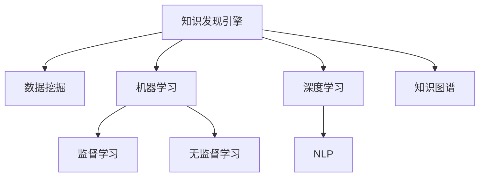

                 

# 知识发现引擎如何改变科研模式

## 1. 背景介绍

### 1.1 问题由来
在科学研究和学术探索中，传统的数据驱动方法往往依赖于手工提取的特征进行模型训练，这一过程耗时耗力，且受限于人类主观认知的局限性。近年来，随着大数据技术的不断成熟和计算资源的日益丰富，知识发现引擎(Knowledge Discovery Engine, KDE)以其高效、自动化的优势，正在逐步改变科研模式，引发了科学界、工程界乃至全社会的广泛关注。

### 1.2 问题核心关键点
知识发现引擎是一种基于人工智能技术，通过深度学习和自然语言处理(NLP)等手段，从海量数据中自动发现知识、揭示模式、预测趋势、辅助决策的技术工具。其核心特点包括：
1. **自动化**：知识发现引擎通过机器学习算法自动提取特征、构建模型、优化参数，大幅降低科研人员的劳动强度。
2. **高效率**：利用先进的算法和大规模计算资源，知识发现引擎能够快速处理海量数据，显著提高科研效率。
3. **泛化性强**：不受人类认知限制，知识发现引擎可以发现模式、揭示规律，辅助人类进行更深层次的科学探索。

## 2. 核心概念与联系

### 2.1 核心概念概述

为更好地理解知识发现引擎如何改变科研模式，本节将介绍几个密切相关的核心概念：

- **知识发现引擎(KDE)**：基于人工智能技术，自动从数据中发现知识、揭示模式、预测趋势的技术引擎。常见的KDE包括数据挖掘、机器学习、深度学习、NLP等算法和模型。
- **数据挖掘(Data Mining)**：通过统计、分析和建模等手段，自动发现数据中的知识、规律和模式的技术。
- **机器学习(Machine Learning)**：通过算法和模型，使计算机从数据中自动学习规律、预测结果的技术。
- **深度学习(Deep Learning)**：一种通过多层神经网络进行特征提取和模式识别的高级机器学习方法，能够处理非结构化数据，如文本、图像等。
- **自然语言处理(NLP)**：使计算机理解、处理和生成自然语言的技术，包括语言模型、文本分类、命名实体识别等。
- **知识图谱(Knowledge Graph)**：一种以图结构表示实体与关系的网络，用于组织和管理各类知识。
- **深度学习模型**：如卷积神经网络(CNN)、循环神经网络(RNN)、Transformer等，通过大量数据训练，能够自动提取数据特征，发现规律。
- **监督学习(Supervised Learning)**：在已知标签的数据上进行训练，以预测新数据的标签。
- **无监督学习(Unsupervised Learning)**：在没有标签的数据上进行训练，以发现数据的内在结构和模式。

这些核心概念之间的逻辑关系可以通过以下Mermaid流程图来展示：



这个流程图展示出知识发现引擎的核心概念及其之间的关系：

1. 知识发现引擎基于多种技术手段，从海量数据中自动发现知识。
2. 数据挖掘是发现知识的基础方法，通过统计和建模揭示数据规律。
3. 机器学习和深度学习是发现知识的关键技术，通过算法模型自动学习规律。
4. 自然语言处理技术使知识发现引擎能够处理文本等非结构化数据。
5. 知识图谱用于组织和管理知识，提供结构化知识库支持。
6. 监督学习和无监督学习是发现知识的两种主要方法，各有侧重。

这些核心概念共同构成了知识发现引擎的技术框架，使其能够在各种应用场景下发挥强大的知识发现能力。

## 3. 核心算法原理 & 具体操作步骤
### 3.1 算法原理概述

知识发现引擎的核心原理在于利用机器学习和深度学习等算法，从大规模数据中自动提取特征、建立模型、发现规律。其核心算法原理包括以下几个关键点：

- **特征提取**：自动从原始数据中提取有意义的特征，作为模型输入。
- **模型训练**：利用训练数据对模型进行训练，使模型学习到数据中的规律和模式。
- **模型评估**：通过测试集对模型进行评估，衡量模型的预测性能和泛化能力。
- **模型优化**：通过超参数调优、模型集成等手段，提升模型性能。

### 3.2 算法步骤详解

知识发现引擎的一般步骤包括：

**Step 1: 数据预处理**
- 收集、清洗、标注数据，准备用于训练和测试的数据集。
- 数据增强、特征工程等预处理步骤，提升数据质量。

**Step 2: 模型选择与训练**
- 选择合适的算法和模型，如K-means、决策树、SVM、神经网络等。
- 设置模型超参数，如学习率、迭代次数等，进行模型训练。

**Step 3: 模型评估与调优**
- 使用测试集对模型进行评估，如准确率、召回率、F1分数等。
- 根据评估结果调整模型，如增加正则化、调整超参数等。

**Step 4: 模型应用**
- 将优化后的模型应用于实际问题，进行知识发现和预测。
- 监控模型性能，定期重新训练模型以应对数据变化。

### 3.3 算法优缺点

知识发现引擎具有以下优点：
1. 自动化高效：通过算法自动发现数据中的规律，大幅降低科研人员的工作量。
2. 泛化能力强：不受人类主观认知限制，能发现更深层、更全面的知识。
3. 动态适应：能够实时更新模型，应对数据分布的变化。

同时，知识发现引擎也存在一些局限性：
1. 数据质量要求高：对数据的标注和清洗要求较高，需要大量的高质量标注数据。
2. 模型复杂度高：深度学习等算法模型复杂，训练和调优难度较大。
3. 可解释性不足：许多模型如深度学习、神经网络等，其决策过程难以解释，缺乏透明性。
4. 资源消耗大：算法复杂，计算资源消耗较大，训练和推理速度较慢。

尽管存在这些局限性，但知识发现引擎在许多科研领域的应用已经取得了显著成果，未来仍有巨大的发展潜力。

### 3.4 算法应用领域

知识发现引擎的应用领域非常广泛，涵盖了科学研究的各个方面：

- **生物医学研究**：通过分析基因组数据、生物信息学数据，自动发现基因表达模式、药物靶点等知识。
- **金融经济分析**：通过处理海量金融数据，自动发现市场趋势、预测股票价格等。
- **环境保护**：通过处理气象数据、环境监测数据，自动发现环境变化规律，辅助决策。
- **社会科学研究**：通过分析社会调查数据，自动发现社会现象、预测社会趋势。
- **工业制造**：通过处理生产数据、质量检测数据，自动发现生产流程中的异常和改进机会。
- **能源开发**：通过分析能源数据，自动发现能源分布规律，优化能源利用。
- **农业研究**：通过处理农业数据，自动发现农业种植规律，提高农业生产效率。
- **教育研究**：通过分析学生数据，自动发现学习模式、预测学生成绩等。

知识发现引擎在上述领域的应用，不仅提高了科研效率，还揭示了数据中隐藏的知识和规律，为科研创新提供了新思路。

## 4. 数学模型和公式 & 详细讲解 & 举例说明

### 4.1 数学模型构建

知识发现引擎的核心模型通常基于统计学习理论和机器学习算法构建。本节将介绍一种典型的监督学习模型——支持向量机(Support Vector Machine, SVM)，并通过具体案例讲解其应用。

### 4.2 公式推导过程

假设我们有一组训练数据集$D=\{(x_i, y_i)\}_{i=1}^N$，其中$x_i \in \mathbb{R}^d$为输入特征，$y_i \in \{-1, 1\}$为标签。我们的目标是找到一个超平面$\mathbf{w} \in \mathbb{R}^d$，将不同标签的数据分开，同时保证分类边界的最大间隔。

SVM的目标函数可以表示为：

$$
\mathop{\min}_{\mathbf{w}, b} \frac{1}{2}\|\mathbf{w}\|^2 + C\sum_{i=1}^N \ell(y_i, \langle \mathbf{w}, x_i \rangle + b)
$$

其中，$\|\mathbf{w}\|^2$为正则化项，$C$为正则化系数，$\ell$为损失函数，如$0-1$损失函数。

为了求解上述优化问题，SVM引入了拉格朗日乘子$\alpha$，通过构造拉格朗日函数：

$$
\mathcal{L}(\mathbf{w}, b, \alpha) = \frac{1}{2}\|\mathbf{w}\|^2 + C\sum_{i=1}^N \alpha_i(y_i - \langle \mathbf{w}, x_i \rangle - b) + \sum_{i=1}^N \alpha_i
$$

利用对偶化技巧，将原问题转换为对偶问题：

$$
\mathop{\min}_{\alpha} \frac{1}{2}\sum_{i=1}^N \sum_{j=1}^N \alpha_i \alpha_j y_i y_j \langle x_i, x_j \rangle - \sum_{i=1}^N \alpha_i - \frac{1}{2}C\sum_{i=1}^N \alpha_i^2
$$

求解上述问题，得到拉格朗日乘子$\alpha$，再通过$\alpha$回代计算出$\mathbf{w}$和$b$，得到最终的分类模型：

$$
f(x) = \langle \mathbf{w}, x \rangle + b
$$

### 4.3 案例分析与讲解

以信用风险评估为例，我们可以使用SVM模型进行分类。假设我们有历史客户的信用数据，其中包含客户的收入、年龄、性别、消费习惯等特征，以及其是否违约的标签。

我们可以将数据集分为训练集和测试集，然后通过SVM模型训练得到分类器。具体步骤如下：

1. **数据预处理**：收集客户数据，并进行数据清洗、特征选择等预处理。
2. **特征工程**：设计特征工程策略，如特征提取、数据变换等。
3. **模型训练**：使用训练集对SVM模型进行训练，得到最优的分类超平面。
4. **模型评估**：在测试集上评估模型性能，如准确率、召回率、F1分数等。
5. **模型应用**：将优化后的模型应用于新客户的信用风险评估，预测其是否可能违约。

通过SVM模型，我们可以自动化地发现不同特征对信用风险的影响，揭示隐藏在数据中的模式和规律，为风险评估提供科学依据。

## 5. 项目实践：代码实例和详细解释说明

### 5.1 开发环境搭建

在进行知识发现引擎项目实践前，我们需要准备好开发环境。以下是使用Python进行Scikit-learn开发的完整环境配置流程：

1. 安装Anaconda：从官网下载并安装Anaconda，用于创建独立的Python环境。

2. 创建并激活虚拟环境：
```bash
conda create -n sklearn-env python=3.8 
conda activate sklearn-env
```

3. 安装Scikit-learn：
```bash
pip install scikit-learn
```

4. 安装各类工具包：
```bash
pip install numpy pandas scikit-learn matplotlib tqdm jupyter notebook ipython
```

完成上述步骤后，即可在`sklearn-env`环境中开始知识发现引擎的实践。

### 5.2 源代码详细实现

下面我们以信用风险评估为例，给出使用Scikit-learn对SVM模型进行项目实践的完整代码实现。

首先，定义数据处理函数：

```python
import pandas as pd
from sklearn.model_selection import train_test_split
from sklearn.preprocessing import StandardScaler

def load_data():
    df = pd.read_csv('credit_data.csv')
    X = df.drop('default', axis=1)
    y = df['default']
    X_train, X_test, y_train, y_test = train_test_split(X, y, test_size=0.2, random_state=42)
    scaler = StandardScaler()
    X_train = scaler.fit_transform(X_train)
    X_test = scaler.transform(X_test)
    return X_train, X_test, y_train, y_test
```

然后，定义模型训练函数：

```python
from sklearn.svm import SVC
from sklearn.metrics import accuracy_score

def train_model(X_train, X_test, y_train, y_test):
    svm = SVC(C=1.0, kernel='linear', random_state=42)
    svm.fit(X_train, y_train)
    y_pred = svm.predict(X_test)
    acc = accuracy_score(y_test, y_pred)
    print(f'Accuracy: {acc:.2f}')
```

最后，启动训练流程并在测试集上评估：

```python
X_train, X_test, y_train, y_test = load_data()
train_model(X_train, X_test, y_train, y_test)
```

以上就是使用Scikit-learn进行信用风险评估的完整代码实现。可以看到，得益于Scikit-learn的强大封装，我们可以用相对简洁的代码完成SVM模型的训练和评估。

### 5.3 代码解读与分析

让我们再详细解读一下关键代码的实现细节：

**load_data函数**：
- 读取CSV文件，将其分为特征和标签两部分。
- 使用`train_test_split`函数将数据集分为训练集和测试集，各占总数据的20%。
- 使用`StandardScaler`对特征进行标准化处理，提升模型训练效果。

**train_model函数**：
- 定义SVM模型，设置超参数`C`和`kernel`。
- 使用训练数据对模型进行拟合，得到最优的超平面。
- 在测试集上预测新样本，并计算准确率。

**训练流程**：
- 加载训练数据，进行标准化处理。
- 定义SVM模型，设置超参数。
- 训练模型，并在测试集上评估模型性能。

可以看到，Scikit-learn提供的接口简洁明了，便于开发者快速上手实验。

## 6. 实际应用场景

### 6.1 智能制造

在智能制造领域，知识发现引擎可以用于生产过程监控、设备故障预测、生产效率优化等。通过分析生产数据，自动发现生产过程中的异常，预测设备故障，优化生产流程，提升生产效率。

具体而言，可以收集生产设备的历史数据，包括设备状态、运行参数、环境条件等，使用知识发现引擎自动提取特征，建立预测模型。模型可以用于预测设备故障、优化生产参数、调整生产流程，从而提升生产效率，降低生产成本。

### 6.2 医疗健康

在医疗健康领域，知识发现引擎可以用于疾病诊断、药物研发、患者管理等。通过分析患者的病历数据、基因数据、治疗数据等，自动发现疾病的早期预警信号，辅助医生进行诊断和治疗决策。

具体而言，可以收集患者的电子病历、基因测序数据、治疗记录等，使用知识发现引擎自动提取特征，建立预测模型。模型可以用于预测疾病风险、推荐治疗方案、优化治疗路径，从而提升医疗服务质量，降低医疗成本。

### 6.3 金融风控

在金融风控领域，知识发现引擎可以用于信用评估、欺诈检测、市场预测等。通过分析历史交易数据、客户数据、市场数据等，自动发现风险信号，预测信用风险、欺诈行为、市场趋势等。

具体而言，可以收集历史交易数据、客户基本信息、市场数据等，使用知识发现引擎自动提取特征，建立预测模型。模型可以用于预测客户信用风险、检测欺诈行为、预测市场趋势，从而提升风险控制能力，保障金融安全。

### 6.4 未来应用展望

随着知识发现引擎技术的不断发展，其在各领域的应用将更加广泛，为科研创新和社会进步提供新的动力。

未来，知识发现引擎将更深入地应用于智慧城市、智慧农业、智慧交通等领域，推动各行业的智能化转型。知识发现引擎有望在更多场景下实现知识自动化发现，提高决策的科学性和效率性，为经济社会发展注入新的活力。

## 7. 工具和资源推荐

### 7.1 学习资源推荐

为了帮助开发者系统掌握知识发现引擎的理论基础和实践技巧，这里推荐一些优质的学习资源：

1. 《数据挖掘导论》（Introduction to Data Mining）：经典数据挖掘教材，涵盖数据挖掘的基本概念、算法和应用。
2. 《机器学习》（Pattern Recognition and Machine Learning）：机器学习领域的经典教材，介绍了机器学习的基础理论和算法。
3. 《深度学习》（Deep Learning）：深度学习领域的经典教材，介绍了深度学习的基本概念、模型和应用。
4. 《自然语言处理综论》（Speech and Language Processing）：自然语言处理领域的经典教材，介绍了NLP的基础理论和应用。
5. 《知识图谱与语义网络》（Knowledge Graphs and Semantic Networks）：介绍知识图谱的基本概念、构建方法和应用。
6. 《Python机器学习》（Python Machine Learning）：基于Python的机器学习实战教程，涵盖Scikit-learn、TensorFlow等库的使用。
7. Kaggle平台：数据科学竞赛平台，提供海量数据集和模型竞赛，帮助开发者提升实践能力。

通过对这些资源的学习实践，相信你一定能够快速掌握知识发现引擎的精髓，并用于解决实际的科研问题。

### 7.2 开发工具推荐

高效的开发离不开优秀的工具支持。以下是几款用于知识发现引擎开发的常用工具：

1. Python：基于Python的数据科学和机器学习库，如Pandas、NumPy、Scikit-learn等，功能强大，易于使用。
2. Scikit-learn：基于Python的机器学习库，提供丰富的算法和模型，易于集成使用。
3. TensorFlow：由Google主导开发的深度学习框架，生产部署方便，适合大规模工程应用。
4. PyTorch：基于Python的深度学习框架，灵活动态，适合快速迭代研究。
5. Hadoop：大数据处理和分布式计算平台，能够处理海量数据，提升数据处理效率。
6. Spark：大数据处理和分布式计算框架，能够高效处理大规模数据，提供丰富的机器学习库。
7. Jupyter Notebook：交互式开发环境，支持Python、R、SQL等多种语言，方便调试和分享。
8. Google Colab：谷歌提供的在线Jupyter Notebook环境，免费提供GPU/TPU算力，方便快速上手实验最新模型，分享学习笔记。

合理利用这些工具，可以显著提升知识发现引擎的开发效率，加快创新迭代的步伐。

### 7.3 相关论文推荐

知识发现引擎的研究始于学界的持续探索。以下是几篇奠基性的相关论文，推荐阅读：

1. "A framework of data mining in scientific discovery"（数据挖掘在科学发现中的应用框架）：提出科学发现中的数据挖掘框架，介绍了数据挖掘在科学领域中的应用。
2. "An introduction to statistical learning"（统计学习导论）：介绍了统计学习的基本概念和算法，为知识发现引擎的研究提供了理论基础。
3. "A Tutorial on Support Vector Machines for Pattern Recognition"（支持向量机在模式识别中的应用教程）：介绍了支持向量机的基本概念和算法，为知识发现引擎中的分类任务提供了技术支持。
4. "Deep learning in natural language processing"（深度学习在自然语言处理中的应用）：介绍了深度学习在自然语言处理中的应用，为知识发现引擎中的文本处理任务提供了技术支持。
5. "Knowledge Discovery in Databases: Concepts and Techniques"（数据库中的知识发现：概念和技术）：介绍了数据库中的知识发现技术，为知识发现引擎的研究提供了技术参考。
6. "GNN: A Survey on Graph Neural Networks"（图神经网络：综述）：介绍了图神经网络的基本概念和算法，为知识发现引擎中的图数据处理提供了技术支持。
7. "A Survey on Knowledge Discovery and Data Mining in Business Intelligence"（商业智能中的知识发现和数据挖掘综述）：介绍了商业智能中的知识发现和数据挖掘技术，为知识发现引擎在商业领域的应用提供了理论基础。

这些论文代表了大规模知识发现引擎的研究脉络，通过学习这些前沿成果，可以帮助研究者把握学科前进方向，激发更多的创新灵感。

## 8. 总结：未来发展趋势与挑战

### 8.1 研究成果总结

知识发现引擎技术在科学研究、企业应用、政府决策等领域已经取得了显著成果，展示了其在知识自动化发现方面的巨大潜力。通过数据挖掘、机器学习、深度学习等技术手段，知识发现引擎能够从海量数据中自动提取特征、建立模型、发现规律，为科研创新和决策支持提供了新的工具和方法。

### 8.2 未来发展趋势

展望未来，知识发现引擎技术将呈现以下几个发展趋势：

1. **多模态融合**：未来知识发现引擎将更多地考虑多种数据模态（如文本、图像、视频等）的融合，提升跨领域知识的发现能力。
2. **深度学习和大规模计算**：随着深度学习和大规模计算资源的发展，知识发现引擎将能够处理更加复杂、更加庞大的数据集。
3. **可解释性提升**：未来知识发现引擎将更加注重模型的可解释性，使决策过程更加透明、可控。
4. **自动化增强**：通过自动化算法、自动化模型构建等手段，知识发现引擎将实现更加高效、自动化的知识发现。
5. **实时化应用**：未来知识发现引擎将更多地应用于实时数据处理和决策支持，实现动态化、实时化的知识发现。
6. **多学科交叉**：知识发现引擎将与其他领域的技术进行更多交叉融合，如计算机视觉、自然语言处理、地理信息系统等，拓展知识发现的应用范围。
7. **数据源多样化**：未来知识发现引擎将更多地利用多样化的数据源，如社交媒体、传感器数据、物联网数据等，提升知识发现的多样性和全面性。
8. **知识图谱应用**：知识图谱将在知识发现引擎中发挥更大作用，提供结构化知识库支持，提升知识发现的效果和效率。

### 8.3 面临的挑战

尽管知识发现引擎技术已经取得了显著成果，但在迈向更加智能化、普适化应用的过程中，仍面临诸多挑战：

1. **数据质量问题**：高质量、大规模标注数据的需求仍然较高，数据质量问题可能限制知识发现引擎的泛化能力。
2. **模型复杂性**：深度学习等复杂模型需要大量的计算资源和专家知识，模型的训练和调优难度较大。
3. **可解释性不足**：许多模型如深度学习、神经网络等，其决策过程难以解释，缺乏透明性。
4. **资源消耗大**：算法复杂，计算资源消耗较大，训练和推理速度较慢。
5. **多学科交叉复杂**：知识发现引擎的多学科交叉应用需要跨领域知识的融合和协同，难度较大。
6. **实时化应用挑战**：实时化应用需要高效的算法和资源支持，目前仍需进一步优化。

### 8.4 研究展望

面对知识发现引擎所面临的种种挑战，未来的研究需要在以下几个方面寻求新的突破：

1. **自动化算法开发**：开发更加自动化、智能化的算法，提升知识发现引擎的自动化水平。
2. **多学科融合应用**：与其他学科的技术进行更多交叉融合，提升知识发现引擎的全面性和应用深度。
3. **高效计算资源**：开发高效、可扩展的计算资源管理技术，提升知识发现引擎的计算效率。
4. **可解释性提升**：开发可解释性强的算法和模型，使知识发现引擎的决策过程更加透明、可控。
5. **知识图谱应用**：进一步探索知识图谱在知识发现中的应用，提升知识发现引擎的效果和效率。
6. **数据质量提升**：探索高效、自动化的数据标注方法，提升数据质量，降低知识发现引擎的泛化难度。

这些研究方向的探索，必将引领知识发现引擎技术迈向更高的台阶，为科学研究和社会进步提供更加强大的支持。面向未来，知识发现引擎将与人工智能、大数据、物联网等技术深度融合，共同推动知识自动化的发展，为构建智能社会做出更大的贡献。

## 9. 附录：常见问题与解答

**Q1：知识发现引擎与数据挖掘有什么区别？**

A: 知识发现引擎与数据挖掘在本质上是相似的，都旨在从数据中自动发现知识、揭示模式和规律。但知识发现引擎更强调知识自动化的发现，通过多种技术和算法，实现更加全面、高效的知识发现。而数据挖掘更侧重于统计和建模，着重于数据的描述和解释。

**Q2：知识发现引擎在科研中的应用有哪些？**

A: 知识发现引擎在科研中的应用非常广泛，包括：
1. **生物医学研究**：通过分析基因组数据、生物信息学数据，自动发现基因表达模式、药物靶点等知识。
2. **金融经济分析**：通过处理海量金融数据，自动发现市场趋势、预测股票价格等。
3. **环境保护**：通过处理气象数据、环境监测数据，自动发现环境变化规律，辅助决策。
4. **社会科学研究**：通过分析社会调查数据，自动发现社会现象、预测社会趋势。
5. **工业制造**：通过处理生产数据、质量检测数据，自动发现生产流程中的异常和改进机会。
6. **能源开发**：通过分析能源数据，自动发现能源分布规律，优化能源利用。
7. **农业研究**：通过处理农业数据，自动发现农业种植规律，提高农业生产效率。
8. **教育研究**：通过分析学生数据，自动发现学习模式、预测学生成绩等。

**Q3：知识发现引擎的算法模型有哪些？**

A: 知识发现引擎的算法模型主要包括以下几类：
1. **统计模型**：如线性回归、逻辑回归、决策树等，用于建立数据模型，发现数据规律。
2. **机器学习模型**：如支持向量机、K-means、SVM等，用于自动提取特征，建立分类模型。
3. **深度学习模型**：如卷积神经网络、循环神经网络、Transformer等，用于处理非结构化数据，提取数据特征。
4. **自然语言处理模型**：如文本分类、命名实体识别、情感分析等，用于处理文本数据，提取语义信息。
5. **知识图谱模型**：如RDF、本体图等，用于组织和管理知识，提供结构化知识库支持。

这些模型各自有其优缺点，开发者应根据具体任务选择合适的模型进行应用。

**Q4：知识发现引擎的开发流程有哪些？**

A: 知识发现引擎的开发流程主要包括以下步骤：
1. **数据预处理**：收集、清洗、标注数据，准备用于训练和测试的数据集。
2. **特征工程**：设计特征工程策略，如特征提取、数据变换等。
3. **模型选择与训练**：选择合适的算法和模型，设置模型超参数，进行模型训练。
4. **模型评估与调优**：使用测试集对模型进行评估，如准确率、召回率、F1分数等。根据评估结果调整模型，如增加正则化、调整超参数等。
5. **模型应用**：将优化后的模型应用于实际问题，进行知识发现和预测。

**Q5：知识发现引擎的算法调优有哪些方法？**

A: 知识发现引擎的算法调优主要包括以下几种方法：
1. **正则化**：通过添加正则化项，防止模型过拟合，提升泛化能力。
2. **交叉验证**：通过交叉验证评估模型性能，选择最优模型。
3. **超参数调优**：通过网格搜索、随机搜索等方法，寻找最优超参数组合。
4. **模型集成**：通过模型集成，如Bagging、Boosting等，提升模型性能。
5. **自适应算法**：通过自适应算法，如在线学习、增量学习等，实时更新模型，提升实时性。

这些调优方法需要根据具体任务进行灵活选择和组合。

**Q6：知识发现引擎在企业应用中有哪些具体场景？**

A: 知识发现引擎在企业应用中的具体场景包括：
1. **客户关系管理**：通过分析客户数据，自动发现客户行为模式，提供个性化服务。
2. **市场营销**：通过分析市场数据，自动发现市场趋势，优化营销策略。
3. **供应链管理**：通过分析供应链数据，自动发现供应链瓶颈，优化供应链管理。
4. **人力资源管理**：通过分析员工数据，自动发现员工绩效和职业发展规律，提供人力资源支持。
5. **金融风险控制**：通过分析金融数据，自动发现风险信号，优化风险控制策略。
6. **运营效率提升**：通过分析生产数据，自动发现生产流程中的问题，提升运营效率。
7. **产品开发**：通过分析用户反馈和市场数据，自动发现产品需求，优化产品开发策略。
8. **决策支持**：通过分析多领域数据，自动发现关联规律，提供决策支持。

这些场景展示了知识发现引擎在企业应用中的广泛应用，为企业的智能化转型提供了新的思路和工具。

---

作者：禅与计算机程序设计艺术 / Zen and the Art of Computer Programming

