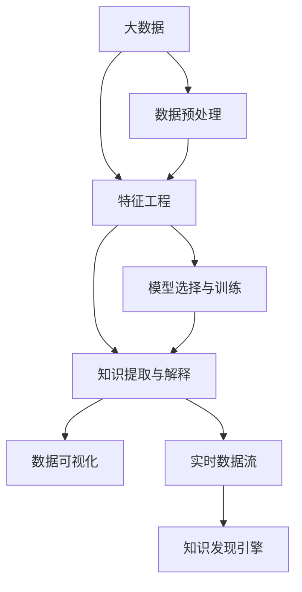

                 

# 知识发现引擎如何改变程序员的工作方式

> 关键词：知识发现引擎,数据挖掘,机器学习,大数据,程序员效率,数据洞察

## 1. 背景介绍

在当今数字化时代，数据已经成为了企业核心资产的重要组成部分。如何有效利用大数据，从中提取有价值的信息，成为各类企业和组织关注的焦点。特别是对于程序员而言，如何通过数据驱动决策，提升工作效率，减少重复劳动，是他们面临的现实问题。为此，知识发现引擎(Knowledge Discovery Engine, KDE)应运而生，通过数据挖掘、机器学习等技术，从海量数据中自动化地发现和提取知识，大幅提升了程序员的工作效率和数据洞察力。

### 1.1 问题由来

在传统的软件开发过程中，程序员往往需要花费大量时间和精力在数据处理和信息查询上。比如，需要在数据库中查询某个功能模块的运行情况，需要手工编写SQL语句，不仅效率低，还容易出错。另外，当需要进行大规模数据分析或决策支持时，通常需要人工分析数据报表，工作量大且复杂度高，导致决策延迟。

大数据技术的广泛应用，虽然为数据处理提供了强大工具，但海量数据的复杂性也带来了新的挑战。如何自动化地从数据中提取有价值的信息，并快速应用于软件开发和决策分析，成为提高程序员工作效率的关键问题。

### 1.2 问题核心关键点

知识发现引擎的核心在于通过机器学习和数据挖掘技术，自动化地从大数据中发现和提取知识。其关键点包括：

- 数据预处理：清洗、转换和整合海量数据，使其适合机器学习算法处理。
- 特征工程：提取和构建数据特征，构建数据表示和模型训练的基础。
- 模型选择与训练：根据数据特征选择合适的机器学习模型，进行训练和调优。
- 知识提取与解释：利用模型预测结果，提取有价值的知识，并提供解释性的可视化结果。
- 应用集成：将知识发现引擎与软件开发工具、决策支持系统等集成，形成一站式知识服务。

这些关键技术环节，为程序员的工作带来了革命性的变化，使得他们能够更专注于业务逻辑和算法创新，而不是陷入数据处理的琐碎工作中。

## 2. 核心概念与联系

### 2.1 核心概念概述

为更好地理解知识发现引擎及其对程序员工作方式的影响，本节将介绍几个核心概念：

- **知识发现引擎(KDE)**：利用数据挖掘、机器学习等技术，从大数据中发现和提取知识的系统。
- **数据挖掘(Data Mining)**：从大量数据中，发现和提取有价值的知识、信息和模式的过程。
- **机器学习(Machine Learning)**：通过数据训练模型，让模型具备预测和决策能力。
- **大数据(Big Data)**：具有体量大、种类多、速度快和价值密度低特点的数据集合。
- **数据可视化(Data Visualization)**：将数据以图形或图像的形式展现，帮助理解数据特征和趋势。
- **实时数据流(Real-time Data Stream)**：即时产生的数据流，要求系统能够实时处理和分析。

这些核心概念之间的逻辑关系可以通过以下Mermaid流程图来展示：



这个流程图展示了大数据到知识发现的各个关键步骤及其之间的联系：

1. 大数据通过数据预处理，提取出适合机器学习的特征。
2. 通过特征工程，选择合适的模型并进行训练。
3. 利用模型进行知识提取和解释。
4. 结合数据可视化和实时数据流，将知识自动化呈现给用户。
5. 整个过程由知识发现引擎KDE集成实现，为程序员提供数据驱动的决策支持。

## 3. 核心算法原理 & 具体操作步骤
### 3.1 算法原理概述

知识发现引擎的核心算法原理包括数据预处理、特征工程、模型选择与训练、知识提取与解释。这些步骤相互关联，共同构成了知识发现引擎的工作流程。

### 3.2 算法步骤详解

**Step 1: 数据预处理**

数据预处理是知识发现引擎的首要步骤，其目的是清洗、转换和整合数据，使其适合后续的数据挖掘和机器学习处理。具体步骤如下：

1. 数据清洗：删除重复数据、修正数据错误、处理缺失值等。
2. 数据转换：标准化、归一化、特征编码等。
3. 数据整合：数据集成、数据融合等。

**Step 2: 特征工程**

特征工程是将原始数据转换为可供机器学习算法使用的特征的过程。其目的是提取和构建对模型有用的数据特征，构建数据表示和模型训练的基础。

1. 特征提取：选择和提取重要的特征变量。
2. 特征选择：从众多特征中选择最具代表性的特征。
3. 特征构造：通过算法生成新的特征变量。

**Step 3: 模型选择与训练**

根据数据特征选择合适的机器学习模型，进行训练和调优。模型选择与训练步骤如下：

1. 选择模型：根据数据类型和问题性质选择合适的模型（如线性回归、决策树、神经网络等）。
2. 模型训练：利用训练数据集，通过优化算法训练模型。
3. 模型调优：通过交叉验证等方法，调优模型超参数，提升模型性能。

**Step 4: 知识提取与解释**

利用模型预测结果，提取有价值的知识，并提供解释性的可视化结果。知识提取与解释步骤如下：

1. 模型预测：将新数据输入模型，得到预测结果。
2. 知识提取：从预测结果中提取有价值的信息。
3. 知识解释：通过数据可视化等方式，解释知识发现的过程和结果。

### 3.3 算法优缺点

知识发现引擎具有以下优点：

- **自动化**：自动化地从大数据中发现和提取知识，节省大量手工处理数据的时间。
- **可扩展性**：适用于海量数据处理，易于扩展到大规模数据集。
- **精确性**：通过机器学习算法，获得高精度的预测和决策支持。
- **可视化**：通过数据可视化技术，直观展示发现的知识和趋势。

但同时，该方法也存在以下局限性：

- **数据质量依赖**：依赖于原始数据的完整性和准确性，数据质量差可能导致结果偏差。
- **算法复杂性**：机器学习算法和特征工程较为复杂，需要较高技术门槛。
- **模型解释性不足**：复杂的模型可能难以解释其内部决策过程，导致对结果的理解困难。
- **实时性不足**：处理大规模数据时，响应速度较慢，难以实现实时分析。

### 3.4 算法应用领域

知识发现引擎在多个领域得到了广泛应用，特别是对程序员工作效率的提升具有显著作用：

1. **软件开发**：通过分析项目依赖关系、代码质量、性能瓶颈等数据，提供代码优化建议，减少开发周期和错误率。
2. **测试自动化**：自动发现和修复测试用例中的缺陷，提升软件测试的覆盖率和质量。
3. **运维监控**：实时监控系统性能指标，预测异常，提高系统的可靠性和稳定性。
4. **数据仓库**：从大量历史数据中提取有价值的趋势和模式，支持决策支持系统。
5. **市场营销**：分析客户行为数据，发现市场趋势，优化营销策略。

## 4. 数学模型和公式 & 详细讲解 & 举例说明

### 4.1 数学模型构建

本节将使用数学语言对知识发现引擎的工作原理进行严格的数学建模。

记大数据集为 $D=\{(x_i, y_i)\}_{i=1}^N$，其中 $x_i$ 表示数据样本，$y_i$ 表示标签。知识发现引擎的目标是从数据集中学习一个预测函数 $f(x)$，使其能够对新数据 $x'$ 进行准确预测。

定义训练误差为：

$$
\mathcal{L}(f)=\frac{1}{N}\sum_{i=1}^N \ell(f(x_i),y_i)
$$

其中 $\ell$ 为损失函数，如均方误差、交叉熵等。

知识发现引擎的优化目标是最小化预测误差，即：

$$
f^*=\mathop{\arg\min}_{f}\mathcal{L}(f)
$$

在实际应用中，知识发现引擎通常通过构建机器学习模型 $M=\{w,b\}$，其中 $w$ 为模型参数，$b$ 为偏置项。模型通过训练数据集 $D$，优化参数 $w$ 和 $b$，使得模型能够最小化损失函数 $\mathcal{L}(f)$。

### 4.2 公式推导过程

以线性回归模型为例，推导其数学推导过程。

线性回归模型形式为 $y=f(x)=w\cdot x+b$，其中 $w$ 为模型权重，$b$ 为偏置项。

定义损失函数为均方误差损失：

$$
\ell(f(x),y)=\frac{1}{2}(x-f(x))^2
$$

将模型带入损失函数：

$$
\mathcal{L}(w,b)=\frac{1}{2N}\sum_{i=1}^N (y_i-w\cdot x_i-b)^2
$$

优化目标为：

$$
\mathcal{L}(w,b)=\mathop{\arg\min}_{w,b}\mathcal{L}(w,b)
$$

利用梯度下降等优化算法，求导并解方程得到最优解：

$$
w=\frac{1}{N}\sum_{i=1}^N x_iy_i
$$
$$
b=\bar{y}-\frac{1}{N}\sum_{i=1}^N x_iw
$$

其中 $\bar{y}=\frac{1}{N}\sum_{i=1}^N y_i$ 为数据集均值。

### 4.3 案例分析与讲解

以程序员编码行为分析为例，利用知识发现引擎进行代码质量评估。

1. 数据预处理：从版本控制系统如Git中提取代码提交记录，清洗和转换数据。
2. 特征工程：选择代码行数、复杂度、提交次数、作者信息等特征变量。
3. 模型选择与训练：选择回归模型，利用训练数据集训练模型。
4. 知识提取与解释：提取代码质量评分，解释评分结果，如代码行数与复杂度的关系。

## 5. 项目实践：代码实例和详细解释说明

### 5.1 开发环境搭建

在进行知识发现引擎实践前，我们需要准备好开发环境。以下是使用Python进行Scikit-learn开发的开发环境配置流程：

1. 安装Anaconda：从官网下载并安装Anaconda，用于创建独立的Python环境。

2. 创建并激活虚拟环境：
```bash
conda create -n kde-env python=3.8 
conda activate kde-env
```

3. 安装Scikit-learn：从官网获取安装命令。例如：
```bash
conda install scikit-learn numpy pandas matplotlib jupyter notebook ipython
```

完成上述步骤后，即可在`kde-env`环境中开始知识发现引擎的实践。

### 5.2 源代码详细实现

下面我们以程序员编码行为分析为例，给出使用Scikit-learn库进行线性回归分析的Python代码实现。

首先，定义数据预处理和特征工程函数：

```python
import pandas as pd
from sklearn.preprocessing import StandardScaler
from sklearn.linear_model import LinearRegression

def preprocess_data(data):
    # 数据清洗
    data = data.drop_duplicates()
    data = data.dropna()
    
    # 数据转换
    data['complexity'] = data['complexity'].apply(lambda x: np.log(x) if x > 0 else 0)
    data['submits'] = data['submits'].apply(lambda x: x if x > 0 else 0)
    
    # 标准化处理
    scaler = StandardScaler()
    data['submits'], data['complexity'], data['rows'] = scaler.fit_transform(data[['submits', 'complexity', 'rows']])
    
    return data

def feature_engineering(data):
    # 特征提取
    data = data.drop(columns=['filename', 'author'])
    data['code_length'] = data['rows'] * data['complexity']
    data['lines_per_submits'] = data['rows'] / data['submits']
    
    # 特征选择
    data = data.drop(columns=['commit_message'])
    
    return data
```

然后，定义模型训练和预测函数：

```python
def train_model(X_train, y_train):
    model = LinearRegression()
    model.fit(X_train, y_train)
    return model

def predict_quality(model, X_test):
    y_pred = model.predict(X_test)
    return y_pred
```

最后，启动训练流程并在测试集上评估：

```python
from sklearn.model_selection import train_test_split

# 数据加载和预处理
data = pd.read_csv('code_data.csv')
data = preprocess_data(data)

# 数据分割
X = data.drop(columns=['code_quality'])
y = data['code_quality']
X_train, X_test, y_train, y_test = train_test_split(X, y, test_size=0.2, random_state=42)

# 模型训练
model = train_model(X_train, y_train)

# 模型评估
print('Code quality prediction:', predict_quality(model, X_test))
```

以上就是使用Scikit-learn库进行线性回归分析的完整代码实现。可以看到，Scikit-learn库提供了丰富的机器学习模型和工具函数，使得知识发现引擎的开发变得相对简单和高效。

### 5.3 代码解读与分析

让我们再详细解读一下关键代码的实现细节：

**preprocess_data函数**：
- `drop_duplicates`：去除重复数据。
- `dropna`：去除缺失值。
- `apply`：对复杂度变量进行对数转换。
- `StandardScaler`：对提交次数和代码行数进行标准化处理。

**feature_engineering函数**：
- `drop`：去除无关特征列。
- `apply`：计算代码行数与提交次数的比值。
- `drop`：去除提交信息。

**train_model函数**：
- `LinearRegression`：创建线性回归模型。
- `fit`：训练模型。

**predict_quality函数**：
- `predict`：利用训练好的模型进行预测。

**训练流程**：
- `train_test_split`：将数据集分割为训练集和测试集。
- `train_model`：训练模型。
- `predict_quality`：在测试集上评估模型。

可以看到，Scikit-learn库提供了方便易用的API，使得知识发现引擎的开发更加简洁高效。

当然，工业级的系统实现还需考虑更多因素，如模型的保存和部署、超参数的自动搜索、更灵活的特征工程等。但核心的知识发现引擎范式基本与此类似。

## 6. 实际应用场景
### 6.1 软件开发

知识发现引擎在软件开发中的应用，主要体现在代码质量评估和缺陷检测方面。通过分析代码提交记录，自动提取代码行数、复杂度、提交次数等特征，训练回归模型，可以预测代码质量评分。同时，通过异常检测算法，自动发现和修复测试用例中的缺陷，提升软件测试的覆盖率和质量。

在实践中，知识发现引擎通常集成在CI/CD系统中，实时监控代码质量和测试结果，及时发现问题并通知开发团队。此外，还可以通过分析代码变更历史，发现性能瓶颈和潜在风险，提升软件系统的稳定性和可靠性。

### 6.2 测试自动化

测试自动化是软件开发的重要环节，通过知识发现引擎，可以自动发现和修复测试用例中的缺陷，提升测试效率和覆盖率。例如，通过分析测试用例的覆盖率和执行时间，训练预测模型，可以预测测试用例的执行结果和覆盖情况，及时发现潜在的问题。

在实践中，知识发现引擎通常集成在测试管理系统或CI系统中，自动分析和优化测试用例，提升测试效率和质量。

### 6.3 运维监控

运维监控是系统稳定运行的关键保障，通过知识发现引擎，可以实时监控系统性能指标，预测异常，提高系统的可靠性和稳定性。例如，通过分析服务器负载、网络流量、错误日志等数据，训练异常检测模型，可以预测系统的运行状态，提前发现潜在问题并进行预警。

在实践中，知识发现引擎通常集成在监控报警系统中，实时监测系统状态，提升系统的运维效率和可靠性。

### 6.4 未来应用展望

随着知识发现引擎的不断发展，其在多个领域的应用将进一步拓展。未来，知识发现引擎有望在以下方面取得突破：

1. **多模态数据融合**：知识发现引擎能够融合视觉、语音、文本等多种模态数据，提供更全面、多维度的数据洞察。
2. **实时数据处理**：知识发现引擎能够实时处理和分析大规模数据流，提供实时的决策支持。
3. **自动特征工程**：知识发现引擎能够自动化地发现和构造特征，提升模型的训练效率和效果。
4. **跨领域应用**：知识发现引擎能够跨越不同领域，提供通用的知识发现和决策支持服务。
5. **交互式查询**：知识发现引擎能够提供交互式查询接口，帮助用户快速获取所需数据和知识。

## 7. 工具和资源推荐
### 7.1 学习资源推荐

为了帮助开发者系统掌握知识发现引擎的理论基础和实践技巧，这里推荐一些优质的学习资源：

1. **《Python数据科学手册》**：全面介绍了Python在数据科学中的应用，包括数据预处理、特征工程、机器学习等。
2. **Kaggle平台**：提供海量数据集和数据科学竞赛，帮助开发者实战锻炼数据处理和模型训练技能。
3. **Coursera平台**：提供各类数据科学和机器学习课程，涵盖从基础到高级的多个层面。
4. **Scikit-learn官方文档**：详细介绍了Scikit-learn库的使用方法和实例代码。
5. **KDE官方文档**：全面介绍了知识发现引擎的基本原理和应用方法。

通过对这些资源的学习实践，相信你一定能够快速掌握知识发现引擎的精髓，并用于解决实际的数据分析问题。

### 7.2 开发工具推荐

高效的开发离不开优秀的工具支持。以下是几款用于知识发现引擎开发的常用工具：

1. **Python**：基于Python的编程语言，灵活性强，有丰富的数据科学和机器学习库支持。
2. **Jupyter Notebook**：轻量级的交互式编程环境，支持代码和文本混合编辑。
3. **Pandas**：用于数据处理和分析的Python库，支持各类数据格式和操作。
4. **Scikit-learn**：用于机器学习和数据挖掘的Python库，提供了丰富的算法和工具函数。
5. **Matplotlib**：用于数据可视化的Python库，支持各种类型的图表绘制。

合理利用这些工具，可以显著提升知识发现引擎的开发效率，加快创新迭代的步伐。

### 7.3 相关论文推荐

知识发现引擎的研究源于学界的持续探索。以下是几篇奠基性的相关论文，推荐阅读：

1. **《Knowledge Discovery in Databases: An Introduction》**：介绍了知识发现的基本概念、方法和应用。
2. **《Data Mining and Statistical Learning》**：全面介绍了数据挖掘和统计学习的原理和算法。
3. **《Machine Learning Yearning》**：由Andrew Ng教授撰写，介绍了机器学习应用的实践经验和方法。
4. **《Scikit-learn: Machine Learning in Python》**：详细介绍了Scikit-learn库的使用方法和实例代码。
5. **《Knowledge Discovery with AI》**：介绍了AI技术在知识发现中的应用和前景。

这些论文代表了大数据挖掘和知识发现技术的发展脉络。通过学习这些前沿成果，可以帮助研究者把握学科前进方向，激发更多的创新灵感。

## 8. 总结：未来发展趋势与挑战

### 8.1 总结

本文对知识发现引擎及其对程序员工作效率的提升进行了全面系统的介绍。首先阐述了知识发现引擎的背景和重要性，明确了其在自动化数据处理和知识提取方面的关键价值。其次，从原理到实践，详细讲解了知识发现引擎的工作流程和核心算法，给出了知识发现引擎的完整代码实例。同时，本文还广泛探讨了知识发现引擎在软件开发、测试自动化、运维监控等多个领域的应用前景，展示了知识发现引擎的巨大潜力。

通过本文的系统梳理，可以看到，知识发现引擎正在成为程序员数据分析的重要工具，极大地提高了程序员的工作效率和数据洞察力。未来，伴随知识发现引擎技术的不断发展，其在更多领域的应用前景将更加广阔，为人工智能技术的落地应用提供了新的方向。

### 8.2 未来发展趋势

展望未来，知识发现引擎将呈现以下几个发展趋势：

1. **自动化水平提升**：知识发现引擎将进一步提升自动化水平，从数据预处理到模型训练，实现全流程自动化，大幅提升数据处理效率。
2. **多模态数据融合**：知识发现引擎将融合视觉、语音、文本等多种模态数据，提供更全面、多维度的数据洞察。
3. **实时数据处理**：知识发现引擎将实时处理和分析大规模数据流，提供实时的决策支持。
4. **交互式查询**：知识发现引擎将提供交互式查询接口，帮助用户快速获取所需数据和知识。
5. **跨领域应用**：知识发现引擎将跨越不同领域，提供通用的知识发现和决策支持服务。

这些趋势凸显了知识发现引擎的广阔前景，其未来发展方向将继续引领数据挖掘和人工智能技术的发展。

### 8.3 面临的挑战

尽管知识发现引擎已经取得了显著成效，但在迈向更加智能化、普适化应用的过程中，它仍面临诸多挑战：

1. **数据质量问题**：知识发现引擎依赖于高质量的数据，数据质量差可能导致结果偏差。
2. **模型复杂性**：复杂的机器学习模型难以解释，对结果的理解和应用存在困难。
3. **算法效率**：大规模数据处理和实时分析需要高效算法和优化技术。
4. **用户接受度**：复杂的知识发现技术需要用户的理解和配合，推广和应用难度较大。

### 8.4 研究展望

面对知识发现引擎面临的种种挑战，未来的研究需要在以下几个方面寻求新的突破：

1. **数据增强和清洗**：提高数据处理和清洗的自动化水平，减少人工干预。
2. **模型解释性**：增强模型的解释性，使用户能够理解和信任模型的输出结果。
3. **算法优化**：开发高效算法，提高知识发现引擎的处理效率和实时性。
4. **跨领域应用**：探索知识发现引擎在跨领域应用中的通用性和普适性。
5. **交互式设计**：设计更加友好的交互式界面，使用户能够轻松地使用和应用知识发现引擎。

这些研究方向的探索，必将引领知识发现引擎技术迈向更高的台阶，为构建智能数据驱动系统提供新的路径。总之，知识发现引擎将在自动化数据处理和知识提取方面发挥越来越重要的作用，为程序员提供强有力的数据支持，推动人工智能技术的普及和应用。

## 9. 附录：常见问题与解答

**Q1：知识发现引擎是否适用于所有领域的数据分析？**

A: 知识发现引擎适用于各种类型的数据分析和决策支持任务，尤其是需要从海量数据中提取有价值知识的任务。但对于一些特殊领域，如金融、医疗等，可能需要结合领域专家的知识，进行更深入的分析和解释。

**Q2：如何选择合适的特征变量？**

A: 特征选择是知识发现引擎的重要环节，应根据具体问题选择最相关的特征变量。通常可以通过统计分析、领域知识、模型评估等方式进行特征选择。

**Q3：知识发现引擎的算法复杂性如何？**

A: 知识发现引擎通常涉及复杂的机器学习算法和特征工程，需要较高的技术门槛。但随着技术的发展，更多的自动化工具和算法优化技术正在不断涌现，逐步降低使用门槛。

**Q4：如何提高知识发现引擎的实时性？**

A: 提高知识发现引擎的实时性，需要优化算法、提高硬件性能、增加缓存和索引等方式。

**Q5：如何提高知识发现引擎的模型解释性？**

A: 增强模型的解释性，可以采用可解释性较强的算法、可视化工具、特征重要性分析等方式，帮助用户理解模型的决策过程和输出结果。

---

作者：禅与计算机程序设计艺术 / Zen and the Art of Computer Programming

