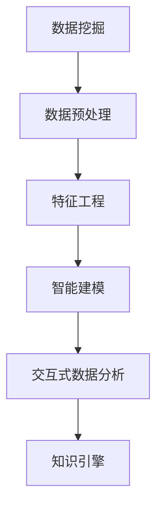

                 

# 知识发现引擎如何改变程序员的工作模式

## 1. 背景介绍

### 1.1 问题由来

在信息化时代，数据的丰富程度已经远超以往，程序员面临着数据海量化、复杂化的挑战。如何从数据中发现知识，提炼出有价值的信息，成为现代程序员工作的重要环节。传统的数据处理方式以批处理为主，面对实时数据流处理的需求显得力不从心。同时，随着人工智能和机器学习的兴起，越来越多的决策过程需要依托于数据驱动的智能模型，而手工编写模型往往耗时费力，且效果受制于数据和算法的质量。

### 1.2 问题核心关键点

知识发现引擎作为一种能够自动识别和提取数据中知识的工具，为程序员提供了一个快速获取、处理和应用数据的平台。它能够将传统的数据分析、数据挖掘和智能建模过程自动化，大大提升工作效率。同时，知识发现引擎提供了多种算法和工具，支持从不同角度和层次挖掘数据的内在规律，帮助程序员更好地理解数据、发现商机、改进算法，加速产品开发和迭代。

## 2. 核心概念与联系

### 2.1 核心概念概述

为更好地理解知识发现引擎的工作原理和应用场景，本节将介绍几个密切相关的核心概念：

- 数据挖掘(Data Mining)：从大量数据中提取有用信息和知识的过程，包括分类、聚类、关联规则挖掘等。
- 数据预处理(Preprocessing)：对原始数据进行清洗、转换、归一化等操作，提升数据质量和一致性。
- 特征工程(Feature Engineering)：通过选择合适的特征和构建新特征，提升模型的泛化能力。
- 智能建模(Intelligent Modeling)：利用机器学习、深度学习等技术，构建预测、分类、聚类等智能模型。
- 交互式数据分析(Interactive Data Analysis)：通过可视化工具和技术，提升数据分析和知识发现的过程交互性和直观性。
- 知识引擎(Knowledge Engine)：集成了上述多方面功能，自动进行数据挖掘、特征工程、智能建模和可视化展示的自动化知识发现平台。

这些核心概念之间的逻辑关系可以通过以下Mermaid流程图来展示：



这个流程图展示了大规模数据处理、模型训练、知识发现和可视化展示等步骤，以及知识引擎如何将这些步骤集成并自动化。通过理解这些核心概念，我们可以更好地把握知识发现引擎的工作原理和优化方向。

## 3. 核心算法原理 & 具体操作步骤
### 3.1 算法原理概述

知识发现引擎的核心思想是利用机器学习、数据挖掘等技术，自动从数据中挖掘出有价值的知识和模式。其核心算法原理包括以下几个方面：

- **数据预处理**：包括清洗、转换、归一化、降维等操作，提升数据质量和一致性。
- **特征工程**：通过特征选择、特征提取和特征构建，提升模型的泛化能力和性能。
- **智能建模**：使用监督学习、无监督学习、半监督学习等算法，构建预测、分类、聚类等智能模型。
- **知识可视化**：通过图表、仪表盘、报告等形式，将分析结果进行可视化展示，便于理解和应用。

### 3.2 算法步骤详解

知识发现引擎通常包括以下几个关键步骤：

**Step 1: 数据准备与清洗**
- 收集数据集，去除重复、错误和不一致的数据。
- 进行数据转换，如日期格式化、缺失值填补等。
- 进行特征提取和归一化，确保数据一致性和模型可用性。

**Step 2: 数据探索与分析**
- 使用统计分析、数据可视化工具，探索数据的基本特征和潜在问题。
- 使用聚类、关联规则挖掘等方法，发现数据中的规律和模式。
- 对不同数据集进行对比分析，理解数据间的关联性和差异性。

**Step 3: 模型构建与训练**
- 根据分析结果，选择合适的机器学习算法进行建模。
- 使用交叉验证、超参数调优等技术，优化模型性能。
- 使用大规模数据集进行训练，保证模型的泛化能力和稳定性。

**Step 4: 结果评估与优化**
- 使用准确率、召回率、F1值等指标评估模型性能。
- 根据评估结果，调整模型参数和特征工程方法，提升模型精度。
- 进行模型集成和多模型融合，提升整体效果。

**Step 5: 结果展示与应用**
- 将模型结果进行可视化展示，帮助业务人员理解分析结果。
- 将模型集成到实际应用系统中，如推荐系统、风险评估等。
- 持续监控模型性能，根据数据变化进行调整和优化。

### 3.3 算法优缺点

知识发现引擎具有以下优点：
1. 自动化数据处理：能够自动进行数据预处理、特征工程、模型训练等过程，减少手动工作量。
2. 提升模型精度：通过多算法组合和模型集成，提升模型的泛化能力和性能。
3. 支持多种任务：支持分类、聚类、关联规则挖掘等多样化的知识发现任务。
4. 界面友好：提供可视化工具和技术，提升数据分析的直观性和交互性。

同时，该方法也存在一定的局限性：
1. 数据质量要求高：需要高质量、一致的数据集作为输入，数据清洗和预处理成本较高。
2. 模型选择困难：面对复杂数据集和多样化任务，选择合适的模型和算法较为困难。
3. 模型复杂度高：高维数据和多模型组合增加了计算复杂度，需要高性能硬件支持。
4. 结果解释性差：复杂模型和自动化过程难以解释，难以理解其决策逻辑。
5. 过度依赖模型：模型性能和效果依赖于数据和算法，模型优化难度较大。

尽管存在这些局限性，但就目前而言，知识发现引擎在数据分析、特征工程、智能建模等方面表现出色，为数据驱动的业务决策提供了强有力的支持。

### 3.4 算法应用领域

知识发现引擎在多个领域中得到了广泛的应用，例如：

- 金融风险评估：利用机器学习算法对贷款、保险等金融数据进行风险评估，提升风控能力。
- 电子商务推荐系统：根据用户行为数据和商品信息，构建推荐模型，提升用户体验和购买率。
- 医疗数据分析：对电子病历、基因组数据等医疗数据进行分析，支持疾病预测、诊断和治疗。
- 社交媒体舆情分析：分析社交媒体数据，识别热点话题和舆情变化，辅助品牌营销和危机应对。
- 供应链管理：对供应链数据进行分析，预测需求、优化库存，提升供应链效率。
- 内容推荐与广告投放：根据用户行为数据，推荐内容并优化广告投放策略，提升效果和转化率。

除了上述这些典型应用外，知识发现引擎还被创新性地应用于更多场景中，如智能客服、智慧城市、智能制造等，为各行各业带来了新的业务价值和竞争力。

## 4. 数学模型和公式 & 详细讲解 & 举例说明
### 4.1 数学模型构建

本节将使用数学语言对知识发现引擎的关键算法进行更加严格的刻画。

记数据集为 $D=\{(x_i,y_i)\}_{i=1}^N$，其中 $x_i$ 为输入特征，$y_i$ 为标签。知识发现引擎的核心目标是从数据集中学习模型 $M$，使得 $M$ 能够准确预测未知样本的标签。设模型 $M$ 为线性回归模型，其参数为 $\theta$，则模型的预测输出为：

$$
\hat{y} = M(x; \theta) = \theta^T \varphi(x)
$$

其中 $\varphi(x)$ 为特征映射函数，将输入特征 $x$ 映射为特征向量。

定义模型 $M$ 在数据集 $D$ 上的损失函数为：

$$
\mathcal{L}(\theta) = \frac{1}{N} \sum_{i=1}^N \ell(\hat{y_i}, y_i)
$$

其中 $\ell(\hat{y_i}, y_i)$ 为损失函数，用于衡量预测值和真实值之间的差异。常用的损失函数包括均方误差、交叉熵等。

知识发现引擎的优化目标是最小化损失函数，即找到最优参数：

$$
\theta^* = \mathop{\arg\min}_{\theta} \mathcal{L}(\theta)
$$

通过梯度下降等优化算法，微调过程不断更新模型参数 $\theta$，最小化损失函数 $\mathcal{L}$，使得模型输出逼近真实标签。

### 4.2 公式推导过程

以线性回归模型为例，推导损失函数和梯度更新的具体形式。

设模型 $M$ 为线性回归模型，其参数为 $\theta$。对于给定的输入 $x_i$，模型预测输出为 $\hat{y} = \theta^T \varphi(x_i)$。定义均方误差损失函数为：

$$
\ell(y_i, \hat{y}) = (y_i - \hat{y})^2
$$

将其代入经验风险公式，得：

$$
\mathcal{L}(\theta) = \frac{1}{N} \sum_{i=1}^N (y_i - \theta^T \varphi(x_i))^2
$$

根据链式法则，损失函数对参数 $\theta_k$ 的梯度为：

$$
\frac{\partial \mathcal{L}(\theta)}{\partial \theta_k} = -\frac{2}{N}\sum_{i=1}^N (\hat{y_i} - y_i) \varphi_k(x_i)
$$

其中 $\varphi_k(x_i)$ 为特征映射函数 $\varphi(x)$ 对 $\theta_k$ 的偏导数。

在得到损失函数的梯度后，即可带入参数更新公式，完成模型的迭代优化。重复上述过程直至收敛，最终得到适应数据集的最优模型参数 $\theta^*$。

## 5. 项目实践：代码实例和详细解释说明
### 5.1 开发环境搭建

在进行知识发现引擎开发前，我们需要准备好开发环境。以下是使用Python进行Scikit-learn开发的环境配置流程：

1. 安装Anaconda：从官网下载并安装Anaconda，用于创建独立的Python环境。

2. 创建并激活虚拟环境：
```bash
conda create -n sklearn-env python=3.8 
conda activate sklearn-env
```

3. 安装Scikit-learn：从官网获取对应的安装命令。例如：
```bash
conda install scikit-learn
```

4. 安装其他相关工具包：
```bash
pip install numpy pandas matplotlib seaborn jupyter notebook ipython
```

完成上述步骤后，即可在`sklearn-env`环境中开始知识发现引擎的开发实践。

### 5.2 源代码详细实现

下面我们以金融风险评估任务为例，给出使用Scikit-learn进行线性回归模型训练的Python代码实现。

首先，定义金融风险评估数据集的预处理函数：

```python
import pandas as pd
from sklearn.model_selection import train_test_split
from sklearn.preprocessing import StandardScaler

def preprocess_data(data_path):
    data = pd.read_csv(data_path)
    features = data.drop('label', axis=1)
    label = data['label']
    features, label = train_test_split(features, label, test_size=0.2, random_state=42)
    scaler = StandardScaler()
    features = scaler.fit_transform(features)
    return features, label
```

然后，定义线性回归模型并进行训练：

```python
from sklearn.linear_model import LinearRegression

def train_model(features, label):
    model = LinearRegression()
    model.fit(features, label)
    return model
```

最后，对模型进行评估和应用：

```python
from sklearn.metrics import mean_squared_error

def evaluate_model(model, features, label):
    features_test, label_test = preprocess_data('test.csv')
    y_pred = model.predict(features_test)
    mse = mean_squared_error(label_test, y_pred)
    return mse
```

完整代码如下：

```python
import pandas as pd
from sklearn.model_selection import train_test_split
from sklearn.preprocessing import StandardScaler
from sklearn.linear_model import LinearRegression
from sklearn.metrics import mean_squared_error

def preprocess_data(data_path):
    data = pd.read_csv(data_path)
    features = data.drop('label', axis=1)
    label = data['label']
    features, label = train_test_split(features, label, test_size=0.2, random_state=42)
    scaler = StandardScaler()
    features = scaler.fit_transform(features)
    return features, label

def train_model(features, label):
    model = LinearRegression()
    model.fit(features, label)
    return model

def evaluate_model(model, features, label):
    features_test, label_test = preprocess_data('test.csv')
    y_pred = model.predict(features_test)
    mse = mean_squared_error(label_test, y_pred)
    return mse

features, label = preprocess_data('train.csv')
model = train_model(features, label)
mse = evaluate_model(model, features, label)
print(f"Mean Squared Error: {mse:.3f}")
```

以上就是使用Scikit-learn进行金融风险评估任务线性回归模型训练的完整代码实现。可以看到，借助Scikit-learn等数据科学工具，程序员可以迅速实现知识发现引擎的核心算法和模型训练。

### 5.3 代码解读与分析

让我们再详细解读一下关键代码的实现细节：

**preprocess_data函数**：
- 读取数据集
- 提取特征和标签
- 进行特征拆分和标准化处理
- 返回标准化后的特征和标签

**train_model函数**：
- 定义线性回归模型
- 使用标准化特征和标签进行模型训练
- 返回训练好的模型

**evaluate_model函数**：
- 读取测试集数据
- 使用训练好的模型进行预测
- 计算均方误差指标
- 返回均方误差

**主程序**：
- 读取训练集数据，并标准化处理
- 训练线性回归模型
- 在测试集上评估模型性能
- 输出评估结果

代码简洁高效，易于理解和修改，是知识发现引擎开发的典型范式。通过使用成熟的开源工具，程序员可以避免繁琐的算法实现，专注于数据处理和模型优化。

## 6. 实际应用场景
### 6.1 金融风险评估

在金融领域，知识发现引擎能够对贷款申请、保险理赔、信用评分等数据进行风险评估，识别高风险客户或欺诈行为，提升金融机构的决策效率和风险控制能力。例如，通过分析客户的消费行为、信用记录等数据，构建逻辑回归或决策树模型，预测其是否存在违约风险。

### 6.2 电子商务推荐系统

电子商务网站利用知识发现引擎对用户行为数据进行分析和建模，构建推荐系统，提升用户体验和销售额。例如，通过分析用户的浏览、购买记录，构建协同过滤或基于内容的推荐模型，推荐用户可能感兴趣的商品或服务。

### 6.3 医疗数据分析

在医疗领域，知识发现引擎能够对电子病历、基因组数据等医疗数据进行分析，支持疾病预测、诊断和治疗。例如，通过分析患者的基因数据和病历信息，构建支持向量机或随机森林模型，预测患者是否可能患上某种疾病。

### 6.4 社交媒体舆情分析

社交媒体平台利用知识发现引擎对海量用户数据进行情感分析、趋势预测，辅助品牌营销和危机应对。例如，通过分析用户在社交媒体上的评论和互动，构建情感分析或主题建模模型，识别热点话题和舆情变化。

### 6.5 供应链管理

在供应链管理中，知识发现引擎能够对供应链数据进行分析，预测需求、优化库存，提升供应链效率。例如，通过分析历史销售数据和库存信息，构建时间序列预测模型，预测未来销量，优化库存管理。

### 6.6 内容推荐与广告投放

内容平台利用知识发现引擎对用户行为数据进行分析和建模，推荐内容并优化广告投放策略，提升效果和转化率。例如，通过分析用户的阅读、观看记录，构建协同过滤或深度学习推荐模型，推荐用户可能感兴趣的文章或视频。

## 7. 工具和资源推荐
### 7.1 学习资源推荐

为了帮助开发者系统掌握知识发现引擎的理论基础和实践技巧，这里推荐一些优质的学习资源：

1. 《Python数据科学手册》：详细介绍了Python在数据科学中的应用，包括数据预处理、特征工程、模型训练等关键环节。
2. 《机器学习实战》：通过丰富的实例和案例，帮助读者掌握机器学习算法的实现和应用。
3. Coursera《机器学习》课程：斯坦福大学教授Andrew Ng开设的机器学习课程，涵盖监督学习、无监督学习等核心概念。
4. Kaggle：数据科学竞赛平台，提供海量数据集和开源算法，助力知识发现引擎的开发和优化。
5. Weka：开源机器学习工具集，提供简单易用的界面和丰富的算法库，支持数据预处理、特征工程和模型训练。

通过对这些资源的学习实践，相信你一定能够快速掌握知识发现引擎的精髓，并用于解决实际的业务问题。

### 7.2 开发工具推荐

高效的开发离不开优秀的工具支持。以下是几款用于知识发现引擎开发的常用工具：

1. Python：作为数据科学和机器学习的主流语言，Python有着强大的生态系统和丰富的库函数。
2. Scikit-learn：开源机器学习库，集成了多种常用算法和工具，支持数据预处理、模型训练和结果评估。
3. TensorFlow：由Google主导开发的深度学习框架，支持大规模模型训练和模型部署。
4. Apache Spark：开源大数据处理框架，支持分布式计算和数据挖掘任务。
5. Apache Hadoop：开源大数据处理平台，支持海量数据的存储和处理。
6. Jupyter Notebook：交互式编程环境，支持Python和R等语言，便于快速迭代实验。

合理利用这些工具，可以显著提升知识发现引擎的开发效率，加快创新迭代的步伐。

### 7.3 相关论文推荐

知识发现引擎的研究源于学界的持续研究。以下是几篇奠基性的相关论文，推荐阅读：

1. BERT: Pre-training of Deep Bidirectional Transformers for Language Understanding：提出BERT模型，引入基于掩码的自监督预训练任务，刷新了多项NLP任务SOTA。
2. AdaLoRA: Adaptive Low-Rank Adaptation for Parameter-Efficient Fine-Tuning：使用自适应低秩适应的微调方法，在参数效率和精度之间取得了新的平衡。
3. Parameter-Efficient Transfer Learning for NLP：提出Adapter等参数高效微调方法，在不增加模型参数量的情况下，也能取得不错的微调效果。
4. Knowledge-Based Event Discovery with Distributed Memory Networks：提出知识图谱驱动的事件发现方法，利用知识图谱提升事件识别的准确性。
5. Causal Discovery: A Review：回顾因果推断方法，探讨如何在知识发现中建立稳定因果关系。
6. Mining Top-k Sequential Patterns in Databases：提出频繁模式挖掘算法，在数据集中发现最频繁的事件序列。

这些论文代表了大语言模型微调技术的发展脉络。通过学习这些前沿成果，可以帮助研究者把握学科前进方向，激发更多的创新灵感。

## 8. 总结：未来发展趋势与挑战

### 8.1 总结

本文对知识发现引擎的核心算法和应用场景进行了全面系统的介绍。首先阐述了知识发现引擎在数据处理、模型训练和知识应用等方面的核心思想和基本原理。其次，从原理到实践，详细讲解了知识发现引擎的关键步骤和实现方法，给出了知识发现引擎的完整代码实例。同时，本文还广泛探讨了知识发现引擎在金融风险评估、电子商务推荐、医疗数据分析等多个行业领域的应用前景，展示了知识发现引擎的巨大潜力。

通过本文的系统梳理，可以看到，知识发现引擎正在成为数据驱动决策的重要工具，极大地提升各行业的决策效率和智能化水平。未来，伴随算力成本的下降和数据规模的扩张，知识发现引擎的应用场景将更加广泛，数据处理和模型训练的自动化水平也将不断提高。

### 8.2 未来发展趋势

展望未来，知识发现引擎将呈现以下几个发展趋势：

1. 自动化程度提升：随着算法的优化和模型的演化，知识发现引擎将实现更加自动化的数据处理和模型训练过程，减少人工干预。
2. 实时处理能力增强：面对实时数据流和大规模数据集，知识发现引擎将具备更好的实时处理和在线分析能力，支持实时决策和预测。
3. 多模态数据融合：知识发现引擎将支持多模态数据的融合，提升对复杂数据环境的适应性和应用范围。
4. 模型集成和优化：知识发现引擎将支持多种算法和模型的集成和优化，提升整体效果和鲁棒性。
5. 数据可视化增强：通过更加直观、交互的数据可视化工具，知识发现引擎将帮助业务人员更好地理解数据和分析结果。
6. 数据安全和隐私保护：知识发现引擎将支持数据加密、匿名化等措施，确保数据安全和隐私保护。

以上趋势凸显了知识发现引擎在自动化、实时性、多模态等方面的发展方向。这些方向的探索发展，必将进一步提升知识发现引擎的性能和应用范围，为各行各业带来新的业务价值和竞争力。

### 8.3 面临的挑战

尽管知识发现引擎在数据处理和模型训练方面表现出色，但在迈向更加智能化、普适化应用的过程中，它仍面临着诸多挑战：

1. 数据质量瓶颈：知识发现引擎需要高质量、一致的数据集作为输入，数据清洗和预处理成本较高。
2. 算法选择困难：面对复杂数据集和多样化任务，选择合适的算法和模型较为困难。
3. 计算资源要求高：高维数据和多模型组合增加了计算复杂度，需要高性能硬件支持。
4. 模型解释性差：复杂模型和自动化过程难以解释，难以理解其决策逻辑。
5. 过度依赖数据：知识发现引擎的效果依赖于数据质量，数据偏差和噪声将影响模型性能。
6. 数据安全和隐私保护：知识发现引擎处理的数据可能包含敏感信息，数据安全和隐私保护问题亟待解决。

尽管存在这些挑战，但通过不断优化算法和提高硬件性能，知识发现引擎在数据处理和模型训练方面的优势将更加明显，为各行各业带来新的业务价值和竞争力。

### 8.4 研究展望

面对知识发现引擎所面临的种种挑战，未来的研究需要在以下几个方面寻求新的突破：

1. 探索无监督和半监督知识发现方法：摆脱对大规模标注数据的依赖，利用自监督学习、主动学习等无监督和半监督范式，最大限度利用非结构化数据，实现更加灵活高效的模型训练。
2. 研究实时处理和多模态数据融合技术：开发更加高效的实时处理算法和多模态数据融合方法，提升知识发现引擎的适应性和应用范围。
3. 引入更多先验知识：将符号化的先验知识，如知识图谱、逻辑规则等，与神经网络模型进行巧妙融合，引导知识发现引擎学习更准确、合理的知识表示。
4. 加强数据安全和隐私保护：研究数据加密、匿名化等技术，确保知识发现引擎处理的数据安全可靠，符合法律法规要求。
5. 开发更加智能化的知识发现系统：结合符号推理、因果推断等技术，提升知识发现引擎的逻辑推理和解释能力。

这些研究方向将引领知识发现引擎迈向更高的台阶，为各行业带来新的业务价值和竞争力。面向未来，知识发现引擎需要与其他人工智能技术进行更深入的融合，如自然语言处理、计算机视觉等，协同发力，共同推动智能交互系统的进步。

## 9. 附录：常见问题与解答

**Q1：知识发现引擎是否适用于所有数据集？**

A: 知识发现引擎适用于结构化、半结构化和非结构化数据集。对于结构化数据，可以直接进行数据预处理和模型训练。对于非结构化数据，如文本、图像、视频等，需要通过特征提取和转换，转化为结构化数据后再进行处理。

**Q2：知识发现引擎的模型选择和训练过程有哪些技巧？**

A: 知识发现引擎的模型选择和训练过程需要考虑以下技巧：
1. 特征工程：选择合适的特征和构建新特征，提升模型的泛化能力。
2. 超参数调优：使用交叉验证、网格搜索等技术，优化模型参数。
3. 模型集成：通过集成多个模型的预测结果，提升整体效果。
4. 数据增强：通过数据增强技术，丰富训练集多样性，提升模型泛化能力。
5. 正则化：使用L2正则、Dropout等技术，防止模型过拟合。

这些技巧可以帮助提升模型的精度和鲁棒性，确保知识发现引擎的准确性和可靠性。

**Q3：知识发现引擎在实际应用中需要注意哪些问题？**

A: 知识发现引擎在实际应用中需要注意以下问题：
1. 数据质量：确保数据的一致性和准确性，避免数据偏差和噪声影响模型效果。
2. 模型解释性：复杂模型和自动化过程难以解释，需要加强模型解释和可视化，提升用户信任度。
3. 计算资源：高维数据和多模型组合增加了计算复杂度，需要优化算法和配置硬件。
4. 数据安全和隐私保护：确保知识发现引擎处理的数据安全可靠，符合法律法规要求。
5. 实时处理能力：面对实时数据流和大规模数据集，知识发现引擎需要具备更好的实时处理和在线分析能力。

合理应对这些问题，可以确保知识发现引擎在实际应用中的稳定性和可靠性，提升业务价值。

---

作者：禅与计算机程序设计艺术 / Zen and the Art of Computer Programming

