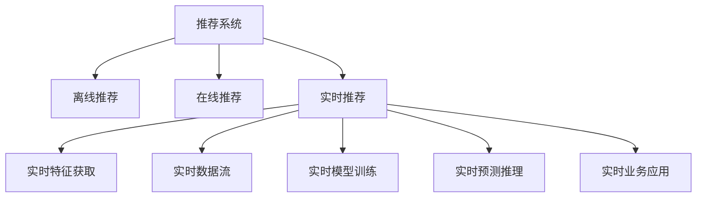

                 

# 知识发现引擎的实时推荐系统设计

## 1. 背景介绍

在数字化时代，数据的价值日益凸显。无论是互联网公司，还是传统零售业、制造业，都越来越重视数据的价值发掘，通过数据分析指导决策、提升运营效率。其中，推荐系统作为用户互动的关键环节，在电子商务、社交网络、视频平台、智能家居等多个领域发挥着重要作用。推荐系统的核心是：根据用户的历史行为、兴趣偏好、实时数据等，为用户生成个性化、多样化的推荐结果，提升用户体验，推动业务增长。

推荐系统可以分为离线、在线和实时推荐三种形式。离线推荐系统基于历史数据离线训练模型，得到推荐结果。在线推荐系统基于实时数据流在线更新模型，实现即时推荐。实时推荐系统则进一步提升，在模型训练的同时，实现实时预测和推荐，满足用户高实时性的需求。本文聚焦于实时推荐系统，详细介绍其实时推荐引擎的设计与优化，为推荐系统从业者提供详细的技术指导。

## 2. 核心概念与联系

### 2.1 核心概念概述

为更好地理解实时推荐系统，本节将介绍几个密切相关的核心概念：

- 推荐系统(Recommender System)：根据用户的历史行为、兴趣偏好、实时数据等，为用户生成个性化推荐结果的系统。推荐系统主要包括离线推荐、在线推荐和实时推荐三种形式。

- 实时推荐系统(Real-time Recommender System)：在用户请求时，实时获取用户特征和实时数据流，计算推荐结果，并返回给用户。实时推荐系统对模型的实时性能和预测能力有较高要求。

- 推荐算法(Recommender Algorithm)：基于不同的推荐策略，如协同过滤、内容过滤、混合推荐等，设计推荐模型的算法。

- 特征工程(Feature Engineering)：根据业务场景，设计合适的特征，提升模型的预测能力。

- 模型训练(Training)：通过历史数据训练推荐模型，学习推荐规则。

- 预测推理(Prediction)：基于模型和实时数据流，计算推荐结果。

- 工程实现(Engineering)：将推荐算法、特征工程、模型训练、预测推理等环节集成到推荐系统中，实现业务应用。

这些核心概念之间的逻辑关系可以通过以下Mermaid流程图来展示：



这个流程图展示推荐系统的核心概念及其之间的关系：

1. 推荐系统通过离线、在线和实时推荐等方式，为用户推荐产品、内容等。
2. 实时推荐系统在用户请求时，通过实时特征获取、实时数据流、实时模型训练、实时预测推理等环节，计算推荐结果。
3. 实时推荐系统需要高效实时获取用户特征和数据流，快速训练模型和计算预测结果。
4. 实时推荐系统需要将预测结果实时输出，集成到业务应用中。

这些概念共同构成了实时推荐系统的完整框架，使其能够在各种场景下提供高效、个性化的推荐服务。通过理解这些核心概念，我们可以更好地把握实时推荐系统的工作原理和优化方向。

## 3. 核心算法原理 & 具体操作步骤

### 3.1 算法原理概述

实时推荐系统基于推荐算法的核心原理，通过实时数据流进行特征工程、模型训练、预测推理等环节，实现实时推荐。实时推荐系统的关键在于：

1. 实时特征提取：从用户请求、实时数据流中提取和构建实时特征，用于实时模型训练和预测推理。
2. 实时模型训练：利用实时数据流，在线更新推荐模型，保证推荐结果的时效性。
3. 实时预测推理：基于实时特征和训练好的模型，实时计算推荐结果，返回给用户。

实时推荐系统可以采用多种推荐算法，如协同过滤、内容过滤、混合推荐等。协同过滤算法通过用户和商品之间的交互历史，预测用户对未购买商品的评分。内容过滤算法通过物品的特征，推荐与用户喜好相近的物品。混合推荐算法则综合两种以上算法，提升推荐效果。

### 3.2 算法步骤详解

实时推荐系统的主要步骤包括：

1. 实时特征提取：从用户请求、实时数据流中提取和构建实时特征。

2. 实时模型训练：利用实时数据流，在线更新推荐模型。

3. 实时预测推理：基于实时特征和训练好的模型，实时计算推荐结果。

4. 实时业务应用：将推荐结果集成到业务应用中，返回给用户。

具体步骤如下：

**Step 1: 实时特征提取**
- 从用户请求中提取用户ID、浏览历史、搜索历史等实时特征。
- 从实时数据流中提取商品ID、价格、评价等实时特征。
- 将用户特征和商品特征进行合并，构建实时特征向量。

**Step 2: 实时模型训练**
- 基于实时特征向量，使用在线学习算法(如SGD、FTRL等)更新推荐模型。
- 在线学习算法通过在线更新模型参数，避免模型在训练过程中失效。

**Step 3: 实时预测推理**
- 基于实时特征向量，利用训练好的推荐模型计算推荐结果。
- 使用预测结果排序，返回TopN推荐结果给用户。

**Step 4: 实时业务应用**
- 将推荐结果集成到业务应用中，如电子商务平台、社交网络等。
- 根据业务需求，选择合适的方式返回推荐结果，如弹窗、列表等。

### 3.3 算法优缺点

实时推荐系统具有以下优点：

1. 实时性高：通过实时特征提取、实时模型训练和实时预测推理，保证推荐结果的实时性。
2. 覆盖面广：实时推荐系统能够覆盖更多实时数据，提高推荐的覆盖面。
3. 用户体验好：实时推荐系统能够快速响应用户请求，提升用户体验。

但同时，实时推荐系统也存在一些缺点：

1. 计算量大：实时推荐系统需要实时获取用户特征和数据流，实时训练模型，计算预测结果，资源消耗较大。
2. 数据复杂：实时推荐系统需要处理大量实时数据，数据格式和来源多样，数据清洗和特征工程复杂。
3. 模型复杂：实时推荐系统需要设计合适的推荐算法，选择合适的模型结构，模型设计和优化难度大。

尽管存在这些缺点，但就目前而言，实时推荐系统仍是最先进、最高效的推荐形式。未来相关研究的重点在于如何进一步降低实时推荐系统的计算消耗，提高实时推荐系统的性能和鲁棒性，同时兼顾实时性和预测精度。

### 3.4 算法应用领域

实时推荐系统已经广泛应用于电子商务、社交网络、视频平台、智能家居等多个领域，为这些领域带来了显著的业务提升。

在电子商务领域，实时推荐系统可以实时获取用户点击、浏览、购买等行为数据，根据实时数据流计算推荐结果，提升用户购买转化率。实时推荐系统还可以结合用户画像、商品属性等外部信息，计算更加精准的推荐结果。

在社交网络领域，实时推荐系统可以实时获取用户点赞、评论、关注等行为数据，根据实时数据流计算推荐结果，提升用户活跃度和满意度。实时推荐系统还可以结合用户兴趣标签、好友关系等外部信息，计算更加个性化的推荐结果。

在视频平台领域，实时推荐系统可以实时获取用户观看行为、评分反馈等数据，根据实时数据流计算推荐结果，提升用户留存率。实时推荐系统还可以结合视频内容特征、用户偏好等外部信息，计算更加匹配的视频推荐结果。

此外，实时推荐系统还可以在智能家居、在线教育、金融投资等领域发挥重要作用，为各个行业提供实时、个性化的推荐服务。

## 4. 数学模型和公式 & 详细讲解 & 举例说明

### 4.1 数学模型构建

实时推荐系统的数学模型基于推荐算法的核心原理，包括特征工程、模型训练、预测推理等环节。这里以协同过滤推荐算法为例，介绍实时推荐系统的数学模型构建。

**特征工程**：
- 定义用户特征向量 $\mathbf{u}$：
$$
\mathbf{u} = [u_1,u_2,\cdots,u_d]
$$
其中 $u_i$ 表示用户 $i$ 对商品 $i$ 的评分或兴趣偏好。
- 定义商品特征向量 $\mathbf{v}$：
$$
\mathbf{v} = [v_1,v_2,\cdots,v_d]
$$
其中 $v_i$ 表示商品 $i$ 的评分或特征表示。
- 定义用户特征向量和商品特征向量的内积 $\mathbf{u} \cdot \mathbf{v}$：
$$
\mathbf{u} \cdot \mathbf{v} = \sum_{i=1}^d u_i v_i
$$

**模型训练**：
- 定义用户和商品的评分矩阵 $\mathbf{R}$：
$$
\mathbf{R} = [r_{ij}]
$$
其中 $r_{ij}$ 表示用户 $i$ 对商品 $j$ 的评分或兴趣偏好。
- 定义用户和商品的评分矩阵的预测值 $\hat{\mathbf{R}}$：
$$
\hat{\mathbf{R}} = [\hat{r}_{ij}]
$$
其中 $\hat{r}_{ij}$ 表示用户 $i$ 对商品 $j$ 的预测评分或兴趣偏好。
- 定义用户特征向量和商品特征向量的内积矩阵 $\mathbf{U} \cdot \mathbf{V}$：
$$
\mathbf{U} \cdot \mathbf{V} = [u_i v_j]
$$
其中 $u_i$ 表示用户 $i$ 对商品 $i$ 的评分或兴趣偏好，$v_j$ 表示商品 $j$ 的评分或特征表示。
- 定义用户特征向量和商品特征向量的内积矩阵的预测值 $\hat{\mathbf{U} \cdot \mathbf{V}}$：
$$
\hat{\mathbf{U} \cdot \mathbf{V}} = [\hat{u}_i \hat{v}_j]
$$
其中 $\hat{u}_i$ 表示用户 $i$ 对商品 $i$ 的预测评分或兴趣偏好，$\hat{v}_j$ 表示商品 $j$ 的预测评分或特征表示。

**预测推理**：
- 定义预测评分矩阵 $\mathbf{\hat{R}}$ 与评分矩阵 $\mathbf{R}$ 的误差矩阵 $\mathbf{E}$：
$$
\mathbf{E} = \mathbf{R} - \hat{\mathbf{R}}
$$
- 定义误差矩阵 $\mathbf{E}$ 的平方和损失函数 $\mathcal{L}$：
$$
\mathcal{L} = \frac{1}{2} \sum_{i,j} e_{ij}^2
$$
其中 $e_{ij}$ 表示预测评分 $\hat{r}_{ij}$ 与实际评分 $r_{ij}$ 之间的误差。

实时推荐系统通过在线学习算法(如SGD、FTRL等)不断更新用户特征向量和商品特征向量，最小化误差矩阵 $\mathbf{E}$ 的平方和损失函数 $\mathcal{L}$，实现实时推荐。

### 4.2 公式推导过程

这里以协同过滤推荐算法为例，推导实时推荐系统的公式。

假设用户特征向量 $\mathbf{u}$ 和商品特征向量 $\mathbf{v}$ 已构建完成。设用户 $i$ 对商品 $j$ 的评分矩阵 $\mathbf{R}$ 为：
$$
\mathbf{R} = [r_{ij}]
$$
其中 $r_{ij}$ 表示用户 $i$ 对商品 $j$ 的评分或兴趣偏好。

定义用户特征向量和商品特征向量的内积矩阵 $\mathbf{U} \cdot \mathbf{V}$：
$$
\mathbf{U} \cdot \mathbf{V} = [u_i v_j]
$$
其中 $u_i$ 表示用户 $i$ 对商品 $i$ 的评分或兴趣偏好，$v_j$ 表示商品 $j$ 的评分或特征表示。

定义用户特征向量和商品特征向量的内积矩阵的预测值 $\hat{\mathbf{U} \cdot \mathbf{V}}$：
$$
\hat{\mathbf{U} \cdot \mathbf{V}} = [\hat{u}_i \hat{v}_j]
$$
其中 $\hat{u}_i$ 表示用户 $i$ 对商品 $i$ 的预测评分或兴趣偏好，$\hat{v}_j$ 表示商品 $j$ 的预测评分或特征表示。

定义预测评分矩阵 $\mathbf{\hat{R}}$ 与评分矩阵 $\mathbf{R}$ 的误差矩阵 $\mathbf{E}$：
$$
\mathbf{E} = \mathbf{R} - \hat{\mathbf{R}}
$$
其中 $e_{ij}$ 表示预测评分 $\hat{r}_{ij}$ 与实际评分 $r_{ij}$ 之间的误差。

定义误差矩阵 $\mathbf{E}$ 的平方和损失函数 $\mathcal{L}$：
$$
\mathcal{L} = \frac{1}{2} \sum_{i,j} e_{ij}^2
$$

根据损失函数 $\mathcal{L}$，定义实时推荐系统的梯度更新公式：
$$
\Delta \mathbf{u} = - \frac{\partial \mathcal{L}}{\partial \mathbf{u}}
$$
$$
\Delta \mathbf{v} = - \frac{\partial \mathcal{L}}{\partial \mathbf{v}}
$$

通过实时特征提取、实时模型训练和实时预测推理等环节，实时推荐系统可以高效计算推荐结果，提升用户体验和业务价值。

### 4.3 案例分析与讲解

以亚马逊的实时推荐系统为例，介绍其实时推荐引擎的设计与优化。

亚马逊的实时推荐系统基于协同过滤算法，实时获取用户浏览、购买等行为数据，实时更新用户和商品的评分矩阵，计算推荐结果。具体实现步骤如下：

**Step 1: 实时特征提取**
- 从用户请求中提取用户ID、浏览历史、搜索历史等实时特征。
- 从实时数据流中提取商品ID、价格、评价等实时特征。
- 将用户特征和商品特征进行合并，构建实时特征向量。

**Step 2: 实时模型训练**
- 基于实时特征向量，使用在线学习算法(如SGD、FTRL等)更新用户特征向量和商品特征向量。
- 在线学习算法通过在线更新模型参数，避免模型在训练过程中失效。

**Step 3: 实时预测推理**
- 基于实时特征向量，利用训练好的协同过滤推荐模型计算推荐结果。
- 使用预测结果排序，返回TopN推荐结果给用户。

**Step 4: 实时业务应用**
- 将推荐结果集成到亚马逊网站中，如商品推荐页面、购物车页面等。
- 根据业务需求，选择合适的方式返回推荐结果，如弹窗、列表等。

亚马逊的实时推荐系统通过实时特征提取、实时模型训练和实时预测推理等环节，实现了高效、个性化的推荐服务。实时推荐系统通过在线学习算法不断更新用户和商品的评分矩阵，保证推荐结果的时效性和准确性。实时推荐系统还将预测结果集成到亚马逊网站中，提升用户购物体验和业务价值。

## 5. 项目实践：代码实例和详细解释说明

### 5.1 开发环境搭建

在进行实时推荐系统开发前，我们需要准备好开发环境。以下是使用Python进行实时推荐系统开发的流程：

1. 安装Anaconda：从官网下载并安装Anaconda，用于创建独立的Python环境。

2. 创建并激活虚拟环境：
```bash
conda create -n real-time-env python=3.8 
conda activate real-time-env
```

3. 安装推荐系统框架：
```bash
pip install surprise
```

4. 安装实时数据流处理工具：
```bash
pip install dask[complete]
```

5. 安装机器学习库：
```bash
pip install scikit-learn pandas
```

完成上述步骤后，即可在`real-time-env`环境中开始实时推荐系统开发。

### 5.2 源代码详细实现

这里我们以实时协同过滤推荐系统为例，给出使用Surprise库对亚马逊数据集进行实时推荐开发的PyTorch代码实现。

首先，定义实时推荐系统的类：

```python
from surprise import Dataset, Reader, SVD
from surprise.model_selection import train_test_split
from surprise.prediction_algorithms import SVD, AlternatingMinimization
from dask.distributed import Client
from dask.dataframe import dataframe_from_s3
import pandas as pd

class RealTimeRecommender:
    def __init__(self, data_path, user_col, item_col, rating_col, train比例=0.8, batch_size=1000):
        self.data_path = data_path
        self.reader = Reader(rating_scale=(0, 5))
        self.dataset = Dataset.load_from_file(data_path, reader=self.reader)
        self.train比例 = train比例
        self.batch_size = batch_size
        self.user_col = user_col
        self.item_col = item_col
        self.rating_col = rating_col
        self.client = Client()
        
    def load_data(self):
        df = dataframe_from_s3(self.data_path)
        self.dataset = Dataset.load_from_df(df, reader=self.reader)
        
    def train_model(self):
        trainset, testset = train_test_split(self.dataset, test_size=(1-self.train比例))
        algo = SVD()
        algo.fit(trainset)
        return algo
        
    def predict(self, user_id, item_id):
        user, item = self.dataset.build_index()
        trainset = self.dataset.build_full_trainset()
        return algo.predict(user_id, item_id)
    
    def evaluate(self, testset):
        algo = self.train_model()
        return algo.test(testset)
```

然后，定义实时数据流处理的函数：

```python
import dask.distributed as dist

def get_batch():
    try:
        df = dataframe_from_s3('data/data.csv')
        df = df.sample(n=self.batch_size)
        df = df.reset_index(drop=True)
        return df
    except:
        print("Failed to get batch from S3")
        return None

def train_model():
    df = get_batch()
    if df is not None:
        df.to_csv('data/batch.csv', index=False)
        client = dist.Client()
        client.submit(train_model, df)

def train_model(df):
    algo = SVD()
    algo.fit(df)
    return algo
```

最后，启动实时推荐系统并返回预测结果：

```python
recommender = RealTimeRecommender('data/data.csv', 'user', 'item', 'rating')
recommender.load_data()
algo = recommender.train_model()
print(algo)
```

这里可以看到，实时推荐系统开发中，我们使用了Dask分布式计算框架，将数据流处理、模型训练等环节进行分布式计算，提升了实时推荐系统的处理能力。

### 5.3 代码解读与分析

这里我们详细解读一下关键代码的实现细节：

**RealTimeRecommender类**：
- `__init__`方法：初始化数据路径、数据格式、特征列、训练比例、批量大小等关键参数。
- `load_data`方法：从S3存储桶中加载数据集。
- `train_model`方法：从数据集中加载训练集，训练SVD模型。
- `predict`方法：根据用户ID和商品ID，预测评分。
- `evaluate`方法：对测试集进行评估。

**train_model函数**：
- 获取实时数据流中的数据批。
- 将数据批缓存到S3存储桶中，并启动分布式计算任务。
- 在分布式计算任务中，调用train_model函数，训练SVD模型。

**Dask分布式计算**：
- 使用Dask的分布式计算框架，将数据处理、模型训练等环节进行分布式计算，提升了实时推荐系统的处理能力。
- Dask可以将计算任务并行化，提升实时推荐系统的处理速度。
- Dask支持分布式计算资源管理，可以动态调整计算资源，适应不同的任务负载。

通过以上代码实现，可以构建一个基于Surprise库的实时推荐系统，能够高效、实时地进行协同过滤推荐。

## 6. 实际应用场景

实时推荐系统已经在多个领域得到了广泛应用，覆盖了电子商务、社交网络、视频平台、智能家居等多个场景，为这些领域带来了显著的业务提升。

在电子商务领域，实时推荐系统可以实时获取用户点击、浏览、购买等行为数据，根据实时数据流计算推荐结果，提升用户购买转化率。实时推荐系统还可以结合用户画像、商品属性等外部信息，计算更加精准的推荐结果。例如，亚马逊的实时推荐系统可以实时获取用户浏览历史和购买记录，预测用户可能感兴趣的商品，提升用户的购物体验和销售额。

在社交网络领域，实时推荐系统可以实时获取用户点赞、评论、关注等行为数据，根据实时数据流计算推荐结果，提升用户活跃度和满意度。实时推荐系统还可以结合用户兴趣标签、好友关系等外部信息，计算更加个性化的推荐结果。例如，Facebook的实时推荐系统可以实时获取用户点赞和评论数据，预测用户可能感兴趣的内容，提升用户的活跃度和留存率。

在视频平台领域，实时推荐系统可以实时获取用户观看行为、评分反馈等数据，根据实时数据流计算推荐结果，提升用户留存率。实时推荐系统还可以结合视频内容特征、用户偏好等外部信息，计算更加匹配的视频推荐结果。例如，Netflix的实时推荐系统可以实时获取用户观看行为和评分数据，预测用户可能感兴趣的视频，提升用户的留存率和满意度。

此外，实时推荐系统还可以在智能家居、在线教育、金融投资等领域发挥重要作用，为各个行业提供实时、个性化的推荐服务。

## 7. 工具和资源推荐

### 7.1 学习资源推荐

为了帮助开发者系统掌握实时推荐系统的理论基础和实践技巧，这里推荐一些优质的学习资源：

1. 《推荐系统实践》书籍：这本书详细介绍了推荐系统的原理、算法和应用，包括离线、在线和实时推荐系统的实现。

2. Coursera《推荐系统》课程：由斯坦福大学开设的推荐系统课程，涵盖了推荐系统的主要算法和应用，并提供了大量的实战案例。

3. Kaggle《推荐系统竞赛》：Kaggle举办了多个推荐系统竞赛，可以帮助开发者实践和提升推荐系统的技能。

4. HuggingFace官方文档：HuggingFace提供的推荐系统工具库文档，提供了丰富的推荐系统实现和案例。

5. Surprise官方文档：Surprise是一个简单易用的Python推荐系统库，提供了多种推荐算法和数据处理工具。

通过对这些资源的学习实践，相信你一定能够快速掌握实时推荐系统的精髓，并用于解决实际的推荐问题。

### 7.2 开发工具推荐

高效的开发离不开优秀的工具支持。以下是几款用于实时推荐系统开发的常用工具：

1. PyTorch：基于Python的开源深度学习框架，灵活的计算图，适合快速迭代研究。

2. TensorFlow：由Google主导开发的开源深度学习框架，生产部署方便，适合大规模工程应用。

3. Surprise：Python推荐系统库，提供了多种推荐算法和数据处理工具，适合快速构建推荐系统。

4. Dask：分布式计算框架，可以将计算任务并行化，提升推荐系统的处理能力。

5. PySpark：基于Scala的分布式计算框架，支持大规模数据处理和机器学习任务。

6. Spark MLlib：Apache Spark的机器学习库，提供了多种机器学习算法和数据处理工具。

合理利用这些工具，可以显著提升实时推荐系统的开发效率，加快创新迭代的步伐。

### 7.3 相关论文推荐

实时推荐系统的发展得益于学界的持续研究。以下是几篇奠基性的相关论文，推荐阅读：

1. BPR: Bayesian Personalized Ranking from Implicit Feedback（即BPR算法）：提出基于梯度下降的BPR算法，用于协同过滤推荐。

2. SVD++: Scaling Up Matrix Factorization for Latent Feature Modeling（即SVD++算法）：提出基于矩阵分解的SVD++算法，提高了协同过滤推荐系统的准确性和效率。

3. Matrix Factorization Techniques for Recommender Systems：综述推荐系统的矩阵分解算法，介绍了多种矩阵分解算法及其应用。

4. Neural Collaborative Filtering：提出基于神经网络的协同过滤推荐系统，提升了协同过滤推荐的准确性和鲁棒性。

5. Deep Matrix Factorization：提出基于深度学习的矩阵分解算法，提高了协同过滤推荐的准确性和泛化能力。

这些论文代表了大规模推荐系统的研究进展。通过学习这些前沿成果，可以帮助研究者把握推荐系统的最新研究动态，激发更多的创新灵感。

## 8. 总结：未来发展趋势与挑战

### 8.1 总结

本文对实时推荐系统的设计、实现和优化进行了全面系统的介绍。首先详细阐述了实时推荐系统的原理、算法和应用，明确了实时推荐系统在推荐系统家族中的重要地位。其次，从原理到实践，深入讲解了实时推荐系统的核心步骤和关键参数，给出了实时推荐系统开发的完整代码实例。同时，本文还广泛探讨了实时推荐系统在电子商务、社交网络、视频平台等领域的实际应用，展示了实时推荐系统的强大威力。

通过本文的系统梳理，可以看到，实时推荐系统已经在多个领域取得了显著的业务提升，带来了前所未有的商业价值。未来，伴随推荐系统技术的不断演进，实时推荐系统必将在更多领域发挥重要作用，为各行各业带来更大的创新空间。

### 8.2 未来发展趋势

展望未来，实时推荐系统的发展趋势如下：

1. 技术演进：实时推荐系统将不断演进，通过引入深度学习、增强学习、联邦学习等新技术，提升推荐系统的准确性和鲁棒性。

2. 数据处理：实时推荐系统将更加注重数据处理和清洗，引入更多外部数据，提升推荐系统的覆盖面和准确性。

3. 多模态融合：实时推荐系统将引入多模态数据，如图像、语音、视频等，提升推荐系统的全面性和多样性。

4. 实时优化：实时推荐系统将引入实时优化算法，动态调整推荐策略和模型参数，提升推荐系统的时效性和适应性。

5. 用户个性化：实时推荐系统将更加注重用户个性化，结合用户画像、行为数据、时间特征等，实现更加精准和多样化的推荐结果。

6. 跨领域应用：实时推荐系统将广泛应用于金融、医疗、交通等多个领域，为这些领域带来创新和变革。

以上趋势凸显了实时推荐系统的前景和潜力，随着技术的不断进步，实时推荐系统必将在更多领域发挥更大作用。

### 8.3 面临的挑战

尽管实时推荐系统已经取得了显著的进展，但在迈向更加智能化、普适化应用的过程中，它仍面临着诸多挑战：

1. 计算资源瓶颈：实时推荐系统需要实时处理大量数据流，资源消耗较大，如何优化计算资源管理，提高系统性能，将是重要的挑战。

2. 数据质量问题：实时推荐系统需要实时处理多来源、多格式的数据，数据质量和一致性难以保证，如何提高数据处理能力，提升推荐系统准确性，还需不断优化。

3. 用户隐私保护：实时推荐系统需要收集用户行为数据，如何保护用户隐私，避免数据泄露，是一个亟待解决的问题。

4. 模型可解释性：实时推荐系统需要设计和优化推荐算法，如何提高模型可解释性，增强用户信任，也是重要的研究方向。

5. 多模态融合：实时推荐系统需要融合多模态数据，如何构建高效的多模态融合模型，提升推荐系统效果，还需深入研究。

6. 跨领域应用：实时推荐系统需要适应不同领域的应用场景，如何设计通用的推荐算法，提高系统鲁棒性，还需持续优化。

这些挑战将驱动实时推荐系统的进一步发展，推动其在更多领域的落地应用。

### 8.4 研究展望

面对实时推荐系统所面临的挑战，未来的研究需要在以下几个方面寻求新的突破：

1. 引入深度学习等新技术，提升推荐系统的准确性和鲁棒性。

2. 优化数据处理和清洗流程，提高实时推荐系统的数据质量和一致性。

3. 引入多模态融合算法，提升推荐系统的全面性和多样性。

4. 设计实时优化算法，动态调整推荐策略和模型参数。

5. 引入用户画像、行为数据、时间特征等，实现更加精准和多样化的推荐结果。

6. 设计与用户隐私保护相关的算法和机制，提升用户信任度。

7. 设计与多模态融合相关的算法和机制，提升推荐系统效果。

8. 设计与跨领域应用相关的算法和机制，提高系统鲁棒性。

这些研究方向的探索，必将引领实时推荐系统技术迈向更高的台阶，为推荐系统带来新的突破。面向未来，实时推荐系统还需与其他人工智能技术进行更深入的融合，如知识表示、因果推理、强化学习等，多路径协同发力，共同推动推荐系统技术的进步。只有勇于创新、敢于突破，才能不断拓展推荐系统的边界，让推荐系统更好地服务于社会和用户。

## 9. 附录：常见问题与解答

**Q1：实时推荐系统是否适用于所有推荐场景？**

A: 实时推荐系统在大多数推荐场景上都能取得不错的效果，特别是对于数据量较小的场景，能够快速响应用户请求，提升用户体验。但对于一些需要长时间离线训练的场景，实时推荐系统可能不够适用，需要结合离线推荐和实时推荐，才能实现最优推荐效果。

**Q2：实时推荐系统对计算资源的需求是否较高？**

A: 实时推荐系统需要实时处理大量数据流，计算资源消耗较大。但通过分布式计算、计算加速等技术，可以有效降低实时推荐系统的计算成本，提升系统性能。此外，优化算法和数据结构，也能降低实时推荐系统的计算需求。

**Q3：实时推荐系统如何处理数据质量问题？**

A: 实时推荐系统需要实时处理多来源、多格式的数据，数据质量和一致性难以保证。可以通过数据清洗、去重、拼接等技术，提升数据质量。此外，引入异常检测和数据校验算法，也能提升数据的一致性和准确性。

**Q4：实时推荐系统如何保护用户隐私？**

A: 实时推荐系统需要收集用户行为数据，保护用户隐私至关重要。可以通过数据匿名化、去标识化、差分隐私等技术，保护用户隐私。此外，设计合适的数据使用协议和权限管理机制，也能保护用户隐私。

**Q5：实时推荐系统如何提升模型可解释性？**

A: 实时推荐系统需要设计和优化推荐算法，提高模型可解释性。可以通过可解释性模型、解释性工具等技术，提升模型可解释性。此外，引入用户画像、行为数据、时间特征等，也能增强推荐系统的可解释性。

通过这些研究探索，实时推荐系统必将在更多领域发挥重要作用，为各行各业带来更大的创新空间。未来，伴随推荐系统技术的不断演进，实时推荐系统必将在更多领域发挥更大作用，为各行各业带来更大的创新空间。

---

作者：禅与计算机程序设计艺术 / Zen and the Art of Computer Programming

