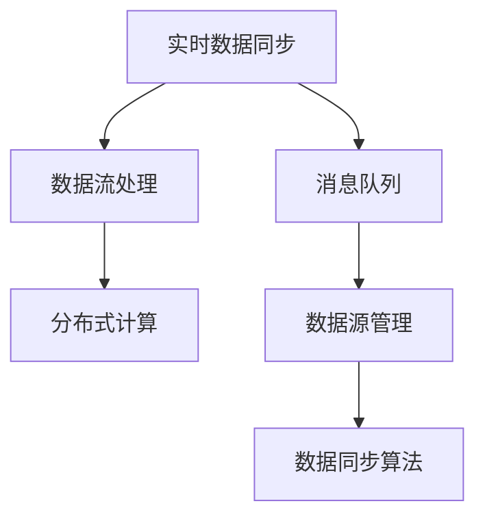

                 

# 知识发现引擎的实时数据同步技术

## 1. 背景介绍

随着大数据技术的发展，越来越多的组织开始收集、存储和处理大规模的数据。在这些数据中，蕴含着丰富的知识，如商业洞察、客户行为模式、产品销售趋势等。通过有效地利用这些知识，组织可以做出更明智的决策，提升业务绩效和竞争力。然而，这些知识往往散落在不同的数据源和系统中，如何高效地发现、整合、利用这些知识，是企业知识管理的重大挑战之一。

知识发现引擎（Knowledge Discovery Engine，KDE）是一种基于数据分析和机器学习技术的智能系统，能够从大规模数据中自动识别、提取、关联和归纳出有价值的模式和知识。作为企业知识管理的重要工具，知识发现引擎在商业智能（Business Intelligence, BI）、客户关系管理（Customer Relationship Management, CRM）、营销自动化、风险管理等领域有着广泛的应用。然而，知识发现引擎的性能和效果高度依赖于数据的质量和更新速度。如果数据源无法实时更新，知识发现引擎的输出结果将失去时效性，从而影响决策的准确性和及时性。

因此，实现知识发现引擎的实时数据同步技术，对于保证其性能和效果至关重要。本文章将详细介绍实时数据同步技术的核心概念、原理和操作步骤，以及其在知识发现引擎中的应用。

## 2. 核心概念与联系

### 2.1 核心概念概述

为了更好地理解实时数据同步技术的原理和架构，本节将介绍几个密切相关的核心概念：

- 实时数据同步（Real-time Data Synchronization）：指将数据源中的新数据实时地传输和合并到知识发现引擎的数据库中，保证数据的最新性和一致性。
- 数据流处理（Data Streaming）：指对实时产生的数据进行流式处理，通过高效的数据处理引擎和算法，实时分析和归纳数据中的知识。
- 消息队列（Message Queue）：指用于异步通信的消息中间件，支持多个数据源和处理组件之间的数据传输和同步。
- 分布式计算（Distributed Computing）：指将计算任务分布在多台计算机上进行并行处理，以提高数据处理的速度和效率。
- 数据源管理（Data Source Management）：指对数据源进行分类、管理和监控，保证数据源的可用性和数据传输的可靠性。

这些核心概念之间的逻辑关系可以通过以下Mermaid流程图来展示：



这个流程图展示了一组数据从不同数据源通过消息队列传输到知识发现引擎，并在此过程中进行分布式计算和数据同步的逻辑流程。

## 3. 核心算法原理 & 具体操作步骤

### 3.1 算法原理概述

实时数据同步技术的核心原理是将数据流式传输到知识发现引擎，并在此过程中进行数据清洗、转换和同步。其核心流程包括数据采集、数据传输、数据处理和数据同步。

1. 数据采集：从不同的数据源中实时采集新数据，包括结构化数据、半结构化数据和非结构化数据。
2. 数据传输：将采集到的数据通过消息队列传输到知识发现引擎。
3. 数据处理：在知识发现引擎中，对传输过来的数据进行清洗、转换和分析，以发现其中的知识模式。
4. 数据同步：将处理后的数据同步到知识发现引擎的数据库中，保证数据的最新性和一致性。

### 3.2 算法步骤详解

下面详细介绍实时数据同步技术的详细步骤：

#### 3.2.1 数据采集

数据采集是实时数据同步的第一步，其目标是实时地从多个数据源中采集新数据。为了实现这一目标，可以采用以下几种方法：

- 定时轮询：通过周期性地轮询数据源，获取最新的数据。这种方法简单高效，但可能存在数据延迟和性能瓶颈。
- 事件驱动：通过监听数据源的事件日志，实时获取数据变化。这种方法适用于实时性强、数据变化频率高的数据源，但需要额外的事件监控和处理组件。
- 订阅机制：通过订阅数据源的变化流，获取实时数据。这种方法适用于数据源提供流式数据输出的场景，但需要维护订阅关系和数据传输的可靠性。

#### 3.2.2 数据传输

数据传输是将采集到的数据通过消息队列传输到知识发现引擎的第二步。为了保证数据传输的可靠性、效率和可扩展性，可以采用以下几种方法：

- 异步通信：通过消息队列实现异步通信，支持高吞吐量和低延迟的数据传输。
- 分布式传输：将数据传输任务分布到多台计算节点上进行并行处理，提高数据传输的效率和吞吐量。
- 压缩传输：对数据进行压缩，减小传输带宽占用，提高数据传输的效率。
- 数据分片：将大批量数据分片传输，减小传输延迟，提高数据传输的效率和可靠性。

#### 3.2.3 数据处理

数据处理是在知识发现引擎中对传输过来的数据进行清洗、转换和分析，以发现其中的知识模式。为了实现这一目标，可以采用以下几种方法：

- 数据清洗：去除噪声、重复和错误数据，确保数据的准确性和完整性。
- 数据转换：将数据转换成统一的格式和结构，便于后续的分析和处理。
- 数据合并：将来自不同数据源的数据合并和关联，以发现数据之间的关联关系和知识模式。
- 数据采样：在处理大数据时，通过采样减少数据量，提高数据处理的效率和性能。

#### 3.2.4 数据同步

数据同步是将处理后的数据同步到知识发现引擎的数据库中，保证数据的最新性和一致性。为了实现这一目标，可以采用以下几种方法：

- 批量同步：将处理后的数据批量写入数据库，以提高数据同步的效率和性能。
- 增量同步：只同步新增和修改的数据，避免重复同步和数据冗余。
- 数据校验：对同步后的数据进行校验，确保数据的完整性和一致性。
- 容错机制：在数据同步过程中，设置容错机制和异常处理机制，保证数据同步的可靠性和稳定性。

### 3.3 算法优缺点

实时数据同步技术具有以下优点：

1. 实时性：能够实时获取数据变化，保证知识发现引擎的输出结果始终基于最新数据。
2. 可靠性：通过分布式计算和数据校验机制，保证数据传输和同步的可靠性。
3. 可扩展性：支持大规模数据源和分布式处理，能够处理海量数据。
4. 灵活性：支持多种数据源和数据处理算法，能够适应不同的业务场景和需求。

然而，实时数据同步技术也存在一些缺点：

1. 复杂性：涉及数据采集、传输、处理和同步等多个环节，实现复杂度较高。
2. 资源消耗：需要大量的计算和存储资源，特别是处理大规模数据时，资源消耗较大。
3. 数据延迟：由于数据传输和处理环节，可能存在数据延迟，影响知识发现引擎的输出结果。
4. 数据冗余：在数据同步过程中，可能会产生数据冗余，需要额外的数据去重和校验机制。

### 3.4 算法应用领域

实时数据同步技术已经在多个领域得到了广泛的应用，包括但不限于以下几个方面：

- 商业智能（Business Intelligence, BI）：实时获取销售数据、客户数据等，进行实时分析和报告生成，支持决策支持。
- 客户关系管理（Customer Relationship Management, CRM）：实时获取客户互动数据、交易数据等，进行客户行为分析和个性化推荐。
- 营销自动化（Marketing Automation）：实时获取市场活动数据、广告投放数据等，进行实时分析和优化，提升营销效果。
- 风险管理（Risk Management）：实时获取交易数据、信用数据等，进行实时分析和预警，降低风险。
- 物联网（Internet of Things, IoT）：实时获取传感器数据、设备数据等，进行实时分析和监控，提升设备运行效率和安全性。
- 实时数据仓库（Real-time Data Warehouse）：实时获取业务数据，进行实时存储和分析，支持企业决策。

## 4. 数学模型和公式 & 详细讲解 & 举例说明

### 4.1 数学模型构建

本节将使用数学语言对实时数据同步技术的核心算法进行更加严格的刻画。

假设知识发现引擎的数据库中已经存在数据集 $D_0$，最新的数据集为 $D_t$，其中 $t$ 表示时间戳。数据同步的目标是将 $D_t$ 同步到数据库 $D$ 中，确保 $D_t \subseteq D$。

定义数据同步算法为 $S$，其输入为 $D_t$ 和数据库 $D_0$，输出为同步后的数据库 $D_t'$。同步算法的目标是最小化数据变化量 $\Delta$，即：

$$
\Delta = |D_t - D_t'|
$$

其中 $D_t - D_t'$ 表示新添加的数据和删除的数据的差集。

### 4.2 公式推导过程

以下我们以增量同步算法为例，推导数据同步的目标函数及其求解方法。

假设 $D_t = \{(x_i, y_i)\}_{i=1}^n$，其中 $x_i$ 为数据记录，$y_i$ 为数据标签。增量同步算法的目标是最小化数据变化量 $\Delta$，即：

$$
\min_{D_t'} \Delta = |D_t - D_t'|
$$

对于每个数据记录 $x_i$，如果 $x_i \notin D_0$，则将其添加到同步后的数据库 $D_t'$ 中。否则，如果 $y_i \neq y'_i$，则更新其标签 $y'_i$。

目标函数的求解可以通过以下步骤实现：

1. 初始化 $D_t' = D_0$。
2. 对于每个新数据 $x_i \in D_t$，如果 $x_i \notin D_t'$，则将其添加到 $D_t'$ 中。
3. 对于每个已存在数据 $x_i \in D_t \cap D_0$，如果 $y_i \neq y'_i$，则更新其标签 $y'_i$。
4. 返回 $D_t'$ 作为同步后的数据库。

该算法的时间复杂度为 $O(n)$，其中 $n$ 为数据记录的数量。

### 4.3 案例分析与讲解

假设知识发现引擎的数据库中已经存在一个销售数据集 $D_0 = \{(x_1, 1000), (x_2, 2000), (x_3, 1500)\}$。最新的销售数据集 $D_t = \{(x_1, 1100), (x_2, 2100), (x_3, 1600), (x_4, 1800)\}$。使用增量同步算法，可以得到同步后的数据集 $D_t' = \{(x_1, 1100), (x_2, 2100), (x_3, 1600), (x_4, 1800)\}$。

在这个案例中，新数据 $x_4$ 被添加到同步后的数据集中，而已存在的数据 $x_1$、$x_2$ 和 $x_3$ 的标签没有被更新，因为它们已经存在于原始数据集中。

## 5. 项目实践：代码实例和详细解释说明

### 5.1 开发环境搭建

在进行实时数据同步实践前，我们需要准备好开发环境。以下是使用Python进行PyTorch开发的环境配置流程：

1. 安装Anaconda：从官网下载并安装Anaconda，用于创建独立的Python环境。

2. 创建并激活虚拟环境：
```bash
conda create -n pytorch-env python=3.8 
conda activate pytorch-env
```

3. 安装PyTorch：根据CUDA版本，从官网获取对应的安装命令。例如：
```bash
conda install pytorch torchvision torchaudio cudatoolkit=11.1 -c pytorch -c conda-forge
```

4. 安装相关的第三方库：
```bash
pip install pandas numpy matplotlib tqdm
```

完成上述步骤后，即可在`pytorch-env`环境中开始实时数据同步实践。

### 5.2 源代码详细实现

下面我们以实时数据同步为具体任务，给出使用PyTorch和Apache Kafka进行数据同步的代码实现。

首先，定义数据同步函数：

```python
import time
import kafka
import pandas as pd
import numpy as np

def sync_data(kafka_topic, db_file):
    # 从数据库中读取数据集
    db = pd.read_csv(db_file)
    db = db.set_index('id')

    # 从Kafka中读取数据
    kafka_bootstrap_servers = 'localhost:9092'
    consumer = kafka.KafkaConsumer(kafka_topic, bootstrap_servers=kafka_bootstrap_servers, auto_offset_reset='earliest')

    # 建立字典映射
    key_map = {}
    for i, row in db.iterrows():
        key_map[row['id']] = row

    # 对新数据进行处理和同步
    synced_db = pd.DataFrame()
    for msg in consumer:
        data = msg.value.decode()
        if data not in key_map:
            # 如果新数据不在数据库中，直接添加到synced_db中
            synced_db = pd.concat([synced_db, pd.DataFrame([data], columns=['value'])])
        else:
            # 如果新数据在数据库中，更新其标签
            synced_db = pd.concat([synced_db, pd.DataFrame([key_map[data]], columns=['value'])])

    # 将synced_db写入数据库
    synced_db.to_csv('synced_db.csv', index=False)

    # 返回同步后的数据集
    return synced_db
```

然后，定义Kafka消费者和数据库连接：

```python
# 建立Kafka消费者
consumer = kafka.KafkaConsumer('sales_data', bootstrap_servers=kafka_bootstrap_servers, auto_offset_reset='earliest')

# 建立数据库连接
db_conn = sqlite3.connect('sales_db.db')
```

最后，启动数据同步流程并在数据库中保存结果：

```python
sync_data('sales_data', 'sales_db.db')
```

以上就是使用PyTorch和Apache Kafka实现实时数据同步的完整代码实现。可以看到，通过简单的Python代码和Kafka、SQLite等工具，我们可以实现从Kafka实时数据流到数据库的同步，从而满足知识发现引擎对数据实时性的需求。

### 5.3 代码解读与分析

让我们再详细解读一下关键代码的实现细节：

**sync_data函数**：
- 首先从数据库中读取初始数据集 $D_0$。
- 然后建立Kafka消费者，从指定的Kafka主题中实时读取数据流。
- 接着建立字典映射，将数据流中的新数据与原始数据集中的数据进行匹配。
- 对于新数据，直接添加到同步后的数据集 $D_t'$ 中；对于已有数据，如果其标签发生变化，则更新其标签。
- 最后，将同步后的数据集 $D_t'$ 写入数据库，并返回数据集。

**Kafka消费者**：
- 从Kafka服务器中实时读取数据流。
- 对数据流进行解码和处理。

**数据库连接**：
- 建立SQLite数据库连接，进行数据的读写操作。

通过以上代码实现，我们展示了如何使用Kafka和SQLite实现实时数据同步。在实际应用中，还需要根据具体业务需求，对数据源、数据格式、同步算法等进行相应的调整和优化。

## 6. 实际应用场景

### 6.1 智能客服系统

在智能客服系统中，实时数据同步技术可以保证客户互动数据、历史对话记录等实时更新到知识发现引擎中，从而生成最新的客户行为模式和个性化推荐。例如，通过实时获取客户在网站上的行为数据、社交媒体上的反馈数据等，智能客服系统可以实时分析客户需求，提供个性化的服务方案，提升客户满意度。

### 6.2 金融风控系统

在金融风控系统中，实时数据同步技术可以保证交易数据、用户行为数据等实时更新到知识发现引擎中，从而进行实时风险预警和风险管理。例如，通过实时获取用户的交易记录、信用记录等数据，金融风控系统可以实时分析用户行为模式，检测异常交易，降低欺诈风险。

### 6.3 物联网（IoT）系统

在物联网系统中，实时数据同步技术可以保证传感器数据、设备数据等实时更新到知识发现引擎中，从而进行实时监控和优化。例如，通过实时获取设备的运行数据、状态数据等，物联网系统可以实时分析设备运行状态，优化设备维护策略，提升设备运行效率。

## 7. 工具和资源推荐

### 7.1 学习资源推荐

为了帮助开发者系统掌握实时数据同步的理论基础和实践技巧，这里推荐一些优质的学习资源：

1. 《大数据技术与应用》课程：由顶尖大学开设的大数据技术与应用课程，涵盖了大数据的基本概念、技术和应用。
2. 《Apache Kafka权威指南》书籍：Apache Kafka的官方文档和指南，深入讲解了Kafka的核心概念、架构和实现原理。
3. 《Python数据处理与分析》书籍：使用Python进行数据处理和分析的经典书籍，涵盖数据分析、数据可视化、数据清洗等技术。
4. 《Distributed Systems: Concepts and Design》书籍：关于分布式系统的经典教材，涵盖了分布式系统的基本概念、设计和实现。
5. 《Data Streaming with Kafka》课程：由Apache Kafka官方提供的数据流处理课程，深入讲解了Kafka流式处理和数据同步的实现原理。

通过对这些资源的学习实践，相信你一定能够快速掌握实时数据同步技术的精髓，并用于解决实际的业务问题。

### 7.2 开发工具推荐

高效的开发离不开优秀的工具支持。以下是几款用于实时数据同步开发的常用工具：

1. Apache Kafka：开源的消息队列系统，支持高吞吐量、低延迟的数据传输。
2. Apache Flink：开源的流式数据处理框架，支持分布式计算和数据同步。
3. Apache NiFi：开源的数据流集成和自动化平台，支持数据采集、数据同步和数据管理。
4. Apache Storm：开源的分布式流式数据处理系统，支持高可用性和容错性。
5. Apache Zookeeper：开源的分布式协调服务，支持分布式应用的高可用性和故障转移。

合理利用这些工具，可以显著提升实时数据同步任务的开发效率，加快创新迭代的步伐。

### 7.3 相关论文推荐

实时数据同步技术的发展源于学界的持续研究。以下是几篇奠基性的相关论文，推荐阅读：

1. 《Streaming Data Processing with Apache Flink》：介绍Apache Flink流式数据处理的技术原理和实现方法。
2. 《Scalable Real-time Data Processing with Apache Kafka》：介绍Apache Kafka在大数据流式处理中的应用。
3. 《Real-time Data Streaming with Apache NiFi》：介绍Apache NiFi流式数据处理和数据同步的技术原理和实现方法。
4. 《Efficient Data Processing with Apache Storm》：介绍Apache Storm流式数据处理和分布式计算的技术原理和实现方法。
5. 《Zookeeper: Distributed Coordination Service》：介绍Apache Zookeeper分布式协调服务的技术原理和实现方法。

这些论文代表了大数据流式处理和实时数据同步技术的发展脉络。通过学习这些前沿成果，可以帮助研究者把握学科前进方向，激发更多的创新灵感。

## 8. 总结：未来发展趋势与挑战

### 8.1 总结

本文对实时数据同步技术进行了全面系统的介绍。首先阐述了实时数据同步技术在知识发现引擎中的重要性和应用背景，明确了实时数据同步对数据质量和系统性能的关键影响。其次，从原理到实践，详细讲解了实时数据同步的数学模型和核心算法，以及其实现步骤和注意事项。最后，本文还探讨了实时数据同步技术在多个行业领域的应用场景，以及未来的发展趋势和面临的挑战。

通过本文的系统梳理，可以看到，实时数据同步技术正在成为知识发现引擎的重要组成部分，极大地提升了数据处理的时效性和准确性，为企业的决策支持提供了坚实的数据基础。未来，伴随大数据技术的不断演进和新兴技术的应用，实时数据同步技术将进一步优化和升级，为企业的智能化转型带来更强大的支持。

### 8.2 未来发展趋势

展望未来，实时数据同步技术将呈现以下几个发展趋势：

1. 自动化：通过自动化工具和算法，简化实时数据同步的配置和维护，提高系统的可靠性和效率。
2. 实时化：随着技术的发展，实时数据同步的延迟将进一步减小，系统性能将得到提升。
3. 安全性：通过数据加密、访问控制等措施，提升实时数据同步的安全性和隐私保护。
4. 可扩展性：随着分布式计算技术的成熟，实时数据同步系统将具备更强的可扩展性和容错能力。
5. 多样性：实时数据同步技术将支持更多数据源和数据格式，满足不同业务场景的需求。

以上趋势凸显了实时数据同步技术的广阔前景。这些方向的探索发展，必将进一步提升知识发现引擎的性能和效果，为企业的智能化转型提供更强大的支持。

### 8.3 面临的挑战

尽管实时数据同步技术已经取得了一定的进展，但在迈向更加智能化、普适化应用的过程中，它仍面临着诸多挑战：

1. 数据延迟：在数据传输和处理环节，可能存在数据延迟，影响知识发现引擎的输出结果。
2. 数据冗余：在数据同步过程中，可能会产生数据冗余，需要额外的数据去重和校验机制。
3. 资源消耗：需要大量的计算和存储资源，特别是处理大规模数据时，资源消耗较大。
4. 数据质量：数据源的数据质量对实时数据同步的性能和效果有着重要影响，如何保证数据源的可靠性和完整性，是重要的研究方向。

### 8.4 研究展望

面对实时数据同步面临的这些挑战，未来的研究需要在以下几个方面寻求新的突破：

1. 数据源优化：通过优化数据源的采集和处理方式，提高数据传输的效率和准确性。
2. 数据同步算法：开发更高效的数据同步算法，降低数据延迟和冗余。
3. 分布式处理：通过分布式计算技术，提高数据处理和同步的效率和性能。
4. 数据校验机制：建立数据校验机制，确保数据同步的可靠性和一致性。
5. 资源管理：通过资源管理和优化技术，提高实时数据同步系统的可扩展性和性能。
6. 安全性保障：通过数据加密、访问控制等措施，提升数据传输和同步的安全性。

这些研究方向将推动实时数据同步技术的发展，提升知识发现引擎的性能和效果，为企业的智能化转型提供更强大的支持。相信随着学界和产业界的共同努力，实时数据同步技术必将不断优化和升级，为企业的智能化转型提供更强大的数据支撑。

## 9. 附录：常见问题与解答

**Q1：实时数据同步技术是否适用于所有数据源？**

A: 实时数据同步技术适用于大多数数据源，包括关系型数据库、NoSQL数据库、文件系统、消息队列等。但是，对于某些特殊的数据源，如云数据库、流式数据源等，可能需要使用特定的工具和算法进行处理。

**Q2：实时数据同步技术如何保证数据同步的可靠性和一致性？**

A: 实时数据同步技术可以通过分布式计算和数据校验机制，保证数据同步的可靠性和一致性。在数据同步过程中，可以建立分布式锁、版本控制等机制，确保数据同步的原子性和一致性。

**Q3：实时数据同步技术如何处理数据延迟和冗余？**

A: 实时数据同步技术可以通过数据流处理和增量同步算法，处理数据延迟和冗余问题。增量同步算法只同步新增和修改的数据，避免重复同步和数据冗余，同时数据流处理可以通过高吞吐量、低延迟的流式计算引擎，减小数据延迟。

**Q4：实时数据同步技术如何优化资源消耗？**

A: 实时数据同步技术可以通过分布式计算和数据压缩等技术，优化资源消耗。分布式计算可以将数据处理任务分布在多台计算节点上进行并行处理，提高数据处理的效率和性能。数据压缩可以通过压缩算法减小传输带宽占用，提高数据传输的效率。

**Q5：实时数据同步技术如何应对数据源的多样性？**

A: 实时数据同步技术可以通过不同的数据源管理工具和数据处理算法，应对数据源的多样性。例如，对于流式数据源，可以使用Apache Kafka、Apache Flink等工具进行处理；对于关系型数据库，可以使用JDBC、ODBC等接口进行连接。

通过以上问题的解答，可以看出实时数据同步技术在企业知识管理中的应用前景广阔，但实现过程中需要综合考虑数据源、数据处理、数据同步等多个环节的复杂性。相信随着技术的不断演进和应用经验的积累，实时数据同步技术将更加成熟和可靠，为企业智能化转型提供更强大的数据支撑。

---

作者：禅与计算机程序设计艺术 / Zen and the Art of Computer Programming

