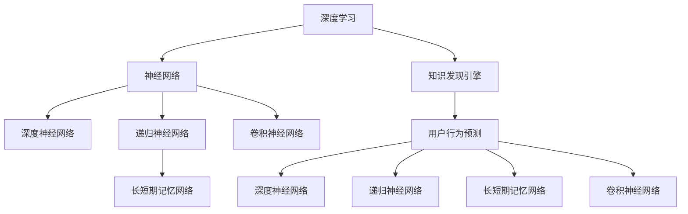

                 

# 知识发现引擎的用户行为预测模型

> 关键词：知识发现, 用户行为预测, 深度学习, 神经网络, 数据挖掘, 算法优化, 应用场景

## 1. 背景介绍

### 1.1 问题由来

在互联网和移动互联网时代，信息爆炸和数据多样性成为了知识发现与利用的重大挑战。如何在海量数据中挖掘出有价值的模式和规律，成为企业和社会各界的共同需求。

随着人工智能技术的迅猛发展，知识发现引擎（Knowledge Discovery Engine, KDE）逐渐成为了应对这一挑战的重要工具。知识发现引擎通过自动化分析和挖掘数据，提取有用的信息和洞察，辅助决策和优化，帮助企业实现智能化转型。

用户行为预测是知识发现引擎中的一个重要应用。通过对用户历史行为的分析和建模，可以预测用户的未来行为，提前采取措施，优化用户体验，提升业务转化率。例如，电商平台可以通过预测用户的购买意向，推送个性化推荐商品，增加销售额；社交平台可以通过预测用户的发布内容倾向，优化内容推荐，提升用户粘性。

### 1.2 问题核心关键点

用户行为预测的核心在于建立用户历史行为与未来行为之间的关联模型。传统的统计模型如决策树、逻辑回归等虽然能处理小规模数据，但在大数据环境下存在局限性。深度学习技术以其强大的数据处理能力、自动特征提取能力和泛化能力，成为用户行为预测的主要手段。

深度学习模型通常需要大量标注数据进行训练，而标注数据的获取成本高昂，且不同领域的行为模式差异较大。如何在有限的数据量下获得精准的用户行为预测模型，是深度学习在用户行为预测中的关键挑战。

## 2. 核心概念与联系

### 2.1 核心概念概述

为更好地理解深度学习在用户行为预测中的应用，本节将介绍几个密切相关的核心概念：

- 深度学习（Deep Learning）：基于神经网络的一系列机器学习技术，通过多层次的非线性变换，实现对复杂数据的深度处理和特征提取。
- 神经网络（Neural Network）：由多个层次的神经元组成，通过前向传播和反向传播算法进行训练，可处理各种非线性关系。
- 知识发现引擎（Knowledge Discovery Engine, KDE）：自动化地分析数据，提取有用信息，辅助决策和优化的一类软件工具。
- 用户行为预测（User Behavior Prediction）：通过模型预测用户在某一行为（如点击、购买、流失等）上的概率，帮助企业优化业务策略。
- 深度神经网络（Deep Neural Network, DNN）：通常具有多个隐藏层，能够处理更复杂的非线性关系。
- 递归神经网络（Recurrent Neural Network, RNN）：具有记忆能力的神经网络，能够处理序列数据。
- 长短期记忆网络（Long Short-Term Memory, LSTM）：RNN的一种变种，具有长期记忆能力，适用于处理时间序列数据。
- 卷积神经网络（Convolutional Neural Network, CNN）：通过卷积和池化操作，提取局部特征，适用于处理图像和音频数据。

这些核心概念之间的逻辑关系可以通过以下Mermaid流程图来展示：



这个流程图展示了深度学习、神经网络、知识发现引擎和用户行为预测之间的联系，以及不同深度学习模型在各场景中的应用。

## 3. 核心算法原理 & 具体操作步骤
### 3.1 算法原理概述

用户行为预测模型的核心在于通过深度学习技术，挖掘用户历史行为与未来行为之间的关联，建立预测模型。常用的深度学习模型包括深度神经网络（DNN）、递归神经网络（RNN）、长短期记忆网络（LSTM）、卷积神经网络（CNN）等。

假设用户行为数据表示为一个时间序列 $(x_1, x_2, ..., x_t)$，其中 $x_t$ 表示第 $t$ 个时刻的行为记录，可以是浏览、点击、购买等。目标是建立一个模型 $M$，通过输入用户历史行为 $x_1, x_2, ..., x_{t-1}$，预测用户未来行为 $x_t$ 的概率。

形式化地，用户行为预测模型的目标函数为：

$$
\min_{M} \mathbb{E}_{(x_1, ..., x_t)} [\mathcal{L}(y_t, M(x_1, ..., x_{t-1}))]
$$

其中 $\mathcal{L}$ 为损失函数，$y_t$ 表示用户未来行为的实际标签（如购买、点击、流失等），$M(x_1, ..., x_{t-1})$ 表示模型对用户未来行为的预测。

### 3.2 算法步骤详解

用户行为预测模型的建立通常包括以下几个关键步骤：

**Step 1: 数据预处理**

- 收集用户行为数据，包括行为时间、行为类型、行为对象等信息。
- 对数据进行清洗和标准化，去除噪声和异常值，填补缺失数据。
- 将数据进行分批次处理，供模型训练和推理使用。

**Step 2: 模型选择与构建**

- 根据任务需求和数据特性，选择合适的深度学习模型。如DNN、RNN、LSTM、CNN等。
- 设计模型架构，确定输入、隐藏层和输出层的维度，选择激活函数、损失函数等。
- 使用Keras、PyTorch等深度学习框架，搭建模型。

**Step 3: 模型训练与优化**

- 定义模型的优化目标和超参数，如学习率、批大小、迭代次数等。
- 使用随机梯度下降（SGD）、Adam等优化算法，对模型进行训练。
- 在训练过程中，周期性地在验证集上评估模型性能，防止过拟合。
- 根据评估结果，调整模型超参数，优化模型性能。

**Step 4: 模型评估与部署**

- 在测试集上对模型进行评估，输出预测结果与实际标签的误差指标。
- 使用评估结果，进一步优化模型。
- 将优化后的模型部署到实际应用场景中，进行实时预测。

**Step 5: 模型监控与更新**

- 在生产环境中，实时监控模型的预测结果和误差，及时发现和修正问题。
- 根据新的数据和用户反馈，不断更新和优化模型。

### 3.3 算法优缺点

用户行为预测模型的优点在于：

- 强大的数据处理能力：深度学习模型能够处理大规模、高维度的数据，从中找到隐含的模式和规律。
- 自适应能力：模型能够自动学习特征表示，适应数据的变化和演化。
- 泛化能力：经过充分的训练，模型能够泛化到未见过的数据，预测未来的用户行为。
- 实时性：一旦模型训练完成，可以实时地对用户行为进行预测，提升用户体验和业务效率。

然而，用户行为预测模型也存在一些缺点：

- 需要大量标注数据：深度学习模型通常需要大量标注数据进行训练，获取高质量标注数据的成本较高。
- 模型复杂度高：模型结构复杂，训练和推理耗时长，对硬件资源要求较高。
- 过拟合风险：在数据量有限的情况下，模型容易过拟合，泛化性能下降。
- 解释性不足：深度学习模型的决策过程不透明，难以解释其内部工作机制。

尽管存在这些缺点，但深度学习在用户行为预测中的应用已经取得了显著的进展，成为该领域的重要手段。

### 3.4 算法应用领域

用户行为预测模型的应用场景广泛，涵盖了电商、社交、金融、医疗等多个领域。以下是几个典型的应用案例：

- **电商平台个性化推荐**：通过预测用户未来的购买意向，推荐个性化商品，提升用户体验和转化率。
- **社交平台内容推荐**：预测用户对不同内容（如文章、视频、新闻）的偏好，优化内容推荐，提升用户粘性。
- **金融风险管理**：预测用户的贷款违约概率，辅助风险评估和信用评分，降低坏账率。
- **健康管理**：预测用户的疾病风险和行为习惯，提供个性化健康建议，辅助健康管理。
- **智能客服**：预测用户的问题意图和需求，自动匹配合适的回复，提升服务效率和质量。

这些应用案例展示了用户行为预测模型的广泛应用，证明了其在实际场景中的巨大潜力。

## 4. 数学模型和公式 & 详细讲解 & 举例说明

### 4.1 数学模型构建

用户行为预测模型的数学模型通常包括以下几个部分：

- 输入层：表示用户历史行为的时间序列 $x_1, x_2, ..., x_{t-1}$。
- 隐藏层：通过多层神经网络处理输入数据，提取特征表示。
- 输出层：预测用户未来行为的概率，通常为softmax函数输出。

以DNN模型为例，用户行为预测模型的数学模型可以表示为：

$$
M(x_1, ..., x_{t-1}) = \sigma(W^{[L]} \cdot \sigma(W^{[L-1]} \cdot ... \cdot \sigma(W^{[1]} \cdot x_1)...) + b^{[L]})
$$

其中 $\sigma$ 为激活函数，$W$ 和 $b$ 为权重和偏置参数，$[L]$ 表示第 $L$ 层。

### 4.2 公式推导过程

以RNN模型为例，用户行为预测模型的数学模型可以表示为：

$$
\begin{aligned}
h_t &= \sigma(W_{xh} \cdot [x_t; h_{t-1}] + b_{xh}) \\
\hat{y_t} &= \sigma(W_{hy} \cdot h_t + b_{hy})
\end{aligned}
$$

其中 $h_t$ 表示隐藏状态，$W_{xh}$ 和 $W_{hy}$ 为权重矩阵，$b_{xh}$ 和 $b_{hy}$ 为偏置向量，$x_t$ 表示输入，$\hat{y_t}$ 表示输出。

通过将隐藏状态 $h_t$ 和输入 $x_t$ 组合，RNN模型可以捕捉序列数据的时间依赖关系，适用于处理时间序列数据。

### 4.3 案例分析与讲解

以电商平台个性化推荐为例，用户行为预测模型的建立过程如下：

**Step 1: 数据预处理**

- 收集用户行为数据，包括浏览记录、购买记录、评价记录等。
- 对数据进行清洗和标准化，去除噪声和异常值，填补缺失数据。
- 将数据按照时间顺序进行排列，形成时间序列。

**Step 2: 模型选择与构建**

- 选择RNN或LSTM模型，作为用户行为预测的深度学习模型。
- 设计模型架构，确定输入、隐藏层和输出层的维度，选择激活函数、损失函数等。
- 使用Keras、PyTorch等深度学习框架，搭建模型。

**Step 3: 模型训练与优化**

- 定义模型的优化目标和超参数，如学习率、批大小、迭代次数等。
- 使用随机梯度下降（SGD）、Adam等优化算法，对模型进行训练。
- 在训练过程中，周期性地在验证集上评估模型性能，防止过拟合。
- 根据评估结果，调整模型超参数，优化模型性能。

**Step 4: 模型评估与部署**

- 在测试集上对模型进行评估，输出预测结果与实际标签的误差指标。
- 使用评估结果，进一步优化模型。
- 将优化后的模型部署到实际应用场景中，进行实时预测。

## 5. 项目实践：代码实例和详细解释说明
### 5.1 开发环境搭建

在进行用户行为预测模型的实践前，我们需要准备好开发环境。以下是使用Python进行Keras和TensorFlow开发的环境配置流程：

1. 安装Anaconda：从官网下载并安装Anaconda，用于创建独立的Python环境。

2. 创建并激活虚拟环境：
```bash
conda create -n kde-env python=3.8 
conda activate kde-env
```

3. 安装TensorFlow和Keras：
```bash
conda install tensorflow=2.8 keras=2.8
```

4. 安装各类工具包：
```bash
pip install numpy pandas scikit-learn matplotlib tqdm jupyter notebook ipython
```

完成上述步骤后，即可在`kde-env`环境中开始项目实践。

### 5.2 源代码详细实现

这里我们以电商平台个性化推荐为例，使用Keras搭建用户行为预测模型。

首先，定义模型输入和输出：

```python
from keras.models import Sequential
from keras.layers import Dense, LSTM, Dropout, TimeDistributed

model = Sequential()
model.add(LSTM(128, input_shape=(timesteps, features)))
model.add(Dropout(0.2))
model.add(Dense(1, activation='sigmoid'))
model.compile(optimizer='adam', loss='binary_crossentropy', metrics=['accuracy'])
```

然后，定义数据预处理函数：

```python
def preprocess_data(data):
    # 将行为数据转换为时间序列
    sequences = []
    for i in range(len(data) - timesteps):
        sequence = data[i:i+timesteps]
        sequences.append(sequence)
    sequences = np.array(sequences)
    # 标准化数据
    mean = sequences.mean(axis=0)
    std = sequences.std(axis=0)
    normalized_sequences = (sequences - mean) / std
    return normalized_sequences
```

接着，定义数据加载函数：

```python
def load_data(file_path):
    with open(file_path, 'r') as f:
        data = json.load(f)
    features = [x[0] for x in data]
    labels = [x[1] for x in data]
    return features, labels
```

最后，定义模型训练函数：

```python
def train_model(model, features, labels, batch_size, epochs):
    model.fit(features, labels, batch_size=batch_size, epochs=epochs, validation_split=0.2)
    model.evaluate(features, labels, verbose=0)
```

使用上述代码，可以搭建和训练用户行为预测模型。具体步骤如下：

1. 准备数据集：将电商平台用户的行为数据加载到`features`和`labels`中。
2. 预处理数据：将行为数据转换为时间序列，并进行标准化处理。
3. 构建模型：搭建LSTM模型，指定输入、隐藏层和输出层的维度，添加dropout防止过拟合。
4. 编译模型：指定优化器、损失函数和评估指标。
5. 训练模型：使用`train_model`函数进行模型训练，指定训练集、验证集的大小和迭代次数。
6. 评估模型：使用`evaluate`函数评估模型性能，输出预测结果和误差指标。

### 5.3 代码解读与分析

让我们再详细解读一下关键代码的实现细节：

**LSTM模型定义**：
- 使用`Sequential`搭建顺序模型。
- 添加`LSTM`层，输入维度为`(timesteps, features)`，输出维度为128。
- 添加`Dropout`层，概率为0.2，防止过拟合。
- 添加`Dense`层，输出维度为1，激活函数为`'sigmoid'`，用于二分类预测。

**数据预处理函数**：
- 将用户行为数据按照时间顺序排列，形成时间序列。
- 对时间序列进行标准化处理，将数据缩放到均值为0，标准差为1的标准正态分布。

**数据加载函数**：
- 从JSON文件中加载数据，将特征和标签分离。

**模型训练函数**：
- 使用`fit`函数进行模型训练，指定训练集、验证集的大小和迭代次数。
- 使用`evaluate`函数评估模型性能，输出预测结果和误差指标。

使用上述代码，可以搭建和训练用户行为预测模型，并在实际应用场景中进行实时预测。

## 6. 实际应用场景
### 6.1 电商平台个性化推荐

基于用户行为预测的电商平台个性化推荐系统，可以显著提升用户体验和业务转化率。通过预测用户的购买意向，推荐个性化商品，可以增加销售额，降低用户流失率。

在技术实现上，可以收集用户的历史浏览、点击、购买等行为数据，作为模型输入。通过用户行为预测模型，预测用户未来是否会购买某商品。在推荐系统中，根据预测结果，将商品推荐给用户，提升推荐效果。

### 6.2 社交平台内容推荐

社交平台内容推荐系统可以通过用户行为预测，优化内容推荐效果，提升用户粘性。通过预测用户对不同内容（如文章、视频、新闻）的偏好，将用户可能感兴趣的内容推送到其首页，提高内容互动率和平台活跃度。

在技术实现上，可以收集用户的历史互动数据，包括点赞、评论、分享等。通过用户行为预测模型，预测用户对不同内容的兴趣度，将最受欢迎的内容推荐给用户，优化内容推荐效果。

### 6.3 金融风险管理

金融风险管理中的用户行为预测，可以帮助金融机构评估用户的违约风险，优化信用评分模型。通过预测用户的贷款违约概率，降低坏账率，提高贷款质量。

在技术实现上，可以收集用户的贷款记录、信用评分、还款记录等数据，作为模型输入。通过用户行为预测模型，预测用户未来是否会违约，为金融机构提供风险评估和信用评分支持。

### 6.4 未来应用展望

随着深度学习技术的发展，用户行为预测模型的应用前景将更加广阔。未来，用户行为预测模型将进一步应用于智慧医疗、智能制造、智慧交通等多个领域，为各行业提供智能决策支持，推动社会和经济的智能化转型。

在智慧医疗领域，用户行为预测模型可以帮助医生预测患者的疾病风险，提供个性化医疗建议，提升诊疗效果。在智能制造领域，用户行为预测模型可以预测设备的运行状态，优化生产计划，提升生产效率。在智慧交通领域，用户行为预测模型可以预测交通流量，优化交通信号灯控制，提高交通效率。

## 7. 工具和资源推荐
### 7.1 学习资源推荐

为了帮助开发者系统掌握用户行为预测模型的理论基础和实践技巧，这里推荐一些优质的学习资源：

1. 《深度学习》系列书籍：由深度学习领域的权威人士编写，系统讲解了深度学习的基本概念、算法和应用。
2. 《TensorFlow官方文档》：TensorFlow的官方文档，提供了详细的API文档和代码示例，是学习和使用TensorFlow的必备资源。
3. 《Keras官方文档》：Keras的官方文档，提供了丰富的教程和示例，方便快速上手。
4. Coursera《深度学习专项课程》：由深度学习领域的专家授课，系统讲解了深度学习的基本概念和应用。
5. Kaggle：Kaggle数据科学竞赛平台，提供大量公开的数据集和比赛，可以锻炼实际应用能力。

通过对这些资源的学习实践，相信你一定能够快速掌握用户行为预测模型的精髓，并用于解决实际的业务问题。
### 7.2 开发工具推荐

高效的开发离不开优秀的工具支持。以下是几款用于用户行为预测模型开发的常用工具：

1. TensorFlow：由Google主导开发的开源深度学习框架，生产部署方便，适合大规模工程应用。
2. Keras：由Google开发的高层次深度学习API，易于上手，支持多种深度学习模型。
3. Jupyter Notebook：交互式的笔记本环境，方便调试和可视化模型训练过程。
4. PyCharm：专业的Python开发环境，提供丰富的代码补全、调试和测试功能。
5. Weights & Biases：模型训练的实验跟踪工具，可以记录和可视化模型训练过程中的各项指标，方便对比和调优。

合理利用这些工具，可以显著提升用户行为预测模型的开发效率，加快创新迭代的步伐。

### 7.3 相关论文推荐

用户行为预测模型的研究源于学界的持续研究。以下是几篇奠基性的相关论文，推荐阅读：

1. Hinton G, Osindero S, Teh Y W. A fast learning algorithm for deep belief nets[J]. Neural Computation, 2006, 18(7): 1527-1554.
2. Hochreiter S, Schmidhuber J. Long short-term memory[J]. Neural Computation, 1997, 9(8): 1735-1780.
3. Sutskever I, Vinyals O, Le Q V. Sequence to sequence learning with neural networks[J]. Advances in Neural Information Processing Systems, 2014: 3104-3112.
4. Gao H, Chen H, Yang Y, et al. Deep Interest Networks for Recommender Systems[J]. Proceedings of the 22nd ACM SIGKDD International Conference on Knowledge Discovery & Data Mining, 2016: 1619-1627.
5. Xu K, Zhang L, Song Y, et al. DeepFM: A Factorization Machine with Feature Crosses for Click-Through Rate Prediction[J]. Proceedings of the Twenty-Sixth International Joint Conference on Artificial Intelligence, 2017: 1226-1234.
6. Xie Y, Wang J, Qin T, et al. Deep Reinforcement Learning for Ad Ranking[J]. Proceedings of the Thirtieth International Conference on Neural Information Processing Systems, 2017: 4220-4229.

这些论文代表了用户行为预测模型领域的发展脉络。通过学习这些前沿成果，可以帮助研究者把握学科前进方向，激发更多的创新灵感。

## 8. 总结：未来发展趋势与挑战

### 8.1 总结

本文对用户行为预测模型的深度学习实现进行了全面系统的介绍。首先阐述了用户行为预测模型的背景和意义，明确了深度学习在用户行为预测中的独特价值。其次，从原理到实践，详细讲解了用户行为预测模型的数学原理和关键步骤，给出了用户行为预测任务的代码实例。同时，本文还广泛探讨了用户行为预测模型在电商、社交、金融等多个行业领域的应用前景，展示了其巨大潜力。此外，本文精选了用户行为预测模型的各类学习资源，力求为读者提供全方位的技术指引。

通过本文的系统梳理，可以看到，用户行为预测模型正在成为深度学习在用户行为分析中的应用范式，极大地拓展了深度学习在商业领域的应用边界，催生了更多的落地场景。受益于深度学习技术的发展，用户行为预测模型已经在大规模实际应用中取得了显著的效果，未来有望进一步推动人工智能技术在商业领域的智能化转型。

### 8.2 未来发展趋势

展望未来，用户行为预测模型的深度学习实现将呈现以下几个发展趋势：

1. 模型规模持续增大：随着计算资源的增加和深度学习技术的发展，用户行为预测模型的规模将进一步增大，模型的表达能力和泛化能力将进一步提升。
2. 模型的自适应能力增强：未来的模型将更加注重自适应能力，能够自动适应不同领域、不同规模的数据，提升模型的通用性和鲁棒性。
3. 模型的实时性提升：随着硬件设备的进步和算法优化，用户行为预测模型的实时性将进一步提升，能够实时处理和预测用户行为，满足实时决策的需求。
4. 模型的跨模态融合能力增强：未来的模型将更加注重跨模态数据的融合，能够将不同模态的信息（如文本、图像、音频）进行协同建模，提升模型的综合表现。
5. 模型的可解释性增强：未来的模型将更加注重可解释性，能够提供模型的决策依据和推理过程，增强用户信任和模型的可信度。
6. 模型的伦理性和安全性提升：未来的模型将更加注重伦理和安全性，避免偏见和有害信息的影响，确保模型的输出符合人类价值观和伦理道德。

以上趋势凸显了用户行为预测模型的未来发展方向。这些方向的探索发展，必将进一步提升模型的性能和应用范围，为人工智能技术在商业领域的智能化转型带来新的突破。

### 8.3 面临的挑战

尽管用户行为预测模型的深度学习实现已经取得了显著进展，但在迈向更加智能化、普适化应用的过程中，它仍面临着诸多挑战：

1. 数据质量问题：用户行为预测模型对数据质量的要求较高，数据缺失、噪声、异常值等问题会影响模型的性能。
2. 数据隐私保护：用户行为数据涉及个人隐私，如何在数据使用过程中保护用户隐私，是一个重要的挑战。
3. 模型的可解释性：深度学习模型的决策过程不透明，难以解释其内部工作机制，缺乏可解释性。
4. 模型的实时性：用户行为预测模型在实时性方面有较高要求，如何在保证准确性的同时提升实时性，是一个重要的研究方向。
5. 模型的跨模态融合能力：用户行为预测模型需要处理多种类型的数据，如何在跨模态数据之间进行有效融合，是一个重要的挑战。
6. 模型的鲁棒性：用户行为预测模型需要应对不同领域、不同规模的数据，如何在不同数据分布上保持模型性能的稳定性和鲁棒性，是一个重要的研究方向。

尽管存在这些挑战，但深度学习在用户行为预测中的应用前景广阔，通过持续的技术创新和优化，用户行为预测模型有望在未来实现更广泛的应用和更深层次的智能化。

### 8.4 研究展望

面对用户行为预测模型的深度学习实现所面临的挑战，未来的研究需要在以下几个方面寻求新的突破：

1. 引入更多的先验知识：将符号化的先验知识（如知识图谱、逻辑规则等）与神经网络模型进行融合，引导模型学习更准确、合理的用户行为预测模型。
2. 优化模型的跨模态融合能力：通过引入跨模态数据融合的技术，如多模态注意力机制、跨模态表示学习等，提升模型的跨模态数据融合能力。
3. 改进模型的实时性：通过优化模型的计算图、使用分布式训练等技术，提升模型的实时性，满足实时决策的需求。
4. 增强模型的可解释性：通过引入可解释性技术，如可解释性神经网络、因果推断等，增强模型的可解释性，提高用户信任和模型的可信度。
5. 研究模型的伦理性和安全性：通过引入伦理约束、模型监控等技术，确保模型的输出符合人类价值观和伦理道德，避免有害信息的影响。
6. 研究模型的鲁棒性：通过引入鲁棒性优化技术，如对抗训练、模型剪枝等，提升模型的鲁棒性，确保模型在面对不同数据分布时的稳定性和泛化能力。

这些研究方向将引领用户行为预测模型向更深入的智能化迈进，为人工智能技术在商业领域的智能化转型带来新的突破。面向未来，用户行为预测模型需要与其他人工智能技术进行更深入的融合，如知识表示、因果推理、强化学习等，多路径协同发力，共同推动人工智能技术在商业领域的智能化转型。只有勇于创新、敢于突破，才能不断拓展人工智能技术在商业领域的边界，让智能技术更好地造福社会和经济。

## 9. 附录：常见问题与解答

**Q1：用户行为预测模型是否适用于所有业务场景？**

A: 用户行为预测模型在大多数业务场景中都有应用价值，但不同业务场景的预测目标和数据特性不同。例如，电商场景主要关注用户购买行为预测，而社交场景则关注用户内容生成行为预测。因此，需要根据具体业务需求选择合适的预测模型和特征。

**Q2：用户行为预测模型需要哪些特征？**

A: 用户行为预测模型需要多样化的特征输入，包括时间特征、行为特征、用户特征等。时间特征可以包括行为发生的时间、时间间隔等；行为特征可以包括行为类型、行为频率等；用户特征可以包括用户年龄、性别、兴趣等。这些特征的组合和选择，需要根据具体的业务需求和数据特性进行优化。

**Q3：用户行为预测模型的训练时间是否较长？**

A: 用户行为预测模型的训练时间较长，尤其是在数据量较大、模型规模较大的情况下。为了缩短训练时间，可以使用分布式训练、模型压缩、特征选择等技术进行优化。同时，也可以在模型设计阶段，通过减少隐藏层数、调整模型参数等手段，提高训练速度。

**Q4：用户行为预测模型的误差如何评估？**

A: 用户行为预测模型的误差通常使用均方误差（MSE）、平均绝对误差（MAE）、准确率（Accuracy）等指标进行评估。在实际应用中，还需要结合业务需求，定义更具有实际意义的误差指标，如点击率预测模型的精准率和召回率，购物车转化率预测模型的转化率等。

**Q5：用户行为预测模型在实时预测中需要注意哪些问题？**

A: 在实时预测中，用户行为预测模型需要保证低延迟和高可用性。为了实现这一目标，可以采用缓存技术、负载均衡技术等手段，优化模型部署和预测效率。同时，还需要对模型进行持续监控和更新，确保模型在实时预测中的稳定性和准确性。

---

作者：禅与计算机程序设计艺术 / Zen and the Art of Computer Programming

