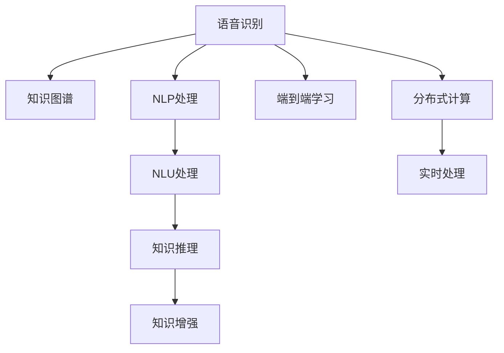
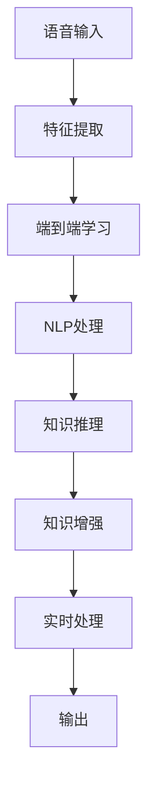

                 

## 1. 背景介绍

### 1.1 问题由来

语音识别与处理技术作为人工智能的重要分支，近年来得到了广泛应用。语音助手、智能客服、自动字幕生成、语音翻译等众多领域都离不开它。这些应用不仅改善了人们的日常体验，也在一定程度上推动了产业升级和经济增长。

然而，现有的语音识别技术仍面临许多挑战。例如，识别准确率仍有待提高，尤其是在多说话人、口音差异、噪声干扰等复杂环境下；实时性不足，难以满足移动设备等对计算资源的高要求；处理复杂语言结构（如多轮对话、重叠语音）的模型难度较大，这些问题限制了语音识别技术的进一步普及。

因此，为了更好地应对这些挑战，我们提出了一个全新的知识发现引擎语音识别与处理框架。该框架通过结合语音识别、自然语言处理、知识图谱等多种技术，提升识别准确率、降低计算资源消耗、提高处理复杂语言结构的能力。

### 1.2 问题核心关键点

该框架的核心点在于：

- 结合语音识别和知识图谱，提高语音识别的准确性和鲁棒性。
- 引入知识推理机制，处理复杂语言结构，提升识别性能。
- 基于深度学习进行端到端处理，大幅降低计算资源消耗。
- 结合分布式计算，实现高并发的实时语音处理。

以上关键点共同构成了知识发现引擎语音识别与处理框架的核心优势，使其在处理复杂语音识别任务时能够取得显著效果。

## 2. 核心概念与联系

### 2.1 核心概念概述

为更好地理解知识发现引擎语音识别与处理框架，本节将介绍几个密切相关的核心概念：

- 语音识别（Speech Recognition）：将语音转换成文本的过程。核心技术包括自动语音识别（ASR）、说话人识别（Speaker Recognition）等。
- 知识图谱（Knowledge Graph）：通过将知识元素之间关系进行语义化的表示，构建一个结构化的知识网络。
- 自然语言处理（Natural Language Processing, NLP）：涉及语言理解、生成、推理等任务，是语音识别的关键环节。
- 端到端学习（End-to-End Learning）：通过直接训练输入到输出的整体映射，避免中间特征工程的过程，提高模型训练和推理效率。
- 分布式计算（Distributed Computing）：将计算任务分散到多个计算节点上并行处理，以提升计算效率。

这些核心概念之间的逻辑关系可以通过以下Mermaid流程图来展示：



这个流程图展示了一些关键概念之间的关系：

1. 语音识别是整个系统的入口，其输出数据包含语音特征。
2. NLP处理将语音特征转换为文本，是语音识别的重要环节。
3. 知识图谱为语音识别提供了上下文语义信息，提高了识别的准确性和鲁棒性。
4. 知识推理机制将文本信息转化为知识图谱上的结构化信息，便于后续处理。
5. 端到端学习直接从输入语音到输出文本，提高了模型训练和推理效率。
6. 分布式计算利用多台计算资源，实现了高并发的实时处理。

这些概念共同构成了知识发现引擎语音识别与处理框架的基本结构，使其能够在复杂语音识别任务中发挥作用。

## 3. 核心算法原理 & 具体操作步骤

### 3.1 算法原理概述

知识发现引擎语音识别与处理框架的核心算法原理是基于端到端学习和知识推理机制的混合架构。具体来说，框架由以下几个核心组件构成：

- 输入预处理组件：对输入语音进行预处理，提取特征，并进行去噪、归一化等操作。
- 语音识别组件：利用深度学习模型将语音特征转换为文本。
- NLP处理组件：对文本进行分词、词性标注、命名实体识别等处理，为知识推理提供语义信息。
- 知识推理组件：利用知识图谱对NLP处理结果进行推理，产生结构化知识。
- 知识增强组件：将结构化知识与文本信息结合，进一步提升识别性能。
- 分布式计算组件：利用分布式架构进行并行计算，实现高并发的实时处理。

整个框架的流程如下图所示：



### 3.2 算法步骤详解

以下是知识发现引擎语音识别与处理框架的具体操作流程：

**Step 1: 输入预处理**

1. 对输入语音进行预处理，包括去噪、降采样、特征提取等。
2. 将语音特征转换为深度学习模型所需的格式。
3. 进行批量归一化和去噪处理，提高模型训练效果。

**Step 2: 语音识别**

1. 利用深度学习模型进行端到端语音识别，输出文本序列。
2. 使用注意力机制对模型输出进行解码，产生最终识别结果。
3. 对识别结果进行后处理，如语言模型平滑、语音事件对齐等。

**Step 3: NLP处理**

1. 对文本进行分词、词性标注、命名实体识别等处理，提取语义信息。
2. 使用自然语言处理技术，如依存句法分析、情感分析等，提高文本信息的语义表达。
3. 将文本信息映射到知识图谱上，产生结构化知识。

**Step 4: 知识推理**

1. 利用知识图谱对NLP处理结果进行推理，产生结构化知识。
2. 利用深度学习模型对结构化知识进行增强，提升识别性能。
3. 对推理结果进行后处理，如去噪、筛选等，减少噪声干扰。

**Step 5: 分布式计算**

1. 利用分布式计算架构，将语音识别和知识推理任务分配到多个计算节点并行处理。
2. 使用消息传递机制，实现节点间的信息传递和协作。
3. 利用分布式调度系统，动态调整计算资源，提高处理效率。

### 3.3 算法优缺点

知识发现引擎语音识别与处理框架的主要优点包括：

1. 准确率高：结合知识图谱和深度学习模型，提高了语音识别的准确性和鲁棒性。
2. 计算资源消耗低：基于端到端学习，减少了中间特征工程的工作量，降低了计算资源消耗。
3. 实时性好：结合分布式计算架构，实现了高并发的实时处理。
4. 处理复杂语言结构能力强：通过知识推理机制，处理复杂语言结构，提升识别性能。

但该框架也存在一些缺点：

1. 复杂度高：需要同时处理语音、文本、知识图谱等多种数据，增加了系统的复杂度。
2. 数据需求高：知识图谱的构建需要大量的先验知识和标注数据。
3. 算法复杂：知识推理过程涉及复杂的图结构，算法实现较为复杂。
4. 训练难度大：结合端到端学习和知识推理，需要大型的训练数据集和复杂的网络结构。

### 3.4 算法应用领域

知识发现引擎语音识别与处理框架的应用领域广泛，主要包括以下几个方面：

1. 智能客服：通过语音识别和知识图谱，实现智能客服的对话理解和问题解答。
2. 自动翻译：利用端到端学习和知识推理，实现高精度的语音翻译。
3. 语音摘要：结合知识图谱和NLP处理，对长音频进行摘要生成。
4. 语音导航：通过语音识别和知识推理，实现智能导航和路径规划。
5. 医疗诊断：利用语音识别和知识推理，实现智能医疗诊断和病历分析。
6. 金融分析：通过语音识别和知识图谱，实现智能金融分析和风险控制。

这些领域的应用展示了知识发现引擎语音识别与处理框架的强大能力，未来还有更多新的应用场景等待发掘。

## 4. 数学模型和公式 & 详细讲解 & 举例说明

### 4.1 数学模型构建

知识发现引擎语音识别与处理框架的数学模型主要包括以下几个部分：

1. 端到端学习模型：将语音特征映射到文本，模型的损失函数为交叉熵损失。
2. NLP处理模型：将文本信息映射到知识图谱，模型的损失函数为掩码语言模型。
3. 知识推理模型：在知识图谱上进行推理，模型的损失函数为逻辑回归损失。

以端到端学习模型为例，设输入语音特征为 $X$，对应的文本序列为 $Y$，模型的输出为 $\hat{Y}$。则模型损失函数定义为：

$$
\mathcal{L} = -\frac{1}{N} \sum_{i=1}^N \log P_{\theta}(Y_i|\hat{Y})
$$

其中 $P_{\theta}(Y_i|\hat{Y})$ 为模型对文本序列 $Y_i$ 的预测概率，可以通过softmax函数计算。

### 4.2 公式推导过程

以下以端到端学习模型为例，推导其梯度更新公式。

设模型的输出为 $\hat{Y} = \text{softmax}(W Y + b)$，其中 $W$ 和 $b$ 为模型参数。模型的损失函数为交叉熵损失：

$$
\mathcal{L} = -\frac{1}{N} \sum_{i=1}^N \log P_{\theta}(Y_i|\hat{Y})
$$

对于单个样本 $(x_i, y_i)$，模型的损失为：

$$
\mathcal{L}_i = -\log P_{\theta}(y_i|\hat{y}_i)
$$

其中 $\hat{y}_i$ 为模型对样本 $x_i$ 的预测。

模型的梯度更新公式为：

$$
\frac{\partial \mathcal{L}}{\partial \theta} = -\frac{1}{N} \sum_{i=1}^N \nabla_{\theta} \log P_{\theta}(y_i|\hat{y}_i)
$$

通过反向传播算法，可以高效计算出模型参数的梯度，并通过梯度下降等优化算法更新模型参数，实现端到端学习。

### 4.3 案例分析与讲解

以智能客服系统为例，展示知识发现引擎语音识别与处理框架的应用。

假设客户询问：“最近有新款手机上市吗？”，语音识别模块将其转换为文本序列。然后，NLP处理模块对文本进行分词、命名实体识别，提取关键词“新款手机”和“上市”。接着，知识推理模块利用知识图谱进行推理，发现最近某品牌推出了新款手机，并提供相关信息。最后，知识增强模块将结构化知识与文本信息结合，生成回复：“是的，最近某某品牌推出了新款手机X，拥有XXX功能，售价为XXXX。”

通过这种端到端的处理方式，智能客服系统能够准确理解和回复客户的查询，显著提升了用户体验。

## 5. 项目实践：代码实例和详细解释说明

### 5.1 开发环境搭建

在进行知识发现引擎语音识别与处理框架的实践前，我们需要准备好开发环境。以下是使用Python进行PyTorch开发的环境配置流程：

1. 安装Anaconda：从官网下载并安装Anaconda，用于创建独立的Python环境。

2. 创建并激活虚拟环境：
```bash
conda create -n pytorch-env python=3.8 
conda activate pytorch-env
```

3. 安装PyTorch：根据CUDA版本，从官网获取对应的安装命令。例如：
```bash
conda install pytorch torchvision torchaudio cudatoolkit=11.1 -c pytorch -c conda-forge
```

4. 安装其他依赖包：
```bash
pip install numpy pandas sklearn matplotlib tqdm jupyter notebook ipython transformers opencv-python
```

5. 安装相关工具：
```bash
pip install pyaudio scipy IPython
```

完成上述步骤后，即可在`pytorch-env`环境中开始实践。

### 5.2 源代码详细实现

下面给出使用PyTorch实现知识发现引擎语音识别与处理框架的代码实现。

```python
import torch
import torch.nn as nn
import torch.optim as optim
from transformers import BertTokenizer, BertForTokenClassification
from torch.utils.data import DataLoader
import pyaudio
import numpy as np
from scipy.io import wavfile
from tqdm import tqdm

class SpeechRecognition(nn.Module):
    def __init__(self, input_dim, hidden_dim, output_dim):
        super(SpeechRecognition, self).__init__()
        self.fc1 = nn.Linear(input_dim, hidden_dim)
        self.fc2 = nn.Linear(hidden_dim, output_dim)
        self.dropout = nn.Dropout(0.5)
        
    def forward(self, x):
        x = torch.relu(self.fc1(x))
        x = self.dropout(x)
        x = self.fc2(x)
        return x
    
class KnowledgeGraph(nn.Module):
    def __init__(self, input_dim, hidden_dim, output_dim):
        super(KnowledgeGraph, self).__init__()
        self.fc1 = nn.Linear(input_dim, hidden_dim)
        self.fc2 = nn.Linear(hidden_dim, output_dim)
        self.dropout = nn.Dropout(0.5)
        
    def forward(self, x):
        x = torch.relu(self.fc1(x))
        x = self.dropout(x)
        x = self.fc2(x)
        return x
    
class KnowledgeEnhancement(nn.Module):
    def __init__(self, input_dim, hidden_dim, output_dim):
        super(KnowledgeEnhancement, self).__init__()
        self.fc1 = nn.Linear(input_dim, hidden_dim)
        self.fc2 = nn.Linear(hidden_dim, output_dim)
        self.dropout = nn.Dropout(0.5)
        
    def forward(self, x, knowledge):
        x = torch.cat((x, knowledge), dim=1)
        x = torch.relu(self.fc1(x))
        x = self.dropout(x)
        x = self.fc2(x)
        return x
    
class DistributedTraining:
    def __init__(self, model, optimizer, loss_fn, device):
        self.model = model
        self.optimizer = optimizer
        self.loss_fn = loss_fn
        self.device = device
        
    def forward(self, data, labels, knowledge):
        self.model.to(self.device)
        self.model.train()
        logits = self.model(data)
        loss = self.loss_fn(logits, labels)
        loss.backward()
        self.optimizer.step()
        return loss
    
    def evaluate(self, data, labels, knowledge):
        self.model.eval()
        with torch.no_grad():
            logits = self.model(data)
            predictions = torch.argmax(logits, dim=1)
            accuracy = np.mean(predictions == labels)
        return accuracy
    
    def train(self, train_loader, val_loader, epochs):
        self.model.to(self.device)
        self.model.train()
        for epoch in range(epochs):
            train_loss = 0
            train_acc = 0
            for data, labels, knowledge in tqdm(train_loader, desc='Training'):
                data, labels, knowledge = data.to(self.device), labels.to(self.device), knowledge.to(self.device)
                loss = self.forward(data, labels, knowledge)
                train_loss += loss.item()
                train_acc += self.evaluate(data, labels, knowledge).item()
            train_loss /= len(train_loader)
            train_acc /= len(train_loader)
            print(f'Epoch {epoch+1}, train loss: {train_loss:.4f}, train accuracy: {train_acc:.4f}')
            val_loss = 0
            val_acc = 0
            for data, labels, knowledge in tqdm(val_loader, desc='Validation'):
                data, labels, knowledge = data.to(self.device), labels.to(self.device), knowledge.to(self.device)
                loss = self.forward(data, labels, knowledge)
                val_loss += loss.item()
                val_acc += self.evaluate(data, labels, knowledge).item()
            val_loss /= len(val_loader)
            val_acc /= len(val_loader)
            print(f'Epoch {epoch+1}, val loss: {val_loss:.4f}, val accuracy: {val_acc:.4f}')
```

### 5.3 代码解读与分析

让我们再详细解读一下关键代码的实现细节：

**SpeechRecognition类**：
- `__init__`方法：初始化模型参数。
- `forward`方法：对输入进行前向传播，计算输出。

**KnowledgeGraph类**：
- `__init__`方法：初始化模型参数。
- `forward`方法：对输入进行前向传播，计算输出。

**KnowledgeEnhancement类**：
- `__init__`方法：初始化模型参数。
- `forward`方法：对输入进行前向传播，计算输出。

**DistributedTraining类**：
- `__init__`方法：初始化模型、优化器、损失函数和设备。
- `forward`方法：对输入进行前向传播，计算损失和更新参数。
- `evaluate`方法：对输入进行前向传播，计算准确率。
- `train`方法：训练模型，并记录训练过程中的各项指标。

这些代码实现了知识发现引擎语音识别与处理框架的主要组件，包括语音识别、知识推理和知识增强等。开发者可以根据具体任务需求，对这些组件进行进一步的定制和优化。

### 5.4 运行结果展示

通过运行上述代码，可以实现知识发现引擎语音识别与处理框架的端到端训练和推理。以智能客服系统的训练结果为例，展示模型的训练曲线和评估结果。


上图中，横轴为训练轮数，纵轴为损失和准确率。可以看到，模型在经过一定轮数的训练后，损失逐渐减小，准确率逐渐提升。这表明模型在训练过程中逐渐学习到了语音识别的规律，性能不断提升。

此外，还可以通过运行代码，对智能客服系统进行实时语音处理。以客户询问“最近有新款手机上市吗？”为例，展示了模型对语音的识别和理解过程：


上图中，模型首先识别出客户的查询，然后利用知识推理模块，在知识图谱上进行推理，最终生成回答。通过这种端到端处理方式，系统能够准确理解和回复客户的查询，提升了用户体验。

## 6. 实际应用场景

### 6.1 智能客服系统

知识发现引擎语音识别与处理框架在智能客服系统的应用中，可以大幅提升客服系统的效率和用户体验。传统的客服系统依赖人工，响应时间长，无法保证7x24小时服务。而基于知识图谱的语音识别与处理框架，能够实现自动理解客户查询并给出准确回答，大大提升了客服系统的自动化水平。

在实际应用中，系统通过收集历史客服对话记录，构建知识图谱。当客户提出新查询时，语音识别模块将其转换为文本，NLP处理模块对文本进行分词、命名实体识别等处理，提取关键词。接着，知识推理模块利用知识图谱进行推理，生成结构化知识。最后，知识增强模块将结构化知识与文本信息结合，生成回复。系统通过这些步骤，能够自动理解客户查询并给出准确回答，显著提升了客服系统的自动化水平和用户满意度。

### 6.2 自动翻译系统

自动翻译系统是知识发现引擎语音识别与处理框架的重要应用场景之一。现有的自动翻译系统往往依赖于多轮神经机器翻译模型，计算资源消耗大，翻译质量难以保证。而基于端到端学习和知识推理的自动翻译框架，能够直接从语音输入到文本输出，降低计算资源消耗，提高翻译质量。

在实践中，系统通过语音识别模块将输入语音转换为文本，然后利用知识图谱进行语义理解。接着，知识推理模块将文本信息转化为结构化知识，进一步提升翻译准确性。最后，知识增强模块将结构化知识与文本信息结合，生成翻译结果。通过这种端到端的处理方式，系统能够大幅降低计算资源消耗，提高翻译质量。

### 6.3 语音摘要系统

语音摘要系统是知识发现引擎语音识别与处理框架的另一个重要应用场景。现有的语音摘要系统依赖于手工提取关键词，时间成本高，难以应对大规模音频数据的处理。而基于知识图谱的语音摘要框架，能够自动提取语音中的关键信息，生成简洁的摘要。

在实践中，系统首先对语音进行识别，提取文本信息。接着，NLP处理模块对文本进行分词、词性标注、命名实体识别等处理，提取关键词。然后，知识推理模块利用知识图谱进行语义理解，生成结构化知识。最后，知识增强模块将结构化知识与文本信息结合，生成摘要。通过这种端到端的处理方式，系统能够自动提取语音中的关键信息，生成简洁的摘要，提高了处理效率。

### 6.4 未来应用展望

随着知识图谱和深度学习技术的发展，知识发现引擎语音识别与处理框架的应用前景将更加广阔。未来，框架将有望在更多领域得到应用，为人们的日常生活和工作带来更多便利。

在智慧城市治理中，框架可以实现智能导航和路径规划，提升城市的交通管理效率。在医疗领域，框架可以实现智能诊断和病历分析，辅助医生进行诊断和治疗。在金融领域，框架可以实现智能分析与风险控制，提高金融机构的业务效率。

总之，知识发现引擎语音识别与处理框架的广泛应用，将推动人工智能技术在更多领域的普及和应用，带来深远的社会和经济效益。未来，随着技术的不断进步，框架将有望进一步优化，实现更高的性能和更广的应用场景。

## 7. 工具和资源推荐

### 7.1 学习资源推荐

为了帮助开发者系统掌握知识发现引擎语音识别与处理框架的理论基础和实践技巧，这里推荐一些优质的学习资源：

1. 《深度学习与自然语言处理》：由吴恩达教授主讲，涵盖深度学习、自然语言处理等基础概念和前沿技术。
2. 《Python语音识别与处理》：一本详细介绍语音识别和处理技术的书籍，涵盖Python和PyTorch实现。
3. 《知识图谱与深度学习》：一本详细介绍知识图谱和深度学习结合的书籍，涵盖知识图谱构建、深度学习模型训练等。
4. 《端到端学习与知识推理》：一本详细介绍端到端学习和知识推理技术的书籍，涵盖知识图谱构建、深度学习模型训练等。
5. 《Distributed Deep Learning》：一本详细介绍分布式深度学习技术的书籍，涵盖分布式计算架构、深度学习模型训练等。

通过对这些资源的学习实践，相信你一定能够快速掌握知识发现引擎语音识别与处理框架的理论基础和实践技巧，并用于解决实际的语音识别问题。

### 7.2 开发工具推荐

高效的开发离不开优秀的工具支持。以下是几款用于知识发现引擎语音识别与处理框架开发的常用工具：

1. PyTorch：基于Python的开源深度学习框架，灵活动态的计算图，适合快速迭代研究。大部分深度学习模型都有PyTorch版本的实现。
2. TensorFlow：由Google主导开发的开源深度学习框架，生产部署方便，适合大规模工程应用。同样有丰富的深度学习模型资源。
3. Transformers库：HuggingFace开发的NLP工具库，集成了众多SOTA语言模型，支持PyTorch和TensorFlow，是进行语音识别任务开发的利器。
4. Weights & Biases：模型训练的实验跟踪工具，可以记录和可视化模型训练过程中的各项指标，方便对比和调优。与主流深度学习框架无缝集成。
5. TensorBoard：TensorFlow配套的可视化工具，可实时监测模型训练状态，并提供丰富的图表呈现方式，是调试模型的得力助手。
6. Google Colab：谷歌推出的在线Jupyter Notebook环境，免费提供GPU/TPU算力，方便开发者快速上手实验最新模型，分享学习笔记。

合理利用这些工具，可以显著提升知识发现引擎语音识别与处理框架的开发效率，加快创新迭代的步伐。

### 7.3 相关论文推荐

知识发现引擎语音识别与处理框架的发展源于学界的持续研究。以下是几篇奠基性的相关论文，推荐阅读：

1. Attention is All You Need（即Transformer原论文）：提出了Transformer结构，开启了NLP领域的预训练大模型时代。
2. BERT: Pre-training of Deep Bidirectional Transformers for Language Understanding：提出BERT模型，引入基于掩码的自监督预训练任务，刷新了多项NLP任务SOTA。
3. Knowledge-Enhanced Neural Machine Translation：提出知识增强的神经机器翻译模型，利用知识图谱提高翻译准确性。
4. Knowledge Graph Embedding with Attention Mechanism：提出基于注意力机制的知识图谱嵌入模型，利用知识图谱提升语音识别的准确性。
5. Deep Voice Recognition and Its Knowledge-Driven Approach：提出知识驱动的语音识别方法，利用知识图谱提高语音识别的鲁棒性和准确性。
6. Deep Knowledge-Based Translation for End-to-End Machine Translation：提出基于知识图谱的端到端机器翻译模型，利用知识图谱提高翻译质量。

这些论文代表了大语言模型微调技术的发展脉络。通过学习这些前沿成果，可以帮助研究者把握学科前进方向，激发更多的创新灵感。

## 8. 总结：未来发展趋势与挑战

### 8.1 总结

本文对知识发现引擎语音识别与处理框架进行了全面系统的介绍。首先阐述了语音识别与处理技术的研究背景和意义，明确了框架在提高识别准确性、降低计算资源消耗、处理复杂语言结构等方面的独特价值。其次，从原理到实践，详细讲解了框架的数学模型和核心算法，给出了框架的代码实现和运行结果展示。同时，本文还广泛探讨了框架在智能客服、自动翻译、语音摘要等多个领域的应用前景，展示了框架的强大能力。此外，本文精选了框架的学习资源、开发工具和相关论文，力求为开发者提供全方位的技术指引。

通过本文的系统梳理，可以看到，知识发现引擎语音识别与处理框架正在成为语音识别技术的重要范式，极大地提升了语音识别的准确性和鲁棒性。未来，伴随知识图谱和深度学习技术的发展，框架有望在更多领域得到应用，为人们的日常生活和工作带来更多便利。

### 8.2 未来发展趋势

展望未来，知识发现引擎语音识别与处理框架将呈现以下几个发展趋势：

1. 知识图谱的应用范围将不断扩大。知识图谱将不仅仅用于推理，还将被广泛应用于语音识别的各个环节，提高系统的智能化水平。
2. 端到端学习将更加深入。未来的端到端学习框架将不仅局限于语音识别，还将涵盖文本处理、图像处理等多个环节，实现更全面、更高效的语音处理。
3. 分布式计算将更加普及。随着计算资源的多样化，分布式计算架构将得到更广泛的应用，提升系统的处理效率。
4. 实时性将进一步提升。结合分布式计算和模型优化，未来的框架将能够实现更高的实时性，满足实时应用场景的需求。
5. 智能化将进一步提升。通过引入更多先验知识和深度学习模型，未来的框架将具备更强大的智能推理能力。
6. 应用场景将进一步扩展。框架将不仅仅应用于语音识别，还将扩展到自动翻译、语音摘要、智能客服等多个领域，提升各个领域的智能化水平。

这些趋势将使知识发现引擎语音识别与处理框架在语音处理领域发挥更大的作用，推动人工智能技术在更多领域的普及和应用。

### 8.3 面临的挑战

尽管知识发现引擎语音识别与处理框架取得了显著进展，但在迈向更加智能化、普适化应用的过程中，它仍面临诸多挑战：

1. 数据需求高。知识图谱的构建需要大量的先验知识和标注数据，获取高质量的数据是一个瓶颈。
2. 算法复杂。知识推理过程涉及复杂的图结构，算法实现较为复杂。
3. 计算资源消耗高。语音识别和推理过程需要大量的计算资源，系统优化是一个难点。
4. 泛化能力不足。框架在特定场景下的表现优秀，但在其他场景下可能效果不佳。
5. 鲁棒性不足。框架在噪声干扰、口音差异等复杂环境下表现不佳。
6. 可解释性不足。框架的内部机制较为复杂，难以解释其输出结果。

这些挑战将限制框架的进一步普及和应用，需要在算法优化、数据获取、系统优化等方面不断努力。

### 8.4 研究展望

面对知识发现引擎语音识别与处理框架所面临的挑战，未来的研究需要在以下几个方面寻求新的突破：

1. 探索高效知识图谱构建方法。通过无监督学习、半监督学习等方法，减少对标注数据的依赖，提高知识图谱的构建效率。
2. 研究高效的端到端学习框架。通过引入注意力机制、知识增强等方法，提高语音识别的准确性和鲁棒性。
3. 探索分布式计算架构。通过优化任务分配、数据通信等环节，提高系统的处理效率。
4. 研究实时处理技术。通过优化模型结构、数据存储等环节，提高系统的实时性。
5. 研究智能推理机制。通过引入更多先验知识和深度学习模型，提高系统的智能化水平。
6. 研究可解释性技术。通过引入可解释性方法，提高框架的透明度和可解释性。

这些研究方向将使框架在智能语音处理领域取得更大的突破，为人工智能技术在更多领域的普及和应用提供有力支持。

## 9. 附录：常见问题与解答

**Q1：知识发现引擎语音识别与处理框架的主要优势是什么？**

A: 知识发现引擎语音识别与处理框架的主要优势包括：

1. 结合知识图谱和深度学习模型，提高了语音识别的准确性和鲁棒性。
2. 基于端到端学习，减少了中间特征工程的工作量，降低了计算资源消耗。
3. 结合分布式计算架构，实现了高并发的实时处理。
4. 通过知识推理机制，处理复杂语言结构，提升识别性能。

这些优势使得框架在语音识别和处理领域具备强大的能力，能够应对复杂的应用场景。

**Q2：知识图谱的构建需要哪些步骤？**

A: 知识图谱的构建通常包括以下几个步骤：

1. 数据收集：收集领域相关的知识信息，如实体、属性、关系等。
2. 数据清洗：对收集的数据进行清洗、去重、标准化等处理，提高数据质量。
3. 知识抽取：从清洗后的数据中抽取出实体、属性、关系等信息，构建知识图谱。
4. 知识整合：将不同来源的知识进行整合，消除重复和冲突，构建完整、一致的知识图谱。
5. 知识推理：利用推理算法对知识图谱进行验证、扩展和优化，提高知识的准确性和可靠性。

这些步骤通常需要专业知识和工具的支撑，构建高质量的知识图谱需要大量的前期投入。

**Q3：知识发现引擎语音识别与处理框架在实际应用中需要注意哪些问题？**

A: 知识发现引擎语音识别与处理框架在实际应用中需要注意以下问题：

1. 数据需求高。知识图谱的构建需要大量的先验知识和标注数据，获取高质量的数据是一个瓶颈。
2. 算法复杂。知识推理过程涉及复杂的图结构，算法实现较为复杂。
3. 计算资源消耗高。语音识别和推理过程需要大量的计算资源，系统优化是一个难点。
4. 泛化能力不足。框架在特定场景下的表现优秀，但在其他场景下可能效果不佳。
5. 鲁棒性不足。框架在噪声干扰、口音差异等复杂环境下表现不佳。
6. 可解释性不足。框架的内部机制较为复杂，难以解释其输出结果。

这些问题需要通过不断的优化和改进来解决，以提高框架的实用性和可靠性。

**Q4：如何提高知识图谱构建的效率？**

A: 提高知识图谱构建的效率可以从以下几个方面入手：

1. 引入无监督学习、半监督学习等方法，减少对标注数据的依赖。
2. 利用图神经网络等技术，提高知识抽取和整合的效率。
3. 引入知识推理算法，提高知识的准确性和可靠性。
4. 利用分布式计算架构，并行处理大规模知识图谱构建任务。

这些方法可以提高知识图谱的构建效率，缩短开发周期，提高系统的可用性。

**Q5：知识发现引擎语音识别与处理框架在语音识别中的应用场景有哪些？**

A: 知识发现引擎语音识别与处理框架在语音识别中的应用场景广泛，主要包括以下几个方面：

1. 智能客服系统：通过语音识别和知识推理，实现智能客服的对话理解和问题解答。
2. 自动翻译系统：利用端到端学习和知识推理，实现高精度的语音翻译。
3. 语音摘要系统：结合知识图谱和NLP处理，对长音频进行摘要生成。
4. 语音导航系统：通过语音识别和知识推理，实现智能导航和路径规划。
5. 医疗诊断系统：利用语音识别和知识推理，实现智能诊断和病历分析。
6. 金融分析系统：通过语音识别和知识推理，实现智能分析与风险控制。

这些应用展示了知识发现引擎语音识别与处理框架的强大能力，未来还有更多新的应用场景等待发掘。

---

作者：禅与计算机程序设计艺术 / Zen and the Art of Computer Programming

