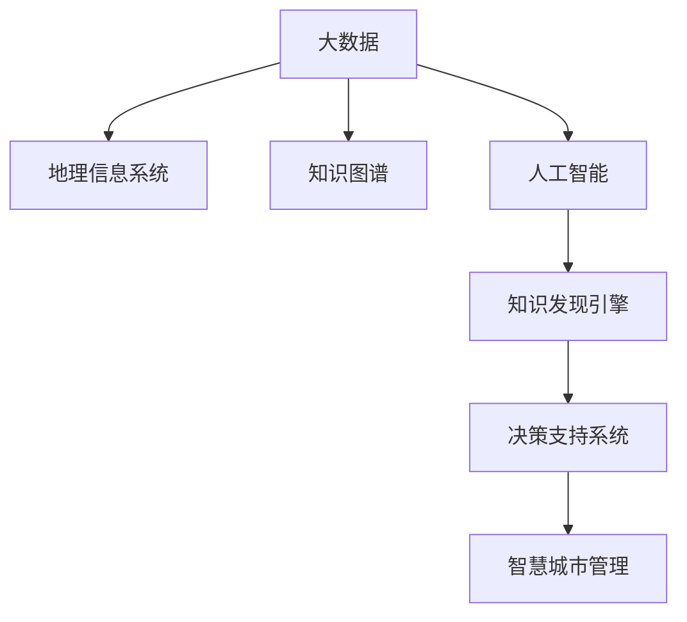

                 

# 知识发现引擎：推动智慧城市建设的蓝图

> 关键词：知识发现引擎, 智慧城市, 大数据, 机器学习, 地理信息系统, 城市管理, 决策支持系统

## 1. 背景介绍

### 1.1 问题由来
智慧城市作为新型城镇化的高级阶段，其核心在于充分整合、利用和共享城市各类数据资源，以提高城市治理的智能化水平。知识发现引擎作为智慧城市建设的关键基础设施，通过大数据、人工智能等技术手段，对城市数据进行深层次分析和挖掘，实现城市运行的全面监测、预测和优化。

当前，全球许多城市已提出智慧城市建设的目标，中国更是将智慧城市作为推进新型城镇化的重要战略。然而，智慧城市建设并非一蹴而就，而是需要从数据整合、平台构建、应用部署等环节逐一突破。其中，知识发现引擎的建设，是实现智慧城市战略的基石。

### 1.2 问题核心关键点
知识发现引擎的核心任务是对城市数据进行提炼、整理和分析，从中发现潜在的知识模式和决策信息，以辅助城市管理者进行科学决策。知识发现引擎的研究关键点包括：

- **数据整合**：如何将城市运行中的各类数据进行汇聚和融合，构建统一的数据中心。
- **技术选型**：如何选择合适的数据处理、分析与可视化技术，保证系统的高效稳定运行。
- **应用落地**：如何将发现的知识转化为可操作的管理措施，并成功部署到实际场景中。
- **系统治理**：如何建立系统的标准化、规范化和自动化管理机制，确保数据安全与隐私保护。

### 1.3 问题研究意义
知识发现引擎的建设，对推动智慧城市建设具有重大意义：

1. **优化城市治理**：通过深度挖掘城市运行数据，能够发现隐藏的问题和机会，提升城市管理的精细化和智能化水平。
2. **辅助决策支持**：利用知识发现引擎生成的可视化报告和分析结果，为城市管理者提供决策依据，避免拍脑袋决策。
3. **提升服务质量**：通过精确的数据分析和预测，能够为市民提供更为个性化的城市服务。
4. **促进技术创新**：智慧城市建设不仅是技术应用，更是技术的创新与迭代。知识发现引擎将推动更多创新技术在城市治理中的应用。
5. **赋能产业升级**：智慧城市建设将成为数字经济的重要驱动力，带来城市产业结构的转型升级。

## 2. 核心概念与联系

### 2.1 核心概念概述

为更好地理解知识发现引擎的核心技术，本节将介绍几个紧密相关的核心概念：

- **大数据**：指海量的、多源异构的城市运行数据，包括交通、环境、公共安全、能源等多个领域。
- **人工智能**：一种通过算法和模型来解析、处理、识别和利用数据的技术，涵盖机器学习、深度学习等。
- **地理信息系统（GIS）**：利用地理空间数据的存储、分析和管理技术，帮助分析地理空间信息。
- **知识图谱**：通过实体关系模型，对城市数据进行语义化整合，便于查询和推理。
- **决策支持系统（DSS）**：利用知识发现引擎的分析结果，辅助城市管理者进行科学决策的系统。

这些概念之间的逻辑关系可以通过以下Mermaid流程图来展示：



这个流程图展示了大数据、地理信息系统、人工智能、知识图谱和决策支持系统在大数据驱动的知识发现引擎中的联系和作用：

1. 大数据为知识发现引擎提供了数据源。
2. 地理信息系统通过空间位置信息，帮助分析城市运行状态。
3. 人工智能用于挖掘大数据中的隐含知识和模式。
4. 知识图谱通过语义化的实体关系模型，整合城市数据。
5. 决策支持系统将知识发现引擎的分析结果转化为可操作的管理措施。

这些概念共同构成了知识发现引擎的核心技术框架，使得系统能够高效、准确地提炼城市运行中的知识模式。

## 3. 核心算法原理 & 具体操作步骤
### 3.1 算法原理概述

知识发现引擎的核心算法原理主要围绕数据预处理、特征提取、模型训练、知识表示和结果可视等多个环节展开。

- **数据预处理**：对城市运行数据进行清洗、标准化和集成，去除噪声和冗余，保证数据质量。
- **特征提取**：利用统计方法、聚类分析等手段，将原始数据转化为特征向量，便于后续处理。
- **模型训练**：选择合适的算法模型，对特征向量进行训练，挖掘城市数据中的潜在知识。
- **知识表示**：将模型训练得到的知识转化为语义化的实体关系模型，便于存储和查询。
- **结果可视化**：将知识表示的结果以图表、报表等形式展示，为城市管理者提供直观的参考。

### 3.2 算法步骤详解

知识发现引擎的构建步骤如下：

**Step 1: 数据预处理**
- 数据清洗：去除数据中的噪声和异常值，保留有效数据。
- 数据标准化：对数据进行归一化、去偏处理，保证数据格式一致。
- 数据集成：对来自不同来源的数据进行整合，形成统一的数据视图。

**Step 2: 特征提取**
- 特征选择：使用特征选择算法，如信息增益、卡方检验等，选择有意义的特征。
- 特征降维：采用主成分分析、t-SNE等技术，对高维特征进行降维处理，减少计算复杂度。
- 特征编码：使用编码算法，如独热编码、嵌入编码等，将特征转化为数值型数据。

**Step 3: 模型训练**
- 数据划分：将数据划分为训练集和测试集，用于模型训练和验证。
- 模型选择：根据任务特点，选择合适的模型，如随机森林、支持向量机、深度神经网络等。
- 模型训练：使用训练集数据对模型进行训练，最小化损失函数。

**Step 4: 知识表示**
- 构建知识图谱：将模型训练得到的知识转化为语义化的实体关系模型，便于存储和查询。
- 知识融合：将不同数据源的知识图谱进行融合，形成统一的知识体系。
- 实体关系抽取：使用命名实体识别、关系抽取等技术，从数据中提取出实体和关系。

**Step 5: 结果可视化**
- 数据可视化：使用可视化技术，将知识表示的结果以图表、报表等形式展示。
- 交互式可视化：开发交互式可视化工具，允许用户自定义查询条件和可视化展示方式。

### 3.3 算法优缺点

知识发现引擎的构建，具有以下优点：

1. **精度高**：通过机器学习和大数据技术，可以从海量数据中挖掘出精确的知识模式。
2. **可扩展性好**：支持多种数据源的集成，能够灵活应对城市数据不断增长的需求。
3. **自动化程度高**：自动化处理数据清洗、特征提取、模型训练等环节，降低人工干预的难度。
4. **服务多样化**：支持多种形式的分析结果展示，满足不同用户的多样化需求。

然而，该方法也存在一定的局限性：

1. **数据质量依赖性高**：数据质量直接影响到模型的精度和结果的可靠性。
2. **计算资源消耗大**：处理海量数据需要较高的计算资源，对硬件设施要求较高。
3. **模型解释性不足**：复杂的机器学习模型往往难以解释其内部工作机制，影响模型的可信度。
4. **对领域知识需求高**：知识发现引擎的构建需要深厚的领域知识，对技术团队提出了较高要求。

### 3.4 算法应用领域

知识发现引擎技术已经在多个领域得到了广泛应用，以下是几个典型案例：

- **交通管理**：通过对交通数据的深度分析，识别交通瓶颈，优化交通流，提升城市交通效率。
- **环境监测**：利用环境数据，识别污染源，预测环境变化趋势，提供决策依据。
- **公共安全**：通过视频和传感器数据，识别异常行为，预警潜在风险，提高应急响应能力。
- **能源管理**：分析能源消耗数据，优化能源配置，降低能源浪费，推动绿色低碳城市建设。
- **教育服务**：利用学生数据，预测学习行为，提供个性化教育方案，提升教育质量。
- **健康医疗**：分析医疗数据，识别疾病趋势，辅助疾病预防和医疗决策。

这些应用领域展示了知识发现引擎的强大潜力和广泛应用前景，成为推动智慧城市建设的重要工具。

## 4. 数学模型和公式 & 详细讲解 & 举例说明

### 4.1 数学模型构建

知识发现引擎的数学模型构建主要包括以下几个关键步骤：

1. **数据表示**：将城市数据转化为数值型向量，用于特征提取和模型训练。
2. **特征选择**：从高维数据中选择有意义的特征，减少计算复杂度。
3. **模型训练**：使用机器学习算法，对特征向量进行训练，得到模型参数。
4. **知识表示**：将模型参数转化为知识图谱中的实体和关系。
5. **结果展示**：将知识表示的结果转化为可视化的图表和报表。

### 4.2 公式推导过程

以交通管理为例，知识发现引擎的构建公式如下：

$$
\text{特征向量} = \text{标准化}(\text{数据集})
$$

$$
\text{特征选择} = \text{信息增益}(\text{特征向量})
$$

$$
\text{模型参数} = \text{最小化}(\text{损失函数}, \text{训练集})
$$

$$
\text{知识图谱} = \text{实体关系模型}(\text{模型参数})
$$

$$
\text{结果展示} = \text{可视化}(\text{知识图谱})
$$

其中，数据标准化是指将数据转换为标准正态分布，以减少特征之间的尺度差异。信息增益用于选择最优的特征子集，支持向量机（SVM）或随机森林（Random Forest）等算法用于模型训练，最小化损失函数保证模型精度。最终，知识图谱通过实体关系模型表示，可视化技术将分析结果以图表、报表等形式展示。

### 4.3 案例分析与讲解

**交通管理案例分析**：

1. **数据预处理**：
   - 收集历史交通流量数据，包括车流量、车速、路段长度等。
   - 对数据进行清洗和标准化，去除噪声和偏置，保留有效数据。
   - 将不同来源的数据进行整合，形成一个统一的数据视图。

2. **特征提取**：
   - 选择交通流、车速、路段长度等作为特征。
   - 使用t-SNE技术对特征进行降维，降低计算复杂度。
   - 将特征进行编码，转化为数值型数据。

3. **模型训练**：
   - 使用随机森林算法对特征向量进行训练。
   - 最小化均方误差损失函数，保证模型精度。

4. **知识表示**：
   - 将随机森林模型训练得到的知识转化为知识图谱。
   - 提取交通流、车速、路段长度等实体，建立实体关系模型。

5. **结果展示**：
   - 使用可视化技术，将知识图谱以图表、报表等形式展示。
   - 允许用户自定义查询条件，展示交通流、车速、路段长度等关键指标。

通过这个案例，可以看出知识发现引擎在城市交通管理中的应用流程和关键技术。

## 5. 项目实践：代码实例和详细解释说明
### 5.1 开发环境搭建

在进行知识发现引擎的开发前，我们需要准备好开发环境。以下是使用Python进行知识发现引擎开发的Python环境配置流程：

1. 安装Anaconda：从官网下载并安装Anaconda，用于创建独立的Python环境。

2. 创建并激活虚拟环境：
```bash
conda create -n knowledge-engine python=3.8 
conda activate knowledge-engine
```

3. 安装Python关键库：
```bash
conda install numpy pandas scikit-learn matplotlib seaborn
```

4. 安装机器学习库：
```bash
pip install scikit-learn tensorflow keras
```

5. 安装地理信息系统库：
```bash
pip install shapely folium
```

完成上述步骤后，即可在`knowledge-engine`环境中开始知识发现引擎的开发。

### 5.2 源代码详细实现

这里我们以交通流量预测为例，给出使用Python和Scikit-learn库构建知识发现引擎的代码实现。

首先，定义数据预处理函数：

```python
import pandas as pd
import numpy as np
from sklearn.preprocessing import StandardScaler, MinMaxScaler

def preprocess_data(df):
    # 清洗数据
    df = df.dropna()
    # 标准化
    scaler = StandardScaler()
    df = scaler.fit_transform(df)
    # 降维
    scaler = MinMaxScaler()
    df = scaler.fit_transform(df)
    # 编码
    encoded_df = pd.get_dummies(df)
    return encoded_df
```

然后，定义特征选择函数：

```python
from sklearn.feature_selection import SelectKBest, f_classif

def select_features(df, k):
    selector = SelectKBest(f_classif, k)
    selected_features = selector.fit_transform(df, df['label'])
    feature_names = selector.get_support(indices=True)
    feature_names = [df.columns[i] for i in feature_names]
    return selected_features, feature_names
```

接着，定义模型训练函数：

```python
from sklearn.ensemble import RandomForestRegressor

def train_model(X, y):
    model = RandomForestRegressor(n_estimators=100)
    model.fit(X, y)
    return model
```

最后，定义结果展示函数：

```python
import matplotlib.pyplot as plt
import seaborn as sns

def visualize_result(X, y, model):
    plt.scatter(X[:, 0], y)
    plt.plot(X[:, 0], model.predict(X), color='red')
    plt.xlabel('X')
    plt.ylabel('y')
    plt.show()
```

### 5.3 代码解读与分析

让我们再详细解读一下关键代码的实现细节：

**数据预处理函数**：
- 对数据进行清洗，去除缺失值。
- 使用标准正态分布和最小-最大归一化对数据进行标准化和降维处理。
- 使用独热编码对特征进行编码。

**特征选择函数**：
- 使用卡方检验选择最优的k个特征。
- 获取特征名称，便于后续分析。

**模型训练函数**：
- 使用随机森林算法对特征向量进行训练。
- 返回训练好的模型。

**结果展示函数**：
- 将预测结果和实际值以散点图形式展示。
- 使用红色直线表示预测结果。

**主函数**：
```python
# 加载数据
data = pd.read_csv('traffic_data.csv')

# 数据预处理
X = data.drop('label', axis=1)
y = data['label']
X = preprocess_data(X)

# 特征选择
X_selected, feature_names = select_features(X, k=10)

# 模型训练
model = train_model(X_selected, y)

# 结果展示
visualize_result(X_selected, y, model)
```

### 5.4 运行结果展示

完成上述代码后，运行主函数，可以得到交通流量预测的散点图和预测结果。

## 6. 实际应用场景
### 6.1 智能交通系统

智能交通系统是知识发现引擎的重要应用领域，通过分析交通数据，能够优化交通流，提升城市交通效率。

在技术实现上，可以通过知识发现引擎对交通流量、车速、路段长度等数据进行深度分析，识别交通瓶颈和热点，预测交通流变化趋势，辅助交通管理部门进行智能调度。例如，可以利用知识发现引擎识别出高峰期的交通热点区域，合理调整信号灯周期，避免交通拥堵。

### 6.2 环境监测系统

环境监测系统通过知识发现引擎对环境数据进行综合分析，能够预测环境变化趋势，提供决策支持。

在技术实现上，可以利用知识发现引擎分析空气质量、水质、噪音等环境数据，识别出环境污染源和趋势变化，及时预警环境风险。例如，可以通过知识发现引擎分析历史数据，识别出污染源和污染物类型，制定针对性的环境治理方案。

### 6.3 公共安全系统

公共安全系统通过知识发现引擎对视频和传感器数据进行分析，能够识别异常行为，预警潜在风险。

在技术实现上，可以利用知识发现引擎分析视频和传感器数据，提取人员、车辆等实体信息，识别出异常行为和潜在的治安风险。例如，可以通过知识发现引擎对视频数据进行分析，识别出可疑人员和车辆，及时预警和处置。

### 6.4 未来应用展望

随着知识发现引擎技术的不断进步，未来将有更多场景得到应用，为智慧城市建设注入新的活力。

在智慧能源系统中，通过知识发现引擎对能源消耗数据进行深度分析，能够优化能源配置，降低能源浪费，推动绿色低碳城市建设。

在智慧教育系统中，通过知识发现引擎对学生数据进行深度分析，能够预测学习行为，提供个性化教育方案，提升教育质量。

在智慧医疗系统中，通过知识发现引擎对医疗数据进行深度分析，能够识别疾病趋势，辅助疾病预防和医疗决策。

## 7. 工具和资源推荐
### 7.1 学习资源推荐

为了帮助开发者系统掌握知识发现引擎的理论基础和实践技巧，这里推荐一些优质的学习资源：

1. 《数据科学与深度学习》系列博文：由大模型技术专家撰写，深入浅出地介绍了数据科学和深度学习的原理、工具和应用。

2. 《机器学习实战》书籍：详细讲解了机器学习的基本算法和实践技巧，适合初学者入门。

3. 《Python数据科学手册》书籍：介绍了Python在数据科学中的应用，涵盖数据预处理、特征工程、模型训练等多个环节。

4. Kaggle平台：全球最大的数据科学竞赛平台，提供丰富的数据集和算法竞赛，适合实战练习。

5. Coursera平台：提供来自世界顶尖大学和机构的在线课程，涵盖数据科学和人工智能的多个方向。

通过对这些资源的学习实践，相信你一定能够快速掌握知识发现引擎的精髓，并用于解决实际问题。

### 7.2 开发工具推荐

高效的开发离不开优秀的工具支持。以下是几款用于知识发现引擎开发的常用工具：

1. Python：作为数据科学和机器学习的主流语言，Python提供了丰富的库和框架，方便开发和部署。

2. Scikit-learn：基于Python的机器学习库，提供了丰富的算法和工具，适合各种数据挖掘和分析任务。

3. TensorFlow：由Google主导开发的深度学习框架，支持GPU加速，适合大规模深度学习模型的训练和推理。

4. Tableau：可视化分析工具，可将复杂的数据分析结果以直观的图表形式展示，方便用户理解。

5. GIS软件：如ArcGIS、Mapbox等，用于地理空间数据的存储和分析，支持空间位置信息的可视化展示。

6. Jupyter Notebook：交互式开发环境，方便开发者进行代码编写和结果展示。

合理利用这些工具，可以显著提升知识发现引擎的开发效率，加快创新迭代的步伐。

### 7.3 相关论文推荐

知识发现引擎技术的研究源于学界的持续研究。以下是几篇奠基性的相关论文，推荐阅读：

1. "Data Mining and Statistical Learning" - Peter Flach：详细讲解了数据挖掘和统计学习的原理和算法，是数据科学领域的经典教材。

2. "Introduction to Statistical Learning" - Gareth James等：介绍了统计学习的原理和应用，适合机器学习初学者。

3. "A Survey of Machine Learning Algorithms for Environmental and Ecological Data Mining" - Jianjun Zhang等：介绍了机器学习在环境数据分析中的应用，适合实际应用场景的参考。

4. "Knowledge Discovery in Databases" - Jugal K. Prahalad等：介绍了知识发现的原理和算法，适合理论研究和实践应用的结合。

这些论文代表了大数据驱动的知识发现引擎技术的发展脉络。通过学习这些前沿成果，可以帮助研究者把握学科前进方向，激发更多的创新灵感。

## 8. 总结：未来发展趋势与挑战
### 8.1 总结

本文对知识发现引擎的核心技术进行了全面系统的介绍。首先阐述了知识发现引擎在智慧城市建设中的重要地位，明确了其构建的关键步骤。其次，从原理到实践，详细讲解了知识发现引擎的数学模型和算法实现，给出了具体的代码实例和分析。同时，本文还广泛探讨了知识发现引擎在交通管理、环境监测、公共安全等众多领域的应用前景，展示了知识发现引擎的强大潜力。此外，本文精选了知识发现引擎的学习资源和开发工具，力求为开发者提供全方位的技术指引。

通过本文的系统梳理，可以看到，知识发现引擎技术正在成为智慧城市建设的关键基础设施，极大地提升城市治理的智能化水平。未来，伴随技术不断演进和优化，知识发现引擎将为智慧城市建设注入新的活力，推动城市管理迈向智能化新阶段。

### 8.2 未来发展趋势

展望未来，知识发现引擎技术将呈现以下几个发展趋势：

1. **大数据处理能力增强**：随着计算资源的不断提升，知识发现引擎将能够处理更大规模的数据集，进行更深入的知识挖掘。
2. **算法模型多样化**：结合深度学习、强化学习、知识图谱等新技术，知识发现引擎将变得更加智能和高效。
3. **可视化技术进步**：通过增强现实、虚拟现实等技术，知识发现引擎的可视化效果将更加直观和交互。
4. **领域知识融合**：结合行业专家的知识和经验，知识发现引擎将能够进行更精准的决策支持。
5. **实时分析能力提升**：通过分布式计算和边缘计算技术，知识发现引擎将实现实时数据分析和决策。
6. **隐私保护机制完善**：随着数据隐私保护的日益重视，知识发现引擎将引入更严格的数据安全机制。

以上趋势凸显了知识发现引擎技术的广阔前景。这些方向的探索发展，必将进一步提升智慧城市的数据处理能力和智能化水平，为城市治理带来新的变革。

### 8.3 面临的挑战

尽管知识发现引擎技术已经取得了显著成就，但在迈向更加智能化、普适化应用的过程中，仍面临诸多挑战：

1. **数据质量瓶颈**：数据的质量直接影响到知识发现引擎的精度和可靠性，如何获取高质量的数据是一个难题。
2. **计算资源消耗大**：处理大规模数据需要高性能计算资源，硬件设施的投入较大。
3. **模型复杂度高**：复杂的机器学习模型难以解释其内部工作机制，影响模型的可信度。
4. **隐私保护难题**：在数据共享和使用过程中，如何保障数据隐私和安全是一个重要挑战。
5. **实时性要求高**：智慧城市建设对知识发现引擎的实时性要求较高，如何提升系统的响应速度和处理能力是一个难题。

### 8.4 研究展望

面对知识发现引擎面临的挑战，未来的研究需要在以下几个方面寻求新的突破：

1. **多源数据融合**：结合不同数据源的数据，进行综合分析和挖掘，提升数据处理的全面性和准确性。
2. **计算资源优化**：利用分布式计算和边缘计算技术，优化知识发现引擎的计算资源使用。
3. **模型可解释性提升**：开发可解释性强的算法模型，增强系统输出的可信度。
4. **隐私保护技术创新**：引入隐私保护技术，如差分隐私、联邦学习等，保障数据安全。
5. **实时分析技术改进**：结合流处理和实时计算技术，实现知识发现引擎的实时分析。

这些研究方向的探索，必将引领知识发现引擎技术迈向更高的台阶，为智慧城市建设注入新的活力。面向未来，知识发现引擎将与物联网、大数据、人工智能等技术深度融合，共同推动智慧城市建设的不断进步。

## 9. 附录：常见问题与解答

**Q1：知识发现引擎是否适用于所有智慧城市应用场景？**

A: 知识发现引擎在智慧城市建设中的应用非常广泛，但对于一些需要高度实时性的应用场景，如无人驾驶、智能制造等，可能还需要结合其他技术手段进行优化。此外，对于需要深度理解和推理的任务，如医疗诊断、法律咨询等，知识图谱和符号计算等方法可能更为适合。

**Q2：如何选择合适的特征进行知识发现？**

A: 特征选择是知识发现引擎的关键环节，一般采用信息增益、卡方检验等方法选择最优的特征。特征选择时应综合考虑数据类型、领域知识、模型性能等多个因素，选择最能反映数据本质的特征。

**Q3：知识发现引擎的可视化展示有哪些方式？**

A: 知识发现引擎的可视化展示包括散点图、柱状图、折线图、热力图等多种方式。需要根据数据类型和分析目标选择适合的可视化形式，如对于时间序列数据，折线图和热力图更为合适。

**Q4：知识发现引擎的训练和优化过程中需要注意哪些问题？**

A: 在训练和优化过程中，需要注意以下问题：
1. 数据预处理：确保数据的质量和一致性，去除噪声和异常值。
2. 特征选择：选择有意义的特征，减少计算复杂度。
3. 模型选择：根据任务特点选择合适的算法模型，避免过拟合。
4. 超参数调优：通过网格搜索、贝叶斯优化等方法，优化模型参数。
5. 评估指标：选择合适的评估指标，如均方误差、准确率等，评估模型性能。

这些细节将直接影响知识发现引擎的精度和效果，需要在实践中不断优化和改进。

**Q5：知识发现引擎在智慧城市建设中的具体应用有哪些？**

A: 知识发现引擎在智慧城市建设中的具体应用包括：
1. 智能交通系统：通过分析交通数据，优化交通流，提升城市交通效率。
2. 环境监测系统：利用环境数据，预测环境变化趋势，提供决策支持。
3. 公共安全系统：通过分析视频和传感器数据，识别异常行为，预警潜在风险。
4. 智慧能源系统：对能源消耗数据进行深度分析，优化能源配置。
5. 智慧教育系统：利用学生数据，预测学习行为，提供个性化教育方案。
6. 智慧医疗系统：分析医疗数据，识别疾病趋势，辅助疾病预防和医疗决策。

这些应用展示了知识发现引擎在智慧城市建设中的重要地位和广泛应用前景。

---

作者：禅与计算机程序设计艺术 / Zen and the Art of Computer Programming

