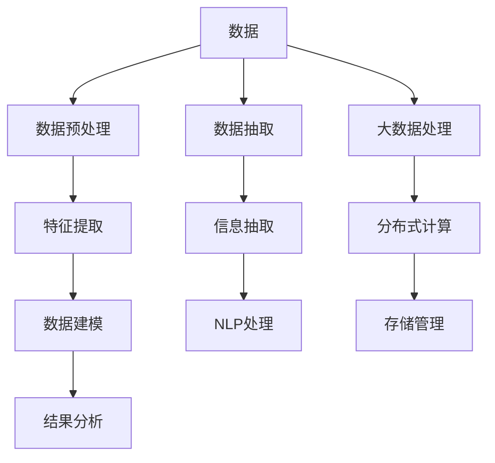

                 

# 知识发现引擎：知识与洞察力的完美结合体

> 关键词：知识发现,数据挖掘,大数据,人工智能,机器学习,统计分析

## 1. 背景介绍

### 1.1 问题由来
在信息爆炸的时代，人类社会每天产生的海量数据中蕴藏着宝贵的知识和洞察力。如何从这些数据中提取出有价值的信息，是现代企业和科研机构面临的重要挑战。知识发现引擎(Knowledge Discovery Engine, KDE)应运而生，它利用先进的机器学习、数据挖掘和大数据分析技术，自动分析和抽取数据中的潜在知识，为决策者和研究人员提供智能化的支持。

### 1.2 问题核心关键点
知识发现引擎的核心在于对大数据的分析、处理和抽取。它通过一系列先进的技术手段，从数据中提取模式、关联规则和趋势，帮助用户理解数据的本质，并从中发现潜在的商业价值和研究机会。

### 1.3 问题研究意义
开发和部署知识发现引擎，对于提升数据价值、优化决策流程、推动科学发现具有重要意义：

1. **提升决策效率**：通过自动化分析数据，知识发现引擎可以迅速提供洞察力，帮助管理者在更短的时间内做出更为精准的决策。
2. **降低分析成本**：自动化分析减少了人力和物力成本，使得知识发现和应用变得更加经济高效。
3. **推动科学创新**：在生命科学、社会科学等研究领域，知识发现引擎可以快速发现潜在的研究方向和突破点，加速科学发现的进程。
4. **提升商业价值**：在企业运营、产品开发等商业活动中，知识发现引擎能够帮助企业发现市场趋势、客户需求，优化产品设计和营销策略，从而提升竞争力和市场份额。

## 2. 核心概念与联系

### 2.1 核心概念概述

为更好地理解知识发现引擎的原理和架构，本节将介绍几个核心概念：

- **知识发现引擎(KDE)**：一种利用人工智能和大数据分析技术，自动从大数据中提取有价值知识的系统。
- **数据挖掘(Data Mining)**：从数据中提取出有价值的模式和关联规则的过程。
- **大数据(Big Data)**：指结构化和非结构化数据的海量集合，涉及分布式计算、存储和分析技术。
- **机器学习(Machine Learning)**：让计算机系统通过数据学习和改进的科学。
- **统计分析(Statistical Analysis)**：通过数学统计方法分析数据，发现数据中的规律和趋势。
- **信息抽取(Information Extraction)**：从结构化或非结构化数据中提取有用信息的过程。
- **自然语言处理(Natural Language Processing, NLP)**：让计算机理解和处理人类语言的科学。

这些核心概念之间的逻辑关系可以通过以下Mermaid流程图来展示：



这个流程图展示了大规模数据在知识发现引擎中的处理流程：

1. 数据从多种来源输入。
2. 首先进行数据预处理，包括清洗、归一化、采样等。
3. 特征提取从原始数据中提取出有用特征，用于后续建模。
4. 数据建模基于机器学习算法和模型，对特征进行建模和分析。
5. 结果分析对模型输出进行解释和展示，提供决策支持。
6. 数据抽取和信息抽取则针对结构化和非结构化数据，提取具体的实体和关系。
7. 大数据处理和分布式计算则支持大规模数据的高效存储和处理。
8. 存储管理确保数据在处理过程中的安全和稳定。

这些概念共同构成了知识发现引擎的工作原理和主要组成部分，使得引擎能够从海量数据中提取有价值的知识和洞察力。

## 3. 核心算法原理 & 具体操作步骤
### 3.1 算法原理概述

知识发现引擎的原理是利用机器学习、数据挖掘和大数据分析技术，从大规模数据中自动提取和分析模式、关联规则和趋势。其核心算法包括：

- **数据预处理**：清洗、归一化、采样等，为后续分析奠定基础。
- **特征提取**：从原始数据中提取出有价值的特征，用于构建模型。
- **数据建模**：基于机器学习算法和模型，对数据进行建模和分析，提取知识。
- **结果分析**：对模型输出进行解释和展示，提供决策支持。

### 3.2 算法步骤详解

知识发现引擎的运行过程一般包括以下几个关键步骤：

**Step 1: 数据收集与预处理**
- 收集来自不同来源的数据，包括结构化数据、半结构化数据、非结构化数据等。
- 对数据进行清洗、归一化、采样等预处理操作，去除噪声和无用信息。
- 使用数据挖掘技术进行特征提取，选择最相关的特征用于后续建模。

**Step 2: 特征提取**
- 使用特征提取技术从原始数据中提取出有用的特征，包括统计特征、文本特征、图像特征等。
- 特征提取技术包括主成分分析(PCA)、奇异值分解(SVD)、词袋模型、TF-IDF等。
- 特征选择和降维技术帮助去除冗余特征，提高模型效率。

**Step 3: 数据建模**
- 选择适合的机器学习算法进行建模，如分类、回归、聚类、关联规则挖掘等。
- 常用的算法包括决策树、随机森林、支持向量机(SVM)、神经网络等。
- 利用交叉验证等技术进行模型调优，确保模型泛化能力。

**Step 4: 结果分析与展示**
- 对模型输出进行分析和解释，提取知识点的规律和趋势。
- 使用可视化工具展示分析结果，如图表、报告等。
- 提供决策支持和建议，帮助用户理解和应用知识。

**Step 5: 模型评估与优化**
- 使用评估指标如准确率、召回率、F1分数等评估模型性能。
- 根据评估结果进行模型优化，包括参数调整、算法选择等。
- 引入新的数据或领域知识，进行模型迭代和升级。

### 3.3 算法优缺点

知识发现引擎具有以下优点：
1. 自动化分析：能够自动处理大规模数据，提取有价值的知识。
2. 高效率：快速分析和提取模式，节省了大量的人力和时间成本。
3. 泛化能力：基于机器学习算法，模型具有较好的泛化能力，能够适应新数据和新场景。
4. 适用广泛：适用于各种领域，如金融、医疗、零售、社交媒体等。

同时，该方法也存在一定的局限性：
1. 数据质量要求高：模型分析依赖于数据的质量和完整性，低质量数据可能导致错误分析。
2. 模型解释性不足：复杂的机器学习模型输出难以解释，难以理解其内部工作机制。
3. 数据隐私问题：大规模数据处理可能涉及数据隐私和伦理问题，需要严格的数据保护措施。
4. 对算力需求高：处理大规模数据需要高性能计算资源，成本较高。

尽管存在这些局限性，但知识发现引擎的自动化分析和高效提取模式的能力，使其成为现代企业和科研机构不可或缺的工具。未来相关研究的重点在于如何进一步降低算力需求，提高模型解释性，同时兼顾数据隐私和伦理安全性等因素。

### 3.4 算法应用领域

知识发现引擎在多个领域得到了广泛应用，包括但不限于：

- **金融**：利用大数据分析进行风险评估、投资决策、欺诈检测等。
- **医疗**：从电子病历、基因数据中提取知识，辅助疾病诊断和治疗。
- **零售**：通过客户行为数据分析，优化产品推荐、库存管理等。
- **社交媒体**：分析用户行为数据，进行情感分析、舆情监测等。
- **制造业**：通过设备运行数据进行预测维护、工艺优化等。
- **能源**：从能源消耗数据中提取模式，进行需求预测、优化调度等。

除了上述这些经典应用领域，知识发现引擎还在科学研究、政府管理、城市规划等领域发挥了重要作用。随着大数据技术的不断进步，知识发现引擎的应用范围将更加广泛。

## 4. 数学模型和公式 & 详细讲解 & 举例说明

### 4.1 数学模型构建

本节将使用数学语言对知识发现引擎的核心算法进行更加严格的刻画。

**Step 1: 数据预处理**

假设原始数据为 $\mathbf{X} = [\mathbf{x}_1, \mathbf{x}_2, ..., \mathbf{x}_n]$，其中 $\mathbf{x}_i \in \mathbb{R}^d$ 为第 $i$ 个样本，$d$ 为样本维度。

数据预处理包括清洗、归一化和采样等操作。清洗操作去除噪声和无用信息，归一化操作将数据缩放到标准化区间，采样操作则根据需求随机选择部分样本。

**Step 2: 特征提取**

假设数据预处理后的特征为 $\mathbf{F} = [\mathbf{f}_1, \mathbf{f}_2, ..., \mathbf{f}_n]$，其中 $\mathbf{f}_i = [f_{i1}, f_{i2}, ..., f_{id}]$。

特征提取技术包括主成分分析(PCA)和奇异值分解(SVD)。PCA将特征投影到低维空间，减少冗余特征，公式如下：

$$
\mathbf{U} = \text{UVD}
$$

其中 $\mathbf{U}$ 为特征矩阵，$\mathbf{V}$ 为投影矩阵，$\mathbf{D}$ 为对角矩阵。

SVD则将矩阵分解为三个矩阵的乘积，公式如下：

$$
\mathbf{X} = \mathbf{U}\mathbf{S}\mathbf{V^T}
$$

其中 $\mathbf{U}$ 和 $\mathbf{V}$ 为正交矩阵，$\mathbf{S}$ 为对角矩阵。

**Step 3: 数据建模**

假设选择的机器学习算法为 $M(\mathbf{F})$，其输出为模型参数 $\theta$，公式如下：

$$
\theta = M(\mathbf{F})
$$

其中 $M$ 为建模函数，可以选用分类算法、回归算法、聚类算法等。

**Step 4: 结果分析**

假设模型输出为 $\mathbf{Y} = [y_1, y_2, ..., y_n]$，其中 $y_i$ 为第 $i$ 个样本的预测值。

结果分析主要通过可视化工具展示分析结果，如绘制散点图、直方图、热力图等。

### 4.2 公式推导过程

以下我们以线性回归为例，推导其数学模型和求解过程。

假设样本 $(x_i, y_i)$，其中 $x_i \in \mathbb{R}$，$y_i \in \mathbb{R}$。线性回归模型的目标是最小化损失函数：

$$
L(\mathbf{X}, \mathbf{y}, \mathbf{\beta}) = \frac{1}{2N}\sum_{i=1}^N (y_i - \beta_0 - \beta_1x_i)^2
$$

其中 $\mathbf{X} = \begin{bmatrix} 1 & x_1 \\ 1 & x_2 \\ ... \\ 1 & x_n \end{bmatrix}$，$\mathbf{y} = \begin{bmatrix} y_1 \\ y_2 \\ ... \\ y_n \end{bmatrix}$，$\mathbf{\beta} = \begin{bmatrix} \beta_0 \\ \beta_1 \end{bmatrix}$ 为线性回归参数。

利用梯度下降算法求解上述最小化问题，目标函数关于 $\beta$ 的梯度为：

$$
\frac{\partial L}{\partial \beta} = \frac{1}{N}\mathbf{X^T}(\mathbf{y} - \mathbf{X}\mathbf{\beta})
$$

通过迭代更新参数 $\beta$，最终得到线性回归模型参数。

### 4.3 案例分析与讲解

假设某零售商想要分析客户购买行为，预测客户在未来一个月内购买某产品的概率。收集到以下数据：

| 客户ID | 年龄 | 性别 | 收入 | 历史购买次数 | 产品评价 |
| ------ | ---- | ---- | ---- | ------------ | -------- |

首先，对数据进行清洗、归一化和采样，然后使用主成分分析(PCA)提取特征。接下来，使用线性回归模型进行建模，得到模型参数 $\beta$。最后，将新客户的特征输入模型，输出预测概率。

## 5. 项目实践：代码实例和详细解释说明
### 5.1 开发环境搭建

在进行知识发现引擎实践前，我们需要准备好开发环境。以下是使用Python进行Scikit-learn开发的环境配置流程：

1. 安装Anaconda：从官网下载并安装Anaconda，用于创建独立的Python环境。

2. 创建并激活虚拟环境：
```bash
conda create -n kde-env python=3.8 
conda activate kde-env
```

3. 安装Scikit-learn：
```bash
pip install scikit-learn
```

4. 安装各类工具包：
```bash
pip install numpy pandas scikit-learn matplotlib tqdm jupyter notebook ipython
```

完成上述步骤后，即可在`kde-env`环境中开始知识发现引擎的实践。

### 5.2 源代码详细实现

这里我们以线性回归为例，给出使用Scikit-learn进行知识发现引擎开发的PyTorch代码实现。

首先，定义数据处理函数：

```python
import pandas as pd
import numpy as np
from sklearn.preprocessing import StandardScaler, MinMaxScaler
from sklearn.decomposition import PCA
from sklearn.linear_model import LinearRegression

def preprocess_data(data, scaler, scaling=True, n_components=1):
    if scaling:
        data = scaler.fit_transform(data)
    X = data[:, :-1]
    y = data[:, -1]
    X = PCA(n_components=n_components).fit_transform(X)
    return X, y
```

然后，定义线性回归模型：

```python
class LinearRegressionModel:
    def __init__(self, n_components=1):
        self.model = LinearRegression()
        self.scaler = StandardScaler()
        self.scaling = scaling
        self.n_components = n_components
        
    def fit(self, X, y):
        if self.scaling:
            X = self.scaler.fit_transform(X)
        self.model.fit(X, y)
    
    def predict(self, X):
        X = self.scaler.transform(X)
        return self.model.predict(X)
```

接着，定义训练和评估函数：

```python
from sklearn.metrics import mean_squared_error

def train_model(model, X_train, y_train, n_components=1):
    model.fit(X_train, y_train)
    y_pred = model.predict(X_train)
    mse = mean_squared_error(y_train, y_pred)
    return mse
    
def evaluate_model(model, X_test, y_test, n_components=1):
    X_test = PCA(n_components=n_components).fit_transform(X_test)
    y_pred = model.predict(X_test)
    mse = mean_squared_error(y_test, y_pred)
    return mse
```

最后，启动训练流程并在测试集上评估：

```python
from sklearn.model_selection import train_test_split

# 加载数据
data = pd.read_csv('data.csv')

# 定义特征和标签
X = data[['age', 'income', 'history']]
y = data['probability']

# 定义数据预处理器和模型
scaler = StandardScaler()
model = LinearRegressionModel(n_components=2)

# 划分训练集和测试集
X_train, X_test, y_train, y_test = train_test_split(X, y, test_size=0.2, random_state=42)

# 训练模型
train_mse = train_model(model, X_train, y_train)

# 评估模型
test_mse = evaluate_model(model, X_test, y_test)

print(f'Training MSE: {train_mse:.4f}')
print(f'Testing MSE: {test_mse:.4f}')
```

以上就是使用Scikit-learn进行线性回归知识发现引擎的完整代码实现。可以看到，得益于Scikit-learn的强大封装，我们可以用相对简洁的代码完成数据预处理、模型训练和评估。

### 5.3 代码解读与分析

让我们再详细解读一下关键代码的实现细节：

**preprocess_data函数**：
- `preprocess_data`方法：实现数据预处理，包括归一化、PCA降维等操作。
- `scaler`为归一化器，可以是StandardScaler或MinMaxScaler，根据需要选择合适的归一化方式。
- `scaling`参数控制是否进行归一化。
- `n_components`参数控制PCA降维的维数。

**LinearRegressionModel类**：
- `__init__`方法：初始化模型参数和归一化器。
- `fit`方法：训练线性回归模型，可选择是否进行归一化。
- `predict`方法：对新数据进行预测，返回预测结果。

**train_model和evaluate_model函数**：
- `train_model`方法：在训练集上训练模型，并返回均方误差(MSE)。
- `evaluate_model`方法：在测试集上评估模型，返回MSE。

**训练流程**：
- 加载数据，定义特征和标签。
- 定义数据预处理器和模型。
- 划分训练集和测试集。
- 在训练集上训练模型，计算训练MSE。
- 在测试集上评估模型，计算测试MSE。
- 输出训练和测试的MSE，评估模型效果。

可以看到，Scikit-learn使得知识发现引擎的开发变得简洁高效。开发者可以将更多精力放在模型选择、参数调优等高层逻辑上，而不必过多关注底层的实现细节。

当然，工业级的系统实现还需考虑更多因素，如模型保存和部署、超参数自动搜索、多模型集成等。但核心的知识发现引擎开发流程基本与此类似。

## 6. 实际应用场景
### 6.1 智能推荐系统

知识发现引擎在智能推荐系统中得到了广泛应用。通过分析用户行为数据，推荐系统能够发现用户的兴趣和偏好，从而进行个性化的推荐。

在技术实现上，可以收集用户的浏览历史、点击行为、购买记录等数据，使用知识发现引擎进行用户画像分析，提取用户特征。然后，将用户特征输入推荐模型，进行物品推荐。对于新用户，可以借助知识发现引擎进行用户画像补全，进一步提升推荐效果。

### 6.2 金融风险管理

金融行业需要实时监控市场风险，及时预警和防范风险。知识发现引擎可以通过分析海量交易数据，提取市场趋势和风险因子，为风险管理提供智能支持。

在实践中，可以收集金融市场的历史交易数据，使用知识发现引擎进行趋势分析和异常检测。然后，将分析结果输入风险管理模型，进行风险评估和预警。对于新出现的交易行为，知识发现引擎还可以进行实时监控和分析，及时调整风险策略。

### 6.3 医疗健康分析

医疗健康领域的数据量庞大且复杂，知识发现引擎能够帮助医疗机构提取有价值的信息，辅助诊断和治疗。

在实践中，可以收集电子病历、基因数据、患者记录等数据，使用知识发现引擎进行数据挖掘和模式分析。然后，将分析结果输入诊断模型，辅助医生进行疾病诊断和治疗方案制定。对于新患者，知识发现引擎还可以进行实时监控和分析，提供精准的医疗建议。

### 6.4 未来应用展望

随着知识发现引擎技术的不断发展，其在更多领域的应用前景将更加广阔。

在智慧城市治理中，知识发现引擎可以用于城市事件监测、舆情分析、应急指挥等环节，提高城市管理的自动化和智能化水平。在教育、旅游、交通等领域，知识发现引擎也能够提供智能化的决策支持和优化方案，提升用户满意度和服务质量。

## 7. 工具和资源推荐
### 7.1 学习资源推荐

为了帮助开发者系统掌握知识发现引擎的理论基础和实践技巧，这里推荐一些优质的学习资源：

1. 《数据挖掘导论》：李航著，系统介绍了数据挖掘的基本概念和技术，适合入门学习。
2. 《统计学习方法》：李航著，介绍了机器学习的基础理论和算法，对理解知识发现引擎有重要帮助。
3. 《Python数据科学手册》：Jake VanderPlas著，介绍了Python在数据科学和机器学习中的应用，包括Scikit-learn的使用。
4. 《机器学习实战》：Peter Harrington著，提供了大量机器学习实战案例，适合实践操作。
5. Coursera《数据科学专项课程》：由约翰霍普金斯大学提供，涵盖了数据科学和机器学习的各个方面，适合系统学习。

通过对这些资源的学习实践，相信你一定能够快速掌握知识发现引擎的精髓，并用于解决实际的NLP问题。
### 7.2 开发工具推荐

高效的开发离不开优秀的工具支持。以下是几款用于知识发现引擎开发的常用工具：

1. Python：Python是数据科学和机器学习的主流编程语言，生态系统丰富，有Scikit-learn、TensorFlow等库支持。
2. R语言：R是统计分析的重要工具，拥有大量的统计分析包，如ggplot2、dplyr等，适合数据可视化和统计分析。
3. Scikit-learn：Python的数据挖掘和机器学习库，封装了大量经典的算法和模型，简单易用。
4. TensorFlow：由Google开发的高性能深度学习框架，支持分布式计算和大规模数据处理。
5. Weights & Biases：模型训练的实验跟踪工具，可以记录和可视化模型训练过程中的各项指标，方便对比和调优。
6. TensorBoard：TensorFlow配套的可视化工具，可实时监测模型训练状态，并提供丰富的图表呈现方式。

合理利用这些工具，可以显著提升知识发现引擎的开发效率，加快创新迭代的步伐。

### 7.3 相关论文推荐

知识发现引擎和数据挖掘领域的研究日新月异，以下是几篇奠基性的相关论文，推荐阅读：

1. "An Introduction to Statistical Learning" by Gareth James, Daniela Witten, Trevor Hastie, Robert Tibshirani：介绍了统计学习方法的基础理论和算法，为理解知识发现引擎提供了理论基础。
2. "Data Mining: Concepts and Techniques" by Jeffrey Heer, Ruby Chang：系统介绍了数据挖掘的基本概念和技术，包括数据清洗、特征提取、模式挖掘等。
3. "Machine Learning Yearning" by Andrew Ng：Andrew Ng的最新著作，介绍了机器学习在实际应用中的技术和策略，适合实践操作。
4. "Big Data: Principles and Best Practices of Scalable Real-time Data Systems" by Nathan Marz, James Warren：介绍了大数据处理的基础理论和最佳实践，适合了解大数据技术在知识发现引擎中的应用。
5. "Neural Networks and Deep Learning" by Michael Nielsen：介绍了神经网络和深度学习的基础理论和应用，适合了解知识发现引擎中的深度学习算法。

这些论文代表了大数据和机器学习领域的研究进展，通过学习这些前沿成果，可以帮助研究者把握学科前进方向，激发更多的创新灵感。

## 8. 总结：未来发展趋势与挑战
### 8.1 总结

本文对知识发现引擎的原理、算法和实践进行了全面系统的介绍。首先阐述了知识发现引擎的背景和研究意义，明确了其在大数据处理和知识提取中的关键作用。其次，从原理到实践，详细讲解了知识发现引擎的核心算法和操作步骤，给出了具体的代码实现。同时，本文还探讨了知识发现引擎在多个领域的应用前景，展示了其在智能推荐、金融风险管理、医疗健康分析等场景中的强大能力。

通过本文的系统梳理，可以看到，知识发现引擎技术在现代数据分析和决策支持中发挥了至关重要的作用，极大地提升了数据价值和决策效率。未来，随着数据量的持续增长和技术进步，知识发现引擎的应用范围将更加广泛，成为推动各个行业智能化发展的重要工具。

### 8.2 未来发展趋势

展望未来，知识发现引擎技术将呈现以下几个发展趋势：

1. 大数据处理技术的进一步发展：随着硬件技术的进步，知识发现引擎能够处理更大规模、更复杂的数据集。
2. 深度学习算法在知识发现中的应用：深度学习算法在图像识别、自然语言处理等领域表现优异，未来将在知识发现中发挥更大的作用。
3. 知识图谱和语义网络的应用：知识图谱和语义网络能够更好地整合和表示知识，为知识发现引擎提供更多的信息支持。
4. 实时分析和流式数据处理：知识发现引擎将能够处理实时数据流，快速发现和应对数据变化。
5. 多模态数据的融合：知识发现引擎将能够融合多种数据类型，如文本、图像、语音等，进行多模态数据的整合分析。

这些趋势将使得知识发现引擎在处理复杂数据和提取高价值信息方面发挥更大作用，推动其在更多行业和领域的应用。

### 8.3 面临的挑战

尽管知识发现引擎在许多领域展示了其巨大潜力，但在实际应用中也面临诸多挑战：

1. 数据质量和隐私问题：数据质量和隐私保护是知识发现引擎的关键挑战，如何保证数据的完整性和安全性，需要更多的技术手段和法规支持。
2. 算法复杂性和可解释性：知识发现引擎使用的机器学习算法通常较为复杂，难以解释其内部工作机制，需要更多的解释性技术和可视化工具。
3. 计算资源需求高：知识发现引擎需要处理大量数据，对计算资源和存储资源的要求较高，需要更为高效的算法和架构。
4. 跨领域知识整合：知识发现引擎需要与各领域专家合作，整合跨领域知识，才能提取更为全面的信息。
5. 数据驱动决策的信任度：如何建立对知识发现引擎输出的信任，需要更多的验证和评估机制。

尽管面临诸多挑战，但随着技术不断进步和完善，知识发现引擎的应用前景将更加广阔。未来，通过进一步优化算法和架构，提升数据质量和隐私保护，知识发现引擎将更好地服务于各行各业，推动智能化的发展进程。

### 8.4 研究展望

未来，知识发现引擎的研究将集中在以下几个方向：

1. 算法创新：开发新的算法和技术，提高知识发现的效率和准确性。
2. 数据质量提升：研究如何提升数据质量和隐私保护，确保知识发现引擎的可靠性和安全性。
3. 多模态数据融合：研究如何将不同类型的数据整合，提高知识发现的全面性和准确性。
4. 实时分析和流式数据处理：研究如何处理实时数据流，快速发现和应对数据变化。
5. 人工智能与知识发现的融合：研究如何将人工智能技术（如深度学习、自然语言处理等）与知识发现引擎结合，提高知识发现的智能化水平。

这些研究方向将推动知识发现引擎技术的进一步发展，为各行各业提供更为智能化的决策支持和优化方案。

## 9. 附录：常见问题与解答

**Q1：知识发现引擎是否适用于所有领域？**

A: 知识发现引擎在大多数领域都有应用，特别是在大数据处理和模式分析方面表现优异。但一些特定领域，如医疗、法律等，可能需要进一步定制化的数据预处理和模型设计。

**Q2：知识发现引擎的计算资源需求高吗？**

A: 知识发现引擎需要处理大量数据，对计算资源和存储资源的需求较高。因此，需要使用高性能计算设备和大规模分布式系统，如Hadoop、Spark等。

**Q3：知识发现引擎如何提高数据质量？**

A: 提高数据质量是知识发现引擎的重要挑战之一。可以通过数据清洗、异常检测、缺失值处理等技术，提升数据完整性和准确性。

**Q4：知识发现引擎的算法复杂性如何处理？**

A: 知识发现引擎的算法通常较为复杂，难以解释其内部工作机制。可以通过可视化工具、解释性技术，如LIME、SHAP等，提升算法的可解释性。

**Q5：知识发现引擎在医疗领域的应用前景如何？**

A: 在医疗领域，知识发现引擎可以用于电子病历分析、基因数据挖掘、疾病预测等，辅助医生进行诊断和治疗。未来，随着更多数据的积累和算法优化，知识发现引擎在医疗领域的应用前景将更加广阔。

通过这些问题的回答，相信读者对知识发现引擎的应用场景、技术难点和未来发展方向有了更清晰的认识。知识发现引擎作为现代数据分析和决策支持的重要工具，其研究和应用将持续推动各个行业的发展和创新。

---

作者：禅与计算机程序设计艺术 / Zen and the Art of Computer Programming

