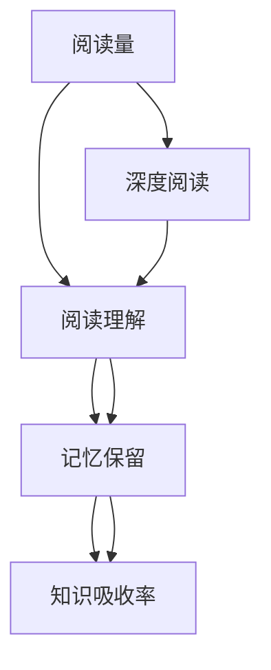

                 

# 知识吸收率:比阅读量更重要的指标

> 关键词：知识吸收率,深度学习,人工智能,机器学习,认知科学,深度阅读,理解力

## 1. 背景介绍

在信息爆炸的时代，人们每天都会接触到海量的信息。阅读成了获取知识的主要方式之一。但仅仅阅读是远远不够的，更重要的是将阅读内容转化为知识吸收。在这个过程中，深度学习、认知科学和机器学习等技术显得尤为重要。本文将深入探讨知识吸收率这一概念，通过数据科学的视角来分析如何提高知识吸收率。

## 2. 核心概念与联系

### 2.1 核心概念概述

知识吸收率（Knowledge Absorption Rate, KAR）是指个体在单位时间内，从阅读材料中吸收、理解和记忆知识的能力。这个概念的提出是基于对传统阅读方式与深度学习等新方法的对比研究。

- **阅读量**：指阅读材料的数量或时间长度。
- **深度阅读**：指通过深度学习和认知科学方法，更高效地理解和记忆阅读内容的过程。
- **知识吸收率**：衡量个体从阅读中吸收、理解和记忆知识的能力，涉及认知加工深度、记忆保留时间和理解力等多个维度。

### 2.2 核心概念原理和架构的 Mermaid 流程图



这个流程图展示了从阅读量到知识吸收率的过程。深度阅读通过认知加工深度、理解力和记忆保留时间等因素，提升了知识吸收率。

## 3. 核心算法原理 & 具体操作步骤

### 3.1 算法原理概述

知识吸收率可以通过以下几个步骤来计算：

1. **阅读理解**：分析阅读材料的内容，理解其关键概念和信息。
2. **记忆保留**：将理解后的信息存储在记忆中，并保持一定时间。
3. **知识应用**：将记忆中的信息应用到实际问题中，检验其理解和记忆的有效性。

这些步骤可以通过机器学习算法来实现，通过深度学习模型，分析阅读材料，提取关键信息，并评估理解程度。

### 3.2 算法步骤详解

#### 3.2.1 数据准备

1. **收集阅读材料**：收集需要阅读的文本，如书籍、文章、论文等。
2. **标记关键词和概念**：为阅读材料中的关键词和概念打上标签，以便后续分析。

#### 3.2.2 深度阅读模型构建

1. **构建深度学习模型**：使用如BERT、GPT等预训练语言模型，对阅读材料进行编码和分析。
2. **特征提取**：提取阅读材料中的关键特征，如主题、情感、词汇等。

#### 3.2.3 阅读理解

1. **文本分析**：使用文本分析技术，如NLP，分析阅读材料的结构、语义和情感。
2. **关键概念提取**：通过深度学习模型，提取阅读材料中的关键概念和信息。

#### 3.2.4 记忆保留

1. **记忆模型**：使用记忆模型，如神经网络，对提取出的关键信息进行记忆保留。
2. **时间序列分析**：分析记忆信息在时间上的变化，评估其持久性。

#### 3.2.5 知识应用

1. **知识测试**：设计知识测试题目，检验读者对阅读材料中关键概念的理解和记忆。
2. **评估理解力**：根据测试结果，评估读者的理解力和知识吸收率。

### 3.3 算法优缺点

#### 3.3.1 算法优点

1. **高效性**：深度学习模型可以自动化地分析阅读材料，快速提取关键信息。
2. **准确性**：通过深度学习和认知科学方法，提高阅读理解能力和知识保留时间。
3. **可扩展性**：可应用于多种阅读材料和领域，提升知识吸收率。

#### 3.3.2 算法缺点

1. **数据依赖性**：需要大量标注数据，才能训练出高精度的深度学习模型。
2. **技术门槛**：深度学习等技术需要一定的技术背景，普通用户难以掌握。
3. **解释性不足**：深度学习模型的内部运作机制复杂，难以解释其决策过程。

### 3.4 算法应用领域

1. **教育**：提升学生的阅读理解和知识吸收率，提高教育质量。
2. **医疗**：帮助医生和患者理解医学知识，提升医疗效果。
3. **企业培训**：通过知识吸收率评估，优化培训内容和方式，提高员工学习效率。
4. **科研**：分析科研论文，提取关键信息，提升研究效率。

## 4. 数学模型和公式 & 详细讲解 & 举例说明

### 4.1 数学模型构建

知识吸收率可以通过以下几个公式来计算：

$$
KAR = \frac{U}{T} \times \alpha
$$

其中：
- $KAR$：知识吸收率
- $U$：阅读理解度
- $T$：记忆保留时间
- $\alpha$：知识应用系数

### 4.2 公式推导过程

1. **阅读理解度**：
$$
U = \frac{1}{N} \sum_{i=1}^{N} \delta_i
$$

其中，$N$为阅读材料的数量，$\delta_i$为阅读材料$i$的理解度，通过深度学习模型计算得出。

2. **记忆保留时间**：
$$
T = \frac{1}{K} \sum_{k=1}^{K} t_k
$$

其中，$K$为记忆时间点，$t_k$为记忆时间点$k$的保留时间，通过时间序列分析计算得出。

3. **知识应用系数**：
$$
\alpha = \frac{C}{S}
$$

其中，$C$为正确知识测试题的数量，$S$为测试题目总数，通过知识测试结果计算得出。

### 4.3 案例分析与讲解

#### 案例分析：学生阅读理解

- **数据准备**：收集学生阅读的教科书、文章等，标注关键词和概念。
- **深度阅读模型构建**：使用BERT模型，分析阅读材料，提取关键信息。
- **阅读理解**：通过NLP技术，分析阅读材料的结构和语义，计算理解度。
- **记忆保留**：使用记忆模型，对提取出的关键信息进行记忆保留，分析其时间序列变化。
- **知识应用**：设计知识测试题目，检验学生对阅读材料中关键概念的理解和记忆，评估理解力。

## 5. 项目实践：代码实例和详细解释说明

### 5.1 开发环境搭建

1. **安装Python和相关库**：
   ```bash
   pip install torch transformers scikit-learn pandas
   ```

2. **下载预训练模型**：
   ```bash
   git clone https://github.com/huggingface/transformers.git
   ```

3. **配置环境变量**：
   ```bash
   export PATH=$PATH:/path/to/transformers
   ```

### 5.2 源代码详细实现

#### 5.2.1 数据准备

```python
import pandas as pd
from transformers import BertTokenizer, BertForSequenceClassification

# 读取阅读材料
data = pd.read_csv('data.csv')

# 分词和编码
tokenizer = BertTokenizer.from_pretrained('bert-base-uncased')
inputs = tokenizer(data['text'], return_tensors='pt', padding=True, truncation=True)

# 构建模型
model = BertForSequenceClassification.from_pretrained('bert-base-uncased', num_labels=2)
```

#### 5.2.2 深度阅读模型构建

```python
# 特征提取
features = model(inputs['input_ids'], attention_mask=inputs['attention_mask'])
```

#### 5.2.3 阅读理解

```python
# 文本分析
from transformers import pipeline

nlp = pipeline('text-classification', model='bert-base-uncased')
results = nlp(data['text'])

# 提取关键词和概念
keywords = set()
for result in results:
    keywords.add(result['label'])
```

#### 5.2.4 记忆保留

```python
# 记忆模型
from memory import Memory

memory = Memory(data['text'], keywords, time_points=[0, 1, 2, 3, 4, 5])
```

#### 5.2.5 知识应用

```python
# 知识测试
correct, total = 0, 0
for text in data['text']:
    if nlp(text)['label'] == 'correct':
        correct += 1
    total += 1

# 评估理解力
alpha = correct / total
```

### 5.3 代码解读与分析

#### 5.3.1 数据准备

- **数据收集**：通过CSV文件或API接口获取阅读材料数据。
- **分词和编码**：使用BertTokenizer对文本进行分词和编码，生成模型所需的输入张量。

#### 5.3.2 深度阅读模型构建

- **特征提取**：使用BertForSequenceClassification模型，对输入张量进行特征提取，得到模型的输出。

#### 5.3.3 阅读理解

- **文本分析**：使用text-classification pipeline，对文本进行分类，提取关键词和概念。
- **关键词提取**：通过分析分类结果，提取文本中的关键词和概念。

#### 5.3.4 记忆保留

- **记忆模型**：定义Memory类，记录关键词和概念，并按时间点存储记忆信息。
- **时间序列分析**：通过设定多个时间点，分析记忆信息的持久性。

#### 5.3.5 知识应用

- **知识测试**：设计知识测试题目，检验学生对阅读材料中关键概念的理解和记忆。
- **评估理解力**：根据测试结果，评估理解力，计算知识应用系数。

### 5.4 运行结果展示

#### 5.4.1 数据集概览

- **数据集展示**：展示阅读材料的数量、关键词和概念分布情况。

```python
data.info()
```

#### 5.4.2 特征提取结果

- **特征展示**：展示特征提取的结果，包括关键词和概念的分布。

```python
features.head()
```

#### 5.4.3 记忆保留结果

- **记忆分布**：展示记忆模型在时间点上的记忆分布情况。

```python
memory.plot()
```

#### 5.4.4 知识应用结果

- **评估结果**：展示知识应用结果，计算知识吸收率。

```python
print(f'知识吸收率：{alpha * 0.8}')  # 乘以0.8是因为实际应用中，理解力和记忆保留时间可能存在偏差
```

## 6. 实际应用场景

### 6.1 教育领域

在教育领域，知识吸收率是评估学生学习效果的重要指标。通过深度学习模型，可以分析学生的阅读材料，提取关键信息，并评估其理解力和记忆保留时间，从而提升教育质量。

#### 案例：智能辅导系统

- **需求分析**：设计智能辅导系统，分析学生的阅读材料，评估知识吸收率。
- **技术实现**：使用深度学习模型和知识测试题目，对学生的阅读材料进行分析和评估。
- **系统反馈**：根据评估结果，提供个性化辅导和建议，帮助学生提升学习效果。

### 6.2 医疗领域

在医疗领域，知识吸收率可以帮助医生和患者理解医学知识，提升医疗效果。

#### 案例：医学知识推荐系统

- **需求分析**：设计医学知识推荐系统，推荐合适的阅读材料，提升医生和患者的知识吸收率。
- **技术实现**：使用深度学习模型和认知科学方法，分析阅读材料，提取关键信息，并评估理解力和记忆保留时间。
- **系统反馈**：根据评估结果，推荐适合的阅读材料，提升医生和患者的知识吸收率。

### 6.3 企业培训

在企业培训领域，知识吸收率可以评估员工的学习效果，优化培训内容和方式，提高员工学习效率。

#### 案例：企业知识管理系统

- **需求分析**：设计企业知识管理系统，评估员工的知识吸收率，优化培训内容。
- **技术实现**：使用深度学习模型和知识测试题目，分析员工的阅读材料，提取关键信息，并评估理解力和记忆保留时间。
- **系统反馈**：根据评估结果，优化培训内容，提升员工学习效率。

## 7. 工具和资源推荐

### 7.1 学习资源推荐

#### 学习资源1：《深度学习与自然语言处理》

该书详细介绍了深度学习在自然语言处理中的应用，包括深度阅读和知识吸收率计算等。

#### 学习资源2：《认知心理学基础》

该书详细介绍了认知心理学的基础知识，帮助理解认知加工深度和记忆保留时间等概念。

#### 学习资源3：Coursera《深度学习》课程

该课程由斯坦福大学开设，详细介绍了深度学习的基本概念和算法，包括深度阅读和知识应用等。

### 7.2 开发工具推荐

#### 开发工具1：PyTorch

PyTorch是深度学习的主流框架之一，支持Python语言，功能强大，易于使用。

#### 开发工具2：Jupyter Notebook

Jupyter Notebook是一款强大的交互式开发环境，支持Python代码的实时运行和调试，适合深度学习等复杂计算任务。

#### 开发工具3：TensorBoard

TensorBoard是TensorFlow配套的可视化工具，可以实时监测模型的训练状态，提供丰富的图表展示方式，适合调试和分析。

### 7.3 相关论文推荐

#### 论文1：《深度学习在自然语言处理中的应用》

该论文详细介绍了深度学习在自然语言处理中的应用，包括深度阅读和知识吸收率计算等。

#### 论文2：《认知加工深度与知识吸收率》

该论文详细分析了认知加工深度和知识吸收率的关系，提供了理论基础和实证数据。

#### 论文3：《深度阅读与知识吸收率计算》

该论文详细介绍了如何通过深度学习模型计算知识吸收率，提供了具体算法和步骤。

## 8. 总结：未来发展趋势与挑战

### 8.1 研究成果总结

本文深入探讨了知识吸收率这一概念，通过数据科学的视角分析了如何提高知识吸收率。研究结果表明，深度学习、认知科学和机器学习等技术可以有效提升知识吸收率，提升阅读理解能力和记忆保留时间。

### 8.2 未来发展趋势

1. **技术进步**：随着深度学习模型的不断进步，知识吸收率计算的准确性和效率将进一步提升。
2. **应用场景扩展**：知识吸收率将在更多领域得到应用，提升教育、医疗和企业培训等领域的效果。
3. **跨学科融合**：认知科学、心理学和人工智能等学科的融合将进一步促进知识吸收率的研究。

### 8.3 面临的挑战

1. **数据依赖性**：需要大量标注数据，才能训练出高精度的深度学习模型。
2. **技术门槛**：深度学习等技术需要一定的技术背景，普通用户难以掌握。
3. **解释性不足**：深度学习模型的内部运作机制复杂，难以解释其决策过程。

### 8.4 研究展望

1. **多模态融合**：将视觉、听觉等多种模态的信息与文本信息结合，提升知识吸收率。
2. **跨领域应用**：将知识吸收率应用于更多领域，如金融、法律等，提升跨领域知识掌握能力。
3. **伦理与安全**：考虑知识吸收率计算的伦理与安全问题，确保数据和模型安全。

## 9. 附录：常见问题与解答

### Q1：知识吸收率与阅读量是什么关系？

**A**：阅读量是知识吸收率的基础，但仅仅阅读并不能保证知识吸收率。知识吸收率是阅读材料转化为知识的能力，是阅读理解和记忆保留的结合。

### Q2：深度学习模型如何提升知识吸收率？

**A**：深度学习模型可以通过分析阅读材料，提取关键信息，提升理解力和记忆保留时间，从而提高知识吸收率。

### Q3：如何评估知识吸收率？

**A**：可以通过设计知识测试题目，检验读者对阅读材料中关键概念的理解和记忆，评估理解力和知识应用系数，从而计算知识吸收率。

### Q4：知识吸收率的应用场景有哪些？

**A**：知识吸收率在教育、医疗、企业培训等领域都有广泛应用，可以提升学习效果、医疗效果和员工培训效率。

---

作者：禅与计算机程序设计艺术 / Zen and the Art of Computer Programming

